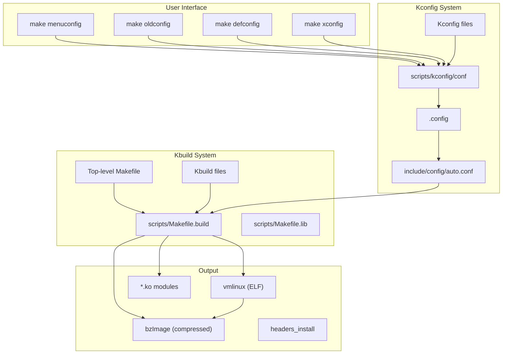
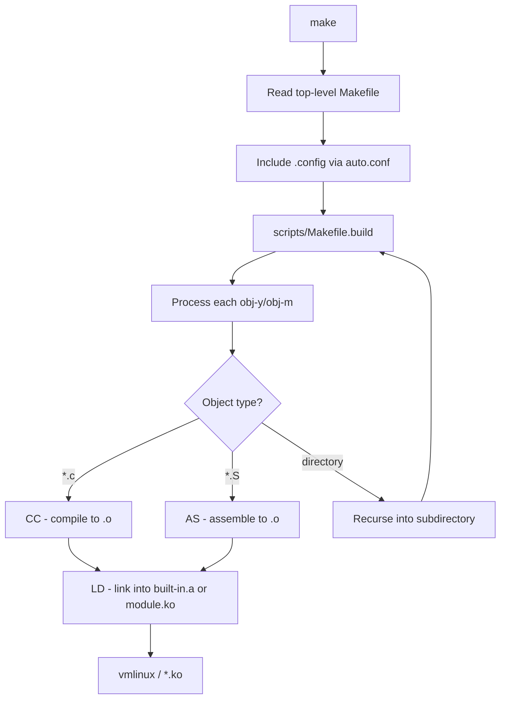

# Kernel Build System (Kconfig/Kbuild)

## Introduction

The Linux kernel build system is one of the most sophisticated build systems in open-source software. It must handle:

- Cross-compilation for dozens of architectures
- Thousands of configuration options with complex dependencies
- Parallel compilation across multiple cores
- Incremental builds that minimize recompilation
- Both built-in and modular compilation targets

The build system consists of two main components: **Kconfig** (configuration) and **Kbuild** (compilation). Together, they allow a single `make` command to produce a complete kernel image from thousands of source files.

## Build System Architecture



## Kconfig System

### Kconfig Language

The Kconfig language defines configuration symbols and their properties. Each `Kconfig` file describes a group of configuration options.

#### Basic Syntax

```kconfig
# Comment line
config MY_FEATURE
    bool "Enable my feature"
    depends on OTHER_FEATURE
    default y if OTHER_FEATURE
    default n
    help
      This option enables my feature.
      If unsure, say N.

config MY_VALUE
    int "Set buffer size"
    range 64 65536
    default 4096
    depends on MY_FEATURE
    help
      Size of the buffer in bytes.
```

#### Symbol Types

| Type | Description | Example |
|------|-------------|---------|
| `bool` | Boolean (y/n) | `bool "Enable debug"` |
| `tristate` | Three-state (y/m/n) | `tristate "Module support"` |
| `int` | Integer | `int "Buffer size"` |
| `hex` | Hexadecimal | `hex "Base address"` |
| `string` | String | `string "Default path"` |

#### Dependencies

```kconfig
# Simple dependency
config FEATURE_A
    bool "Feature A"
    depends on FEATURE_B

# Multiple dependencies (AND)
config FEATURE_C
    bool "Feature C"
    depends on FEATURE_A && FEATURE_B

# OR dependency
config FEATURE_D
    bool "Feature D"
    depends on FEATURE_A || FEATURE_B

# Negation
config FEATURE_E
    bool "Feature E"
    depends on !FEATURE_A

# Select — force-enable another symbol
config FEATURE_F
    bool "Feature F"
    select FEATURE_B  # enables FEATURE_B when F is enabled

# imply — prefer-enable another symbol
config FEATURE_G
    bool "Feature G"
    imply FEATURE_B   # enables B unless user explicitly disabled it
```

#### Menus and Choices

```kconfig
# Menu — groups options visually
menu "Advanced Options"
    depends on EXPERT

config OPTION_1
    bool "Option 1"

config OPTION_2
    int "Option 2 value"
endmenu

# Choice — select exactly one option
choice
    prompt "Default console loglevel"
    default CONSOLE_LOGLEVEL_DEFAULT

config CONSOLE_LOGLEVEL_QUIET
    bool "Quiet (1)"

config CONSOLE_LOGLEVEL_DEFAULT
    bool "Default (7)"

config CONSOLE_LOGLEVEL_DEBUG
    bool "Debug (15)"
endchoice
```

#### Visibility and Prompts

```kconfig
config MY_OPTION
    bool
    default y
    # No prompt — invisible to user, auto-set

config MY_OPTION_2
    bool "Visible option"
    # Has prompt — visible in menuconfig

# Conditional prompt
config MY_OPTION_3
    bool "Option 3" if EXPERT
    default n
```

### Real-World Kconfig Example

From `drivers/net/ethernet/intel/e1000e/Kconfig`:

```kconfig
config E1000E
    tristate "Intel(R) PRO/1000 PCI-Express Gigabit Ethernet support"
    depends on PCI && (!UML || BROKEN)
    imply PTP_1588_CLOCK
    depends on PTP_1588_CLOCK_OPTIONAL || !PTP_1588_CLOCK_OPTIONAL
    select CRC32
    select NET_DEV_HAS_HW_TIME_STAMP
    select PHYLINK
    help
      This driver supports the Intel PRO/1000 PCI-Express family of
      Gigabit Ethernet adapters.

      For general information and support, go to the Intel support
      website at: http://support.intel.com

      More specific information on configuring the driver is in
      <file:Documentation/networking/device-drivers/ethernet/intel/e1000e.rst>.

      To compile this driver as a module, choose M here. The module
      will be called e1000e.
```

### Kconfig Parsing

The Kconfig system is parsed by `scripts/kconfig/conf` (text) or `scripts/kconfig/mconf` (ncurses):

```bash
# View Kconfig dependencies graphically
$ make DOT_CONFIG=1 scriptconfig SCRIPT=scripts/diffconfig

# Show all config options
$ make listnewconfig

# Show config options that have changed
$ make listnewconfig 2>&1 | grep "NEW"
```

## Kbuild System

### Top-Level Makefile

The top-level Makefile orchestrates the entire build process:

```makefile
# Top-level Makefile (simplified)
VERSION = 6
PATCHLEVEL = 1
SUBLEVEL = 0
EXTRAVERSION =

# Default target
all: vmlinux

# Include auto.conf (generated by Kconfig)
-include include/config/auto.conf

# Architecture-specific settings
ARCH ?= $(SUBARCH)
CROSS_COMPILE ?=

# Main build targets
vmlinux: scripts/have_initcalls $(vmlinux-deps) FORCE
	+$(call if_changed,link-vmlinux)

modules: $(MODORDER) FORCE
	$(Q)$(MAKE) -f $(srctree)/scripts/Makefile.modpost
	$(Q)$(MAKE) -f $(srctree)/scripts/Makefile.modules

# Configuration targets
%config: scripts_basic FORCE
	$(Q)$(MAKE) -f $(srctree)/scripts/Makefile.build obj=scripts/kconfig $@
```

### How Kbuild Works

Kbuild processes each directory by reading its `Makefile` (actually `Kbuild` files) and building the specified objects:

```makefile
# drivers/net/ethernet/intel/e1000e/Makefile
obj-$(CONFIG_E1000E) += e1000e.o

e1000e-objs := 82571.o ethtool.o hw.o ich8lan.o mac.o \
               manage.o nvm.o phy.o ptp.o
```

The variable `obj-y` lists objects to build-in, `obj-m` lists modules:

```makefile
# Build-in
obj-y += foo.o          # Always compiled and linked into vmlinux

# Module
obj-m += bar.o          # Compiled as bar.ko

# Conditional
obj-$(CONFIG_BAZ) += baz.o  # Built-in, module, or nothing based on config
```

### Build Flow



### Build Commands

```bash
# Basic build
$ make -j$(nproc)

# Cross-compilation
$ make ARCH=arm64 CROSS_COMPILE=aarch64-linux-gnu- -j$(nproc)

# Build only specific directory
$ make drivers/net/ethernet/intel/e1000e/

# Build single module
$ make M=drivers/net/ethernet/intel/e1000e

# Verbose output
$ make V=1 -j$(nproc)

# Very verbose (parallel build info)
$ make V=2 -j$(nproc)

# Build with debug info
$ make KCFLAGS="-g" -j$(nproc)

# Install modules
$ make modules_install INSTALL_MOD_PATH=/path/to/root

# Install kernel
$ make install
```

### Incremental Builds

Kbuild tracks dependencies through `.cmd` files:

```bash
# Example .cmd file: .tmp_kallsyms1.o.cmd
cmd_.tmp_kallsyms1.o := gcc -Wp,-MD,... -c -o .tmp_kallsyms1.o scripts/kallsyms.c
deps_.tmp_kallsyms1.o := \
    scripts/kallsyms.c \
    $(wildcard include/config/kallsyms.h) \
    include/linux/kallsyms.h \
    include/linux/compiler.h \
    ...
```

If any dependency file changes, the object is recompiled:

```bash
# Force rebuild of a single file
$ touch drivers/net/ethernet/intel/e1000e/netdev.c
$ make drivers/net/ethernet/intel/e1000e/

# Clean build
$ make clean        # Remove most generated files
$ make mrproper     # Remove all generated files + .config
$ make distclean    # mrproper + remove editor backup files
```

## Defconfig Files

Defconfig files are minimal configuration files that enable a specific set of features:

```bash
# List available defconfigs for your architecture
$ ls arch/x86/configs/
i386_defconfig
x86_64_defconfig
x86_64_defconfig-rhel

# Use a defconfig
$ make defconfig           # Architecture default
$ make x86_64_defconfig    # Specific defconfig

# Save current config as defconfig
$ make savedefconfig
$ cp defconfig arch/x86/configs/my_defconfig

# Use custom defconfig
$ make my_defconfig
```

### Defconfig Format

Defconfigs are minimal — they only specify non-default values:

```
# arch/x86/configs/x86_64_defconfig (abbreviated)
CONFIG_SYSVIPC=y
CONFIG_POSIX_MQUEUE=y
CONFIG_AUDIT=y
CONFIG_NO_HZ_FULL=y
CONFIG_HIGH_RES_TIMERS=y
CONFIG_PREEMPT=y
CONFIG_CPU_FREQ_DEFAULT_GOV_SCHEDUTIL=y
CONFIG_MODULES=y
CONFIG_MODULE_UNLOAD=y
CONFIG_BLK_DEV_INITRD=y
CONFIG_EXT4_FS=y
CONFIG_BTRFS_FS=m
CONFIG_XFS_FS=m
CONFIG_NETWORK_FILESYSTEMS=y
CONFIG_NFS_FS=y
CONFIG_AUTOFS4_FS=y
CONFIG_SECURITY_SELINUX=y
```

## Menuconfig Interface

The `menuconfig` interface is built with ncurses:

```bash
$ make menuconfig
```

```
┌──────────────────── Linux Kernel Configuration ─────────────────────┐
│  Arrow keys navigate the menu.  <Enter> selects submenus --->      │
│  (or empty submenus ----).  Highlighted letters are hotkeys.       │
│  Pressing <Y> includes, <N> excludes, <M> modularizes features.   │
│  Press <Esc><Esc> to exit, <?> for Help, </> for Search.          │
│  Legend: [*] built-in  [ ] excluded  <M> module  < > module capable│
│─────────────────────────────────────────────────────────────────────│
│                                                                     │
│    General setup  --->                                              │
│    [*] Enable loadable module support  --->                         │
│    [*] Enable the block layer  --->                                 │
│    Processor type and features  --->                                │
│    Power management and ACPI options  --->                          │
│    [*] Networking support  --->                                     │
│    Device Drivers  --->                                             │
│    File systems  --->                                               │
│    Security options  --->                                           │
│    -*- Cryptographic API  --->                                      │
│    Library routines  --->                                           │
│    Kernel hacking  --->                                             │
│                                                                     │
│─────────────────────────────────────────────────────────────────────│
│     <Select>    < Exit >    < Help >    < Save >    < Load >       │
└─────────────────────────────────────────────────────────────────────┘
```

### Searching in menuconfig

Press `/` to search:

```
┌──────────────────────── Search Configuration Parameter ────────────────────┐
│ CONFIG_E1000E:                                                             │
│ Symbol: E1000E [=m]                                                       │
│ Type  : tristate                                                           │
│ Defined at drivers/net/ethernet/intel/e1000e/Kconfig:1                    │
│   Prompt: Intel(R) PRO/1000 PCI-Express Gigabit Ethernet support          │
│   Depends on: NETDEVICES [=y] && ETHERNET [=y] && PCI [=y]               │
│   Location:                                                                │
│     -> Device Drivers                                                      │
│       -> Network device support (NETDEVICES [=y])                         │
│         -> Ethernet driver support (ETHERNET [=y])                         │
│           -> Intel devices                                                │
│ Selects: CRC32 [=y]                                                       │
└─────────────────────────────────────────────────────────────────────────────┘
```

## Advanced Build Targets

```bash
# Compilation database (for clang tooling)
$ make compile_commands.json

# Static analysis with sparse
$ make C=1 -j$(nproc)                   # Check all
$ make C=2 -j$(nproc)                   # Check all, force
$ make C=1 drivers/net/                  # Check specific directory

# Static analysis with smatch
$ make CHECK=smatch C=1 -j$(nproc)

# Generate tags
$ make tags      # ctags
$ make cscope    # cscope
$ make TAGS      # etags

# Generate kernel documentation
$ make htmldocs
$ make pdfdocs

# Build only the DTBs (Device Tree Blobs)
$ make dtbs

# Build with Clang
$ make CC=clang -j$(nproc)

# Build with LLVM tools
$ make LLVM=1 -j$(nproc)
```

## Building Out-of-Tree Modules

```makefile
# Makefile for an out-of-tree module
KDIR ?= /lib/modules/$(shell uname -r)/build

obj-m += my_module.o
my_module-objs := main.o helper.o

all:
	$(MAKE) -C $(KDIR) M=$(PWD) modules

clean:
	$(MAKE) -C $(KDIR) M=$(PWD) clean
```

```bash
# Build
$ make

# The resulting my_module.ko can be loaded:
$ sudo insmod my_module.ko
```

## Cross-Compilation

### Toolchain Setup

```bash
# Install cross-compiler (Debian/Ubuntu)
$ sudo apt install gcc-aarch64-linux-gnu

# Install cross-compiler (Fedora)
$ sudo dnf install gcc-aarch64-linux-gnu

# Build
$ make ARCH=arm64 CROSS_COMPILE=aarch64-linux-gnu- defconfig
$ make ARCH=arm64 CROSS_COMPILE=aarch64-linux-gnu- -j$(nproc)
```

### Common Cross-Compilation Variables

| Variable | Description | Example |
|----------|-------------|---------|
| `ARCH` | Target architecture | `arm64`, `x86`, `riscv` |
| `CROSS_COMPILE` | Toolchain prefix | `aarch64-linux-gnu-` |
| `CC` | C compiler | `clang` |
| `LD` | Linker | `ld.lld` |
| `AR` | Archiver | `llvm-ar` |
| `OBJCOPY` | Object copy | `llvm-objcopy` |

```bash
# Full LLVM/Clang cross-build
$ make ARCH=arm64 LLVM=1 -j$(nproc)
```

## Build System Debugging

```bash
# Show all make variables
$ make V=1 2>&1 | head -20

# Debug specific makefile
$ make -d drivers/net/ 2>&1 | head -50

# Show what would be built (dry run)
$ make -n -j1

# Print a specific variable
$ make -p | grep "^CONFIG_EXT4"
```

### Understanding Build Output

```bash
$ make -j$(nproc) 2>&1 | head -20
  SYNC    include/config/auto.conf.cmd
  CALL    scripts/checksyscalls.sh
  DESCEND  objtool
  CC      init/main.o
  CC      arch/x86/kernel/process_64.o
  AS      arch/x86/kernel/entry_64.o
  CC      kernel/sched/core.o
  CC      mm/page_alloc.o
  LD      init/built-in.a
  AR      drivers/built-in.a
  LD      vmlinux.o
  MODPOST vmlinux.symvers
  CC      .vmlinux.export.o
  LD      vmlinux
```

## Parallel Build Optimization

```bash
# Optimal parallel jobs (usually cores × 1.5)
$ make -j$(nproc)

# Limit memory usage (useful on machines with limited RAM)
$ make -j4 --load-average=8

# Use ccache for faster rebuilds
$ export CC="ccache gcc"
$ make -j$(nproc)
```

## Further Reading

- [The Linux Kernel Documentation](https://docs.kernel.org/)
- [LWN.net - Linux and free software news](https://lwn.net/)
- [GNU Project Documentation](https://www.gnu.org/doc/doc.html)
- [GNU Manuals](https://www.gnu.org/manual/manual.html)
- [Free Software Directory](https://directory.fsf.org/wiki/Main_Page)
- [Planet GNU](https://planet.gnu.org/)
- [Free Software Books](https://www.gnu.org/doc/other-free-books.html)

- [Kbuild documentation](https://www.kernel.org/doc/html/latest/kbuild/kconfig.html)
- [Kconfig language specification](https://www.kernel.org/doc/html/latest/kbuild/kconfig-language.html)
- [Linux kernel Makefiles](https://www.kernel.org/doc/html/latest/kbuild/makefiles.html)
- [KernelBuildSystems on kernel.org](https://kernel.org/doc/html/latest/kbuild/)
- [Greg KH: Building external modules](https://www.kernel.org/doc/html/latest/kbuild/modules.html)
- [Kernel Newbies: Kernel Build](https://kernelnewbies.org/KernelBuild)

## Related Topics

- [Kernel Overview](overview.md) — High-level kernel introduction
- [Kernel Architecture](architecture.md) — Subsystem relationships
- [Configuration](configuration.md) — Customizing kernel features
- [Kernel Modules](modules.md) — Building and loading modules
- [Boot Process](boot-process.md) — How the kernel boots
