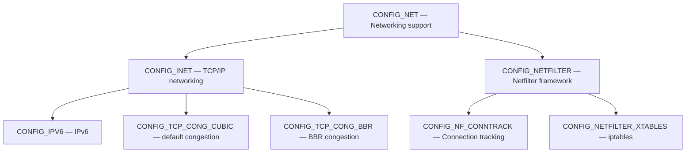

# Kernel Configuration

## Introduction

Kernel configuration is the process of selecting which features, drivers, and subsystems to include in a Linux kernel build. With over 15,000 configuration options, the kernel is one of the most configurable pieces of software in existence. Proper configuration is critical: including too many features wastes memory and increases attack surface, while missing features can render the system unbootable.

This chapter covers the configuration file format, available configuration tools, strategies for custom kernels, and practical tips.

## The .config File

The `.config` file is the central configuration artifact. It resides in the kernel source root and contains all configuration decisions:

```bash
# Example .config excerpt
#
# Automatically generated file; DO NOT EDIT.
# Linux/x86 6.1.0 Kernel Configuration
#
CONFIG_CC_VERSION_TEXT="gcc (Debian 12.2.0-14) 12.2.0"
CONFIG_CC_IS_GCC=y
CONFIG_GCC_VERSION=120200
CONFIG_CLANG_VERSION=0
CONFIG_AS_IS_GNU=y
CONFIG_AS_VERSION=24000

#
# General setup
#
CONFIG_INIT_ENV_ARG_LIMIT=32
CONFIG_COMPILE_TEST=y
# CONFIG_WERROR is not set
CONFIG_LOCALVERSION=""
CONFIG_LOCALVERSION_AUTO=y
CONFIG_BUILD_SALT=""
CONFIG_DEFAULT_HOSTNAME="(none)"
CONFIG_SYSVIPC=y
CONFIG_SYSVIPC_SYSCTL=y
CONFIG_POSIX_MQUEUE=y
CONFIG_WATCH_QUEUE=y
CONFIG_CROSS_MEMORY_ATTACH=y

#
# Enable loadable module support
#
CONFIG_MODULES=y
CONFIG_MODULE_FORCE_LOAD=y
CONFIG_MODULE_UNLOAD=y
CONFIG_MODULE_FORCE_UNLOAD=y
CONFIG_MODVERSIONS=y
CONFIG_MODULE_SRCVERSION_ALL=y
```

### .config Format Rules

Each line in `.config` follows one of three patterns:

```bash
CONFIG_FEATURE_A=y       # Built into the kernel
CONFIG_FEATURE_B=m       # Compiled as a loadable module
# CONFIG_FEATURE_C is not set  # Disabled (explicit)
```

Some symbols have values:

```bash
CONFIG_DEFAULT_TCP_CONG="cubic"    # String
CONFIG_BASE_SMALL=0                # Integer
CONFIG_PHYSICAL_START=0x1000000    # Hexadecimal
```

### .config vs auto.conf

After running `make`, two additional configuration files are generated:

```
.config                  # Human-readable, full config
include/config/auto.conf  # Machine-readable, for Makefiles
include/config/auto.conf.cmd  # Dependency tracking
include/generated/autoconf.h   # C header for #ifdef
```

`autoconf.h` is included by every C file:

```c
/* Generated include/generated/autoconf.h (excerpt) */
#define CONFIG_EXT4_FS 1
#define CONFIG_MODULES 1
#define CONFIG_DEFAULT_TCP_CONG "cubic"
#define CONFIG_HZ 250
```

Source code uses these defines:

```c
/* fs/ext4/super.c */
#ifdef CONFIG_EXT4_FS_POSIX_ACL
    /* ACL support code */
    sb->s_flags |= SB_POSIXACL;
#endif
```

## Configuration Tools

### make menuconfig (ncurses)

The most popular configuration tool. Navigate with arrow keys, select with Enter:

```bash
$ make menuconfig
```

Key navigation:

| Key | Action |
|-----|--------|
| ↑/↓ | Navigate options |
| Enter | Enter submenu / toggle |
| Y | Build-in |
| M | Module |
| N | Disable |
| / | Search |
| ? | Help |
| Esc×2 | Exit |
| Tab | Move to buttons |

### make xconfig (Qt)

Graphical configuration tool using Qt:

```bash
$ sudo apt install qtbase5-dev
$ make xconfig
```

Provides a tree view with search, dependency visualization, and help panels.

### make gconfig (GTK)

GTK-based graphical tool:

```bash
$ sudo apt install libgtk-3-dev
$ make gconfig
```

### make oldconfig

Prompts only for new options. Essential after kernel version upgrades:

```bash
# Copy old config
$ cp /boot/config-$(uname -r) .config

# Update for new kernel, prompt for new options
$ make oldconfig
```

### make olddefconfig

Like `oldconfig` but uses defaults for new options (no prompts):

```bash
$ make olddefconfig
```

### make defconfig

Generates a default configuration for the architecture:

```bash
$ make defconfig          # Architecture default
$ make x86_64_defconfig   # Specific defconfig
$ make tinyconfig         # Minimal configuration
$ make allnoconfig        # Everything off
$ make allyesconfig       # Everything on (as modules/built-in)
$ make randconfig         # Random configuration
```

### make localmodconfig

Generates a config based on currently loaded modules — excellent for building a minimal kernel for your specific hardware:

```bash
# Step 1: Boot with a generic distribution kernel
# Step 2: Use all hardware you need (USB, WiFi, etc.)
# Step 3: Generate config from loaded modules
$ make localmodconfig

# The resulting config includes only what you're actually using
```

This typically reduces build time from hours to minutes and produces a much smaller kernel.

### make tinyconfig

Creates the smallest possible kernel configuration:

```bash
$ make tinyconfig
# Results in a very minimal kernel — may not boot on most systems
# Useful as a starting point for embedded systems
```

### make kvm_guest.config

Optimizes for KVM virtual machine guests:

```bash
$ make kvm_guest.config
```

### Scripted Configuration

```bash
# Enable a feature
$ scripts/config --enable CONFIG_EXT4_FS

# Disable a feature
$ scripts/config --disable CONFIG_DEBUG_INFO

# Set to module
$ scripts/config --module CONFIG_BTRFS_FS

# Set a value
$ scripts/config --set-val CONFIG_DEFAULT_TCP_CONG bbr

# Enable multiple features
$ scripts/config --enable CONFIG_BBR --enable CONFIG_TCP_CONG_BBR

# Disable multiple features
$ scripts/config --disable CONFIG_DEBUG_KERNEL \
                 --disable CONFIG_DEBUG_INFO \
                 --disable CONFIG_KASAN
```

### Programmatic Configuration

```bash
# Read current value
$ grep CONFIG_EXT4_FS .config
CONFIG_EXT4_FS=y

# Check if feature is enabled in running kernel
$ cat /proc/config.gz | gunzip | grep CONFIG_EXT4_FS
CONFIG_EXT4_FS=y

# Or if /proc/config.gz is not available:
$ grep CONFIG_EXT4_FS /boot/config-$(uname -r)
```

## Configuration Dependencies

Understanding configuration dependencies is essential:



### Checking Dependencies

```bash
# View all dependencies of a symbol
$ grep -r "depends on CONFIG_EXT4" fs/ext4/Kconfig

# In menuconfig, press ? to see dependencies
# Or use scripts/kconfig/merge_config.sh
```

### Handling Missing Dependencies

```bash
# If a feature can't be enabled, check its dependencies
$ make menuconfig
# Navigate to the feature, press ? to see "Depends on"

# Or use scripts/diffconfig to compare configs
$ scripts/diffconfig .config.old .config
```

## Common Configuration Profiles

### Minimal Desktop Kernel

```bash
# Start with distribution config
$ cp /boot/config-$(uname -r) .config
$ make olddefconfig

# Disable debug features
$ scripts/config --disable CONFIG_DEBUG_KERNEL
$ scripts/config --disable CONFIG_DEBUG_INFO
$ scripts/config --disable CONFIG_DEBUG_INFO_DWARF_TOOLCHAIN_DEFAULT
$ scripts/config --disable CONFIG_KASAN
$ scripts/config --disable CONFIG_KCSAN
$ scripts/config --disable CONFIG_KMEMLEAK

# Disable unnecessary filesystems
$ scripts/config --disable CONFIG_GFS2_FS
$ scripts/config --disable CONFIG_OCFS2_FS
$ scripts/config --disable CONFIG_NILFS2_FS

# Disable unused hardware drivers
$ scripts/config --disable CONFIG_INFINIBAND
$ scripts/config --disable CONFIG_FCOE
$ scripts/config --disable CONFIG_SCSI_FC_ATTRS

# Rebuild
$ make olddefconfig
$ make -j$(nproc)
```

### Server Kernel

```bash
# Enable performance features
$ scripts/config --enable CONFIG_PREEMPT_NONE      # Server: minimize latency variance
$ scripts/config --enable CONFIG_NO_HZ_FULL        # Adaptive tickless
$ scripts/config --enable CONFIG_HIGH_RES_TIMERS
$ scripts/config --enable CONFIG_TCP_CONG_BBR      # BBR congestion control
$ scripts/config --enable CONFIG_NET_SCH_FQ        # Fair queueing

# Enable monitoring
$ scripts/config --enable CONFIG_FTRACE
$ scripts/config --enable CONFIG_FUNCTION_TRACER
$ scripts/config --enable CONFIG_PERF_EVENTS
$ scripts/config --enable CONFIG_BPF_SYSCALL

# Security features
$ scripts/config --enable CONFIG_SECURITY_SELINUX
$ scripts/config --enable CONFIG_SECCOMP
$ scripts/config --enable CONFIG_SECCOMP_FILTER

# Networking
$ scripts/config --enable CONFIG_TCP_CONG_BBR
$ scripts/config --enable CONFIG_NET_SCH_FQ_CODEL
```

### Embedded / IoT Kernel

```bash
$ make tinyconfig

# Enable only what's needed
$ scripts/config --enable CONFIG_NET
$ scripts/config --enable CONFIG_INET
$ scripts/config --enable CONFIG_EXT4_FS
$ scripts/config --enable CONFIG_SERIAL_8250
$ scripts/config --enable CONFIG_SERIAL_8250_CONSOLE
$ scripts/config --enable CONFIG_PRINTK
$ scripts/config --enable CONFIG_TMPFS
$ scripts/config --enable CONFIG_DEVTMPFS
$ scripts/config --enable CONFIG_DEVTMPFS_MOUNT

$ make olddefconfig
$ make -j$(nproc)
```

## Kernel Configuration for Containers

When building a kernel for container workloads (Docker, Kubernetes, LXC):

```bash
# Essential: Namespaces
$ scripts/config --enable CONFIG_NAMESPACES
$ scripts/config --enable CONFIG_UTS_NS
$ scripts/config --enable CONFIG_IPC_NS
$ scripts/config --enable CONFIG_USER_NS
$ scripts/config --enable CONFIG_PID_NS
$ scripts/config --enable CONFIG_NET_NS
$ scripts/config --enable CONFIG_CGROUP_NS

# Essential: Cgroups
$ scripts/config --enable CONFIG_CGROUPS
$ scripts/config --enable CONFIG_CGROUP_CPUACCT
$ scripts/config --enable CONFIG_CGROUP_DEVICE
$ scripts/config --enable CONFIG_CGROUP_FREEZER
$ scripts/config --enable CONFIG_CGROUP_SCHED
$ scripts/config --enable CONFIG_CGROUP_PIDS
$ scripts/config --enable CONFIG_MEMCG
$ scripts/config --enable CONFIG_CGROUP_PERF

# Essential: Networking
$ scripts/config --enable CONFIG_VETH
$ scripts/config --enable CONFIG_BRIDGE
$ scripts/config --enable CONFIG_BRIDGE_NETFILTER
$ scripts/config --enable CONFIG_NETFILTER_XT_MATCH_CONNTRACK
$ scripts/config --enable CONFIG_NETFILTER_XT_MATCH_ADDRTYPE
$ scripts/config --enable CONFIG_NETFILTER_XT_MATCH_IPVS
$ scripts/config --enable CONFIG_IP_NF_NAT
$ scripts/config --enable CONFIG_IP_NF_TARGET_MASQUERADE
$ scripts/config --enable CONFIG_IP_VS
$ scripts/config --enable CONFIG_IP_VS_NFCT
$ scripts/config --enable CONFIG_OVERLAY_FS

# Essential: Storage
$ scripts/config --enable CONFIG_BLK_DEV_DM
$ scripts/config --enable CONFIG_DM_THIN_PROVISIONING
$ scripts/config --enable CONFIG_EXT4_FS
$ scripts/config --enable CONFIG_BTRFS_FS

# Security
$ scripts/config --enable CONFIG_SECCOMP
$ scripts/config --enable CONFIG_SECCOMP_FILTER
$ scripts/config --enable CONFIG_USER_NS
```

## Debugging Configuration

### Missing Module / Feature

```bash
# Find which config option enables a specific module
$ grep -r "e1000e" drivers/net/ethernet/intel/e1000e/Kconfig
config E1000E
    tristate "Intel(R) PRO/1000 PCI-Express Gigabit Ethernet support"

# Check if it's enabled in .config
$ grep CONFIG_E1000E .config
CONFIG_E1000E=m

# If missing, enable it
$ scripts/config --module CONFIG_E1000E
$ make olddefconfig
```

### Configuration Comparison

```bash
# Compare two .config files
$ scripts/diffconfig .config.old .config

# Generate config diff after make oldconfig
$ diff -u .config.old .config | head -50
```

### Kernel Boot Config

The running kernel exposes its configuration:

```bash
# From /proc/config.gz (if available)
$ zcat /proc/config.gz | less

# From /boot/
$ ls /boot/config-*
/boot/config-6.1.0-23-amd64

# Check specific option
$ zcat /proc/config.gz | grep CONFIG_PREEMPT
# CONFIG_PREEMPT is not set
CONFIG_PREEMPT_VOLUNTARY=y
# CONFIG_PREEMPT_NONE is not set
```

### Validating Configuration

```bash
# Check for errors in configuration
$ make olddefconfig
# If there are issues, warnings will be printed

# Verify specific feature is available
$ cat /proc/filesystems | grep ext4
nodev   ext4
```

## Kernel Config Fragments

Config fragments allow modular configuration management:

```bash
# Create a fragment
$ cat > my-fragment.config << 'EOF'
CONFIG_TCP_CONG_BBR=y
CONFIG_NET_SCH_FQ=y
CONFIG_DEFAULT_TCP_CONG="bbr"
EOF

# Merge fragment into existing config
$ scripts/kconfig/merge_config.sh .config my-fragment.config

# Or use KCONFIG_CONFIG
$ KCONFIG_CONFIG=.config scripts/kconfig/merge_config.sh \
    base.config \
    networking.config \
    security.config
```

### Using merge_config.sh

```bash
# Merge multiple fragments
$ scripts/kconfig/merge_config.sh \
    arch/x86/configs/x86_64_defconfig \
    fragments/containers.config \
    fragments/security.config \
    fragments/debug.config

# The merged .config is created
$ make olddefconfig
```

## Hardware-Specific Configuration

### Detecting Required Drivers

```bash
# List all PCI devices and their kernel modules
$ lspci -k | head -20
00:00.0 Host bridge: Intel Corporation Xeon E3-1200
        Subsystem: Dell Device 0617
00:02.0 VGA compatible controller: Intel Corporation HD 530
        Kernel driver in use: i915
        Kernel modules: i915
00:14.0 USB controller: Intel Corporation 100 Series
        Kernel driver in use: xhci_hcd
        Kernel modules: xhci_pci

# List all loaded modules
$ lsmod

# Get modinfo for a module
$ modinfo e1000e
filename:       /lib/modules/6.1.0/kernel/drivers/net/ethernet/intel/e1000e/e1000e.ko
version:        5.14.2
license:        GPL v2
description:    Intel(R) PRO/1000 Network Driver
author:         Intel Corporation
firmware:       e1000e/82571-1.fw
```

### Auto-Detecting Hardware

```bash
# Generate config from running hardware
$ make localmodconfig

# Or more specific
$ lsmod > /tmp/my-modules.txt
$ make LSMOD=/tmp/my-modules.txt localmodconfig
```

## Configuration Tips and Best Practices

### 1. Always Start from a Working Config

```bash
# Copy distribution kernel config as starting point
$ cp /boot/config-$(uname -r) .config
$ make olddefconfig
```

### 2. Use localmodconfig for Speed

```bash
# Dramatically reduces build time
$ make localmodconfig
$ time make -j$(nproc)    # May go from 2 hours to 15 minutes
```

### 3. Enable /proc/config.gz

```bash
$ scripts/config --enable CONFIG_IKCONFIG
$ scripts/config --enable CONFIG_IKCONFIG_PROC
```

### 4. Keep Debug Info Separate

```bash
# Minimal debug info in kernel, full debug in separate package
$ scripts/config --enable CONFIG_DEBUG_INFO_NONE
# Or for debugging:
$ scripts/config --enable CONFIG_DEBUG_INFO_DWARF_TOOLCHAIN_DEFAULT
```

### 5. Version Your Configs

```bash
# Tag your custom config
$ scripts/config --set-str CONFIG_LOCALVERSION "-mycustom"
$ make olddefconfig
```

### 6. Test in Virtual Machine First

```bash
# Build and test in QEMU
$ qemu-system-x86_64 -kernel arch/x86/boot/bzImage \
    -append "console=ttyS0" \
    -nographic \
    -m 2G
```

### 7. Use CONFIG_MODULES for Flexibility

```bash
# Build most drivers as modules for flexibility
$ scripts/config --enable CONFIG_MODULES
$ scripts/config --enable CONFIG_MODULE_UNLOAD
# Enable hotplug module loading
$ scripts/config --enable CONFIG_MODULES
```

## Configuration File Locations

| Location | Description |
|----------|-------------|
| `.config` | Main configuration file |
| `arch/*/configs/*_defconfig` | Architecture-specific defaults |
| `include/generated/autoconf.h` | C header for #ifdef |
| `include/config/auto.conf` | Makefile include |
| `/proc/config.gz` | Running kernel config |
| `/boot/config-*` | Installed kernel config |

## Further Reading

- [Kernel configuration documentation](https://www.kernel.org/doc/html/latest/kbuild/kconfig.html)
- [Kconfig language reference](https://www.kernel.org/doc/html/latest/kbuild/kconfig-language.html)
- [Linux Kernel in a Nutshell — Configuration](http://www.kroah.com/lkn/)
- [Kernel Newbies: Kernel Configuration](https://kernelnewbies.org/KernelConfiguration)
- [Gentoo Kernel Configuration Guide](https://wiki.gentoo.org/wiki/Kernel/Configuration)

## Related Topics

- [Build System](build-system.md) — Kconfig/Kbuild internals
- [Kernel Overview](overview.md) — High-level kernel introduction
- [Kernel Modules](modules.md) — Module configuration
- [Boot Process](boot-process.md) — Boot-time configuration
- [Command Line Parameters](cmdline-params.md) — Runtime configuration
