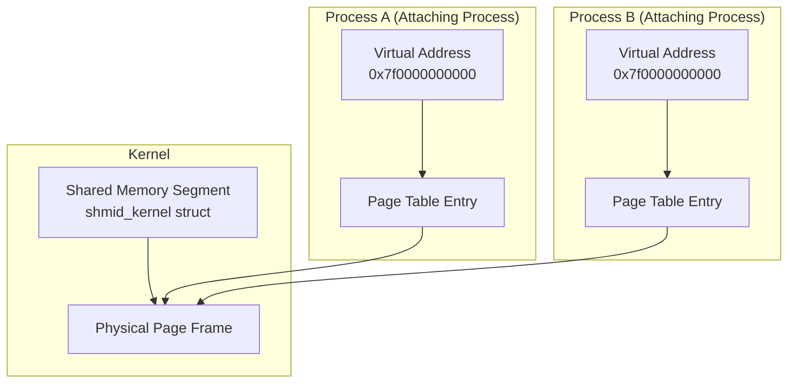

# System V Shared Memory

## Introduction

System V shared memory is one of the oldest and most widely used inter-process communication (IPC) mechanisms in Unix and Linux. It allows multiple processes to access the same region of physical memory, providing the fastest possible form of IPC since data does not need to be copied between processes. Once a shared memory segment is created and attached to a process's address space, data can be read and written as if it were regular memory.

System V shared memory is part of the broader System V IPC family, which also includes message queues and semaphores. While POSIX shared memory (`shm_open`) is the modern alternative, System V shared memory remains widely used in databases (Oracle, PostgreSQL), application servers, and legacy applications.

## Shared Memory Architecture



## Core Concepts

### Shared Memory Lifecycle

1. **Creation**: `shmget()` creates or obtains a shared memory segment
2. **Attachment**: `shmat()` maps the segment into a process's address space
3. **Usage**: Read/write the shared memory region directly
4. **Detachment**: `shmdt()` unmaps the segment from the address space
5. **Deletion**: `shmctl(IPC_RMID)` marks the segment for deletion

### Key Identifiers

- **Key**: A user-chosen value (or `IPC_PRIVATE`) used to identify the segment
- **shmid**: A kernel-assigned integer handle for the segment
- **Address**: The virtual address where the segment is mapped in a process

## System Call Reference

### shmget() — Create or Obtain a Segment

```c
#include <sys/ipc.h>
#include <sys/shm.h>

int shmget(key_t key, size_t size, int shmflg);
```

**Parameters:**
- `key`: IPC key (use `IPC_PRIVATE` for a new private segment, or `ftok()` to generate one)
- `size`: Size in bytes (rounded up to page boundary)
- `shmflg`: Flags and permissions:
  - `IPC_CREAT`: Create if doesn't exist
  - `IPC_EXCL`: Fail if already exists (with IPC_CREAT)
  - Permission bits: `0666` for read/write by all

**Returns:** shmid on success, -1 on error

```c
/* Create a 4 KiB shared memory segment */
int shmid = shmget(IPC_PRIVATE, 4096, IPC_CREAT | 0600);
if (shmid == -1) {
    perror("shmget");
    exit(1);
}

/* Or use ftok() for a named key */
key_t key = ftok("/tmp/myfile", 'A');
int shmid = shmget(key, 4096, IPC_CREAT | 0666);
```

### shmat() — Attach a Segment

```c
void *shmat(int shmid, const void *shmaddr, int shmflg);
```

**Parameters:**
- `shmid`: Shared memory ID from `shmget()`
- `shmaddr`: Desired attach address (NULL = let kernel choose)
- `shmflg`: Flags:
  - `SHM_RDONLY`: Attach read-only
  - `SHM_REMAP`: Replace existing mapping at shmaddr
  - `SHM_RND`: Round shmaddr down to SHMLBA

**Returns:** Pointer to shared memory on success, (void*)-1 on error

```c
/* Attach at any address */
char *shm = shmat(shmid, NULL, 0);
if (shm == (void *)-1) {
    perror("shmat");
    exit(1);
}

/* Attach read-only */
char *shm_ro = shmat(shmid, NULL, SHM_RDONLY);
```

### shmdt() — Detach a Segment

```c
int shmdt(const void *shmaddr);
```

Detaches the shared memory segment from the process's address space. Does **not** delete the segment — it remains available for other processes.

```c
if (shmdt(shm) == -1) {
    perror("shmdt");
}
```

### shmctl() — Control Operations

```c
int shmctl(int shmid, int cmd, struct shmid_ds *buf);
```

**Commands:**
- `IPC_STAT`: Get segment information into `buf`
- `IPC_SET`: Set segment attributes from `buf`
- `IPC_RMID`: Mark segment for deletion
- `SHM_LOCK`: Lock segment in memory (prevent swapping)
- `SHM_UNLOCK`: Unlock segment
- `SHM_INFO`: Get shared memory info (Linux-specific)
- `SHM_STAT`: Get segment by index (Linux-specific)

```c
/* Get segment info */
struct shmid_ds ds;
if (shmctl(shmid, IPC_STAT, &ds) == 0) {
    printf("Size: %zu bytes\n", ds.shm_segsz);
    printf("Creator PID: %d\n", ds.shm_cpid);
    printf("Last attach: %s", ctime(&ds.shm_atime));
    printf("Last detach: %s", ctime(&ds.shm_dtime));
    printf("Last change: %s", ctime(&ds.shm_ctime));
    printf("Number of attaches: %lu\n", ds.shm_nattch);
}

/* Delete segment */
if (shmctl(shmid, IPC_RMID, NULL) == -1) {
    perror("shmctl");
}
```

### The shmid_ds Structure

```c
struct shmid_ds {
    struct ipc_perm shm_perm;   /* Ownership and permissions */
    size_t          shm_segsz;  /* Size of segment in bytes */
    time_t          shm_atime;  /* Time of last shmat() */
    time_t          shm_dtime;  /* Time of last shmdt() */
    time_t          shm_ctime;  /* Time of last change */
    pid_t           shm_cpid;   /* PID of creator */
    pid_t           shm_lpid;   /* PID of last shmat()/shmdt() */
    shmatt_t        shm_nattch; /* Number of current attaches */
    /* Linux-specific fields */
    unsigned long   shm_unused1; /* formerly used by DIPC */
    void            *shm_unused2; /* formerly used by DIPC */
};

struct ipc_perm {
    key_t          __key;    /* Key supplied to shmget() */
    uid_t          uid;      /* Effective UID of owner */
    gid_t          gid;      /* Effective GID of owner */
    uid_t          cuid;     /* Effective UID of creator */
    gid_t          cgid;     /* Effective GID of creator */
    unsigned short mode;     /* Permissions + SHM_DEST, SHM_LOCKED */
    unsigned short __seq;    /* Sequence number */
};
```

## Using ftok() for Key Generation

```c
#include <sys/ipc.h>

key_t ftok(const char *pathname, int proj_id);
```

`ftok()` generates a unique key from a file path and a project identifier:

```c
/* Generate a key from a file and project ID */
key_t key = ftok("/tmp/shmkey", 65);  /* 'A' = 65 */
if (key == -1) {
    perror("ftok");
    exit(1);
}

/* Use the key to create/get a shared memory segment */
int shmid = shmget(key, 4096, IPC_CREAT | 0666);
```

**Note:** `ftok()` uses the file's inode number and the project ID to generate the key. If the file doesn't exist or is deleted and recreated, the inode may change, producing a different key.

## Complete Example: Producer-Consumer

### Producer

```c
#include <stdio.h>
#include <stdlib.h>
#include <string.h>
#include <sys/ipc.h>
#include <sys/shm.h>
#include <sys/types.h>
#include <unistd.h>

#define SHM_SIZE 4096
#define SHM_KEY 12345

struct shared_data {
    int ready;
    int data_size;
    char data[4072];
};

int main(void)
{
    /* Create shared memory segment */
    int shmid = shmget(SHM_KEY, SHM_SIZE, IPC_CREAT | 0666);
    if (shmid == -1) {
        perror("shmget");
        return 1;
    }
    
    /* Attach */
    struct shared_data *shm = (struct shared_data *)shmat(shmid, NULL, 0);
    if (shm == (void *)-1) {
        perror("shmat");
        return 1;
    }
    
    /* Write data */
    const char *message = "Hello from producer via shared memory!";
    shm->ready = 0;
    memcpy(shm->data, message, strlen(message) + 1);
    shm->data_size = strlen(message) + 1;
    
    /* Signal consumer */
    __sync_synchronize();  /* Memory barrier */
    shm->ready = 1;
    
    printf("Producer: wrote %d bytes\n", shm->data_size);
    
    /* Wait for consumer to read */
    while (shm->ready == 1)
        usleep(1000);
    
    /* Cleanup */
    shmdt(shm);
    shmctl(shmid, IPC_RMID, NULL);
    
    printf("Producer: done\n");
    return 0;
}
```

### Consumer

```c
#include <stdio.h>
#include <stdlib.h>
#include <string.h>
#include <sys/ipc.h>
#include <sys/shm.h>
#include <sys/types.h>
#include <unistd.h>

#define SHM_SIZE 4096
#define SHM_KEY 12345

struct shared_data {
    int ready;
    int data_size;
    char data[4072];
};

int main(void)
{
    /* Get existing shared memory segment */
    int shmid = shmget(SHM_KEY, SHM_SIZE, 0666);
    if (shmid == -1) {
        perror("shmget");
        return 1;
    }
    
    /* Attach */
    struct shared_data *shm = (struct shared_data *)shmat(shmid, NULL, 0);
    if (shm == (void *)-1) {
        perror("shmat");
        return 1;
    }
    
    /* Wait for data */
    printf("Consumer: waiting for data...\n");
    while (shm->ready == 0)
        usleep(1000);
    
    __sync_synchronize();  /* Memory barrier */
    
    /* Read data */
    printf("Consumer: received %d bytes: %s\n",
           shm->data_size, shm->data);
    
    /* Signal producer */
    shm->ready = 0;
    
    /* Detach */
    shmdt(shm);
    
    printf("Consumer: done\n");
    return 0;
}
```

### Compile and Run

```bash
gcc -o producer producer.c
gcc -o consumer consumer.c

./producer &
./consumer
# Consumer: waiting for data...
# Producer: wrote 38 bytes
# Consumer: received 38 bytes: Hello from producer via shared memory!
# Consumer: done
# Producer: done
```

## Advanced Topics

### Shared Memory with Semaphores

Shared memory itself provides no synchronization. You need semaphores or mutexes to coordinate access:

```c
#include <sys/sem.h>
#include <sys/shm.h>

union semun {
    int val;
    struct semid_ds *buf;
    unsigned short *array;
};

/* Semaphore operations */
void sem_wait(int semid)
{
    struct sembuf op = { 0, -1, SEM_UNDO };
    semop(semid, &op, 1);
}

void sem_signal(int semid)
{
    struct sembuf op = { 0, 1, SEM_UNDO };
    semop(semid, &op, 1);
}

/* Initialize semaphore */
int sem_init_val(int semid, int val)
{
    union semun arg;
    arg.val = val;
    return semctl(semid, 0, SETVAL, arg);
}
```

### Shared Memory with POSIX Mutex (Process-Shared)

```c
#include <pthread.h>
#include <sys/mman.h>

struct shared_state {
    pthread_mutex_t mutex;
    int counter;
    char buffer[4060];
};

/* Initialize process-shared mutex */
void init_shared_mutex(pthread_mutex_t *mutex)
{
    pthread_mutexattr_t attr;
    pthread_mutexattr_init(&attr);
    pthread_mutexattr_setpshared(&attr, PTHREAD_PROCESS_SHARED);
    pthread_mutex_init(mutex, &attr);
    pthread_mutexattr_destroy(&attr);
}

/* Usage */
struct shared_state *state = (struct shared_state *)shmat(shmid, NULL, 0);

/* In one-time initialization */
init_shared_mutex(&state->mutex);

/* Lock, modify, unlock */
pthread_mutex_lock(&state->mutex);
state->counter++;
pthread_mutex_unlock(&state->mutex);
```

### Huge Pages and Shared Memory

Large shared memory segments benefit from huge pages to reduce TLB pressure:

```bash
# Allocate shared memory backed by huge pages
# Mount hugetlbfs
mount -t hugetlbfs none /dev/hugepages

# Set number of huge pages
echo 1024 > /proc/sys/vm/nr_hugepages

# Use SHM_HUGETLB flag
int shmid = shmget(IPC_PRIVATE, 2 * 1024 * 1024,
                    IPC_CREAT | SHM_HUGETLB | 0666);
```

### SHM_DEST Flag

When `shmctl(IPC_RMID)` is called, the segment is not immediately destroyed if processes are still attached. Instead, it's marked with `SHM_DEST` and destroyed when the last process detaches:

```c
/* Mark for deletion */
shmctl(shmid, IPC_RMID, NULL);
/* Segment still exists until last detach */
/* shm_nattch > 0 means segment persists */
```

## Linux-Specific Extensions

### SHM_STAT_ANY

```c
/* Get segment info by index (Linux-specific) */
struct shmid_ds ds;
int index = 0;
int shmid = shmctl(index, SHM_STAT_ANY, &ds);
/* Returns shmid if successful, -1 if index doesn't exist */
```

### /proc/sysvipc/shm

```bash
# View all shared memory segments
cat /proc/sysvipc/shm
#       key      shmid perms       size  cpid  lpid nattch   uid   gid  cuid  cgid      atime      dtime      ctime                   Rss                  Swap                 zomb
#        0      32768  1600       4096  1234  5678      2     0     0     0     0  1609459200  1609459300  1609459200                   4096                    0                    0
```

### ipcs Command

```bash
# Show all shared memory segments
ipcs -m
# ------ Shared Memory Segments --------
# key        shmid      owner      perms      bytes      nattch     status
# 0x00000000 32768      root       600        4096       2

# Show detailed info
ipcs -m -i 32768
# Shared memory Segment shmid=32768
# uid=0 gid=0 cuid=0 cgid=0
# mode=0600 access_perms=0600
# bytes=4096 lpid=5678 cpid=1234 nattch=2
# att_time=Mon Jan  1 12:00:00 2024
# det_time=Mon Jan  1 12:01:40 2024
# change_time=Mon Jan  1 12:00:00 2024

# Limits
ipcs -l
# ------ Shared Memory Limits --------
# max number of segments = 4096
# max seg size (kbytes) = 18014398509465599
# max total shared memory (kbytes) = 18014398509481980
# min seg size (bytes) = 1

# Remove a segment
ipcrm -m 32768

# Remove by key
ipcrm -M 12345
```

## Shared Memory Limits

```bash
# View kernel limits
cat /proc/sys/kernel/shmmax
# 18446744073692774399  (max segment size)

cat /proc/sys/kernel/shmall
# 18446744073692774399  (total shared memory pages)

cat /proc/sys/kernel/shmmni
# 4096  (max number of segments)

# Adjust limits (temporary)
echo 67108864 > /proc/sys/kernel/shmmax  # 64 MiB

# Adjust limits (permanent — /etc/sysctl.conf)
kernel.shmmax = 67108864
kernel.shmall = 16384
```

## System V vs POSIX Shared Memory

| Feature | System V (`shmget`) | POSIX (`shm_open`) |
|---------|---------------------|---------------------|
| API | `shmget`/`shmat`/`shmdt`/`shmctl` | `shm_open`/`mmap`/`shm_unlink` |
| Naming | Integer key (ftok) | Filesystem path (`/name`) |
| Size adjustment | No (fixed at creation) | `ftruncate()` |
| Persistence | Until explicitly deleted | Until `shm_unlink()` |
| Semantics | IPC object | File descriptor |
| Standards | POSIX, XSI | POSIX |
| Use case | Legacy, databases, large segments | Modern applications |

## Shared Memory in Databases

### PostgreSQL

```bash
# PostgreSQL uses shared memory for shared buffers
# Check PostgreSQL shared memory usage
ipcs -m | grep postgres
# 0x00000000 65536      postgres   600        134217728   1234   0

# postgresql.conf settings
# shared_buffers = 128MB
# shared_memory_type = mmap  (or sysv for System V)
```

### Oracle

```bash
# Oracle uses large shared memory segments
# Oracle recommends setting shmmax to physical RAM
# /etc/sysctl.conf
# kernel.shmmax = 8589934592  # 8 GB
# kernel.shmall = 2097152
```

## Debugging Shared Memory

```bash
# List all shared memory segments
ipcs -m

# Show shared memory usage in /proc
cat /proc/sysvipc/shm | wc -l  # count segments

# View memory mappings for a process (shows SHM attachments)
pmap -x <pid> | grep -i shm
# Address           Kbytes     RSS   Dirty Mode  Mapping
# 00007f1234000000       4       4       0 rw----   [ shmid=32768 ]

# Check for leaked segments
ipcs -m | awk '$6 == 0 {print}'  # nattch=0 means no processes attached

# Monitor shared memory stats
vmstat -s | grep -i shared
# 4096 K shared memory

# View detailed segment info
ipcs -m -i <shmid>

# Remove all shared memory segments (DANGEROUS)
ipcrm --all=shm
```

## Common Pitfalls

1. **No synchronization**: Shared memory alone doesn't protect against race conditions. Always use semaphores, mutexes, or atomic operations.
2. **Leaked segments**: Forgetting to `shmdt()` or `shmctl(IPC_RMID)` leaves segments in memory until reboot or manual cleanup.
3. **Size limitations**: `shmmax` limits the maximum segment size. Adjust before creating large segments.
4. **ftok() collisions**: Different files can produce the same key. Use `IPC_EXCL` to detect collisions.
5. **Alignment**: Data structures in shared memory should be carefully aligned for multi-architecture compatibility.
6. **Stale references**: If a segment is deleted while processes are still attached, the memory becomes invalid when they detach.

## References

- [Linux man-pages: shmget(2)](https://man7.org/linux/man-pages/man2/shmget.2.html)
- [Linux man-pages: shmat(2)](https://man7.org/linux/man-pages/man2/shmat.2.html)
- [Linux man-pages: shmctl(2)](https://man7.org/linux/man-pages/man2/shmctl.2.html)
- [Linux man-pages: ftok(3)](https://man7.org/linux/man-pages/man3/ftok.3.html)
- [Linux man-pages: sysvipc(7)](https://man7.org/linux/man-pages/man7/sysvipc.7.html)
- [Linux Kernel Source: ipc/shm.c](https://git.kernel.org/pub/scm/linux/kernel/git/torvalds/linux.git/tree/ipc/shm.c)
- [W. Richard Stevens: UNIX Network Programming, Volume 2](https://www.kohala.com/start/unpv2.html)

## Related Topics

- [Message Queues](./message-queues.md) — System V message passing
- [Semaphores](./semaphores.md) — System V semaphores for synchronization
- [POSIX IPC](./posix-ipc.md) — Modern POSIX shared memory and IPC
- [Memory Management](../mm/index.md) — How shared memory pages are managed
