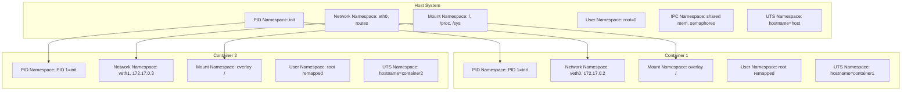
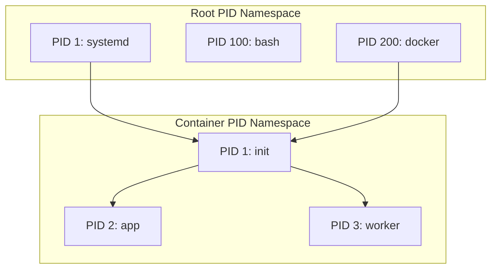

# Linux Namespaces

## Introduction

Namespaces are the fundamental building block of Linux containerization. A namespace wraps a global system resource in an abstraction layer so that processes within the namespace appear to have their own isolated instance of that resource. Changes to a resource within a namespace are visible only to processes in that namespace and do not affect processes in other namespaces or the host system.

Linux currently implements eight types of namespaces, each isolating a different aspect of the system. Together with cgroups (for resource limits) and capabilities (for privilege control), namespaces form the foundation of container technologies like Docker, LXC, Podman, and Kubernetes pods.

## Namespace Types

| Namespace | Flag | Isolates | Since |
|-----------|------|----------|-------|
| **Mount (mnt)** | `CLONE_NEWNS` | Mount points | Linux 2.4.19 (2002) |
| **UTS** | `CLONE_NEWUTS` | Hostname and domain name | Linux 2.6.19 (2006) |
| **IPC** | `CLONE_NEWIPC` | System V IPC, POSIX message queues | Linux 2.6.19 (2006) |
| **PID** | `CLONE_NEWPID` | Process IDs | Linux 2.6.24 (2008) |
| **Network (net)** | `CLONE_NEWNET` | Network stack (interfaces, routes, iptables) | Linux 2.6.29 (2009) |
| **User** | `CLONE_NEWUSER` | User and group IDs | Linux 3.8 (2013) |
| **Cgroup** | `CLONE_NEWCGROUP` | Cgroup root directory | Linux 4.6 (2016) |
| **Time** | `CLONE_NEWTIME` | System clocks (boottime, monotonic) | Linux 5.6 (2020) |

## Namespace Architecture



## Creating Namespaces

### Using clone()

The `clone()` system call creates new processes in new namespaces:

```c
#define _GNU_SOURCE
#include <sched.h>
#include <stdio.h>
#include <stdlib.h>
#include <unistd.h>
#include <sys/wait.h>

#define STACK_SIZE (1024 * 1024)

static int child_func(void *arg)
{
    char *hostname = (char *)arg;
    
    /* Set hostname in new UTS namespace */
    sethostname(hostname, strlen(hostname));
    
    /* Execute a shell */
    execlp("bash", "bash", NULL);
    perror("execlp");
    return 1;
}

int main(int argc, char *argv[])
{
    char *stack = malloc(STACK_SIZE);
    if (!stack) {
        perror("malloc");
        return 1;
    }
    
    /* Create child with new namespaces */
    int flags = CLONE_NEWUTS | CLONE_NEWNET | CLONE_NEWPID | SIGCHLD;
    
    pid_t pid = clone(child_func, stack + STACK_SIZE,
                      flags, argv[1] ? argv[1] : "container");
    if (pid == -1) {
        perror("clone");
        free(stack);
        return 1;
    }
    
    /* Wait for child */
    waitpid(pid, NULL, 0);
    free(stack);
    return 0;
}
```

### Using unshare()

The `unshare()` system call creates new namespaces for the current process without creating a new process:

```c
#define _GNU_SOURCE
#include <sched.h>
#include <stdio.h>
#include <unistd.h>

int main(void)
{
    /* Create new UTS namespace */
    if (unshare(CLONE_NEWUTS) == -1) {
        perror("unshare");
        return 1;
    }
    
    /* Set new hostname */
    sethostname("isolated", 8);
    
    /* Run a shell */
    execlp("bash", "bash", NULL);
    return 1;
}
```

### Using setns()

The `setns()` system call joins an existing namespace:

```c
#define _GNU_SOURCE
#include <fcntl.h>
#include <sched.h>
#include <stdio.h>
#include <unistd.h>

int join_namespace(pid_t pid, const char *ns_type)
{
    char path[64];
    int fd;
    
    snprintf(path, sizeof(path), "/proc/%d/ns/%s", pid, ns_type);
    fd = open(path, O_RDONLY);
    if (fd == -1) {
        perror("open");
        return -1;
    }
    
    if (setns(fd, 0) == -1) {
        perror("setns");
        close(fd);
        return -1;
    }
    
    close(fd);
    return 0;
}

int main(int argc, char *argv[])
{
    if (argc < 3) {
        fprintf(stderr, "Usage: %s <pid> <ns_type>\n", argv[0]);
        return 1;
    }
    
    pid_t pid = atoi(argv[1]);
    
    if (join_namespace(pid, argv[2]) == -1)
        return 1;
    
    execlp("bash", "bash", NULL);
    return 1;
}
```

## The unshare Command

The `unshare` command-line tool creates new namespaces and runs programs in them:

```bash
# Run bash in new UTS namespace
sudo unshare --uts bash
hostname isolated
hostname
# isolated
# (host hostname unchanged)

# Run bash in new network namespace
sudo unshare --net bash
ip link show
# 1: lo: <LOOPBACK> mtu 65536 qdisc noop state DOWN

# Run bash in new PID namespace
sudo unshare --pid --fork --mount-proc bash
ps aux
# USER       PID %CPU %MEM    VSZ   RSS TTY      STAT START   TIME COMMAND
# root         1  0.0  0.0  18508  3384 pts/0    S    12:00   0:00 bash
# root         2  0.0  0.0  34400  2876 pts/0    R+   12:00   0:00 ps aux

# Full isolation (like a container)
sudo unshare --pid --net --mount --uts --ipc --fork bash
# Now in isolated PID, network, mount, UTS, and IPC namespaces

# User namespace (no root required)
unshare --user --map-root-user bash
id
# uid=0(root) gid=0(root) groups=0(root)
# (but only within the namespace)

# Mount namespace with new root
sudo unshare --mount bash
mount -t tmpfs tmpfs /mnt
# /mnt is now a tmpfs, visible only in this namespace

# Cgroup namespace
sudo unshare --cgroup bash
cat /proc/self/cgroup
# 0::/
```

## PID Namespace

PID namespaces isolate the process ID number space. Each PID namespace has its own numbering starting from 1 (init). A process can see only processes in its own PID namespace and its descendants.

### PID Namespace Hierarchy



```bash
# Create new PID namespace
sudo unshare --pid --fork --mount-proc bash

# Processes inside see only namespace-local PIDs
ps aux
# PID 1 is our bash

# Processes outside see the real PID
# From host:
ps aux | grep bash
# root  12345  0.0  0.0  ...  bash  (PID 12345 in host namespace)

# /proc/self/status shows namespace info
cat /proc/self/status | grep NStgid
# NStgid:	1	12345  (1=ns PID, 12345=host PID)
```

### PID Namespace Lifecycle

```c
/* PID namespace init process */
/* When PID 1 in a namespace exits, all processes in that namespace are killed */

/* Namespace-aware PID translation */
pid_t pid_ns_translate(struct task_struct *task, struct pid_namespace *target_ns)
{
    struct pid *pid = task_pid(task);
    return pid_nr_ns(pid, target_ns);
}
```

## Network Namespace

Network namespaces provide complete isolation of the network stack. See [Network Namespaces](../../networking/namespaces.md) for detailed coverage.

```bash
# Create and configure network namespace
sudo ip netns add myns
sudo ip netns exec myns ip link set lo up

# Connect namespaces with veth pairs
sudo ip link add veth0 type veth peer name veth1
sudo ip link set veth1 netns myns

# Configure
sudo ip addr add 10.0.0.1/24 dev veth0
sudo ip link set veth0 up
sudo ip netns exec myns ip addr add 10.0.0.2/24 dev veth1
sudo ip netns exec myns ip link set veth1 up

# Test
sudo ip netns exec myns ping 10.0.0.1
```

## Mount Namespace

Mount namespaces isolate the set of filesystem mount points seen by a group of processes. A process in a different mount namespace can have a completely different view of the filesystem hierarchy.

```bash
# Create new mount namespace
sudo unshare --mount bash

# Mounts in this namespace don't affect the host
mount -t tmpfs tmpfs /mnt
echo "hello from namespace" > /mnt/test
cat /mnt/test
# hello from namespace

# On host: /mnt is unchanged

# Shared vs private mount propagation
# Make mount private (don't propagate to other namespaces)
mount --make-private /mnt

# Make mount shared (propagate to peer group)
mount --make-shared /mnt

# Make mount slave (receive propagation from master, don't propagate back)
mount --make-slave /mnt
```

### Mount Propagation

```mermaid
graph TD
    subgraph "Host Mount Namespace"
        HOST_MNT[/mnt host]
    end
    subgraph "Container Mount Namespace"
        CONT_MNT[/mnt container]
    end
    
    HOST_MNT -->|shared| CONT_MNT
    CONT_MNT -->|shared| HOST_MNT
    
    subgraph "Propagation Types"
        P1[shared: Bidirectional propagation]
        P2[private: No propagation]
        P3[slave: One-way from master]
        P4[unbindable: Cannot be mounted on]
    end
```

## User Namespace

User namespaces isolate security-related identifiers: user IDs, group IDs, and capabilities. A process can have root privileges inside a user namespace without having them outside.

```bash
# Create user namespace (no root required)
unshare --user --map-root-user bash

# Inside namespace: appears as root
id
# uid=0(root) gid=0(root) groups=0(root)

# But capabilities are limited to the namespace
capsh --print
# Current: = cap_chown,cap_dac_override,...+eip
# (but only within the namespace)

# Map user IDs
# /proc/<pid>/uid_map format: ns_id host_id count
echo "0 1000 1" > /proc/$$/uid_map  # Map namespace root to host uid 1000
echo "0 1000 1" > /proc/$$/gid_map

# View current mappings
cat /proc/$$/uid_map
#          0       1000          1

cat /proc/$$/gid_map
#          0       1000          1
```

### Subordinate User/Group Mappings

```bash
# /etc/subuid: subordinate UID ranges for users
cat /etc/subuid
# user1:100000:65536

# /etc/subgid: subordinate GID ranges
cat /etc/subgid
# user1:100000:65536

# These define ranges available for user namespace mapping
# User "user1" can map UIDs 100000-165535 to their user namespace
```

## UTS Namespace

UTS namespaces isolate the hostname and NIS domain name:

```bash
# Create new UTS namespace
sudo unshare --uts bash

# Set new hostname
hostname container-1
hostname
# container-1

# Host hostname unchanged
# (from another terminal)
hostname
# myhost
```

## IPC Namespace

IPC namespaces isolate System V IPC objects and POSIX message queues:

```bash
# Create new IPC namespace
sudo unshare --ipc bash

# Create shared memory segment (inside namespace)
ipcmk -M 1024
# Shared memory id: 0

# List IPC objects
ipcs
# ------ Shared Memory Segments --------
# key        shmid      owner      perms      bytes      nattch     status
# 0x12345678 0          root       644        1024       0

# Host cannot see this IPC object
# (from host terminal)
ipcs
# (no shared memory with that ID)
```

## Cgroup Namespace

Cgroup namespaces virtualize the view of cgroup hierarchies:

```bash
# Create new cgroup namespace
sudo unshare --cgroup bash

# Inside namespace: cgroup root appears as /
cat /proc/self/cgroup
# 0::/

# Host sees the full path
# (from host)
cat /proc/<pid>/cgroup
# 0::/docker/<container_id>

# Useful for containers: makes the container's cgroup look like the root
```

## Time Namespace

Time namespaces isolate the CLOCK_MONOTONIC and CLOCK_BOOTTIME clocks:

```bash
# Create new time namespace
sudo unshare --time bash

# Set monotonic offset
# /proc/<pid>/timens_offsets format: clock_id secs_offset nanos_offset
echo "monotonic 7200 0" > /proc/$$/timens_offsets
echo "boottime 7200 0" > /proc/$$/timens_offsets

# Inside namespace: time appears 2 hours ahead
date
```

## Viewing Namespace Information

```bash
# List all namespaces for a process
ls -la /proc/$$/ns/
# lrwxrwxrwx 1 root root 0 ... cgroup -> 'cgroup:[4026531835]'
# lrwxrwxrwx 1 root root 0 ... ipc -> 'ipc:[4026531839]'
# lrwxrwxrwx 1 root root 0 ... mnt -> 'mnt:[4026531840]'
# lrwxrwxrwx 1 root root 0 ... net -> 'net:[4026531840]'
# lrwxrwxrwx 1 root root 0 ... pid -> 'pid:[4026531836]'
# lrwxrwxrwx 1 root root 0 ... pid_for_children -> 'pid:[4026531836]'
# lrwxrwxrwx 1 root root 0 ... time -> 'time:[4026531844]'
# lrwxrwxrwx 1 root root 0 ... time_for_children -> 'time:[4026531844]'
# lrwxrwxrwx 1 root root 0 ... user -> 'user:[4026531837]'
# lrwxrwxrwx 1 root root 0 ... uts -> 'uts:[4026531838]'

# List all namespace instances
lsns
#         NS TYPE  NPID PID USER    COMMAND
# 4026531835 cgrp     1   1 root    /sbin/init
# 4026531836 pid      1   1 root    /sbin/init
# 4026531837 user     1   1 root    /sbin/init
# 4026531838 uts      1   1 root    /sbin/init
# 4026531839 ipc      1   1 root    /sbin/init
# 4026531840 mnt      1   1 root    /sbin/init
# 4026531840 net      1   1 root    /sbin/init

# Filter by type
lsns -t net
lsns -t pid

# Show specific process
lsns -p $$

# Enter a namespace
nsenter -t <pid> --all -- bash
# or specific namespaces
nsenter -t <pid> --net --pid -- bash
```

## Docker Container Namespaces

Docker uses namespaces to isolate containers:

```bash
# View container namespaces
CONTAINER_ID=$(docker run -d nginx)
PID=$(docker inspect --format '{{.State.Pid}}' $CONTAINER_ID)

ls -la /proc/$PID/ns/
# lrwxrwxrwx ... cgroup -> 'cgroup:[4026532590]'
# lrwxrwxrwx ... ipc -> 'ipc:[4026532588]'
# lrwxrwxrwx ... mnt -> 'mnt:[4026532586]'
# lrwxrwxrwx ... net -> 'net:[4026532589]'
# lrwxrwxrwx ... pid -> 'pid:[4026532591]'
# lrwxrwxrwx ... pid_for_children -> 'pid:[4026532591]'
# lrwxrwxrwx ... uts -> 'uts:[4026532587]'

# Enter container's namespace
nsenter -t $PID --all -- bash
# Now "inside" the container

# Docker run options mapping to namespaces:
# --pid=host      -> Use host PID namespace
# --net=host      -> Use host network namespace
# --uts=host      -> Use host UTS namespace
# --ipc=host      -> Use host IPC namespace
# --userns=host   -> Use host user namespace
# --cgroupns=host -> Use host cgroup namespace
```

## Kernel Implementation

### Namespace Data Structures

```c
/* Each namespace type has a structure */
struct uts_namespace {
    struct kref kref;
    struct new_utsname name;  /* hostname, domainname, etc. */
    struct user_namespace *user_ns;
    struct ucounts *ucounts;
    struct ns_common ns;
};

struct net_namespace {
    struct ns_common ns;
    struct list_head list;
    struct net_device *loopback_dev;
    struct list_head dev_base_head;
    /* ... hundreds of network namespace fields ... */
};

struct pid_namespace {
    struct kref kref;
    struct pidmap pidmap[PIDMAP_ENTRIES];
    struct task_struct *child_reaper;
    struct ucounts *ucounts;
    int level;  /* nesting level (0 = root) */
    struct pid_namespace *parent;
    /* ... */
};

/* Generic namespace operations */
struct ns_common {
    atomic_long_t stashed;
    const struct proc_ns_operations *ops;
    unsigned int inum;  /* inode number, unique identifier */
};

struct proc_ns_operations {
    const char *name;
    const char *real_ns_name;
    int type;
    struct ns_common *(*get)(struct task_struct *task);
    void (*put)(struct ns_common *ns);
    int (*install)(struct nsproxy *nsproxy, struct ns_common *ns);
    struct user_namespace *(*owner)(struct ns_common *ns);
    struct ns_common *(*get_parent)(struct ns_common *ns);
};
```

### nsproxy Structure

```c
/* The nsproxy bundles all namespace references for a process */
struct nsproxy {
    struct uts_namespace *uts_ns;
    struct ipc_namespace *ipc_ns;
    struct mnt_namespace *mnt_ns;
    struct pid_namespace *pid_ns_for_children;
    struct net *net_ns;
    struct cgroup_namespace *cgroup_ns;
    struct time_namespace *time_ns;
    struct time_namespace *time_ns_for_children;
    struct user_namespace *user_ns;
    struct ns_common *stashed_cgroup_ns;
};
```

## Namespaces and /proc

```bash
# Namespace info in /proc
cat /proc/$$/ns/user
# user:[4026531837]

# Same inode number = same namespace
cat /proc/1/ns/net
# net:[4026531840]
cat /proc/2/ns/net
# net:[4026531840]  (same namespace as PID 1)

# Different process in different namespace
cat /proc/<container_pid>/ns/net
# net:[4026532589]  (different number = different namespace)
```

## References

- [Linux man-pages: namespaces(7)](https://man7.org/linux/man-pages/man7/namespaces.7.html)
- [Linux man-pages: clone(2)](https://man7.org/linux/man-pages/man2/clone.2.html)
- [Linux man-pages: unshare(2)](https://man7.org/linux/man-pages/man2/unshare.2.html)
- [Linux man-pages: setns(2)](https://man7.org/linux/man-pages/man2/setns.2.html)
- [LWN: Namespaces in operation](https://lwn.net/Articles/531114/)
- [LWN: User namespaces](https://lwn.net/Articles/528078/)
- [LWN: Time namespaces](https://lwn.net/Articles/766089/)
- [Linux Containers](https://linuxcontainers.org/)

## Related Topics

- [Cgroups](./cgroups.md) — Resource limiting (complements namespaces)
- [Security](./security.md) — Capabilities, SELinux with namespaces
- [System Calls](./system-calls.md) — clone, unshare, setns
