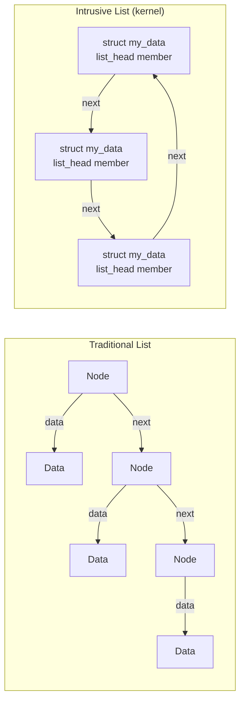
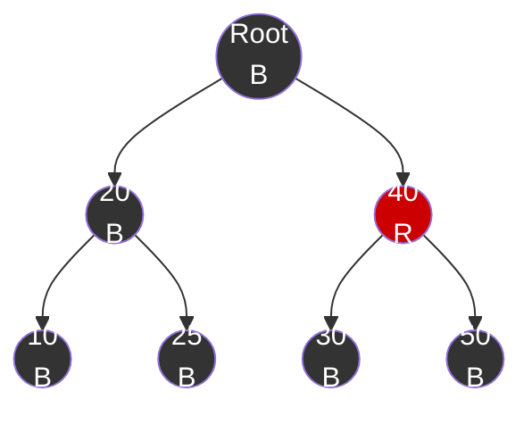

# Kernel Data Structures

## Introduction

The Linux kernel relies on a set of carefully designed, generic data structures that are used throughout the codebase. These structures are optimized for performance, cache efficiency, and type safety. Understanding them is essential for reading kernel code, writing modules, and contributing to the kernel.

This chapter covers the most important kernel data structures: linked lists, red-black trees, radix trees, xarrays, hash lists, and reference counters.

## list_head — Intrusive Doubly-Linked List

The kernel's linked list is an **intrusive** list — the list node is embedded directly in the data structure, rather than wrapping data in a separate node.

### Design

```c
/* include/linux/types.h */
struct list_head {
    struct list_head *next, *prev;
};
```

The key insight: rather than having a list that contains data, the data structure contains the list node. This eliminates a level of indirection and improves cache locality.



### Usage

```c
#include <linux/list.h>

/* Define a structure with a list node */
struct task_item {
    int pid;
    char name[32];
    struct list_head list;  /* Embed list node */
};

/* Declare and initialize list head */
LIST_HEAD(task_list);

/* Add to list */
struct task_item *item = kmalloc(sizeof(*item), GFP_KERNEL);
item->pid = 1234;
strcpy(item->name, "my_task");
list_add(&item->list, &task_list);      /* Add to head */
list_add_tail(&item->list, &task_list); /* Add to tail */

/* Iterate over list */
struct task_item *cursor;
list_for_each_entry(cursor, &task_list, list) {
    pr_info("PID: %d, Name: %s\n", cursor->pid, cursor->name);
}

/* Safe iteration (allows removal during iteration) */
struct task_item *tmp;
list_for_each_entry_safe(cursor, tmp, &task_list, list) {
    if (cursor->pid == 1234) {
        list_del(&cursor->list);
        kfree(cursor);
    }
}

/* Remove from list */
list_del(&item->list);

/* Move to another list */
list_move(&item->list, &other_list);
list_move_tail(&item->list, &other_list);
```

### Key API Functions

```c
/* Initialization */
LIST_HEAD(name);                        /* Static initialization */
INIT_LIST_HEAD(&list);                  /* Dynamic initialization */

/* Addition */
list_add(new, head);                    /* Add after head */
list_add_tail(new, head);              /* Add before head (end) */

/* Deletion */
list_del(entry);                        /* Remove from list */
list_del_init(entry);                   /* Remove and reinitialize */

/* Movement */
list_move(list, head);                  /* Move to head */
list_move_tail(list, head);            /* Move to tail */

/* Splicing */
list_splice(list, head);                /* Join two lists */
list_splice_init(list, head);          /* Join and reinitialize source */

/* Testing */
list_empty(head);                       /* Is list empty? */
list_is_singular(head);                /* Exactly one entry? */

/* Iteration */
list_for_each(pos, head);              /* Iterate (raw) */
list_for_each_entry(pos, head, member); /* Iterate (type-safe) */
list_for_each_entry_safe(pos, n, head, member); /* Safe iteration */
list_for_each_prev(pos, head);         /* Reverse iteration */

/* Counting */
list_count_nodes(head);                /* Number of entries (slow) */
```

### list_head Internals

The list is circular — the head's `next` points to the first entry, and the last entry's `next` points back to the head:

```c
/* Simplified list_add implementation */
static inline void list_add(struct list_head *new, struct list_head *head)
{
    __list_add(new, head, head->next);
}

static inline void __list_add(struct list_head *new,
                               struct list_head *prev,
                               struct list_head *next)
{
    next->prev = new;
    new->next = next;
    new->prev = prev;
    WRITE_ONCE(prev->next, new);
}
```

### Real-World Usage

```c
/* kernel/sched/core.c — task_struct uses list_head for run queue */
struct task_struct {
    /* ... */
    struct list_head tasks;        /* list of all tasks */
    struct list_head sibling;      /* list of sibling threads */
    struct list_head children;     /* list of child processes */
    struct list_head ptraced;      /* list of traced tasks */
    /* ... */
};

/* fs/inode.c — inode uses list_head for inode list */
struct inode {
    /* ... */
    struct hlist_node i_hash;      /* hash list for inode cache */
    struct list_head i_wb_list;    /* writeback list */
    struct list_head i_lru;        /* LRU list */
    /* ... */
};
```

## hlist — Hash List (Singly-Linked with Fast Deletion)

The `hlist` is a singly-linked list with a pointer to the list head, enabling O(1) deletion:

### Design

```c
/* include/linux/types.h */
struct hlist_head {
    struct hlist_node *first;
};

struct hlist_node {
    struct hlist_node *next, **pprev;
};
```

The `pprev` pointer points to the `next` (or `first`) pointer of the previous node, enabling O(1) removal:


### Usage

```c
#include <linux/list.h>

/* Hash table with hlist */
#define HASH_SIZE 256
DEFINE_HASHTABLE(my_hash, HASH_SIZE);  /* 256 buckets */

struct my_entry {
    int key;
    int value;
    struct hlist_node node;
};

/* Add to hash table */
struct my_entry *entry = kmalloc(sizeof(*entry), GFP_KERNEL);
entry->key = 42;
entry->value = 100;
hash_add(my_hash, &entry->node, entry->key);

/* Lookup */
struct my_entry *cursor;
hash_for_each_possible(my_hash, cursor, node, 42) {
    if (cursor->key == 42) {
        pr_info("Found: %d\n", cursor->value);
    }
}

/* Remove */
hash_del(&entry->node);
kfree(entry);

/* Iterate over all entries */
int bkt;
hash_for_each(my_hash, bkt, cursor, node) {
    pr_info("Key: %d, Value: %d\n", cursor->key, cursor->value);
}
```

### Why hlist Over list_head for Hash Tables?

A regular `list_head` uses 16 bytes (two pointers). In a hash table with thousands of buckets, the `hlist_head` uses only 8 bytes (one pointer), saving significant memory:

```c
/* Memory comparison */
struct hlist_head hash_table[1024];  /* 8 KB */
struct list_head list_table[1024];   /* 16 KB — twice as large */
```

## rbtree — Red-Black Tree

The kernel's red-black tree is a self-balancing binary search tree used for ordered data with O(log n) operations.

### Design

```c
/* include/linux/rbtree.h */
struct rb_node {
    unsigned long __rb_parent_color;  /* parent + color (packed) */
    struct rb_node *rb_right;
    struct rb_node *rb_left;
} __attribute__((aligned(sizeof(long))));

struct rb_root {
    struct rb_node *rb_node;
};
```

### Usage

```c
#include <linux/rbtree.h>

/* Define a structure with rbtree node */
struct interval {
    unsigned long start;
    unsigned long end;
    struct rb_node node;
};

/* Define tree root */
struct rb_root interval_tree = RB_ROOT;

/* Insert a node */
void insert_interval(struct rb_root *root, struct interval *new)
{
    struct rb_node **link = &root->rb_node;
    struct rb_node *parent = NULL;
    struct interval *entry;

    /* Walk the tree to find insertion point */
    while (*link) {
        parent = *link;
        entry = rb_entry(parent, struct interval, node);

        if (new->start < entry->start)
            link = &(*link)->rb_left;
        else
            link = &(*link)->rb_right;
    }

    /* Insert and rebalance */
    rb_link_node(&new->node, parent, link);
    rb_insert_color(&new->node, root);
}

/* Find a node */
struct interval *find_interval(struct rb_root *root, unsigned long start)
{
    struct rb_node *node = root->rb_node;

    while (node) {
        struct interval *entry = rb_entry(node, struct interval, node);

        if (start < entry->start)
            node = node->rb_left;
        else if (start > entry->start)
            node = node->rb_right;
        else
            return entry;  /* Found */
    }
    return NULL;
}

/* Remove a node */
void remove_interval(struct rb_root *root, struct interval *entry)
{
    rb_erase(&entry->node, root);
}

/* Iterate over all nodes in order */
void walk_tree(struct rb_root *root)
{
    struct rb_node *node;
    struct interval *entry;

    for (node = rb_first(root); node; node = rb_next(node)) {
        entry = rb_entry(node, struct interval, node);
        pr_info("Interval: [%lu, %lu)\n", entry->start, entry->end);
    }
}
```

### Red-Black Tree Properties



Properties:
1. Every node is either red or black
2. The root is black
3. Every leaf (NIL) is black
4. If a node is red, both children are black
5. All paths from a node to descendant leaves contain the same number of black nodes

### Real-World Usage

```c
/* mm/mmap.c — VMAs stored in rbtree (before maple tree) */
struct mm_struct {
    /* ... */
    struct rb_root mm_rb;           /* Red-black tree of VMAs */
    /* ... */
};

/* kernel/sched/fair.c — CFS uses rbtree for run queue */
struct cfs_rq {
    /* ... */
    struct rb_root_cached tasks_timeline;  /* Cached rbtree */
    /* ... */
};

/* Interval tree in kernel */
#include <linux/interval_tree.h>
struct interval_tree_node {
    struct rb_node rb;
    unsigned long start;
    unsigned long last;
};
```

## Maple Tree

The maple tree replaced the red-black tree for storing VMAs (Virtual Memory Areas) starting in kernel 6.1. It's an RCU-safe, cache-optimized B-tree variant:

### Design

```c
#include <linux/maple_tree.h>

/* Define a maple tree */
DEFINE_MTREE(my_tree);

/* Or dynamically */
struct maple_tree mt;
mt_init(&mt);

/* Insert */
mt_set(&mt, index, entry);          /* Store entry at index */

/* Lookup */
void *entry = mt_find(&mt, &index, max_index);

/* Erase */
mt_erase(&mt, index);

/* Walk */
MA_STATE(mas, &mt, start, end);
mas_for_each(&mas, entry, max) {
    pr_info("Entry: %px\n", entry);
}
```

### Advantages Over rbtree

- Better cache locality (B-tree-like structure)
- RCU-safe reads (no locking needed for readers)
- Range operations are more efficient
- Lower memory overhead per entry

## radix_tree / idr — Radix Tree

The radix tree is a trie-like structure used for efficient storage of values indexed by `unsigned long` keys. It's the foundation of the page cache:

### Design

```c
#include <linux/radix-tree.h>

RADIX_TREE(my_tree, GFP_KERNEL);

/* Insert */
radix_tree_insert(&my_tree, index, entry);

/* Lookup */
void *entry = radix_tree_lookup(&my_tree, index);

/* Delete */
radix_tree_delete(&my_tree, index);

/* Batch operations */
radix_tree_preload(GFP_KERNEL);
radix_tree_insert(&my_tree, index, entry);
radix_tree_preload_end();
```

### IDR — ID Radix Tree

The IDR (ID Radix Tree) allocates small integer IDs and maps them to pointers:

```c
#include <linux/idr.h>

DEFINE_IDR(my_idr);

/* Allocate an ID */
int id = idr_alloc(&my_idr, ptr, 0, 0, GFP_KERNEL);

/* Lookup */
void *ptr = idr_find(&my_idr, id);

/* Remove */
idr_remove(&my_idr, id);

/* Iterate */
int id;
void *ptr;
idr_for_each_entry(&my_idr, ptr, id) {
    pr_info("ID: %d, PTR: %px\n", id, ptr);
}

/* Destroy */
idr_destroy(&my_idr);
```

## xarray — The New Radix Tree

The xarray is the successor to the radix tree API, introduced in kernel 4.20. It provides a cleaner, more efficient interface:

### Design

```c
#include <linux/xarray.h>

/* Define an xarray */
DEFINE_XARRAY(my_xarray);

/* Or dynamically */
struct xa_limit limit = { 0, ULONG_MAX };

/* Store an entry */
xa_store(&my_xarray, index, entry, GFP_KERNEL);

/* Load an entry */
void *entry = xa_load(&my_xarray, index);

/* Erase */
xa_erase(&my_xarray, index);

/* Store and get the old value */
void *old = xa_store(&my_xarray, index, new_entry, GFP_KERNEL);

/* Conditional store (only if slot is empty) */
void *result = xa_cmpxchg(&my_xarray, index, NULL, entry, GFP_KERNEL);

/* Iterate */
unsigned long index;
void *entry;
xa_for_each(&my_xarray, index, entry) {
    pr_info("Index: %lu, Entry: %px\n", index, entry);
}

/* Mark entries (for page cache flags) */
xa_set_mark(&my_xarray, index, PAGECACHE_TAG_DIRTY);
xa_clear_mark(&my_xarray, index, PAGECACHE_TAG_DIRTY);

/* Multi-index entries (for compound pages) */
xa_store_range(&my_xarray, first_index, last_index, entry, GFP_KERNEL);
```

### xarray vs radix_tree

| Feature | radix_tree | xarray |
|---------|-----------|--------|
| API complexity | High (preloading, etc.) | Simple |
| RCU safety | Yes | Yes |
| Multi-index | No | Yes |
| Marks | Yes | Yes |
| Locking | Manual | Built-in spinlock |
| Memory efficiency | Good | Better |

### Real-World Usage: Page Cache

```c
/* mm/filemap.c — page cache uses xarray */
struct address_space {
    struct xarray i_pages;     /* xarray of cached pages */
    /* ... */
};

/* Looking up a page in the page cache */
struct page *find_get_page(struct address_space *mapping, pgoff_t offset)
{
    return xa_load(&mapping->i_pages, offset);
}

/* Adding a page to the page cache */
int add_to_page_cache(struct page *page, struct address_space *mapping,
                      pgoff_t gfp_mask)
{
    int error;
    xa_lock_irq(&mapping->i_pages);
    error = xa_insert(&mapping->i_pages, page->index, page, gfp_mask);
    if (!error)
        page_cache_get(page);
    xa_unlock_irq(&mapping->i_pages);
    return error;
}
```

## kref — Reference Counting

The `kref` structure provides atomic reference counting, ensuring objects are freed when the last reference is released:

### Design

```c
/* include/linux/kref.h */
struct kref {
    refcount_t refcount;
};
```

### Usage

```c
#include <linux/kref.h>

struct my_object {
    struct kref refcount;
    char data[100];
    /* ... */
};

/* Release function — called when refcount reaches 0 */
static void my_object_release(struct kref *kref)
{
    struct my_object *obj = container_of(kref, struct my_object, refcount);
    pr_info("Releasing object: %s\n", obj->data);
    kfree(obj);
}

/* Create object with refcount = 1 */
struct my_object *obj = kmalloc(sizeof(*obj), GFP_KERNEL);
kref_init(&obj->refcount);  /* Sets refcount to 1 */

/* Take a reference */
kref_get(&obj->refcount);   /* refcount++ */

/* Release a reference */
kref_put(&obj->refcount, my_object_release);  /* refcount--; if 0, call release */
```

### kref Internals

```c
/* lib/kref.c */
void kref_init(struct kref *kref)
{
    refcount_set(&kref->refcount, 1);
}

void kref_get(struct kref *kref)
{
    refcount_inc(&kref->refcount);
}

int kref_put(struct kref *kref, void (*release)(struct kref *kref))
{
    if (refcount_dec_and_test(&kref->refcount)) {
        release(kref);
        return 1;  /* Object was released */
    }
    return 0;  /* Object still alive */
}
```

### refcount_t vs atomic_t

The kernel uses `refcount_t` instead of `atomic_t` for reference counts, providing saturation protection:

```c
/* If refcount reaches 0 and is decremented again, it stays at 0 */
/* This prevents use-after-free and double-free bugs */

/* refcount_t wraps atomic_t with extra checks */
typedef struct refcount_struct {
    atomic_t refs;
} refcount_t;

/* Saturation: if refcount hits 0 after increments, it stays at 0 */
/* This prevents counter wrap-around attacks */
```

## Real-World Data Structure Usage

### Page Cache (xarray + list_head)

```c
struct page {
    /* ... */
    struct list_head lru;          /* LRU list linkage */
    struct address_space *mapping; /* Owner address space */
    pgoff_t index;                 /* Offset within mapping */
    /* ... */
};

struct address_space {
    struct xarray i_pages;         /* Page cache (xarray) */
    struct list_head private_list; /* Private list */
    /* ... */
};
```

### Process Table (hlist)

```c
/* kernel/pid.c — PID hash table */
#define PIDHASH_SZ (1 << PID_HASH_BITS)
static struct hlist_head pid_hash[PIDHASH_SZ];

struct pid {
    /* ... */
    struct hlist_node node;        /* Hash table linkage */
    /* ... */
};
```

### VMA Management (maple tree + rbtree)

```c
struct mm_struct {
    /* ... */
    struct maple_tree mm_mt;       /* VMAs stored in maple tree */
    /* ... */
};
```

### Network Socket (list_head + hlist)

```c
struct sock {
    /* ... */
    struct hlist_node sk_node;     /* Hash table linkage */
    struct hlist_nulls_node sk_nulls_node;
    /* ... */
};

struct net {
    /* ... */
    struct hlist_head *sklist;     /* Socket hash table */
    /* ... */
};
```

## Choosing the Right Data Structure

| Use Case | Data Structure | Rationale |
|----------|---------------|-----------|
| Simple ordered list | `list_head` | O(1) insert/delete, O(n) search |
| Hash table buckets | `hlist` | Memory-efficient, O(1) insert/delete |
| Ordered key-value store | `rbtree` | O(log n) insert/delete/search |
| VMA / range storage | `maple tree` | RCU-safe, cache-friendly, range-aware |
| Page cache / ID mapping | `xarray` | O(1) lookup by index, RCU-safe |
| ID allocation | `idr` | Allocates small integer IDs |
| Object lifetime | `kref` | Atomic reference counting |

## kref — Detailed API Reference (from docs.kernel.org)

The kernel documentation at `docs.kernel.org/core-api/kref.html` provides detailed guidance on using krefs correctly, including important concurrency rules and patterns.

### The Three kref Rules

When using krefs, you must follow these rules:

1. **Non-temporary copies require `kref_get()`**: If you make a non-temporary copy of a pointer that can be passed to another thread, you must increment the refcount with `kref_get()` *before* passing it off.

2. **Always call `kref_put()` when done**: When you are done with a pointer, call `kref_put()`. If it's the last reference, the release function is called.

3. **Serialize access when gaining a reference without holding one**: If you try to gain a reference to a kref-ed structure without already holding a valid pointer, you must use a mutex or other synchronization to prevent `kref_put()` from running concurrently.

### Advanced Pattern: kref_get_unless_zero()

When looking up objects in shared data structures (hash tables, lists), you can't safely `kref_get()` without already holding a reference. Instead, use `kref_get_unless_zero()`:

```c
static struct my_data *get_entry(void)
{
    struct my_data *entry = NULL;
    mutex_lock(&mutex);
    if (!list_empty(&q)) {
        entry = container_of(q.next, struct my_data, link);
        if (!kref_get_unless_zero(&entry->refcount))
            entry = NULL;  /* Object being freed */
    }
    mutex_unlock(&mutex);
    return entry;
}
```

This allows lockless `kref_put()` in the release path while safely detecting objects that are being freed.

### kref with RCU

Combining krefs with RCU enables very efficient read-side lookups:

```c
static struct my_data *get_entry_rcu(void)
{
    struct my_data *entry = NULL;
    rcu_read_lock();
    if (!list_empty(&q)) {
        entry = container_of(q.next, struct my_data, link);
        if (!kref_get_unless_zero(&entry->refcount))
            entry = NULL;
    }
    rcu_read_unlock();
    return entry;
}
```

The `kref_put()` release function must ensure the `struct kref` member remains valid for an RCU grace period (e.g., using `kfree_rcu()` or `synchronize_rcu()` before `kfree()`).

### Additional kref Functions

- `kref_put_mutex()` — decrements refcount under a mutex; the mutex is held during the release call
- `kref_get_unless_zero()` — atomically increments only if refcount is non-zero; returns true on success

## Further Reading

- [The Linux Kernel Documentation](https://docs.kernel.org/)
- [GNU Project Documentation](https://www.gnu.org/doc/doc.html)
- [GNU Manuals](https://www.gnu.org/manual/manual.html)
- [Free Software Directory](https://directory.fsf.org/wiki/Main_Page)
- [Planet GNU](https://planet.gnu.org/)
- [Free Software Books](https://www.gnu.org/doc/other-free-books.html)

- [Adding reference counters (krefs) to kernel objects — docs.kernel.org](https://docs.kernel.org/core-api/kref.html) — Official kref documentation with concurrency rules and RCU patterns
- [Linux kernel data structures documentation](https://www.kernel.org/doc/html/latest/core-api/kernel-api.html)
- [LWN: A new kernel radix tree](https://lwn.net/Articles/175432/)
- [LWN: The maple tree](https://lwn.net/Articles/845507/)
- [Linux kernel linked list](https://isis.poly.edu/kulesh/stuff/src/klist/)
- [Kernel data structures tutorial](https://www.kernel.org/doc/html/latest/core-api/rbtree.html)
- [Understanding the Linux Kernel — Data Structures](https://www.oreilly.com/library/view/understanding-the-linux/0596005652/)

## Related Topics

- [Kernel Overview](overview.md) — Kernel architecture
- [Kernel Architecture](architecture.md) — Subsystem relationships
- [Kernel Modules](modules.md) — Using data structures in modules
- [Build System](build-system.md) — Including headers
