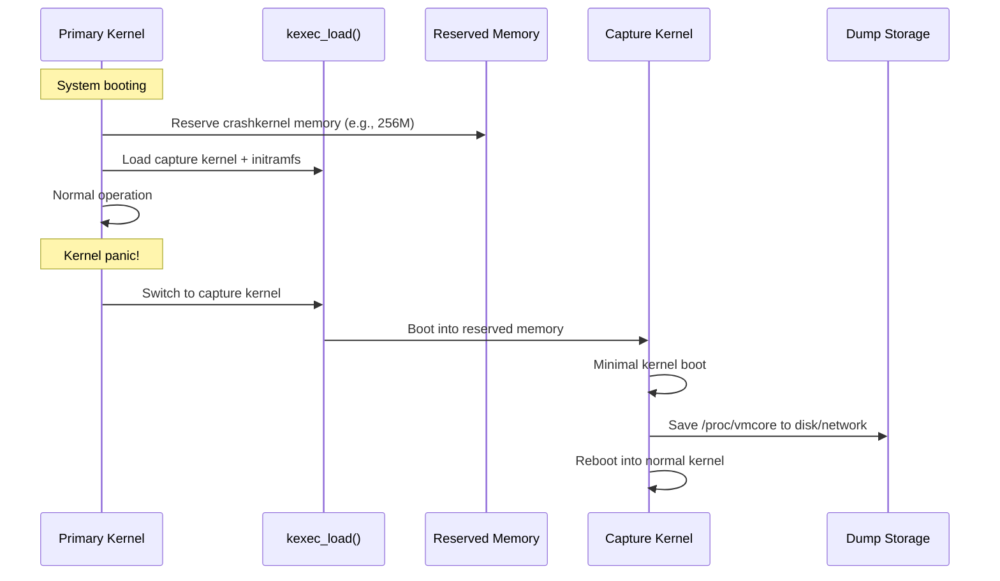

# Crash Dumps (kdump)

## Introduction

A crash dump is a snapshot of the system's memory taken at the moment of a kernel crash (panic). It captures the complete state of the system — all processes, kernel data structures, memory contents, and CPU registers — allowing post-mortem analysis with debuggers like `crash`. This is the most powerful tool for diagnosing kernel bugs that are difficult or impossible to reproduce.

**kdump** is the Linux kernel crash dump mechanism. It works by booting a minimal secondary kernel (the "capture kernel" or "kdump kernel") into a reserved memory region. When the primary kernel panics, it boots the capture kernel, which then saves the crashed kernel's memory to a dump file. This dump can later be analyzed offline.

## kdump Architecture



## Components

### kexec

kexec is a system call that allows loading and booting into a new kernel from a running kernel, bypassing the BIOS/firmware:

- **kexec_load()**: Loads the new kernel into memory
- **kexec_file_load()**: Loads kernel from file path (newer interface)
- **reboot(RB_KEXEC)**: Boots into the loaded kernel

### kdump

kdump uses kexec with the `--load-preserve-context` flag to load a capture kernel that will save the crashed kernel's memory.

### crash

The `crash` utility analyzes kernel dump files, providing GDB-like debugging of the kernel:

## Setup and Configuration

### Installation

```bash
# Install kdump and crash tools
# Debian/Ubuntu
sudo apt install linux-crashdump kdump-tools makedumpfile crash

# RHEL/CentOS/Fedora
sudo dnf install kexec-tools crash makedumpfile kernel-debuginfo

# The installation will:
# 1. Install kexec-tools
# 2. Configure GRUB to reserve crashkernel memory
# 3. Set up kdump service
```

### Boot Configuration

```bash
# GRUB configuration — reserve memory for capture kernel
# /etc/default/grub
GRUB_CMDLINE_LINUX="crashkernel=256M"
# or for auto-sizing:
GRUB_CMDLINE_LINUX="crashkernel=auto"

# For specific placement:
GRUB_CMDLINE_LINUX="crashkernel=256M@64M"
# Reserves 256MB starting at 64MB physical address

# Update GRUB and reboot
sudo update-grub
sudo reboot

# Verify crashkernel reservation
cat /proc/cmdline | grep crashkernel
# BOOT_IMAGE=/vmlinuz ... crashkernel=256M

# Check reserved memory
dmesg | grep -i crashkernel
# [    0.000000] Reserving 256MB of memory at 64MB for crashkernel

# View reserved region
cat /proc/iomem | grep -i crash
# 04000000-13ffffff : Crash kernel
```

### kdump.conf Configuration

```bash
# /etc/kdump.conf

# Where to save the dump
# Local filesystem:
path /var/crash

# Remote NFS:
# nfs server.example.com:/exports/crash

# Remote SSH:
# ssh user@dumpserver
# sshkey /root/.ssh/kdump_id_rsa

# Raw partition:
# /dev/sda5

# Core collector (makedumpfile)
core_collector makedumpfile -l --message-level 1 -d 31
# -l: use zlib compression
# -d 31: exclude pages (zero, cache, cache-private, user, free)

# Default action on failure
default reboot
# Options: reboot, halt, poweroff, shell, dump_to_rootfs

# Dump target
# ext4 /dev/sda2
# xfs /dev/sda3

# Filter level (makedumpfile)
# -d 31: exclude zero, cache, cache private, user, free pages
# -d 7:  exclude zero, cache, user pages
# -d 0:  no filtering (largest dump)

# Extra arguments for capture kernel
extra_modules ehci_hcd ohci_hcd xhci_hcd

# Kdump post-save action
# kdump_post /var/crash/scripts/post_save.sh

# Panic timeout
# default 0  # wait forever for manual intervention
# default 1  # reboot after 1 second
```

### Starting kdump

```bash
# Enable kdump service
sudo systemctl enable kdump
sudo systemctl start kdump

# Check kdump status
sudo systemctl status kdump
# ● kdump.service - Kernel crash dump capture service
#    Active: active (exited) since Mon 2024-01-01 12:00:00 UTC

# Check if kdump kernel is loaded
sudo kexec -l
# If no error, kernel is loaded and ready

# Verify kdump is operational
sudo kdump-config show
# USE_KDUMP:       1
# KDUMP_SYSCTL:    kernel.panic_on_oops=1
# KDUMP_COREDIR:   /var/crash
# crashkernel addr: 0x4000000
# /var/crash/linux-image-...: symbolic link to /boot/vmlinuz-...
```

## Testing kdump

### Trigger a Test Crash

```bash
# Method 1: SysRq trigger
echo c > /proc/sysrq-trigger
# This causes an immediate kernel panic

# Method 2: NMI (if configured)
echo 1 > /proc/sys/kernel/panic_on_oops
echo NMI > /proc/sysrq-trigger

# Method 3: Write to /proc/sysrq-trigger via SysRq key
# Alt+SysRq+C (if magic SysRq is enabled)

# Method 4: Module-based crash
# Create a simple module that dereferences NULL:
# (Not recommended in production!)
```

### After Crash

```bash
# After kdump saves the dump and reboots:
ls /var/crash/
# 2024.01.01-12:00:00/
#   vmcore
#   vmcore-dmesg.txt
#   makedumpfile.log

# View crash log
cat /var/crash/2024.01.01-12:00:00/vmcore-dmesg.txt
# [  123.456789] Kernel panic - not syncing: SysRq triggered crash
# [  123.456790] CPU: 0 PID: 1234 Comm: bash Not tainted 5.15.0-generic
# [  123.456791] Call Trace:
# [  123.456792]  <TASK>
# [  123.456793]  panic+0x100/0x2e0
# [  123.456794]  sysrq_handle_crash+0x1a/0x20
# [  123.456795]  ...
```

## Analyzing Crash Dumps with crash

### Starting crash

```bash
# Analyze a dump file
sudo crash /usr/lib/debug/boot/vmlinux-$(uname -r) /var/crash/2024.01.01-12:00:00/vmcore

# With System.map
sudo crash /boot/vmlinuz-$(uname -r) /var/crash/vmcore /boot/System.map-$(uname -r)

# For compressed dump
sudo crash vmlinux vmcore.1.gz

# Crash reads debug symbols from kernel debug package
# Debian/Ubuntu: linux-image-*-dbgsym_*.deb
# RHEL/Fedora: kernel-debuginfo-*.rpm
```

### crash Commands

```bash
# Basic system info
crash> sys
#      KERNEL: /usr/lib/debug/boot/vmlinux-5.15.0-generic
#    DUMPFILE: /var/crash/2024.01.01-12:00:00/vmcore
#        CPUS: 8
#        DATE: Mon Jan  1 12:00:00 2024
#      UPTIME: 1 day, 2:30:45
# LOAD AVERAGE: 1.23, 0.98, 0.76
#       TASKS: 512
#    NODENAME: myhost
#     RELEASE: 5.15.0-generic
#     VERSION: #1 SMP x86_64
#     MACHINE: x86_64  (2400 Mhz)
#      MEMORY: 16 GB
#       PANIC: "SysRq triggered crash"

# Show backtrace of panic task
crash> bt
# PID: 1234  TASK: ffff88810abcd000  CPU: 0  COMMAND: "bash"
#  #0 [ffff88810abcd800] machine_kexec at ffffffff81012345
#  #1 [ffff88810abcd860] __crash_kexec at ffffffff81067890
#  #2 [ffff88810abcd920] panic at ffffffff810abcdef
#  #3 [ffff88810abcd980] sysrq_handle_crash at ffffffff81123456
#  #4 [ffff88810abcd9a0] __handle_sysrq at ffffffff81123789
#  #5 [ffff88810abcda00] write_sysrq_trigger at ffffffff81123abc
#  #6 [ffff88810abcda20] proc_reg_write at ffffffff811def01
#  #7 [ffff88810abcda40] vfs_write at ffffffff811abcde
#  #8 [ffff88810abcda60] ksys_write at ffffffff811abcd0
#  #9 [ffff88810abcda80] do_syscall_64 at ffffffff81001234

# Show all task backtraces
crash> bt -a

# Show specific task
crash> bt <task_struct_address>

# View kernel log buffer (dmesg)
crash> log
# [    0.000000] Linux version 5.15.0-generic ...
# ... (full kernel log)
# [  123.456789] Kernel panic - not syncing: SysRq triggered crash

# View process list
crash> ps
#    PID    PPID  CPU  TASK        ST  %MEM   VSZ    RSS  COMM
# > 1234   1233    0  ffff88810  RU   0.1  12345   5678  bash
#      1       0    0  ffff88811  IN   0.2  23456  12345  systemd
#    ...

# Show current running tasks
crash> ps -l

# View memory info
crash> kmem -i
#                 PAGES        TOTAL      PERCENTAGE
#    TOTAL MEM  4194304       16 GB         ----
#         FREE  2097152        8 GB   50% of TOTAL MEM
#         USED  2097152        8 GB   50% of TOTAL MEM
#       SHARED    65536      256 MB    1% of TOTAL MEM
#      BUFFERS    32768      128 MB    0% of TOTAL MEM
#       CACHED   524288        2 GB   12% of TOTAL MEM
#         SLAB   131072      512 MB    3% of TOTAL MEM

# View kernel structures
crash> struct task_struct ffff88810abcd000
# (dumps all fields of the task_struct)

# View specific field
crash> struct task_struct.comm ffff88810abcd000
# comm = "bash\000\000\000\000\000\000\000\000"

# View kernel symbols
crash> sym jiffies
# ffffffff824abcde (type: unsigned long)

# Disassemble function
crash> dis sysrq_handle_crash
# 0xffffffff81123456 <sysrq_handle_crash>:   push   %rbp
# 0xffffffff81123457 <sysrq_handle_crash+1>: mov    %rsp,%rbp
# ...

# View page table entries
crash> kmem ffff88810abcd000

# View modules
crash> mod
#     MODULE          NAME          SIZE  OBJECT FILE
# ffff888100a12000  ext4         786432  /lib/modules/5.15.0/kernel/fs/ext4/ext4.ko
# ffff888100b34000  btrfs        524288  /lib/modules/5.15.0/kernel/fs/btrfs/btrfs.ko

# View network info
crash> net
#     LOCAL ADDRESS   REMOTE ADDRESS  PORT  STATE
# 0.0.0.0:22        0.0.0.0:*        LISTEN
# 192.168.1.100:22  192.168.1.1:5432  ESTABLISHED

# View files open by a task
crash> files 1234
# ROOT DIR: ffff888100123456
#  EXE: /usr/bin/bash
#  CWD: /root
#    0: /dev/pts/0
#    1: /dev/pts/0
#    2: /dev/pts/0

# Search memory
crash> search -k 0xdeadbeef

# View stack of all CPUs
crash> bt -a

# View interrupt info
crash> irq

# View swap info
crash> swap
```

### Advanced crash Analysis

```bash
# Analyze a deadlock
crash> struct task_struct.pid,comm,state ffff88810abcd000
#   pid = 1234
#   comm = "bash"
#   state = TASK_RUNNING

# Check lock contention
crash> struct mutex ffff888200123456
# owner = ffff88810abcd000  (task_struct pointer)
# wait_list = {next = ffff888100abc000, prev = ffff888100abc000}

# Analyze memory corruption
crash> kmem -s  # slab info
crash> kmem -v  # vmalloc info

# View kernel stack trace of all tasks on a specific CPU
crash> bt -c 3  # CPU 3

# View saved registers at panic
crash> sys -c
crash> bt -c 0
```

## Remote Dump Collection

### Dump to Network

```bash
# /etc/kdump.conf
# SSH dump
ssh root@dumpserver
sshkey /root/.ssh/kdump_id_rsa
path /var/crash
core_collector makedumpfile -l --message-level 1 -d 31

# Or NFS dump
nfs dumpserver:/exports/crash
path /var/crash

# Or dump over network to raw device
# net eth0
# link_delay 30
# disk_timeout 30
```

### makedumpfile Compression

```bash
# makedumpfile compresses and filters dump data
# Filter levels:
# -d 0:  No filtering (complete dump)
# -d 1:  Exclude zero pages
# -d 2:  Exclude zero and cache pages
# -d 4:  Exclude cache private pages
# -d 8:  Exclude user pages
# -d 16: Exclude free pages
# -d 31: Exclude all of the above (smallest dump)

# Typical usage:
makedumpfile -l -d 31 /proc/vmcore /var/crash/vmcore.dump

# Show dump file info
makedumpfile --dump-dumpfile /var/crash/vmcore.dump

# Convert dump format
makedumpfile -R /var/crash/vmcore.new < /var/crash/vmcore.old
```

## Common Scenarios

### Analyzing Kernel Oops

```bash
# View the oops from crash log
crash> log | grep -A50 "Oops"
# [  123.456789] BUG: unable to handle kernel NULL pointer dereference at 0000000000000010
# [  123.456790] PGD 0 P4D 0
# [  123.456791] Oops: 0000 [#1] SMP NOPTI
# [  123.456792] CPU: 2 PID: 5678 Comm: mydriver Not tainted 5.15.0

# Check the faulting instruction
crash> dis <faulting_address>

# View the backtrace
crash> bt
```

### Analyzing Soft Lockup

```bash
crash> log | grep -A10 "soft lockup"
# [  456.789012] watchdog: BUG: soft lockup - CPU#3 stuck for 22s! [mythread:1234]

crash> bt -c 3
# (backtrace on CPU 3 at time of lockup)
```

### Analyzing Memory Leak

```bash
# View slab usage
crash> kmem -s | sort -k3 -n -r | head -20
# (sorted by size, largest first)

# View specific slab cache
crash> kmem -S <slab_cache_address>

# Count allocations per slab
crash> kmem -s | awk '{print $1, $2, $3}' | sort -k3 -n -r
```

## Other Crash Dump Mechanisms

### kdump vs makedumpfile vs netconsole

| Tool | Purpose | Use Case |
|------|---------|----------|
| kdump | Boot capture kernel, save full dump | Complete post-mortem analysis |
| makedumpfile | Compress and filter dump data | Reduce dump size |
| netconsole | Send kernel log over network | Real-time log monitoring |
| pstore | Persistent storage (EFI, RAM) | Embedded systems |
| lkdtm | Kernel test module | Testing crash paths |

### netconsole

```bash
# Load netconsole module
modprobe netconsole netconsole=@/,@192.168.1.100/

# Or configure in /etc/modprobe.d/netconsole.conf
# options netconsole netconsole=@/,@192.168.1.100/

# View netconsole config
cat /sys/kernel/config/netconsole/target1/
# enabled  dev_name  local_port  remote_port  local_ip  remote_ip  local_mac  remote_mac

# On receiver:
nc -u -l -p 6666
```

### pstore (Persistent Storage)

```bash
# pstore saves crash info to persistent storage (EFI variables, RAM)
# Survives reboot

# View pstore contents
ls /sys/fs/pstore/
# dmesg-efi-1234567890  console-efi-1234567890

# Read crash log from previous boot
cat /sys/fs/pstore/dmesg-efi-1234567890
# [previous boot kernel log ending with panic]

# pstore backends
# ramoops: RAM-backed (survives warm reboot if RAM preserved)
# efi-pstore: EFI variable-backed
# mtd: Flash-backed (embedded)
```

## References

- [Kernel kdump Documentation](https://www.kernel.org/doc/html/latest/admin-guide/kdump/kdump.html)
- [crash utility documentation](https://crash-utility.github.io/)
- [makedumpfile documentation](https://github.com/makedumpfile/makedumpfile)
- [Red Hat: Kernel crash dump guide](https://docs.redhat.com/en/documentation/red_hat_enterprise_linux/9/html/managing_monitoring_and_updating_the_kernel/setting-up-kdump_managing-monitoring-and-updating-the-kernel)
- [LWN: Kernel crash dumps](https://lwn.net/Articles/158127/)
- [kexec and kdump](https://www.kernel.org/doc/html/latest/admin-guide/kdump/kdump.html)

## Related Topics

- [Kernel Debugging](./index.md) — Debugging techniques and tools
- [System Calls](../core/syscalls/index.md) — kexec system call
- [Memory Management](../mm/index.md) — Memory layout and allocation
- [Module Debugging](./modules.md) — Debugging kernel modules
