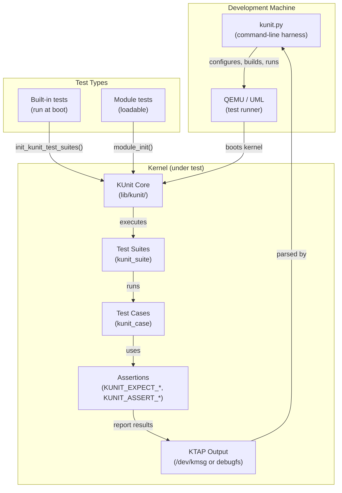

# KUnit — Kernel Unit Testing Framework

## Introduction

KUnit (Kernel Unit Testing Framework) is the Linux kernel's built-in unit
testing infrastructure. Introduced in Linux 5.5 (January 2020) by Google
engineers (Brendan Higgins et al.), KUnit brings the familiar xUnit-style
test experience to kernel development — define test cases, run them in
milliseconds, and see pass/fail results without rebooting or loading external
tools.

Unlike kernel selftests (`tools/testing/selftests/`) which test from user
space, KUnit tests run **inside the kernel**. They can test internal APIs,
data structures, and subsystem logic that are not exposed to user space.

## Architecture



## Core Concepts

### Test Cases

A test case is a single function that exercises one behavior:

```c
static void example_test_basic(struct kunit *test)
{
    /* Test body — assertions go here */
    KUNIT_EXPECT_EQ(test, 1 + 1, 2);
}
```

### Test Suites

A test suite groups related test cases:

```c
static struct kunit_case example_test_cases[] = {
    KUNIT_CASE(example_test_basic),
    KUNIT_CASE(example_test_edge_case),
    {}
};

static struct kunit_suite example_test_suite = {
    .name = "example",
    .test_cases = example_test_cases,
    .init = example_test_init,     /* optional setup */
    .exit = example_test_exit,     /* optional teardown */
};
```

### Test Attributes

KUnit supports test attributes for filtering and categorization:

```c
static struct kunit_case example_test_cases[] = {
    KUNIT_CASE(example_test_fast),
    KUNIT_CASE_PARAM(example_test_param, generate_params),
    {}
};
```

## Writing a KUnit Test

### Minimal Example

```c
/* lib/kunit/example-test.c */
#include <kunit/test.h>

static void kunit_example_test_basic(struct kunit *test)
{
    int *ptr = kunit_kzalloc(test, sizeof(int), GFP_KERNEL);

    KUNIT_ASSERT_NOT_NULL(test, ptr);

    *ptr = 42;
    KUNIT_EXPECT_EQ(test, *ptr, 42);
}

static struct kunit_case kunit_example_test_cases[] = {
    KUNIT_CASE(kunit_example_test_basic),
    {}
};

static struct kunit_suite kunit_example_test_suite = {
    .name = "kunit-example",
    .test_cases = kunit_example_test_cases,
};
kunit_test_suite(kunit_example_test_suite);

MODULE_LICENSE("GPL");
```

### Test with Init/Exit

```c
struct test_context {
    struct my_struct *obj;
    int scratch_value;
};

static int test_init(struct kunit *test)
{
    struct test_context *ctx;

    ctx = kunit_kzalloc(test, sizeof(*ctx), GFP_KERNEL);
    if (!ctx)
        return -ENOMEM;

    ctx->obj = my_struct_create();
    if (!ctx->obj)
        return -ENOMEM;

    test->priv = ctx;
    return 0;
}

static void test_exit(struct kunit *test)
{
    struct test_context *ctx = test->priv;

    my_struct_destroy(ctx->obj);
}

static void test_my_struct_field(struct kunit *test)
{
    struct test_context *ctx = test->priv;

    KUNIT_EXPECT_EQ(test, ctx->obj->field, expected_value);
}
```

## Assertions vs. Expectations

KUnit provides two families of checks:

### Expectations (non-fatal)

The test continues even if the check fails:

```c
/* These continue on failure */
KUNIT_EXPECT_EQ(test, actual, expected);      /* a == b */
KUNIT_EXPECT_NE(test, actual, expected);      /* a != b */
KUNIT_EXPECT_LT(test, actual, expected);      /* a < b */
KUNIT_EXPECT_LE(test, actual, expected);      /* a <= b */
KUNIT_EXPECT_GT(test, actual, expected);      /* a > b */
KUNIT_EXPECT_GE(test, actual, expected);      /* a >= b */
KUNIT_EXPECT_NULL(test, ptr);                 /* ptr == NULL */
KUNIT_EXPECT_NOT_NULL(test, ptr);             /* ptr != NULL */
KUNIT_EXPECT_TRUE(test, condition);           /* condition == true */
KUNIT_EXPECT_FALSE(test, condition);          /* condition == false */
KUNIT_EXPECT_STREQ(test, str1, str2);         /* strcmp(a, b) == 0 */
KUNIT_EXPECT_STRNEQ(test, str1, str2);        /* strcmp(a, b) != 0 */
KUNIT_EXPECT_MEMEQ(test, a, b, len);          /* memcmp == 0 */
KUNIT_EXPECT_NOT_NULL(test, ptr);             /* ptr != NULL */
```

### Assertions (fatal)

The test case is aborted if the check fails:

```c
/* These abort on failure — use for preconditions */
KUNIT_ASSERT_EQ(test, actual, expected);
KUNIT_ASSERT_NOT_NULL(test, ptr);         /* must succeed or abort */
KUNIT_ASSERT_NOT_ERR_OR_NULL(test, ptr);  /* not NULL and not IS_ERR */
KUNIT_ASSERT_TRUE(test, condition);
```

**When to use which:**
- Use `KUNIT_ASSERT_*` for **preconditions** (if this fails, nothing else
  in the test makes sense)
- Use `KUNIT_EXPECT_*` for **the actual test logic** (report all failures)

### Custom Failure Messages

```c
KUNIT_EXPECT_EQ_MSG(test, actual, expected,
                    "MyObject.field should be %d, got %d",
                    expected, actual);
```

## Running Tests

### Using kunit.py (Recommended)

```bash
# Run all tests
./tools/testing/kunit/kunit.py run

# Run a specific suite
./tools/testing/kunit/kunit.py run kunit-example

# Run with filtering
./tools/testing/kunit/kunit.py run --filter kunit-example

# List available tests
./tools/testing/kunit/kunit.py list

# Run with specific kernel config
./tools/testing/kunit/kunit.py run --kconfig_add CONFIG_DEBUG_KMEMLEAK=y

# Run using QEMU instead of UML
./tools/testing/kunit/kunit.py run --arch x86_64

# Generate .kunitconfig
./tools/testing/kunit/kunit.py genconfig
```

### kunit.py Output

```
TAP version 14
1..1
ok 1 - kunit-example
    # Subtest: kunit-example
    1..2
    ok 1 - kunit_example_test_basic
    ok 2 - kunit_example_test_edge_case
```

### Running as Module (Manual)

```bash
# Build the test as a module
make M=lib/kunit

# Load the module
insmod lib/kunit/example-test.ko

# View results in kernel log
dmesg | grep TAP

# Unload
rmmod example-test
```

### Running at Boot (Built-in)

When compiled as built-in (`CONFIG_KUNIT=y`), tests run automatically during
kernel boot:

```bash
# Filter boot-time tests via kernel command line
kunit.filter=kunit-example
```

### KTAP Output Format

KUnit outputs results in KTAP (Kernel Test Anything Protocol) format:

```
TAP version 14
1..2
    # Subtest: kunit-example
    1..3
    ok 1 - kunit_example_test_basic
    not ok 2 - kunit_example_test_edge_case
        # example_test_edge_case: EXPECTED 42 == 0
        # at lib/kunit/example-test.c:25
    ok 3 - kunit_example_test_param # skip
ok 1 - kunit-example
ok 2 - kunit-example2
```

### Reading Results from debugfs

When `CONFIG_KUNIT_DEBUGFS` is enabled:

```bash
# View test results
cat /sys/kernel/debug/kunit/results

# View specific suite
cat /sys/kernel/debug/kunit/kunit-example/results
```

## Common Test Patterns

### Parameterized Tests

Test the same logic with multiple inputs:

```c
static const int test_params[] = { 0, 1, -1, INT_MAX, INT_MIN };

static void param_test(struct kunit *test)
{
    int val = *(int *)test->param_value;

    KUNIT_EXPECT_EQ(test, my_function(val), expected_for(val));
}

static struct kunit_case param_cases[] = {
    KUNIT_CASE_PARAM(param_test, test_params),
    {}
};
```

### Testing Error Paths

```c
static void test_null_input(struct kunit *test)
{
    int ret;

    ret = my_function(NULL);
    KUNIT_EXPECT_EQ(test, ret, -EINVAL);
}

static void test_oom_allocation(struct kunit *test)
{
    /* KUnit allocators respect KUNIT test resource management */
    void *ptr = kunit_kmalloc(test, SIZE_MAX, GFP_KERNEL);
    KUNIT_EXPECT_NULL(test, ptr);
}
```

### Testing Static Functions

KUnit can test `static` functions by including the source file directly:

```c
/* In test file */
#include "my_source.c"  /* includes the static functions */

static void test_static_helper(struct kunit *test)
{
    /* Now we can call static_function() directly */
    KUNIT_EXPECT_EQ(test, static_function(input), expected);
}
```

### Test Cleanup with `kunit_resource`

```c
static int test_init(struct kunit *test)
{
    struct my_resource *res;

    res = my_resource_alloc();
    KUNIT_ASSERT_NOT_NULL(test, res);

    /* Automatically cleaned up when test ends */
    kunit_add_action(test, my_resource_free_action, res);

    test->priv = res;
    return 0;
}
```

## KUnit API Reference

### Memory Allocation

```c
void *kunit_kmalloc(struct kunit *test, size_t size, gfp_t gfp);
void *kunit_kzalloc(struct kunit *test, size_t size, gfp_t gfp);
void *kunit_kcalloc(struct kunit *test, size_t n, size_t size, gfp_t gfp);
void *kunit_kmalloc_array(struct kunit *test, size_t n, size_t size, gfp_t gfp);
char *kunit_kstrdup(struct kunit *test, const char *str);
void *kunit_memdup(struct kunit *test, void *src, size_t len);
void *kunit_kasprintf(struct kunit *test, gfp_t gfp, const char *fmt, ...);
```

All memory allocated with these functions is **automatically freed** when the
test completes, eliminating the need for manual cleanup.

### Resource Management

```c
int kunit_add_action(struct kunit *test,
                     void (*action)(void *),
                     void *data);
void kunit_remove_action(struct kunit *test,
                         void (*action)(void *),
                         void *data);
void kunit_release_action(struct kunit *test,
                          void (*action)(void *),
                          void *data);
```

### Skipping Tests

```c
/* Skip unconditionally */
kunit_skip(test, "Not supported on this architecture");

/* Skip based on condition */
if (!IS_ENABLED(CONFIG_SOME_FEATURE))
    kunit_skip(test, "CONFIG_SOME_FEATURE not enabled");
```

### Binary Assertions

```c
KUNIT_EXPECT_MEMEQ(test, buf1, buf2, len);      /* memcmp == 0 */
KUNIT_EXPECT_NOT_NULL(test, ptr);
KUNIT_ASSERT_NOT_ERR_OR_NULL(test, ptr);          /* !IS_ERR && != NULL */
```

## Integration with Kernel Subsystems

### Example: Testing a Linked List

```c
#include <kunit/test.h>
#include <linux/list.h>

struct test_node {
    int value;
    struct list_head list;
};

static void list_test_add(struct kunit *test)
{
    LIST_HEAD(head);
    struct test_node a = { .value = 1 };
    struct test_node b = { .value = 2 };

    list_add(&a.list, &head);
    list_add(&b.list, &head);

    /* list_add adds to head, so b should be first */
    struct test_node *first = list_first_entry(&head,
                                               struct test_node, list);
    KUNIT_EXPECT_EQ(test, first->value, 2);
}

static void list_test_del(struct kunit *test)
{
    LIST_HEAD(head);
    struct test_node a = { .value = 1 };

    list_add(&a.list, &head);
    KUNIT_EXPECT_FALSE(test, list_empty(&head));

    list_del(&a.list);
    KUNIT_EXPECT_TRUE(test, list_empty(&head));
}
```

### Example: Testing a Hash Table

```c
#include <kunit/test.h>
#include <linux/hashtable.h>

static void hashtable_test_insert(struct kunit *test)
{
    DEFINE_HASHTABLE(ht, 4);  /* 16 buckets */
    struct test_entry entries[3];
    int i;

    hash_init(ht);

    for (i = 0; i < 3; i++) {
        entries[i].key = i * 37;
        entries[i].value = i;
        hash_add(ht, &entries[i].node, entries[i].key);
    }

    /* Verify all entries are findable */
    struct test_entry *found;
    hash_for_each_possible(ht, found, node, 37) {
        KUNIT_EXPECT_EQ(test, found->key, 37);
    }
}
```

### Example: Testing Kernel Memory Allocator

```c
static void kmalloc_test_basic(struct kunit *test)
{
    void *ptr;

    ptr = kunit_kmalloc(test, 1024, GFP_KERNEL);
    KUNIT_ASSERT_NOT_NULL(test, ptr);

    /* Write to verify no crash */
    memset(ptr, 0xAA, 1024);

    /* No need to kfree — KUnit handles cleanup */
}
```

## Kernel Configuration

### Required Options

```
CONFIG_KUNIT=y                      # Core KUnit framework
CONFIG_KUNIT_DEBUGFS=y              # debugfs results (optional)
CONFIG_KUNIT_TEST=y                 # KUnit's own self-tests
```

### Test-Specific Options

Each subsystem's KUnit tests have their own config option:

```
CONFIG_LIST_KUNIT_TEST=y            # List API tests
CONFIG_HASHTABLE_KUNIT_TEST=y       # Hashtable tests
CONFIG_BITS_TEST=y                  # Bitmap/bitops tests
CONFIG_LINEAR_RANGES_TEST=y         # Linear ranges tests
CONFIG_SLUB_KUNIT_TEST=y            # SLUB allocator tests
```

### kunitconfig File

Create a `.kunitconfig` file in the kernel root for reproducible test configs:

```
CONFIG_KUNIT=y
CONFIG_KUNIT_TEST=y
CONFIG_KUNIT_DEBUGFS=y
CONFIG_LIST_KUNIT_TEST=y
CONFIG_HASHTABLE_KUNIT_TEST=y
```

## Test Style and Naming

### Naming Convention

```
Subsystem:       <subsystem>_test.c
Test suite:      <subsystem>_test_suite
Test cases:      <subsystem>_test_<what_is_tested>
Assertions:      KUNIT_EXPECT_* / KUNIT_ASSERT_*
```

### File Organization

```
lib/kunit/
├── kunit.c                 # Core framework
├── test.c                  # KUnit's own tests
├── example-test.c          # Example test
├── string-stream-test.c    # String stream tests
└── ...

mm/
├── slub.c
└── slub_kunit.c            # SLUB KUnit tests

drivers/gpu/drm/
├── drm_buddy.c
└── drm_buddy_test.c        # DRM buddy allocator tests
```

### Test Naming Best Practices

```c
/* Good: describes what is being tested */
static void test_kmalloc_zero_size(struct kunit *test) { ... }
static void test_list_add_empty(struct kunit *test) { ... }
static void test_rbtree_insert_duplicate(struct kunit *test) { ... }

/* Bad: vague or describes implementation */
static void test_1(struct kunit *test) { ... }
static void test_stuff(struct kunit *test) { ... }
```

## KUnit vs. Other Testing

| Feature | KUnit | kselftest | kprobes/bpftrace |
|---------|-------|-----------|-------------------|
| **Location** | In-kernel | User space | In-kernel (dynamic) |
| **Access** | Internal APIs | syscalls/ioctls | Kernel functions |
| **Speed** | Milliseconds | Seconds-minutes | Real-time |
| **Scope** | Unit tests | Integration tests | Observability |
| **Language** | C | C/Shell/Python | C/Scripting |
| **Debugging** | Assertions + trace | strace/ltrace | Trace output |
| **Requires reboot** | No (as module) | No | No |

### When to Use KUnit

- Testing a **specific function or data structure** in isolation
- Verifying **edge cases** (NULL, 0, MAX, negative)
- **Regression testing** for kernel API changes
- Testing **internal logic** not exposed to user space

### When NOT to Use KUnit

- Testing **hardware interactions** (use kselftest or manual testing)
- Testing **user-space interfaces** (use kselftest)
- **Performance testing** (use perf, benchmarks)
- **Fuzzing** (use syzkaller, KCov)

## Troubleshooting

### Common Issues

**Tests not found:**
```bash
# Check if test is configured
grep CONFIG_MY_KUNIT_TEST .config

# List available tests
./tools/testing/kunit/kunit.py list
```

**Tests fail in UML but pass on real hardware:**
```bash
# UML has limitations — try QEMU
./tools/testing/kunit/kunit.py run --arch x86_64
```

**Module loading fails:**
```bash
# Check kernel log
dmesg | tail -20

# Verify module was built
find . -name "*kunit*" -type f
```

**debugfs not showing results:**
```bash
# Check if debugfs is mounted
mount | grep debugfs

# Check if KUnit debugfs is enabled
grep CONFIG_KUNIT_DEBUGFS .config
```

## Kernel Source Map

| File | Purpose |
|------|---------|
| `lib/kunit/` | Core KUnit framework implementation |
| `include/kunit/test.h` | Main KUnit API header |
| `include/kunit/assert.h` | Assertion formatting |
| `include/kunit/attributes.h` | Test attribute support |
| `tools/testing/kunit/kunit.py` | Command-line test harness |
| `tools/testing/kunit/kunit_kernel.py` | Kernel build/run logic |
| `tools/testing/kunit/kunit_config.py` | Config management |
| `tools/testing/kunit/kunit_parser.py` | KTAP output parser |
| `lib/kunit/executor.c` | Test executor (built-in tests) |
| `lib/kunit/debugfs.c` | `/sys/kernel/debug/kunit/` support |

## Version History

| Kernel | Changes |
|--------|---------|
| 5.5 | KUnit introduced (Brendan Higgins, Google) |
| 5.6 | Parameterized tests, `KUNIT_ASSERT_*` macros |
| 5.7 | `kunit_tool` improvements, UML support |
| 5.10 | Test attributes, `kunit_add_action()` |
| 5.15 | `KUNIT_MEMEQ`, `KUNIT_NOT_NULL` assertions |
| 6.0 | debugfs results, module test improvements |
| 6.1 | `KUNIT_EXPECT_NOT_NULL` alias added |
| 6.3 | `kunit_kasprintf`, `kunit_memdup` helpers |
| 6.6 | Test filtering improvements, KTAP v2 draft |
| 6.8 | `KUNIT_SKIP()` macro, attribute-based filtering |

## References

1. **Kernel documentation**: https://docs.kernel.org/dev-tools/kunit/index.html
2. **KUnit architecture**: https://docs.kernel.org/dev-tools/kunit/architecture.html
3. **Writing tests**: https://docs.kernel.org/dev-tools/kunit/usage.html
4. **Test style guide**: https://docs.kernel.org/dev-tools/kunit/style.html
5. **KTAP specification**: https://docs.kernel.org/dev-tools/ktap.html
6. **Kernel source**: https://github.com/torvalds/linux/tree/master/lib/kunit
7. **LWN: KUnit — unit testing for the kernel**: https://lwn.net/Articles/808737/
8. **Brendan Higgins' LPC talk**: https://linuxplumbersconf.org/event/4/contributions/278/
