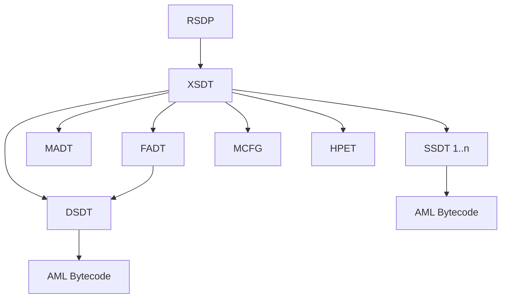
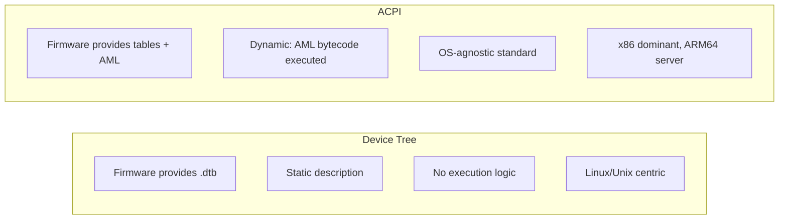

# ACPI (Advanced Configuration and Power Interface)

## Introduction

ACPI (Advanced Configuration and Power Interface) is the industry-standard interface for OS-directed configuration and power management. On x86 platforms, ACPI is the primary mechanism for hardware enumeration and power management, replacing the legacy Plug and Play (PnP) BIOS and Advanced Power Management (APM) interfaces. While ARM platforms predominantly use Device Tree (DT), ACPI is increasingly used on ARM64 servers (via ACPI 6.0+ for ARM).

Understanding ACPI is essential for writing drivers that work on x86 laptops, desktops, and servers. ACPI provides:
- Hardware device enumeration and configuration
- Power management (sleep states, device power states)
- Thermal management
- Battery and AC adapter information
- System event handling (lid switch, power button, docking)

## ACPI Tables

The BIOS/firmware provides ACPI tables in memory at boot. The kernel discovers them via the Root System Description Pointer (RSDP), which points to the Root System Description Table (RSDT/XSDT).



### Key ACPI Tables

| Table | Purpose |
|-------|---------|
| **RSDP** | Root pointer, located via EFI or BIOS signature |
| **XSDT** | Extended System Description Table, points to all other tables |
| **FADT** | Fixed ACPI Description Table — PM registers, reset, etc. |
| **DSDT** | Differentiated System Description Table — main AML code |
| **SSDT** | Secondary System Description Table — additional AML |
| **MADT** | Multiple APIC Description Table — interrupt controllers |
| **MCFG** | PCI MMIO configuration space base addresses |
| **HPET** | High Precision Event Timer configuration |
| **SRAT** | System Resource Affinity Table — NUMA topology |
| **SLIT** | System Locality Information Table — NUMA distances |
| **BERT** | Boot Error Record Table |
| **HEST** | Hardware Error Source Table |
| **ERST** | Error Record Serialization Table |

### Viewing ACPI Tables

```bash
# List all ACPI tables
ls /sys/firmware/acpi/tables/
# APIC  BERT  DSDT  FACP  FACS  HPET  MCFG  SSDT1  SSDT2  ...

# Dump a table in binary
sudo cp /sys/firmware/acpi/tables/DSDT /tmp/dsdt.dat

# Decompile DSDT to ASL (requires iasl)
sudo acpidump -b
iasl -d dsdt.dat
cat dsdt.dsl | head -100
# /*
#  * Intel ACPI Component Architecture
#  * AML/ASL+ Disassembler version 20210331
#  */
# DefinitionBlock ("", "DSDT", 2, "INTEL ", "SKL     ", 0x00000000)
# {
#     External (_SB_.PCI0.I2C0, DeviceObj)
#     ...

# View DSDT from sysfs hex
sudo xxd /sys/firmware/acpi/tables/DSDT | head -20

# Dump all tables
sudo acpidump > acpi.dump
acpixtract -a acpi.dump
```

## ACPI Namespace

The ACPI namespace is a hierarchical tree of named objects, similar to a filesystem. The root is `\`, and devices are addressed by path:

```
\                       # Root
├── _GPE               # General Purpose Events
├── _PR_               # Processor objects
│   ├── CPU0
│   └── CPU1
├── _SB_               # System Bus (main device container)
│   ├── PCI0            # PCI bus 0
│   │   ├── GFX0        # Graphics
│   │   ├── HDEF        # HD Audio
│   │   ├── EHC1        # USB controller
│   │   └── SAT0        # SATA controller
│   ├── I2C0            # I2C controller
│   │   ├── TPL0        # Touchscreen
│   │   └── TPAD        # Touchpad
│   ├── LID0            # Lid switch
│   └── PWRB            # Power button
├── _TZ_               # Thermal zones
│   └── TZ00
└── _SI_               # System indicators
```

### Reading the Namespace in Linux

```bash
# View ACPI device list
ls /sys/bus/acpi/devices/
# ACPI0003:00  ACPI000C:00  INT3400:00  LNXTHERM:00  ...

# Show ACPI device details
cat /sys/bus/acpi/devices/ACPI0003:00/status
# 15

# Show ACPI device path
cat /sys/bus/acpi/devices/ACPI0003:00/path
# \_SB_.ACAD

# List all ACPI devices with their HID
for dev in /sys/bus/acpi/devices/*/; do
    hid=$(cat "$dev/hid" 2>/dev/null)
    path=$(cat "$dev/path" 2>/dev/null)
    [ -n "$hid" ] && echo "$hid -> $path"
done
```

## Essential ACPI Methods

### _STA — Device Status

Returns the current status of a device:

```asl
Method (_STA, 0, NotSerialized)
{
    If (LEqual (OSYS, 2012))  // Windows 8 or later
    {
        Return (0x0F)  // Present, Enabled, Functioning, UI
    }
    Return (0x00)  // Not present
}
```

Return value bits:
- Bit 0: Present
- Bit 1: Enabled
- Bit 2: Show in UI
- Bit 3: Functioning
- Bit 4: Battery present (for battery devices)

### _INI — Device Initialization

Called once during device initialization, before _STA:

```asl
Method (_INI, 0, NotSerialized)
{
    // Initialize device
    Store (0x01, REGA)  // Set register
}
```

### _DSM — Device-Specific Method

The most important ACPI method for driver interaction. It's a generic function dispatch mechanism:

```asl
Method (_DSM, 4, Serialized)
{
    // Arg0: UUID (buffer)
    // Arg1: Revision ID (integer)
    // Arg2: Function index (integer)
    // Arg3: Function-specific argument (package/buffer)
    
    // Check UUID
    If (LEqual (Arg0, ToUUID ("xxxxxxxx-xxxx-xxxx-xxxx-xxxxxxxxxxxx")))
    {
        // Check revision
        If (LEqual (Arg1, 0x01))
        {
            Switch (Arg2)
            {
                Case (0x00)  // Function 0: Query supported functions
                {
                    Return (Buffer (0x01) { 0x07 })  // Functions 0,1,2
                }
                Case (0x01)  // Function 1: Get something
                {
                    Return (0x01)
                }
                Case (0x02)  // Function 2: Set something
                {
                    // Use Arg3
                    Return (Zero)
                }
            }
        }
    }
    Return (Buffer (One) { 0x00 })  // Not supported
}
```

### Calling _DSM from a Linux Driver

```c
#include <linux/acpi.h>

static int my_acpi_dsm_get(struct device *dev)
{
    acpi_handle handle = ACPI_HANDLE(dev);
    guid_t guid;
    union acpi_object *obj;
    union acpi_object argv4;
    int result;
    
    /* Parse the DSM UUID */
    guid_parse("xxxxxxxx-xxxx-xxxx-xxxx-xxxxxxxxxxxx", &guid);
    
    /* Prepare function argument */
    argv4.type = ACPI_TYPE_INTEGER;
    argv4.integer.value = 0;  /* function index */
    
    obj = acpi_evaluate_dsm(handle, &guid, 1, 0, &argv4);
    if (!obj)
        return -ENODEV;
    
    if (obj->type == ACPI_TYPE_INTEGER)
        result = obj->integer.value;
    else
        result = -EIO;
    
    ACPI_FREE(obj);
    return result;
}
```

### Other Important Methods

| Method | Purpose |
|--------|---------|
| `_CRS` | Current Resource Settings — what the device uses |
| `_PRS` | Possible Resource Settings — what the device can use |
| `_SRS` | Set Resource Settings — configure the device |
| `_DIS` | Disable the device |
| `_PS0`/`_PS3` | Power state 0 (on) / 3 (off) |
| `_WAK` | Wake from sleep |
| `_GPE` | General Purpose Event handler |
| `_REG` | Region availability notification |
| `_ADR` | Address — PCI slot/function or bus address |
| `_HID` | Hardware ID — PNP/ACPI ID |
| `_CID` | Compatible ID — alternative IDs |
| `_UID` | Unique ID — disambiguate multiple instances |
| `_SUB` | Subsystem ID |
| `_STR` | String — human-readable device name |
| `_EVT` | Event method for GPE handling |
| `_OSI` | Operating System Interface — OS identification |

## ACPI Thermal Zone

```asl
ThermalZone (TZ00)
{
    _TMP ()   // Get current temperature
    _PSV ()   // Passive cooling trip point
    _CRT ()   // Critical temperature
    _HOT ()   // Hot temperature (sleep trigger)
    _TC1 ()   // Thermal constant 1
    _TC2 ()   // Thermal constant 2
    _TSP ()   // Thermal sampling period
    _AC0 ()   // Active cooling trip point 0
    
    Method (_TMP, 0, Serialized)
    {
        Store (\_SB.PCI0.LPCB.EC.TMP, Local0)
        Return (Local0)
    }
    
    Method (_PSV, 0, Serialized)
    {
        Return (3580)  // 35.8°C in deciKelvin
    }
    
    Method (_CRT, 0, Serialized)
    {
        Return (3780)  // 37.8°C in deciKelvin
    }
    
    Method (_AC0, 0, Serialized)
    {
        Return (3480)  // 34.8°C
    }
}
```

```bash
# View thermal zones
ls /sys/class/thermal/
# thermal_zone0  thermal_zone1  ...

cat /sys/class/thermal/thermal_zone0/type
# acpitz
cat /sys/class/thermal/thermal_zone0/temp
# 45000

# List cooling devices
cat /sys/class/thermal/cooling_device0/type
# Processor
```

## ACPI Drivers

### ACPI Device Driver

```c
#include <linux/module.h>
#include <linux/acpi.h>
#include <linux/platform_device.h>

struct my_acpi_data {
    void __iomem *base;
    int irq;
};

static int my_acpi_probe(struct platform_device *pdev)
{
    struct my_acpi_data *data;
    struct resource *res;
    acpi_handle handle;
    struct acpi_device *adev;
    
    data = devm_kzalloc(&pdev->dev, sizeof(*data), GFP_KERNEL);
    if (!data)
        return -ENOMEM;
    
    /* Get resources from ACPI _CRS */
    res = platform_get_resource(pdev, IORESOURCE_MEM, 0);
    if (!res)
        return -ENOENT;
    data->base = devm_ioremap_resource(&pdev->dev, res);
    
    data->irq = platform_get_irq(pdev, 0);
    
    /* Access ACPI device */
    handle = ACPI_HANDLE(&pdev->dev);
    adev = ACPI_COMPANION(&pdev->dev);
    
    /* Call ACPI method */
    acpi_status status;
    unsigned long long sta;
    status = acpi_evaluate_integer(handle, "_STA", NULL, &sta);
    if (ACPI_SUCCESS(status))
        dev_info(&pdev->dev, "device status: 0x%llx\n", sta);
    
    /* Call _DSM */
    int val = my_acpi_dsm_get(&pdev->dev);
    
    platform_set_drvdata(pdev, data);
    return 0;
}

static const struct acpi_device_id my_acpi_ids[] = {
    { "MYDV0001" },
    { "" }
};
MODULE_DEVICE_TABLE(acpi, my_acpi_ids);

static struct platform_driver my_acpi_driver = {
    .driver = {
        .name = "my-acpi-device",
        .acpi_match_table = my_acpi_ids,
    },
    .probe = my_acpi_probe,
};
module_platform_driver(my_acpi_driver);
```

### ACPI Companion for Platform Devices

A DT-based driver can add ACPI support via companion devices:

```c
static const struct of_device_id my_of_ids[] = {
    { .compatible = "vendor,my-device" },
    { }
};

static const struct acpi_device_id my_acpi_ids[] = {
    { "VEND0001" },
    { }
};

static struct platform_driver my_driver = {
    .driver = {
        .name = "my-device",
        .of_match_table = my_of_ids,
        .acpi_match_table = my_acpi_ids,
    },
    .probe = my_probe,
};
```

## ACPI vs Device Tree



| Aspect | Device Tree | ACPI |
|--------|-------------|------|
| Description | Static binary blob | Tables + executable AML bytecode |
| Runtime | Passive data | Active: AML interpreter runs methods |
| Power management | Minimal (OS handles) | Rich (PS0-PS3, wake, thermal) |
| Enumeration | Passive (compatible strings) | Active (_STA, _HID, _CRS methods) |
| Hot-plug | Limited | Full support |
| Platform | ARM, RISC-V, embedded | x86, ARM64 server |
| Debugging | dtc decompiler | iasl decompiler |
| Extensibility | Vendor bindings (reviewed) | Vendor methods (potentially buggy) |

### ACPI/DT Equivalents

| DT Concept | ACPI Equivalent |
|------------|-----------------|
| `compatible` | `_HID` + `_CID` |
| `reg` | `_CRS` memory resources |
| `interrupts` | `_CRS` interrupt resources |
| `status = "okay"` | `_STA` returning present+enabled |
| `clocks` | ACPI clock framework / _DSD |
| `reset-gpios` | `_DSD` GPIO properties |
| `power-domains` | ACPI power domains |
| `#address-cells` | Implicit in _CRS format |

## General Purpose Events (GPE)

GPEs are ACPI's interrupt mechanism for system events:

```asl
// GPE handler for EC (Embedded Controller)
Scope (\_GPE)
{
    Method (_L17, 0, NotSerialized)  // Level-triggered GPE 0x17
    {
        // Read EC query
        Store (\_SB.PCI0.LPCB.EC.ECQuery, Local0)
        Switch (Local0)
        {
            Case (0x01)  // AC adapter inserted
            {
                Notify (\_SB_.ACAD, 0x80)
            }
            Case (0x02)  // Battery status change
            {
                Notify (\_SB_.BAT0, 0x80)
            }
            Case (0x03)  // Lid opened
            {
                Notify (\_SB_.LID0, 0x80)
            }
        }
    }
}
```

```bash
# View GPE information
cat /sys/firmware/acpi/interrupts/gpe_all
#  17:         42  enabled
#  1E:          0  disabled

# Enable/disable specific GPE
echo enable > /sys/firmware/acpi/interrupts/gpe17
echo disable > /sys/firmware/acpi/interrupts/gpe17
```

## Debugging ACPI

```bash
# Enable ACPI debug output (at boot)
# Add to kernel command line: acpi.debug_layer=0x2 acpi.debug_level=0x2

# Runtime debug
echo 0x2 > /sys/module/acpi/parameters/debug_layer
echo 0x2 > /sys/module/acpi/parameters/debug_level

# View ACPI device status
for dev in /sys/bus/acpi/devices/*/; do
    name=$(basename "$dev")
    status=$(cat "$dev/status" 2>/dev/null)
    echo "$name: status=$status"
done

# Trace ACPI method execution
# Add: acpi.trace_method_name=_DSM
# or use acpi_exec tool from ACPICA

# List thermal zones
for tz in /sys/class/thermal/thermal_zone*/; do
    echo "$(cat $tz/type): $(cat $tz/temp)°C"
done

# View battery info (if ACPI battery present)
cat /sys/class/power_supply/BAT0/status
# Charging
cat /sys/class/power_supply/BAT0/capacity
# 85
```

## Common Pitfalls

1. **BIOS bugs**: Many ACPI implementations contain buggy AML. Use DMI quirks to work around them.
2. **OSI detection**: Some BIOSes behave differently based on `_OSI` responses. The kernel reports as Windows unless overridden.
3. **Resource conflicts**: ACPI _CRS may conflict with other firmware-assigned resources.
4. **_DSM complexity**: Vendor-specific DSMs are often undocumented and reverse-engineered.

```c
/* DMI-based quirk example */
static const struct dmi_system_id my_quirks[] = {
    {
        .ident = "Broken BIOS laptop",
        .matches = {
            DMI_MATCH(DMI_SYS_VENDOR, "Vendor Inc."),
            DMI_MATCH(DMI_PRODUCT_NAME, "Laptop X"),
        },
        .driver_data = (void *)QUIRK_NO_ACPI,
    },
    { }
};

static int __init my_init(void)
{
    const struct dmi_system_id *id;
    
    id = dmi_first_match(my_quirks);
    if (id)
        pr_info("Applying quirk for %s\n", id->ident);
    /* ... */
}
```

## References

- [ACPI Specification 6.4](https://uefi.org/specifications/ACPI/6.4/)
- [ACPICA Project](https://acpica.org/)
- [Kernel ACPI Documentation](https://docs.kernel.org/firmware-guide/acpi/)
- [LWN: ACPI and device tree](https://lwn.net/Articles/571377/)
- [Linux ACPI Developer Guide](https://docs.kernel.org/firmware-guide/acpi/enumeration.html)
- [AML Decompiler (iasl)](https://github.com/acpica/acpica)

## Related Topics

- [Platform Drivers](./platform-drivers.md) — ACPI devices presented as platform devices
- [Power Management](../pm/index.md) — ACPI sleep states, runtime PM
- [GPIO](./gpio.md) — ACPI GPIO resources
- [Interrupt Handling](./interrupt-handling.md) — ACPI interrupt routing
- [Device Tree](../devicetree/index.md) — The alternative firmware interface
