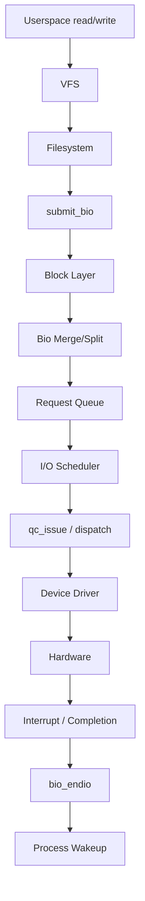

# Block Device Drivers

## Introduction

Block device drivers are a fundamental class of Linux device drivers that manage devices which transfer data in fixed-size blocks — disks, SSDs, NVMe drives, SD cards, loop devices, and RAM disks. Unlike character devices which present a stream of bytes, block devices expose randomly addressable collections of equally-sized blocks, typically 512 bytes or 4096 bytes.

The Linux block I/O subsystem is one of the most architecturally sophisticated parts of the kernel. It sits between the filesystem layer (or raw userspace access via `O_DIRECT`) and the physical device driver, providing buffering, scheduling, merging, and multiplexing of I/O requests.

Understanding block drivers requires grasping several core data structures: the `gendisk` (generic disk), the `request_queue`, the `block_device_operations`, and the `bio` (block I/O) structure. Together these form the interface between the kernel's block layer and device-specific driver code.

## Core Data Structures

### struct gendisk

The `gendisk` (generic disk) structure is the kernel's representation of a disk device. Every block driver must allocate and initialize a `gendisk`. It is defined in `<linux/genhd.h>`:

```c
struct gendisk {
    int major;                  /* major number */
    int first_minor;            /* first minor number */
    int minors;                 /* maximum number of minors */
    char disk_name[DISK_NAME_LEN];  /* disk name, e.g. "sda" */
    
    struct request_queue *queue;     /* request queue */
    struct block_device_operations *fops;  /* operations */
    struct gendisk *slave;           /* slave disk (for DM/MD) */
    
    /* partitioning */
    struct disk_part_tbl *part_tbl;
    struct block_device *part0;
    
    /* flags and state */
    unsigned long flags;
    unsigned long state;
    
    /* events */
    atomic_t sync_io;
    struct timer_rand_state *random;
    
    /* device model integration */
    struct device *parent_dev;
    struct kobject *slave_dir;
    struct kobject kobj;
    
    /* integrity */
    struct blk_integrity *integrity;
    
    /* capacity in sectors */
    sector_t capacity;
};
```

Key fields:

- **`major`/`first_minor`/`minors`**: Define the device number range. The major number identifies the driver; minors distinguish individual devices and partitions.
- **`disk_name`**: The name visible in `/dev/` and in kernel messages (e.g., `sda`, `nvme0n1`).
- **`queue`**: Pointer to the `request_queue` that manages I/O requests for this disk.
- **`fops`**: Pointer to the `block_device_operations` structure.
- **`capacity`**: The disk size in 512-byte sectors.

### struct request_queue

The `request_queue` manages the flow of I/O requests to a block device:

```c
struct request_queue {
    struct list_head queue_head;
    struct request *last_merge;
    struct elevator_queue *elevator;
    
    /* queue limits */
    struct queue_limits limits;
    
    /* callback to driver */
    make_request_fn *make_request_fn;
    
    /* queue settings */
    unsigned long queue_flags;
    unsigned int nr_requests;
    
    /* queue heads */
    struct blk_mq_ctx *queue_ctx;
    
    spinlock_t queue_lock;
    spinlock_t __queue_lock;
    
    /* completion and requeue */
    struct list_head timeout_list;
    struct work_struct timeout_work;
    
    /* backing device */
    struct backing_dev_info *backing_dev_info;
    
    /* queue congestion */
    int nr_congestion_on;
    int nr_congestion_off;
};
```

### struct block_device_operations

This structure defines the operations a block driver supports:

```c
struct block_device_operations {
    int (*open)(struct block_device *, fmode_t);
    void (*release)(struct gendisk *, fmode_t);
    int (*ioctl)(struct block_device *, fmode_t, unsigned, unsigned long);
    int (*compat_ioctl)(struct block_device *, fmode_t, unsigned, unsigned long);
    int (*direct_access)(struct block_device *, sector_t, void **, pfn_t *);
    unsigned int (*check_events)(struct gendisk *disk, unsigned int clearing);
    int (*media_changed)(struct gendisk *);
    void (*unlock_native_capacity)(struct gendisk *);
    int (*revalidate_disk)(struct gendisk *);
    int (*getgeo)(struct block_device *, struct hd_geometry *);
    void (*swap_slot_free_notify)(struct block_device *, unsigned long);
    struct module *owner;
    const struct pr_ops *pr_ops;
};
```

### struct bio

The `bio` structure is the fundamental unit of block I/O:

```c
struct bio {
    struct bio *bi_next;           /* link in request */
    struct block_device *bi_bdev;  /* target device */
    unsigned int bi_opf;           /* op and flags */
    unsigned short bi_flags;       /* bio flags */
    unsigned short bi_vcnt;        /* number of bio_vecs */
    unsigned short bi_idx;         /* current index into bio_vecs */
    
    blk_status_t bi_status;        /* completion status */
    atomic_t __bi_remaining;
    
    struct bvec_iter bi_iter;      /* current iterator position */
    
    bio_end_io_t *bi_end_io;      /* completion callback */
    void *bi_private;              /* driver-private data */
    
    unsigned short bi_max_vecs;    /* max bio_vecs allocated */
    struct bio_vec *bi_io_vec;     /* scatter/gather list */
    
    /* integrity payload */
    struct bio_set *bi_pool;
};
```

Each `bio` contains a scatter-gather list of `bio_vec` entries:

```c
struct bio_vec {
    struct page *bv_page;      /* page containing data */
    unsigned int bv_len;       /* bytes in this segment */
    unsigned int bv_offset;    /* offset within page */
};
```

## Block I/O Flow



### Bio Lifecycle

1. **Creation**: A filesystem or direct I/O caller creates a `bio` via `bio_alloc()`, populating it with pages and the target sector.
2. **Submission**: `submit_bio()` passes the bio into the block layer.
3. **Merging/Splitting**: The block layer may merge adjacent bios or split oversized ones.
4. **Queuing**: The bio enters the request queue, where the I/O scheduler may reorder it.
5. **Dispatch**: The driver's `make_request_fn` or `queue_rq` callback receives the bio.
6. **Hardware Transfer**: The driver programs the hardware to perform the DMA.
7. **Completion**: The hardware interrupt triggers `bio_endio()`, which calls the completion callback and wakes the waiting process.

## Multi-Queue Block Layer (blk-mq)

Modern Linux kernels (3.13+) use the multi-queue block layer (`blk-mq`) to scale across multiple CPU cores and hardware queues:

```c
struct blk_mq_ops {
    blk_status_t (*queue_rq)(struct blk_mq_hw_ctx *hctx,
                             const struct blk_mq_queue_data *bd);
    void (*complete)(struct request *rq);
    int (*init_hctx)(struct blk_mq_hw_ctx *hctx, void *data,
                     unsigned int hctx_idx);
    void (*exit_hctx)(struct blk_mq_hw_ctx *hctx, unsigned int hctx_idx);
    int (*init_request)(struct blk_mq_tag_set *set, struct request *rq,
                        unsigned int hctx_idx, unsigned int numa_node);
    void (*exit_request)(struct blk_mq_tag_set *set, struct request *rq,
                         unsigned int hctx_idx);
    bool (*busy)(struct blk_mq_hw_ctx *hctx);
};
```

### Registration with blk-mq

```c
/* 1. Define the tag set */
struct blk_mq_tag_set {
    struct blk_mq_ops *ops;
    unsigned int nr_hw_queues;
    unsigned int queue_depth;
    unsigned int reserved_tags;
    unsigned int cmd_size;
    int numa_node;
    unsigned int flags;
    void *driver_data;
};

/* 2. Allocate and initialize */
struct my_dev {
    struct blk_mq_tag_set tag_set;
    struct gendisk *disk;
    struct request_queue *queue;
    /* hardware-specific fields */
};

static const struct blk_mq_ops my_mq_ops = {
    .queue_rq = my_queue_rq,
    .complete = my_complete,
    .init_request = my_init_request,
};

static int my_setup(struct my_dev *mydev)
{
    int ret;
    
    mydev->tag_set.ops = &my_mq_ops;
    mydev->tag_set.nr_hw_queues = 4;
    mydev->tag_set.queue_depth = 256;
    mydev->tag_set.numa_node = NUMA_NO_NODE;
    mydev->tag_set.cmd_size = sizeof(struct my_request);
    mydev->tag_set.flags = BLK_MQ_F_SHOULD_MERGE;
    
    ret = blk_mq_alloc_tag_set(&mydev->tag_set);
    if (ret)
        return ret;
    
    mydev->disk = blk_mq_alloc_disk(&mydev->tag_set, mydev);
    if (IS_ERR(mydev->disk)) {
        blk_mq_free_tag_set(&mydev->tag_set);
        return PTR_ERR(mydev->disk);
    }
    
    mydev->queue = mydev->disk->queue;
    mydev->disk->major = MY_MAJOR;
    mydev->disk->first_minor = 0;
    mydev->disk->minors = 1;
    strcpy(mydev->disk->disk_name, "mydev");
    mydev->disk->fops = &my_fops;
    set_capacity(mydev->disk, MY_CAPACITY_SECTORS);
    
    ret = add_disk(mydev->disk);
    if (ret) {
        blk_cleanup_disk(mydev->disk);
        blk_mq_free_tag_set(&mydev->tag_set);
        return ret;
    }
    
    return 0;
}
```

## Implementing a Simple Block Driver

### The queue_rq Callback

```c
static blk_status_t my_queue_rq(struct blk_mq_hw_ctx *hctx,
                                 const struct blk_mq_queue_data *bd)
{
    struct request *rq = bd->rq;
    struct my_dev *mydev = rq->q->queuedata;
    struct bio_vec bvec;
    struct req_iterator iter;
    sector_t sector = blk_rq_pos(rq);
    
    blk_mq_start_request(rq);
    
    rq_for_each_bvec(bvec, rq, iter) {
        /* Transfer data to/from hardware */
        int ret = my_hw_xfer(mydev, sector, bvec.bv_page,
                             bvec.bv_offset, bvec.bv_len,
                             rq_data_dir(rq));
        if (ret) {
            blk_mq_end_request(rq, BLK_STS_IOERR);
            return BLK_STS_IOERR;
        }
        sector += bvec.bv_len >> 9;
    }
    
    blk_mq_end_request(rq, BLK_STS_OK);
    return BLK_STS_OK;
}
```

### Traditional (Legacy) Block Driver Example

For simpler or educational drivers using the legacy single-queue interface:

```c
#include <linux/module.h>
#include <linux/genhd.h>
#include <linux/blkdev.h>
#include <linux/hdreg.h>

#define MYDISK_MAJOR        240
#define MYDISK_MINORS       16
#define MYDISK_BLOCK_SIZE   512
#define MYDISK_SIZE_SECTORS (1024 * 1024)  /* 512 MB */

static struct mydisk_dev {
    struct gendisk *gd;
    struct request_queue *queue;
    spinlock_t lock;
    unsigned char *data;      /* backing store (RAM disk) */
    size_t size;
} mydev;

static void mydisk_request(struct request_queue *q)
{
    struct request *req;
    
    while ((req = blk_fetch_request(q)) != NULL) {
        struct mydisk_dev *dev = req->q->queuedata;
        sector_t sector = blk_rq_pos(req);
        unsigned long offset = sector * MYDISK_BLOCK_SIZE;
        unsigned long nbytes = blk_rq_bytes(req);
        int err = 0;
        
        if (offset + nbytes > dev->size) {
            pr_err("mydisk: out of bounds\n");
            err = -EIO;
            goto done;
        }
        
        if (rq_data_dir(req) == READ)
            memcpy(req->buffer, dev->data + offset, nbytes);
        else
            memcpy(dev->data + offset, req->buffer, nbytes);
        
done:
        __blk_end_request(req, err, nbytes);
    }
}

static int mydisk_open(struct block_device *bdev, fmode_t mode)
{
    return 0;
}

static void mydisk_release(struct gendisk *gd, fmode_t mode)
{
}

static const struct block_device_operations mydisk_fops = {
    .owner   = THIS_MODULE,
    .open    = mydisk_open,
    .release = mydisk_release,
};

static int __init mydisk_init(void)
{
    /* Allocate backing store */
    mydev.size = MYDISK_SIZE_SECTORS * MYDISK_BLOCK_SIZE;
    mydev.data = vmalloc(mydev.size);
    if (!mydev.data)
        return -ENOMEM;
    memset(mydev.data, 0, mydev.size);
    
    spin_lock_init(&mydev.lock);
    
    /* Set up request queue */
    mydev.queue = blk_init_queue(mydisk_request, &mydev.lock);
    if (!mydev.queue)
        goto out_free;
    mydev.queue->queuedata = &mydev;
    
    /* Allocate gendisk */
    mydev.gd = alloc_disk(MYDISK_MINORS);
    if (!mydev.gd)
        goto out_queue;
    
    mydev.gd->major = MYDISK_MAJOR;
    mydev.gd->first_minor = 0;
    mydev.gd->fops = &mydisk_fops;
    strcpy(mydev.gd->disk_name, "mydisk");
    mydev.gd->queue = mydev.queue;
    set_capacity(mydev.gd, MYDISK_SIZE_SECTORS);
    
    add_disk(mydev.gd);
    pr_info("mydisk: loaded, %zu MB\n", mydev.size / (1024 * 1024));
    return 0;

out_queue:
    blk_cleanup_queue(mydev.queue);
out_free:
    vfree(mydev.data);
    return -ENOMEM;
}

static void __exit mydisk_exit(void)
{
    del_gendisk(mydev.gd);
    put_disk(mydev.gd);
    blk_cleanup_queue(mydev.queue);
    vfree(mydev.data);
    pr_info("mydisk: unloaded\n");
}

module_init(mydisk_init);
module_exit(mydisk_exit);
MODULE_LICENSE("GPL");
MODULE_DESCRIPTION("Simple RAM disk block driver");
```

## Queue Limits and Geometry

Drivers configure queue limits to describe hardware capabilities:

```c
struct queue_limits {
    unsigned long bounce_pfn;
    unsigned long seg_boundary_mask;
    unsigned int max_hw_sectors;
    unsigned int max_dev_sectors;
    unsigned int chunk_sectors;
    unsigned int max_sectors;
    unsigned int max_segment_size;
    unsigned int physical_block_size;
    unsigned int logical_block_size;
    unsigned int alignment_offset;
    unsigned int io_min;
    unsigned int io_opt;
    unsigned int max_discard_sectors;
    unsigned int max_hw_discard_sectors;
    unsigned int max_write_same_sectors;
    unsigned int max_write_zeroes_sectors;
    unsigned int max_zone_append_sectors;
    unsigned int discard_granularity;
    unsigned int discard_alignment;
    unsigned int max_active_zones;
    unsigned int max_open_zones;
    unsigned int max_active_append_sectors;
    unsigned short max_discard_segments;
    unsigned char misaligned;
    unsigned char discard_misaligned;
    unsigned char raid_partial_stripes_expensive;
    unsigned char zoned;
    unsigned int nr_zones;
    unsigned int max_open_zones;
    unsigned int max_active_zones;
    sector_t zone_capacity;
};
```

Setting limits in a driver:

```c
blk_queue_logical_block_size(mydev->queue, 512);
blk_queue_physical_block_size(mydev->queue, 4096);
blk_queue_max_hw_sectors(mydev->queue, 256);
blk_queue_max_segment_size(mydev->queue, 65536);
blk_queue_max_segments(mydev->queue, 128);
```

## Partition Handling

The kernel provides automatic partition scanning via `add_disk()`. For disks with a GPT or MBR partition table, the block layer reads the partition table and creates sub-block devices (e.g., `sda1`, `sda2`):

```c
/* after setting capacity, add_disk triggers partition scan */
set_capacity(mydev->disk, capacity_sectors);
add_disk(mydev->disk);  /* partitions appear automatically */
```

Drivers that need to invalidate partitions call:

```c
bdev_set_nr_sectors(mydev->disk->part0, new_capacity);
/* or trigger a rescan */
mydev->disk->fops->revalidate_disk(mydev->disk);
```

## Integration with sysfs and udev

Every block device creates a sysfs entry under `/sys/block/`:

```
/sys/block/sda/
    ├── sda1/              # partition
    ├── sda2/
    ├── capability
    ├── dev                 # "8:0"
    ├── device -> ../../...
    ├── discard_alignment
    ├── ext_range
    ├── hidden
    ├── holders/
    ├── inflight
    ├── queue/
    │   ├── hw_sector_size
    │   ├── logical_block_size
    │   ├── max_hw_sectors_kb
    │   ├── max_sectors_kb
    │   ├── nr_requests
    │   ├── physical_block_size
    │   ├── read_ahead_kb
    │   ├── rotational
    │   ├── scheduler
    │   └── ...
    ├── range
    ├── removable
    ├── ro
    ├── size
    ├── slaves/
    └── stat
```

## Command: Inspecting Block Devices

```bash
# List all block devices
lsblk
# NAME   MAJ:MIN RM   SIZE RO TYPE MOUNTPOINTS
# sda      8:0    0   500G  0 disk
# ├─sda1   8:1    0     1G  0 part /boot
# └─sda2   8:2    0   499G  0 part /
# nvme0n1 259:0   0   1TB   0 disk
# ├─nvme0n1p1 259:1 0  512M 0 part /boot/efi
# └─nvme0n1p2 259:2 0  999G 0 part /

# Detailed info
lsblk -o NAME,SIZE,TYPE,FSTYPE,MOUNTPOINT,UUID,MODEL

# Show queue parameters
cat /sys/block/sda/queue/scheduler
# [mq-deadline] kyber bfq none

cat /sys/block/sda/queue/nr_requests
# 256

# Block device info via sysfs
cat /sys/block/sda/queue/hw_sector_size
# 512

# I/O statistics
cat /proc/diskstats
#  8       0 sda 123456 7890 1234567 45678 12345 6789 234567 89012 0 56789 134790

# Using blockdev
blockdev --getsize64 /dev/sda
# 536870912000
blockdev --getss /dev/sda
# 512
```

## Bio Handling Details

### Allocating and Submitting a Bio

```c
/* Allocate a bio for a single page */
struct bio *bio = bio_alloc(GFP_KERNEL, 1);
bio->bi_bdev = bdev;
bio->bi_iter.bi_sector = sector;
bio->bi_opf = REQ_OP_READ;

/* Add a page to the bio */
bio_add_page(bio, page, len, offset);

/* Set completion callback */
bio->bi_end_io = my_bio_endio;
bio->bi_private = my_data;

/* Submit */
submit_bio(bio);
```

### Completion Callback

```c
static void my_bio_endio(struct bio *bio)
{
    struct my_data *data = bio->bi_private;
    
    if (bio->bi_status) {
        pr_err("mydriver: I/O error %d\n", bio->bi_status);
        data->error = -EIO;
    } else {
        data->error = 0;
    }
    
    complete(&data->done);  /* wake waiting thread */
    bio_put(bio);
}
```

### Synchronous Bio Wrapper

```c
static int my_sync_io(struct block_device *bdev, sector_t sector,
                       struct page *page, unsigned int len,
                       unsigned int offset, bool is_write)
{
    struct bio *bio;
    struct completion event;
    int ret;
    
    init_completion(&event);
    
    bio = bio_alloc(GFP_KERNEL, 1);
    bio->bi_bdev = bdev;
    bio->bi_iter.bi_sector = sector;
    bio->bi_opf = is_write ? REQ_OP_WRITE : REQ_OP_READ;
    bio_add_page(bio, page, len, offset);
    bio->bi_end_io = my_sync_endio;
    bio->bi_private = &event;
    
    submit_bio(bio);
    wait_for_completion(&event);
    
    ret = blk_status_to_errno(bio->bi_status);
    bio_put(bio);
    return ret;
}
```

## Advanced Topics

### Discard and Write Zeroes

Modern SSDs support discard (TRIM) operations:

```c
/* Enable discard support */
blk_queue_max_discard_sectors(mydev->queue, UINT_MAX);
mydev->queue->limits.discard_granularity = mydev->physical_block_size;
mydev->queue->limits.discard_alignment = 0;
queue_flag_set(QUEUE_FLAG_DISCARD, mydev->queue);

/* Handle discard in queue_rq */
static blk_status_t my_queue_rq(...)
{
    struct request *rq = bd->rq;
    
    if (req_op(rq) == REQ_OP_DISCARD) {
        /* Mark blocks as unused in device */
        my_hw_discard(mydev, blk_rq_pos(rq), blk_rq_sectors(rq));
        return BLK_STS_OK;
    }
    /* ... */
}
```

### Zoned Block Devices

Zoned block devices (SMR HDDs, ZNS SSDs) require zone-aware drivers:

```c
#include <linux/blkdev.h>
#include <linux/blk-zoned.h>

/* Set up zoned device */
blk_queue_required_elevator_features(mydev->queue, ELEVATOR_F_MQ_AWARE);
blk_queue_zone_sectors(mydev->queue, zone_size_sectors);
blk_queue_max_active_zones(mydev->queue, max_active);
blk_queue_max_open_zones(mydev->queue, max_open);
```

## References

- *Linux Device Drivers, 3rd Edition* — Chapter 16: Block Drivers (Corbet, Rubini, Kroah-Hartman)
- [LWN: The multi-queue block layer](https://lwn.net/Articles/552904/)
- [LWN: A block layer introduction](https://lwn.net/Articles/736534/)
- [Kernel documentation: Block layer](https://docs.kernel.org/block/)
- [blk-mq API documentation](https://docs.kernel.org/block/blk-mq.html)
- [LDD3 source code examples](https://github.com/martinezjavier/ldd3)

## Related Topics

- [Filesystems](../filesystems/index.md) — Block device consumers
- [Device Mapper](../filesystems/device-mapper.md) — Virtual block devices
- [Storage Drivers](./storage-drivers.md) — SCSI, NVMe, SATA specifics
- [Memory Management](../mm/index.md) — Page allocation for DMA buffers
- [Kernel Modules](../modules/index.md) — Module loading for block drivers
