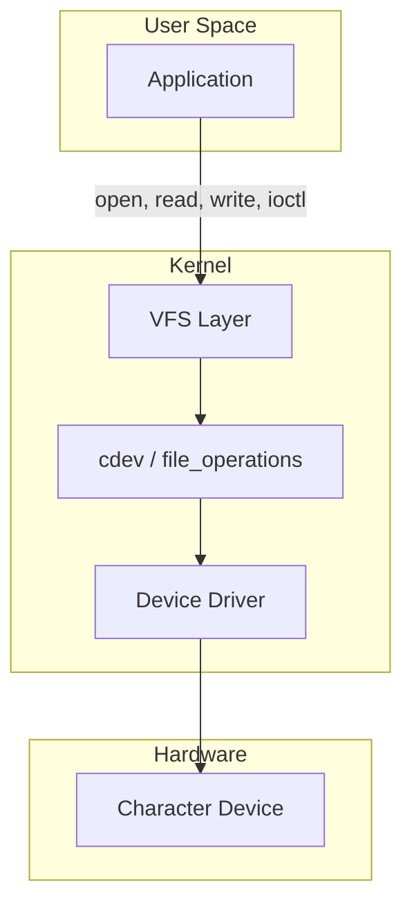
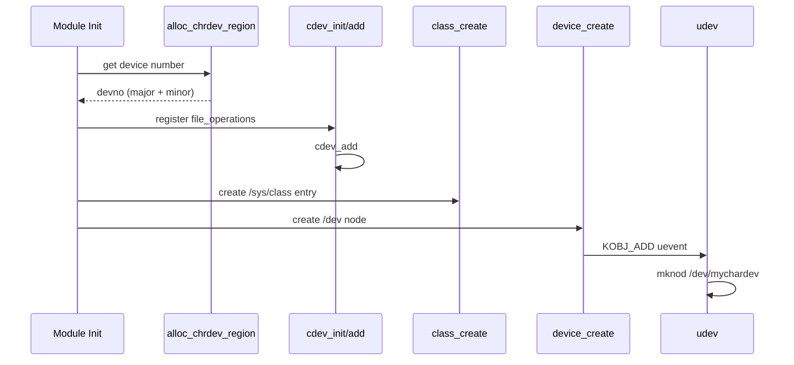
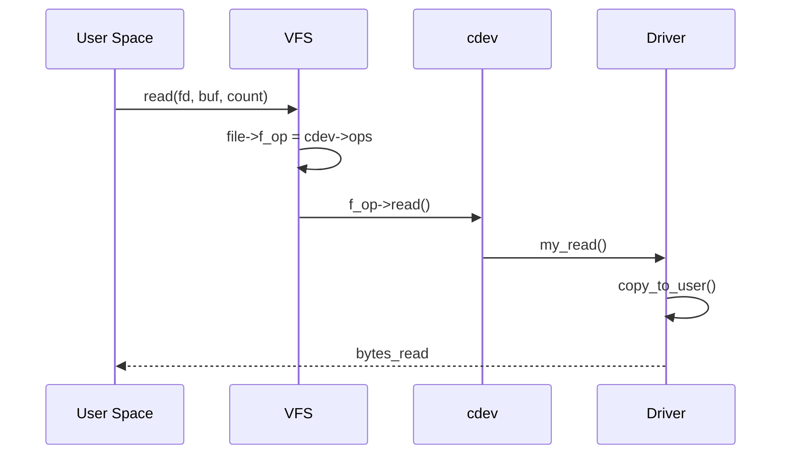

# Character Devices

A **character device** is one of the fundamental device types in Linux
(the other being [block devices](../block/devices.md)). Character
devices transfer data as a **stream of bytes** without the block layer's
buffering, scheduling, or request merging. Terminals, serial ports,
random number generators, frame buffers, and many custom hardware
interfaces are character devices.

---

## 1. Overview



When a user-space process opens a character device file (e.g.,
`/dev/ttyS0`), the VFS dispatches operations to the driver's
`file_operations` callbacks.

---

## 2. Major and Minor Numbers

Every character device is identified by a **major** and **minor** number:

| Number | Purpose |
|---|---|
| Major | Identifies the driver (e.g., 4 = tty, 1 = mem) |
| Minor | Identifies a specific device instance |

### Viewing Character Devices

```bash
$ ls -la /dev/null /dev/zero /dev/random
crw-rw-rw- 1 root root 1, 3 Jul 21 10:00 /dev/null
crw-rw-rw- 1 root root 1, 5 Jul 21 10:00 /dev/zero
crw-rw-rw- 1 root root 1, 8 Jul 21 10:00 /dev/random

$ cat /proc/devices
Character devices:
  1 mem
  4 tty
  5 /dev/tty
 10 misc
 29 fb
226 drm
```

### Well-Known Major Numbers

| Major | Device |
|---|---|
| 1 | `/dev/null`, `/dev/zero`, `/dev/random`, etc. |
| 4 | `/dev/ttyS*` (serial) |
| 5 | `/dev/tty`, `/dev/ptmx` |
| 10 | `/dev/rtc`, `/dev/net/tun` (misc) |
| 29 | `/dev/fb*` (framebuffer) |

---

## 3. The `cdev` Structure

The kernel represents a character device with `struct cdev`:

```c
struct cdev {
    struct kobject kobj;               /* embedded kobject */
    struct module *owner;              /* owning module */
    const struct file_operations *ops; /* operations */
    struct list_head list;             /* linked into cdev list */
    dev_t dev;                         /* device number */
    unsigned int count;                /* number of minors */
};
```

### Lifecycle


---

## 4. `file_operations` — The Driver's Interface

The `file_operations` structure defines what happens when user space
calls system calls on the device file:

```c
static const struct file_operations my_fops = {
    .owner          = THIS_MODULE,
    .open           = my_open,
    .release        = my_close,
    .read           = my_read,
    .write          = my_write,
    .unlocked_ioctl = my_ioctl,
    .poll           = my_poll,
    .mmap           = my_mmap,
    .llseek         = my_llseek,
};
```

### Common Callbacks

| Callback | System Call | Purpose |
|---|---|---|
| `open` | `open()` | Initialize per-file state |
| `release` | `close()` | Clean up per-file state |
| `read` | `read()` | Copy data to user space |
| `write` | `write()` | Copy data from user space |
| `unlocked_ioctl` | `ioctl()` | Device-specific commands |
| `poll` | `poll()/select()/epoll()` | Report readiness |
| `mmap` | `mmap()` | Map device memory to user space |
| `llseek` | `lseek()` | Reposition file offset |

---

## 5. Registering a Character Device

### 5.1 Allocate Device Numbers

```c
dev_t devno;

/* Dynamic allocation */
int ret = alloc_chrdev_region(&devno, 0, 1, "mydev");
if (ret < 0) {
    pr_err("failed to allocate device number\n");
    return ret;
}
/* devno now contains major + minor */

/* Or: static allocation (legacy, not recommended) */
ret = register_chrdev_region(MKDEV(MY_MAJOR, 0), 1, "mydev");
```

### 5.2 Initialize and Add cdev

```c
static struct cdev my_cdev;

cdev_init(&my_cdev, &my_fops);
my_cdev.owner = THIS_MODULE;

ret = cdev_add(&my_cdev, devno, 1);
if (ret) {
    pr_err("cdev_add failed\n");
    goto err_unreg;
}
```

### 5.3 Create Device Node (Class + Device)

To automatically create `/dev/mydev`:

```c
static struct class *my_class;
static struct device *my_device;

my_class = class_create("mydev_class");
my_device = device_create(my_class, NULL, devno, NULL, "mydev");
```

This creates:
- `/sys/class/mydev_class/mydev/`
- `/dev/mydev` (via udev)

### 5.4 Full Module Example

```c
#include <linux/module.h>
#include <linux/fs.h>
#include <linux/cdev.h>
#include <linux/device.h>
#include <linux/uaccess.h>

#define DEVICE_NAME "mychardev"

static dev_t devno;
static struct cdev my_cdev;
static struct class *my_class;
static struct device *my_device;

/* ---- file_operations ---- */

static int my_open(struct inode *inode, struct file *filp)
{
    pr_info("%s: opened\n", DEVICE_NAME);
    return 0;
}

static int my_release(struct inode *inode, struct file *filp)
{
    pr_info("%s: closed\n", DEVICE_NAME);
    return 0;
}

static ssize_t my_read(struct file *filp, char __user *buf,
                        size_t count, loff_t *f_pos)
{
    char data[] = "Hello from kernel!\n";
    size_t len = sizeof(data);

    if (*f_pos >= len)
        return 0;

    if (count > len - *f_pos)
        count = len - *f_pos;

    if (copy_to_user(buf, data + *f_pos, count))
        return -EFAULT;

    *f_pos += count;
    return count;
}

static ssize_t my_write(struct file *filp, const char __user *buf,
                         size_t count, loff_t *f_pos)
{
    char kbuf[64];

    if (count > sizeof(kbuf) - 1)
        count = sizeof(kbuf) - 1;

    if (copy_from_user(kbuf, buf, count))
        return -EFAULT;

    kbuf[count] = '\0';
    pr_info("%s: received '%s'\n", DEVICE_NAME, kbuf);
    return count;
}

static long my_ioctl(struct file *filp, unsigned int cmd,
                      unsigned long arg)
{
    switch (cmd) {
    case 0: /* custom command */
        pr_info("%s: ioctl cmd 0\n", DEVICE_NAME);
        return 0;
    default:
        return -ENOTTY;
    }
}

static const struct file_operations my_fops = {
    .owner          = THIS_MODULE,
    .open           = my_open,
    .release        = my_release,
    .read           = my_read,
    .write          = my_write,
    .unlocked_ioctl = my_ioctl,
};

/* ---- module init/exit ---- */

static int __init my_init(void)
{
    int ret;

    /* Allocate device number */
    ret = alloc_chrdev_region(&devno, 0, 1, DEVICE_NAME);
    if (ret)
        return ret;

    /* Init and add cdev */
    cdev_init(&my_cdev, &my_fops);
    my_cdev.owner = THIS_MODULE;
    ret = cdev_add(&my_cdev, devno, 1);
    if (ret)
        goto err_unreg;

    /* Create class and device */
    my_class = class_create("mychardev_class");
    if (IS_ERR(my_class)) {
        ret = PTR_ERR(my_class);
        goto err_cdev;
    }

    my_device = device_create(my_class, NULL, devno, NULL,
                              DEVICE_NAME);
    if (IS_ERR(my_device)) {
        ret = PTR_ERR(my_device);
        goto err_class;
    }

    pr_info("%s: registered (major=%d, minor=%d)\n",
            DEVICE_NAME, MAJOR(devno), MINOR(devno));
    return 0;

err_class:
    class_destroy(my_class);
err_cdev:
    cdev_del(&my_cdev);
err_unreg:
    unregister_chrdev_region(devno, 1);
    return ret;
}

static void __exit my_exit(void)
{
    device_destroy(my_class, devno);
    class_destroy(my_class);
    cdev_del(&my_cdev);
    unregister_chrdev_region(devno, 1);
    pr_info("%s: unregistered\n", DEVICE_NAME);
}

module_init(my_init);
module_exit(my_exit);
MODULE_LICENSE("GPL");
MODULE_DESCRIPTION("Sample character device driver");
```

### Registration Flow



---

## 6. Character Device Internals

### How `open()` Works

When user space calls `open("/dev/mydev", ...)`:

1. VFS looks up the inode from the path.
2. The inode's `i_rdev` field contains the device number.
3. VFS finds the `cdev` registered for that device number.
4. VFS sets `file->f_op = cdev->ops`.
5. VFS calls `file->f_op->open()`.

### How `read()`/`write()` Work

After `open()`, the `file` structure has the driver's `f_op`. Calling
`read()` or `write()` goes directly to the driver's callbacks.



---

## 7. The `misc` Device

For simple character devices that don't need a dedicated major number,
the kernel provides the **misc** framework (major 10):

```c
#include <linux/miscdevice.h>

static struct miscdevice my_misc = {
    .minor = MISC_DYNAMIC_MINOR,
    .name = "mydev",
    .fops = &my_fops,
};

misc_register(&my_misc);
/* Automatically creates /dev/mydev */
```

The misc framework handles all the cdev/class/device boilerplate.

---

## 8. Handling `ioctl`

The `ioctl` system call allows device-specific commands:

```c
/* Define ioctl commands */
#define MY_MAGIC 'k'
#define MY_RESET    _IO(MY_MAGIC, 0)
#define MY_GET_VAL  _IOR(MY_MAGIC, 1, int)
#define MY_SET_VAL  _IOW(MY_MAGIC, 2, int)

static long my_ioctl(struct file *filp, unsigned int cmd,
                      unsigned long arg)
{
    int val;

    switch (cmd) {
    case MY_RESET:
        /* Reset device */
        return 0;

    case MY_GET_VAL:
        val = read_device_register();
        if (copy_to_user((int __user *)arg, &val, sizeof(val)))
            return -EFAULT;
        return 0;

    case MY_SET_VAL:
        if (copy_from_user(&val, (int __user *)arg, sizeof(val)))
            return -EFAULT;
        write_device_register(val);
        return 0;

    default:
        return -ENOTTY;
    }
}
```

### ioctl Number Encoding

```c
/* _IO(dir, type, nr, size) */
#define _IO(type, nr)           /* no data */
#define _IOR(type, nr, datatype) /* read from device */
#define _IOW(type, nr, datatype) /* write to device */
#define _IOWR(type, nr, datatype)/* read + write */
```

---

## 9. `poll` / `select` / `epoll` Support

To support event-driven I/O, implement the `poll` callback:

```c
static __poll_t my_poll(struct file *filp, poll_table *wait)
{
    struct my_data *data = filp->private_data;
    __poll_t mask = 0;

    poll_wait(filp, &data->wait_queue, wait);

    if (data->read_ready)
        mask |= POLLIN | POLLRDNORM;
    if (data->write_ready)
        mask |= POLLOUT | POLLWRNORM;

    return mask;
}
```

This allows user space to use `select()`, `poll()`, or `epoll()` on the
device file.

---

## 10. Sysfs Attributes

Expose device attributes in sysfs:

```c
static ssize_t my_status_show(struct device *dev,
                              struct device_attribute *attr,
                              char *buf)
{
    return sysfs_emit(buf, "running\n");
}
static DEVICE_ATTR_RO(my_status);

/* In probe: device_create_file(dev, &dev_attr_my_status); */
```

This creates `/sys/class/mydev_class/mydev/my_status`.

---

## 11. Comparing Registration Methods

| Method | Boilerplate | Use Case |
|---|---|---|
| `cdev` + `class` + `device` | High | Full control, production drivers |
| `misc_register` | Low | Simple devices, one minor |
| `register_chrdev` (legacy) | Medium | Old drivers (deprecated for new code) |

---

## Further Reading

- [Linux kernel docs — Character devices](https://docs.kernel.org/driver-api/basics.html)
- [Linux kernel docs — file_operations](https://docs.kernel.org/filesystems/vfs.html)
- [LWN: Character device drivers](https://lwn.net/Articles/339021/)
- [Linux Device Drivers, 3rd Ed — Chapter 3](https://lwn.net/Kernel/LDD3/)
- [kernel.org — include/linux/cdev.h](https://git.kernel.org/pub/scm/linux/kernel/git/torvalds/linux.git/tree/include/linux/cdev.h)

## Related Topics

- [Block Devices](../block/devices.md) — the other device type
- [Driver Model Overview](overview.md) — bus/device/driver framework
- [Kernel APIs](../apis.md) — copy_to_user, printk, memory allocation
- [PCI Subsystem](pci.md) — PCI character device examples
- [Device Tree](device-tree.md) — platform device matching
