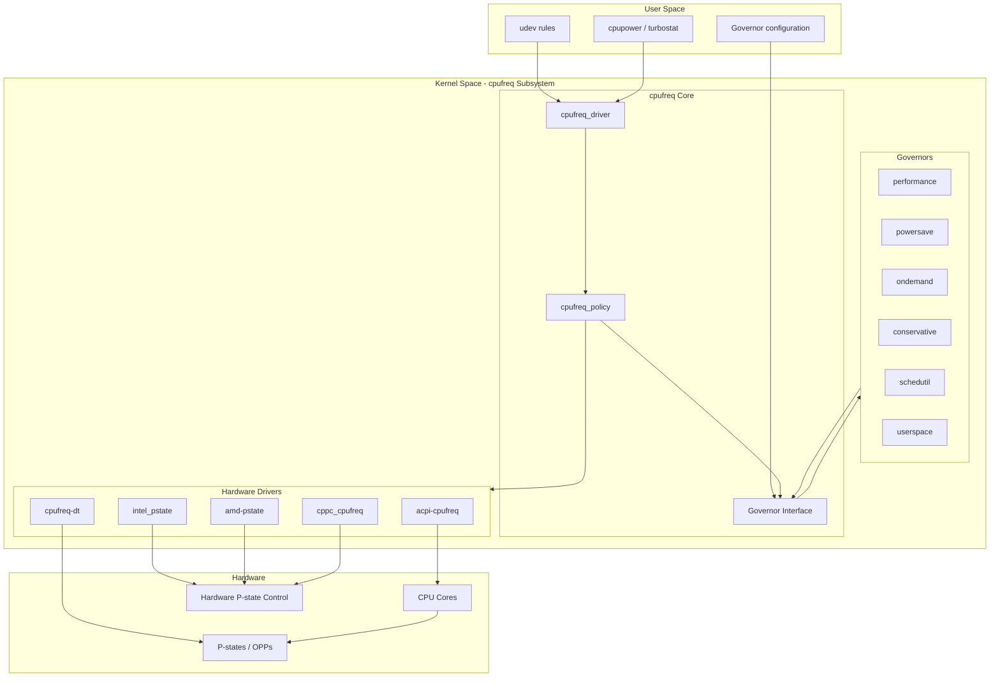
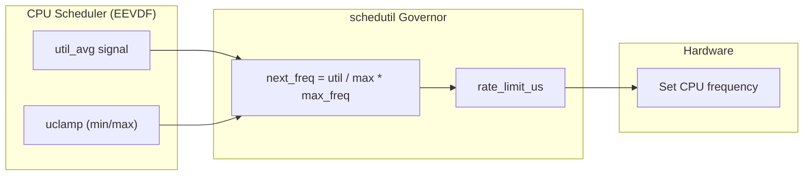
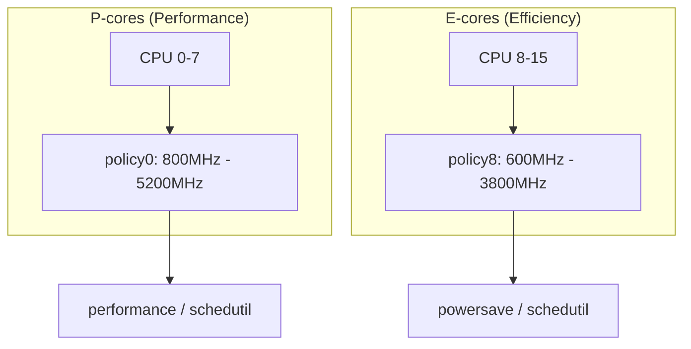

# CPU Frequency Scaling (cpufreq)

## Introduction

CPU frequency scaling (cpufreq) is the Linux kernel subsystem that dynamically
adjusts processor clock frequency and voltage to balance performance against
power consumption. Modern processors support multiple Operating Performance Points
(OPPs), also known as P-states in ACPI terminology, where each point represents
a specific frequency-voltage pair. Higher frequencies provide more computational
throughput but consume proportionally more power and generate more heat.

The cpufreq subsystem is part of the kernel's power management framework. It
provides a unified interface for different CPU architectures (x86, ARM, RISC-V)
to implement frequency scaling through a set of "governors" that determine when
and how to change the CPU frequency based on system load.

## Architecture



## Sysfs Interface

The cpufreq subsystem exposes its configuration through sysfs at
`/sys/devices/system/cpu/cpufreq/`. Each CPU policy (which may cover multiple
CPUs sharing the same clock) is represented as a `policyN/` directory.

### Global Interface

```bash
# List all cpufreq policies
ls /sys/devices/system/cpu/cpufreq/

# List available CPUs and their frequency info
cat /sys/devices/system/cpu/cpu*/cpufreq/scaling_cur_freq

# Kernel module parameters
cat /sys/module/cpufreq/parameters/off
```

### Per-Policy Interface

```bash
# Current frequency (kHz)
cat /sys/devices/system/cpu/cpufreq/policy0/scaling_cur_freq

# Minimum and maximum frequency (kHz)
cat /sys/devices/system/cpu/cpufreq/policy0/scaling_min_freq
cat /sys/devices/system/cpu/cpufreq/policy0/scaling_max_freq

# Available frequencies (if hardware defines discrete steps)
cat /sys/devices/system/cpu/cpufreq/policy0/scaling_available_frequencies

# Available governors
cat /sys/devices/system/cpu/cpufreq/policy0/scaling_available_governors

# Current governor
cat /sys/devices/system/cpu/cpufreq/policy0/scaling_governor

# Governor-specific parameters
ls /sys/devices/system/cpu/cpufreq/policy0/

# Set minimum frequency (requires root)
echo 2000000 | sudo tee /sys/devices/system/cpu/cpufreq/policy0/scaling_min_freq

# Set maximum frequency
echo 3000000 | sudo tee /sys/devices/system/cpu/cpufreq/policy0/scaling_max_freq

# Change governor
echo performance | sudo tee /sys/devices/system/cpu/cpufreq/policy0/scaling_governor

# Hardware limits (read-only)
cat /sys/devices/system/cpu/cpufreq/policy0/cpuinfo_min_freq
cat /sys/devices/system/cpu/cpufreq/policy0/cpuinfo_max_freq
cat /sys/devices/system/cpu/cpufreq/policy0/cpuinfo_cur_freq
cat /sys/devices/system/cpu/cpufreq/policy0/cpuinfo_transition_latency
```

### Related Power Management Files

```bash
# Intel P-state specific (if intel_pstate is active)
cat /sys/devices/system/cpu/intel_pstate/min_perf_pct
cat /sys/devices/system/cpu/intel_pstate/max_perf_pct
cat /sys/devices/system/cpu/intel_pstate/no_turbo
cat /sys/devices/system/cpu/intel_pstate/status  # active/passive/off

# AMD P-state specific (if amd-pstate is active)
cat /sys/devices/system/cpu/amd_pstate/status  # active/passive/off
cat /sys/devices/system/cpu/amd_pstate/epp     # energy performance preference

# Turbo boost (architecture-specific)
cat /sys/devices/system/cpu/intel_pstate/no_turbo  # 0=turbo on, 1=turbo off
```

## Governors

Governors are the decision-making algorithms that determine the target CPU
frequency based on system load and policy constraints.

### performance

Always sets the CPU to the highest available frequency. Used for latency-sensitive
workloads where maximum throughput is required.

```bash
# Set performance governor on all CPUs
for policy in /sys/devices/system/cpu/cpufreq/policy*/; do
    echo performance | sudo tee ${policy}scaling_governor
done
```

**Characteristics:**
- Zero latency for frequency transitions
- Maximum power consumption
- Best for benchmarks, real-time workloads, and HPC

### powersave

Always sets the CPU to the lowest available frequency. Used to minimize power
consumption at the cost of performance.

```bash
echo powersave | sudo tee /sys/devices/system/cpu/cpufreq/policy0/scaling_governor
```

**Characteristics:**
- Minimum power consumption
- Significant performance impact
- Best for idle or light-load servers

### ondemand

Dynamically adjusts frequency based on CPU utilization. When load exceeds a
threshold, the governor scales up to maximum frequency; when load drops, it
gradually scales down.

```bash
echo ondemand | sudo tee /sys/devices/system/cpu/cpufreq/policy0/scaling_governor

# Configure ondemand parameters
cd /sys/devices/system/cpu/cpufreq/policy0/

# Sampling rate (microseconds) - how often to check load
echo 10000 | sudo tee sampling_rate

# Up threshold (%) - load percentage to trigger frequency increase
echo 80 | sudo tee up_threshold

# Down differential (%) - how much load must drop before scaling down
echo 5 | sudo tee down_differential

# Ignore nice load - don't count nice'd processes
echo 1 | sudo tee ignore_nice_load

# Sampling down factor - number of sampling intervals before scaling down
echo 10 | sudo tee sampling_down_factor

# Power save bias - bias toward lower frequencies on non-root CPUs
echo 0 | sudo tee powersave_bias
```

**Characteristics:**
- Good balance of performance and power savings
- Reacts quickly to load spikes
- May cause frequency oscillation under moderate load
- Legacy governor, replaced by `schedutil` in modern kernels

### conservative

Similar to `ondemand` but uses more gradual frequency scaling. Instead of jumping
to maximum frequency on high load, it increases frequency in steps.

```bash
echo conservative | sudo tee /sys/devices/system/cpu/cpufreq/policy0/scaling_governor

# Configure conservative parameters
cd /sys/devices/system/cpu/cpufreq/policy0/

echo 20 | sudo tee freq_step         # Percentage step for frequency increase
echo 40 | sudo tee down_threshold     # Load % to trigger frequency decrease
echo 80 | sudo tee up_threshold       # Load % to trigger frequency increase
```

**Characteristics:**
- Smoother frequency transitions than `ondemand`
- Better for battery-powered devices
- Slower to respond to load changes
- Less frequency oscillation

### schedutil

The modern governor that integrates with the kernel's CPU scheduler (CFS/EEVDF).
It uses scheduler utilization signals to make frequency decisions, providing
more accurate and timely frequency scaling.

```bash
echo schedutil | sudo tee /sys/devices/system/cpu/cpufreq/policy0/scaling_governor

# Parameters (usually not tunable, auto-configured based on scheduler)
# rate_limit_us - minimum time between frequency changes
cat /sys/devices/system/cpu/cpufreq/policy0/schedutil/rate_limit_us
```

**Characteristics:**
- Integrated with the scheduler for accurate load measurement
- Accounts for per-task utilization (not just aggregate CPU usage)
- Better latency response than `ondemand`
- Default governor on most modern distributions (kernel 4.7+)
- Works correctly with CPU idle states and turbo boost
- Supports per-CPU frequency selection based on scheduler hints



### userspace

Allows a user-space program to set the CPU frequency directly. The governor
itself does not make any decisions; it only provides the mechanism for
user-space control.

```bash
echo userspace | sudo tee /sys/devices/system/cpu/cpufreq/policy0/scaling_governor

# Set specific frequency
echo 2400000 | sudo tee /sys/devices/system/cpu/cpufreq/policy0/scaling_setspeed
```

**Use cases:**
- Custom power management daemons
- Testing and benchmarking specific frequencies
- Embedded systems with specific power budgets

### Governor Comparison

| Governor | Response Time | Power Efficiency | Use Case |
|----------|-------------|------------------|----------|
| `performance` | None (always max) | Worst | Benchmarks, real-time |
| `powersave` | None (always min) | Best | Idle servers |
| `ondemand` | Fast (~ms) | Good | General purpose (legacy) |
| `conservative` | Slow (~10ms) | Better | Battery devices |
| `schedutil` | Fast (~ms) | Best (balanced) | Modern default |
| `userspace` | N/A | Depends | Custom control |

## Hardware Drivers

### intel_pstate

The Intel P-state driver is the primary driver for modern Intel CPUs (Sandy Bridge
and later). It has two modes:

**Active mode (default on supported hardware):**
- Implements its own `performance` and `powersave` governors
- Does not use the generic cpufreq governors
- Directly controls Hardware P-states (HWP) on supported CPUs

```bash
# Check if intel_pstate is active
cat /sys/devices/system/cpu/intel_pstate/status
# Output: active, passive, or off

# Active mode parameters
cat /sys/devices/system/cpu/intel_pstate/min_perf_pct   # 0-100
cat /sys/devices/system/cpu/intel_pstate/max_perf_pct   # 0-100
cat /sys/devices/system/cpu/intel_pstate/no_turbo       # 0 or 1
cat /sys/devices/system/cpu/intel_pstate/turbo_pct      # Turbo ratio

# Disable turbo boost
echo 1 | sudo tee /sys/devices/system/cpu/intel_pstate/no_turbo

# Limit max performance to 50%
echo 50 | sudo tee /sys/devices/system/cpu/intel_pstate/max_perf_pct
```

**Passive mode:**
- Acts as a regular cpufreq driver
- Compatible with generic governors (`ondemand`, `schedutil`, etc.)
- Used when hardware P-state control is not desired

```bash
# Force passive mode (use generic governors)
# Boot parameter: intel_pstate=passive

# Or at runtime (if supported)
echo passive | sudo tee /sys/devices/system/cpu/intel_pstate/status
```

### acpi-cpufreq

The ACPI-based cpufreq driver, used as a fallback when `intel_pstate` is not
active, or on older Intel/AMD processors.

```bash
# Check if acpi-cpufreq is loaded
lsmod | grep acpi_cpufreq

# Available frequencies
cat /sys/devices/system/cpu/cpufreq/policy0/scaling_available_frequencies
# Output: 1200000 1400000 1600000 1800000 2000000 2200000 2400000

# Transition latency
cat /sys/devices/system/cpu/cpufreq/policy0/cpuinfo_transition_latency
# Output: 10000 (nanoseconds)
```

### amd-pstate

The AMD P-state driver for Zen 2 and later processors. Supports multiple modes:

```bash
# Check status
cat /sys/devices/system/cpu/amd_pstate/status

# Modes:
# - active: Hardware-managed (like intel_pstate active)
# - passive: Software-managed (like acpi-cpufreq)
# - guided: Hybrid - software hints, hardware final decision

# Energy Performance Preference (EPP)
# 0 = performance, 128 = balance_performance, 192 = balance_power, 254 = power
cat /sys/devices/system/cpu/amd_pstate/epp

# Set EPP for specific policy
echo balance_performance | sudo tee /sys/devices/system/cpu/cpufreq/policy0/energy_performance_preference
```

### cpufreq-dt (Device Tree)

Used on ARM and RISC-V platforms where frequency information is provided via
Device Tree.

```bash
# Device Tree frequency table (example)
cat /sys/devices/system/cpu/cpufreq/policy0/scaling_available_frequencies
# Output: 408000 600000 816000 1008000 1200000 1368000 1512000 1608000

# Transition latency varies by platform
cat /sys/devices/system/cpu/cpufreq/policy0/cpuinfo_transition_latency
```

## Turbo Boost and Frequency Limits

### Intel Turbo Boost / Turbo Boost Max 3.0

```bash
# Check if turbo boost is available
cat /sys/devices/system/cpu/intel_pstate/no_turbo
# 0 = turbo enabled, 1 = turbo disabled

# Disable turbo boost
echo 1 | sudo tee /sys/devices/system/cpu/intel_pstate/no_turbo

# Check turbo ratio limits (per-core)
# MSR 0x1AD through 0x1AE (use rdmsr from msr-tools)
sudo rdmsr 0x1AD  # TURBO_RATIO_LIMIT

# Turbo Boost Max 3.0 (preferred cores)
cat /sys/devices/system/cpu/intel_pstate/turbo_pct
```

### AMD Core Performance Boost

```bash
# AMD boost control (if available)
cat /sys/devices/system/cpu/cpufreq/policy0/boost
# 0 = boost disabled, 1 = boost enabled

# Disable boost
echo 0 | sudo tee /sys/devices/system/cpu/cpufreq/policy0/boost
```

## CPU Power Domains and Policies

Modern CPUs organize cores into power domains (packages, clusters, CCX/CCD on AMD).
A `cpufreq_policy` groups CPUs that share the same clock domain and must scale
frequency together.

```bash
# List which CPUs share a policy
cat /sys/devices/system/cpu/cpufreq/policy0/related_cpus
# Output: 0 1 2 3 4 5 6 7  (all share same clock)

# On multi-socket or hybrid systems:
cat /sys/devices/system/cpu/cpufreq/policy0/related_cpus  # P-cores
cat /sys/devices/system/cpu/cpufreq/policy8/related_cpus  # E-cores

# Affected CPUs (can be influenced by this policy)
cat /sys/devices/system/cpu/cpufreq/policy0/affected_cpus
```

### Hybrid Architectures (Intel Alder Lake+, AMD Zen 5)



## Monitoring CPU Frequency

### Real-Time Monitoring

```bash
# Watch current frequency of all CPUs
watch -n 0.5 'cat /sys/devices/system/cpu/cpu*/cpufreq/scaling_cur_freq'

# Using cpupower tool
sudo cpupower frequency-info
sudo cpupower monitor

# Turbostat (Intel) - shows actual frequencies, C-states, power
sudo turbostat --interval 1
# Output includes:
# PkgWatt  CorWatt  GFXWatt  Avg_MHz  Busy%  Bzy_MHz  TSC_MHz
# 15.02    12.34    0.00     2456     45.2   5432     3600

# Using perf for frequency statistics
sudo perf stat -e power/energy-pkg/ -a sleep 5

# Per-CPU frequency from /proc
grep "cpu MHz" /proc/cpuinfo
```

### Frequency Statistics via cpufreq_stats

```bash
# Time spent at each frequency (kernel cpufreq_stats module)
cat /sys/devices/system/cpu/cpufreq/policy0/stats/time_in_state
# Output:
# 1200000 4523
# 1400000 2341
# 1600000 15234
# 1800000 34521
# 2000000 12345
# 2200000 6789
# 2400000 89012

# Total transitions
cat /sys/devices/system/cpu/cpufreq/policy0/stats/total_trans

# Transition table (how often transitions between specific frequencies occur)
cat /sys/devices/system/cpu/cpufreq/policy0/stats/trans_table
```

## Energy Performance Preference (EPP) and EPB

### Intel Energy Performance Bias (EPB)

```bash
# Read current EPB (0=performance, 15=powersave)
sudo rdmsr -a 0x1B0  # IA32_ENERGY_PERF_BIAS

# Set EPB via x86_energy_perf_policy tool
sudo x86_energy_perf_policy performance
sudo x86_energy_perf_policy balance-performance
sudo x86_energy_perf_policy balance-power
sudo x86_energy_perf_policy power
```

### Intel Hardware P-States (HWP)

HWP (also known as Speed Shift) allows the hardware to autonomously control
frequency within software-defined limits, providing faster frequency transitions
than software-based scaling.

```bash
# Check if HWP is enabled
dmesg | grep -i hwp

# With intel_pstate in active mode and HWP:
# - Hardware manages frequency autonomously
# - Software sets hints via min/max performance percentages
# - Transitions occur in < 1ms (vs ~10ms for software scaling)

# Set HWP hints
echo 50 | sudo tee /sys/devices/system/cpu/intel_pstate/min_perf_pct
echo 100 | sudo tee /sys/devices/system/cpu/intel_pstate/max_perf_pct
```

## Kernel Boot Parameters

```bash
# Force specific driver
intel_pstate=disable       # Disable intel_pstate, use acpi-cpufreq
intel_pstate=passive       # intel_pstate in passive mode
amd_pstate=active          # AMD p-state in active mode
cpufreq.off=1              # Disable cpufreq entirely

# Force specific governor
cpufreq.default_governor=performance

# Disable turbo boost at boot
intel_pstate=no_turbo

# Example GRUB configuration
# GRUB_CMDLINE_LINUX="intel_pstate=passive"
```

## Practical Examples

### Setting Up Power-Saving Profile

```bash
#!/bin/bash
# power-save.sh - Configure CPU for power saving

for policy in /sys/devices/system/cpu/cpufreq/policy*/; do
    echo powersave | sudo tee ${policy}scaling_governor
done

# Limit maximum frequency to 50% of capability
for policy in /sys/devices/system/cpu/cpufreq/policy*/; do
    max=$(cat ${policy}cpuinfo_max_freq)
    half=$((max / 2))
    echo $half | sudo tee ${policy}scaling_max_freq
done

# Disable turbo boost (Intel)
if [ -f /sys/devices/system/cpu/intel_pstate/no_turbo ]; then
    echo 1 | sudo tee /sys/devices/system/cpu/intel_pstate/no_turbo
fi
```

### Setting Up Performance Profile

```bash
#!/bin/bash
# performance.sh - Configure CPU for maximum performance

for policy in /sys/devices/system/cpu/cpufreq/policy*/; do
    echo performance | sudo tee ${policy}scaling_governor
    # Set min to max
    max=$(cat ${policy}cpuinfo_max_freq)
    echo $max | sudo tee ${policy}scaling_min_freq
done

# Enable turbo boost (Intel)
if [ -f /sys/devices/system/cpu/intel_pstate/no_turbo ]; then
    echo 0 | sudo tee /sys/devices/system/cpu/intel_pstate/no_turbo
fi
```

### Monitoring Script

```bash
#!/bin/bash
# freq-monitor.sh - Real-time CPU frequency monitoring

while true; do
    clear
    echo "=== CPU Frequency Monitor ==="
    echo "Time: $(date)"
    echo ""
    for cpu in /sys/devices/system/cpu/cpu[0-9]*/cpufreq/; do
        cpuid=$(basename $(dirname $cpu))
        cur=$(cat ${cpu}scaling_cur_freq 2>/dev/null || echo "N/A")
        gov=$(cat ${cpu}scaling_governor 2>/dev/null || echo "N/A")
        printf "%-6s: %8s kHz  [%s]\n" "$cpuid" "$cur" "$gov"
    done
    sleep 1
done
```

## Troubleshooting

### Common Issues

| Symptom | Cause | Solution |
|---------|-------|----------|
| CPU stuck at low frequency | Governor set to `powersave` | Change governor to `schedutil` |
| Frequency not scaling | `scaling_min_freq == scaling_max_freq` | Adjust min/max range |
| Turbo boost not working | `no_turbo=1` or thermal throttling | Check `no_turbo` and thermal zones |
| `cpufreq_stats` empty | Module not loaded | `modprobe cpufreq_stats` |
| `scaling_available_frequencies` empty | Modern driver (HWP) | Use `min_perf_pct`/`max_perf_pct` |
| Frequency oscillation | `ondemand` governor sensitivity | Switch to `schedutil` |

### Diagnostic Commands

```bash
# Check loaded cpufreq modules
lsmod | grep -i cpufreq
lsmod | grep -i pstate

# Check active driver
ls -la /sys/devices/system/cpu/cpufreq/policy0/scaling_driver

# Check kernel power management configuration
zcat /proc/config.gz | grep -i cpufreq
# CONFIG_CPU_FREQ=y
# CONFIG_CPU_FREQ_GOV_SCHEDUTIL=y

# Check for thermal throttling
cat /sys/class/thermal/thermal_zone*/temp
dmesg | grep -i "thermal\|throttl"
```

## References

- Linux kernel documentation, "CPU Performance Scaling,"
  https://docs.kernel.org/admin-guide/pm/cpufreq.html
- Linux kernel documentation, "CPUFreq Governors,"
  https://docs.kernel.org/admin-guide/pm/cpufreq-drivers.html
- Linux cpufreq subsystem, `drivers/cpufreq/` in kernel source
- Intel 64 and IA-32 Architectures Software Developer's Manual, Volume 3,
  Chapter 14 (Power Management)
- turbostat tool documentation, `tools/power/x86/turbostat/` in kernel source
- cpupower tool documentation: https://manpages.ubuntu.com/manpages/noble/man1/cpupower.1.html
- Rafael J. Wysocki, "CPU Performance Scaling in Linux," Intel Corporation, 2017
