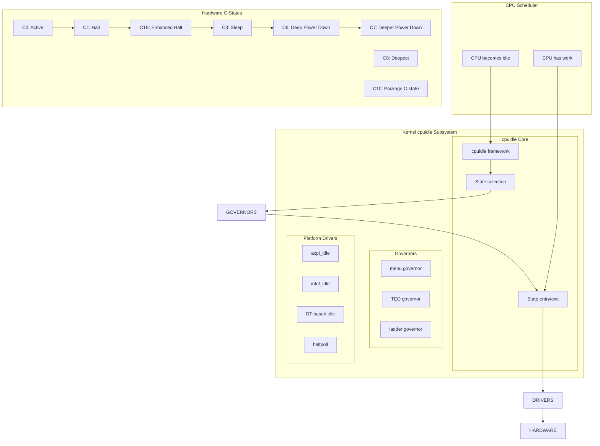
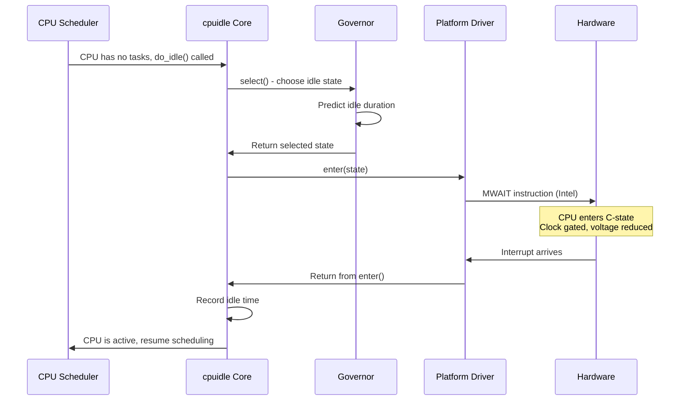
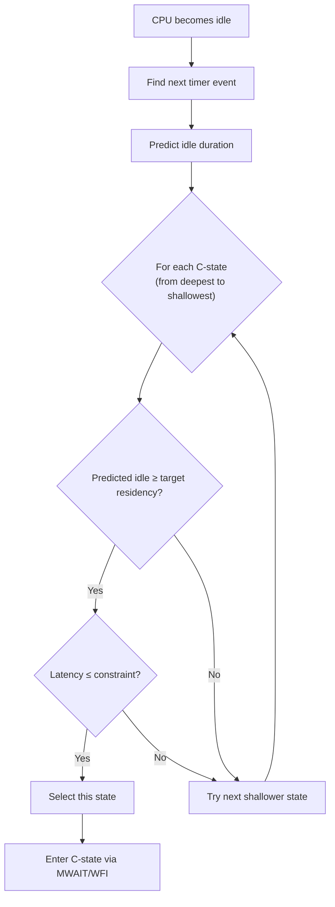

# CPU Idle States (cpuidle)

## Introduction

CPU idle management (cpuidle) is the Linux kernel subsystem that saves power when
a CPU has no work to do by entering low-power idle states. Modern processors support
multiple idle states (called C-states in ACPI terminology) with varying trade-offs
between power savings and wake-up latency. Deeper idle states save more power but
take longer to resume execution when work arrives.

The cpuidle subsystem decides which idle state to enter based on the predicted idle
duration, the latency constraints of the idle state, and the power characteristics
of each state. This decision-making process is handled by "governors" — the
`menu` governor and the `TEO` (Timer Events Oriented) governor are the two main
options in the Linux kernel.

## Architecture



## C-States Overview

C-states are the hardware idle states defined by the ACPI specification and
implemented by processor manufacturers. Each state represents a progressively
deeper level of power savings with increasing wake-up latency.

### Standard C-States

| C-State | Name | Typical Latency | Typical Power Savings | Description |
|---------|------|-----------------|----------------------|-------------|
| C0 | Active | 0 | Baseline | CPU executing instructions |
| C1 | Halt | ~1 μs | Minimal | CPU halted, instant wake |
| C1E | Enhanced Halt | ~1-2 μs | Low | C1 with voltage/frequency reduction |
| C3 | Sleep | ~50-100 μs | Moderate | Caches may be flushed |
| C6 | Deep Power Down | ~100-500 μs | High | Core voltage reduced to minimum |
| C7 | Deeper Power Down | ~500 μs-1 ms | Very high | L2 cache may be flushed |
| C8-C10 | Package C-states | ~1-10 ms | Maximum | Entire package enters low power |

### Intel-Specific C-States

```bash
# Intel idle states on a typical modern CPU:
# Core C-states:  C1, C1E, C3, C6, C7, C8, C9, C10
# Package C-states: PC2, PC3, PC6, PC8, PC9, PC10

# Snoop modes: Snoop, No-Snoop, Sub-NHM Snoop
# Each C-state has a snoop behavior that affects cache coherency
```

### ARM-Specific Idle States

ARM processors use Device Tree to describe idle states:

```bash
# Typical ARM big.LITTLE idle states:
# WFI (Wait For Interrupt) - ~1 μs
# Core power-down - ~50-100 μs
# Cluster power-down - ~500 μs-1 ms
# System-level idle - ~1-5 ms
```

## Sysfs Interface

### Global Interface

```bash
# List all registered cpuidle drivers
ls /sys/devices/system/cpu/cpuidle/

# Current driver name
cat /sys/devices/system/cpu/cpuidle/current_driver
# Output: intel_idle (or acpi_idle)

# Current governor
cat /sys/devices/system/cpu/cpuidle/current_governor_ro
# Output: menu (or teo)
```

### Per-CPU Idle State Information

```bash
# List idle states for CPU 0
ls /sys/devices/system/cpu/cpu0/cpuidle/

# For each state (state0, state1, ...):
STATE_DIR=/sys/devices/system/cpu/cpu0/cpuidle/state0

# State name
cat ${STATE_DIR}/name
# Output: POLL (or C1, C1E, C3, C6, etc.)

# State description
cat ${STATE_DIR}/desc
# Output: "ACPI FFH INTEL MWAIT 0x0" or "I/O based entry"

# Exit latency (microseconds) - time to wake from this state
cat ${STATE_DIR}/latency
# Output: 1 (for C1), 100 (for C3), 200 (for C6)

# Target residency (microseconds) - minimum idle time to justify entering
cat ${STATE_DIR}/residency
# Output: 2 (for C1), 100 (for C3), 800 (for C6)

# Power consumed in this state (milliwatts, if available)
cat ${STATE_DIR}/power
# Output: 0 (for C1), 500 (for C3)

# Usage count - how many times this state was entered
cat ${STATE_DIR}/usage
# Output: 12345

# Time spent in this state (microseconds)
cat ${STATE_DIR}/time
# Output: 987654321

# Whether this state is disabled
cat ${STATE_DIR}/disable
# Output: 0 (enabled) or 1 (disabled)

# Enable/disable a specific state
echo 1 | sudo tee ${STATE_DIR}/disable  # Disable state
echo 0 | sudo tee ${STATE_DIR}/disable  # Enable state
```

### Example: Viewing All States

```bash
#!/bin/bash
# show-idle-states.sh - Display all CPU idle states

for cpu in /sys/devices/system/cpu/cpu[0-9]*; do
    cpuid=$(basename $cpu)
    echo "=== $cpuid ==="
    
    if [ ! -d ${cpu}/cpuidle ]; then
        echo "  No cpuidle directory"
        continue
    fi
    
    for state in ${cpu}/cpuidle/state*/; do
        name=$(cat ${state}/name)
        latency=$(cat ${state}/latency)
        residency=$(cat ${state}/residency)
        usage=$(cat ${state}/usage)
        time=$(cat ${state}/time)
        disabled=$(cat ${state}/disable)
        
        status="enabled"
        [ "$disabled" = "1" ] && status="DISABLED"
        
        printf "  %-8s latency=%4dμs  residency=%6dμs  usage=%10d  time=%15dμs  [%s]\n" \
            "$name" "$latency" "$residency" "$usage" "$time" "$status"
    done
done
```

## Governors

### menu Governor

The `menu` governor is the default on most x86 systems. It predicts the idle
duration by examining timer behavior, past idle history, and I/O patterns.

**Algorithm:**
1. Find the next timer event (hrtimer)
2. Correct the predicted idle duration based on:
   - Performance multiplier (how much CPU time was used in recent busy periods)
   - I/O activity patterns
   - Per-CPU idle history
3. Select the deepest C-state whose target residency fits within the prediction
4. Apply a correction factor to avoid excessive deep C-state entries

```bash
# menu governor parameters
cat /sys/devices/system/cpu/cpu0/cpuidle/menu/latency_factor
# Controls how aggressively to select deep C-states

# The menu governor is selected at kernel configuration time:
# CONFIG_CPU_IDLE_GOV_MENU=y
```

**Characteristics:**
- Adaptive prediction based on multiple factors
- Works well with dynamic workloads
- May occasionally over-predict idle duration (selecting states that are too deep)
- Historically the default for x86

### TEO (Timer Events Oriented) Governor

The TEO governor, introduced in kernel 5.0, takes a different approach by focusing
specifically on timer events as the primary predictor of idle duration.

**Algorithm:**
1. Track the distribution of recent idle durations
2. Categorize idle durations into intervals matching available C-states
3. For each C-state, count how often it would have been the "correct" choice
4. Select the state that was correct most often in recent history

```bash
# TEO governor is available if:
# CONFIG_CPU_IDLE_GOV_TEO=y

# TEO parameters
cat /sys/devices/system/cpu/cpu0/cpuidle/teo/above
cat /sys/devices/system/cpu/cpu0/cpuidle/teo/below
cat /sys/devices/system/cpu/cpu0/cpuidle/teo/above_freq
cat /sys/devices/system/cpu/cpu0/cpuidle/teo/below_freq

# above: number of idle periods where state entry was appropriate
# below: number of idle periods where state entry was too deep
```

**Characteristics:**
- More predictable than `menu` for timer-dominated workloads
- Less responsive to I/O patterns
- Better at avoiding unnecessary deep C-state entries
- Growing adoption as default on newer kernels

### ladder Governor

The legacy governor that walks through C-states sequentially, stepping up or
down based on success/failure.

```bash
# Only available with CONFIG_CPU_IDLE_GOV_LADDER=y
# Not recommended for tickless (NO_HZ) kernels
```

**Characteristics:**
- Simple sequential state transitions
- Not compatible with dynamic tick (NO_HZ_FULL)
- Replaced by `menu` and `TEO` on modern systems
- Only used on older kernels or specific embedded configurations

### Governor Comparison

| Governor | Default On | Prediction Method | Best For |
|----------|-----------|-------------------|----------|
| `menu` | x86 (traditional) | Multi-factor (timer, I/O, history) | General purpose, mixed workloads |
| `TEO` | x86 (newer kernels) | Timer distribution analysis | Timer-dominated workloads |
| `ladder` | Legacy/embedded | Sequential stepping | Old kernels, simple systems |
| `haltpoll` | Virtualized hosts | Polling before halt | VM hosts, latency-sensitive |

## Platform Drivers

### intel_idle

The Intel idle driver provides optimized idle state handling for Intel processors
using MWAIT (Monitor Wait) instructions.

```bash
# Check if intel_idle is in use
cat /sys/devices/system/cpu/cpuidle/current_driver
# Output: intel_idle

# Intel idle states exposed via sysfs
# MWAIT sub-states map to different C-states:
# MWAIT C1 → C1 (Halt)
# MWAIT C1E → C1E (Enhanced Halt)
# MWAIT C3 → C3 (Sleep)
# MWAIT C6 → C6 (Deep Power Down)

# Kernel module parameters
cat /sys/module/intel_idle/parameters/max_cstate
# Maximum C-state allowed (default: 9, allowing all states)

# Disable specific states at boot:
# intel_idle.max_cstate=2  (limit to C1/C1E)
# intel_idle.max_cstate=0  (disable intel_idle entirely, use acpi_idle)

# Check MWAIT support
grep -o "mwait" /proc/cpuinfo | head -1
```

### acpi_idle

The ACPI-based idle driver, used as a fallback when `intel_idle` is not active
or on non-Intel platforms.

```bash
# Check if acpi_idle is in use
cat /sys/devices/system/cpu/cpuidle/current_driver
# Output: acpi_idle

# ACPI C-state information from ACPI tables
# Typically shows fewer states than intel_idle
# Uses I/O port or FFH (Functional Fixed Hardware) entry methods
```

### haltpoll

A special idle driver for virtualized environments where the host wants to
poll for a short time before halting, to reduce latency for VM exits.

```bash
# Enable haltpoll (useful for KVM hosts)
sudo modprobe haltpoll

# Parameters
cat /sys/module/haltpoll/parameters/guest_halt_poll_ns
# Time (ns) to poll before halting (default: 50000)

# Configure for low-latency VM host
echo 100000 | sudo tee /sys/module/haltpoll/parameters/guest_halt_poll_ns
```

## Idle State Entry and Exit

### How a CPU Enters an Idle State



### MWAIT Instruction (Intel/AMD)

The `MWAIT` instruction is the primary mechanism for entering C-states on
x86 processors:

```asm
; Enter C1 (MWAIT hint 0x0)
mov ecx, 0          ; Sub-state hint
mov eax, 0          ; C-state hint (C1)
monitor rax, 0, 0   ; Set up monitoring address
mwait                ; Enter idle state

; Enter C6 (MWAIT hint 0x20)
mov ecx, 0
mov eax, 0x20       ; C6 state hint
monitor rax, 0, 0
mwait
```

### WFI (ARM)

ARM processors use the `WFI` (Wait For Interrupt) instruction:

```asm
; Simple WFI
wfi                  ; Enter idle state

; WFE (Wait For Event) - lighter idle
wfe                  ; Can wake on events, not just interrupts
```

## Monitoring Idle States

### Using turbostat (Intel)

```bash
# Show C-state residency and power consumption
sudo turbostat --interval 1

# Output:
#     Avg_MHz  Busy%  Bzy_MHz  TSC_MHz  IRQ  C1%  C1E%  C3%  C6%  C7%  PkgWatt
# CPU 0: 1234  34.5   3577     3600     123  5.2  12.3  8.4  15.6 23.4  15.02
# ...

# Key metrics:
# - C1%/C3%/C6%/C7%: Percentage of time spent in each C-state
# - PkgWatt: Total package power consumption
# - CorWatt: Core power consumption
```

### Using perf

```bash
# Count C-state transitions
sudo perf stat -e power/energy-pkg/ -e power/energy-cores/ -a sleep 5

# Trace C-state entry/exit events
sudo perf trace -e 'power:cpu_idle' -a sleep 5

# Sample C-state residency
sudo perf stat -e 'cstate_core/c3-residency/' \
               -e 'cstate_core/c6-residency/' \
               -e 'cstate_core/c7-residency/' -a sleep 5
```

### Using cpupower

```bash
# Show idle state information
sudo cpupower idle-info

# Show idle state statistics
sudo cpupower idle-stats

# Disable specific C-states
sudo cpupower idle-set -d 3  # Disable C3
sudo cpupower idle-set -e 3  # Enable C3
sudo cpupower idle-set -D    # Disable all
sudo cpupower idle-set -E    # Enable all
```

### Using idlestat (Development Tool)

```bash
# Install idlestat
git clone https://github.com/lenb/idlestat.git
cd idlestat && make

# Capture idle state data
sudo ./idlestat -t 10 --trace-output trace.dat

# Analyze captured data
sudo ./idlestat -r trace.dat
```

## Idle State Latency and Residency

### Understanding Latency

Latency is the time required for the CPU to transition from an idle state back
to the active (C0) state. It includes:

1. **Hardware latency**: Time for the CPU core to resume execution
2. **Software latency**: Time for the kernel to resume scheduling tasks
3. **Cache warmup**: Time for caches to be repopulated after a deep idle state

```
C1:  ~1 μs      ← Minimal latency, no cache effects
C1E: ~1-2 μs    ← Slight latency, caches preserved
C3:  ~50-100 μs ← Moderate latency, L1/L2 may be flushed
C6:  ~100-500 μs← Significant latency, L1/L2 flushed
C7:  ~500 μs-1ms← High latency, L2 may be flushed
```

### Understanding Residency

Residency is the minimum time the CPU must be idle for entering a C-state to
be worthwhile. If the CPU wakes up before the residency time, the overhead of
entering and exiting the state may exceed the power savings.

```
Entering C3 when idle for only 10 μs:
  - Latency to enter: 50 μs
  - Latency to exit:  50 μs
  - Total overhead:   100 μs
  - Time actually idle: 10 μs
  - Net effect: WORSE than staying in C1

Entering C3 when idle for 1000 μs:
  - Total overhead:    100 μs
  - Time in C3:        900 μs
  - Net effect: GOOD power savings
```

### C-State Selection Logic



## Tuning Idle States

### Disabling Deep C-States

For latency-sensitive workloads, disabling deep C-states can reduce wake-up
latency at the cost of higher power consumption.

```bash
# Method 1: Disable via sysfs (per-CPU)
for cpu in /sys/devices/system/cpu/cpu*/cpuidle/state*/; do
    name=$(cat ${cpu}name 2>/dev/null)
    case "$name" in
        C6|C7|C8|C9|C10)
            echo 1 | sudo tee ${cpu}disable
            ;;
    esac
done

# Method 2: Kernel boot parameter
# intel_idle.max_cstate=2  (limits to C1/C1E)

# Method 3: intel_idle module parameter
echo 2 | sudo tee /sys/module/intel_idle/parameters/max_cstate

# Method 4: Disable intel_idle entirely, use acpi_idle
# Boot with: intel_idle.max_cstate=0
# Or: idle=halt
```

### Latency-Sensitive Configuration

```bash
#!/bin/bash
# low-latency.sh - Configure for minimum wake-up latency

# Use performance governor for cpufreq
for policy in /sys/devices/system/cpu/cpufreq/policy*/; do
    echo performance | sudo tee ${policy}scaling_governor
done

# Disable deep C-states (C3 and below)
for cpu in /sys/devices/system/cpu/cpu*/cpuidle/state*/; do
    name=$(cat ${cpu}name 2>/dev/null)
    latency=$(cat ${cpu}latency 2>/dev/null)
    
    if [ -n "$latency" ] && [ "$latency" -gt 10 ]; then
        echo 1 | sudo tee ${cpu}disable
    fi
done

echo "Low-latency configuration applied"
echo "Remaining active states:"
for cpu in /sys/devices/system/cpu/cpu0/cpuidle/state*/; do
    name=$(cat ${cpu}name)
    disabled=$(cat ${cpu}disable)
    latency=$(cat ${cpu}latency)
    [ "$disabled" = "0" ] && printf "  %-8s latency=%dμs\n" "$name" "$latency"
done
```

### Power-Optimized Configuration

```bash
#!/bin/bash
# power-optimize.sh - Configure for maximum power savings

# Use schedutil governor
for policy in /sys/devices/system/cpu/cpufreq/policy*/; do
    echo schedutil | sudo tee ${policy}scaling_governor
done

# Enable all C-states
for cpu in /sys/devices/system/cpu/cpu*/cpuidle/state*/; do
    echo 0 | sudo tee ${cpu}disable 2>/dev/null
done

# Set EPP to power-save (AMD)
for policy in /sys/devices/system/cpu/cpufreq/policy*/; do
    if [ -f ${policy}energy_performance_preference ]; then
        echo balance_power | sudo tee ${policy}energy_performance_preference
    fi
done

# Set EPB to power-save (Intel)
if command -v x86_energy_perf_policy &>/dev/null; then
    sudo x86_energy_perf_policy power
fi
```

## Package C-States

Beyond per-core C-states, modern processors support package-level C-states where
the entire CPU package enters a low-power state when all cores are idle.

```bash
# Package C-states are typically controlled via:
# 1. BIOS settings
# 2. MSR registers
# 3. intel_idle driver parameters

# Check package C-state residency (Intel)
sudo turbostat --interval 1 | grep -E "Pkg%pc|PkgWatt"

# Disable package C-states (if supported)
# This is usually done via BIOS, not at runtime
# Some MSR-based control exists but is not exposed via sysfs
```

### Package C-State Effects

| Package C-State | Cores Idle | Power Savings | Wake Latency |
|-----------------|-----------|---------------|--------------|
| PC0 | Any | None | 0 |
| PC2 | All in C3+ | Low | ~50 μs |
| PC3 | All in C3+ | Moderate | ~200 μs |
| PC6 | All in C6+ | High | ~500 μs |
| PC8+ | All in C7+ | Very high | ~1-5 ms |

## Idle States and Virtualization

### Host-Side Considerations

```bash
# KVM host: balance between VM latency and host power
# The haltpoll driver polls briefly before entering C-states

# View VM-exit caused by host idle
sudo perf kvm stat live

# Tune haltpoll for VM hosts
echo 200000 | sudo tee /sys/module/haltpoll/parameters/guest_halt_poll_ns
```

### Guest-Side Considerations

```bash
# Inside a VM, C-states may be virtualized
# The hypervisor controls actual hardware C-state entry

# Check guest idle driver
cat /sys/devices/system/cpu/cpuidle/current_driver
# Output: acpi_idle (common in VMs)

# Some hypervisors expose limited C-states to guests
# Guest C1 → host may enter deeper package C-states
```

## Troubleshooting

### Common Issues

| Symptom | Cause | Solution |
|---------|-------|----------|
| High latency spikes | Deep C-states (C6+) | Disable C6/C7 or limit max C-state |
| Excessive power usage | C-states disabled | Enable all C-states via sysfs |
| Timer drift | Deep package C-states | Check `timer_list` for accuracy |
| `intel_idle` not loading | Boot parameter override | Check `dmesg \| grep intel_idle` |
| Missing C-states | BIOS setting | Enable C-states in BIOS |
| VM latency issues | Host entering deep C-states | Tune `haltpoll` parameters |

### Diagnostic Commands

```bash
# Check cpuidle driver and governor
cat /sys/devices/system/cpu/cpuidle/current_driver
cat /sys/devices/system/cpu/cpuidle/current_governor_ro

# View C-state residency for all CPUs
for cpu in /sys/devices/system/cpu/cpu*/cpuidle/state*/; do
    name=$(cat ${cpu}name 2>/dev/null)
    usage=$(cat ${cpu}usage 2>/dev/null)
    time=$(cat ${cpu}time 2>/dev/null)
    [ -n "$name" ] && echo "$(dirname $cpu | xargs basename): $name usage=$usage time=${time}μs"
done

# Check for C-state related kernel messages
dmesg | grep -i "cpuidle\|intel_idle\|c-state\|idle state"

# Monitor power and C-state residency in real-time
sudo turbostat --interval 1 --num_iterations 10

# Check if C-states are being used
watch -n 1 'cat /sys/devices/system/cpu/cpu0/cpuidle/state*/usage'

# Timer accuracy check
cat /proc/timer_list | head -20
```

### C-State Debugging with BPF/bcc

```bash
# Trace C-state entry/exit
sudo /usr/share/bcc/tools/cpuidle

# Or with bpftrace
sudo bpftrace -e '
tracepoint:power:cpu_idle {
    printf("CPU %d: state=%d (%s)\n", args->cpu_id, args->state,
           args->state == 4294967295 ? "exit" : "enter");
}
'

# Measure C-state residency distribution
sudo bpftrace -e '
tracepoint:power:cpu_idle /args->state != 4294967295/ {
    @entry_time[args->cpu_id] = nsecs;
    @target_state[args->cpu_id] = args->state;
}
tracepoint:power:cpu_idle /args->state == 4294967295 && @entry_time[args->cpu_id]/ {
    $dur = nsecs - @entry_time[args->cpu_id];
    @residency[@target_state[args->cpu_id]] = hist($dur / 1000);
    delete(@entry_time[args->cpu_id]);
}
'
```

## References

- Linux kernel documentation, "CPU Idle Time Management,"
  https://docs.kernel.org/admin-guide/pm/cpuidle.html
- Linux kernel documentation, "CPU Idle Drivers,"
  https://docs.kernel.org/admin-guide/pm/cpuidle/drivers.html
- Linux cpuidle subsystem, `drivers/cpuidle/` in kernel source
- Intel 64 and IA-32 Architectures Software Developer's Manual, Volume 3,
  Chapter 14 (Power Management)
- ACPI Specification, Section 8.4 (Processor Performance and Control)
- turbostat tool documentation: `tools/power/x86/turbostat/` in kernel source
- Rafael J. Wysocki, "CPU Idle Time Management in Linux," Intel Corporation, 2018
- Daniel Lezcano, "cpuidle governors and drivers," Linaro, 2019
