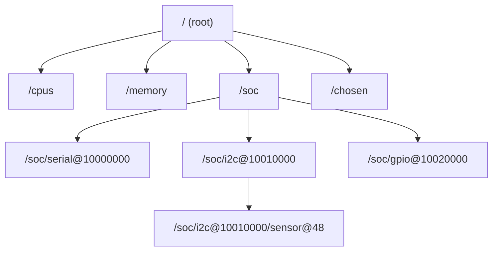
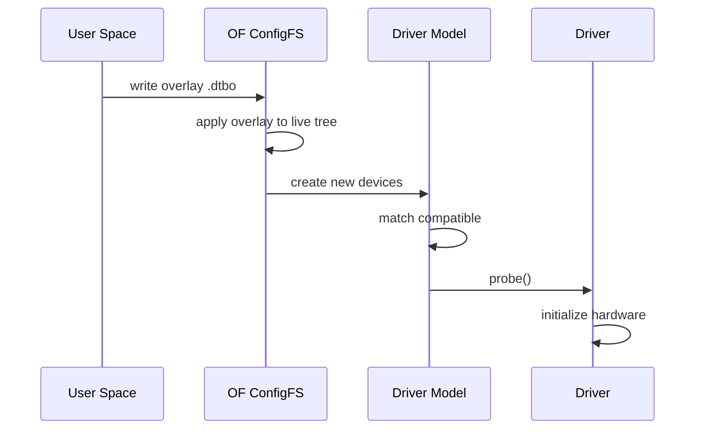
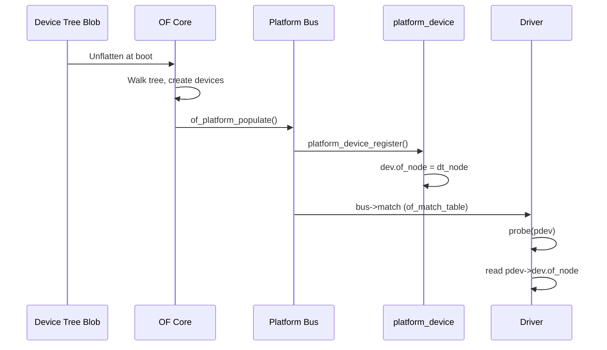
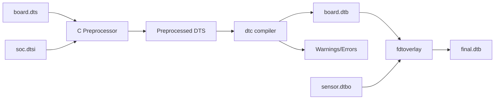

# Device Tree for Drivers

The **device tree** (DT) is a data structure for describing hardware that
cannot be self-discovered by the kernel. Unlike PCI or USB devices (which
are enumerated by the bus), SoC peripherals — UARTs, I2C controllers,
GPIO pins, interrupt controllers — are wired directly and must be
described statically. The device tree replaces the legacy of
hard-coded platform data in the kernel source.

---

## 1. What Is a Device Tree?

A device tree is a tree of **nodes**, each representing a hardware
component. Nodes contain **properties** (key-value pairs) that describe
the hardware's resources: register addresses, interrupt lines, clocks,
GPIO pins, and more.



### Source vs Binary

| Format | Extension | Tool |
|---|---|---|
| Device Tree Source | `.dts` / `.dtsi` | Human-readable |
| Device Tree Blob | `.dtb` | Compiled binary |
| Device Tree Overlay | `.dtbo` | Partial overlay |

```bash
# Compile
dtc -I dts -O dtb -o my.dtb my.dts

# Decompile
dtc -I dtb -O dts -o my.dts my.dtb

# View live tree on running system
dtc -I fs /sys/firmware/devicetree/base
```

---

## 2. DTS Syntax

### 2.1 Nodes

```dts
/ {
    model = "My Board";
    compatible = "myvendor,myboard";

    chosen {
        bootargs = "console=ttyS0,115200";
    };

    memory@80000000 {
        device_type = "memory";
        reg = <0x80000000 0x40000000>;  /* 1 GiB at 0x80000000 */
    };

    soc {
        compatible = "simple-bus";
        #address-cells = <1>;
        #size-cells = <1>;
        ranges;

        uart0: serial@10000000 {
            compatible = "ns16550a";
            reg = <0x10000000 0x100>;
            interrupts = <0 10 4>;    /* SPI 10, level-high */
            clock-frequency = <24000000>;
            status = "okay";
        };

        i2c0: i2c@10010000 {
            compatible = "myvendor,my-i2c";
            reg = <0x10010000 0x1000>;
            interrupts = <0 15 4>;
            #address-cells = <1>;
            #size-cells = <0>;

            sensor@48 {
                compatible = "vendor,sensor-v1";
                reg = <0x48>;
            };
        };
    };
};
```

### 2.2 Properties

| Property | Type | Description |
|---|---|---|
| `compatible` | string list | Driver matching key |
| `reg` | `<addr size>...` | Register addresses |
| `interrupts` | `<spec>...` | Interrupt specifiers |
| `status` | string | `"okay"` or `"disabled"` |
| `clocks` | phandle list | Clock references |
| `pinctrl-0` | phandle list | Pin control state |
| `phandle` | `<n>` | Unique node reference |

### 2.3 Include Mechanism

```dts
/* myboard.dts */
#include "myvendor-common.dtsi"

/ {
    model = "My Custom Board";
};
```

`.dtsi` files contain shared definitions (SoC peripherals) that boards
include and customize.

---

## 3. `of_match_table` — Driver Matching

A driver declares which device tree nodes it supports via an
`of_device_id` table:

```c
#include <linux/of.h>
#include <linux/of_device.h>

static const struct of_device_id my_of_match[] = {
    { .compatible = "myvendor,my-uart" },
    { .compatible = "ns16550a" },
    { }  /* terminator */
};
MODULE_DEVICE_TABLE(of, my_of_match);

static struct platform_driver my_driver = {
    .probe = my_probe,
    .remove = my_remove,
    .driver = {
        .name = "my-uart",
        .of_match_table = my_of_match,
    },
};

module_platform_driver(my_driver);
```

### Matching Rules

The kernel compares the device's `compatible` property against the
driver's `of_match_table` entries. **First match wins** — order the
table from most specific to most generic.

```dts
compatible = "myvendor,myboard-uart", "ns16550a";
```

The kernel tries `"myvendor,myboard-uart"` first, then `"ns16550a"`.

---

## 4. Reading Properties

### 4.1 Basic Properties

```c
static int my_probe(struct platform_device *pdev)
{
    struct device_node *np = pdev->dev.of_node;
    u32 reg[2];
    const char *name;
    u32 irq;
    int ret;

    /* Read a string property */
    ret = of_property_read_string(np, "label", &name);
    if (ret == 0)
        dev_info(&pdev->dev, "label: %s\n", name);

    /* Read a u32 property */
    ret = of_property_read_u32(np, "clock-frequency", &freq);
    if (ret)
        return ret;

    /* Read reg property (address + size) */
    ret = of_property_read_u32_array(np, "reg", reg, 2);
    if (ret)
        return ret;
    dev_info(&pdev->dev, "reg: 0x%x, size: 0x%x\n", reg[0], reg[1]);

    /* Check boolean property */
    if (of_property_read_bool(np, "my-feature-enable"))
        dev_info(&pdev->dev, "feature enabled\n");

    return 0;
}
```

### 4.2 Common Property Readers

| Function | Purpose |
|---|---|
| `of_property_read_u32()` | Read a single u32 |
| `of_property_read_u32_array()` | Read array of u32s |
| `of_property_read_u64()` | Read a single u64 |
| `of_property_read_string()` | Read a string |
| `of_property_read_string_array()` | Read string array |
| `of_property_read_bool()` | Check if property exists |
| `of_property_count_elems_of_size()` | Count array elements |

### 4.3 Reg Property Helpers

```c
/* Get number of address/size pairs */
int num = of_address_count(np);

/* Get base address */
struct resource res;
of_address_to_resource(np, 0, &res);
void __iomem *base = of_iomap(np, 0);
```

---

## 5. Phandles — Cross-References

**Phandles** (property handles) allow nodes to reference other nodes.
They are the device tree's mechanism for expressing relationships.

### Defining a Phandle

```dts
clocks {
    clk24: oscillator@0 {
        compatible = "fixed-clock";
        clock-frequency = <24000000>;
        #clock-cells = <0>;
        phandle = <0x1>;
    };
};

uart0: serial@10000000 {
    clocks = <&clk24>;    /* reference to oscillator */
    ...
};
```

### Reading Phandles in Drivers

```c
/* Get clock from phandle */
struct clk *clk = devm_clk_get(&pdev->dev, NULL);
if (IS_ERR(clk))
    return PTR_ERR(clk);

clk_prepare_enable(clk);
```

### Common Phandle Uses

| Property | Target | API |
|---|---|---|
| `clocks` | Clock provider | `devm_clk_get()` |
| `interrupts` | Interrupt controller | `platform_get_irq()` |
| `gpios` | GPIO controller | `devm_gpiod_get()` |
| `pinctrl-0` | Pin controller | `devm_pinctrl_get()` |
| `power-supplies` | Regulator | `devm_regulator_get()` |
| `iommus` | IOMMU | `of_iommu_configure()` |
| `dma-channels` | DMA controller | `dma_request_chan()` |

---

## 6. Interrupts

### 6.1 Interrupt Specifiers

```dts
interrupts = <0 10 4>;
/* GIC: <type IRQ# trigger_type>
   type 0 = SPI, 1 = PPI
   trigger: 1=rising, 2=falling, 4=level-high, 8=level-low */
```

### 6.2 Interrupt Maps (PCI)

For PCI interrupt routing:

```dts
interrupt-map-mask = <0x1800 0 0 7>;
interrupt-map = <
    /* dev, pin, parent, parent-irq, ... */
    0x0000 0 0 1 &gic 0 0 4
    0x0800 0 0 1 &gic 0 0 4
    0x1000 0 0 1 &gic 0 0 4
>;
```

### 6.3 Getting IRQs in Drivers

```c
int irq = platform_get_irq(pdev, 0);
if (irq < 0)
    return irq;

ret = devm_request_irq(&pdev->dev, irq, my_isr, 0,
                       "my-device", my_data);
```

---

## 7. Device Tree Overlays

Overlays allow modifying the device tree at runtime (e.g., loading
a cape/HAT on BeagleBone or a HAT on Raspberry Pi).

### Overlay Source

```dts
/dts-v1/;
/plugin/;

/ {
    fragment@0 {
        target = <&i2c1>;
        __overlay__ {
            sensor@48 {
                compatible = "vendor,sensor-v1";
                reg = <0x48>;
            };
        };
    };
};
```

### Loading an Overlay

```bash
# Compile
dtc -@ -I dts -O dtb -o my_overlay.dtbo my_overlay.dts

# Load at runtime (requires CONFIG_OF_OVERLAY)
sudo mkdir -p /sys/kernel/config/device-tree/overlays/my
sudo cat my_overlay.dtbo > /sys/kernel/config/device-tree/overlays/my/dtbo

# The sensor@48 node now appears under i2c1
# The sensor driver will probe automatically
```

### Overlay Lifecycle



---

## 8. Device Tree Bindings Documentation

Each device tree binding is documented in YAML under
`Documentation/devicetree/bindings/`:

```bash
$ ls Documentation/devicetree/bindings/serial/
8250.yaml  ns16550.yaml  snps-dw-apb-uart.yaml
```

A typical binding document:

```yaml
# Example binding
properties:
  compatible:
    const: myvendor,my-uart

  reg:
    minItems: 1
    maxItems: 1

  interrupts:
    minItems: 1
    maxItems: 1

  clock-frequency:
    $ref: /schemas/types.yaml#/definitions/uint32
    description: Input clock frequency

required:
  - compatible
  - reg
  - interrupts

additionalProperties: false
```

---

## 9. The `of_node` Lifecycle

The `of_node` is set by the device tree subsystem during bus
enumeration. Platform drivers receive it via `pdev->dev.of_node`:



### `of_platform_populate()`

Called during boot to create platform devices from the device tree:

```c
of_platform_populate(NULL, of_default_bus_match_table, NULL, NULL);
```

This walks the device tree and creates `platform_device` for each node
with a `compatible` property that matches a registered driver.

## 10. Device Tree Compilation and Validation

### Compilation Pipeline



### dtc Compiler Options

```bash
# Basic compilation
dtc -I dts -O dtb -o board.dtb board.dts

# With preprocessing (recommended for production)
cpp -nostdinc -I include -undef -x assembler-with-cpp \
    board.dts board.dts.preprocessed
dtc -I dts -O dtb -o board.dtb board.dts.preprocessed

# Enable all warnings
dtc -I dts -O dtb -o board.dtb board.dts -@ -W no-unit_address_vs_reg

# Deprecation warnings
dtc -I dts -O dtb -o board.dtb board.dts -W deprecated

# Quiet mode (suppress warnings)
dtc -I dts -O dtb -q -o board.dtb board.dts

# Verify DTB integrity
dtc -I dtb -O dtb board.dtb > /dev/null
```

### Device Tree Validation (dt-validate)

The kernel includes a YAML-based schema validator:

```bash
# Install dt-schema (requires Python)
pip3 install dt-schema

# Validate DTS against bindings
make ARCH=arm64 CROSS_COMPILE=aarch64-linux-gnu- dt_binding_check

# Validate compiled DTB
dt-validate -s /path/to/schemas board.dtb

# Validate all DTBs for a platform
make ARCH=arm64 dtbs_check
```

### Common Compilation Errors

```bash
# Error: duplicate node names
board.dts:15.1-20.3: ERROR: duplicate node name: serial@10000000
# Fix: Use unique names or labels

# Error: missing required property
board.dts:20.5-25.3: ERROR: missing 'reg' property
# Fix: Add required properties per binding

# Warning: unit_address_vs_reg mismatch
board.dts:15.1-20.3: Warning: unit name and reg address mismatch
# Fix: Align node name with reg address

# Error: incompatible string
board.dts:20.5-25.3: ERROR: "myvendor,my-uart" not in any binding
# Fix: Check spelling, add to compatible list in driver
```

## 11. Device Tree for Power Management

### Power Domains

```dts
/* Power domain definitions */
power: power-controller@10000000 {
    compatible = "myvendor,power-controller";
    reg = <0x10000000 0x1000>;
    #power-domain-cells = <1>;
};

/* Consumer devices reference the power domain */
uart0: serial@10010000 {
    power-domains = <&power 0>;  /* Domain 0 */
    /* Driver will enable/disable domain around use */
};
```

### Runtime PM with Device Tree

```c
/* Driver runtime PM integration */
static int my_suspend(struct device *dev)
{
    struct my_data *data = dev_get_drvdata(dev);
    /* Disable clocks, regulators from DT */
    clk_disable_unprepare(data->clk);
    regulator_disable(data->supply);
    return 0;
}

static int my_resume(struct device *dev)
{
    struct my_data *data = dev_get_drvdata(dev);
    regulator_enable(data->supply);
    clk_prepare_enable(data->clk);
    return 0;
}

static const struct dev_pm_ops my_pm_ops = {
    SET_RUNTIME_PM_OPS(my_suspend, my_resume, NULL)
};
```

## 12. Device Tree vs ACPI

| Feature | Device Tree | ACPI |
|---|---|---|
| Primary use | ARM, RISC-V, embedded | x86, servers |
| Format | DTS/DTSI (source) | AML (compiled bytecode) |
| Modification | Edit DTS, recompile | ACPI tables in BIOS |
| Overlay support | Yes | Limited |
| Kernel API | `of_*()` functions | `acpi_*()` functions |
| Matching | `compatible` string | `_HID` / `_CID` |

Some platforms support **both** (e.g., ARM servers may use ACPI).

---

## 11. Debugging Device Tree Issues

### Check if a Node Was Found

```bash
# List all devices under a bus
$ ls /sys/bus/platform/devices/
10000000.serial  10010000.i2c  ...

# Check the of_node symlink
$ ls -la /sys/bus/platform/devices/10000000.serial/of_node/
```

### `dmesg` Diagnostics

```bash
$ dmesg | grep -i "of\|dt\|devicetree"
[0.000000] OF: fdt: Machine model: My Board
[0.123456] OF: overlay: WARNING: duplicate 'sensor@48' in fragment
```

### `dtc` Warnings

```bash
dtc -I dts -O dtb my.dts 2>&1 | grep -i warn
```

---

## Further Reading

- [GNU Project Documentation](https://www.gnu.org/doc/doc.html)
- [GNU Manuals](https://www.gnu.org/manual/manual.html)
- [Free Software Directory](https://directory.fsf.org/wiki/Main_Page)
- [Planet GNU](https://planet.gnu.org/)
- [Free Software Books](https://www.gnu.org/doc/other-free-books.html)

- [Linux kernel docs — Device Tree](https://docs.kernel.org/devicetree/usage-model.html)
- [devicetree.org — DTSpec](https://www.devicetree.org/specifications/)
- [LWN: Device tree wars](https://lwn.net/Articles/573386/)
- [kernel.org — Documentation/devicetree/](https://git.kernel.org/pub/scm/linux/kernel/git/torvalds/linux.git/tree/Documentation/devicetree)
- [elinux.org — Device Tree](https://elinux.org/Device_Tree_Reference)
- [Bootlin — Device Tree training](https://bootlin.com/training/device-tree/)

## Related Topics

- [Driver Model Overview](overview.md) — bus/device/driver and platform devices
- [PCI Subsystem](pci.md) — PCI does not need device tree (self-discoverable)
- [USB Subsystem](usb.md) — USB controllers described in device tree
- [Character Devices](char-devices.md) — character device registration
- [Kernel APIs](../apis.md) — memory mapping and IRQ APIs
