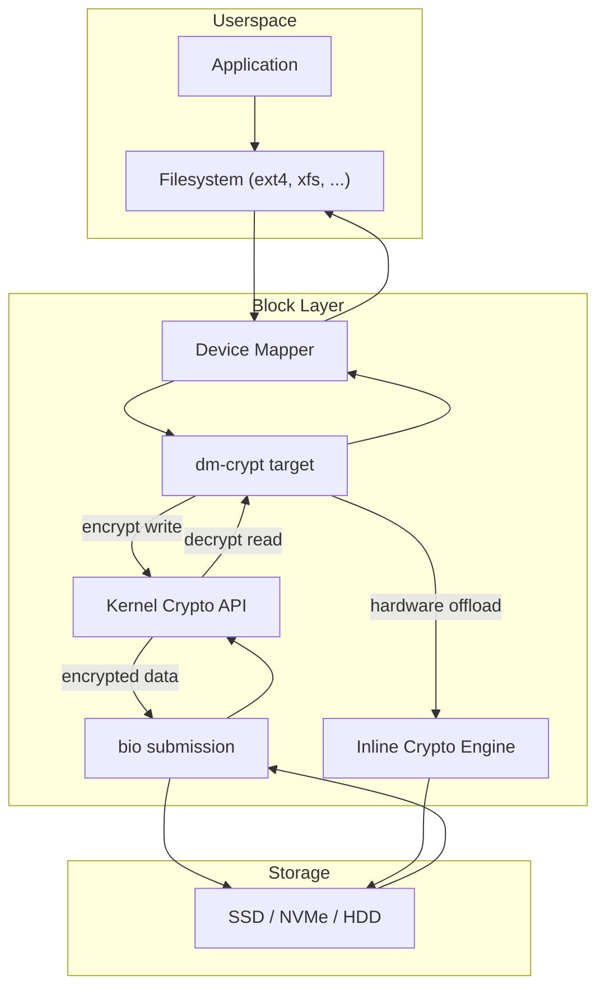
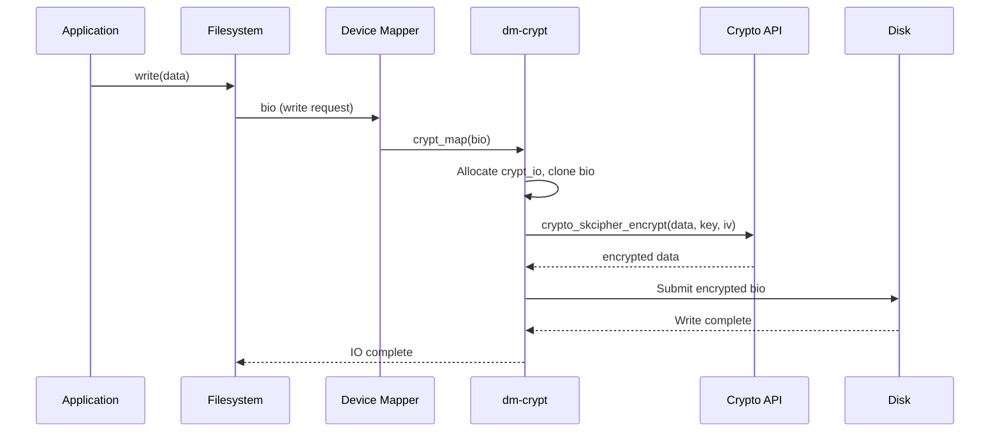
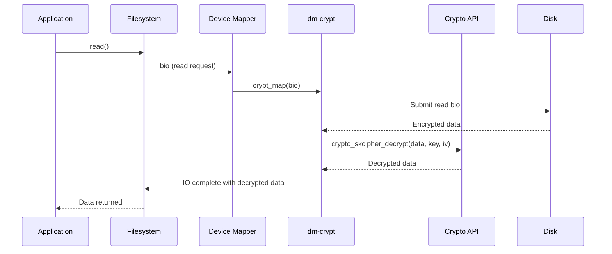
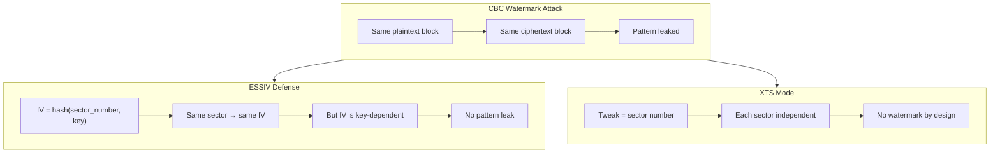
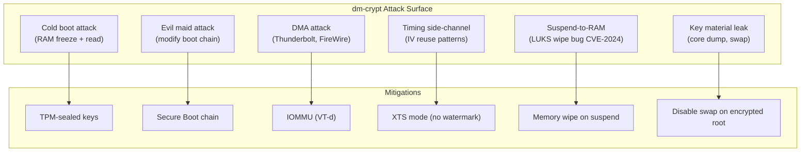
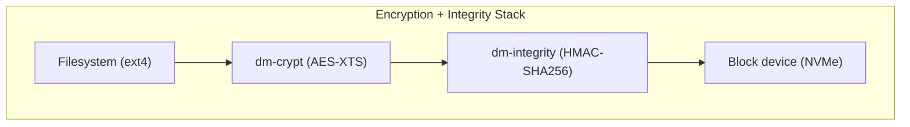
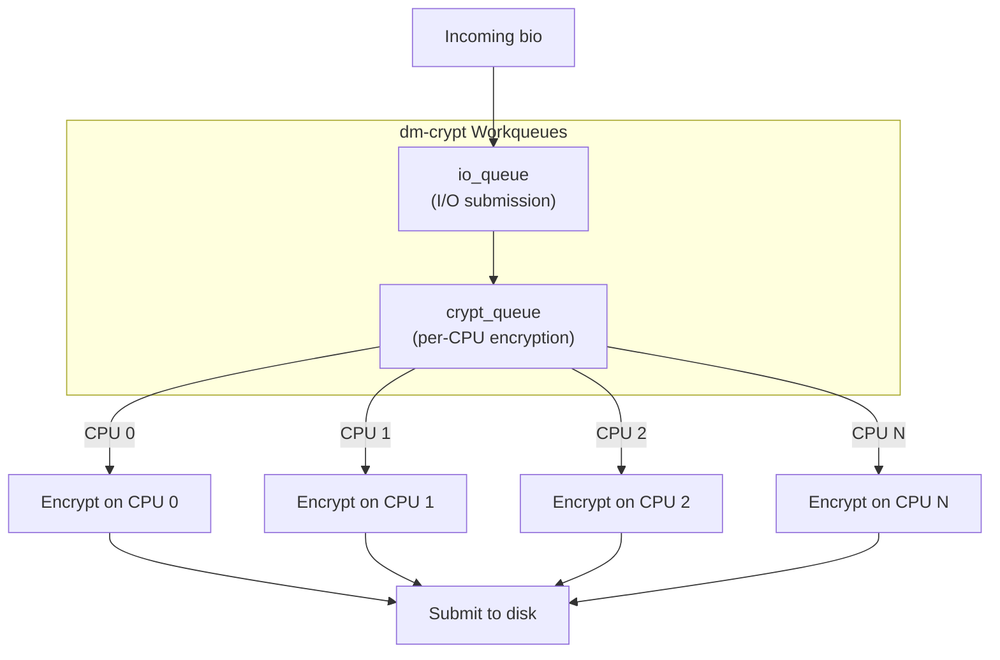

# dm-crypt: Block-Layer Encryption

## Overview

dm-crypt is a device-mapper target that provides **transparent block-level encryption** of storage devices. It encrypts all data written to a block device and decrypts all data read from it, using the kernel crypto API. dm-crypt is the foundation for LUKS (Linux Unified Key Setup), the standard disk encryption format on Linux.

dm-crypt operates at the block layer, below the filesystem. This means any filesystem can be used on top of an encrypted device, and the encryption is invisible to userspace applications.

> **Introduced:** Linux 2.6.4 (commit `382699`)
> **Source:** `drivers/md/dm-crypt.c`
> **Module:** `dm-crypt`

---

## Architecture



---

## How dm-crypt Works

### Write Path (Encryption)



### Read Path (Decryption)



---

## Key Data Structures

### struct crypt_config

```c
/* drivers/md/dm-crypt.c */
struct crypt_config {
    struct dm_dev *dev;              /* Underlying device */
    sector_t start;                  /* Start offset */

    /* Crypto configuration */
    struct crypto_skcipher *cipher;  /* Cipher handle */
    struct crypt_iv_operations *iv_gen_ops; /* IV generator */
    char *cipher_string;             /* Cipher algorithm string */
    char *key_string;                /* Key (hex or base64) */
    unsigned int key_size;           /* Key size in bytes */
    u8 *key;                         /* Encryption key */

    /* IV (Initialization Vector) */
    char *iv_mode;                   /* IV mode (plain, plain64, essiv, etc.) */
    u64 iv_offset;                   /* IV offset */

    /* Memory pool for crypt_io */
    mempool_t io_pool;
    mempool_t page_pool;
    struct bio_set bs;

    /* Workqueue for deferred decryption */
    struct workqueue_struct *io_queue;
    struct workqueue_struct *crypt_queue;

    /* Device geometry */
    unsigned int sector_size;
    unsigned int sector_shift;

    /* Integrity */
    struct dm_integrity_crypt *integrity;

    /* Performance */
    bool submit_from_crypt_cpus;
    unsigned int num_write_cpu_ids;
    unsigned int num_read_cpu_ids;

    /* ... */
};
```

### struct crypt_io

```c
/* drivers/md/dm-crypt.c */
struct crypt_io {
    struct crypt_config *cc;         /* Config */
    struct bio *base_bio;            /* Original bio */
    struct work_struct work;         /* Deferred work */
    sector_t sector;                 /* Sector number */
    atomic_t io_pending;             /* Pending sub-IOs */
    int error;                       /* Error code */
    u8 *integrity_metadata;          /* Integrity metadata */
    struct bvec_iter iter;           /* Bio iterator */
    /* ... */
};
```

---

## Cipher Configuration

### Cipher String Format

dm-crypt uses the kernel crypto API cipher string format:

```
<cipher>[-<chainmode>[-<ivmode>[:<ivopts>]]]
```

Examples:
```
aes-xts-plain64          # AES in XTS mode with plain64 IV
aes-cbc-essiv:sha256     # AES in CBC mode with ESSIV IV
aes-gcm-random           # AES in GCM mode (authenticated)
chacha20-poly1305        # ChaCha20-Poly1305 (AEAD)
```

### Common Ciphers

| Cipher | Mode | Speed | Security | Use Case |
|--------|------|-------|----------|----------|
| `aes-xts-plain64` | XTS | Fast (AES-NI) | High | Standard disk encryption |
| `aes-cbc-essiv:sha256` | CBC | Moderate | Moderate | Legacy compatibility |
| `aes-gcm-random` | GCM | Fast | High (AEAD) | Authenticated encryption |
| `chacha20-poly1305` | — | Fast (no AES-NI) | High | ARM/mobile devices |
| `aria-xts-plain64` | XTS | Moderate | High | Korean standard (KCDSA) |
| `sm4-xts-plain64` | XTS | Moderate | High | Chinese standard (GM/T) |

### IV (Initialization Vector) Modes

| IV Mode | Description | Use Case |
|---------|-------------|----------|
| `plain` | IV = sector number (32-bit) | Small devices (<2TB) |
| `plain64` | IV = sector number (64-bit) | Large devices (default) |
| `essiv` | IV = hash(encrypted sector) | CBC mode (prevents watermark) |
| `random` | Random IV per sector | AEAD modes |
| `lmk` | Linear mixing | Legacy |

### IV Mode Security Implications



---

## LUKS Integration

LUKS (Linux Unified Key Setup) is the standard format for dm-crypt:

### LUKS Header

```bash
# LUKS2 header info
cryptsetup luksDump /dev/sda1
# LUKS header information
# Version:        2
# Cipher:         aes-xts-plain64
# Hash:           sha256
# Offset:         32768 [bytes]
# Key offset:     256 [sectors]
# ...
```

### Creating an Encrypted Volume

```bash
# Create LUKS2 encrypted partition
cryptsetup luksFormat /dev/sda1 --type luks2 \
    --cipher aes-xts-plain64 --key-size 512 --hash sha256

# Open the encrypted volume
cryptsetup luksOpen /dev/sda1 mydata

# Create filesystem
mkfs.ext4 /dev/mapper/mydata

# Mount
mount /dev/mapper/mydata /mnt/data

# Close when done
umount /mnt/data
cryptsetup luksClose mydata
```

### LUKS2 Features

```bash
# Add a key
cryptsetup luksAddKey /dev/sda1

# Remove a key
cryptsetup luksRemoveKey /dev/sda1

# Add a recovery key
cryptsetup luksAddKey /dev/sda1 --new-keyfile /path/to/recovery.key

# Backup header
cryptsetup luksHeaderBackup /dev/sda1 --header-backup-file header.bak

# Restore header
cryptsetup luksHeaderRestore /dev/sda1 --header-backup-file header.bak

# Enable TRIM (discard) support
cryptsetup open --allow-discards /dev/sda1 mydata

# Convert LUKS1 to LUKS2
cryptsetup convert /dev/sda1 --type luks2
```

### LUKS2 Token System

```bash
# Add a token for systemd-creds
cryptsetup token add --token-id 0 /dev/sda1

# List tokens
cryptsetup token export --token-id 0 /dev/sda1

# Use FIDO2 token for unlock
systemd-cryptenroll /dev/sda1 --fido2-device=auto

# Use TPM2 for automatic unlock
systemd-cryptenroll /dev/sda1 --tpm2-device=auto

# Use PKCS#11 smart card
systemd-cryptenroll /dev/sda1 --pkcs11-token-uri=auto
```

---

## Threat Model

### What dm-crypt Protects Against

| Threat | Mitigation |
|--------|------------|
| Physical disk theft | Data encrypted at rest |
| Cold boot attacks | Key in kernel memory only (partially) |
| Evil maid attacks | Combined with TPM + Secure Boot |
| Data recovery from discarded drives | Encrypted blocks appear random |
| Unauthorized data access | Key required to decrypt |

### Attack Surface



### Known Vulnerabilities

| CVE/Issue | Year | Impact | Mitigation |
|-----------|------|--------|------------|
| LUKS suspend wipe failure | 2024 | Key not wiped from RAM on suspend | Kernel fix in 6.9+ |
| CBC watermark attack | 2005 | Pattern leakage in CBC mode | Use XTS mode |
| Evil maid attack | 2009 | Boot chain modification | Secure Boot + TPM |
| Cold boot attack | 2008 | RAM data persistence | Memory encryption (AMD SME) |

---

## Performance Considerations

### Hardware Acceleration

```bash
# Check if AES-NI is available
grep aes /proc/cpuinfo

# Check kernel crypto algorithm availability
cryptsetup benchmark
# Tests encryption/decryption speeds for various algorithms

# Detailed crypto info
cat /proc/crypto | grep -A5 "name.*aes"

# Check for hardware crypto engines
cat /proc/crypto | grep "driver.*aes.*ni"
```

### Multiqueue Support

Modern dm-crypt uses **per-CPU workqueues** for parallel encryption:

```bash
# Check dm-crypt queue configuration
dmsetup table --showkeys /dev/mapper/mydata
# 0 1953525168 crypt aes-xts-plain64 ... 0 8:1 32768

# The "8 8" at the end shows 8 encryption threads
# Adjust with:
cryptsetup refresh mydata --perf-submit_from_crypt_cpus

# Check current crypto threads
cat /proc/interrupts | grep crypto
```

### TRIM/Discard

```bash
# Enable TRIM (allows SSD wear leveling but leaks info about encrypted sectors)
cryptsetup open --allow-discards /dev/nvme0n1p1 mydata

# In /etc/crypttab:
mydata /dev/nvme0n1p1 none discard

# Check TRIM support
lsblk --discard /dev/mapper/mydata
```

⚠️ **Security warning**: TRIM reveals which sectors are unused, potentially leaking information about filesystem usage patterns.

### Performance Benchmarks

```bash
# Benchmark dm-crypt
cryptsetup benchmark
# Algorithm       | Key |  Encryption |  Decryption
# aes-xts        | 256b |  3.2 GiB/s |   3.1 GiB/s
# aes-xts        | 512b |  2.4 GiB/s |   2.3 GiB/s

# Benchmark underlying device
dd if=/dev/zero of=/dev/mapper/mydata bs=1M count=1024 oflag=direct

# Compare with unencrypted
dd if=/dev/zero of=/dev/sda1 bs=1M count=1024 oflag=direct

# Detailed I/O benchmark
fio --name=crypt-test --rw=randread --bs=4k --size=1G \
    --filename=/dev/mapper/mydata --direct=1 --ioengine=libaio --iodepth=32
```

---

## Integrity Protection

### dm-integrity + dm-crypt

For authenticated encryption (prevents tampering):

```bash
# Create integrity device first
integritysetup format /dev/sda1 --tag-size 32 --integrity hmac-sha256

# Open integrity device
integritysetup open /dev/sda1 mydata-integrity

# Create encrypted device on top
cryptsetup luksFormat /dev/mapper/mydata-integrity \
    --cipher aes-gcm-random --integrity hmac-sha256

# Stack: filesystem → dm-crypt → dm-integrity → block device
```

### dm-crypt with AEAD

```bash
# Use authenticated encryption directly
cryptsetup luksFormat /dev/sda1 --cipher aes-gcm-random --integrity aead

# Or with HMAC
cryptsetup luksFormat /dev/sda1 --cipher aes-xts-plain64 \
    --integrity hmac-sha256-256
```

### Integrity Stack Diagram



---

## Kernel Internals

### dm-crypt Target Registration

```c
/* drivers/md/dm-crypt.c */
static struct target_type crypt_target = {
    .name = "crypt",
    .version = {1, 23, 0},
    .module = THIS_MODULE,
    .ctr = crypt_ctr,
    .dtr = crypt_dtr,
    .map = crypt_map,
    .iterate_devices = crypt_iterate_devices,
    .io_hints = crypt_io_hints,
    .status = crypt_status,
    .postsuspend = crypt_postsuspend,
    .resume = crypt_resume,
};
```

### Workqueue Architecture



### Key Lifecycle

```c
/* Key is loaded during ctr (constructor) */
static int crypt_ctr(struct dm_target *ti, unsigned int argc, char **argv)
{
    /* Parse cipher string */
    /* Allocate and load key */
    /* Initialize crypto API handles */
    /* Set up IV generator */
    /* Create workqueues */
}

/* Key is freed during dtr (destructor) */
static void crypt_dtr(struct dm_target *ti)
{
    /* Zero key material */
    memzero_explicit(cc->key, cc->key_size);
    /* Free crypto handles */
    /* Destroy workqueues */
}
```

---

## Kernel Configuration

```
# Required for dm-crypt
CONFIG_DM_CRYPT=y               # dm-crypt target
CONFIG_BLK_DEV_DM=y             # Device Mapper core
CONFIG_CRYPTO_AES=y             # AES cipher
CONFIG_CRYPTO_XTS=y             # XTS mode
CONFIG_CRYPTO_CBC=y             # CBC mode (legacy)
CONFIG_CRYPTO_ESSIV=y           # ESSIV IV generator
CONFIG_CRYPTO_GCM=y             # GCM mode (AEAD)
CONFIG_CRYPTO_CCM=y             # CCM mode (AEAD)
CONFIG_CRYPTO_CHACHA20POLY1305=y # ChaCha20-Poly1305
CONFIG_CRYPTO_SHA256=y          # SHA-256 (for ESSIV)
CONFIG_CRYPTO_SHA512=y          # SHA-512 (for key derivation)
CONFIG_CRYPTO_USER_API_SKCIPHER=y # Userspace API

# For dm-integrity
CONFIG_DM_INTEGRITY=y           # dm-integrity target

# For hardware acceleration
CONFIG_CRYPTO_AES_NI_INTEL=y    # AES-NI (Intel)
CONFIG_CRYPTO_AES_ARM64_CE=y    # ARM Crypto Extensions
```

---

## Troubleshooting

### Cannot Open Encrypted Volume

```bash
# Check LUKS header
cryptsetup luksDump /dev/sda1

# Verify key slot
cryptsetup luksOpen --test-passphrase /dev/sda1
echo $?  # 0 = success

# Try recovery key
cryptsetup luksOpen --key-file /path/to/recovery.key /dev/sda1 mydata

# Check for header corruption
cryptsetup isLuks /dev/sda1
echo $?  # 0 = valid LUKS
```

### Performance Issues

```bash
# Check crypto algorithm availability
cat /proc/crypto | grep "name.*aes"

# Verify hardware acceleration
cryptsetup benchmark

# Check for encryption thread saturation
cat /proc/interrupts | grep dm-crypt

# Monitor I/O latency
iostat -x 1

# Check for queue depth issues
cat /sys/block/nvme0n1/queue/nr_requests
```

### Corrupted Data

```bash
# Check filesystem
fsck /dev/mapper/mydata

# Verify LUKS header integrity
cryptsetup luksDump /dev/sda1

# Restore header from backup
cryptsetup luksHeaderRestore /dev/sda1 --header-backup-file header.bak

# Check for bad sectors
badblocks -v /dev/sda1
```

---

## Source Files

| File | Contents |
|------|----------|
| `drivers/md/dm-crypt.c` | dm-crypt device-mapper target |
| `drivers/md/dm-integrity.c` | dm-integrity for authenticated encryption |
| `include/linux/device-mapper.h` | Device mapper API |
| `crypto/` | Kernel crypto API implementation |
| `drivers/crypto/` | Hardware crypto drivers |

---

## Further Reading

- **Kernel documentation**: `Documentation/admin-guide/device-mapper/dm-crypt.html`
- **kernel-internals.org**: [dm-crypt and fscrypt](https://kernel-internals.org/crypto/encryption/)
- **Cloudflare Blog**: [Speeding up Linux disk encryption](https://blog.cloudflare.com/speeding-up-linux-disk-encryption/)
- **cryptsetup wiki**: [GitHub wiki](https://github.com/cryptsetup/cryptsetup/wiki)
- **LUKS specification**: [GitLab](https://gitlab.com/cryptsetup/cryptsetup/-/wikis/LUKS-standard-on-disk-format)

---

## See Also

- [Device Mapper](./device-mapper.md) — device mapper framework
- [Block I/O](./block-io.md) — block layer
- [Filesystem Encryption](./fscrypt.md) — per-file encryption
- [Crypto API](./crypto.md) — kernel crypto API
- [NVMe](./nvme.md) — NVMe performance with encryption
