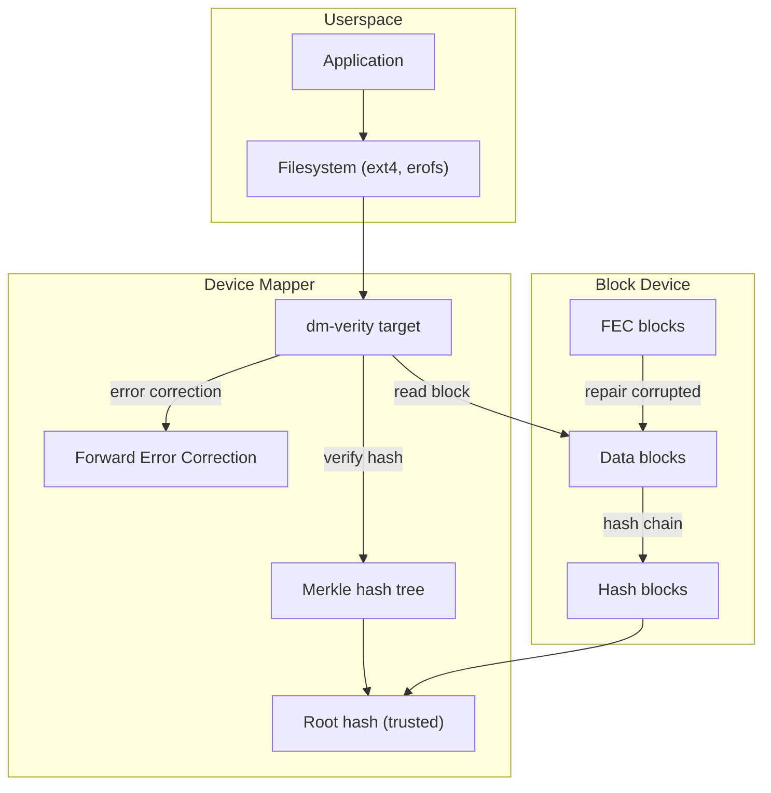
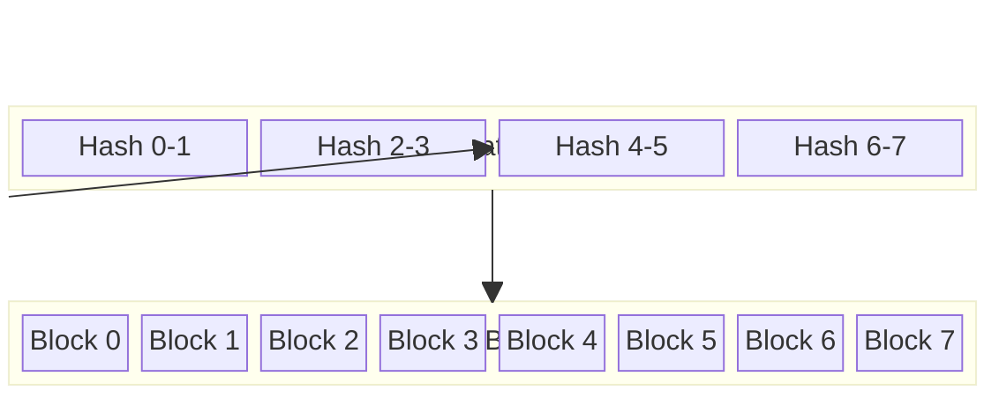
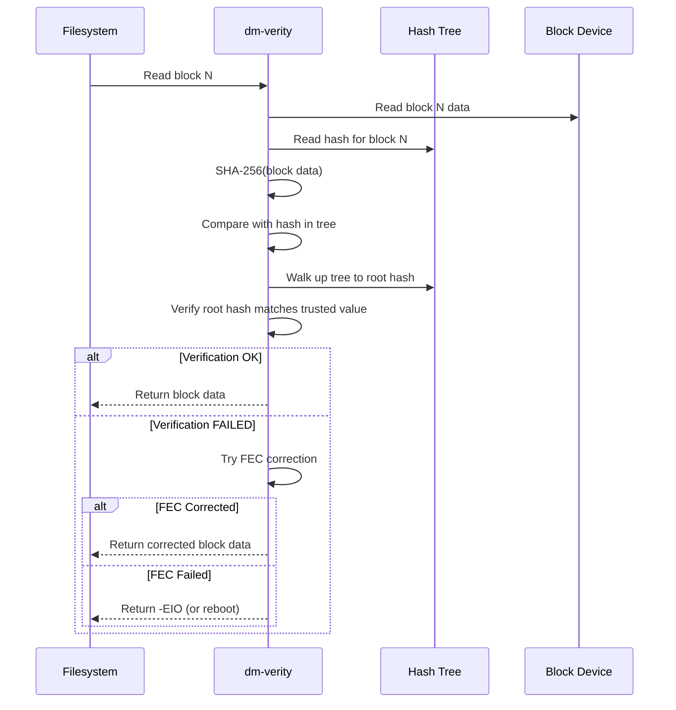
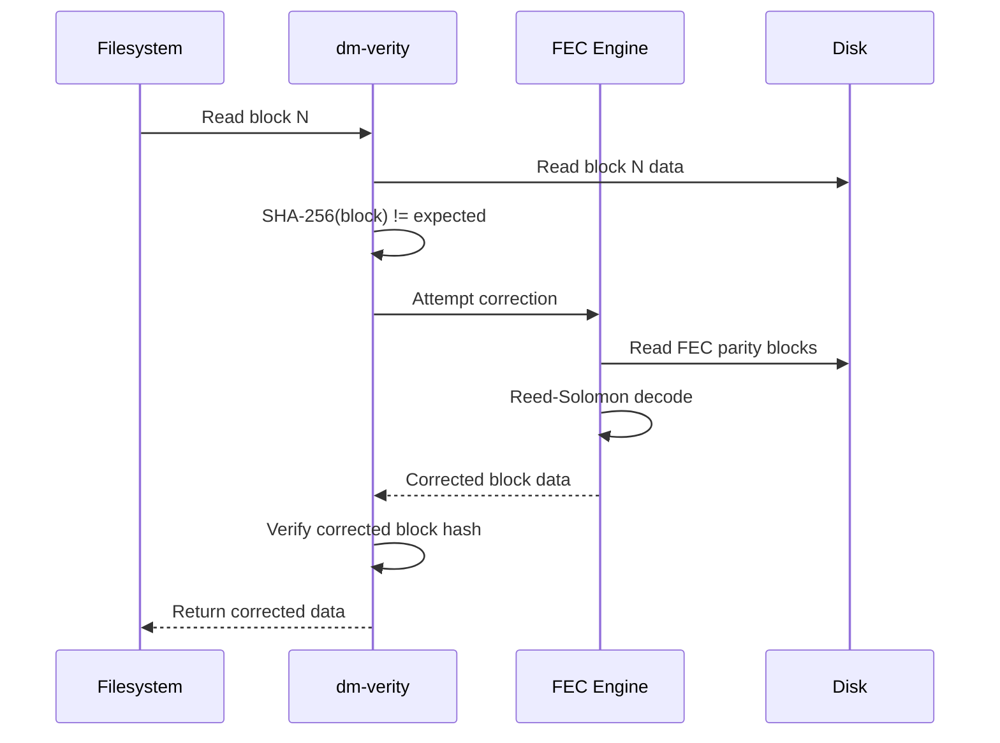
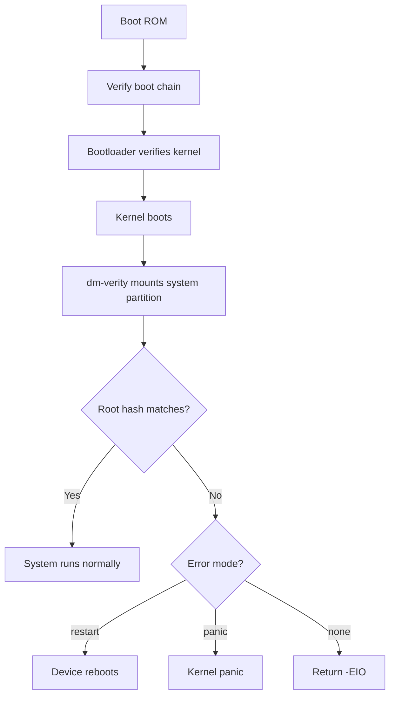
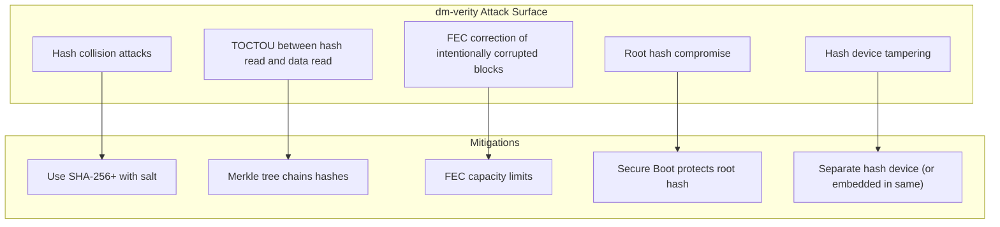
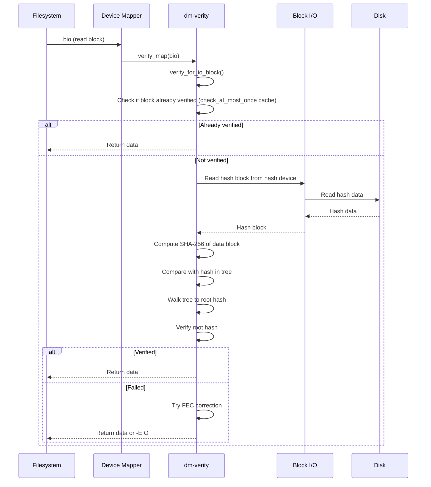
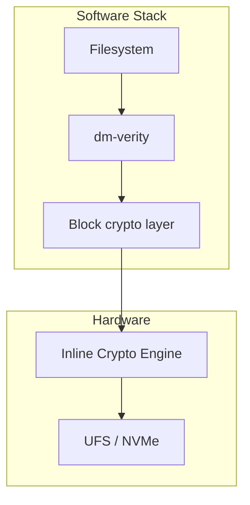

# dm-verity: Verified Boot

## Overview

dm-verity is a device-mapper target that provides **transparent block-level integrity verification** using a Merkle hash tree. It ensures that block device contents have not been tampered with by verifying each block's hash against a trusted root hash. dm-verity is the foundation of **Android Verified Boot**, **Linux Secure Boot**, and **immutable infrastructure**.

dm-verity is read-only — it verifies reads but doesn't handle writes. If a block fails verification, the I/O fails with an error, preventing tampered data from reaching userspace.

> **Introduced:** Linux 3.4 (commit `a36dbf`)
> **Source:** `drivers/md/dm-verity.c`
> **Module:** `dm-verity`

---

## Architecture



---

## Merkle Hash Tree

dm-verity uses a **Merkle tree** where each node is the hash of its children:



### Verification Process



---

## Key Data Structures

### struct dm_verity

```c
/* drivers/md/dm-verity-target.c */
struct dm_verity {
    struct dm_dev *data_dev;         /* Data device */
    struct dm_dev *hash_dev;         /* Hash device */
    struct crypto_shash *tfm;        /* Hash algorithm */
    u8 *root_digest;                 /* Trusted root hash */
    unsigned int digest_size;        /* Hash output size */
    unsigned int data_block_bits;    /* log2(data_block_size) */
    unsigned int hash_block_bits;    /* log2(hash_block_size) */
    unsigned int data_dev_block_bits;/* log2(dev_block_size) */
    sector_t data_start;             /* Data start sector */
    sector_t hash_start;             /* Hash start sector */
    unsigned int salt_size;          /* Salt length */
    u8 *salt;                        /* Hash salt */
    unsigned int mode;               /* Error handling mode */
    struct dm_verity_fec *fec;       /* FEC context */
    unsigned int root_digest_size;   /* Root digest size */
    /* ... */
};
```

### Error Modes

| Mode | Behavior | Use Case |
|------|----------|----------|
| `restart` | Reboot device (default for Android) | Immutable devices |
| `panic` | Kernel panic | High-security systems |
| `none` | Return -EIO | Development/debugging |

---

## Setup

### Creating dm-verity Device

```bash
# Format filesystem and create verity metadata
veritysetup format /dev/sda1 /dev/sda2
# Output: Root hash: <64-char hex>

# Open verity device
veritysetup open /dev/sda1 mydata /dev/sda2 <root_hash>

# Mount verified filesystem
mount /dev/mapper/mydata /mnt

# Verify status
veritysetup status mydata
```

### dm-verity Parameters

```bash
# Full parameter set
dmsetup create mydata --table \
    "0 <sectors> verity <version> <data_dev> <hash_dev> \
     <data_block_size> <hash_block_size> <data_blocks> \
     <hash_start> <algorithm> <root_hash> <salt>"

# Example
dmsetup create mydata --table \
    "0 1048576 verity 1 /dev/sda1 /dev/sda2 \
     4096 4096 131072 131072 sha256 \
     abc123...def456 01020304"
```

### Verity Table Format

```
<version> <data_dev> <hash_dev> <data_block_size> <hash_block_size>
<num_data_blocks> <hash_start_block> <algorithm> <root_hash> <salt>
[<opt_params>...]
```

Optional parameters:
```
--fec-device=<dev>        # FEC device for error correction
--fec-roots=<n>           # FEC roots (parity blocks)
--fec-blocks=<n>          # FEC block count
--error-handling=<mode>   # restart|panic|none
--ignore-corruption       # Continue on corruption (log only)
--restart-on-corruption   # Restart on corruption
--panic-on-corruption     # Panic on corruption
--check-at-most-once      # Only verify block once
--ignore-zero-blocks      # Skip verification for zero blocks
```

---

## Forward Error Correction (FEC)

dm-verity FEC adds Reed-Solomon error correction, allowing recovery from small data corruption:

### FEC Architecture

```mermaid
flowchart LR
    subgraph Data["Data Blocks"]
        D0["Block 0"] D1["Block 1"] D2["Block 2"]
    end
    subgraph Hash["Hash Blocks"]
        H0["Hash 0"] H1["Hash 1"] H2["Hash 2"]
    end
    subgraph FEC["FEC Blocks"]
        F0["RS parity 0"] F1["RS parity 1"]
    end

    D0 --> F0
    D1 --> F0
    D2 --> F1
    H0 --> F0
    H1 --> F1
```

```bash
# Create verity device with FEC
veritysetup format --fec-device=/dev/sda3 /dev/sda1 /dev/sda2

# Open with FEC
veritysetup open --fec-device=/dev/sda3 \
    /dev/sda1 mydata /dev/sda2 <root_hash>

# FEC parameters
# --fec-roots=N: number of parity blocks (default: 2)
# Higher roots = more error correction capacity
# Max: 24 roots (can correct up to 24 block errors per RS codeword)
```

### FEC Recovery Flow



---

## Android Verified Boot (AVB)

dm-verity is central to Android's security model:



### Android dm-verity Integration

```bash
# Android uses AVB (Android Verified Boot) to:
# 1. Generate verity metadata during build
# 2. Embed root hash in vbmeta partition
# 3. Pass root hash to kernel at boot
# 4. Kernel sets up dm-verity for system/vendor partitions

# Check verity status on Android
adb shell dmctl list
adb shell dmctl status system

# Android fstab entry example:
# /system  ext4  ro  wait,verify
# /vendor  ext4  ro  wait,verify
```

### AVB vbmeta Structure

```bash
# Dump vbmeta (verified boot metadata)
avbtool info_image --image vbmeta.img

# Contains:
# - Root hash for system partition
# - Root hash for vendor partition
# - Hash algorithm
# - Rollback index (anti-rollback)
# - Chain partition descriptors
```

---

## Hash Algorithms

| Algorithm | Digest Size | Speed | Security |
|-----------|------------|-------|----------|
| sha256 | 32 bytes | Good | High (recommended) |
| sha512 | 64 bytes | Moderate | Very high |
| sha1 | 20 bytes | Fast | Low (avoid) |
| sha3-256 | 32 bytes | Slow | Very high |
| blake2b-256 | 32 bytes | Fast | High |

### Algorithm Selection

```bash
# Use SHA-256 (default, recommended)
veritysetup format --hash=sha256 /dev/sda1 /dev/sda2

# Use SHA-512 for higher security
veritysetup format --hash=sha512 /dev/sda1 /dev/sda2

# Avoid SHA-1 (weak)
# veritysetup format --hash=sha1 /dev/sda1 /dev/sda2  # NOT RECOMMENDED
```

---

## Integration with Other Subsystems

### dm-verity + fs-verity

**fs-verity** provides per-file integrity (complementary to dm-verity's block-level):

| Aspect | dm-verity | fs-verity |
|--------|-----------|-----------|
| Scope | Entire block device | Per-file |
| Writable | No | No |
| Use case | System partition | APK files, binaries |
| Integration | Device Mapper | Filesystem (ext4, btrfs) |
| FEC support | Yes | No |
| Kernel API | dm-verity target | `ioctl(FS_IOC_ENABLE_VERITY)` |

### dm-verity + IMA

IMA can use dm-verity to avoid re-hashing files that are already verified:

```bash
# IMA policy that trusts dm-verity
appraise func=BPRM_CHECK appraise_type=imasig

# IMA with dm-verity integration
# If file is on a dm-verity protected device, skip re-hashing
```

### dm-verity + dm-crypt

Stack dm-crypt under dm-verity for encryption + integrity:

```bash
# Layer: filesystem → dm-verity → dm-crypt → block device
# First decrypt, then verify integrity
cryptsetup open /dev/sda1 cryptdata
veritysetup open /dev/mapper/cryptdata verified /dev/sda2 <hash>
mount /dev/mapper/verified /mnt
```

---

## Threat Model

### What dm-verity Protects Against

| Threat | Mitigation |
|--------|------------|
| Offline tampering of block device | Hash tree detects modified blocks |
| Rootkit installation on read-only partition | Verification fails, blocks access |
| Supply chain attacks (modified firmware) | Root hash in trusted boot chain |
| Bit-flip attacks (cosmic rays, hardware) | FEC corrects small corruptions |

### What dm-verity Does NOT Protect Against

| Limitation | Explanation |
|------------|-------------|
| Runtime memory attacks | dm-verity verifies disk, not RAM |
| Writable partitions | dm-verity is read-only only |
| Bootloader compromise | If bootloader is compromised, root hash can be replaced |
| DMA attacks | No protection against bus-level attacks |
| Social engineering | Cannot prevent users from disabling verification |

### Attack Surface



---

## Kernel Internals

### dm-verity Target Registration

```c
/* drivers/md/dm-verity-target.c */
static struct target_type verity_target = {
    .name = "verity",
    .version = {1, 10, 0},
    .module = THIS_MODULE,
    .ctr = verity_ctr,         /* Constructor */
    .dtr = verity_dtr,         /* Destructor */
    .map = verity_map,         /* I/O mapping function */
    .iterate_devices = verity_iterate_devices,
    .io_hints = verity_io_hints,
    .status = verity_status,
};

static int __init dm_verity_init(void)
{
    return dm_register_target(&verity_target);
}
```

### I/O Path



### Hash Prefetching

```c
/* drivers/md/dm-verity-target.c */
static void verity_submit_prefetch(struct dm_verity *v,
                                   struct dm_verity_io *io)
{
    /* Prefetch hash blocks for upcoming I/O */
    /* Reduces I/O latency for sequential reads */
    /* Default prefetch cluster size: 512 blocks */
    sector_t hash_block_start;
    unsigned int hash_blocks_needed;

    /* Calculate hash blocks needed for the I/O */
    /* Submit read-ahead for hash blocks */
}
```

### check_at_most_once Optimization

```bash
# Once a block is verified, cache the result
# Avoids re-verification on repeated reads
# Uses a bitmap in memory

# Enable via verity table parameter
dmsetup create mydata --table \
    "0 1048576 verity 1 /dev/sda1 /dev/sda2 \
     4096 4096 131072 131072 sha256 \
     abc123...def456 01020304 1 check_at_most_once"

# Trade-off: memory for performance
# Each 4KB block needs 1 bit in the bitmap
# 128GB partition = 4MB bitmap
```

---

## Kernel Configuration

```
# Required for dm-verity
CONFIG_DM_VERITY=y              # dm-verity target
CONFIG_DM_VERITY_FEC=y          # Forward Error Correction
CONFIG_CRYPTO_SHA256=y          # SHA-256 hash (default)
CONFIG_CRYPTO_SHA512=y          # SHA-512 hash (optional)
CONFIG_BLK_DEV_DM=y             # Device Mapper core

# For fs-verity (per-file verification)
CONFIG_FS_VERITY=y              # fs-verity support
CONFIG_FS_VERITY_BUILTIN_SIGNATURES=y  # Built-in signatures

# For Android Verified Boot
CONFIG_AVB_VERSION=2            # AVB 2.0 support
```

---

## dm-verity with Inline Encryption

Modern storage (UFS, NVMe) supports inline encryption where the hardware encrypts/decrypts data. dm-verity can work with inline encryption:



```bash
# Create encrypted + verified partition
cryptsetup open /dev/sda1 cryptdata
veritysetup open /dev/mapper/cryptdata verified /dev/sda2 <hash>

# Or with inline encryption (hardware offload)
# Kernel automatically uses ICE when available
```

---

## dm-verity on Different Filesystems

| Filesystem | dm-verity Support | Notes |
|------------|-------------------|-------|
| ext4 | Yes | Most common, full support |
| erofs | Yes | Read-only, compressed, ideal for Android |
| f2fs | Yes | With checkpoint disabled |
| squashfs | Yes | Read-only by design |
| btrfs | No | Use fs-verity instead |
| xfs | No | Use fs-verity instead |

---

## Security Hardening

### Preventing Root Hash Tampering

```bash
# 1. Store root hash in kernel command line (GRUB)
GRUB_CMDLINE_LINUX="dm-verity.root_hash=<hash>"

# 2. Store root hash in vbmeta (Android)
avbtool make_hashtree_image --image system.img \
    --tree_sha256 --hash_algorithm sha256

# 3. Use UEFI Secure Boot to protect kernel + root hash
# 4. Seal root hash in TPM (binds to boot state)
```

### dm-verity in Immutable Containers

```bash
# Create read-only container rootfs with dm-verity
docker build -t myapp .
docker export myapp > rootfs.tar

# Create verity-protected rootfs
veritysetup format rootfs.img rootfs.hash
# Store root hash in container runtime config
```

### Audit and Monitoring

```bash
# Monitor dm-verity verification failures
# Add to /etc/audit/audit.rules:
-w /dev/mapper/verified -p r -k verity_access

# Watch for verification failures in real-time
dmesg -w | grep "verity.*failed"

# Log all dm-verity events
journalctl -f | grep dm-verity
```

---

## Performance

### Overhead

dm-verity adds per-read overhead:
- **Hash computation**: SHA-256 of each block (~1µs per 4KB block)
- **Hash tree traversal**: ~4 levels for 4KB blocks on 128GB partition
- **I/O amplification**: Hash blocks must also be read

### Optimization

```bash
# Use larger data blocks (reduces tree depth)
veritysetup format --data-block-size=4096 ...

# Prefetch hash blocks (default: enabled)
# Kernel parameter: dm-verity.prefetch_cluster=<n>

# Check verification stats
cat /sys/block/dm-0/stat

# Benchmark dm-verity overhead
fio --name=seqread --rw=read --bs=4k --size=1G \
    --filename=/dev/mapper/mydata --direct=1 --ioengine=libaio
```

### Performance Comparison

| Configuration | Sequential Read | Random Read | Overhead |
|--------------|-----------------|-------------|----------|
| Plain block device | 3.2 GB/s | 800 MB/s | Baseline |
| dm-verity (SHA-256) | 2.8 GB/s | 700 MB/s | ~12% |
| dm-verity + FEC | 2.6 GB/s | 650 MB/s | ~18% |
| dm-verity + check_at_most_once | 2.9 GB/s | 750 MB/s | ~9% |

---

## Troubleshooting

```bash
# Check dm-verity status
dmsetup status mydata

# Check for verification errors
dmesg | grep -i verity
# dm-verity: verification failed on block 12345

# Verify root hash
veritysetup verify /dev/sda1 /dev/sda2 <root_hash>

# Dump hash tree
veritysetup dump /dev/sda2

# Check FEC status
dmesg | grep -i "verity.*fec"

# Force verification of entire device
cat /dev/mapper/mydata > /dev/null
# Watch dmesg for failures
```

### Common Issues

| Issue | Cause | Solution |
|-------|-------|----------|
| `Verification failed` | Data corruption or tampering | Restore from known-good backup |
| `Root hash mismatch` | Wrong root hash provided | Check vbmeta or bootloader args |
| `FEC correction failed` | Too many corrupt blocks | Restore partition |
| `No space for hash tree` | Hash device too small | Increase hash device size |
| Slow first read | Hash tree not cached | Enable `check_at_most_once` |

---

## Source Files

| File | Contents |
|------|----------|
| `drivers/md/dm-verity.c` | dm-verity device-mapper target |
| `drivers/md/dm-verity-target.c` | Verity target implementation |
| `drivers/md/dm-verity-fec.c` | Forward Error Correction |
| `fs/verity/` | fs-verity (per-file verification) |
| `include/linux/dm-verity.h` | dm-verity header |
| `include/linux/verity.h` | Verity common definitions |

---

## Further Reading

- **Kernel documentation**: `Documentation/admin-guide/device-mapper/dm-verity.html`
- **kernel-internals.org**: [dm-verity](https://kernel-internals.org/crypto/encryption/)
- **Android**: [Verified Boot](https://source.android.com/security/verifiedboot)
- **LWN**: ["dm-verity: inline protection"](https://lwn.net/Articles/524926/)
- **Android Source**: [dm-verity implementation](https://android.googlesource.com/platform/system/core/+/refs/heads/main/fs_mgr/libdm/)

---

## See Also

- [dm-crypt](./dm-crypt.md) — disk encryption
- [Device Mapper](./device-mapper.md) — device mapper framework
- [Secure Boot](../security/secure-boot.md) — UEFI Secure Boot
- [IMA](../security/ima.md) — Integrity Measurement Architecture
- [TPM](../security/tpm.md) — TPM for root hash storage
