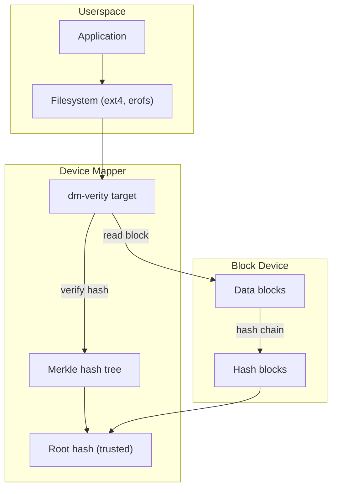
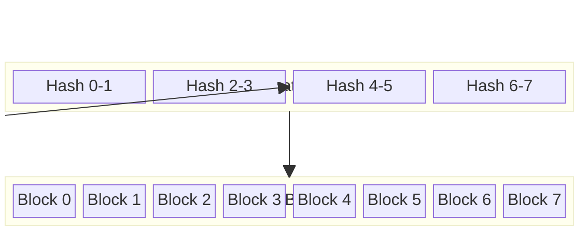
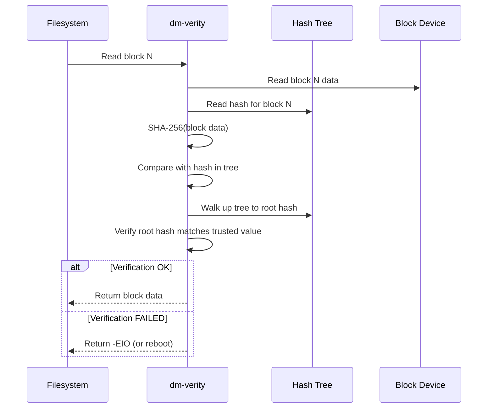
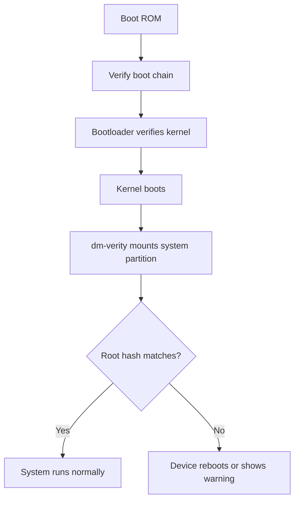

# dm-verity: Verified Boot

## Overview

dm-verity is a device-mapper target that provides **transparent block-level integrity verification** using a Merkle hash tree. It ensures that block device contents have not been tampered with by verifying each block's hash against a trusted root hash. dm-verity is the foundation of **Android Verified Boot**, **Linux Secure Boot**, and **immutable infrastructure**.

dm-verity is read-only — it verifies reads but doesn't handle writes. If a block fails verification, the I/O fails with an error, preventing tampered data from reaching userspace.

> **Introduced:** Linux 3.4 (commit `a36dbf`)  
> **Source:** `drivers/md/dm-verity.c`  
> **Module:** `dm-verity`

---

## Architecture



---

## Merkle Hash Tree

dm-verity uses a **Merkle tree** where each node is the hash of its children:



### Verification Process



---

## Key Data Structures

### struct dm_verity

```c
/* drivers/md/dm-verity.c */
struct dm_verity {
    struct dm_dev *data_dev;         /* Data device */
    struct dm_dev *hash_dev;         /* Hash device */
    struct crypto_shash *tfm;        /* Hash algorithm */
    u8 *root_digest;                 /* Trusted root hash */
    unsigned int digest_size;        /* Hash output size */
    unsigned int data_block_bits;    /* log2(data_block_size) */
    unsigned int hash_block_bits;    /* log2(hash_block_size) */
    unsigned int data_dev_block_bits;/* log2(dev_block_size) */
    sector_t data_start;             /* Data start sector */
    sector_t hash_start;             /* Hash start sector */
    unsigned int salt_size;          /* Salt length */
    u8 *salt;                        /* Hash salt */
    unsigned int mode;               /* Error handling mode */
    /* ... */
};
```

### Error Modes

| Mode | Behavior | Use Case |
|------|----------|----------|
| `restart` | Reboot device (default for Android) | Immutable devices |
| `panic` | Kernel panic | High-security systems |
| `none` | Return -EIO | Development/debugging |

---

## Setup

### Creating dm-verity Device

```bash
# Format filesystem and create verity metadata
veritysetup format /dev/sda1 /dev/sda2
# Output: Root hash: <64-char hex>

# Open verity device
veritysetup open /dev/sda1 mydata /dev/sda2 <root_hash>

# Mount verified filesystem
mount /dev/mapper/mydata /mnt

# Verify status
veritysetup status mydata
```

### dm-verity Parameters

```bash
# Full parameter set
dmsetup create mydata --table \
    "0 <sectors> verity <version> <data_dev> <hash_dev> \
     <data_block_size> <hash_block_size> <data_blocks> \
     <hash_start> <algorithm> <root_hash> <salt>"

# Example
dmsetup create mydata --table \
    "0 1048576 verity 1 /dev/sda1 /dev/sda2 \
     4096 4096 131072 131072 sha256 \
     abc123...def456 01020304"
```

---

## Android Verified Boot (AVB)

dm-verity is central to Android's security model:



### Android dm-verity Integration

```bash
# Android uses AVB (Android Verified Boot) to:
# 1. Generate verity metadata during build
# 2. Embed root hash in vbmeta partition
# 3. Pass root hash to kernel at boot
# 4. Kernel sets up dm-verity for system/vendor partitions

# Check verity status on Android
adb shell dmctl list
adb shell dmctl status system
```

---

## Hash Algorithms

| Algorithm | Digest Size | Speed | Security |
|-----------|------------|-------|----------|
| sha256 | 32 bytes | Good | High (recommended) |
| sha512 | 64 bytes | Moderate | Very high |
| sha1 | 20 bytes | Fast | Low (avoid) |
| sha3-256 | 32 bytes | Slow | Very high |

---

## Integration with Other Subsystems

### dm-verity + fs-verity

**fs-verity** provides per-file integrity (complementary to dm-verity's block-level):

| Aspect | dm-verity | fs-verity |
|--------|-----------|-----------|
| Scope | Entire block device | Per-file |
| Writable | No | No |
| Use case | System partition | APK files, binaries |
| Integration | Device Mapper | Filesystem (ext4, btrfs) |

### dm-verity + IMA

IMA can use dm-verity to avoid re-hashing files that are already verified:

```bash
# IMA policy that trusts dm-verity
appraise func=BPRM_CHECK appraise_type=imasig
```

### dm-verity + dm-crypt

Stack dm-crypt under dm-verity for encryption + integrity:

```bash
# Layer: filesystem → dm-verity → dm-crypt → block device
# First decrypt, then verify integrity
cryptsetup open /dev/sda1 cryptdata
veritysetup open /dev/mapper/cryptdata verified /dev/sda2 <hash>
mount /dev/mapper/verified /mnt
```

---

## Performance

### Overhead

dm-verity adds per-read overhead:
- **Hash computation**: SHA-256 of each block (~1µs per 4KB block)
- **Hash tree traversal**: ~4 levels for 4KB blocks on 128GB partition
- **I/O amplification**: Hash blocks must also be read

### Optimization

```bash
# Use larger data blocks (reduces tree depth)
veritysetup format --data-block-size=4096 ...

# Prefetch hash blocks (default: enabled)
# Kernel parameter: dm-verity.prefetch_cluster=<n>

# Check verification stats
cat /sys/block/dm-0/stat
```

---

## Troubleshooting

```bash
# Check dm-verity status
dmsetup status mydata

# Check for verification errors
dmesg | grep -i verity
# dm-verity: verification failed on block 12345

# Verify root hash
veritysetup verify /dev/sda1 /dev/sda2 <root_hash>

# Dump hash tree
veritysetup dump /dev/sda2
```

---

## Source Files

| File | Contents |
|------|----------|
| `drivers/md/dm-verity.c` | dm-verity device-mapper target |
| `drivers/md/dm-verity-target.c` | Verity target implementation |
| `drivers/md/dm-verity-fec.c` | Forward Error Correction |
| `fs/verity/` | fs-verity (per-file verification) |
| `include/linux/dm-verity.h` | dm-verity header |

---

## Further Reading

- **Kernel documentation**: `Documentation/admin-guide/device-mapper/dm-verity.html`
- **kernel-internals.org**: [dm-verity](https://kernel-internals.org/crypto/encryption/)
- **Android**: [Verified Boot](https://source.android.com/security/verifiedboot)
- **LWN**: ["dm-verity: inline protection"](https://lwn.net/Articles/524926/)

---

## See Also

- [dm-crypt](./dm-crypt.md) — disk encryption
- [Device Mapper](./device-mapper.md) — device mapper framework
- [Secure Boot](../security/secure-boot.md) — UEFI Secure Boot
- [IMA](../security/ima.md) — Integrity Measurement Architecture
- [TPM](../security/tpm.md) — TPM for root hash storage
