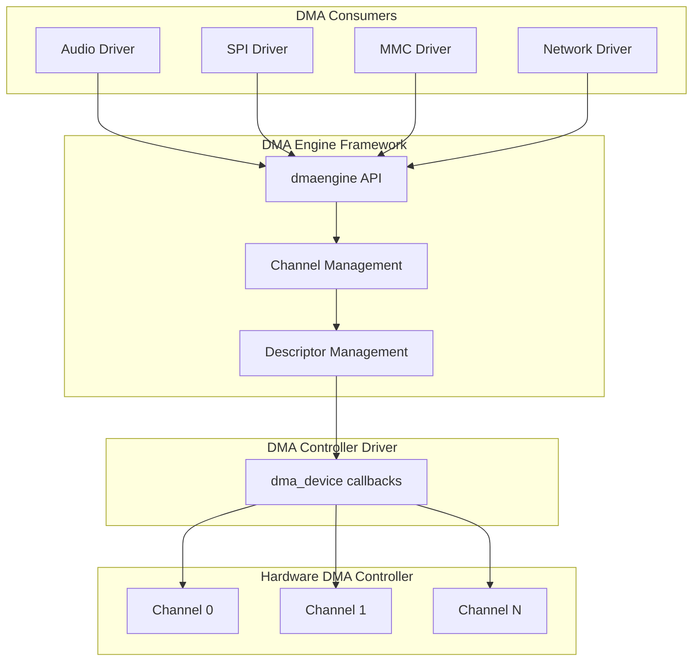

# DMA (Direct Memory Access)

## Introduction

DMA (Direct Memory Access) allows peripheral hardware to transfer data to and from system memory without involving the CPU for each byte. This is essential for high-performance I/O: disk controllers, network cards, audio devices, and display engines all rely on DMA to move large data blocks efficiently. Without DMA, the CPU would need to execute load/store instructions for every byte transferred, which would be prohibitively slow for multi-megabyte transfers.

The Linux DMA Engine framework provides a unified API for drivers to request and use DMA channels, regardless of the underlying hardware controller. This abstraction allows driver authors to write portable code that works with different DMA controller implementations.

## DMA Architecture



## Core Concepts

### Channels

A DMA controller has multiple independent channels, each capable of performing one transfer at a time. The framework manages channel allocation, ensuring no two consumers use the same channel simultaneously.

### Descriptors

A DMA descriptor describes a single transfer: source address, destination address, length, and control flags. Multiple descriptors can be chained into a scatter-gather list.

### Transfer Types

| Type | Description |
|------|-------------|
| `DMA_MEMCPY` | Memory-to-memory copy |
| `DMA_MEMSET` | Memory fill with a pattern |
| `DMA_SLAVE` | Peripheral-to-memory or memory-to-peripheral |
| `DMA_CYCLIC` | Repeating transfers (audio buffers) |
| `DMA_INTERLEAVE` | 2D transfers with stride |
| `DMA_SLAVE_sg` | Scatter-gather slave transfers |

## Consumer API

### Requesting a Channel

```c
#include <linux/dmaengine.h>

/* Request a channel by capability */
struct dma_chan *chan;
chan = dma_request_chan(dev, "tx");  /* name from device tree */
if (IS_ERR(chan))
    return dev_err_probe(dev, PTR_ERR(chan), "failed to get DMA channel\n");

/* Or request by mask */
chan = dma_request_chan_by_mask(DMA_BIT_MASK(32));

/* Release when done */
dma_release_channel(chan);
```

### Device Tree DMA Bindings

```dts
/* DMA controller node */
dma0: dma@10040000 {
    compatible = "vendor,soc-dma";
    reg = <0x10040000 0x1000>;
    interrupts = <GIC_SPI 20 IRQ_TYPE_LEVEL_HIGH>;
    #dma-cells = <2>;   /* channel number + transfer config */
    dma-channels = <8>;
};

/* Consumer using DMA */
spi0: spi@10060000 {
    compatible = "vendor,my-spi";
    dmas = <&dma0 0 DMA_SLAVE_BUS_WIDTH_1_BIT>,
           <&dma0 1 DMA_SLAVE_BUS_WIDTH_1_BIT>;
    dma-names = "tx", "rx";
};
```

### Memory-to-Memory Copy

```c
static void my_dma_callback(void *data)
{
    struct completion *cmp = data;
    complete(cmp);
}

int my_dma_memcpy(struct device *dev, void *dst, void *src, size_t len)
{
    struct dma_chan *chan;
    struct dma_device *dma_dev;
    struct dma_async_tx_descriptor *tx;
    dma_cookie_t cookie;
    dma_addr_t dma_src, dma_dst;
    struct completion cmp;
    enum dma_status status;
    int ret;
    
    /* Request a memcpy-capable channel */
    dma_cap_mask_t mask;
    dma_cap_zero(mask);
    dma_cap_set(DMA_MEMCPY, mask);
    chan = dma_request_channel(mask, NULL, NULL);
    if (!chan)
        return -ENODEV;
    
    dma_dev = chan->device;
    
    /* Map source and destination for DMA */
    dma_src = dma_map_single(dev, src, len, DMA_TO_DEVICE);
    ret = dma_mapping_error(dev, dma_src);
    if (ret)
        goto err_release;
    
    dma_dst = dma_map_single(dev, dst, len, DMA_FROM_DEVICE);
    ret = dma_mapping_error(dev, dma_dst);
    if (ret)
        goto err_unmap_src;
    
    /* Prepare the descriptor */
    tx = dma_dev->device_prep_dma_memcpy(chan, dma_dst, dma_src, len,
                                           DMA_PREP_INTERRUPT | DMA_CTRL_ACK);
    if (!tx) {
        ret = -ENOMEM;
        goto err_unmap_dst;
    }
    
    /* Set completion callback */
    init_completion(&cmp);
    tx->callback = my_dma_callback;
    tx->callback_param = &cmp;
    
    /* Submit and issue */
    cookie = tx->tx_submit(tx);
    if (dma_submit_error(cookie)) {
        ret = cookie;
        goto err_unmap_dst;
    }
    
    dma_async_issue_pending(chan);
    
    /* Wait for completion */
    wait_for_completion_timeout(&cmp, msecs_to_jiffies(5000));
    
    status = dma_async_is_tx_complete(chan, cookie, NULL, NULL);
    ret = (status == DMA_COMPLETE) ? 0 : -EIO;
    
err_unmap_dst:
    dma_unmap_single(dev, dma_dst, len, DMA_FROM_DEVICE);
err_unmap_src:
    dma_unmap_single(dev, dma_src, len, DMA_TO_DEVICE);
err_release:
    dma_release_channel(chan);
    return ret;
}
```

### DMA Slave Transfers

Slave transfers move data between memory and a peripheral:

```c
struct my_dma {
    struct dma_chan *tx_chan;
    struct dma_chan *rx_chan;
    struct completion tx_cmp;
    struct completion rx_cmp;
    dma_addr_t tx_dma;
    dma_addr_t rx_dma;
    void *tx_buf;
    void *rx_buf;
};

static void my_tx_callback(void *data)
{
    struct my_dma *dma = data;
    complete(&dma->tx_cmp);
}

static void my_rx_callback(void *data)
{
    struct my_dma *dma = data;
    complete(&dma->rx_cmp);
}

static int my_dma_setup(struct device *dev, struct my_dma *dma)
{
    struct dma_slave_config tx_config = {};
    struct dma_slave_config rx_config = {};
    int ret;
    
    /* Request channels from device tree */
    dma->tx_chan = dma_request_chan(dev, "tx");
    if (IS_ERR(dma->tx_chan))
        return dev_err_probe(dev, PTR_ERR(dma->tx_chan), "no TX DMA\n");
    
    dma->rx_chan = dma_request_chan(dev, "rx");
    if (IS_ERR(dma->rx_chan)) {
        ret = dev_err_probe(dev, PTR_ERR(dma->rx_chan), "no RX DMA\n");
        goto err_free_tx;
    }
    
    /* Allocate DMA-coherent buffers */
    dma->tx_buf = dma_alloc_coherent(dev, PAGE_SIZE, &dma->tx_dma, GFP_KERNEL);
    if (!dma->tx_buf) {
        ret = -ENOMEM;
        goto err_free_rx;
    }
    
    dma->rx_buf = dma_alloc_coherent(dev, PAGE_SIZE, &dma->rx_dma, GFP_KERNEL);
    if (!dma->rx_buf) {
        ret = -ENOMEM;
        goto err_free_tx_buf;
    }
    
    /* Configure TX channel */
    tx_config.direction = DMA_MEM_TO_DEV;
    tx_config.dst_addr = 0x10060004;  /* peripheral TX register */
    tx_config.dst_addr_width = DMA_SLAVE_BUS_WIDTH_4_BYTES;
    tx_config.dst_maxburst = 16;
    tx_config.src_addr = dma->tx_dma;
    tx_config.src_addr_width = DMA_SLAVE_BUS_WIDTH_4_BYTES;
    
    ret = dmaengine_slave_config(dma->tx_chan, &tx_config);
    if (ret)
        goto err_free_rx_buf;
    
    /* Configure RX channel */
    rx_config.direction = DMA_DEV_TO_MEM;
    rx_config.src_addr = 0x10060008;  /* peripheral RX register */
    rx_config.src_addr_width = DMA_SLAVE_BUS_WIDTH_4_BYTES;
    rx_config.src_maxburst = 16;
    rx_config.dst_addr = dma->rx_dma;
    rx_config.dst_addr_width = DMA_SLAVE_BUS_WIDTH_4_BYTES;
    
    ret = dmaengine_slave_config(dma->rx_chan, &rx_config);
    if (ret)
        goto err_free_rx_buf;
    
    init_completion(&dma->tx_cmp);
    init_completion(&dma->rx_cmp);
    
    return 0;

err_free_rx_buf:
    dma_free_coherent(dev, PAGE_SIZE, dma->rx_buf, dma->rx_dma);
err_free_tx_buf:
    dma_free_coherent(dev, PAGE_SIZE, dma->tx_buf, dma->tx_dma);
err_free_rx:
    dma_release_channel(dma->rx_chan);
err_free_tx:
    dma_release_channel(dma->tx_chan);
    return ret;
}

static int my_dma_transfer(struct device *dev, struct my_dma *dma,
                            size_t tx_len)
{
    struct dma_async_tx_descriptor *txd, *rxd;
    dma_cookie_t tx_cookie, rx_cookie;
    
    /* Prepare TX transfer */
    txd = dmaengine_prep_slave_single(dma->tx_chan, dma->tx_dma, tx_len,
                                        DMA_MEM_TO_DEV,
                                        DMA_PREP_INTERRUPT | DMA_CTRL_ACK);
    if (!txd)
        return -ENOMEM;
    
    txd->callback = my_tx_callback;
    txd->callback_param = dma;
    
    /* Prepare RX transfer */
    rxd = dmaengine_prep_slave_single(dma->rx_chan, dma->rx_dma, tx_len,
                                        DMA_DEV_TO_MEM,
                                        DMA_PREP_INTERRUPT | DMA_CTRL_ACK);
    if (!rxd)
        return -ENOMEM;
    
    rxd->callback = my_rx_callback;
    rxd->callback_param = dma;
    
    /* Submit both */
    rx_cookie = rxd->tx_submit(rxd);
    tx_cookie = txd->tx_submit(txd);
    
    /* Issue RX first, then TX */
    dma_async_issue_pending(dma->rx_chan);
    dma_async_issue_pending(dma->tx_chan);
    
    /* Wait for both to complete */
    wait_for_completion_timeout(&dma->tx_cmp, msecs_to_jiffies(5000));
    wait_for_completion_timeout(&dma->rx_cmp, msecs_to_jiffies(5000));
    
    return 0;
}
```

### Cyclic DMA (Audio)

Cyclic DMA is used for continuous streaming, like audio playback:

```c
/* Audio playback buffer with cyclic DMA */
static int my_audio_prepare(struct my_audio *audio)
{
    struct dma_async_tx_descriptor *desc;
    
    /* Allocate a circular buffer */
    audio->buf = dma_alloc_coherent(audio->dev, BUFFER_SIZE,
                                      &audio->dma_addr, GFP_KERNEL);
    
    /* Prepare cyclic transfer */
    desc = dmaengine_prep_dma_cyclic(audio->chan,
                                      audio->dma_addr,    /* DMA address */
                                      BUFFER_SIZE,         /* total length */
                                      PERIOD_SIZE,         /* period length */
                                      DMA_MEM_TO_DEV,      /* direction */
                                      DMA_PREP_INTERRUPT);
    if (!desc)
        return -ENOMEM;
    
    desc->callback = my_audio_period_callback;
    desc->callback_param = audio;
    
    desc->tx_submit(desc);
    dma_async_issue_pending(audio->chan);
    
    return 0;
}
```

### Scatter-Gather DMA

```c
int my_sg_transfer(struct device *dev, struct dma_chan *chan,
                   struct scatterlist *sgl, int nents)
{
    struct dma_async_tx_descriptor *tx;
    dma_cookie_t cookie;
    int ret;
    
    /* Map the scatter-gather list */
    ret = dma_map_sg(dev, sgl, nents, DMA_TO_DEVICE);
    if (!ret)
        return -ENOMEM;
    
    /* Prepare SG transfer */
    tx = dmaengine_prep_slave_sg(chan, sgl, ret,
                                  DMA_MEM_TO_DEV,
                                  DMA_PREP_INTERRUPT | DMA_CTRL_ACK);
    if (!tx) {
        dma_unmap_sg(dev, sgl, nents, DMA_TO_DEVICE);
        return -ENOMEM;
    }
    
    tx->callback = my_sg_callback;
    tx->callback_param = dev;
    
    cookie = tx->tx_submit(tx);
    dma_async_issue_pending(chan);
    
    /* Wait for completion */
    /* ... */
    
    dma_unmap_sg(dev, sgl, nents, DMA_TO_DEVICE);
    return 0;
}
```

## DMA Memory Mapping

```c
/* For streaming DMA (not coherent) */
dma_addr_t dma_map_single(struct device *dev, void *ptr,
                           size_t size, enum dma_data_direction dir);
void dma_unmap_single(struct device *dev, dma_addr_t addr,
                       size_t size, enum dma_data_direction dir);

int dma_mapping_error(struct device *dev, dma_addr_t addr);

/* Direction values */
enum dma_data_direction {
    DMA_BIDIRECTIONAL = 0,
    DMA_TO_DEVICE     = 1,
    DMA_FROM_DEVICE   = 2,
    DMA_NONE          = 3,
};

/* For coherent (consistent) DMA memory */
void *dma_alloc_coherent(struct device *dev, size_t size,
                          dma_addr_t *dma_handle, gfp_t gfp);
void dma_free_coherent(struct device *dev, size_t size,
                        void *vaddr, dma_addr_t dma_handle);

/* Streaming mapping with page/offset */
dma_addr_t dma_map_page(struct device *dev, struct page *page,
                         size_t offset, size_t size,
                         enum dma_data_direction dir);

/* SG list mapping */
int dma_map_sg(struct device *dev, struct scatterlist *sg,
               int nents, enum dma_data_direction dir);

/* Sync for CPU access (for streaming mappings) */
void dma_sync_single_for_cpu(struct device *dev, dma_addr_t addr,
                              size_t size, enum dma_data_direction dir);
void dma_sync_single_for_device(struct device *dev, dma_addr_t addr,
                                 size_t size, enum dma_data_direction dir);
```

## DMA Pool (Small Allocations)

For many small DMA buffers, pools avoid the overhead of individual allocations:

```c
struct dma_pool *pool;

/* Create a pool */
pool = dma_pool_create("my_pool", dev, 64, 64, 0);
/* 64 bytes per entry, 64-byte alignment, PAGE_SIZE max */

/* Allocate from pool */
void *vaddr;
dma_addr_t dma;
vaddr = dma_pool_alloc(pool, GFP_KERNEL, &dma);

/* Free back to pool */
dma_pool_free(pool, vaddr, dma);

/* Destroy pool */
dma_pool_destroy(pool);
```

## DMA Controller (Provider) Drivers

### Implementing a DMA Controller

```c
#include <linux/dmaengine.h>
#include <linux/dma-mapping.h>

struct my_dma_chan {
    struct dma_chan chan;
    void __iomem *regs;
    spinlock_t lock;
    struct tasklet_struct tasklet;
    dma_cookie_t completed_cookie;
};

struct my_dma_dev {
    struct dma_device ddev;
    void __iomem *base;
    int irq;
    struct my_dma_chan channels[NUM_CHANNELS];
};

/* --- Provider callback implementations --- */

static enum dma_status my_tx_status(struct dma_chan *chan,
                                     dma_cookie_t cookie,
                                     struct dma_tx_state *txstate)
{
    struct my_dma_chan *mychan = container_of(chan, struct my_dma_chan, chan);
    
    dma_cookie_t last_used = chan->cookie;
    dma_cookie_t completed = mychan->completed_cookie;
    
    dma_set_residue(txstate, 0);  /* remaining bytes */
    
    return dma_cookie_status(chan, cookie, txstate);
}

static dma_cookie_t my_tx_submit(struct dma_async_tx_descriptor *tx)
{
    struct my_dma_chan *mychan = container_of(tx->chan,
                                               struct my_dma_chan, chan);
    dma_cookie_t cookie;
    unsigned long flags;
    
    spin_lock_irqsave(&mychan->lock, flags);
    cookie = dma_cookie_assign(tx);
    
    /* Program hardware descriptor here */
    /* my_hw_submit_desc(mychan, tx); */
    
    spin_unlock_irqrestore(&mychan->lock, flags);
    
    return cookie;
}

static struct dma_async_tx_descriptor *my_prep_dma_memcpy(
    struct dma_chan *chan, dma_addr_t dst, dma_addr_t src,
    size_t len, unsigned long flags)
{
    struct my_dma_chan *mychan = container_of(chan, struct my_dma_chan, chan);
    struct dma_async_tx_descriptor *tx;
    
    tx = kzalloc(sizeof(*tx), GFP_NOWAIT);
    if (!tx)
        return NULL;
    
    dma_async_tx_descriptor_init(tx, chan);
    tx->tx_submit = my_tx_submit;
    
    /* Store transfer parameters */
    /* mychan->src = src; mychan->dst = dst; mychan->len = len; */
    
    return tx;
}

static void my_issue_pending(struct dma_chan *chan)
{
    struct my_dma_chan *mychan = container_of(chan, struct my_dma_chan, chan);
    unsigned long flags;
    
    spin_lock_irqsave(&mychan->lock, flags);
    /* Start the DMA engine */
    my_hw_start_channel(mychan);
    spin_unlock_irqrestore(&mychan->lock, flags);
}

static int my_alloc_chan_resources(struct dma_chan *chan)
{
    /* Allocate descriptors, initialize channel */
    return 0;
}

static void my_free_chan_resources(struct dma_chan *chan)
{
    /* Free descriptors */
}

/* IRQ handler */
static irqreturn_t my_dma_irq(int irq, void *data)
{
    struct my_dma_dev *mydma = data;
    u32 status = readl(mydma->base + DMA_STATUS_REG);
    int i;
    
    for (i = 0; i < NUM_CHANNELS; i++) {
        if (status & BIT(i)) {
            struct my_dma_chan *mychan = &mydma->channels[i];
            
            /* Acknowledge interrupt */
            writel(BIT(i), mydma->base + DMA_IRQ_ACK_REG);
            
            /* Update completed cookie */
            mychan->completed_cookie = mychan->chan.cookie;
            
            /* Schedule tasklet for callbacks */
            tasklet_schedule(&mychan->tasklet);
        }
    }
    
    return IRQ_HANDLED;
}

/* Tasklet for calling completion callbacks */
static void my_dma_tasklet(struct tasklet_struct *t)
{
    struct my_dma_chan *mychan = from_tasklet(mychan, t, tasklet);
    
    /* Call all pending callbacks */
    dma_cookie_complete(/* last descriptor */);
    /* Invoke callbacks via dmaengine_desc_callback_invoke() */
}

static int my_dma_probe(struct platform_device *pdev)
{
    struct my_dma_dev *mydma;
    int i, ret;
    
    mydma = devm_kzalloc(&pdev->dev, sizeof(*mydma), GFP_KERNEL);
    if (!mydma)
        return -ENOMEM;
    
    mydma->base = devm_platform_ioremap_resource(pdev, 0);
    if (IS_ERR(mydma->base))
        return PTR_ERR(mydma->base);
    
    mydma->irq = platform_get_irq(pdev, 0);
    if (mydma->irq < 0)
        return mydma->irq;
    
    /* Initialize dma_device */
    INIT_LIST_HEAD(&mydma->ddev.channels);
    dma_cap_set(DMA_MEMCPY, mydma->ddev.cap_mask);
    dma_cap_set(DMA_SLAVE, mydma->ddev.cap_mask);
    
    mydma->ddev.dev = &pdev->dev;
    mydma->ddev.device_alloc_chan_resources = my_alloc_chan_resources;
    mydma->ddev.device_free_chan_resources = my_free_chan_resources;
    mydma->ddev.device_tx_status = my_tx_status;
    mydma->ddev.device_issue_pending = my_issue_pending;
    mydma->ddev.device_prep_dma_memcpy = my_prep_dma_memcpy;
    mydma->ddev.copy_align = 2;  /* 4-byte alignment */
    
    /* Initialize channels */
    for (i = 0; i < NUM_CHANNELS; i++) {
        struct my_dma_chan *mychan = &mydma->channels[i];
        
        mychan->regs = mydma->base + CHANNEL_BASE(i);
        spin_lock_init(&mychan->lock);
        mychan->chan.device = &mydma->ddev;
        list_add_tail(&mychan->chan.device_node, &mydma->ddev.channels);
        tasklet_setup(&mychan->tasklet, my_dma_tasklet);
    }
    
    /* Request IRQ */
    ret = devm_request_irq(&pdev->dev, mydma->irq, my_dma_irq, 0,
                            dev_name(&pdev->dev), mydma);
    if (ret)
        return ret;
    
    /* Set DMA mask */
    ret = dma_set_mask_and_coherent(&pdev->dev, DMA_BIT_MASK(32));
    if (ret)
        return ret;
    
    /* Register with DMA engine */
    ret = dma_async_device_register(&mydma->ddev);
    if (ret)
        return ret;
    
    platform_set_drvdata(pdev, mydma);
    return 0;
}
```

## Debugging DMA

```bash
# View DMA channels in use
cat /sys/class/dma/*/in_use
# 0
# 1

# List DMA devices
ls /sys/class/dma/
# dma0chan0  dma0chan1  dma0chan2  ...

# View DMA channel info
cat /sys/class/dma/dma0chan0/bytes_transferred
# 1048576

# Debug DMA pool usage
cat /proc/meminfo | grep -i dma
# DMA:       12345    67890    55545        0    ...

# Trace DMA operations
echo 1 > /sys/kernel/debug/tracing/events/dma/enable
cat /sys/kernel/debug/tracing/trace_pipe
```

## References

- [GNU Project Documentation](https://www.gnu.org/doc/doc.html)
- [GNU Manuals](https://www.gnu.org/manual/manual.html)
- [Free Software Directory](https://directory.fsf.org/wiki/Main_Page)
- [Planet GNU](https://planet.gnu.org/)
- [Free Software Books](https://www.gnu.org/doc/other-free-books.html)

- [Kernel DMA Engine Documentation](https://docs.kernel.org/driver-api/dmaengine/)
- [LWN: The DMAEngine subsystem](https://lwn.net/Articles/369981/)
- [DMA mapping guide](https://docs.kernel.org/core-api/dma-api.html)
- [Kernel DMA-API.txt](https://www.kernel.org/doc/Documentation/DMA-API.txt)
- [DMA-API-HOWTO.txt](https://www.kernel.org/doc/Documentation/DMA-API-HOWTO.txt)

## Related Topics

- [Interrupt Handling](./interrupt-handling.md) — DMA completion interrupts
- [Network Drivers](./net-drivers.md) — Network DMA for packet buffers
- [Block Drivers](./block-drivers.md) — Disk DMA transfers
- [I2C and SPI](./i2c-spi.md) — SPI DMA for high-speed transfers
- [Memory Management](../mm/index.md) — DMA memory allocation
