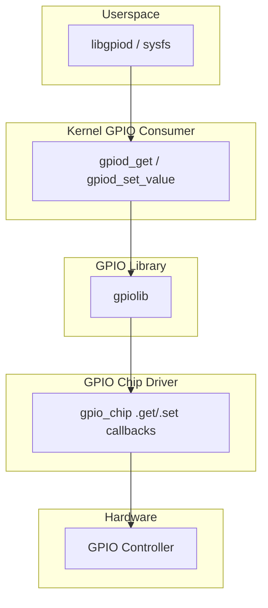

# GPIO (General Purpose Input/Output)

## Introduction

GPIO (General Purpose Input/Output) pins are the most basic hardware interface on embedded systems. A GPIO pin can be configured as an input (to read a button, sensor, or signal) or an output (to drive an LED, enable a regulator, or signal another chip). GPIOs are the building blocks for more complex interfaces — I2C and SPI lines, reset signals, interrupt lines, and power control.

The Linux GPIO subsystem has evolved significantly. The legacy `gpio_request()`/`gpio_set_value()` API is deprecated in favor of the modern `gpiod` (GPIO descriptor) API, which is safer, more explicit about polarity, and integrates cleanly with device tree and ACPI. The subsystem is split into two layers: the **GPIO library** (providing the consumer API) and the **GPIO chip driver** (implementing hardware access).

## GPIO Subsystem Architecture



## The gpiod API (Descriptor-based)

### Getting GPIOs

The modern API uses `gpio_desc` pointers obtained via `gpiod_get()`:

```c
#include <linux/gpio/consumer.h>

/* Named GPIO from device tree */
struct gpio_desc *reset_gpio;
reset_gpio = devm_gpiod_get(dev, "reset", GPIOD_OUT_LOW);
if (IS_ERR(reset_gpio))
    return dev_err_probe(dev, PTR_ERR(reset_gpio), "failed to get reset GPIO\n");

/* Index-based GPIO */
struct gpio_desc *led = devm_gpiod_get_index(dev, "leds", 0, GPIOD_OUT_LOW);

/* Optional GPIO (returns NULL if not specified) */
struct gpio_desc *opt = devm_gpiod_get_optional(dev, "enable", GPIOD_OUT_HIGH);

/* Array of GPIOs */
struct gpio_descs *descs = devm_gpiod_get_array(dev, "data", GPIOD_OUT_LOW);
/* descs->ndescs contains count, descs->desc[] contains the array */
```

### GPIO Flags

```c
#define GPIOD_IN          0   /* Input (default) */
#define GPIOD_OUT_LOW     1   /* Output, initially low */
#define GPIOD_OUT_HIGH    2   /* Output, initially high */
#define GPIOD_FLAGS_BIT_DIR_SET     BIT(0)
#define GPIOD_FLAGS_BIT_DIR_OUT     BIT(1)
#define GPIOD_FLAGS_BIT_DIR_VAL     BIT(2)
#define GPIOD_FLAGS_BIT_OPEN_DRAIN  BIT(3)
#define GPIOD_FLAGS_BIT_OPEN_SOURCE BIT(4)
#define GPIOD_FLAGS_BIT_NONEXCLUSIVE BIT(5)
```

### Reading and Writing GPIOs

```c
/* Set output value */
gpiod_set_value(reset_gpio, 1);    /* assert reset */
gpiod_set_value(reset_gpio, 0);    /* deassert reset */

/* Set with consumer-aware polarity */
gpiod_set_value_cansleep(reset_gpio, 1);  /* works with I2C expanders too */

/* Read input value */
int val = gpiod_get_value(button_gpio);  /* 0 or 1 */

/* Read with sleep-capable accessors */
int val = gpiod_get_value_cansleep(button_gpio);

/* Set direction at runtime */
gpiod_direction_output(led_gpio, 1);
gpiod_direction_input(button_gpio);

/* Toggle output */
gpiod_toggle_active_low(led_gpio);

/* Set active-low flag */
gpiod_set_consumer_name(reset_gpio, "board-reset");
```

### GPIO as IRQ

```c
#include <linux/gpio/consumer.h>
#include <linux/interrupt.h>

static irqreturn_t my_button_irq(int irq, void *data)
{
    struct my_dev *mydev = data;
    /* Handle button press */
    pr_info("Button pressed!\n");
    return IRQ_HANDLED;
}

static int my_probe(struct platform_device *pdev)
{
    struct gpio_desc *button;
    int irq;
    
    button = devm_gpiod_get(&pdev->dev, "button", GPIOD_IN);
    if (IS_ERR(button))
        return PTR_ERR(button);
    
    /* Convert GPIO to IRQ number */
    irq = gpiod_to_irq(button);
    if (irq < 0)
        return irq;
    
    /* Request IRQ with debounce */
    int ret = devm_request_irq(&pdev->dev, irq, my_button_irq,
                                IRQF_TRIGGER_RISING | IRQF_TRIGGER_FALLING,
                                "my-button", mydev);
    return ret;
}
```

## Device Tree GPIO Bindings

### Basic GPIO Specification

```dts
/* GPIO controller node */
gpio0: gpio@10020000 {
    compatible = "vendor,soc-gpio";
    reg = <0x10020000 0x1000>;
    gpio-controller;
    #gpio-cells = <2>;     /* 2 cells: pin number + flags */
    interrupt-controller;
    #interrupt-cells = <2>;
    ngpios = <32>;
};

/* Consumer node using GPIOs */
my_device: my-device@10030000 {
    compatible = "vendor,my-device";
    reg = <0x10030000 0x100>;
    
    /* Named GPIO property */
    reset-gpios = <&gpio0 15 GPIO_ACTIVE_LOW>;
    enable-gpios = <&gpio0 16 GPIO_ACTIVE_HIGH>;
    
    /* LED GPIOs */
    leds-gpios = <&gpio0 17 GPIO_ACTIVE_HIGH>,
                 <&gpio0 18 GPIO_ACTIVE_HIGH>,
                 <&gpio0 19 GPIO_ACTIVE_HIGH>;
    
    /* Button GPIO as interrupt */
    button-gpios = <&gpio0 20 (GPIO_ACTIVE_LOW | GPIO_PULL_UP)>;
};
```

### GPIO Flag Values

```c
/* From include/dt-bindings/gpio/gpio.h */
#define GPIO_ACTIVE_HIGH  0
#define GPIO_ACTIVE_LOW   1
#define GPIO_OPEN_DRAIN   2
#define GPIO_OPEN_SOURCE  4
#define GPIO_PULL_UP      8
#define GPIO_PULL_DOWN    16
#define GPIO_PULL_NONE    0
```

### Complex GPIO Configurations

```dts
/* I2C GPIO expander (PCA9555) */
&i2c0 {
    gpio_expander: pca9555@20 {
        compatible = "nxp,pca9555";
        reg = <0x20>;
        gpio-controller;
        #gpio-cells = <2>;
        interrupt-parent = <&gpio0>;
        interrupts = <5 IRQ_TYPE_LEVEL_LOW>;
    };
};

/* Using GPIOs from expander */
my_device {
    reset-gpios = <&gpio_expander 8 GPIO_ACTIVE_LOW>;  /* expander pin 8 */
};
```

## GPIO Chip Drivers

### Implementing a GPIO Controller

```c
#include <linux/gpio/driver.h>
#include <linux/platform_device.h>

struct my_gpio {
    struct gpio_chip gc;
    void __iomem *base;
    spinlock_t lock;
};

static int my_gpio_get_direction(struct gpio_chip *gc, unsigned int offset)
{
    struct my_gpio *myg = gpiochip_get_data(gc);
    u32 dir = readl(myg->base + GPIO_DIR_REG);
    
    return (dir & BIT(offset)) ? GPIO_LINE_DIRECTION_OUT : GPIO_LINE_DIRECTION_IN;
}

static int my_gpio_direction_input(struct gpio_chip *gc, unsigned int offset)
{
    struct my_gpio *myg = gpiochip_get_data(gc);
    unsigned long flags;
    
    spin_lock_irqsave(&myg->lock, flags);
    u32 dir = readl(myg->base + GPIO_DIR_REG);
    dir &= ~BIT(offset);
    writel(dir, myg->base + GPIO_DIR_REG);
    spin_unlock_irqrestore(&myg->lock, flags);
    
    return 0;
}

static int my_gpio_direction_output(struct gpio_chip *gc,
                                     unsigned int offset, int value)
{
    struct my_gpio *myg = gpiochip_get_data(gc);
    unsigned long flags;
    
    spin_lock_irqsave(&myg->lock, flags);
    
    /* Set output value first (to avoid glitch) */
    u32 val = readl(myg->base + GPIO_OUT_REG);
    if (value)
        val |= BIT(offset);
    else
        val &= ~BIT(offset);
    writel(val, myg->base + GPIO_OUT_REG);
    
    /* Then set direction */
    u32 dir = readl(myg->base + GPIO_DIR_REG);
    dir |= BIT(offset);
    writel(dir, myg->base + GPIO_DIR_REG);
    
    spin_unlock_irqrestore(&myg->lock, flags);
    
    return 0;
}

static int my_gpio_get(struct gpio_chip *gc, unsigned int offset)
{
    struct my_gpio *myg = gpiochip_get_data(gc);
    u32 val;
    
    if (my_gpio_get_direction(gc, offset) == GPIO_LINE_DIRECTION_OUT)
        val = readl(myg->base + GPIO_OUT_REG);
    else
        val = readl(myg->base + GPIO_IN_REG);
    
    return !!(val & BIT(offset));
}

static void my_gpio_set(struct gpio_chip *gc, unsigned int offset, int value)
{
    struct my_gpio *myg = gpiochip_get_data(gc);
    unsigned long flags;
    
    spin_lock_irqsave(&myg->lock, flags);
    u32 val = readl(myg->base + GPIO_OUT_REG);
    if (value)
        val |= BIT(offset);
    else
        val &= ~BIT(offset);
    writel(val, myg->base + GPIO_OUT_REG);
    spin_unlock_irqrestore(&myg->lock, flags);
}

/* GPIO IRQ support */
static void my_gpio_irq_ack(struct irq_data *d)
{
    struct gpio_chip *gc = irq_data_get_irq_chip_data(d);
    struct my_gpio *myg = gpiochip_get_data(gc);
    irq_hw_number_t hwirq = irqd_to_hwirq(d);
    
    writel(BIT(hwirq), myg->base + GPIO_IRQ_ACK_REG);
}

static void my_gpio_irq_mask(struct irq_data *d)
{
    struct gpio_chip *gc = irq_data_get_irq_chip_data(d);
    struct my_gpio *myg = gpiochip_get_data(gc);
    irq_hw_number_t hwirq = irqd_to_hwirq(d);
    unsigned long flags;
    
    spin_lock_irqsave(&myg->lock, flags);
    u32 mask = readl(myg->base + GPIO_IRQ_MASK_REG);
    mask &= ~BIT(hwirq);
    writel(mask, myg->base + GPIO_IRQ_MASK_REG);
    spin_unlock_irqrestore(&myg->lock, flags);
}

static void my_gpio_irq_unmask(struct irq_data *d)
{
    struct gpio_chip *gc = irq_data_get_irq_chip_data(d);
    struct my_gpio *myg = gpiochip_get_data(gc);
    irq_hw_number_t hwirq = irqd_to_hwirq(d);
    unsigned long flags;
    
    spin_lock_irqsave(&myg->lock, flags);
    u32 mask = readl(myg->base + GPIO_IRQ_MASK_REG);
    mask |= BIT(hwirq);
    writel(mask, myg->base + GPIO_IRQ_MASK_REG);
    spin_unlock_irqrestore(&myg->lock, flags);
}

static int my_gpio_irq_set_type(struct irq_data *d, unsigned int type)
{
    struct gpio_chip *gc = irq_data_get_irq_chip_data(d);
    struct my_gpio *myg = gpiochip_get_data(gc);
    irq_hw_number_t hwirq = irqd_to_hwirq(d);
    
    u32 edge = readl(myg->base + GPIO_IRQ_EDGE_REG);
    u32 level = readl(myg->base + GPIO_IRQ_LEVEL_REG);
    
    if (type & IRQ_TYPE_EDGE_RISING) {
        edge |= BIT(hwirq);
        irq_set_handler_locked(d, handle_edge_irq);
    } else if (type & IRQ_TYPE_EDGE_FALLING) {
        edge |= BIT(hwirq);
        irq_set_handler_locked(d, handle_edge_irq);
    } else {
        edge &= ~BIT(hwirq);
        irq_set_handler_locked(d, handle_level_irq);
    }
    
    writel(edge, myg->base + GPIO_IRQ_EDGE_REG);
    return 0;
}

static const struct irq_chip my_gpio_irqchip = {
    .name = "my-gpio",
    .irq_ack = my_gpio_irq_ack,
    .irq_mask = my_gpio_irq_mask,
    .irq_unmask = my_gpio_irq_unmask,
    .irq_set_type = my_gpio_irq_set_type,
};

static irqreturn_t my_gpio_irq_handler(int irq, void *data)
{
    struct my_gpio *myg = data;
    u32 status = readl(myg->base + GPIO_IRQ_STATUS_REG);
    
    while (status) {
        int bit = __ffs(status);
        generic_handle_domain_irq(myg->gc.irq.domain, bit);
        status &= ~BIT(bit);
    }
    
    return IRQ_HANDLED;
}

static int my_gpio_probe(struct platform_device *pdev)
{
    struct my_gpio *myg;
    int irq, ret;
    
    myg = devm_kzalloc(&pdev->dev, sizeof(*myg), GFP_KERNEL);
    if (!myg)
        return -ENOMEM;
    
    spin_lock_init(&myg->lock);
    
    myg->base = devm_platform_ioremap_resource(pdev, 0);
    if (IS_ERR(myg->base))
        return PTR_ERR(myg->base);
    
    /* Configure gpio_chip */
    myg->gc.label = dev_name(&pdev->dev);
    myg->gc.parent = &pdev->dev;
    myg->gc.owner = THIS_MODULE;
    myg->gc.base = -1;  /* dynamic allocation */
    myg->gc.ngpio = 32;
    myg->gc.get_direction = my_gpio_get_direction;
    myg->gc.direction_input = my_gpio_direction_input;
    myg->gc.direction_output = my_gpio_direction_output;
    myg->gc.get = my_gpio_get;
    myg->gc.set = my_gpio_set;
    myg->gc.can_sleep = false;  /* MMIO, no sleeping */
    
    /* Set up IRQ */
    myg->gc.irq.chip = &my_gpio_irqchip;
    myg->gc.irq.parent_handler = my_gpio_irq_handler;
    myg->gc.irq.num_parents = 1;
    myg->gc.irq.parents = devm_kcalloc(&pdev->dev, 1, sizeof(int), GFP_KERNEL);
    irq = platform_get_irq(pdev, 0);
    myg->gc.irq.parents[0] = irq;
    myg->gc.irq.default_type = IRQ_TYPE_NONE;
    myg->gc.irq.handler = handle_bad_irq;
    
    ret = devm_gpiochip_add_data(&pdev->dev, &myg->gc, myg);
    if (ret)
        return ret;
    
    return 0;
}
```

## sysfs GPIO Interface (Legacy)

The legacy sysfs GPIO interface is being replaced by libgpiod but is still present:

```bash
# Export a GPIO
echo 15 > /sys/class/gpio/export

# Set direction
echo out > /sys/class/gpio/gpio15/direction
# or
echo in > /sys/class/gpio/gpio15/direction

# Read/write value
echo 1 > /sys/class/gpio/gpio15/value
cat /sys/class/gpio/gpio15/value
# 1

# Unexport
echo 15 > /sys/class/gpio/unexport

# View available GPIO chips
ls /sys/class/gpio/
# export  gpiochip0  gpiochip32  gpiochip64  unexport

cat /sys/class/gpio/gpiochip0/label
# 10020000.gpio
cat /sys/class/gpio/gpiochip0/base
# 0
cat /sys/class/gpio/gpiochip0/ngpio
# 32
```

## libgpiod (Userspace)

libgpiod is the recommended userspace GPIO library, replacing sysfs:

```c
/* libgpiod example: toggle an LED */
#include <gpiod.h>
#include <unistd.h>

int main(void)
{
    struct gpiod_chip *chip;
    struct gpiod_line *line;
    int ret;
    
    /* Open GPIO chip */
    chip = gpiod_chip_open("/dev/gpiochip0");
    if (!chip)
        return -1;
    
    /* Get GPIO line 15 */
    line = gpiod_chip_get_line(chip, 15);
    if (!line) {
        gpiod_chip_close(chip);
        return -1;
    }
    
    /* Request as output, initially high */
    ret = gpiod_line_request_output(line, "my-led", 1);
    if (ret < 0) {
        gpiod_chip_close(chip);
        return -1;
    }
    
    /* Toggle LED */
    for (int i = 0; i < 10; i++) {
        gpiod_line_set_value(line, 1);
        sleep(1);
        gpiod_line_set_value(line, 0);
        sleep(1);
    }
    
    /* Cleanup */
    gpiod_line_release(line);
    gpiod_chip_close(chip);
    return 0;
}
```

### CLI tools (gpiodetect, gpioget, gpioset)

```bash
# List all GPIO chips
gpiodetect
# gpiochip0 [10020000.gpio] (32 lines)
# gpiochip1 [pca9555] (16 lines)

# Show info for a chip
gpioinfo gpiochip0
# gpiochip0 - 32 lines:
#  line  0:  unnamed       unused   input  active-high
#  line  1:  unnamed       unused   input  active-high
# ...
#  line 15: "reset"        used     output active-low
#  line 16: "enable"       used     output active-high

# Read a GPIO
gpioget gpiochip0 5
# 1

# Set a GPIO
gpioset gpiochip0 15=1

# Watch for events
gpiomon --num-events=5 gpiochip0 20
# event: RISING EDGE offset: [20] timestamp: [1234567890.123456789]
# event: FALLING EDGE offset: [20] timestamp: [1234567890.654321098]

# Multiple GPIOs at once
gpioset gpiochip0 15=1 16=0 17=1
```

### Character Device GPIO (v2 API)

```bash
# The newer chardev interface
ls /dev/gpiochip*
# /dev/gpiochip0  /dev/gpiochip1

# View chip info
cat /sys/bus/gpio/devices/gpiochip0/label
# 10020000.gpio
```

## GPIO Debugging

```bash
# View all GPIO states (requires CONFIG_DEBUG_GPIO)
cat /sys/kernel/debug/gpio
# GPIOs 0-31, platform/10020000.gpio, 10020000.gpio:
#  gpio-15  (reset             ) out hi IRQ
#  gpio-16  (enable            ) out hi
#  gpio-20  (button            ) in  hi IRQ

# View pinctrl/GPIO mapping
cat /sys/kernel/debug/pinctrl/10020000.pinctrl/pins
# pin 15 (GPIO15): function gpio, pull none

# View GPIO consumers
cat /sys/kernel/debug/gpio | grep -A5 "gpio-15"
```

## References

- [Kernel GPIO Documentation](https://docs.kernel.org/driver-api/gpio/)
- [gpiod API reference](https://git.kernel.org/pub/scm/libs/libgpiod/libgpiod.git)
- [Device Tree GPIO bindings](https://www.kernel.org/doc/Documentation/devicetree/bindings/gpio/)
- [libgpiod repository](https://git.kernel.org/pub/scm/libs/libgpiod/libgpiod.git)
- [LWN: GPIO descriptor API](https://lwn.net/Articles/533329/)
- [LWN: The new GPIO interface](https://lwn.net/Articles/751587/)

## Related Topics

- [I2C and SPI](./i2c-spi.md) — GPIO expanders often sit on I2C/SPI buses
- [Platform Drivers](./platform-drivers.md) — GPIO controllers are typically platform devices
- [Interrupt Handling](./interrupt-handling.md) — GPIOs can generate interrupts
- [Device Tree](../devicetree/index.md) — GPIO bindings in DT
- [Pinctrl](./pinctrl.md) — Pin multiplexing and GPIO configuration
