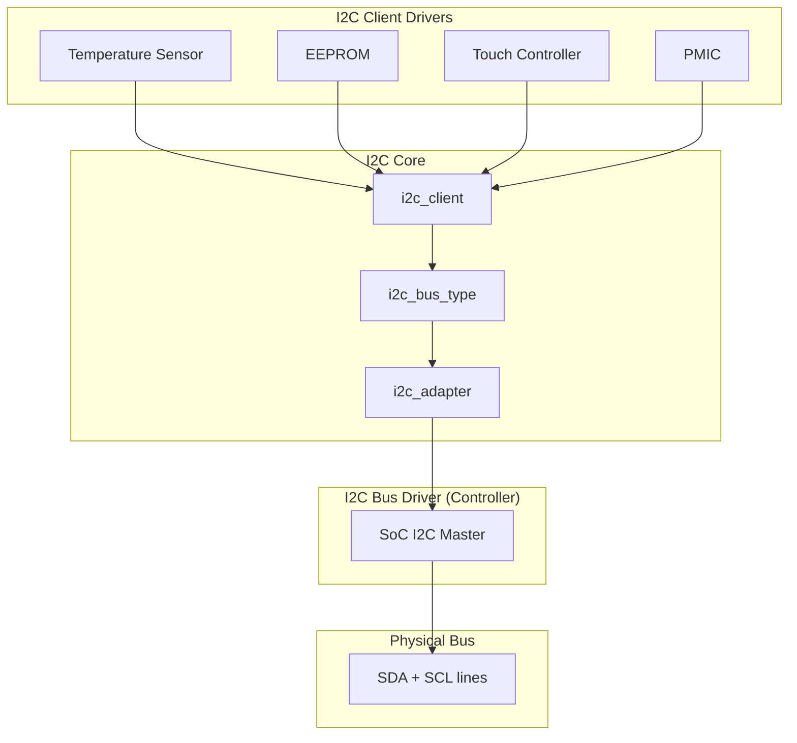
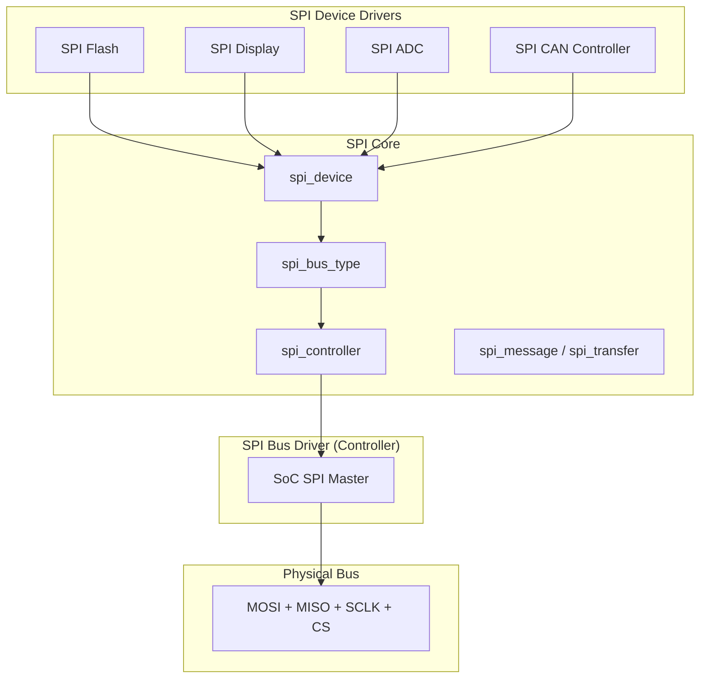

# I2C and SPI Drivers

## Introduction

I2C (Inter-Integrated Circuit) and SPI (Serial Peripheral Interface) are the two most common serial bus protocols used in embedded Linux systems. They connect the SoC to a vast ecosystem of peripheral chips: sensors (temperature, accelerometer, gyroscope), EEPROMs, real-time clocks, audio codecs, power management ICs (PMICs), display controllers, touch controllers, and GPIO expanders.

Both subsystems follow a similar pattern in Linux: a **bus driver** manages the controller hardware (the SoC's I2C/SPI master), while **client drivers** communicate with specific chips on the bus. The device tree (or ACPI) describes which chips are connected and at what address.

## I2C Subsystem

### I2C Architecture



### Core Data Structures

#### struct i2c_adapter

Represents an I2C bus controller (master):

```c
struct i2c_adapter {
    struct module *owner;
    unsigned int class;               /* classes of devices this adapter supports */
    const struct i2c_algorithm *algo; /* the algorithm to access the bus */
    void *algo_data;
    
    struct rt_mutex bus_lock;
    int timeout;                      /* in jiffies */
    int retries;
    struct device dev;                /* the adapter device */
    
    char name[48];
    struct completion dev_released;
    
    struct mutex userspace_clients_lock;
    struct list_head userspace_clients;
    
    struct i2c_bus_recovery_info *bus_recovery_info;
    const struct i2c_adapter_quirks *quirks;
};
```

#### struct i2c_algorithm

The operations an I2C controller implements:

```c
struct i2c_algorithm {
    int (*master_xfer)(struct i2c_adapter *adap, struct i2c_msg *msgs, int num);
    int (*smbus_xfer)(struct i2c_adapter *adap, u16 addr, unsigned short flags,
                      char read_write, u8 command, int size,
                      union i2c_smbus_data *data);
    u32 (*functionality)(struct i2c_adapter *adap);
};
```

#### struct i2c_client

Represents a device on the I2C bus:

```c
struct i2c_client {
    unsigned short flags;         /* I2C_CLIENT_TEN for 10-bit addressing */
    unsigned short addr;          /* chip address (7-bit or 10-bit) */
    char name[I2C_NAME_SIZE];
    struct i2c_adapter *adapter;  /* the bus this client is on */
    struct i2c_driver *driver;
    struct device dev;            /* device model integration */
    int irq;                      /* IRQ assigned to this client */
    struct list_head detected;
};
```

#### struct i2c_driver

The driver for an I2C chip:

```c
struct i2c_driver {
    unsigned int class;
    
    int (*probe)(struct i2c_client *client, const struct i2c_device_id *id);
    int (*remove)(struct i2c_client *client);
    
    void (*shutdown)(struct i2c_client *client);
    int (*suspend)(struct i2c_client *client, pm_message_t mesg);
    int (*resume)(struct i2c_client *client);
    
    struct device_driver driver;
    const struct i2c_device_id *id_table;
    int (*detect)(struct i2c_client *client, struct i2c_board_info *info);
    const unsigned short *address_list;
    struct list_head clients;
};
```

#### struct i2c_msg

An I2C message (one transaction):

```c
struct i2c_msg {
    __u16 addr;     /* slave address */
    __u16 flags;    /* I2C_M_RD, I2C_M_TEN, I2C_M_RECV_LEN, etc. */
    __u16 len;      /* msg length */
    __u8 *buf;      /* pointer to msg data */
};

#define I2C_M_RD        0x0001  /* read data, from slave to master */
#define I2C_M_TEN       0x0010  /* ten bit chip address */
#define I2C_M_DMA_SAFE  0x0200  /* buffer is DMA safe */
#define I2C_M_RECV_LEN  0x0400  /* length will be first received byte */
#define I2C_M_NO_RD_ACK 0x0800  /* skip ACK on reads */
#define I2C_M_IGNORE_NAK 0x1000 /* treat NAK as ACK */
```

### Writing an I2C Client Driver

```c
#include <linux/module.h>
#include <linux/i2c.h>
#include <linux/of.h>
#include <linux/regmap.h>

struct my_sensor {
    struct i2c_client *client;
    struct regmap *regmap;
    struct mutex lock;
};

/* Register map */
#define MY_SENSOR_REG_TEMP     0x00
#define MY_SENSOR_REG_CONFIG   0x01
#define MY_SENSOR_REG_ID       0x0D

static const struct regmap_config my_sensor_regmap = {
    .reg_bits = 8,
    .val_bits = 8,
    .max_register = 0x0F,
};

static int my_sensor_read_temp(struct my_sensor *sensor, int *temp_milli)
{
    unsigned int val;
    int ret;
    
    mutex_lock(&sensor->lock);
    ret = regmap_read(sensor->regmap, MY_SENSOR_REG_TEMP, &val);
    mutex_unlock(&sensor->lock);
    
    if (ret)
        return ret;
    
    /* Convert raw value to millidegrees Celsius */
    *temp_milli = (int)(s8)val * 1000;
    return 0;
}

static int my_sensor_probe(struct i2c_client *client,
                            const struct i2c_device_id *id)
{
    struct my_sensor *sensor;
    unsigned int chip_id;
    int ret;
    
    sensor = devm_kzalloc(&client->dev, sizeof(*sensor), GFP_KERNEL);
    if (!sensor)
        return -ENOMEM;
    
    sensor->client = client;
    mutex_init(&sensor->lock);
    
    /* Initialize regmap for register access */
    sensor->regmap = devm_regmap_init_i2c(client, &my_sensor_regmap);
    if (IS_ERR(sensor->regmap))
        return dev_err_probe(&client->dev, PTR_ERR(sensor->regmap),
                             "failed to init regmap\n");
    
    /* Read chip ID to verify */
    ret = regmap_read(sensor->regmap, MY_SENSOR_REG_ID, &chip_id);
    if (ret) {
        dev_err(&client->dev, "failed to read chip ID\n");
        return ret;
    }
    dev_info(&client->dev, "chip ID: 0x%02x\n", chip_id);
    
    /* Configure sensor */
    ret = regmap_write(sensor->regmap, MY_SENSOR_REG_CONFIG, 0x03);
    if (ret)
        return ret;
    
    i2c_set_clientdata(client, sensor);
    
    /* Read temperature once as test */
    int temp;
    ret = my_sensor_read_temp(sensor, &temp);
    if (ret == 0)
        dev_info(&client->dev, "temperature: %d mC\n", temp);
    
    return 0;
}

static void my_sensor_remove(struct i2c_client *client)
{
    /* Cleanup if needed — devm handles most resources */
}

/* Device tree match table */
static const struct of_device_id my_sensor_of_match[] = {
    { .compatible = "vendor,my-sensor" },
    { /* sentinel */ }
};
MODULE_DEVICE_TABLE(of, my_sensor_of_match);

/* I2C device ID table (for non-DT matching) */
static const struct i2c_device_id my_sensor_id[] = {
    { "my-sensor", 0 },
    { /* sentinel */ }
};
MODULE_DEVICE_TABLE(i2c, my_sensor_id);

static struct i2c_driver my_sensor_driver = {
    .driver = {
        .name = "my-sensor",
        .of_match_table = my_sensor_of_match,
    },
    .probe = my_sensor_probe,
    .remove = my_sensor_remove,
    .id_table = my_sensor_id,
};
module_i2c_driver(my_sensor_driver);

MODULE_LICENSE("GPL");
MODULE_DESCRIPTION("My I2C temperature sensor driver");
```

### Device Tree for I2C Devices

```dts
&i2c0 {
    clock-frequency = <400000>;  /* 400 kHz Fast Mode */
    
    my_sensor@48 {
        compatible = "vendor,my-sensor";
        reg = <0x48>;             /* 7-bit I2C address */
        interrupt-parent = <&gpio0>;
        interrupts = <5 IRQ_TYPE_EDGE_FALLING>;
    };
    
    eeprom@50 {
        compatible = "atmel,24c256";
        reg = <0x50>;
        pagesize = <64>;
    };
    
    pmic@34 {
        compatible = "vendor,my-pmic";
        reg = <0x34>;
        regulators {
            vdd_core: dcdc1 {
                regulator-name = "vdd_core";
                regulator-min-microvolt = <800000>;
                regulator-max-microvolt = <1200000>;
            };
        };
    };
};
```

### I2C Transfer Functions

```c
/* Direct i2c_transfer for complex transactions */
int my_sensor_burst_read(struct i2c_client *client, u8 reg,
                          u8 *data, int len)
{
    struct i2c_msg msgs[2];
    
    /* Write register address */
    msgs[0].addr = client->addr;
    msgs[0].flags = 0;
    msgs[0].len = 1;
    msgs[0].buf = &reg;
    
    /* Read data */
    msgs[1].addr = client->addr;
    msgs[1].flags = I2C_M_RD;
    msgs[1].len = len;
    msgs[1].buf = data;
    
    return i2c_transfer(client->adapter, msgs, 2);
}

/* SMBus convenience functions */
int val = i2c_smbus_read_byte_data(client, 0x00);
i2c_smbus_write_byte_data(client, 0x01, 0x42);
int word = i2c_smbus_read_word_data(client, 0x02);
i2c_smbus_write_word_data(client, 0x03, 0x1234);
```

## SPI Subsystem

### SPI Architecture



### Core Data Structures

#### struct spi_controller

Represents an SPI bus master:

```c
struct spi_controller {
    struct device dev;
    struct list_head list;
    s16 bus_num;
    u16 num_chipselect;
    u16 dma_alignment;
    u16 mode_bits;         /* supported SPI modes */
    u32 bits_per_word_mask;
    u32 min_speed_hz;
    u32 max_speed_hz;
    u16 flags;
    
    /* Transfer operations */
    int (*transfer)(struct spi_device *spi, struct spi_message *mesg);
    int (*transfer_one_message)(struct spi_controller *ctlr,
                                 struct spi_message *mesg);
    int (*transfer_one)(struct spi_controller *ctlr, struct spi_device *spi,
                        struct spi_transfer *transfer);
    void (*set_cs)(struct spi_device *spi, bool enable);
    int (*setup)(struct spi_device *spi);
    
    /* DMA */
    bool (*can_dma)(struct spi_controller *ctlr, struct spi_device *spi,
                    struct spi_transfer *xfer);
    
    /* Statistics */
    struct spi_statistics __percpu *pcpu_statistics;
};
```

#### struct spi_device

Represents a chip on the SPI bus:

```c
struct spi_device {
    struct device dev;
    struct spi_controller *controller;
    struct spi_controller *master;  /* deprecated alias */
    u32 max_speed_hz;
    u8 chip_select;
    u8 bits_per_word;
    u16 mode;
    int irq;
    void *controller_state;
    void *controller_data;
    char modalias[SPI_NAME_SIZE];
    char *driver_override;
    int cs_gpio;
    struct gpio_desc *cs_gpiod;
};
```

#### SPI Modes

```c
#define SPI_CPHA    0x01          /* clock phase */
#define SPI_CPOL    0x02          /* clock polarity */
#define SPI_MODE_0  (0|0)         /* CPOL=0, CPHA=0 */
#define SPI_MODE_1  (0|SPI_CPHA)  /* CPOL=0, CPHA=1 */
#define SPI_MODE_2  (SPI_CPOL|0)  /* CPOL=1, CPHA=0 */
#define SPI_MODE_3  (SPI_CPOL|SPI_CPHA)  /* CPOL=1, CPHA=1 */
#define SPI_CS_HIGH 0x04          /* chipselect active high? */
#define SPI_LSB_FIRST   0x08      /* per-word bits-on-wire */
#define SPI_3WIRE   0x10          /* SI/SO signals shared */
#define SPI_LOOP    0x20          /* loopback mode */
#define SPI_NO_CS   0x40          /* 1 dev/bus, no chipselect */
#define SPI_READY   0x80          /* pull MISO low for delay */
#define SPI_TX_DUAL 0x100         /* transmit with 2 wires */
#define SPI_TX_QUAD 0x200         /* transmit with 4 wires */
#define SPI_RX_DUAL 0x400         /* receive with 2 wires */
#define SPI_RX_QUAD 0x800         /* receive with 4 wires */
```

#### struct spi_transfer and spi_message

```c
struct spi_transfer {
    const void *tx_buf;
    void *rx_buf;
    unsigned len;
    
    dma_addr_t tx_dma;
    dma_addr_t rx_dma;
    struct sg_table tx_sg;
    struct sg_table rx_sg;
    
    unsigned cs_change:1;
    unsigned tx_nbits:3;
    unsigned rx_nbits:3;
    unsigned word_delay_usecs:5;
    unsigned cs_change_delay_unit:2;
    unsigned delay_value:16;
    unsigned cs_change_delay_value:16;
    unsigned speed_hz:17;
    unsigned dummy_data:1;
    
    struct list_head transfer_list;
};

struct spi_message {
    struct list_head transfers;
    struct spi_device *spi;
    unsigned is_dma_mapped:1;
    unsigned short frame_length;
    unsigned short actual_length;
    int status;
    
    struct list_head queue;
    void *context;
    
    spi_complete_t complete;
    void *partial;
};
```

### Writing an SPI Device Driver

```c
#include <linux/module.h>
#include <linux/spi/spi.h>
#include <linux/of.h>

struct my_spi_dev {
    struct spi_device *spi;
    struct mutex lock;
    u8 tx_buf[64] ____cacheline_aligned;
    u8 rx_buf[64] ____cacheline_aligned;
};

/* Simple register read via SPI */
static int my_spi_read_reg(struct my_spi_dev *dev, u8 reg, u8 *val)
{
    u8 tx[2] = { reg | 0x80, 0x00 };  /* set read bit */
    u8 rx[2];
    int ret;
    
    struct spi_transfer xfer = {
        .tx_buf = tx,
        .rx_buf = rx,
        .len = 2,
    };
    struct spi_message msg;
    
    spi_message_init(&msg);
    spi_message_add_tail(&xfer, &msg);
    
    ret = spi_sync(dev->spi, &msg);
    if (ret)
        return ret;
    
    *val = rx[1];
    return 0;
}

/* Register write */
static int my_spi_write_reg(struct my_spi_dev *dev, u8 reg, u8 val)
{
    u8 tx[2] = { reg & 0x7F, val };
    
    struct spi_transfer xfer = {
        .tx_buf = tx,
        .len = 2,
    };
    struct spi_message msg;
    
    spi_message_init(&msg);
    spi_message_add_tail(&xfer, &msg);
    
    return spi_sync(dev->spi, &msg);
}

/* Bulk read using spi_write_then_read */
static int my_spi_bulk_read(struct my_spi_dev *dev, u8 reg,
                             u8 *data, size_t len)
{
    u8 cmd = reg | 0x80;  /* read bit */
    return spi_write_then_read(dev->spi, &cmd, 1, data, len);
}

static int my_spi_probe(struct spi_device *spi)
{
    struct my_spi_dev *dev;
    u8 chip_id;
    int ret;
    
    /* Verify SPI mode and bits per word */
    if (spi->mode != SPI_MODE_0) {
        dev_err(&spi->dev, "requires SPI mode 0\n");
        return -EINVAL;
    }
    
    dev = devm_kzalloc(&spi->dev, sizeof(*dev), GFP_KERNEL);
    if (!dev)
        return -ENOMEM;
    
    dev->spi = spi;
    mutex_init(&dev->lock);
    spi_set_drvdata(spi, dev);
    
    /* Max speed can be overridden per-device */
    spi->max_speed_hz = min(spi->max_speed_hz, 10000000u);  /* 10 MHz max */
    spi->bits_per_word = 8;
    ret = spi_setup(spi);
    if (ret)
        return ret;
    
    /* Read chip ID */
    ret = my_spi_read_reg(dev, 0x00, &chip_id);
    if (ret) {
        dev_err(&spi->dev, "failed to read chip ID\n");
        return ret;
    }
    dev_info(&spi->dev, "chip ID: 0x%02x\n", chip_id);
    
    return 0;
}

static void my_spi_remove(struct spi_device *spi)
{
    /* devm handles cleanup */
}

static const struct of_device_id my_spi_of_match[] = {
    { .compatible = "vendor,my-spi-device" },
    { /* sentinel */ }
};
MODULE_DEVICE_TABLE(of, my_spi_of_match);

static const struct spi_device_id my_spi_id[] = {
    { "my-spi-device", 0 },
    { /* sentinel */ }
};
MODULE_DEVICE_TABLE(spi, my_spi_id);

static struct spi_driver my_spi_driver = {
    .driver = {
        .name = "my-spi-device",
        .of_match_table = my_spi_of_match,
    },
    .probe = my_spi_probe,
    .remove = my_spi_remove,
    .id_table = my_spi_id,
};
module_spi_driver(my_spi_driver);

MODULE_LICENSE("GPL");
MODULE_DESCRIPTION("My SPI device driver");
```

### Device Tree for SPI Devices

```dts
&spi0 {
    status = "okay";
    
    /* Memory-mapped SPI flash */
    flash@0 {
        compatible = "jedec,spi-nor";
        reg = <0>;                  /* chip select 0 */
        spi-max-frequency = <50000000>;
        m25p,fast-read;
        
        partitions {
            compatible = "fixed-partitions";
            #address-cells = <1>;
            #size-cells = <1>;
            
            partition@0 {
                label = "bootloader";
                reg = <0x0 0x100000>;
            };
            partition@100000 {
                label = "rootfs";
                reg = <0x100000 0xF00000>;
            };
        };
    };
    
    /* SPI display */
    display@1 {
        compatible = "vendor,my-display";
        reg = <1>;                  /* chip select 1 */
        spi-max-frequency = <10000000>;
        spi-cpol;
        spi-cpha;
        dc-gpios = <&gpio0 12 GPIO_ACTIVE_HIGH>;
        reset-gpios = <&gpio0 13 GPIO_ACTIVE_LOW>;
    };
    
    /* SPI ADC */
    adc@2 {
        compatible = "vendor,my-adc";
        reg = <2>;
        spi-max-frequency = <1000000>;
        spi-rx-bits-per-word = <16>;
    };
};
```

### SPI vs I2C Comparison

| Feature | I2C | SPI |
|---------|-----|-----|
| Wires | 2 (SDA + SCLK) | 4+ (MOSI + MISO + SCLK + CS) |
| Speed | 100/400/1000/3400 kHz | Up to 100+ MHz |
| Addressing | 7/10-bit address on bus | Chip select per device |
| Duplex | Half-duplex | Full-duplex |
| Multi-master | Supported | Not standard |
| Complexity | Higher (protocol overhead) | Lower (simple shift register) |
| Hot-plug | Possible (with care) | Difficult |
| Typical use | Sensors, EEPROMs, PMICs | Flash, displays, ADCs, CAN |

### I2C/SPI Debugging

```bash
# List I2C adapters
i2cdetect -l
# i2c-0   smbus    SMBus I801 adapter at efa0      SMBus adapter
# i2c-1   i2c      Synopsys DesignWare I2C adapter  I2C adapter

# Scan for devices on bus 0
sudo i2cdetect -y 0
#      0  1  2  3  4  5  6  7  8  9  a  b  c  d  e  f
# 00:          -- -- -- -- -- -- -- -- -- -- -- -- -- --
# 10: -- -- -- -- -- -- -- -- -- -- -- -- -- -- -- --
# 20: -- -- -- -- -- -- -- -- -- -- -- -- -- -- -- --
# 30: -- -- -- -- -- -- -- -- 38 -- -- -- -- -- -- --
# 40: -- -- -- -- -- -- -- -- 48 -- -- -- -- -- -- --
# 50: 50 -- -- -- -- -- -- -- -- -- -- -- -- -- -- --

# Read byte from device
sudo i2cget -y 0 0x48 0x00
# 0x42

# Write byte
sudo i2cset -y 0 0x48 0x01 0x03

# Dump all registers
sudo i2cdump -y 0 0x48

# List SPI devices
ls /sys/bus/spi/devices/
# spi0.0  spi0.1  spi0.2

# View SPI device details
cat /sys/bus/spi/devices/spi0.0/modalias
# spi:jedec,spi-nor

# SPI speed
cat /sys/bus/spi/devices/spi0.0/of_node/spi-max-frequency
```

## References

- [GNU Project Documentation](https://www.gnu.org/doc/doc.html)
- [GNU Manuals](https://www.gnu.org/manual/manual.html)
- [Free Software Directory](https://directory.fsf.org/wiki/Main_Page)
- [Planet GNU](https://planet.gnu.org/)
- [Free Software Books](https://www.gnu.org/doc/other-free-books.html)

- [Kernel I2C Documentation](https://docs.kernel.org/driver-api/i2c/)
- [Kernel SPI Documentation](https://docs.kernel.org/driver-api/spi.html)
- [I2C specification (NXP)](https://www.nxp.com/docs/en/user-guide/UM10204.pdf)
- [SPI specification (Motorola)](https://www.nxp.com/docs/en/application-note/AN991.pdf)
- [LWN: I2C and SPI device model](https://lwn.net/Articles/315295/)
- [i2c-tools repository](https://git.kernel.org/pub/scm/utils/i2c-tools/i2c-tools.git)

## Related Topics

- [Platform Drivers](./platform-drivers.md) — I2C/SPI controllers are platform drivers
- [GPIO](./gpio.md) — GPIO expanders on I2C/SPI
- [DMA](./dma.md) — DMA for high-speed SPI transfers
- [Device Tree](../devicetree/index.md) — I2C/SPI device bindings
- [Regmap API](./regmap.md) — Unified register access abstraction
