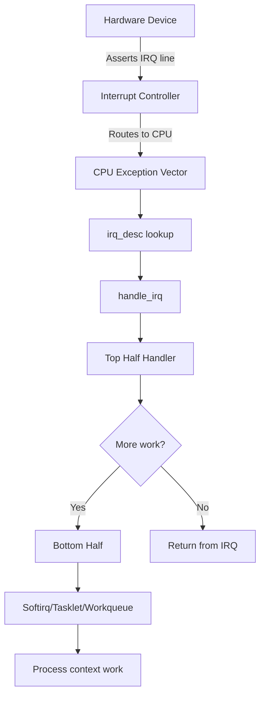

# Interrupt Handling in Drivers

## Introduction

Interrupts are the primary mechanism by which hardware devices notify the CPU that something requires attention. Rather than having the CPU poll devices continuously (wasting cycles), devices assert an interrupt request (IRQ) line, causing the CPU to suspend its current work and execute an interrupt handler — a small, fast function that services the device.

In Linux, interrupt handling is split into two halves: the **top half** (hardirq handler) runs immediately at interrupt priority and must be fast and non-blocking; the **bottom half** (softirq, tasklet, or workqueue) handles the bulk of the work at a more relaxed priority. This split is essential because interrupt handlers run with interrupts disabled (on that CPU) and cannot sleep, block, or call most kernel APIs.

## Interrupt Architecture



## Core Data Structures

### irq_desc

Each interrupt line has an `irq_desc` structure:

```c
struct irq_desc {
    struct irq_common_data irq_common_data;
    struct irq_data irq_data;
    unsigned int __percpu *kstat_irqs;  /* per-CPU IRQ stats */
    irq_flow_handler_t handle_irq;      /* flow handler (level/edge) */
    struct irqaction *action;           /* handler chain */
    unsigned int status_use_accessors;
    unsigned int depth;                 /* nested disable count */
    unsigned int irq_count;             /* for detecting stuck IRQs */
    const char *name;
    raw_spinlock_t lock;
    struct cpumask *percpu_enabled;
    /* ... */
};
```

### struct irqaction

Describes a registered interrupt handler:

```c
struct irqaction {
    irq_handler_t handler;      /* the handler function */
    void *dev_id;               /* cookie passed to handler */
    void __percpu *percpu_dev_id;
    struct irqaction *next;     /* next handler for shared IRQs */
    irq_handler_t thread_fn;    /* threaded handler */
    struct task_struct *thread;  /* thread for threaded IRQ */
    unsigned int irq;           /* IRQ number */
    unsigned int flags;         /* IRQF_SHARED, etc. */
    unsigned long thread_flags;
    unsigned long thread_mask;
    const char *name;           /* /proc/interrupts name */
    struct proc_dir_entry *dir;
};
```

## Registering Interrupt Handlers

### request_irq / devm_request_irq

```c
#include <linux/interrupt.h>

/* Basic IRQ registration */
int request_irq(unsigned int irq, irq_handler_t handler,
                unsigned long flags, const char *name, void *dev);

/* Device-managed version (auto-freed on driver detach) */
int devm_request_irq(struct device *dev, unsigned int irq,
                      irq_handler_t handler, unsigned long flags,
                      const char *name, void *dev_id);

/* Free an IRQ */
void free_irq(unsigned int irq, void *dev_id);
```

### IRQ Flags

```c
#define IRQF_SHARED         0x00000080  /* allow sharing IRQ line */
#define IRQF_PROBE_SHARED   0x00000100  /* handler can be probed */
#define IRQF_TIMER          0x00000200  /* timer interrupt */
#define IRQF_PERCPU         0x00000400  /* per-CPU interrupt */
#define IRQF_NOBALANCING    0x00000800  /* no IRQ balancing */
#define IRQF_IRQPOLL        0x00001000  /* used for polling */
#define IRQF_ONESHOT        0x00002000  /* thread runs with IRQ masked */
#define IRQF_NO_SUSPEND     0x00004000  /* don't suspend this IRQ */
#define IRQF_FORCE_RESUME   0x00008000  /* force resume */
#define IRQF_NO_THREAD      0x00010000  /* don't thread this IRQ */
#define IRQF_EARLY_RESUME   0x00020000  /* resume early during syscore */
#define IRQF_COND_SUSPEND   0x00040000  /* conditional suspend */
```

### Top Half Handler

The top half handler must be fast, non-blocking, and return quickly:

```c
/* Return values */
#define IRQ_NONE        (0)     /* not our interrupt */
#define IRQ_HANDLED     (1)     /* we handled it */
#define IRQ_WAKE_THREAD (2)     /* wake the handler thread */

static irqreturn_t my_interrupt(int irq, void *dev_id)
{
    struct my_dev *dev = dev_id;
    u32 status;
    
    /* Read interrupt status register */
    status = readl(dev->regs + IRQ_STATUS_REG);
    if (!status)
        return IRQ_NONE;  /* not our interrupt (shared IRQ) */
    
    /* Acknowledge interrupt */
    writel(status, dev->regs + IRQ_CLEAR_REG);
    
    /* Minimal work: read data, schedule bottom half */
    if (status & IRQ_RX_COMPLETE) {
        dev->rx_pending = 1;
        tasklet_schedule(&dev->rx_tasklet);
    }
    
    if (status & IRQ_TX_COMPLETE) {
        dev->tx_pending = 1;
        tasklet_schedule(&dev->tx_tasklet);
    }
    
    if (status & IRQ_ERROR)
        dev->error_count++;
    
    return IRQ_HANDLED;
}

/* Probe function: request the IRQ */
static int my_probe(struct platform_device *pdev)
{
    struct my_dev *dev;
    int irq, ret;
    
    irq = platform_get_irq(pdev, 0);
    if (irq < 0)
        return irq;
    
    /* Request IRQ with device-managed cleanup */
    ret = devm_request_irq(&pdev->dev, irq, my_interrupt,
                            IRQF_SHARED | IRQF_ONESHOT,
                            dev_name(&pdev->dev), dev);
    if (ret)
        return dev_err_probe(&pdev->dev, ret, "failed to request IRQ %d\n", irq);
    
    return 0;
}
```

## Shared Interrupts

Multiple devices can share a single IRQ line. Each handler must check whether its device triggered the interrupt:

```c
/* Device A handler */
static irqreturn_t dev_a_handler(int irq, void *dev_id)
{
    struct dev_a *a = dev_id;
    u32 status = readl(a->regs + STATUS);
    
    if (!(status & DEV_A_IRQ_BIT))
        return IRQ_NONE;  /* not ours */
    
    writel(DEV_A_IRQ_BIT, a->regs + CLEAR);
    /* handle ... */
    return IRQ_HANDLED;
}

/* Device B handler (same IRQ) */
static irqreturn_t dev_b_handler(int irq, void *dev_id)
{
    struct dev_b *b = dev_id;
    u32 status = readl(b->regs + STATUS);
    
    if (!(status & DEV_B_IRQ_BIT))
        return IRQ_NONE;
    
    writel(DEV_B_IRQ_BIT, b->regs + CLEAR);
    /* handle ... */
    return IRQ_HANDLED;
}

/* Both register with IRQF_SHARED and different dev_id */
devm_request_irq(dev, irq, dev_a_handler, IRQF_SHARED, "dev-a", a);
devm_request_irq(dev, irq, dev_b_handler, IRQF_SHARED, "dev-b", b);
```

## Threaded IRQs

Threaded IRQs run the handler in a kernel thread, allowing sleeping operations:

```c
/*
 * Primary handler (hardirq context): runs with IRQ disabled
 * Must return IRQ_WAKE_THREAD to wake the thread, or IRQ_HANDLED
 */
static irqreturn_t my_hardirq_handler(int irq, void *dev_id)
{
    struct my_dev *dev = dev_id;
    u32 status = readl(dev->regs + STATUS);
    
    if (!(status & IRQ_PENDING))
        return IRQ_NONE;
    
    /* Disable this interrupt (ONESHOT does this automatically) */
    writel(IRQ_PENDING, dev->regs + CLEAR);
    
    /* Schedule thread handler */
    return IRQ_WAKE_THREAD;
}

/*
 * Thread handler (process context): can sleep, use mutexes, etc.
 */
static irqreturn_t my_thread_handler(int irq, void *dev_id)
{
    struct my_dev *dev = dev_id;
    
    /* Safe to sleep here */
    mutex_lock(&dev->lock);
    
    /* Process data, talk to I2C devices, etc. */
    u8 data[64];
    i2c_master_recv(dev->i2c_client, data, sizeof(data));
    
    mutex_unlock(&dev->lock);
    
    return IRQ_HANDLED;
}

/* Register threaded IRQ */
ret = devm_request_threaded_irq(&pdev->dev, irq,
                                  my_hardirq_handler,   /* top half (optional) */
                                  my_thread_handler,     /* bottom half (thread) */
                                  IRQF_ONESHOT,
                                  "my-device", dev);
```

### IRQF_ONESHOT

With `IRQF_ONESHOT`, the interrupt line stays masked until the thread handler completes. This prevents the interrupt from re-firing before the thread has finished processing:

```c
/* With IRQF_ONESHOT, primary handler can be NULL */
ret = devm_request_threaded_irq(&pdev->dev, irq,
                                  NULL,                  /* no hardirq handler */
                                  my_thread_handler,     /* thread only */
                                  IRQF_ONESHOT | IRQF_TRIGGER_FALLING,
                                  "my-device", dev);
```

## Softirqs and Tasklets

### Softirqs

Softirqs are the lowest-level bottom half mechanism. They run in interrupt context (cannot sleep) but with interrupts enabled:

```c
/* Predefined softirq vectors */
enum {
    HI_SOFTIRQ = 0,     /* high priority tasklets */
    TIMER_SOFTIRQ,       /* timer subsystem */
    NET_TX_SOFTIRQ,      /* network transmit */
    NET_RX_SOFTIRQ,      /* network receive */
    BLOCK_SOFTIRQ,       /* block device */
    IRQ_POLL_SOFTIRQ,    /* IRQ poll */
    TASKLET_SOFTIRQ,     /* normal tasklets */
    SCHED_SOFTIRQ,       /* scheduler */
    HRTIMER_SOFTIRQ,     /* high-resolution timers */
    RCU_SOFTIRQ,         /* read-copy-update */
};

/* Raising a softirq */
void raise_softirq(int nr);
void raise_softirq_irqoff(int nr);
```

### Tasklets

Tasklets are built on top of softirqs and provide a convenient API:

```c
#include <linux/interrupt.h>

struct my_dev {
    struct tasklet_struct rx_tasklet;
    struct tasklet_struct tx_tasklet;
    /* ... */
};

static void my_rx_tasklet_func(struct tasklet_struct *t)
{
    struct my_dev *dev = from_tasklet(dev, t, rx_tasklet);
    
    /* Process received data — runs in softirq context, cannot sleep */
    while (my_has_rx_data(dev)) {
        struct sk_buff *skb = my_read_packet(dev);
        if (skb)
            netif_rx(skb);
    }
}

static void my_tx_tasklet_func(struct tasklet_struct *t)
{
    struct my_dev *dev = from_tasklet(dev, t, tx_tasklet);
    
    /* Clean up completed TX descriptors */
    my_clean_tx_ring(dev);
    netif_wake_queue(dev->netdev);
}

/* In probe */
tasklet_setup(&dev->rx_tasklet, my_rx_tasklet_func);
tasklet_setup(&dev->tx_tasklet, my_tx_tasklet_func);

/* In interrupt handler */
static irqreturn_t my_irq(int irq, void *data)
{
    struct my_dev *dev = data;
    u32 status = readl(dev->regs + IRQ_STATUS);
    
    if (status & IRQ_RX) {
        writel(IRQ_RX, dev->regs + IRQ_CLEAR);
        tasklet_schedule(&dev->rx_tasklet);
    }
    if (status & IRQ_TX) {
        writel(IRQ_TX, dev->regs + IRQ_CLEAR);
        tasklet_schedule(&dev->tx_tasklet);
    }
    
    return IRQ_HANDLED;
}

/* Cleanup */
tasklet_kill(&dev->rx_tasklet);
tasklet_kill(&dev->tx_tasklet);
```

## Workqueues

Workqueues run in process context and can sleep:

```c
#include <linux/workqueue.h>

struct my_dev {
    struct work_struct work;
    struct delayed_work delayed_work;
};

static void my_work_func(struct work_struct *work)
{
    struct my_dev *dev = container_of(work, struct my_dev, work);
    
    /* Can sleep, use mutexes, allocate memory, etc. */
    mutex_lock(&dev->lock);
    my_process_events(dev);
    mutex_unlock(&dev->lock);
}

static void my_delayed_work_func(struct work_struct *work)
{
    struct my_dev *dev = container_of(work, struct my_dev, delayed_work.work);
    /* Runs after delay — can sleep */
}

/* Initialize */
INIT_WORK(&dev->work, my_work_func);
INIT_DELAYED_WORK(&dev->delayed_work, my_delayed_work_func);

/* In interrupt handler */
schedule_work(&dev->work);
/* or with delay */
schedule_delayed_work(&dev->delayed_work, msecs_to_jiffies(100));

/* Cancel work */
cancel_work_sync(&dev->work);
cancel_delayed_work_sync(&dev->delayed_work);
```

## IRQ Domains

IRQ domains map hardware IRQ numbers to Linux virtual IRQ numbers. This is essential for modern interrupt controllers (GIC, APIC, etc.):

```c
#include <linux/irqdomain.h>
#include <linux/of_irq.h>

/* Creating an IRQ domain (for interrupt controller drivers) */
struct irq_domain *domain;
domain = irq_domain_add_linear(node, nr_irqs, &my_irq_ops, NULL);
/* or */
domain = irq_domain_add_tree(node, &my_irq_ops, NULL);

/* Translating device tree interrupts to Linux IRQ */
struct of_phandle_args oirq;
int irq;

irq = of_irq_get(dev->of_node, 0);  /* get IRQ from DT */

/* Or manual translation */
of_irq_parse_one(dev->of_node, 0, &oirq);
irq = irq_create_of_mapping(&oirq);

/* For platform devices */
int irq = platform_get_irq(pdev, 0);  /* preferred method */
```

### IRQ Domain Operations

```c
static int my_irq_domain_map(struct irq_domain *d, unsigned int irq,
                              irq_hw_number_t hw)
{
    struct my_irq_chip *chip = d->host_data;
    
    irq_set_chip_data(irq, chip);
    irq_set_chip_and_handler(irq, &my_irq_chip, handle_level_irq);
    irq_set_status_flags(irq, IRQ_LEVEL);
    
    return 0;
}

static int my_irq_domain_xlate(struct irq_domain *d,
                                struct device_node *controller,
                                const u32 *intspec, unsigned int intsize,
                                unsigned long *out_hwirq,
                                unsigned int *out_type)
{
    *out_hwirq = intspec[0];
    *out_type = intspec[1] & IRQ_TYPE_SENSE_MASK;
    return 0;
}

static const struct irq_domain_ops my_irq_domain_ops = {
    .map = my_irq_domain_map,
    .xlate = my_irq_domain_xlate,
};
```

### Generic IRQ Chip (gpio_irq_chip)

```c
#include <linux/irq.h>

static struct irq_chip my_irq_chip = {
    .name = "my-irq",
    .irq_enable = my_irq_enable,
    .irq_disable = my_irq_disable,
    .irq_ack = my_irq_ack,
    .irq_mask = my_irq_mask,
    .irq_unmask = my_irq_unmask,
    .irq_set_type = my_irq_set_type,
    .irq_set_affinity = irq_chip_set_affinity_parent,
};
```

## Wake IRQs

Wake IRQs allow a device to wake the system from suspend:

```c
#include <linux/pm_wakeirq.h>

static int my_probe(struct platform_device *pdev)
{
    int irq = platform_get_irq(pdev, 0);
    int wake_irq;
    
    /* Get dedicated wake IRQ from DT */
    wake_irq = platform_get_irq_optional(pdev, 1);
    
    /* Register as wake IRQ source */
    dev_pm_set_wake_irq(&pdev->dev, irq);
    /* Or use a separate wake IRQ */
    /* device_init_wakeup(&pdev->dev, true); */
    /* dev_pm_set_dedicated_wake_irq(&pdev->dev, wake_irq); */
    
    return 0;
}
```

## IRQ Affinity

Control which CPU handles a particular IRQ:

```bash
# View current IRQ affinity
cat /proc/irq/42/smp_affinity
# 01

# Set IRQ 42 to CPU 2
echo 04 > /proc/irq/42/smp_affinity

# Use irqbalance daemon for automatic balancing
systemctl status irqbalance

# View IRQ distribution across CPUs
cat /proc/interrupts
#            CPU0       CPU1       CPU2       CPU3
#  17:      12345          0          0          0  GICv3  17 Level  eth0
#  23:          0      23456          0          0  GICv3  23 Level  mmc0
```

## Bottom Half Selection Guide

| Mechanism | Context | Can Sleep | Use Case |
|-----------|---------|-----------|----------|
| Hardirq (top half) | IRQ context | No | Minimal work, ack HW |
| Tasklet | Softirq context | No | Quick deferred work |
| Workqueue | Process context | Yes | Complex processing |
| Threaded IRQ | Kernel thread | Yes | IRQ handling with sleep |
| Softirq | Softirq context | No | High-frequency (networking) |
| Timer | Softirq context | No | Delayed work |
| Delayed workqueue | Process context | Yes | Delayed with sleep |

## Debugging Interrupts

```bash
# View all interrupt counts
cat /proc/interrupts
#            CPU0       CPU1
#   3:      10000          0  GICv3   3 Level  arch_timer
#  17:      12345          0  GICv3  17 Level  eth0
#  23:      23456          0  GICv3  23 Level  mmc0

# Per-CPU softirq stats
cat /proc/softirqs
#                     CPU0       CPU1
#          HI:       1000       2000
#       TIMER:      50000      51000
#      NET_TX:       1000        500
#      NET_RX:      20000      19000
#       BLOCK:      30000      29000
#     TASKLET:       5000       4000
#       SCHED:     100000     101000
#         RCU:      80000      81000

# IRQ statistics
cat /proc/stat | head -5
# intr 12345678 10000 0 0 ...

# View IRQ details
cat /proc/irq/17/spurious
# count 0
# unhandled 0
# last_unhandled 0

# Enable/disable IRQs
echo 42 > /proc/irq/42/smp_affinity

# Trace IRQ events
echo 1 > /sys/kernel/debug/tracing/events/irq/enable
cat /sys/kernel/debug/tracing/trace_pipe

# View IRQ thread status
ps -eo pid,comm | grep irq
#  123 irq/17-eth0
#  456 irq/23-mmc0
```

## References

- *Linux Device Drivers, 3rd Edition* — Chapter 10: Interrupt Handling
- [Kernel IRQ documentation](https://docs.kernel.org/core-api/genericirq.html)
- [Kernel IRQ domain documentation](https://docs.kernel.org/core-api/irq/irq-domain.html)
- [LWN: A guide to the kernel's IRQ domain API](https://lwn.net/Articles/420917/)
- [LWN: Threaded interrupt handlers](https://lwn.net/Articles/302043/)
- [Kernel generic IRQ documentation](https://docs.kernel.org/core-api/genericirq.html)

## Related Topics

- [GPIO](./gpio.md) — GPIO-based interrupts
- [Device Tree](../devicetree/index.md) — IRQ bindings in DT
- [Network Drivers](./net-drivers.md) — NAPI interrupt handling
- [Block Drivers](./block-drivers.md) — Completion interrupts
- [Power Management](../pm/index.md) — Wake IRQs, suspend/resume
- [DMA](./dma.md) — DMA completion interrupts
