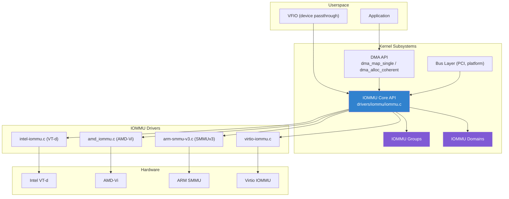
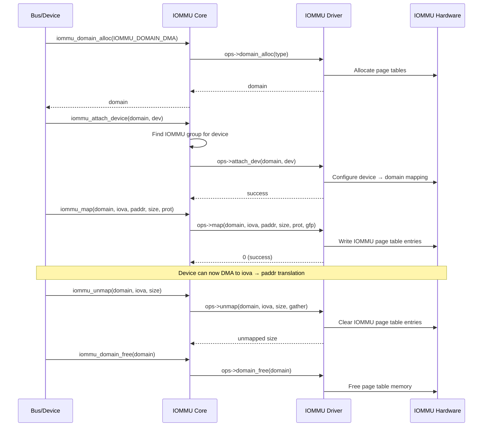
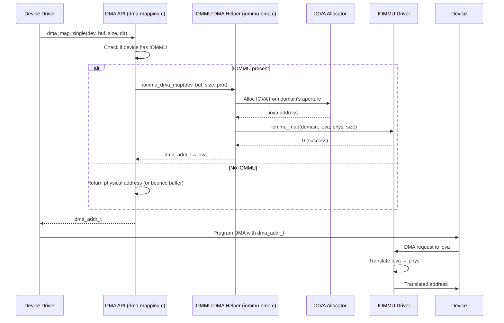
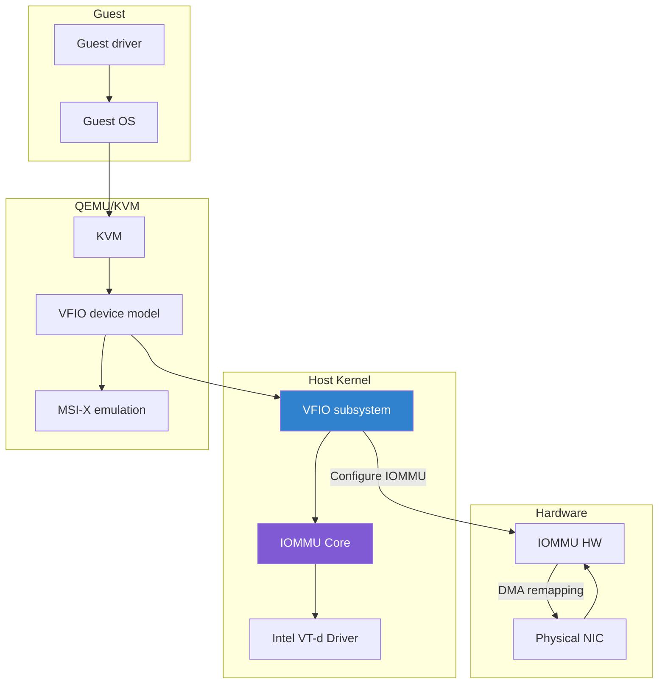
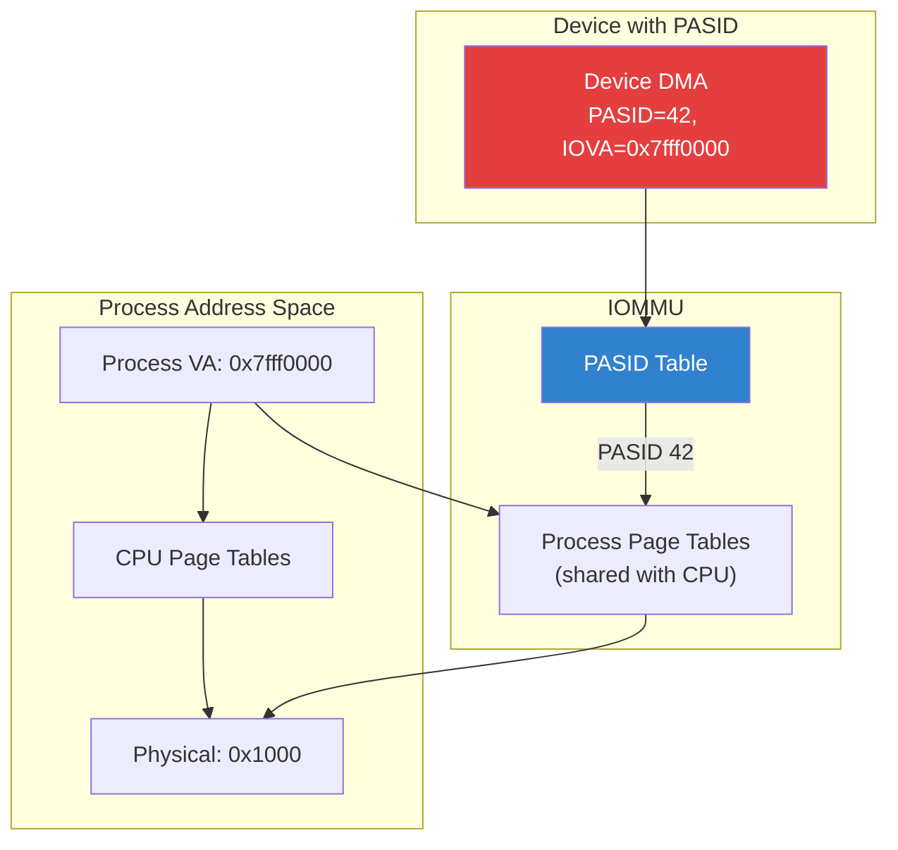
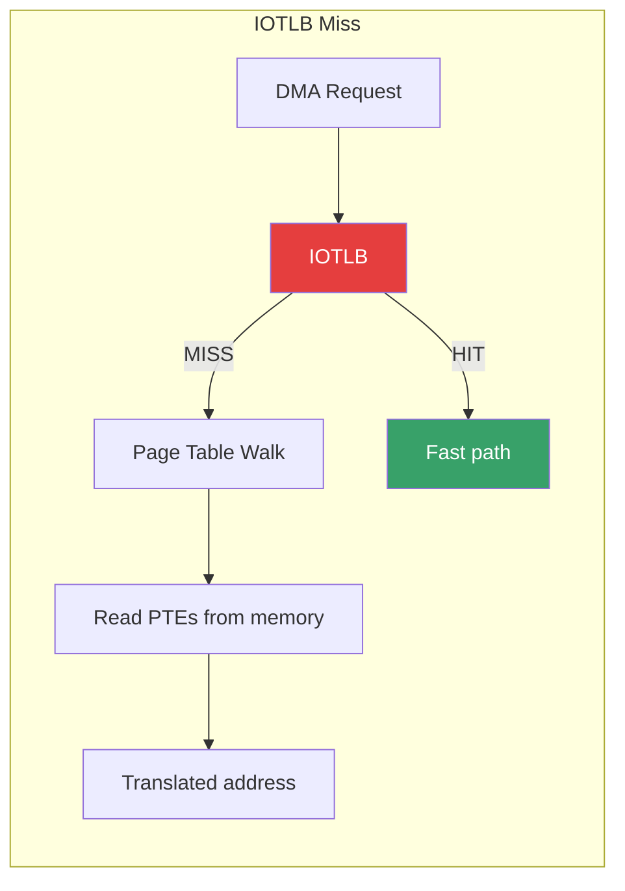

# IOMMU Subsystem (Drivers Perspective)

## Introduction

While the [IOMMU overview](./iommu.md) covers hardware architecture and DMA remapping concepts, this page focuses on the **kernel IOMMU subsystem from the driver developer's perspective** — how to write drivers that interact with the IOMMU API, how the IOMMU core translates DMA operations, and how to implement IOMMU driver backends.

The Linux IOMMU subsystem (`drivers/iommu/`) provides a unified abstraction over diverse hardware (Intel VT-d, AMD-Vi, ARM SMMU, etc.) through the `struct iommu_ops` interface. Device drivers interact with the IOMMU indirectly via the DMA API; IOMMU driver authors implement the `iommu_ops` callbacks.

## Architecture Overview



## Core Data Structures

### struct iommu_ops

The central abstraction that every IOMMU driver must implement:

```c
/* include/linux/iommu.h */
struct iommu_ops {
    /* Domain lifecycle */
    struct iommu_domain *(*domain_alloc)(unsigned type);
    void (*domain_free)(struct iommu_domain *domain);

    /* Domain configuration */
    int (*attach_dev)(struct iommu_domain *domain, struct device *dev);
    void (*detach_dev)(struct iommu_domain *domain, struct device *dev);
    int (*set_pgtable_quirks)(struct iommu_domain *domain,
                               unsigned long quirks);

    /* Address mapping */
    int (*map)(struct iommu_domain *domain, unsigned long iova,
               phys_addr_t paddr, size_t size, int prot, gfp_t gfp);
    size_t (*unmap)(struct iommu_domain *domain, unsigned long iova,
                    size_t size, struct iommu_iotlb_gather *gather);
    size_t (*map_pages)(struct iommu_domain *domain, unsigned long iova,
                        phys_addr_t paddr, size_t pgsize, size_t pgcount,
                        int prot, gfp_t gfp, size_t *mapped);
    void (*flush_iotlb_all)(struct iommu_domain *domain);
    void (*iotlb_range_add)(struct iommu_domain *domain,
                            unsigned long iova, size_t size);
    void (*iotlb_sync)(struct iommu_domain *domain,
                       struct iommu_iotlb_gather *gather);

    /* Address translation (for debugging / IOVA validation) */
    phys_addr_t (*iova_to_phys)(struct iommu_domain *domain,
                                dma_addr_t iova);

    /* Probe / topology */
    int (*probe_device)(struct device *dev);
    void (*release_device)(struct device *dev);
    void (*probe_finalize)(struct device *dev);
    struct iommu_group *(*device_group)(struct device *dev);
    int (*of_xlate)(struct device *dev, struct of_phandle_args *args);
    bool (*is_attach_deferred)(struct device *dev);

    /* Page request handling (SVA) */
    int (*page_response)(struct device *dev, struct iommu_fault_event *evt,
                         struct iommu_page_response *msg);
    int (*sva_bind_gpasid)(struct device *dev, struct mm_struct *mm,
                           ioasid_t pasid);
    void (*sva_unbind_gpasid)(struct device *dev, ioasid_t pasid);

    /* Feature flags */
    int (*def_domain_type)(struct device *dev);
    bool (*pgsize_bitmap)(struct iommu_domain *domain,
                          unsigned long *pgsize_bitmap);

    /* Module reference */
    struct module *owner;
};
```

### struct iommu_domain

Represents an IOMMU address domain — a set of page table mappings:

```c
struct iommu_domain {
    unsigned type;                  /* IOMMU_DOMAIN_BLOCKED, _IDENTITY, _UNMANAGED, _DMA, _SVA */
    const struct iommu_ops *ops;
    unsigned long pgsize_bitmap;    /* Supported page sizes */
    iova_t iova_aperture_start;     /* IOVA range start */
    iova_t iova_aperture_end;       /* IOVA range end */
    bool iova_aperture_valid;       /* Is IOVA range set? */

    struct iommu_domain_geometry geometry;  /* Address geometry */
    struct iommu_dirty_bitmap *dirty_bitmap;

    void *handler_token;
    spinlock_t va2pa_lock;          /* VA to PA lock (for non-strict mode) */
    struct mutex mutex;             /* Protects domain configuration */
};
```

**Domain types:**

| Type | Purpose |
|------|---------|
| `IOMMU_DOMAIN_BLOCKED` | All DMA blocked (default before attachment) |
| `IOMMU_DOMAIN_IDENTITY` | Passthrough — 1:1 address mapping |
| `IOMMU_DOMAIN_UNMANAGED` | Kernel-managed, used by VFIO |
| `IOMMU_DOMAIN_DMA` | DMA API backing — managed IOVA allocator |
| `IOMMU_DOMAIN_SVA` | Shared Virtual Addressing (PASID) |

### struct iommu_group

Groups of devices that share the same IOMMU isolation domain:

```c
struct iommu_group {
    struct kobject kobj;
    struct kobject *devices_kobj;
    struct list_head devices;
    struct mutex mutex;
    struct blocking_notifier_head notifier;
    void *iommu_data;
    void (*iommu_data_release)(void *iommu_data);
    char *name;
    int id;
    struct iommu_domain *default_domain;    /* Default domain for group */
    struct iommu_domain *blocking_domain;   /* Blocking domain */
    struct iommu_domain *domain;            /* Currently active domain */
    unsigned int users;                     /* VFIO users count */
};
```

### struct iommu_device

Represents a physical IOMMU hardware unit:

```c
struct iommu_device {
    struct list_head list;
    const struct iommu_ops *ops;
    struct fwnode_handle *fwnode;
    struct device *dev;
    u32 max_pasids;
};
```

### struct iommu_fault

Represents a DMA fault (for page request handling):

```c
struct iommu_fault {
    unsigned int type;      /* IOMMU_FAULT_DMA_UNRECOV, IOMMU_FAULT_PAGE_REQ */
    unsigned int flags;
    union {
        struct iommu_fault_unrecoverable unrecoverable;
        struct iommu_fault_page_request prm;
    };
};
```

## IOMMU Domain Lifecycle

### Creating and Configuring a Domain



### Code Example: Using IOMMU API from a Driver

```c
#include <linux/iommu.h>
#include <linux/pci.h>

static int my_driver_probe(struct pci_dev *pdev,
                            const struct pci_device_id *id)
{
    struct iommu_domain *domain;
    struct device *dev = &pdev->dev;
    phys_addr_t phys;
    dma_addr_t iova;
    int ret;

    /* Check if device has IOMMU */
    if (!iommu_present(dev->bus)) {
        dev_info(dev, "No IOMMU on this bus\n");
        /* Device uses physical addresses directly */
    }

    /* Create a domain (usually done by DMA API, but can be manual) */
    domain = iommu_domain_alloc(dev->bus);
    if (!domain)
        return -ENOMEM;

    /* Attach device to domain */
    ret = iommu_attach_device(domain, dev);
    if (ret) {
        dev_err(dev, "Failed to attach to IOMMU domain: %d\n", ret);
        goto free_domain;
    }

    /* Set address geometry (IOVA range) */
    iova = 0x10000000;  /* Start IOVA at 256MB */
    phys = virt_to_phys(my_buffer);
    size = 4096;

    /* Map IOVA → physical address */
    ret = iommu_map(domain, iova, phys, size,
                    IOMMU_READ | IOMMU_WRITE, GFP_KERNEL);
    if (ret) {
        dev_err(dev, "IOMMU map failed: %d\n", ret);
        goto detach;
    }

    /* Device can now DMA to iova address */
    writel(iova, dev->regs + DMA_ADDR_REG);

    /* ... use the mapping ... */

    /* Cleanup */
    iommu_unmap(domain, iova, size);
detach:
    iommu_detach_device(domain, dev);
free_domain:
    iommu_domain_free(domain);
    return ret;
}
```

## Implementing an IOMMU Driver

### Registration

An IOMMU driver registers with the core during probe:

```c
#include <linux/iommu.h>

static struct iommu_device my_iommu;

static int my_iommu_probe(struct platform_device *pdev)
{
    struct my_iommu_data *data;
    int ret;

    data = devm_kzalloc(&pdev->dev, sizeof(*data), GFP_KERNEL);
    if (!data)
        return -ENOMEM;

    /* Map IOMMU registers */
    data->base = devm_platform_ioremap_resource(pdev, 0);
    if (IS_ERR(data->base))
        return PTR_ERR(data->base);

    /* Parse DT / ACPI for device topology */
    ret = my_iommu_parse_dt(data, pdev->dev.of_node);
    if (ret)
        return ret;

    /* Initialize hardware */
    my_iommu_hw_init(data);

    /* Register with IOMMU core */
    ret = iommu_device_register(&my_iommu, &my_iommu_ops, &pdev->dev);
    if (ret)
        return ret;

    /* Set up sysfs */
    iommu_device_set_ops(&my_iommu, &my_iommu_ops);
    iommu_device_set_fwnode(&my_iommu, &pdev->dev.fwnode);

    platform_set_drvdata(pdev, data);
    return 0;
}
```

### Implementing iommu_ops

```c
static const struct iommu_ops my_iommu_ops = {
    .domain_alloc   = my_iommu_domain_alloc,
    .domain_free    = my_iommu_domain_free,
    .attach_dev     = my_iommu_attach_dev,
    .detach_dev     = my_iommu_detach_dev,
    .map            = my_iommu_map,
    .unmap          = my_iommu_unmap,
    .map_pages      = my_iommu_map_pages,
    .flush_iotlb_all = my_iommu_flush_iotlb_all,
    .iotlb_sync     = my_iommu_iotlb_sync,
    .iova_to_phys   = my_iommu_iova_to_phys,
    .probe_device   = my_iommu_probe_device,
    .release_device = my_iommu_release_device,
    .device_group   = my_iommu_device_group,
    .pgsize_bitmap  = my_iommu_pgsize_bitmap,
    .owner          = THIS_MODULE,
};
```

### Implementing domain_alloc

```c
static struct iommu_domain *my_iommu_domain_alloc(unsigned type)
{
    struct my_iommu_domain *dom;

    /* Only support certain domain types */
    if (type != IOMMU_DOMAIN_DMA &&
        type != IOMMU_DOMAIN_UNMANAGED &&
        type != IOMMU_DOMAIN_IDENTITY)
        return NULL;

    dom = kzalloc(sizeof(*dom), GFP_KERNEL);
    if (!dom)
        return NULL;

    dom->domain.type = type;
    dom->domain.ops = &my_iommu_ops;
    dom->domain.pgsize_bitmap = SZ_4K | SZ_64K | SZ_2M | SZ_1G;

    /* Allocate root page table */
    dom->pgtable = my_iommu_alloc_pgtable(dom);
    if (!dom->pgtable) {
        kfree(dom);
        return NULL;
    }

    return &dom->domain;
}
```

### Implementing map/unmap

```c
static int my_iommu_map(struct iommu_domain *domain, unsigned long iova,
                         phys_addr_t paddr, size_t size, int prot,
                         gfp_t gfp)
{
    struct my_iommu_domain *dom = to_my_domain(domain);
    struct my_iommu_pgtable *pgt = dom->pgtable;
    unsigned long flags;
    int ret;

    /* Validate alignment */
    if (!IS_ALIGNED(iova | paddr, size))
        return -EINVAL;

    spin_lock_irqsave(&pgt->lock, flags);
    ret = my_iommu_write_pte(pgt, iova, paddr, size, prot);
    spin_unlock_irqrestore(&pgt->lock, flags);

    return ret;
}

static size_t my_iommu_unmap(struct iommu_domain *domain,
                              unsigned long iova, size_t size,
                              struct iommu_iotlb_gather *gather)
{
    struct my_iommu_domain *dom = to_my_domain(domain);
    struct my_iommu_pgtable *pgt = dom->pgtable;
    unsigned long flags;

    spin_lock_irqsave(&pgt->lock, flags);
    my_iommu_clear_pte(pgt, iova, size);
    spin_unlock_irqrestore(&pgt->lock, flags);

    /* Add to gather for deferred TLB invalidation */
    if (gather)
        iommu_iotlb_gather_add_page(domain, gather, iova, size);

    return size;
}
```

### Implementing TLB Invalidation

```c
static void my_iommu_flush_iotlb_all(struct iommu_domain *domain)
{
    struct my_iommu_domain *dom = to_my_domain(domain);
    struct my_iommu_data *data = dom->iommu_data;

    /* Global TLB invalidation */
    writel(MY_IOMMU_CMD_INV_ALL, data->base + MY_IOMMU_CMD_REG);

    /* Wait for completion */
    my_iommu_wait_cmd(data);
}

static void my_iommu_iotlb_sync(struct iommu_domain *domain,
                                 struct iommu_iotlb_gather *gather)
{
    struct my_iommu_domain *dom = to_my_domain(domain);
    struct my_iommu_data *data = dom->iommu_data;

    if (!gather || !gather->queued)
        return;

    /* Range-based invalidation for better performance */
    my_iommu_invalidate_range(data, gather->start,
                              gather->end - gather->start);
}
```

## DMA API Integration

### How the DMA API Uses the IOMMU

The DMA API transparently calls into the IOMMU subsystem when an IOMMU is present:



### IOMMU DMA Helper Layer

The `iommu-dma.c` layer bridges the DMA API and IOMMU core:

```c
/* drivers/iommu/iommu-dma.c */

/* Map a page to an IOVA using the device's IOMMU domain */
dma_addr_t iommu_dma_map_page(struct device *dev, struct page *page,
                               unsigned long offset, size_t size,
                               enum dma_data_direction dir,
                               unsigned long attrs)
{
    struct iommu_domain *domain = iommu_get_dma_domain(dev);
    phys_addr_t phys = page_to_phys(page) + offset;
    dma_addr_t iova, dma_mask = dma_get_mask(dev);
    int prot = dma_info_to_prot(dir, dev_is_dma_coherent(dev));
    size_t iova_off = iova_offset(domain, phys);

    /* Allocate IOVA */
    iova = iommu_dma_alloc_iova(domain, size + iova_off, dma_mask, dev);
    if (!iova)
        return DMA_MAPPING_ERROR;

    /* Map IOVA → physical */
    if (iommu_map(domain, iova - iova_off, phys - iova_off,
                  size + iova_off, prot, GFP_ATOMIC)) {
        iommu_dma_free_iova(domain, iova, size);
        return DMA_MAPPING_ERROR;
    }

    return iova + iova_off;
}
```

## VFIO Integration

### Device Passthrough Architecture



### VFIO IOMMU Backend

```c
/* Simplified VFIO type1 IOMMU backend */

static int vfio_iommu_type1_map(struct vfio_iommu *iommu,
                                 struct vfio_iommu_type1_dma_map *arg)
{
    struct vfio_dma *dma;
    struct iommu_domain *domain = iommu->domain;
    unsigned long iova = arg->iova;
    size_t size = arg->size;
    int ret;

    /* Pin user pages */
    ret = vfio_pin_map_dma(iommu, arg);
    if (ret)
        return ret;

    /* Map each pinned page into IOMMU */
    for_each_sg(dma->sgt->sgl, sg, dma->sgt->nents, i) {
        phys_addr_t phys = sg_phys(sg);
        size_t len = sg->length;

        ret = iommu_map(domain, iova, phys, len,
                        dma->prot, GFP_KERNEL);
        if (ret)
            goto unmap;

        iova += len;
    }

    return 0;

unmap:
    /* Rollback on failure */
    vfio_unmap_unpin(iommu, dma, false);
    return ret;
}
```

## Shared Virtual Addressing (SVA)

### PASID-Based Address Translation

SVA allows devices to use the same virtual address space as the CPU process, using Process Address Space IDs (PASIDs):



### SVA Bind Example

```c
#include <linux/iommu.h>
#include <linux/mm.h>

/* Bind a process's address space to a device with PASID */
int my_driver_sva_bind(struct device *dev, struct mm_struct *mm)
{
    struct iommu_sva *handle;
    ioasid_t pasid;

    /* Request a PASID from the IOMMU */
    handle = iommu_sva_bind_device(dev, mm, &pasid);
    if (IS_ERR(handle))
        return PTR_ERR(handle);

    dev_info(dev, "SVA bound with PASID %d\n", pasid);

    /* Program the device to use this PASID for DMA */
    my_device_set_pasid(dev, pasid);

    return 0;
}

void my_driver_sva_unbind(struct device *dev, struct iommu_sva *handle)
{
    my_device_set_pasid(dev, 0);
    iommu_sva_unbind_device(handle);
}
```

## IOMMU Fault Handling

### Fault Types

```c
/* Unrecoverable faults */
struct iommu_fault_unrecoverable {
    __u32 reason;           /* Fault reason */
    __u32 flags;
    __u64 addr;             /* Faulting address */
    __u32 fetch_addr;       /* Instruction fetch address */
    __u32 pasid;            /* PASID (if applicable) */
    __u32 perm;             /* Requested permissions */
    __u32 grpid;            /* Page request group */
    __u32 padding;
};

/* Page request faults */
struct iommu_fault_page_request {
    __u32 flags;
    __u32 pasid;
    __u32 grpid;
    __u32 perm;
    __u64 addr;
    __u64 private_data;
};
```

### Registering a Fault Handler

```c
static int my_iommu_fault_handler(struct iommu_domain *domain,
                                   struct device *dev,
                                   unsigned long iova, int flags,
                                   void *token)
{
    struct my_driver_data *data = token;

    dev_err(data->dev, "IOMMU FAULT at IOVA 0x%lx, flags=0x%x\n",
            iova, flags);

    /* Handle fault: stop device, reset DMA, etc. */
    my_device_reset(data);

    return 0;  /* Return 0 to indicate handled */
}

/* Register during domain setup */
iommu_set_fault_handler(domain, my_iommu_fault_handler, my_data);
```

## Sysfs Interface

### IOMMU Group Entries

```bash
# List all IOMMU groups
ls /sys/kernel/iommu_groups/

# Show devices in a group
ls /sys/kernel/iommu_groups/0/devices/

# Check IOMMU type
cat /sys/class/iommu/dmar0/type
# Expected: "identity" or "dma"

# Show IOMMU capabilities
cat /sys/class/iommu/dmar0/address_width

# Check if IOMMU is in passthrough mode
dmesg | grep -i "iommu.*passthrough"

# Kernel command line options for IOMMU
# intel_iommu=on|off|igfx_off
# amd_iommu=on|off|fullflush
# iommu.passthrough=1
# iommu.strict=0|1
```

## Performance Considerations

### IOTLB Pressure



**Optimization strategies:**

1. **Large pages**: Use 2MB/1GB mappings to reduce TLB pressure
2. **Batched invalidation**: Gather unmap operations, sync once
3. **Lazy invalidation**: Use `iommu_iotlb_gather` to defer invalidation
4. **Superpage support**: Check `pgsize_bitmap` for largest supported page size

```c
/* Use large pages when possible */
size_t my_iommu_map_pages(struct iommu_domain *domain,
                           unsigned long iova, phys_addr_t paddr,
                           size_t pgsize, size_t pgcount,
                           int prot, gfp_t gfp, size_t *mapped)
{
    size_t count = 0;

    while (pgcount > 0) {
        int ret = iommu_map(domain, iova, paddr, pgsize, prot, gfp);
        if (ret)
            break;

        iova += pgsize;
        paddr += pgsize;
        pgcount--;
        count++;
    }

    if (mapped)
        *mapped = count * pgsize;

    return count * pgsize;
}
```

### Strict vs. Non-Strict Mode

```c
/*
 * Strict mode: TLB invalidated after every unmap (safe, slower)
 * Non-strict mode: TLB invalidated lazily (faster, slight risk)
 *
 * Kernel parameter: iommu.strict=0|1
 */

/* Check current mode */
extern int iommu_cmd_line_strict;

/* Non-strict gather pattern */
static size_t my_iommu_unmap_lazy(struct iommu_domain *domain,
                                   unsigned long iova, size_t size,
                                   struct iommu_iotlb_gather *gather)
{
    /* Don't invalidate TLB immediately */
    /* Gather the range for later invalidation */
    iommu_iotlb_gather_add_range(gather, iova, size);

    /* Clear PTEs but don't flush TLB */
    my_iommu_clear_pte_only(domain, iova, size);
    return size;
}
```

## Source References

| Source | Path | Description |
|--------|------|-------------|
| IOMMU Core | `drivers/iommu/iommu.c` | Core IOMMU API and domain management |
| IOMMU DMA | `drivers/iommu/iommu-dma.c` | DMA API IOMMU backing |
| IOMMU SVA | `drivers/iommu/iommu-sva.c` | Shared Virtual Addressing |
| IOMMU Groups | `drivers/iommu/iommu.c` | IOMMU group management |
| Intel VT-d | `drivers/iommu/intel/` | Intel IOMMU driver |
| AMD-Vi | `drivers/iommu/amd/` | AMD IOMMU driver |
| ARM SMMU | `drivers/iommu/arm/` | ARM SMMU driver |
| VFIO IOMMU | `drivers/vfio/viommu/` | VFIO IOMMU backends |
| Header | `include/linux/iommu.h` | IOMMU API headers |

## See Also

- [IOMMU Overview](./iommu.md) — Hardware architecture and concepts
- [DMA](./dma.md) — DMA subsystem and DMA API
- [PCI](./pci.md) — PCI subsystem and device management
- [Device Passthrough (VFIO)](../virtualization/vfio.md) — VFIO device passthrough
- [IOMMU Architecture](../arch/io-mmu.md) — Architecture-specific IOMMU details
