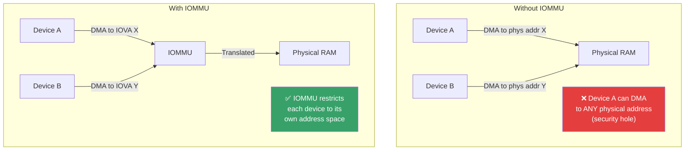
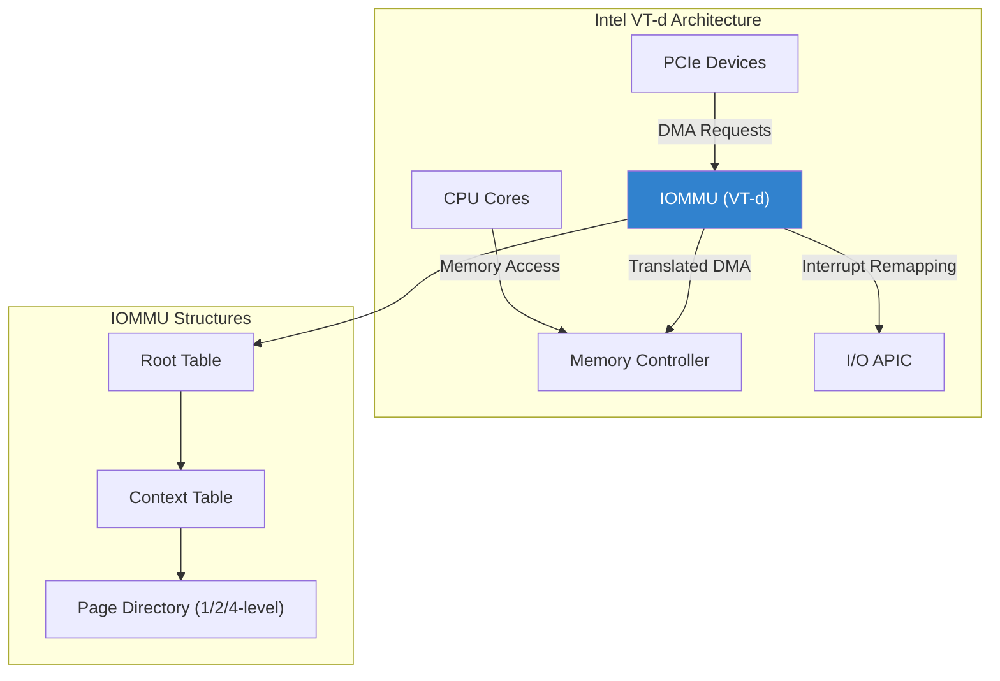
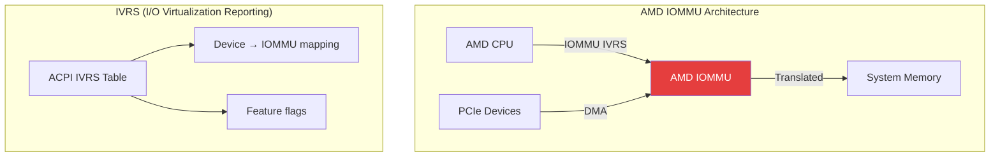
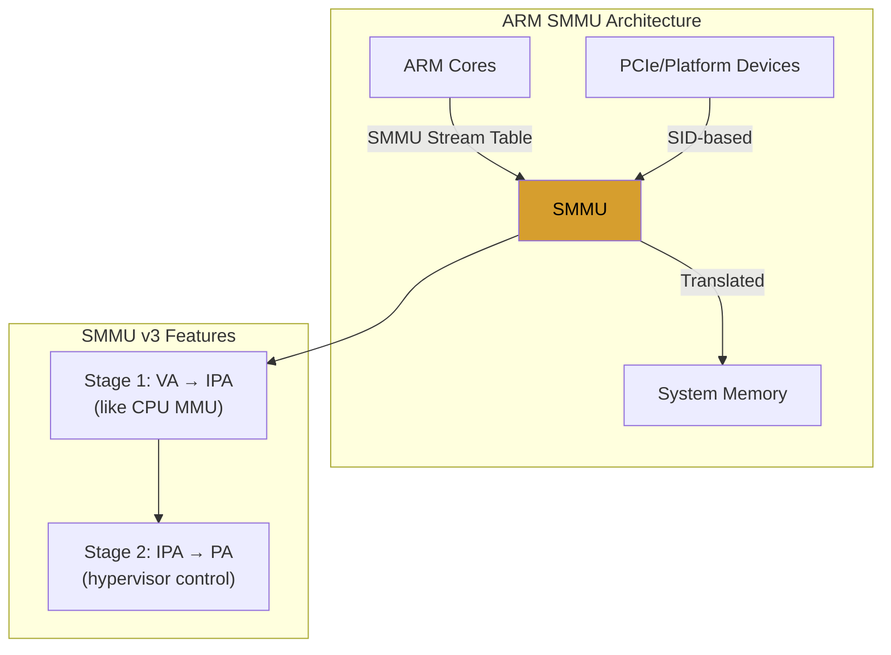
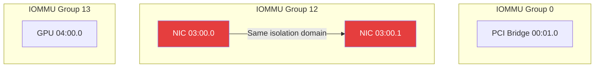
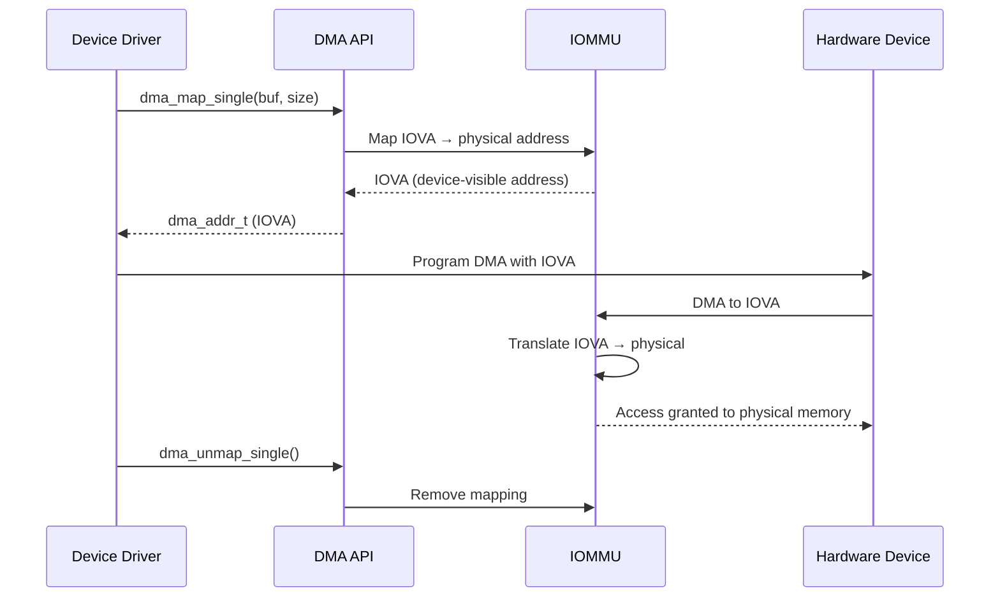
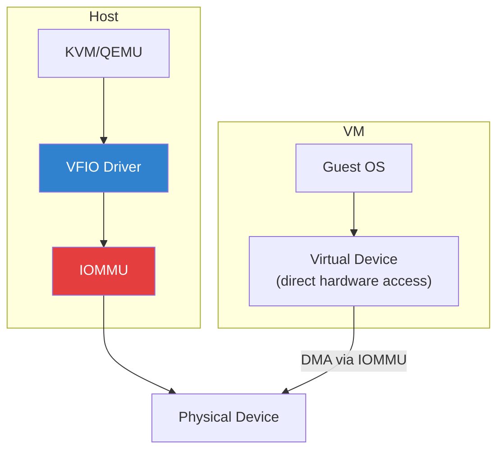
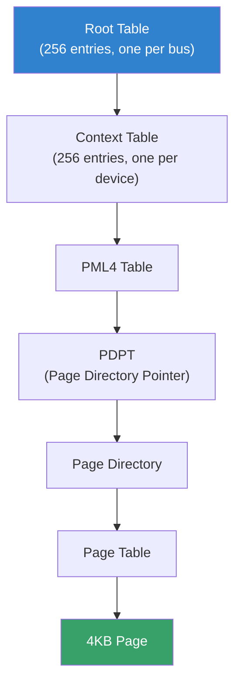
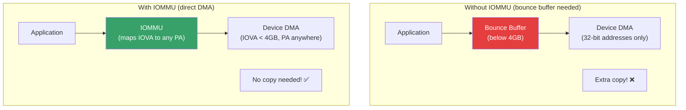
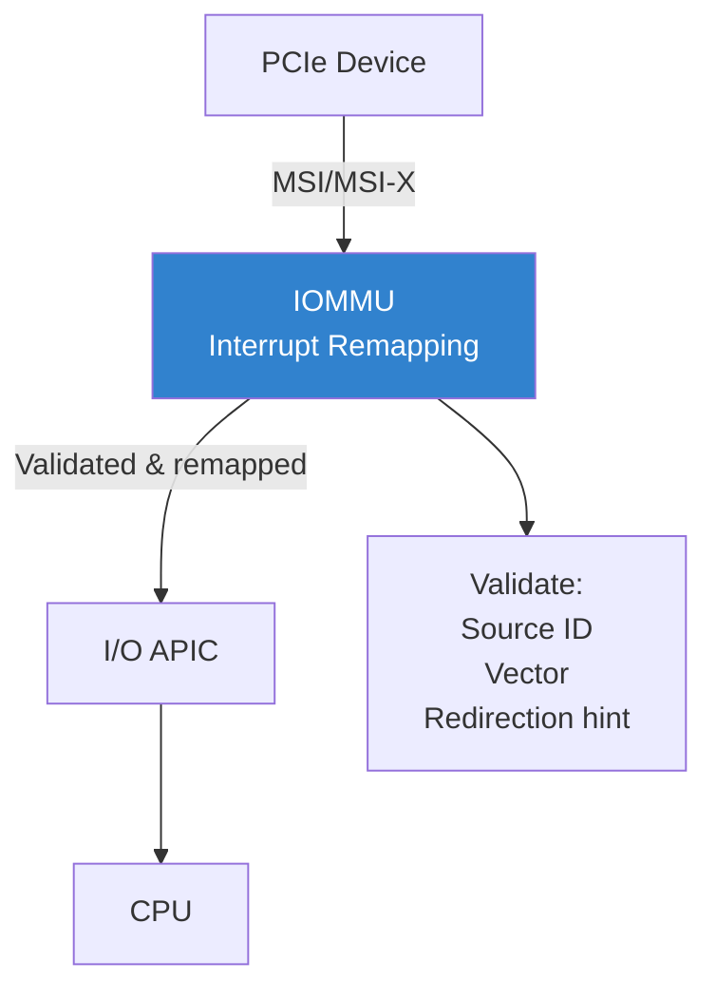

# IOMMU: Input-Output Memory Management Unit

## Introduction

An IOMMU (Input-Output Memory Management Unit) is a hardware component that provides **address translation** and **access control** for DMA (Direct Memory Access) operations initiated by I/O devices. Just as a CPU's MMU translates virtual addresses to physical addresses for the processor, an IOMMU translates device-visible addresses to physical addresses for peripherals.

Key capabilities:
- **DMA remapping** — devices use IOMMU virtual addresses, not physical addresses
- **Isolation** — prevents devices from accessing unauthorized memory regions
- **DMA bounce buffering elimination** — devices can DMA to any physical address
- **Interrupt remapping** — isolates device interrupts
- **SR-IOV support** — enables safe device virtualization
- **Device passthrough** — safe assignment of devices to VMs (VT-d, AMD-Vi)

## Why IOMMU Matters



Without an IOMMU:
- A malicious or buggy device can DMA to **any** physical address
- PCI passthrough to VMs is unsafe (VM can access host memory)
- 32-bit devices cannot DMA to memory above 4GB (no bounce buffers with IOMMU)
- DMA attacks (e.g., FireWire, Thunderbolt) are possible

## IOMMU Hardware Implementations

### Intel VT-d (Virtualization Technology for Directed I/O)



**VT-d features:**
- 2-level or 4-level page tables (up to 57-bit addressing)
- DMA remapping per device
- Interrupt remapping
- Queued Invalidation (scalable invalidation)
- Snoop Control (cache coherency)
- Scalable Mode (since VT-d 3.0)

### AMD-Vi / AMD IOMMU



**AMD-Vi features:**
- 2-level or 4-level page tables
- Guest page table translation (nested paging for I/O)
- Peripheral Page Table (PPR) support
- I/O Page Fault (IOPF) reporting
- AVIC (Advanced Virtual Interrupt Controller) integration

### ARM SMMU (System Memory Management Unit)



**ARM SMMU versions:**
- **SMMUv1/v2** — ARMv7/v8, 2-stage translation
- **SMMUv3** — ARMv8.2+, PCIe PRI support, nested translation, HTTU

## Linux IOMMU Subsystem

### Kernel Configuration

```bash
CONFIG_IOMMU_API=y              # IOMMU core API
CONFIG_IOMMU_SUPPORT=y          # IOMMU support
CONFIG_INTEL_IOMMU=y            # Intel VT-d
CONFIG_AMD_IOMMU=y              # AMD-Vi
CONFIG_AMD_IOMMU_V2=y           # AMD IOMMU v2 features
CONFIG_ARM_SMMU=y               # ARM SMMU
CONFIG_ARM_SMMU_V3=y            # ARM SMMUv3
CONFIG_IOMMU_DMA=y              # DMA-API IOMMU backing
CONFIG_IOMMU_IO_PGTABLE=y       # IOMMU page table library
CONFIG_IOMMU_IO_PGTABLE_LPAE=y  # ARM LPAE page tables
```

### Checking IOMMU Status

```bash
# Check if IOMMU is enabled
dmesg | grep -i iommu

# List IOMMU groups
ls /sys/kernel/iommu_groups/

# Show devices in IOMMU groups
for g in $(ls /sys/kernel/iommu_groups/); do
    echo "IOMMU Group $g:"
    ls -la /sys/kernel/iommu_groups/$g/devices/
done

# Check IOMMU type
cat /sys/class/iommu/*/type

# Intel VT-d: check DMAR table
dmesg | grep -i dmar

# AMD-Vi: check IVRS table
dmesg | grep -i ivrs
```

### IOMMU Groups

IOMMU groups are the fundamental unit of isolation. All devices in the same group share the same IOMMU translation and cannot be isolated from each other.

```bash
# Show all IOMMU groups and their devices
for g in $(find /sys/kernel/iommu_groups -maxdepth 1 -mindepth 1 -type d); do
    echo "=== Group $(basename $g) ==="
    for d in $g/devices/*; do
        echo "  $(basename $d): $(lspci -s $(basename $d) 2>/dev/null || echo 'N/A')"
    done
done

# Example output:
# === Group 0 ===
#   0000:00:00.0: Host bridge
# === Group 1 ===
#   0000:00:01.0: PCI bridge
# === Group 2 ===
#   0000:00:02.0: VGA compatible controller
# === Group 12 ===
#   0000:03:00.0: Ethernet controller
```



## IOMMU and DMA

### DMA Mapping API

```c
#include <linux/dma-mapping.h>
#include <linux/pci.h>

/* Allocate DMA-coherent memory (cache-coherent, CPU + device visible) */
void *dma_alloc_coherent(struct device *dev, size_t size,
                         dma_addr_t *dma_handle, gfp_t gfp);

/* Map a buffer for DMA (streaming mapping) */
dma_addr_t dma_map_single(struct device *dev, void *ptr,
                          size_t size, enum dma_data_direction dir);

/* Unmap after DMA is complete */
void dma_unmap_single(struct device *dev, dma_addr_t dma_addr,
                      size_t size, enum dma_data_direction dir);

/* Synchronize for CPU access after device DMA */
void dma_sync_single_for_cpu(struct device *dev, dma_addr_t dma_addr,
                             size_t size, enum dma_data_direction dir);

/* Synchronize for device access after CPU write */
void dma_sync_single_for_device(struct device *dev, dma_addr_t dma_addr,
                                size_t size, enum dma_data_direction dir);
```

### DMA Mapping Flow



### Direction Types

```c
enum dma_data_direction {
    DMA_BIDIRECTIONAL = 0,  /* Both read and write */
    DMA_TO_DEVICE = 1,      /* CPU → Device (write) */
    DMA_FROM_DEVICE = 2,    /* Device → CPU (read) */
    DMA_NONE = 3,           /* No DMA */
};
```

## IOMMU and Device Passthrough (VFIO)

### VFIO (Virtual Function I/O)

VFIO is the Linux framework for safe device assignment to virtual machines using IOMMU protection:



### VFIO Device Assignment

```bash
# 1. Enable IOMMU in kernel (Intel)
# GRUB: intel_iommu=on iommu=pt

# 2. Load VFIO modules
sudo modprobe vfio
sudo modprobe vfio_pci

# 3. Unbind device from native driver
echo "0000:03:00.0" | sudo tee /sys/bus/pci/devices/0000:03:00.0/driver/unbind

# 4. Bind to vfio-pci
echo "8086 1521" | sudo tee /sys/bus/pci/drivers/vfio-pci/new_id
echo "0000:03:00.0" | sudo tee /sys/bus/pci/drivers/vfio-pci/bind

# 5. Verify IOMMU group
ls -la /sys/bus/pci/devices/0000:03:00.0/iommu_group/

# 6. Launch QEMU with VFIO passthrough
qemu-system-x86_64 \
    -device vfio-pci,host=03:00.0 \
    -machine type=q35,accel=kvm \
    -m 4G \
    -smp 4 \
    -hda vm-disk.qcow2
```

### VFIO with IOMMU Groups

```bash
#!/bin/bash
# Bind all devices in an IOMMU group to vfio-pci

IOMMU_GROUP="$1"
DRIVER="vfio-pci"

for dev in /sys/kernel/iommu_groups/$IOMMU_GROUP/devices/*; do
    BDF=$(basename "$dev")

    # Get vendor and device IDs
    VENDOR=$(cat /sys/bus/pci/devices/$BDF/vendor)
    DEVICE=$(cat /sys/bus/pci/devices/$BDF/device)

    # Unbind from current driver
    echo "$BDF" > /sys/bus/pci/devices/$BDF/driver/unbind 2>/dev/null

    # Bind to vfio-pci
    echo "$VENDOR $DEVICE" > /sys/bus/pci/drivers/$DRIVER/new_id
    echo "$BDF" > /sys/bus/pci/drivers/$DRIVER/bind

    echo "Bound $BDF ($VENDOR:$DEVICE) to $DRIVER"
done
```

## IOMMU Page Table Formats

### Intel VT-d Page Tables



### ARM SMMU Page Tables (LPAE)

ARM SMMU uses ARM's Long Physical Address Extension (LPAE) format:

- Stage 1: VA → IPA (like CPU MMU)
- Stage 2: IPA → PA (hypervisor control)

```bash
# SMMU page table configuration
# /sys/kernel/iommu_groups/<group>/type
# arm-smmu-v3: Stage 1 + Stage 2
# intel: Single-level translation
```

## IOMMU and DMA Bounce Buffers

For devices that cannot address all of physical memory (e.g., 32-bit PCI devices), the IOMMU eliminates the need for bounce buffers:



## IOMMU Interrupt Remapping

IOMMU interrupt remapping isolates device interrupts, preventing interrupt injection attacks:

```bash
# Check if interrupt remapping is enabled
dmesg | grep -i "interrupt remapping"

# Intel: Interrupt remapping table
# AMD: Interrupt remapping table
# ARM: GIC ITS (Interrupt Translation Service)

# Disable interrupt remapping (not recommended)
# GRUB: intremap=off
```

### Interrupt Remapping Architecture



## Practical Examples

### Example 1: Check IOMMU Status

```bash
#!/bin/bash
# iommu-status.sh — Show IOMMU configuration

echo "=== IOMMU Status ==="

# Check IOMMU enabled
if dmesg | grep -qi "DMAR\|IOMMU enabled\|AMD-Vi"; then
    echo "IOMMU: Enabled"
else
    echo "IOMMU: Not detected or disabled"
fi

# IOMMU type
if dmesg | grep -qi "Intel.*VT-d"; then
    echo "Type: Intel VT-d"
elif dmesg | grep -qi "AMD-Vi\|AMD.*IOMMU"; then
    echo "Type: AMD-Vi"
elif dmesg | grep -qi "ARM.*SMMU"; then
    echo "Type: ARM SMMU"
fi

# IOMMU groups
GROUPS=$(ls /sys/kernel/iommu_groups/ 2>/dev/null | wc -l)
echo "IOMMU Groups: $GROUPS"

# Devices per group
for g in $(ls /sys/kernel/iommu_groups/ 2>/dev/null); do
    DEVS=$(ls /sys/kernel/iommu_groups/$g/devices/ 2>/dev/null | wc -l)
    echo "  Group $g: $DEVS device(s)"
done

# Interrupt remapping
if dmesg | grep -qi "interrupt remapping.*enabled"; then
    echo "Interrupt Remapping: Enabled"
else
    echo "Interrupt Remapping: Disabled or N/A"
fi
```

### Example 2: Safe Device Passthrough

```bash
#!/bin/bash
# vfio-setup.sh — Configure VFIO for device passthrough

set -e

PCI_DEV="$1"  # e.g., 0000:03:00.0
if [ -z "$PCI_DEV" ]; then
    echo "Usage: $0 <PCI-BDF>"
    exit 1
fi

# Get IOMMU group
IOMMU_GROUP=$(basename $(readlink /sys/bus/pci/devices/$PCI_DEV/iommu_group))
echo "Device $PCI_DEV is in IOMMU Group $IOMMU_GROUP"

# Check if group has other devices
GROUP_DEVS=$(ls /sys/kernel/iommu_groups/$IOMMU_GROUP/devices/)
if [ $(echo "$GROUP_DEVS" | wc -w) -gt 1 ]; then
    echo "WARNING: Other devices in same IOMMU group:"
    echo "$GROUP_DEVS"
    echo "All must be bound to vfio-pci for safe passthrough"
fi

# Unbind from current driver
CURRENT_DRIVER=$(basename $(readlink /sys/bus/pci/devices/$PCI_DEV/driver))
echo "Unbinding from $CURRENT_DRIVER..."
echo "$PCI_DEV" > /sys/bus/pci/devices/$PCI_DEV/driver/unbind

# Get vendor/device IDs
VENDOR=$(cat /sys/bus/pci/devices/$PCI_DEV/vendor)
DEVICE=$(cat /sys/bus/pci/devices/$PCI_DEV/device)

# Load vfio-pci and bind
modprobe vfio-pci
echo "$VENDOR $DEVICE" > /sys/bus/pci/drivers/vfio-pci/new_id
echo "$PCI_DEV" > /sys/bus/pci/drivers/vfio-pci/bind

echo "Device bound to vfio-pci successfully"
echo "Ready for QEMU passthrough: -device vfio-pci,host=$PCI_DEV"
```

## IOMMU Kernel Parameters

```bash
# Intel VT-d
intel_iommu=on          # Enable IOMMU
intel_iommu=igfx_off    # Disable for integrated GPU
intel_iommu=pt          # Passthrough mode (identity map for host devices)

# AMD-Vi
amd_iommu=on            # Enable IOMMU
amd_iommu=pt            # Passthrough mode
amd_iommu=fullflush     # Full IOTLB flush on unmap

# Generic
iommu=on                # Enable IOMMU (all architectures)
iommu=pt                # Passthrough mode
iommu.passthrough=1     # Alternative passthrough syntax
intremap=on             # Enable interrupt remapping

# In GRUB
GRUB_CMDLINE_LINUX="intel_iommu=on iommu=pt"
# or
GRUB_CMDLINE_LINUX="amd_iommu=on iommu=pt"
```

## Troubleshooting

### Common Issues

| Symptom | Cause | Solution |
|---------|-------|----------|
| DMA allocation failures | Device can't reach all memory | Enable IOMMU (`iommu=on`) |
| Device passthrough fails | IOMMU group conflict | Bind all group devices to vfio-pci |
| Boot hangs with IOMMU | Firmware/BIOS issue | Update BIOS, try `iommu=soft` |
| Poor passthrough performance | IOTLB thrashing | Use `iommu=pt` for host devices |
| Interrupt storms | Interrupt remapping disabled | Enable `intremap=on` |
| "No IOMMU" error | Not enabled in BIOS/GRUB | Enable VT-d/AMD-Vi in BIOS, add kernel param |

### Debugging

```bash
# Check IOMMU kernel messages
dmesg | grep -i iommu

# Check IOMMU faults
dmesg | grep -i "iommu.*fault\|dmar.*fault\|amd.*iommu.*error"

# Intel: check IOMMU fault log
cat /sys/kernel/debug/iommu/intel/iommu_groups/*/info

# AMD: check IOMMU event log
dmesg | grep -i "amd.*iommu"

# IOMMU debugfs
ls /sys/kernel/debug/iommu/

# Check device DMA mask
cat /sys/bus/pci/devices/0000:03:00.0/dma_mask_bits

# Trace IOMMU operations
sudo perf trace -e 'iommu:*' -a -- sleep 5
```

## Further Reading

- [Intel VT-d Specification](https://www.intel.com/content/www/us/en/io/virtualization-technology-for-directed-io.html)
- [AMD IOMMU Specification](https://developer.amd.com/resources/developer-guides-manuals/)
- [ARM SMMU Specification](https://developer.arm.com/documentation/ihi0070/latest)
- [Linux IOMMU Documentation](https://www.kernel.org/doc/html/latest/driver-api/iommu.html)
- [VFIO Documentation](https://docs.kernel.org/driver-api/vfio.html)
- [LWN: IOMMU](https://lwn.net/Articles/321676/)
- [Alex Williamson VFIO blog](https://vfio.blogspot.com/)

## See Also

- [PCI](./pci.md) — PCI bus and device management
- [DMA](./dma.md) — DMA subsystem overview
- [Virtualization](../containers/docker-internals.md) — container/VM device access
- [Interrupt Handling](./interrupt-handling.md) — interrupt remapping
- [ACPI](./acpi.md) — IOMMU discovery via DMAR/IVRS tables
