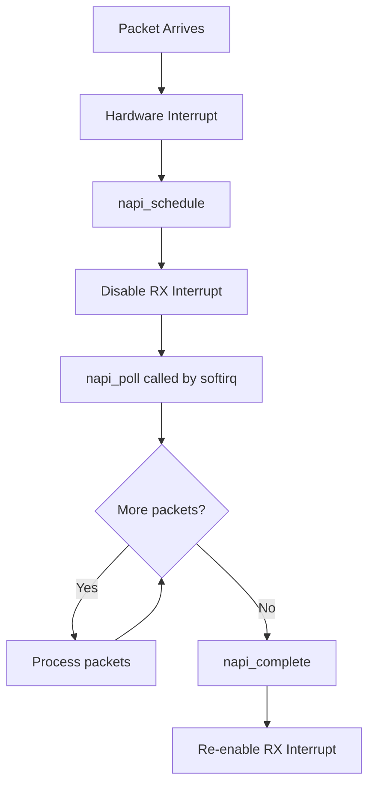
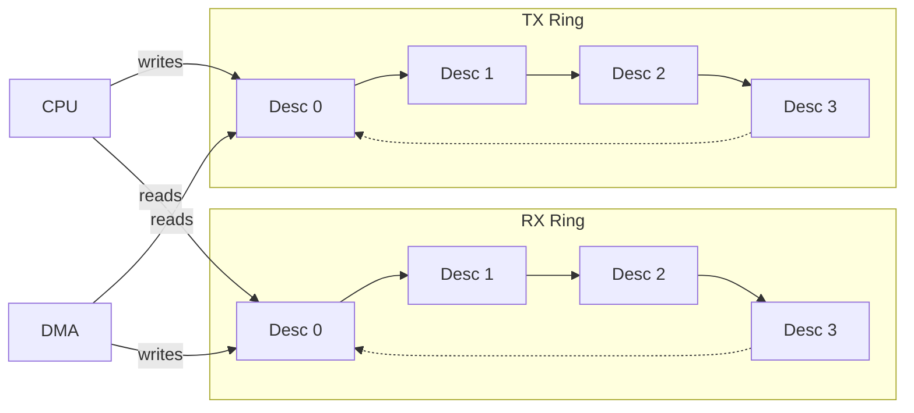

# Network Device Drivers

## Introduction

Network device drivers are arguably the most complex class of Linux device drivers. They must handle packet reception at interrupt time, coordinate with the networking stack's sophisticated queuing mechanisms, support hardware offloads (checksum, TSO, RSS), and expose a rich configuration interface via ethtool. A well-written network driver must be performant, correct under concurrent access, and compliant with the kernel's netdev API contracts.

The Linux networking subsystem is built around the `net_device` structure (representing a network interface) and the `sk_buff` (socket buffer, representing a packet). The driver registers with the kernel, provides callback operations via `net_device_ops`, and interacts with the NAPI (New API) polling mechanism for efficient packet reception.

## Core Data Structures

### struct net_device

The `net_device` is the kernel's representation of a network interface. It is a large structure; drivers typically allocate it with `alloc_etherdev()`:

```c
struct net_device {
    char name[IFNAMSIZ];           /* interface name, e.g. "eth%d" */
    unsigned long state;           /* device state flags */
    struct net_device *next;
    struct net_device *next_upper;
    
    /* identification */
    unsigned char dev_addr[MAX_ADDR_LEN];  /* MAC address */
    unsigned char addr_len;
    unsigned int flags;            /* IFF_UP, IFF_BROADCAST, etc. */
    unsigned int priv_flags;
    
    /* features */
    netdev_features_t features;
    netdev_features_t hw_features;
    netdev_features_t hw_enc_features;
    netdev_features_t wanted_features;
    
    /* MTU and statistics */
    unsigned int mtu;
    struct net_device_stats stats;
    struct rtnl_link_stats64 *tc_stats;
    
    /* operations */
    const struct net_device_ops *netdev_ops;
    const struct ethtool_ops *ethtool_ops;
    const struct header_ops *header_ops;
    
    /* TX/RX queues */
    struct netdev_rx_queue *_rx;
    unsigned int num_rx_queues;
    struct netdev_queue *_tx;
    unsigned int num_tx_queues;
    unsigned int real_num_tx_queues;
    unsigned int real_num_rx_queues;
    
    /* NAPI */
    struct list_head napi_list;
    
    /* device model */
    struct device dev;
    struct kobject *queues_kobject;
    
    /* packet types */
    struct list_head ptype_all;
    struct list_head ptype_specific;
    
    /* bonding, bridging */
    struct net_device *master;
    
    /* QoS */
    struct Qdisc *qdisc;
    unsigned long tx_queue_len;
    
    /* locking */
    spinlock_t addr_list_lock;
    struct mutex ifindex_mutex;
    
    /* DMA */
    unsigned long dma_features;
    
    /* phy / link */
    struct phy_device *phydev;
    struct ethtool_eee eee;
};
```

### struct net_device_ops

This is the primary callback table for network drivers:

```c
struct net_device_ops {
    int (*ndo_init)(struct net_device *dev);
    void (*ndo_uninit)(struct net_device *dev);
    int (*ndo_open)(struct net_device *dev);
    int (*ndo_stop)(struct net_device *dev);
    netdev_tx_t (*ndo_start_xmit)(struct sk_buff *skb,
                                   struct net_device *dev);
    u16 (*ndo_select_queue)(struct net_device *dev, struct sk_buff *skb,
                            struct net_device *sb_dev);
    void (*ndo_change_rx_flags)(struct net_device *dev, int flags);
    void (*ndo_set_rx_mode)(struct net_device *dev);
    int (*ndo_set_mac_address)(struct net_device *dev, void *addr);
    int (*ndo_validate_addr)(struct net_device *dev);
    int (*ndo_do_ioctl)(struct net_device *dev, struct ifreq *ifr, int cmd);
    int (*ndo_set_config)(struct net_device *dev, struct ifmap *map);
    int (*ndo_change_mtu)(struct net_device *dev, int new_mtu);
    int (*ndo_neigh_setup)(struct net_device *dev, struct neigh_parms *);
    void (*ndo_tx_timeout)(struct net_device *dev, unsigned int txqueue);
    struct rtnl_link_stats64 *(*ndo_get_stats64)(
        struct net_device *dev, struct rtnl_link_stats64 *storage);
    netdev_features_t (*ndo_features_check)(struct sk_buff *skb,
                                             struct net_device *dev,
                                             netdev_features_t features);
    int (*ndo_set_features)(struct net_device *dev,
                            netdev_features_t features);
    int (*ndo_set_vf_mac)(struct net_device *dev, int vf, u8 *mac);
    int (*ndo_set_vf_vlan)(struct net_device *dev, int vf, u16 vlan,
                            u8 qos, __be16 proto);
    int (*ndo_get_vf_config)(struct net_device *dev, int vf,
                              struct ifla_vf_info *ivi);
    int (*ndo_set_vf_link_state)(struct net_device *dev, int vf,
                                  int link_state);
    int (*ndo_setup_tc)(struct net_device *dev, enum tc_setup_type type,
                        void *type_data);
    int (*ndo_fdb_add)(struct ndmsg *ndm, struct nlattr *tb[],
                        struct net_device *dev, const unsigned char *addr,
                        u16 vid, u16 flags, struct netlink_ext_ack *extack);
    int (*ndo_fdb_del)(struct ndmsg *ndm, struct nlattr *tb[],
                        struct net_device *dev, const unsigned char *addr,
                        u16 vid);
    int (*ndo_fdb_dump)(struct sk_buff *skb, struct netlink_callback *cb,
                         struct net_device *dev, struct net_device *filter_dev,
                         int *idx);
    int (*ndo_bridge_setlink)(struct net_device *dev, struct nlmsghdr *nlh,
                               u16 flags, struct netlink_ext_ack *extack);
    int (*ndo_bridge_getlink)(struct sk_buff *skb, u32 pid, u32 seq,
                               struct net_device *dev, u32 filter_mask,
                               int nlflags);
};
```

### struct sk_buff (Socket Buffer)

The `sk_buff` is the universal packet representation:

```c
struct sk_buff {
    union {
        struct {
            struct sk_buff *next;
            struct sk_buff *prev;
        };
        struct rb_node rbnode;
        struct list_head list;
    };
    
    union {
        struct sock *sk;
        int ip_defrag_offset;
    };
    
    struct net_device *dev;         /* receiving/transmitting device */
    
    /* timing */
    ktime_t tstamp;
    
    /* protocol headers */
    union {
        struct tcphdr *th;
        struct udphdr *uh;
        struct icmphdr *icmph;
        struct igmphdr *igmph;
        struct iphdr *iph;
        struct ipv6hdr *ipv6h;
        unsigned char *raw;
    } h;
    
    union {
        struct iphdr *iph;
        struct ipv6hdr *ipv6h;
        struct arphdr *arph;
        unsigned char *raw;
    } nh;
    
    union {
        unsigned char *raw;
    } mac;
    
    /* pointers to data */
    unsigned char *head;        /* start of buffer */
    unsigned char *data;        /* start of valid data */
    unsigned char *tail;        /* end of valid data */
    unsigned char *end;         /* end of buffer */
    
    /* lengths */
    unsigned int len;           /* total frame length */
    unsigned int data_len;      /* length of paged data */
    __u16 mac_len;              /* MAC header length */
    __u16 hdr_len;              /* skb clone writable header len */
    
    /* checksum */
    __u16 csum;
    __u8 ip_summed;             /* CHECKSUM_NONE, CHECKSUM_UNNECESSARY, etc. */
    
    /* packet type */
    __u8 pkt_type:3;
    __u8 cloned:1;
    __u8 ipvs_property:1;
    __u8 peeked:1;
    __u8 nf_trace:1;
    __u8 protocol:16;
    
    /* VLAN */
    __u16 vlan_tci;
    
    /* priority and queueing */
    __u32 priority;
    __u32 mark;
    __u32 hash;
    
    /* destructor */
    void (*destructor)(struct sk_buff *skb);
    
    /* private area for driver use */
    char cb[48];
};
```

## NAPI (New API)

NAPI is the kernel's mechanism for efficient packet reception. Instead of processing every packet at interrupt time (which causes interrupt storms under load), NAPI uses a hybrid interrupt/polling model:



### NAPI Implementation

```c
struct my_napi_data {
    struct napi_struct napi;
    struct net_device *netdev;
    /* hardware-specific fields */
};

static int my_napi_poll(struct napi_struct *napi, int budget)
{
    struct my_napi_data *data = container_of(napi, struct my_napi_data, napi);
    struct net_device *netdev = data->netdev;
    int work_done = 0;
    
    while (work_done < budget) {
        struct sk_buff *skb = my_hw_rx_dequeue(data);
        if (!skb)
            break;
        
        skb->protocol = eth_type_trans(skb, netdev);
        skb->ip_summed = CHECKSUM_UNNECESSARY;  /* HW checksum */
        napi_gro_receive(napi, skb);
        work_done++;
    }
    
    if (work_done < budget) {
        napi_complete(napi);
        my_enable_rx_interrupt(data);  /* re-enable IRQ */
    }
    
    return work_done;
}

/* In interrupt handler */
static irqreturn_t my_interrupt(int irq, void *dev_id)
{
    struct my_napi_data *data = dev_id;
    u32 status = my_hw_read_irq_status(data);
    
    if (status & RX_COMPLETE) {
        my_hw_disable_rx_interrupt(data);
        napi_schedule(&data->napi);
    }
    
    if (status & TX_COMPLETE)
        my_tx_clean(data);
    
    return IRQ_HANDLED;
}

/* In ndo_open */
static int my_open(struct net_device *dev)
{
    struct my_priv *priv = netdev_priv(dev);
    
    napi_enable(&priv->napi_data.napi);
    my_hw_start(priv);
    netif_start_queue(dev);
    return 0;
}
```

## Writing a Network Driver

### Minimal Driver Structure

```c
#include <linux/module.h>
#include <linux/netdevice.h>
#include <linux/etherdevice.h>
#include <linux/ethtool.h>

struct my_priv {
    struct net_device *netdev;
    struct napi_struct napi;
    void __iomem *hw_base;
    spinlock_t tx_lock;
    /* ring buffers, DMA descriptors, etc. */
};

static netdev_tx_t my_start_xmit(struct sk_buff *skb,
                                  struct net_device *dev)
{
    struct my_priv *priv = netdev_priv(dev);
    
    /* Map skb data for DMA */
    dma_addr_t dma = dma_map_single(dev->dev.parent, skb->data,
                                      skb->len, DMA_TO_DEVICE);
    if (dma_mapping_error(dev->dev.parent, dma)) {
        dev_kfree_skb_any(skb);
        return NETDEV_TX_OK;
    }
    
    /* Program hardware TX descriptor */
    my_hw_tx_submit(priv, dma, skb->len);
    
    /* Free skb after DMA completes (in TX completion IRQ) */
    /* Or use skb_tx_timestamp() for timestamping */
    
    if (my_tx_ring_full(priv))
        netif_stop_queue(dev);
    
    return NETDEV_TX_OK;
}

static int my_open(struct net_device *dev)
{
    struct my_priv *priv = netdev_priv(dev);
    
    /* Request IRQ */
    int err = request_irq(dev->irq, my_interrupt, 0, dev->name, priv);
    if (err)
        return err;
    
    /* Initialize hardware */
    my_hw_init(priv);
    
    /* Enable NAPI */
    napi_enable(&priv->napi);
    
    /* Start queue */
    netif_start_queue(dev);
    
    return 0;
}

static int my_stop(struct net_device *dev)
{
    struct my_priv *priv = netdev_priv(dev);
    
    netif_stop_queue(dev);
    napi_disable(&priv->napi);
    my_hw_stop(priv);
    free_irq(dev->irq, priv);
    
    return 0;
}

static void my_tx_timeout(struct net_device *dev, unsigned int txqueue)
{
    struct my_priv *priv = netdev_priv(dev);
    
    /* Reset hardware TX path */
    my_hw_reset_tx(priv);
    netif_wake_queue(dev);
}

static int my_change_mtu(struct net_device *dev, int new_mtu)
{
    if (new_mtu < 68 || new_mtu > 9000)
        return -EINVAL;
    dev->mtu = new_mtu;
    my_hw_set_mtu(netdev_priv(dev), new_mtu);
    return 0;
}

static const struct net_device_ops my_netdev_ops = {
    .ndo_init           = my_init,
    .ndo_open           = my_open,
    .ndo_stop           = my_stop,
    .ndo_start_xmit     = my_start_xmit,
    .ndo_set_rx_mode    = my_set_rx_mode,
    .ndo_set_mac_address = my_set_mac_address,
    .ndo_change_mtu     = my_change_mtu,
    .ndo_tx_timeout     = my_tx_timeout,
    .ndo_get_stats64    = my_get_stats64,
    .ndo_validate_addr  = eth_validate_addr,
};

static void my_netdev_setup(struct net_device *dev)
{
    dev->netdev_ops = &my_netdev_ops;
    dev->ethtool_ops = &my_ethtool_ops;
    dev->watchdog_timeo = 5 * HZ;
    dev->features = NETIF_F_SG | NETIF_F_HW_CSUM | NETIF_F_RXCSUM;
}
```

### Platform Driver Integration

```c
static int my_probe(struct platform_device *pdev)
{
    struct net_device *netdev;
    struct my_priv *priv;
    int err;
    
    netdev = alloc_etherdev(sizeof(struct my_priv));
    if (!netdev)
        return -ENOMEM;
    
    SET_NETDEV_DEV(netdev, &pdev->dev);
    priv = netdev_priv(netdev);
    priv->netdev = netdev;
    platform_set_drvdata(pdev, netdev);
    
    /* Map hardware registers */
    struct resource *res = platform_get_resource(pdev, IORESOURCE_MEM, 0);
    priv->hw_base = devm_ioremap_resource(&pdev->dev, res);
    if (IS_ERR(priv->hw_base)) {
        err = PTR_ERR(priv->hw_base);
        goto err_free;
    }
    
    netdev->irq = platform_get_irq(pdev, 0);
    
    /* Read MAC address from hardware/DT */
    my_hw_read_mac(priv, netdev->dev_addr);
    if (!is_valid_ether_addr(netdev->dev_addr))
        eth_hw_addr_random(netdev);
    
    my_netdev_setup(netdev);
    
    /* Initialize NAPI */
    netif_napi_add(netdev, &priv->napi, my_napi_poll, 64);
    
    err = register_netdev(netdev);
    if (err)
        goto err_napi;
    
    return 0;

err_napi:
    netif_napi_del(&priv->napi);
err_free:
    free_netdev(netdev);
    return err;
}

static int my_remove(struct platform_device *pdev)
{
    struct net_device *netdev = platform_get_drvdata(pdev);
    struct my_priv *priv = netdev_priv(netdev);
    
    unregister_netdev(netdev);
    netif_napi_del(&priv->napi);
    free_netdev(netdev);
    return 0;
}

static const struct of_device_id my_of_match[] = {
    { .compatible = "vendor,my-nic" },
    { /* sentinel */ }
};
MODULE_DEVICE_TABLE(of, my_of_match);

static struct platform_driver my_driver = {
    .probe  = my_probe,
    .remove = my_remove,
    .driver = {
        .name = "my-nic",
        .of_match_table = my_of_match,
    },
};
module_platform_driver(my_driver);
```

## Ethtool Operations

Ethtool provides userspace configuration of network devices:

```c
static int my_get_link_ksettings(struct net_device *dev,
                                  struct ethtool_link_ksettings *cmd)
{
    struct my_priv *priv = netdev_priv(dev);
    
    cmd->base.speed = my_hw_get_speed(priv);
    cmd->base.duplex = my_hw_get_duplex(priv);
    cmd->base.autoneg = my_hw_get_autoneg(priv);
    cmd->base.port = PORT_TP;
    cmd->base.phy_address = priv->phy_addr;
    
    ethtool_convert_legacy_u32_to_link_mode(cmd->link_modes.supported,
                                             SUPPORTED_10baseT_Half |
                                             SUPPORTED_10baseT_Full |
                                             SUPPORTED_100baseT_Half |
                                             SUPPORTED_100baseT_Full |
                                             SUPPORTED_1000baseT_Full |
                                             SUPPORTED_Autoneg);
    return 0;
}

static int my_set_link_ksettings(struct net_device *dev,
                                  const struct ethtool_link_ksettings *cmd)
{
    struct my_priv *priv = netdev_priv(dev);
    return my_hw_set_speed(priv, cmd->base.speed, cmd->base.duplex);
}

static void my_get_drvinfo(struct net_device *dev,
                            struct ethtool_drvinfo *info)
{
    strscpy(info->driver, "my-nic", sizeof(info->driver));
    strscpy(info->version, "1.0.0", sizeof(info->version));
    strscpy(info->bus_info, pci_name(to_pci_dev(dev->dev.parent)),
            sizeof(info->bus_info));
}

static const struct ethtool_ops my_ethtool_ops = {
    .get_drvinfo        = my_get_drvinfo,
    .get_link_ksettings = my_get_link_ksettings,
    .set_link_ksettings = my_set_link_ksettings,
    .get_link           = ethtool_op_get_link,
    .get_strings        = my_get_strings,
    .get_ethtool_stats  = my_get_ethtool_stats,
    .get_sset_count     = my_get_sset_count,
};
```

## Ring Buffers and DMA

Most NICs use descriptor ring buffers:



```c
struct my_desc {
    __le64 addr;        /* DMA address of buffer */
    __le32 len;         /* buffer length */
    __le32 flags;       /* status/control flags */
};

struct my_ring {
    struct my_desc *descs;     /* descriptor array (DMA coherent) */
    dma_addr_t dma;            /* DMA address of descriptor array */
    struct sk_buff **skbs;     /* parallel skb array */
    unsigned int head;         /* next to use (producer) */
    unsigned int tail;         /* next to complete (consumer) */
    unsigned int size;         /* ring size */
};

static int my_alloc_rx_ring(struct my_priv *priv)
{
    struct my_ring *ring = &priv->rx_ring;
    int i;
    
    ring->size = 256;
    ring->descs = dma_alloc_coherent(priv->dev, 
                                      ring->size * sizeof(struct my_desc),
                                      &ring->dma, GFP_KERNEL);
    ring->skbs = kcalloc(ring->size, sizeof(struct sk_skb *), GFP_KERNEL);
    
    for (i = 0; i < ring->size; i++) {
        struct sk_buff *skb = netdev_alloc_skb(priv->netdev, 2048);
        ring->skbs[i] = skb;
        ring->descs[i].addr = cpu_to_le64(
            dma_map_single(priv->dev, skb->data, 2048, DMA_FROM_DEVICE));
        ring->descs[i].len = cpu_to_le32(2048);
        ring->descs[i].flags = cpu_to_le32(MY_DESC_OWN);  /* HW owns */
    }
    
    ring->head = 0;
    ring->tail = 0;
    return 0;
}
```

## Hardware Offloads

Modern NICs support various offloads:

```c
/* In probe, advertise features */
netdev->hw_features = NETIF_F_SG           |      /* scatter-gather */
                       NETIF_F_IP_CSUM      |      /* IPv4 checksum */
                       NETIF_F_IPV6_CSUM    |      /* IPv6 checksum */
                       NETIF_F_TSO          |      /* TCP segmentation */
                       NETIF_F_TSO6         |      /* IPv6 TSO */
                       NETIF_F_GRO          |      /* generic receive offload */
                       NETIF_F_RXCSUM       |      /* RX checksum */
                       NETIF_F_RXHASH       |      /* RX hashing */
                       NETIF_F_HW_VLAN_CTAG_TX |   /* VLAN tag insert */
                       NETIF_F_HW_VLAN_CTAG_RX;    /* VLAN tag strip */

netdev->features = netdev->hw_features | NETIF_F_HIGHDMA;

/* TSO: driver receives large skb, hardware segments it */
/* The driver must set up the descriptor with MSS and header length */
static netdev_tx_t my_start_xmit(struct sk_buff *skb, struct net_device *dev)
{
    if (skb_is_gso(skb)) {
        /* Tell hardware the MSS and header length */
        my_hw_set_tso(priv, skb_shinfo(skb)->gso_size,
                      skb_transport_offset(skb) + tcp_hdrlen(skb));
    }
    /* ... map and submit ... */
}
```

## Monitoring and Debugging

```bash
# Interface statistics
ip -s link show eth0
# eth0: <BROADCAST,MULTICAST,UP,LOWER_UP> mtu 1500 ...
#     RX:  bytes  packets errors dropped  missed   mcast
#          12345    1000      0       0       0      50
#     TX:  bytes  packets errors dropped  carrier collisions
#           6789     500      0       0       0       0

# Detailed ethtool info
ethtool eth0
# Settings for eth0:
#     Speed: 1000Mb/s
#     Duplex: Full
#     Auto-negotiation: on
#     Link detected: yes

# Driver info
ethtool -i eth0
# driver: e1000e
# version: 5.15.0-generic
# firmware-version: 0.5-4
# expansion-rom-version:
# bus-info: 0000:00:1f.6

# Ring buffer sizes
ethtool -g eth0

# Offload features
ethtool -k eth0
# Features for eth0:
# rx-checksumming: on
# tx-checksumming: on
# tcp-segmentation-offload: on
# generic-receive-offload: on

# NAPI statistics
cat /proc/net/softnet_stat
# 00001234 00000001 00000000 00000000 00000000 ...

# Watch interface counters in real time
watch -n1 'cat /proc/net/dev | grep eth0'
```

## References

- [GNU Project Documentation](https://www.gnu.org/doc/doc.html)
- [GNU Manuals](https://www.gnu.org/manual/manual.html)
- [Free Software Directory](https://directory.fsf.org/wiki/Main_Page)
- [Planet GNU](https://planet.gnu.org/)
- [Free Software Books](https://www.gnu.org/doc/other-free-books.html)

- *Understanding Linux Network Internals* — Christian Benvenuti (O'Reilly)
- *Linux Device Drivers, 3rd Edition* — Chapter 17: Network Drivers
- [Linux kernel networking documentation](https://docs.kernel.org/networking/)
- [LWN: NAPI](https://lwn.net/Articles/300758/)
- [Kernel docs: Network driver design](https://docs.kernel.org/networking/netdevices.html)
- [ethtool kernel API](https://docs.kernel.org/networking/ethtool-netlink.html)

## Related Topics

- [Network Bonding](../networking/bonding.md) — Aggregating multiple interfaces
- [VLANs](../networking/vlans.md) — Virtual LANs on network devices
- [Bridging](../networking/bridging.md) — Software switching
- [Traffic Control](../networking/tc.md) — Packet scheduling and shaping
- [Interrupt Handling](./interrupt-handling.md) — IRQ management in drivers
- [DMA](./dma.md) — Direct Memory Access for packet buffers
