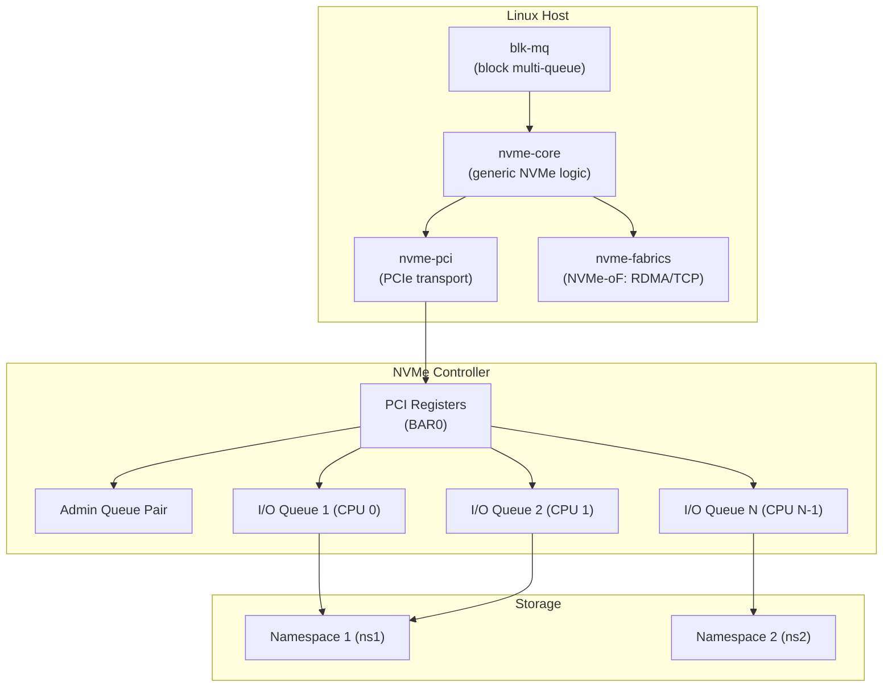
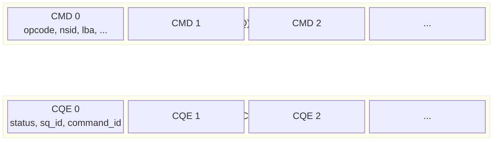
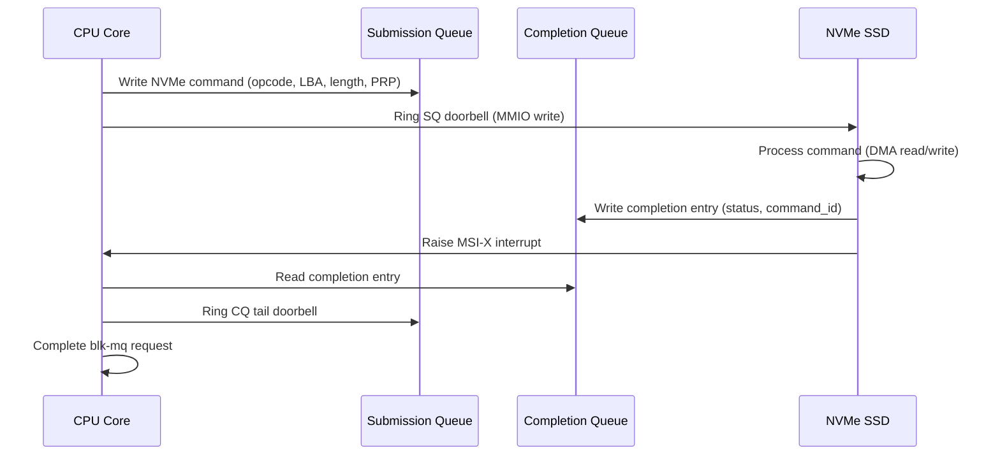

# NVMe Driver Internals

## Overview

NVMe (Non-Volatile Memory Express) is a high-performance storage interface designed for flash-based storage (SSDs, NVMe-oF). The Linux NVMe driver (`nvme`) communicates with NVMe controllers over PCIe using submission and completion queues with memory-mapped registers, achieving very high IOPS with low latency.

NVMe replaces the legacy AHCI/SATA interface with a design that leverages parallelism: multiple hardware queues, per-CPU submission, and interrupt-driven completion. A modern NVMe SSD can handle millions of IOPS.

> **Source:** `drivers/nvme/host/`  
> **Key files:** `nvme-core.c`, `nvme-pci.c`, `nvme-fabrics.c`  
> **Introduced:** Linux 3.3 (commit `27e83bd`)

---

## NVMe Architecture

### Controller Model



### Key Concepts

| Concept | Description |
|---------|-------------|
| **Controller** | The NVMe device (PCIe endpoint) |
| **Namespace** | A logical block device (like a partition) |
| **Admin Queue** | Used for controller management commands |
| **I/O Queue** | Used for read/write I/O commands |
| **Submission Queue (SQ)** | Host writes commands here |
| **Completion Queue (CQ)** | Controller writes completions here |
| **Queue Pair** | One SQ + one CQ |

---

## Queue Architecture

### Admin Queue

Every NVMe controller has exactly **one Admin Queue Pair** for management:

- Create/delete I/O queues
- Identify controller and namespaces
- Set features (interrupt coalescing, etc.)
- Firmware updates
- Health monitoring (SMART/health log)

### I/O Queues

Each I/O queue pair is typically mapped to a **CPU core** for NUMA-local access:

```c
/* drivers/nvme/host/pci.c */
static int nvme_create_queue(struct nvme_queue *nvmeq, int qid)
{
    /* Allocate CQ and SQ in DMA-accessible memory */
    /* Set up MSI-X interrupt for this queue */
    /* Submit NVMe Create I/O Queue command via admin queue */
}
```

### Queue Pair Structure



### SQ/CQ Interaction



---

## Key Data Structures

### struct nvme_dev

```c
/* drivers/nvme/host/pci.c */
struct nvme_dev {
    struct device *dev;                 /* PCI device */
    struct nvme_ctrl ctrl;              /* Generic NVMe controller */
    void __iomem *bar;                  /* BAR0 MMIO registers */
    struct nvme_queue *queues;          /* Array of queue pairs */
    unsigned int max_qid;               /* Max I/O queue ID */
    int io_queues[HCTX_MAX_TYPES];      /* Queue counts per type */
    u32 db_stride;                      /* Doorbell stride */
    /* ... */
};
```

### struct nvme_queue

```c
/* drivers/nvme/host/pci.c */
struct nvme_queue {
    struct nvme_dev *dev;               /* Parent device */
    spinlock_t sq_lock;                 /* SQ lock */
    struct nvme_command *sq_cmds;       /* SQ command buffer */
    volatile struct nvme_completion *cqes; /* CQ entries */
    u32 __iomem *q_db;                  /* Doorbell register */
    u16 sq_depth, cq_depth;             /* Queue depths */
    u16 sq_tail, cq_head;               /* Queue pointers */
    u16 qid;                            /* Queue ID */
    int cq_vector;                      /* MSI-X vector */
    struct blk_mq_tags **tags;          /* blk-mq tag set */
    /* ... */
};
```

### struct nvme_command (64 bytes)

```c
/* include/linux/nvme.h */
struct nvme_command {
    union {
        struct nvme_common_command common;
        struct nvme_rw_command rw;        /* Read/Write */
        struct nvme_identify identify;    /* Identify */
        struct nvme_features features;    /* Get/Set Features */
        struct nvme_create_cq create_cq;  /* Create CQ */
        struct nvme_create_sq create_sq;  /* Create SQ */
        /* ... */
    };
};
```

### NVMe Read/Write Command

```c
/* include/linux/nvme.h */
struct nvme_rw_command {
    __u8 opcode;        /* 0x00=read, 0x01=write */
    __u8 flags;
    __u16 command_id;   /* Tag for completion matching */
    __le32 nsid;        /* Namespace ID */
    __le64 rsvd2;
    __le64 metadata;    /* Metadata pointer */
    __le64 slba;        /* Starting LBA */
    __le16 length;      /* Number of logical blocks - 1 */
    __le16 control;     /* FUA, etc. */
    __le32 dsmgmt;      /* Dataset management */
    __le32 reftag;
    __le16 apptag;
    __le16 appmask;
    /* PRP entries (physical region pages) for DMA */
    __le64 prp1;
    __le64 prp2;
};
```

---

## blk-mq Integration

NVMe is the flagship user of the **blk-mq (block multi-queue)** framework:

### Hardware Queue Mapping

```c
/* drivers/nvme/host/pci.c */
static int nvme_setup_io_queues(struct nvme_dev *dev)
{
    /* Create one I/O queue per CPU */
    for (i = 1; i <= dev->max_qid; i++) {
        nvme_create_queue(dev->queues + i, i);
    }
}
```

### blk-mq Operations

```c
/* drivers/nvme/host/pci.c */
static const struct blk_mq_ops nvme_mq_ops = {
    .queue_rq    = nvme_queue_rq,     /* Submit request to SQ */
    .complete    = nvme_pci_complete_rq, /* Handle completion */
    .init_hctx   = nvme_init_hctx,    /* Initialize hardware ctx */
    .init_request = nvme_init_request, /* Initialize request */
    .timeout     = nvme_timeout,      /* Handle timeout */
    .poll        = nvme_poll,         /* Polled I/O */
};
```

### Request Submission

```c
/* drivers/nvme/host/pci.c */
static blk_status_t nvme_queue_rq(struct blk_mq_hw_ctx *hctx,
                                   const struct blk_mq_queue_data *bd)
{
    struct nvme_queue *nvmeq = hctx->driver_data;
    struct request *req = bd->rq;
    struct nvme_command cmnd;

    /* Build NVMe command from request */
    nvme_setup_cmd(req, &cmnd);

    /* Copy command to SQ */
    memcpy(&nvmeq->sq_cmds[sq_tail], &cmnd, sizeof(cmnd));

    /* Ring SQ doorbell */
    writel(sq_tail, nvmeq->q_db);

    return BLK_STS_OK;
}
```

---

## Interrupt Handling

### MSI-X

NVMe uses **MSI-X** interrupts — one per I/O queue (typically one per CPU):

```c
/* drivers/nvme/host/pci.c */
static irqreturn_t nvme_irq(int irq, void *data)
{
    struct nvme_queue *nvmeq = data;

    /* Read CQ entry */
    struct nvme_completion *cqe = &nvmeq->cqes[nvmeq->cq_head];

    /* Check phase bit (entry valid?) */
    if ((cqe->status & 1) != nvmeq->cq_phase)
        return IRQ_NONE;

    /* Process completions */
    nvme_handle_cqe(nvmeq, cqe);

    /* Advance CQ head, ring CQ doorbell */
    nvmeq->cq_head = (nvmeq->cq_head + 1) % nvmeq->cq_depth;
    writel(nvmeq->cq_head, nvmeq->q_db + 1);

    return IRQ_HANDLED;
}
```

### Interrupt Coalescing

```bash
# Set interrupt coalescing (batch completions)
# Aggregation time (in 100µs units)
nvme set-feature /dev/nvme0n1 -f 0x08 -v 10  # 1ms coalescing

# Aggregation threshold
nvme set-feature /dev/nvme0n1 -f 0x08 -v 4   # 4 completions before interrupt
```

---

## NVMe Namespaces

Each NVMe controller exposes one or more **namespaces** — logical block devices:

```bash
# List NVMe devices
nvme list
# Node             SN                   Model                Namespace Usage                      Format           FW Rev
# /dev/nvme0n1     S123456789           Samsung 980 PRO      1         500.11  GB / 500.11  GB    512   B +  0 B   5B2QGXA7

# List namespaces
nvme list-ns /dev/nvme0

# Namespace details
nvme id-ns /dev/nvme0n1
```

### Namespace Block Sizes

```bash
# Check current format
nvme id-ns /dev/nvme0n1 -H | grep "LBA Format"
# LBA Format  0 : Metadata Size: 0   bytes - Data Size: 512 bytes - ...

# Format with different sector size (4Kn)
nvme format /dev/nvme0n1 --lbaf=1  # 4096-byte sectors
```

---

## Admin Commands

### Controller Identification

```bash
# Identify controller
nvme id-ctrl /dev/nvme0
# Model: Samsung 980 PRO 500GB
# Serial: S123456789
# Firmware: 5B2QGXA7
# Max queue pairs: 32
# Max transfer size: 131072 bytes

# Health log (SMART)
nvme smart-log /dev/nvme0
# Available Spare:            100%
# Available Spare Threshold:  10%
# Percentage Used:            2%
# Data Units Read:            12345678
# Data Units Written:         87654321
# Power Cycles:               1234
# Power On Hours:             5678

# Error log
nvme error-log /dev/nvme0
```

### Feature Management

```bash
# Get feature
nvme get-feature /dev/nvme0 -f 0x01  # Arbitration
nvme get-feature /dev/nvme0 -f 0x04  # Power Management
nvme get-feature /dev/nvme0 -f 0x07  # Number of Queues

# Set feature
nvme set-feature /dev/nvme0 -f 0x07 -v 0x1F1F  # 32 SQs, 32 CQs

# Temperature threshold
nvme set-feature /dev/nvme0 -f 0x04 -v 70  # Alert at 70°C
```

---

## NVMe-oF (NVMe over Fabrics)

NVMe-oF extends NVMe over network fabrics (RDMA, TCP, FC):

### TCP Transport

```bash
# Load TCP transport
modprobe nvme-tcp

# Connect to remote NVMe target
nvme connect -t tcp -a 10.0.0.1 -s 4420 -n nqn.2024-01.target:storage1

# List connected subsystems
nvme list-subsys

# Disconnect
nvme disconnect -n nqn.2024-01.target:storage1
```

### RDMA Transport

```bash
# Load RDMA transport
modprobe nvme-rdma

# Connect via RDMA
nvme connect -t rdma -a 10.0.0.1 -s 4420 -n nqn.2024-01.target:storage1
```

---

## Performance Tuning

### Queue Depth

```bash
# Check current queue depth
cat /sys/block/nvme0n1/queue/nr_requests
# Default: 1023

# Increase for high-throughput workloads
echo 2048 > /sys/block/nvme0n1/queue/nr_requests
```

### I/O Scheduler

```bash
# NVMe works best with none (no scheduler) or mq-deadline
cat /sys/block/nvme0n1/queue/scheduler
# [none] mq-deadline kyber bfq

# Set to none for lowest latency
echo none > /sys/block/nvme0n1/queue/scheduler
```

### CPU Affinity

```bash
# Check IRQ affinity for NVMe queues
cat /proc/interrupts | grep nvme

# Set affinity (one IRQ per CPU is optimal)
echo 1 > /proc/irq/<irq_num>/smp_affinity
```

### Polling Mode

```bash
# Enable polled I/O (bypasses interrupts)
echo 1 > /sys/block/nvme0n1/queue/io_poll

# Or use io_uring with IOPOLL
# (requires application support)
```

---

## Monitoring and Debugging

### /proc and /sys Interfaces

```bash
# NVMe device info
cat /sys/block/nvme0n1/device/model
cat /sys/block/nvme0n1/device/serial
cat /sys/block/nvme0n1/device/firmware_rev

# Queue info
cat /sys/block/nvme0n1/queue/hw_sector_size
cat /sys/block/nvme0n1/queue/logical_block_size
cat /sys/block/nvme0n1/queue/physical_block_size
cat /sys/block/nvme0n1/queue/nr_requests
cat /sys/block/nvme0n1/queue/max_sectors_kb

# I/O statistics
cat /proc/diskstats | grep nvme
cat /sys/block/nvme0n1/stat
```

### NVMe CLI

```bash
# Install: apt install nvme-cli

# List all NVMe devices
nvme list

# Device self-test
nvme device-self-test /dev/nvme0 -s 1  # Short test
nvme device-self-test /dev/nvme0 -s 2  # Extended test

# Firmware update
nvme fw-download /dev/nvme0 --fw firmware.bin
nvme fw-activate /dev/nvme0 --slot 0 --action 1

# Secure erase
nvme format /dev/nvme0 --ses=1  # User data erase
nvme format /dev/nvme0 --ses=2  # Cryptographic erase

# Telemetry log
nvme telemetry-log /dev/nvme0 --output=telemetry.bin
```

### Tracepoints

```bash
# Enable NVMe tracepoints
echo 1 > /sys/kernel/debug/tracing/events/nvme/nvme_sq/enable
echo 1 > /sys/kernel/debug/tracing/events/nvme/nvme_complete_rq/enable

# View traces
cat /sys/kernel/debug/tracing/trace_pipe
```

---

## Common Issues

### Device Not Detected

**Symptom**: `nvme list` shows no devices.

**Cause**: Missing driver or PCI not enumerated.

**Solutions**:
- Check `lspci | grep -i nvme`
- Load driver: `modprobe nvme`
- Check `dmesg | grep nvme` for errors
- Verify BIOS/UEFI NVMe support

### Performance Issues

**Symptom**: Low IOPS or high latency.

**Cause**: Wrong scheduler, wrong queue depth, or CPU affinity.

**Solutions**:
- Set scheduler to `none`
- Check `iostat -x 1` for device saturation
- Verify per-CPU queue count: `nvme id-ctrl /dev/nvme0 | grep sq`
- Check thermal throttling: `nvme smart-log /dev/nvme0 | grep temperature`

### Device Errors

**Symptom**: I/O errors in `dmesg`.

**Cause**: Hardware failure, firmware bug, or PCIe issues.

**Solutions**:
- Check SMART: `nvme smart-log /dev/nvme0`
- Check error log: `nvme error-log /dev/nvme0`
- Update firmware
- Check PCIe link: `lspci -vv | grep -A5 "NVMe"`

---

## Source Files

| File | Contents |
|------|----------|
| `drivers/nvme/host/pci.c` | PCIe transport (main driver) |
| `drivers/nvme/host/core.c` | Generic NVMe core logic |
| `drivers/nvme/host/fabrics.c` | NVMe-oF base |
| `drivers/nvme/host/tcp.c` | NVMe-oF TCP transport |
| `drivers/nvme/host/rdma.c` | NVMe-oF RDMA transport |
| `drivers/nvme/host/ioctl.c` | ioctl interface |
| `include/linux/nvme.h` | NVMe command/status definitions |
| `include/linux/nvme.h` | NVMe specification structures |

---

## Further Reading

- **NVMe specification**: [nvmexpress.org](https://nvmexpress.org/specifications/)
- **Oracle Blogs**: [Overview of NVMe Architecture](https://blogs.oracle.com/linux/overview-of-nvme-architecture)
- **Kernel documentation**: `Documentation/driver-api/nvme.rst`
- **LWN**: ["The NVMe driver"](https://lwn.net/Articles/553157/)
- **SPDK**: [NVMe Driver](https://spdk.io/doc/nvme.html) — userspace NVMe
- **commit 27e83bd** — NVMe driver introduction (Linux 3.3)

---

## See Also

- [Block I/O](./block-io.md) — block layer overview
- [I/O Schedulers](./io-schedulers.md) — I/O scheduling
- [SCSI](./scsi-nvme.md) — SCSI subsystem comparison
- [PCI](./pci.md) — PCI/PCIe subsystem
- [DMA](./dma.md) — DMA for NVMe data transfers
