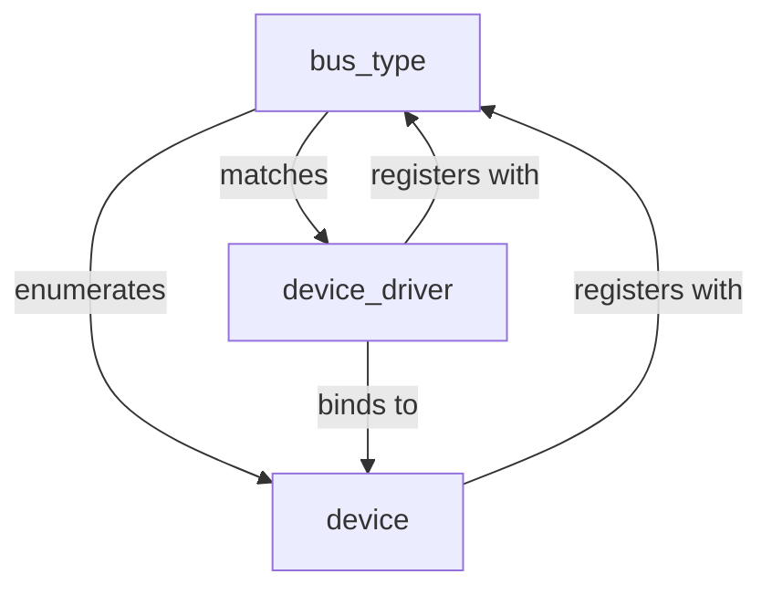
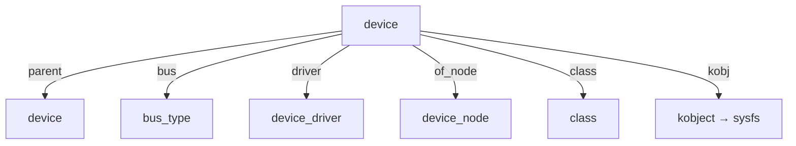
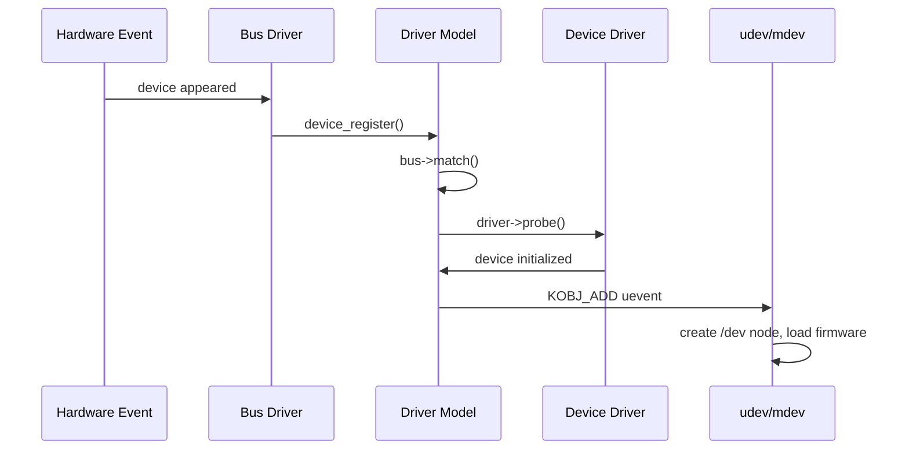
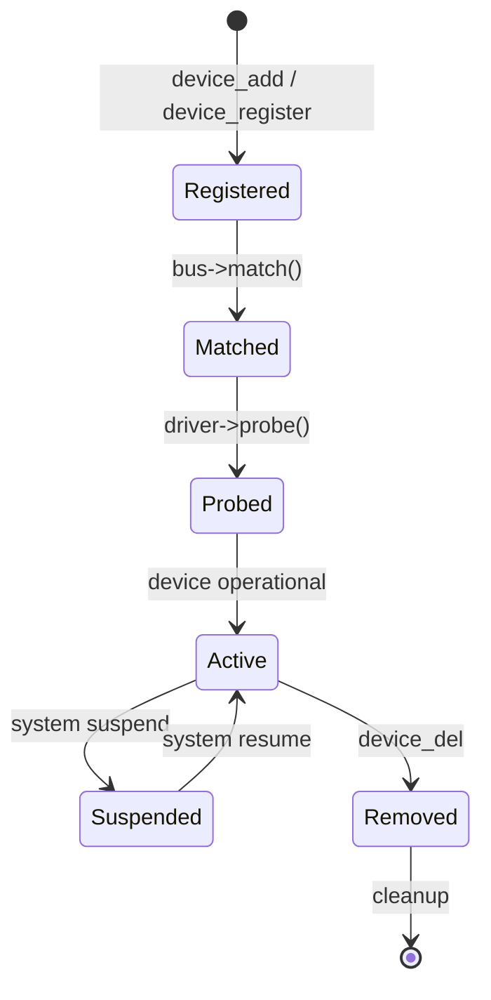

# Linux Driver Model

The **Linux driver model** provides a unified framework for representing
devices, drivers, and buses in the kernel. It standardizes device
discovery, driver binding, power management, and user-space visibility
through **sysfs**. Every device and driver in the kernel participates
in this model.

---

## 1. Core Concepts

The driver model is built on three pillars:



| Structure | Role |
|---|---|
| `struct device` | Represents a physical or virtual device |
| `struct device_driver` | Represents a driver that handles devices |
| `struct bus_type` | Represents a bus (PCI, USB, platform, etc.) |

### The Binding Process

1. A **bus** discovers a device (e.g., PCI enumeration).
2. The bus creates a `struct device` and registers it.
3. The kernel iterates registered drivers for that bus.
4. If a driver's `probe()` matches the device, it is **bound**.

---

## 2. Kobject — The Foundation

Every object in the driver model (`device`, `driver`, `bus`, `class`)
contains a **`kobject`** — the base type that provides:

- **Reference counting** (`kref`)
- **sysfs representation** (directory under `/sys/`)
- **Parent-child relationships** (hierarchy)
- **Release mechanism** (cleanup when refcount hits zero)

```c
struct kobject {
    const char      *name;
    struct kref     kref;
    struct list_head entry;
    struct kobject  *parent;
    struct kset     *kset;
    struct kobj_type *ktype;
    struct kernfs_node *sd;   /* sysfs entry */
};
```

### `kset` — Collections of Kobjects

A `kset` groups related kobjects together and provides a shared
`kobject` as their parent:

```c
struct bus_type pci_bus_type = {
    .name = "pci",
    .dev_groups = pci_dev_groups,
    .drv_groups = pci_drv_groups,
    .match = pci_bus_match,
    .probe = pci_device_probe,
    /* ... */
};
```

The bus's `kset` creates `/sys/bus/pci/` and all PCI devices appear
under `/sys/bus/pci/devices/`.

### `kobj_type` — Behavior

Defines how a kobject behaves (sysfs show/store, release):

```c
struct kobj_type {
    void (*release)(struct kobject *kobj);
    const struct sysfs_ops *sysfs_ops;
    struct attribute **default_attrs;
};
```

---

## 3. `struct device`

The `device` structure is the kernel's universal representation of a
hardware or virtual device:

```c
struct device {
    struct kobject          kobj;
    struct device           *parent;        /* parent device */
    const char              *init_name;     /* initial name */
    const struct device_type *type;         /* device class type */
    struct bus_type         *bus;           /* bus it's on */
    struct device_driver    *driver;        /* bound driver */
    void                    *platform_data; /* driver-private */
    void                    *driver_data;   /* driver-private (managed) */
    struct dev_pm_info      power;          /* power management */
    struct device_node      *of_node;       /* device tree node */
    /* ... */
};
```

### Key Relationships



---

## 4. `struct device_driver`

```c
struct device_driver {
    const char              *name;
    struct bus_type         *bus;
    struct module           *owner;
    const struct of_device_id *of_match_table;
    const struct acpi_device_id *acpi_match_table;
    int (*probe)(struct device *dev);
    void (*remove)(struct device *dev);
    int (*suspend)(struct device *dev, pm_message_t state);
    int (*resume)(struct device *dev);
    /* ... */
};
```

### The `probe` Function

`probe()` is called when a device is matched to a driver. It is the
driver's initialization point:

```c
static int my_probe(struct device *dev)
{
    struct my_data *data;

    data = devm_kzalloc(dev, sizeof(*data), GFP_KERNEL);
    if (!data)
        return -ENOMEM;

    /* Initialize hardware */
    /* Register with subsystem (e.g., block, net, char) */

    dev_set_drvdata(dev, data);
    return 0;
}
```

### The `remove` Function

Called when the device is unbound or hot-unplugged:

```c
static void my_remove(struct device *dev)
{
    /* Unregister from subsystem */
    /* Release hardware resources */
}
```

---

## 5. Bus Types

Each bus (PCI, USB, I2C, SPI, platform, etc.) implements `bus_type`:

```c
struct bus_type {
    const char *name;
    int (*match)(struct device *dev, struct device_driver *drv);
    int (*probe)(struct device *dev);
    void (*remove)(struct device *dev);
    int (*uevent)(struct device *dev, struct kobj_uevent_env *env);
    const struct attribute_group **dev_groups;
    const struct attribute_group **drv_groups;
    /* ... */
};
```

### Common Bus Types

| Bus | Use Case | sysfs Path |
|---|---|---|
| `pci_bus_type` | PCI/PCIe devices | `/sys/bus/pci/` |
| `usb_bus_type` | USB devices | `/sys/bus/usb/` |
| `platform_bus_type` | SoC integrated peripherals | `/sys/bus/platform/` |
| `i2c_bus_type` | I2C devices | `/sys/bus/i2c/` |
| `spi_bus_type` | SPI devices | `/sys/bus/spi/` |
| `virtio_bus` | Virtio paravirtualized devices | `/sys/bus/virtio/` |
| `amba_bus` | ARM AMBA devices | `/sys/bus/amba/` |

### Match Function

The bus's `match()` determines if a driver can handle a device:

```c
static int pci_bus_match(struct device *dev, struct device_driver *drv)
{
    struct pci_dev *pci_dev = to_pci_dev(dev);
    struct pci_driver *pci_drv = to_pci_driver(drv);

    /* Match by vendor/device ID, class, subvendor, etc. */
    const struct pci_device_id *id;
    id = pci_match_id(pci_drv->id_table, pci_dev);
    return id != NULL;
}
```

---

## 6. sysfs Integration

Every `device`, `driver`, and `bus` with a `kobject` appears in sysfs:

```bash
$ ls /sys/bus/pci/devices/0000:00:1f.2/
boot_vga   class   config   device   driver_override
enable     irq     local_cpus  modalias  msi_bus
numa_node  power/  remove   rescan   resource
resource0  rom     subsystem  subsystem_vendor  uevent
vendor
```

### Device Attributes

Drivers can expose attributes via `dev_attr`:

```c
static ssize_t my_status_show(struct device *dev,
                              struct device_attribute *attr, char *buf)
{
    struct my_data *data = dev_get_drvdata(dev);
    return sysfs_emit(buf, "%d\n", data->status);
}
static DEVICE_ATTR_RO(my_status);

/* Register in probe: */
device_create_file(dev, &dev_attr_my_status);
```

This creates `/sys/bus/.../my_status` that user space can read.

### Uevents

When a device is added or removed, the kernel sends a **uevent** to
user space (udev/mdev). The `uevent` callback can add environment
variables:

```c
static int my_uevent(struct device *dev, struct kobj_uevent_env *env)
{
    add_uevent_var(env, "MY_VAR=value");
    return 0;
}
```

---

## 7. Platform Devices

For SoC peripherals that aren't discoverable (no enumeration protocol),
the kernel uses **platform devices**:

```c
static struct platform_device my_pdev = {
    .name = "my-device",
    .id = -1,
    .dev.platform_data = &my_pdata,
};

platform_device_register(&my_pdev);
```

Platform drivers match by name or device tree:

```c
static struct platform_driver my_pdrv = {
    .probe = my_probe,
    .remove = my_remove,
    .driver = {
        .name = "my-device",
        .of_match_table = my_of_match,
    },
};

module_platform_driver(my_pdrv);
```

See [Device Tree](device-tree.md) for matching via device tree.

---

## 8. Hotplug

The driver model supports device hotplug (add/remove at runtime):



For USB:

```c
/* USB device plugged in */
usb_hub_port_connect()
  → usb_new_device()
    → device_add()
      → bus_for_each_drv() → match → probe
      → kobject_uevent(KOBJ_ADD)
```

---

## 9. Device Managed Resources (`devres`)

The kernel provides **managed resources** that are automatically freed
when the device is removed:

```c
/* Automatically freed on remove */
void *buf = devm_kmalloc(dev, size, GFP_KERNEL);
struct clk *clk = devm_clk_get(dev, "bus_clk");
int irq = devm_request_irq(dev, irq, handler, 0, "my", data);
void __iomem *base = devm_ioremap_resource(dev, res);
```

`devres` simplifies error handling in `probe()` — you don't need to
unwind allocations on failure.

---

## 10. Device Lifecycle Summary



---

## Further Reading

- [GNU Project Documentation](https://www.gnu.org/doc/doc.html)
- [GNU Manuals](https://www.gnu.org/manual/manual.html)
- [Free Software Directory](https://directory.fsf.org/wiki/Main_Page)
- [Planet GNU](https://planet.gnu.org/)
- [Free Software Books](https://www.gnu.org/doc/other-free-books.html)

- [Linux kernel docs — Driver Model](https://docs.kernel.org/driver-api/driver-model/index.html)
- [Linux kernel docs — kobject](https://docs.kernel.org/driver-api/basics.html)
- [LWN: The Linux device model](https://lwn.net/Articles/23953/)
- [LWN: kobjects and sysfs](https://lwn.net/Articles/23953/)
- [kernel.org — drivers/base/](https://git.kernel.org/pub/scm/linux/kernel/git/torvalds/linux.git/tree/drivers/base)

## Related Topics

- [Character Devices](char-devices.md) — cdev and file_operations
- [PCI Subsystem](pci.md) — PCI bus type
- [USB Subsystem](usb.md) — USB bus type
- [Device Tree](device-tree.md) — platform device matching
- [Kernel APIs](../apis.md) — memory allocation and concurrency
