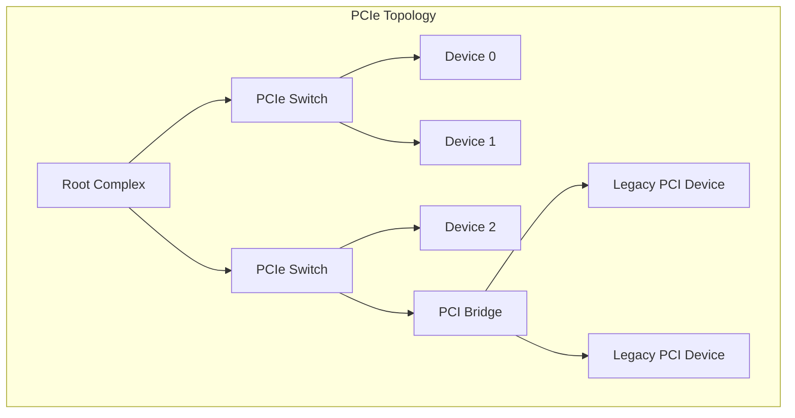
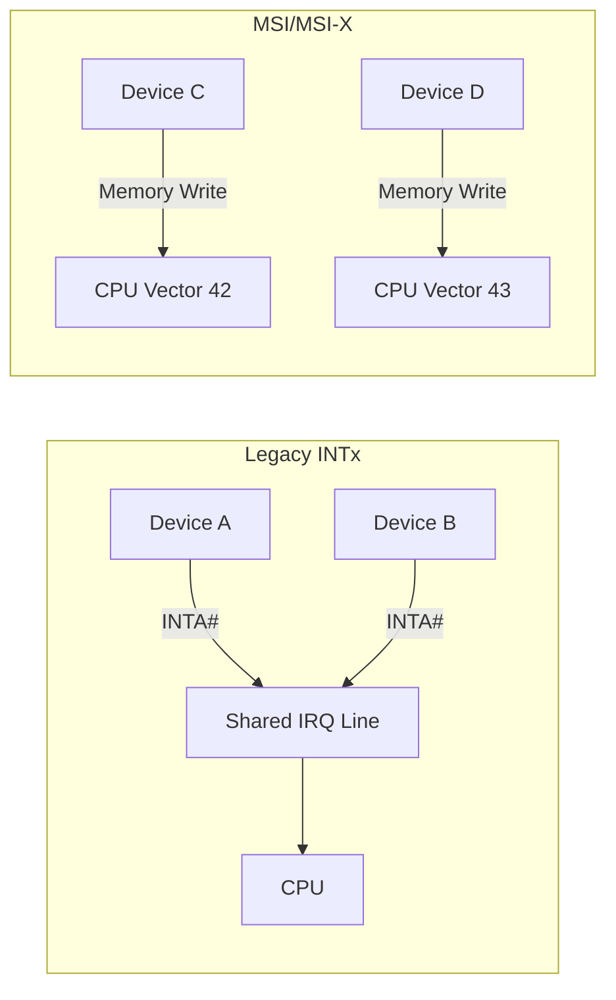

# PCI Subsystem

The **PCI (Peripheral Component Interconnect)** subsystem manages the
discovery, configuration, and operation of PCI and PCIe devices. PCI is
the standard bus for connecting high-performance peripherals — network
cards, GPUs, NVMe controllers, RAID controllers, and more — to the CPU.

---

## 1. PCI Bus Architecture



### PCI vs PCIe

| Feature | PCI (Parallel) | PCIe (Serial) |
|---|---|---|
| Topology | Shared parallel bus | Point-to-point links |
| Bandwidth | 133 MB/s (32-bit/33MHz) | Up to 64 GB/s per lane (Gen 5) |
| Enumeration | Bus/Device/Function | Same addressing, but link-based |
| Interrupts | INTx (shared) | MSI/MSI-X (per-vector) |
| Hot-plug | Limited | Full support |

---

## 2. PCI Configuration Space

Every PCI device has a **256-byte configuration space** (4096 bytes for
PCIe) that describes the device's capabilities and is accessible even
before the device driver loads.

### Configuration Header (Type 0 — Endpoint)

```text
Offset  Size  Field
0x00    2     Vendor ID
0x02    2     Device ID
0x04    2     Command
0x06    2     Status
0x08    1     Revision ID
0x09    1     Programming Interface
0x0A    1     Subclass
0x0B    1     Class Code
0x0C    1     Cache Line Size
0x0D    1     Latency Timer
0x0E    1     Header Type
0x0F    1     BIST
0x10    4     BAR 0
0x14    4     BAR 1
0x18    4     BAR 2
0x1C    4     BAR 3
0x20    4     BAR 4
0x24    4     BAR 5
0x28    4     CardBus CIS Pointer
0x2C    2     Subsystem Vendor ID
0x2E    2     Subsystem ID
0x30    4     Expansion ROM Base
0x34    1     Capabilities Pointer
0x3C    1     Interrupt Line
0x3D    1     Interrupt Pin
```

### Viewing Configuration Space

```bash
# Raw hex dump
$ sudo lspci -xxx -s 00:1f.2
00: 86 80 02 28 07 04 b0 02 05 01 01 06 00 00 00 00
10: 01 f0 00 00 00 00 00 00 01 e0 00 00 00 00 00 00

# Human-readable
$ lspci -v -s 00:1f.2
00:1f.2 SATA controller: Intel Corporation 82801HR/HO/HH
    (ICH8R/DO/DH) 6 port SATA AHCI Controller
    Flags: bus master, 66MHz, medium devsel, latency 0, IRQ 26
    I/O ports at f0b0 [size=8]
    I/O ports at f0a0 [size=4]
    I/O ports at f090 [size=8]
    I/O ports at f080 [size=4]
    Memory at fe9ff800 (32-bit, non-prefetchable) [size=2K]
```

---

## 3. Base Address Registers (BARs)

BARs describe the device's **memory-mapped I/O (MMIO)** or **port I/O**
regions. There are 6 BARs for an endpoint device.

### BAR Types

| Type | Bit 0 | Description |
|---|---|---|
| Memory BAR | 0 | MMIO region (32-bit or 64-bit) |
| I/O BAR | 1 | Port I/O region (legacy) |

### 32-bit Memory BAR

```text
Bit 31..4: Base address (aligned)
Bit 3:     Prefetchable
Bit 2..1:  Type (00=32-bit, 10=64-bit)
Bit 0:     0 (memory)
```

### 64-bit Memory BAR

Uses two consecutive BARs (BAR[n] and BAR[n+1]) for a 64-bit address.

### Reading BARs in a Driver

```c
/* Get BAR resource */
struct resource *res = pci_resource_start(pdev, 0);
resource_size_t start = pci_resource_start(pdev, 0);
resource_size_t len = pci_resource_len(pdev, 0);

/* Map MMIO */
void __iomem *base = pci_iomap(pdev, 0, len);
if (!base)
    return -ENOMEM;

/* Read/write MMIO */
u32 val = ioread32(base + REG_OFFSET);
iowrite32(val | FLAG, base + REG_OFFSET);
```

---

## 4. PCI Driver Registration

### 4.1 `pci_device_id` Table

Every PCI driver declares which devices it supports:

```c
static const struct pci_device_id my_pci_ids[] = {
    { PCI_DEVICE(VENDOR_ID, DEVICE_ID) },
    { PCI_DEVICE(PCI_VENDOR_ID_INTEL, 0x2822) },
    { PCI_DEVICE_CLASS(PCI_CLASS_STORAGE_SATA, 0xffffff) },
    { 0, }  /* terminator */
};
MODULE_DEVICE_TABLE(pci, my_pci_ids);
```

### 4.2 `pci_driver` Structure

```c
static struct pci_driver my_pci_driver = {
    .name       = "my_pci",
    .id_table   = my_pci_ids,
    .probe      = my_pci_probe,
    .remove     = my_pci_remove,
    .shutdown   = my_pci_shutdown,
    .driver     = {
        .pm = &my_pm_ops,  /* power management */
    },
};
```

### 4.3 Probe and Remove

```c
static int my_pci_probe(struct pci_dev *pdev,
                        const struct pci_device_id *id)
{
    int err;
    void __iomem *base;

    /* Enable the device */
    err = pci_enable_device(pdev);
    if (err)
        return err;

    /* Request MMIO region */
    err = pci_request_regions(pdev, "my_pci");
    if (err)
        goto err_disable;

    /* Map BAR 0 */
    base = pci_iomap(pdev, 0, 0);
    if (!base) {
        err = -ENOMEM;
        goto err_regions;
    }

    /* Enable bus mastering (for DMA) */
    pci_set_master(pdev);

    /* Set DMA mask */
    err = dma_set_mask_and_coherent(&pdev->dev, DMA_BIT_MASK(64));
    if (err)
        err = dma_set_mask_and_coherent(&pdev->dev, DMA_BIT_MASK(32));

    /* Store driver data */
    pci_set_drvdata(pdev, base);

    /* ... initialize hardware, register with subsystem ... */

    return 0;

err_regions:
    pci_release_regions(pdev);
err_disable:
    pci_disable_device(pdev);
    return err;
}

static void my_pci_remove(struct pci_dev *pdev)
{
    void __iomem *base = pci_get_drvdata(pdev);

    /* ... unregister from subsystem ... */

    pci_iounmap(pdev, base);
    pci_release_regions(pdev);
    pci_disable_device(pdev);
}
```

### 4.4 Module Registration

```c
module_pci_driver(my_pci_driver);
```

This expands to `module_init` + `module_exit` that calls
`pci_register_driver` / `pci_unregister_driver`.

---

## 5. MSI and MSI-X Interrupts

PCI defines two message-signaled interrupt mechanisms:

### 5.1 MSI (Message Signaled Interrupts)

```c
/* Allocate up to 32 vectors */
int nvec = pci_alloc_irq_vectors(pdev, 1, 32, PCI_IRQ_MSI);
if (nvec < 0)
    return nvec;

/* Request IRQ for vector 0 */
int irq = pci_irq_vector(pdev, 0);
err = request_irq(irq, my_irq_handler, 0, "my_pci", my_data);
```

### 5.2 MSI-X (Extended MSI)

MSI-X supports up to **2048 vectors** and allows per-vector address
and data configuration:

```c
/* Allocate MSI-X vectors */
int nvec = pci_alloc_irq_vectors(pdev, 1, 256,
                                  PCI_IRQ_MSI | PCI_IRQ_MSIX);
if (nvec < 0)
    return nvec;

/* Request multiple vectors */
for (int i = 0; i < nvec; i++) {
    int irq = pci_irq_vector(pdev, i);
    err = request_irq(irq, my_irq_handler, 0, "my_pci", &my_data[i]);
}
```

### MSI vs Legacy INTx



| Feature | INTx | MSI | MSI-X |
|---|---|---|---|
| Vectors | 1 (shared) | Up to 32 | Up to 2048 |
| Sharing | Yes | No | No |
| CPU affinity | No | Limited | Per-vector |
| Latency | Higher | Lower | Lowest |
| Requires line | Yes | No | No |

---

## 6. PCI DMA

### 6.1 Streaming DMA

```c
/* Map a buffer for DMA (device reads from it) */
dma_addr_t dma = dma_map_single(&pdev->dev, buf, len,
                                 DMA_TO_DEVICE);
if (dma_mapping_error(&pdev->dev, dma))
    return -ENOMEM;

/* Program device with DMA address */
iowrite32(lower_32_bits(dma), base + DMA_ADDR_LOW);
iowrite32(upper_32_bits(dma), base + DMA_ADDR_HIGH);

/* Unmap after DMA completes */
dma_unmap_single(&pdev->dev, dma, len, DMA_TO_DEVICE);
```

### 6.2 Coherent DMA (Consistent Memory)

```c
void *buf;
dma_addr_t dma;

buf = dma_alloc_coherent(&pdev->dev, size, &dma, GFP_KERNEL);
if (!buf)
    return -ENOMEM;

/* buf and dma are always coherent — no map/unmap needed */
/* ... use buf ... */

dma_free_coherent(&pdev->dev, size, buf, dma);
```

---

## 7. PCIe Capabilities

PCIe devices expose capabilities via a linked list in config space:

```c
/* Find a capability */
int pos = pci_find_capability(pdev, PCI_CAP_ID_EXP);
if (pos) {
    u16 link_status;
    pci_read_config_word(pdev, pos + PCI_EXP_LNKSTA, &link_status);
    int speed = link_status & PCI_EXP_LNKSTA_CLS;
    int width = (link_status & PCI_EXP_LNKSTA_NLW) >> 4;
    pr_info("PCIe link: Gen%d x%d\n", speed, width);
}
```

### Common Capabilities

| ID | Capability |
|---|---|
| `PCI_CAP_ID_PM` | Power Management |
| `PCI_CAP_ID_MSI` | MSI |
| `PCI_CAP_ID_EXP` | PCIe |
| `PCI_CAP_ID_MSIX` | MSI-X |

### Extended Capabilities (PCIe)

```c
int pos = pci_find_ext_capability(pdev, PCI_EXT_CAP_ID_SRIOV);
int pos = pci_find_ext_capability(pdev, PCI_EXT_CAP_ID_AER);
```

---

## 8. SR-IOV (Single Root I/O Virtualization)

SR-IOV allows a single physical device to present multiple **Virtual
Functions (VFs)** that can be assigned to virtual machines:

```c
/* Enable SR-IOV */
pci_enable_sriov(pdev, num_vfs);

/* Each VF appears as a separate PCI device */
/* /sys/bus/pci/devices/0000:01:00.1 (VF 0) */
/* /sys/bus/pci/devices/0000:01:00.2 (VF 1) */

/* Disable */
pci_disable_sriov(pdev);
```

---

## 9. sysfs Interface

```bash
$ ls /sys/bus/pci/devices/0000:00:1f.2/
boot_vga     config    device    driver_override  enable
irq          local_cpus  modalias  msi_bus        numa_node
power/       remove    rescan    resource         resource0
rom          subsystem  subsystem_vendor  uevent   vendor

# Read vendor/device ID
$ cat /sys/bus/pci/devices/0000:00:1f.2/vendor
0x8086
$ cat /sys/bus/pci/devices/0000:00:1f.2/device
0x2822

# Read class
$ cat /sys/bus/pci/devices/0000:00:1f.2/class
0x010601

# Current driver
$ ls /sys/bus/pci/devices/0000:00:1f.2/driver
ahci
```

---

## 10. `lspci` — PCI Enumeration Tool

```bash
# List all PCI devices
$ lspci

# Detailed info
$ lspci -vvv

# Show kernel driver
$ lspci -k

# Show capabilities
$ lspci -vvv -s 00:1f.2

# Tree view
$ lspci -t
```

---

## 11. PCI Driver Example — NVMe (Simplified)

```c
static const struct pci_device_id nvme_id_table[] = {
    { PCI_DEVICE_CLASS(PCI_CLASS_STORAGE_EXPRESS, 0xffffff) },
    { 0, }
};

static int nvme_probe(struct pci_dev *pdev,
                      const struct pci_device_id *id)
{
    /* 1. Enable device, request regions */
    pci_enable_device(pdev);
    pci_request_mem_regions(pdev, "nvme");

    /* 2. Map BAR 0 (controller registers) */
    void __iomem *bar = pci_iomap(pdev, 0, 0);

    /* 3. Allocate admin queues */
    nvme_alloc_admin_queues(bar);

    /* 4. Enable MSI-X */
    pci_alloc_irq_vectors(pdev, 1, max_vectors, PCI_IRQ_MSIX);

    /* 5. Create I/O queues */
    nvme_create_io_queues();

    /* 6. Register block device */
    add_disk(disk);

    return 0;
}
```

---

## Further Reading

- [Linux kernel docs — PCI](https://docs.kernel.org/driver-api/pci.html)
- [PCI-SIG — PCI Express Base Specification](https://pcisig.com/specifications)
- [LWN: PCI driver programming](https://lwn.net/Articles/339021/)
- [Linux Device Drivers, 3rd Ed — Chapter 12](https://lwn.net/Kernel/LDD3/)
- [kernel.org — drivers/pci/](https://git.kernel.org/pub/scm/linux/kernel/git/torvalds/linux.git/tree/drivers/pci)

## Related Topics

- [Driver Model Overview](overview.md) — bus/device/driver framework
- [Character Devices](char-devices.md) — PCI character device drivers
- [USB Subsystem](usb.md) — another discoverable bus
- [Device Tree](device-tree.md) — non-discoverable devices
- [Kernel APIs](../apis.md) — DMA and MMIO helpers
