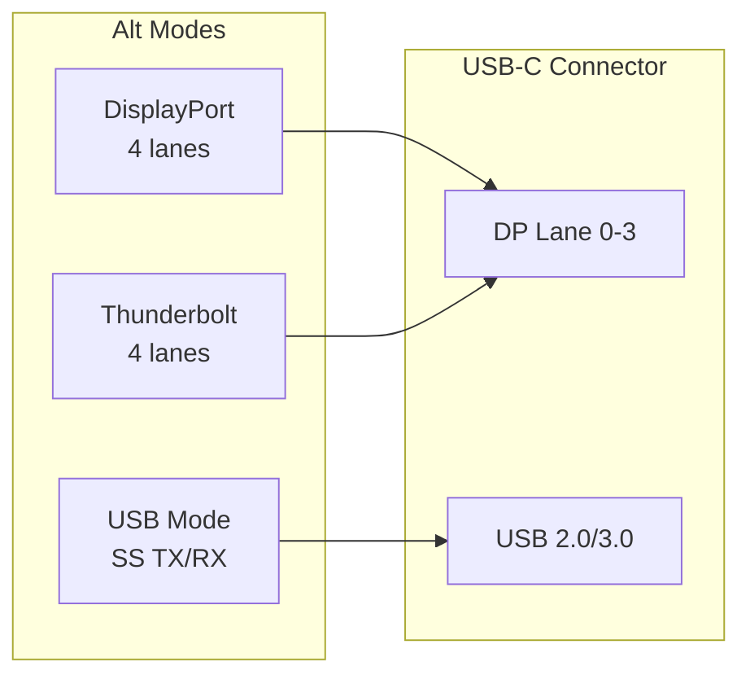

# PHY Framework

The PHY framework in the Linux kernel provides a unified interface for
managing **physical layer transceivers** — the hardware that converts digital
signals to analog (and vice versa) for communication buses like USB, SATA,
PCIe, Ethernet, and MIPI.  The framework decouples PHY consumers (controllers)
from PHY providers (platform drivers), enabling code reuse and clean device
tree bindings.

---

## 1. Background: What Is a PHY?

A PHY (physical layer transceiver) sits between the digital logic of a
controller and the physical medium (copper cable, fiber, RF).  It handles:

* **SerDes** (serializer/deserializer) — parallel-to-serial conversion
* **Equalization** — signal conditioning
* **Clock recovery** — extracting timing from the signal
* **Link training** — negotiating speed, lanes, and encoding

Examples: USB 3.0 PHY, SATA PHY, PCIe PHY, Ethernet SGMII/RGMII PHY,
MIPI D-PHY, HDMI PHY.

---

## 2. Architecture

```
┌─────────────────┐         ┌─────────────────┐
│  PHY Consumer   │         │  PHY Provider   │
│  (USB host ctrl)│         │  (platform PHY  │
│                 │         │   driver)       │
│  phy =          │         │                 │
│  devm_phy_get() │────────►│  .xlate()       │
│  phy_init()     │         │  .init()        │
│  phy_power_on() │         │  .power_on()    │
│  phy_set_mode() │         │  .set_mode()    │
│                 │         │                 │
└─────────────────┘         └─────────────────┘
         │                          │
         │    ┌──────────────┐      │
         └───►│  PHY Core    │◄─────┘
              │  (genphy)    │
              │              │
              │  struct phy  │
              │  struct      │
              │  phy_provider│
              └──────────────┘
```

### 2.1 Key Structures

| Structure | Role |
|---|---|
| `struct phy` | Represents a single PHY instance |
| `struct phy_ops` | Operations the provider implements |
| `struct phy_provider` | Registers the provider with the framework |
| `struct phy_configure_opts` | Configuration for MIPI/DP PHYs |

---

## 3. PHY Provider

The PHY provider is the driver that owns the physical hardware.  It registers
with the PHY framework and implements the callback operations.

### 3.1 Registering a Provider

```c
static struct phy *my_phy_xlate(struct device *dev,
                                struct of_phandle_args *args)
{
    /* Parse device tree args, return a phy pointer */
    struct my_phy *priv = dev_get_drvdata(dev);
    return priv->phy;
}

static int my_phy_probe(struct platform_device *pdev)
{
    struct phy_provider *provider;

    provider = devm_of_phy_provider_register(&pdev->dev, my_phy_xlate);
    if (IS_ERR(provider))
        return PTR_ERR(provider);

    return 0;
}
```

### 3.2 Provider Operations

```c
static const struct phy_ops my_phy_ops = {
    .init       = my_phy_init,
    .exit       = my_phy_exit,
    .power_on   = my_phy_power_on,
    .power_off  = my_phy_power_off,
    .set_mode   = my_phy_set_mode,
    .configure  = my_phy_configure,   /* MIPI/DP */
    .validate   = my_phy_validate,
    .owner      = THIS_MODULE,
};
```

| Callback | When Called | Typical Action |
|---|---|---|
| `init` | `phy_init()` | Configure clocks, reset, basic setup |
| `exit` | `phy_exit()` | Undo init |
| `power_on` | `phy_power_on()` | Enable PHY power, start PLL |
| `power_off` | `phy_power_off()` | Disable PHY power |
| `set_mode` | `phy_set_mode()` | Configure for USB/PCIe/SATA/etc. |
| `configure` | MIPI/DP configuration | Set D-PHY timings, voltage swing |
| `validate` | Sanity check | Verify the requested mode is supported |

### 3.3 Device Tree Binding

```dts
usb_phy: phy@10000000 {
    compatible = "vendor,usb-phy";
    reg = <0x10000000 0x1000>;
    clocks = <&clks 12>;
    clock-names = "phy";
    #phy-cells = <0>;
};

usb_controller: usb@20000000 {
    phys = <&usb_phy>;
    phy-names = "usb";
};
```

`#phy-cells = <0>` means no arguments.  For multi-lane PHYs:

```dts
pcie_phy: phy@30000000 {
    compatible = "vendor,pcie-phy";
    #phy-cells = <1>;   /* argument = lane number */
};

pcie_controller: pcie@40000000 {
    phys = <&pcie_phy 0>, <&pcie_phy 1>;
    phy-names = "pcie-lane0", "pcie-lane1";
};
```

---

## 4. PHY Consumer

The consumer is the controller driver that uses the PHY (USB host, SATA
controller, PCIe RC, etc.).

### 4.1 Getting a PHY

```c
/* Single PHY */
struct phy *phy = devm_phy_get(&pdev->dev, "usb");
if (IS_ERR(phy))
    return PTR_ERR(phy);

/* Optional PHY (may be NULL on some boards) */
struct phy *phy = devm_phy_optional_get(&pdev->dev, "sata");
```

### 4.2 Using a PHY

```c
/* Initialize the PHY */
ret = phy_init(phy);
if (ret)
    return ret;

/* Set the operating mode */
ret = phy_set_mode(phy, PHY_MODE_USB_HOST);
if (ret)
    goto err_exit;

/* Power on */
ret = phy_power_on(phy);
if (ret)
    goto err_exit;

/* ... use the controller ... */

/* Power off and exit */
phy_power_off(phy);
phy_exit(phy);
```

### 4.3 PHY Modes

| Mode | Enum | Use Case |
|---|---|---|
| USB Host | `PHY_MODE_USB_HOST` | USB host controller |
| USB Device | `PHY_MODE_USB_DEVICE` | USB gadget |
| PCIe | `PHY_MODE_PCIE` | PCIe root complex / endpoint |
| SATA | `PHY_MODE_SATA` | SATA host |
| Ethernet | `PHY_MODE_ETHERNET` | MAC-to-PHY |
| MIPI DSI | `PHY_MODE_MIPI_DSI` | Display |
| MIPI CSI | `PHY_MODE_MIPI_CSI` | Camera |

---

## 5. Generic PHY (genphy)

The generic PHY driver (`drivers/phy/phy-core.c`) provides default
implementations for common operations.  If a provider doesn't implement a
callback, the generic version is used.

### 5.1 Generic Operations

| Operation | Generic Implementation |
|---|---|
| `init` | No-op (returns 0) |
| `exit` | No-op |
| `power_on` | Deassert reset, enable clocks |
| `power_off` | Disable clocks, assert reset |

### 5.2 When to Use Genphy

Simple PHYs that only need:

* Clock enable/disable
* Reset control
* Power domain on/off

More complex PHYs (SerDes, multi-lane, MIPI) must implement custom ops.

---

## 6. PHY Configure Options (MIPI/DP)

For MIPI D-PHY and DisplayPort PHYs, the framework provides structured
configuration:

```c
union phy_configure_opts {
    struct phy_configure_opts_mipi_dphy dphy;
    struct phy_configure_opts_dp dp;
};

/* Example: configure MIPI D-PHY */
union phy_configure_opts opts = {
    .dphy = {
        .clk_miss = 0,
        .clk_post = 60,
        .clk_pre = 8,
        .clk_prepare = 40,
        .clk_settle = 95,
        .clk_term_enable = 0,
        .clk_trail = 60,
        .hs_exit = 100,
        .hs_prepare = 40,
        .hs_settle = 85,
        .hs_skip = 40,
        .hs_trail = 60,
        .lp_exit = 24,
    },
};

phy_configure(phy, PHY_MODE_MIPI_DPHY, 0, &opts);
```

### 6.1 Validation

Before applying, the consumer can validate:

```c
ret = phy_validate(phy, PHY_MODE_MIPI_DPHY, 0, &opts);
if (ret) {
    /* configuration is not supported by this PHY */
}
```

---

## 7. Multi-Lane PHYs

Some interfaces use multiple PHY lanes:

* PCIe: 1, 2, 4, 8, or 16 lanes
* MIPI DSI: 1-4 data lanes
* Ethernet: SGMII (1 lane), XAUI (4 lanes)

The framework handles this by:

1. The provider returns different `struct phy` pointers for each lane.
2. The consumer requests each lane separately.
3. The provider coordinates lane initialization internally.

```c
/* Consumer requests two lanes */
phy0 = devm_phy_get(dev, "lane0");
phy1 = devm_phy_get(dev, "lane1");

phy_init(phy0);
phy_init(phy1);
phy_power_on(phy0);
phy_power_on(phy1);
```

---

## 8. SerDes (Serializer/Deserializer)

Many SoCs have generic SerDes blocks that can be configured for different
protocols:

```
SerDes lane 0 → PCIe
SerDes lane 1 → SATA
SerDes lane 2 → SGMII Ethernet
SerDes lane 3 → USB 3.0
```

The PHY framework handles this through `phy_set_mode()`:

```c
/* Configure SerDes for PCIe */
phy_set_mode(serdes_phy, PHY_MODE_PCIE);

/* Later, reconfigure for SATA */
phy_set_mode(serdes_phy, PHY_MODE_SATA);
```

The provider driver writes the appropriate PLL, equalization, and encoding
registers for the selected mode.

---

## 9. Power Management

### 9.1 Runtime PM

PHYs integrate with Linux runtime PM:

```c
/* In the consumer's runtime_suspend: */
phy_power_off(phy);

/* In the consumer's runtime_resume: */
phy_power_on(phy);
```

### 9.2 System Suspend/Resume

```c
/* In the consumer's suspend callback: */
phy_power_off(phy);
phy_exit(phy);

/* In resume: */
phy_init(phy);
phy_power_on(phy);
```

The PHY framework handles the reference counting so that multiple consumers
sharing a PHY don't conflict.

---

## 10. PHY Subsystem Layout

```
drivers/phy/
├── phy-core.c              # Core framework
├── generic/
│   └── phy.c               # Generic PHY operations
├── freescale/
│   ├── phy-fsl-imx8mq-usb.c
│   └── phy-fsl-lynx-28g.c
├── samsung/
│   └── phy-exynos-usb.c
├── ti/
│   └── phy-ti-pipe3.c
├── qualcomm/
│   └── phy-qcom-qmp.c
├── broadcom/
│   └── phy-bcm-ns-usb.c
└── ...
```

---

## 14. USB Type-C and Alt Mode

USB Type-C connectors support **alternate modes** (Alt Modes) that
repurpose the USB-C pins for DisplayPort, Thunderbolt, or other
protocols. The PHY framework handles the mode switching.

### Type-C Mode Switching



### Type-C PHY Operations

```c
/* Type-C mode switch callback */
static int my_phy_set_mode(struct phy *phy, enum phy_mode mode, int submode)
{
    struct my_phy_priv *priv = phy_get_drvdata(phy);

    switch (mode) {
    case PHY_MODE_USB_HOST:
        /* Configure for USB 3.0 host */
        my_phy_set_usb3(priv);
        break;
    case PHY_MODE_USB_DEVICE:
        /* Configure for USB 3.0 device */
        my_phy_set_usb3_device(priv);
        break;
    case PHY_MODE_DP:
        /* Configure for DisplayPort Alt Mode */
        my_phy_set_dp(priv, submode);
        break;
    default:
        return -EINVAL;
    }
    return 0;
}
```

## 15. PHY Calibration and Tuning

Some PHYs require runtime calibration to compensate for process
variations, temperature, and voltage:

### Calibration Types

| Type | Description | Typical PHY |
|---|---|---|
| Impedance | Adjust output impedance | Ethernet RGMII |
| Skew | Adjust TX/RX timing | USB 3.0, PCIe |
| Equalization | Signal conditioning | SerDes, PCIe |
| Eye diagram | Optimize signal quality | High-speed SerDes |

### Device Tree Calibration Properties

```dts
phy@10000000 {
    compatible = "vendor,usb-phy";
    /* Calibration parameters */
    vendor,tx-impedance = <45>;     /* ohms */
    vendor,rx-impedance = <50>;
    vendor,tx-skew = <2>;           /* delay taps */
    vendor,rx-skew = <3>;
    vendor,eq-pre = <5>;            /* pre-emphasis */
    vendor,eq-post = <3>;           /* post-cursor */
};
```

### Runtime Tuning via sysfs

```bash
# View PHY attributes (if exposed)
$ ls /sys/class/phy/phy*/
# power  subsystem  uevent

# Some vendors expose tuning via debugfs
$ ls /sys/kernel/debug/phy*/
# tx_swing  rx_equalization  lane_polarity
```

## 16. PHY Error Handling

### Common PHY Errors

| Error | Cause | Solution |
|---|---|---|
| PLL lock timeout | Clock not stable | Check reference clock |
| Signal detect fail | No link partner | Check cable/connector |
| Training failure | Speed negotiation fail | Lower speed, check signals |
| Elastic buffer overflow | Clock domain crossing | Check rate matching config |

### Error Recovery

```c
static int my_phy_init(struct phy *phy)
{
    struct my_phy_priv *priv = phy_get_drvdata(phy);
    int ret;

    /* Attempt PLL lock */
    ret = my_phy_wait_pll_lock(priv, 1000);  /* 1ms timeout */
    if (ret) {
        dev_err(&phy->dev, "PLL lock timeout\n");
        /* Try recovery: reset and retry */
        my_phy_reset(priv);
        ret = my_phy_wait_pll_lock(priv, 2000);
        if (ret)
            return ret;
    }

    return 0;
}
```

## 17. PHY Power Domains

PHYs often share power domains with their associated controllers.
The PHY framework integrates with the power domain framework:

```c
/* PHY automatically powers on its power domain when phy_power_on() is called */
/* If the PHY uses a power domain, the framework handles PM runtime */

/* Device tree */
phy: phy@10000000 {
    power-domains = <&power 0>;
    /* ... */
};
```

## 18. PHY Debugging Extended

### Common Diagnostic Commands

```bash
# List all registered PHYs
$ ls /sys/class/phy/
phy-usb-0  phy-pcie-0  phy-sata-0

# Check PHY power state
$ cat /sys/class/phy/phy-usb-0/power/runtime_status
active

# Device tree PHY references
$ ls /sys/firmware/devicetree/base/soc/phy*/
compatible  reg  clocks  resets  #phy-cells

# Trace PHY calls
$ echo 'module phy_core =p' > /sys/kernel/debug/dynamic_debug/control
$ dmesg -w | grep phy

# Check PHY provider
$ cat /sys/class/phy/phy-usb-0/of_node/compatible
vendor,usb-phy
```

### PHY Health Monitoring

```c
/* Check PHY link status */
static bool my_phy_link_is_up(struct phy *phy)
{
    struct my_phy_priv *priv = phy_get_drvdata(phy);
    u32 status;

    regmap_read(priv->regs, PHY_STATUS_REG, &status);
    return !!(status & PHY_LINK_UP_BIT);
}
```

## 19. Comparison with Other Subsystems

| Subsystem | Purpose | Scope |
|---|---|---|
| **PHY framework** | Physical layer transceivers | USB, SATA, PCIe, MIPI |
| **Generic PHY** | Simple clock/reset | All simple PHYs |
| **MDIO/PHYLIB** | Ethernet MDIO bus PHYs | Ethernet only |
| **Clock framework** | Clock trees | Clocks only |
| **Regulator framework** | Power supplies | Power only |
| **Reset framework** | Reset lines | Reset control only |

Note: Ethernet PHYs use the **MDIO/PHYLIB** subsystem
(`drivers/net/phy/`), not the generic PHY framework.  The generic PHY
framework handles the SerDes between the MAC and the MDIO PHY.

## 20. Further Reading

* **Documentation: `Documentation/driver-api/phy/phy.rst`**
* **Source: `drivers/phy/phy-core.c`**
* **Device tree bindings: `Documentation/devicetree/bindings/phy/`**
* **LWN: [The PHY subsystem](https://lwn.net/Articles/574851/)**
* **Kishon Vijay Abraham's PHY framework patches (2013)**

---

## Cross-References

* [USB](./usb.md) — USB host and device controllers
* [PCIe](./pci.md) — PCI Express
* [SATA](./sata.md) — Serial ATA
* [Ethernet](../networking/ethernet.md) — MDIO PHY subsystem
* [Clock Framework](./clocks.md) — clock management
* [Regulator Framework](./regulators.md) — power supply management
* [Device Tree](./devicetree.md) — hardware description
