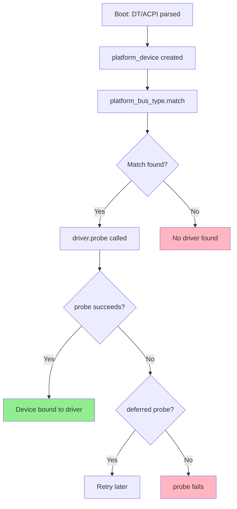

# Platform Drivers

## Introduction

Platform drivers are the most common driver type in the embedded Linux ecosystem. They handle devices that are directly integrated into a System-on-Chip (SoC) — UARTs, I2C controllers, SPI masters, GPIO controllers, timers, watchdogs, DMA engines, and more. Unlike PCI or USB devices which have standardized discovery mechanisms, platform devices are described by firmware (device tree on modern systems, or board files on legacy kernels) and are matched to drivers via the platform bus.

The platform driver model is built on the Linux device model's bus-driver-device trinity. The `platform_bus_type` acts as the bus, `platform_device` represents the hardware, and `platform_driver` provides the driver. The key insight is that platform devices are *not* discoverable — the kernel must be told they exist, either through device tree, ACPI, or static board configuration.

## Core Data Structures

### struct platform_device

```c
struct platform_device {
    const char *name;
    int id;
    bool id_auto;
    struct device dev;
    u64 platform_dma_mask;
    u32 num_resources;
    struct resource *resource;
    const struct platform_device_id *id_entry;
    const char *driver_override;  /* force specific driver */
    /* MFD cell pointer */
    struct mfd_cell *mfd_cell;
    /* arch specific additions */
    struct pdev_archdata archdata;
};
```

The `resource` array describes memory regions and IRQs:

```c
struct resource {
    resource_size_t start;
    resource_size_t end;
    const char *name;
    unsigned long flags;   /* IORESOURCE_MEM, IORESOURCE_IRQ, etc. */
    struct resource *parent, *sibling, *child;
};

/* Resource flags */
#define IORESOURCE_MEM       0x00000200
#define IORESOURCE_IRQ       0x00000400
#define IORESOURCE_DMA       0x00000800
#define IORESOURCE_BUS       0x00001000
#define IORESOURCE_PREFETCH  0x00002000
#define IORESOURCE_READONLY  0x00004000
#define IORESOURCE_CACHEABLE 0x00008000
#define IORESOURCE_SHADOWABLE 0x00010000
```

### struct platform_driver

```c
struct platform_driver {
    int (*probe)(struct platform_device *);
    int (*remove)(struct platform_device *);
    void (*shutdown)(struct platform_device *);
    int (*suspend)(struct platform_device *, pm_message_t state);
    int (*resume)(struct platform_device *);
    struct device_driver driver;
    const struct platform_device_id *id_table;
    bool prevent_deferred_probe;
};
```

## Device Tree Matching

The modern way to match platform devices to drivers is through device tree compatible strings:

### Device Tree Node Example

```dts
/* arch/arm64/boot/dts/vendor/soc.dtsi */
uart0: serial@10010000 {
    compatible = "vendor,soc-uart";
    reg = <0x10010000 0x1000>;
    interrupts = <GIC_SPI 10 IRQ_TYPE_LEVEL_HIGH>;
    clocks = <&clk_uart>;
    clock-names = "apb";
    status = "disabled";
};

/* arch/arm64/boot/dts/vendor/board.dts */
&uart0 {
    status = "okay";
    current-speed = <115200>;
    hw-flow-control;
};
```

### Driver with DT Matching

```c
#include <linux/module.h>
#include <linux/platform_device.h>
#include <linux/of.h>
#include <linux/of_device.h>
#include <linux/io.h>
#include <linux/interrupt.h>
#include <linux/clk.h>

struct my_uart {
    void __iomem *base;
    struct clk *clk;
    int irq;
    struct uart_port port;
};

/* OF match table — must be in MODULE_DEVICE_TABLE */
static const struct of_device_id my_uart_of_match[] = {
    { .compatible = "vendor,soc-uart" },
    { /* sentinel */ }
};
MODULE_DEVICE_TABLE(of, my_uart_of_match);

/* Alternative: platform_device_id table for non-DT systems */
static const struct platform_device_id my_uart_id_table[] = {
    { .name = "soc-uart" },
    { /* sentinel */ }
};
MODULE_DEVICE_TABLE(platform, my_uart_id_table);

static int my_uart_probe(struct platform_device *pdev)
{
    struct my_uart *uart;
    struct resource *res;
    int ret;
    
    uart = devm_kzalloc(&pdev->dev, sizeof(*uart), GFP_KERNEL);
    if (!uart)
        return -ENOMEM;
    
    platform_set_drvdata(pdev, uart);
    
    /* Get memory resource from device tree reg property */
    res = platform_get_resource(pdev, IORESOURCE_MEM, 0);
    if (!res)
        return -ENODEV;
    
    uart->base = devm_ioremap_resource(&pdev->dev, res);
    if (IS_ERR(uart->base))
        return PTR_ERR(uart->base);
    
    /* Get IRQ from device tree interrupts property */
    uart->irq = platform_get_irq(pdev, 0);
    if (uart->irq < 0)
        return uart->irq;
    
    /* Get clock */
    uart->clk = devm_clk_get(&pdev->dev, "apb");
    if (IS_ERR(uart->clk))
        return PTR_ERR(uart->clk);
    
    ret = clk_prepare_enable(uart->clk);
    if (ret)
        return ret;
    
    /* Read optional DT properties */
    u32 baud;
    if (of_property_read_u32(pdev->dev.of_node, "current-speed", &baud) == 0)
        dev_info(&pdev->dev, "configured for %u baud\n", baud);
    
    if (of_property_read_bool(pdev->dev.of_node, "hw-flow-control"))
        dev_info(&pdev->dev, "hardware flow control enabled\n");
    
    /* Register with subsystem */
    ret = my_uart_register(uart);
    if (ret) {
        clk_disable_unprepare(uart->clk);
        return ret;
    }
    
    dev_info(&pdev->dev, "probed successfully\n");
    return 0;
}

static int my_uart_remove(struct platform_device *pdev)
{
    struct my_uart *uart = platform_get_drvdata(pdev);
    
    my_uart_unregister(uart);
    clk_disable_unprepare(uart->clk);
    
    return 0;
}

/* Power management */
static int my_uart_suspend(struct device *dev)
{
    struct my_uart *uart = dev_get_drvdata(dev);
    /* Save state, disable hardware */
    clk_disable_unprepare(uart->clk);
    return 0;
}

static int my_uart_resume(struct device *dev)
{
    struct my_uart *uart = dev_get_drvdata(dev);
    clk_prepare_enable(uart->clk);
    /* Restore state */
    return 0;
}

static DEFINE_SIMPLE_DEV_PM_OPS(my_uart_pm_ops,
                                  my_uart_suspend, my_uart_resume);

static struct platform_driver my_uart_driver = {
    .probe  = my_uart_probe,
    .remove = my_uart_remove,
    .driver = {
        .name = "my-uart",
        .of_match_table = my_uart_of_match,
        .pm = &my_uart_pm_ops,
    },
    .id_table = my_uart_id_table,
};

module_platform_driver(my_uart_driver);

MODULE_LICENSE("GPL");
MODULE_DESCRIPTION("My UART platform driver");
```

## Resource Management with devm_*

The `devm_*` (device-managed) APIs tie resource lifetimes to the device, eliminating cleanup on error paths:

```c
static int my_probe(struct platform_device *pdev)
{
    struct device *dev = &pdev->dev;
    struct my_data *data;
    
    /* devm_kzalloc: freed automatically on driver detach */
    data = devm_kzalloc(dev, sizeof(*data), GFP_KERNEL);
    if (!data)
        return -ENOMEM;
    
    /* devm_ioremap_resource: unmapped automatically */
    struct resource *res = platform_get_resource(pdev, IORESOURCE_MEM, 0);
    data->regs = devm_ioremap_resource(dev, res);
    if (IS_ERR(data->regs))
        return PTR_ERR(data->regs);
    
    /* devm_clk_get: disabled + unprepared automatically */
    data->clk = devm_clk_get(dev, NULL);
    
    /* devm_regulator_get: disabled automatically */
    data->supply = devm_regulator_get(dev, "vdd");
    
    /* devm_request_irq: freed automatically */
    int irq = platform_get_irq(pdev, 0);
    ret = devm_request_irq(dev, irq, my_handler, 0, dev_name(dev), data);
    
    /* devm_reset_control_get: deasserted automatically */
    data->rst = devm_reset_control_get(dev, NULL);
    
    /* Manual resources still need explicit cleanup in remove */
    data->dma_buf = dma_alloc_coherent(dev, 4096, &data->dma, GFP_KERNEL);
    /* ... must be freed in my_remove */
    
    return 0;
}
```

## Device Tree Property APIs

```c
/* Simple properties */
const char *status;
of_property_read_string(node, "status", &status);

u32 val;
of_property_read_u32(node, "clock-frequency", &val);

/* Array properties */
u32 array[4];
of_property_read_u32_array(node, "reg", array, 4);

/* Boolean properties */
bool has_feature = of_property_read_bool(node, "vendor,feature-enable");

/* String list */
const char *names[3];
of_property_read_string_index(node, "clock-names", 0, &names[0]);
of_property_read_string_index(node, "clock-names", 1, &names[1]);

/* Counting variable-length properties */
int count = of_property_count_strings(node, "clock-names");
int u32_count = of_property_count_u32_elems(node, "reg");

/* Phandle references */
struct device_node *clk_node = of_parse_phandle(node, "clocks", 0);

/* GPIO lookup */
struct gpio_desc *gpio = devm_gpiod_get(dev, "reset", GPIOD_OUT_LOW);

/* Pinctrl */
struct pinctrl *pinctrl = devm_pinctrl_get(dev);
struct pinctrl_state *default_state = pinctrl_lookup_state(pinctrl, "default");
pinctrl_select_state(pinctrl, default_state);
```

## Matching Mechanism



The matching priority:
1. `of_match_table` — Device tree `compatible` strings
2. ACPI match table — ACPI `_HID`/`_CID` strings
3. `id_table` — `platform_device_id` name matching
4. `driver.name` — Simple name matching

## Probe Deferred Mechanism

When a driver's dependencies (clocks, regulators, GPIOs) aren't yet available, the driver returns `-EPROBE_DEFER`:

```c
static int my_probe(struct platform_device *pdev)
{
    struct my_data *data;
    
    data->clk = devm_clk_get(&pdev->dev, NULL);
    if (IS_ERR(data->clk)) {
        if (PTR_ERR(data->clk) == -EPROBE_DEFER)
            return -EPROBE_DEFER;  /* try again later */
        /* other errors: permanent failure */
        return dev_err_probe(&pdev->dev, PTR_ERR(data->clk),
                             "failed to get clock\n");
    }
    
    /* dev_err_probe handles -EPROBE_DEFER automatically */
    data->reg = devm_regulator_get(&pdev->dev, "vdd");
    if (IS_ERR(data->reg))
        return dev_err_probe(&pdev->dev, PTR_ERR(data->reg),
                             "failed to get regulator\n");
    
    return 0;
}
```

The deferred probe list can be inspected:

```bash
cat /sys/kernel/debug/deferred_probe
# shows devices waiting for dependencies
```

## Static Board Files (Legacy)

Before device tree, platform devices were registered statically:

```c
/* Legacy board file (arch/arm/mach-xxx/board.c) */
static struct resource my_uart_resources[] = {
    [0] = {
        .start = 0x10010000,
        .end   = 0x10010FFF,
        .flags = IORESOURCE_MEM,
    },
    [1] = {
        .start = IRQ_UART0,
        .end   = IRQ_UART0,
        .flags = IORESOURCE_IRQ,
    },
};

static struct platform_device my_uart_device = {
    .name = "my-uart",
    .id   = 0,
    .num_resources = ARRAY_SIZE(my_uart_resources),
    .resource = my_uart_resources,
};

static struct platform_device *board_devices[] __initdata = {
    &my_uart_device,
};

static int __init board_init(void)
{
    return platform_add_devices(board_devices, ARRAY_SIZE(board_devices));
}
```

## ACPI Matching

For x86/ACPI platforms:

```c
static const struct acpi_device_id my_acpi_match[] = {
    { "VEND0001" },    /* ACPI _HID */
    { "VEND0002" },
    { /* sentinel */ }
};
MODULE_DEVICE_TABLE(acpi, my_acpi_match);

static struct platform_driver my_driver = {
    .probe = my_probe,
    .driver = {
        .name = "my-driver",
        .acpi_match_table = my_acpi_match,
    },
};
```

## Subclassing Platform Drivers

Some subsystems (I2C, SPI, MDIO) have their own bus types but use platform_driver internally:

```c
/* An I2C device driver (uses i2c_driver, not platform_driver) */
static struct i2c_driver my_i2c_driver = {
    .probe = my_i2c_probe,
    .remove = my_i2c_remove,
    .driver = {
        .name = "my-sensor",
        .of_match_table = my_of_match,
    },
};

/* But the I2C *controller* driver is a platform driver */
static struct platform_driver my_i2c_controller = {
    .probe = my_i2c_ctrl_probe,
    .driver = {
        .name = "my-i2c-ctrl",
        .of_match_table = my_ctrl_of_match,
    },
};
```

## Debugging Platform Drivers

```bash
# List all platform devices
ls /sys/bus/platform/devices/
# 10010000.serial  10020000.i2c  ...

# Show device properties
cat /sys/bus/platform/devices/10010000.serial/of_node/compatible
# vendor,soc-uart

# Show driver bound to device
ls -la /sys/bus/platform/devices/10010000.serial/driver
# -> ../../../../bus/platform/drivers/my-uart

# List registered platform drivers
ls /sys/bus/platform/drivers/

# View kernel logs for probe results
dmesg | grep -i "probe"
# [    1.234567] my-uart 10010000.serial: probed successfully

# View deferred probes
cat /sys/kernel/debug/deferred_probe

# View device tree in sysfs
ls /sys/firmware/devicetree/base/
ls /sys/firmware/devicetree/base/serial@10010000/
cat /sys/firmware/devicetree/base/serial@10010000/compatible
hexdump -C /sys/firmware/devicetree/base/serial@10010000/reg
```

## References

- [GNU Project Documentation](https://www.gnu.org/doc/doc.html)
- [GNU Manuals](https://www.gnu.org/manual/manual.html)
- [Free Software Directory](https://directory.fsf.org/wiki/Main_Page)
- [Planet GNU](https://planet.gnu.org/)
- [Free Software Books](https://www.gnu.org/doc/other-free-books.html)

- *Linux Device Drivers, 3rd Edition* — Chapter 10: The Linux Device Model
- [Kernel documentation: Platform Devices](https://docs.kernel.org/driver-api/driver-model/platform.html)
- [Device Tree Usage](https://elinux.org/Device_Tree_Usage)
- [LWN: Devres device resource management](https://lwn.net/Articles/256637/)
- [Device Tree Specification](https://www.devicetree.org/specifications/)
- [Kernel docs: Writing platform drivers](https://docs.kernel.org/driver-api/driver-model/platform.html)

## Platform Driver Best Practices

### Error Handling with dev_err_probe

Modern kernels (5.15+) provide `dev_err_probe()` for cleaner error
handling in probe functions:

```c
static int my_probe(struct platform_device *pdev)
{
    struct device *dev = &pdev->dev;
    struct my_data *data;
    int ret;

    data = devm_kzalloc(dev, sizeof(*data), GFP_KERNEL);
    if (!data)
        return -ENOMEM;

    /* dev_err_probe handles -EPROBE_DEFER automatically */
    data->clk = devm_clk_get(dev, NULL);
    if (IS_ERR(data->clk))
        return dev_err_probe(dev, PTR_ERR(data->clk),
                             "failed to get clock\n");

    data->reg = devm_regulator_get(dev, "vdd");
    if (IS_ERR(data->reg))
        return dev_err_probe(dev, PTR_ERR(data->reg),
                             "failed to get regulator\n");

    data->rst = devm_reset_control_get(dev, NULL);
    if (IS_ERR(data->rst))
        return dev_err_probe(dev, PTR_ERR(data->rst),
                             "failed to get reset\n");

    return 0;
}
```

### Multi-Function Device (MFD) Pattern

SoC peripherals often combine multiple functions (GPIO + PWM + ADC).
The MFD framework creates child platform devices:

```c
#include <linux/mfd/core.h>

static struct mfd_cell my_mfd_cells[] = {
    { .name = "my-gpio", .of_compatible = "vendor,my-gpio" },
    { .name = "my-pwm",  .of_compatible = "vendor,my-pwm" },
    { .name = "my-adc",  .of_compatible = "vendor,my-adc" },
};

static int my_mfd_probe(struct platform_device *pdev)
{
    /* Map shared registers, get clocks, etc. */
    /* ... */

    /* Register child devices */
    return devm_mfd_add_devices(&pdev->dev, PLATFORM_DEVID_AUTO,
                                 my_mfd_cells,
                                 ARRAY_SIZE(my_mfd_cells),
                                 NULL, 0, NULL);
}
```

### Device Link Support

Device links express dependencies between devices, ensuring proper
probe ordering:

```c
/* In consumer driver's probe */
static int my_consumer_probe(struct platform_device *pdev)
{
    struct device *dev = &pdev->dev;
    struct device *supplier;

    supplier = platform_device_find("my-supplier");
    if (!supplier)
        return -EPROBE_DEFER;

    /* Create device link (DL_FLAG_AUTOPROBE_CONSUMER) */
    struct device_link *link = device_link_add(dev, supplier,
        DL_FLAG_AUTOPROBE_CONSUMER |
        DL_FLAG_PM_RUNTIME);

    if (!link)
        return -EINVAL;

    return 0;
}
```

### Runtime PM Integration

Platform drivers should integrate with runtime PM to save power when
the device is idle:

```c
static int my_suspend(struct device *dev)
{
    struct my_data *data = dev_get_drvdata(dev);

    /* Save hardware state */
    data->saved_reg = readl(data->base + MY_REG);

    /* Disable clocks */
    clk_disable_unprepare(data->clk);

    /* Disable regulator if not shared */
    regulator_disable(data->supply);

    return 0;
}

static int my_resume(struct device *dev)
{
    struct my_data *data = dev_get_drvdata(dev);

    /* Enable regulator */
    regulator_enable(data->supply);

    /* Enable clocks */
    clk_prepare_enable(data->clk);

    /* Restore hardware state */
    writel(data->saved_reg, data->base + MY_REG);

    return 0;
}

static int my_runtime_suspend(struct device *dev)
{
    struct my_data *data = dev_get_drvdata(dev);
    clk_disable_unprepare(data->clk);
    return 0;
}

static int my_runtime_resume(struct device *dev)
{
    struct my_data *data = dev_get_drvdata(dev);
    clk_prepare_enable(data->clk);
    return 0;
}

static DEFINE_DEV_PM_OPS(my_pm_ops,
                          my_suspend, my_resume,
                          my_runtime_suspend, my_runtime_resume);

static struct platform_driver my_driver = {
    .probe = my_probe,
    .remove = my_remove,
    .driver = {
        .name = "my-driver",
        .of_match_table = my_of_match,
        .pm = &my_pm_ops,
    },
};
```

## Platform Driver Checklist

When writing a platform driver, follow this checklist:

- [ ] Use `devm_*` APIs for resource management
- [ ] Return `-EPROBE_DEFER` for missing dependencies
- [ ] Use `dev_err_probe()` for error messages
- [ ] Implement runtime PM for power savings
- [ ] Use `of_match_table` for device tree matching
- [ ] Include `MODULE_DEVICE_TABLE(of, ...)` for autoload
- [ ] Use `platform_get_irq()` not `platform_get_resource(, IORESOURCE_IRQ)`
- [ ] Handle all error paths in `probe()`
- [ ] Clean up in `remove()` (or use devm_* to avoid it)
- [ ] Test with `CONFIG_DEBUG_DEVRES` enabled

## Related Topics

- [I2C and SPI](./i2c-spi.md) — Bus-level drivers using platform as controller base
- [GPIO](./gpio.md) — GPIO controller platform drivers
- [DMA](./dma.md) — DMA engine platform drivers
- [ACPI](./acpi.md) — ACPI-based device enumeration
- [Device Tree](../devicetree/index.md) — Device tree bindings and usage
- [Kernel Modules](../modules/index.md) — Module loading and initialization
- [Power Management](../power/index.md) — Runtime PM and system sleep
