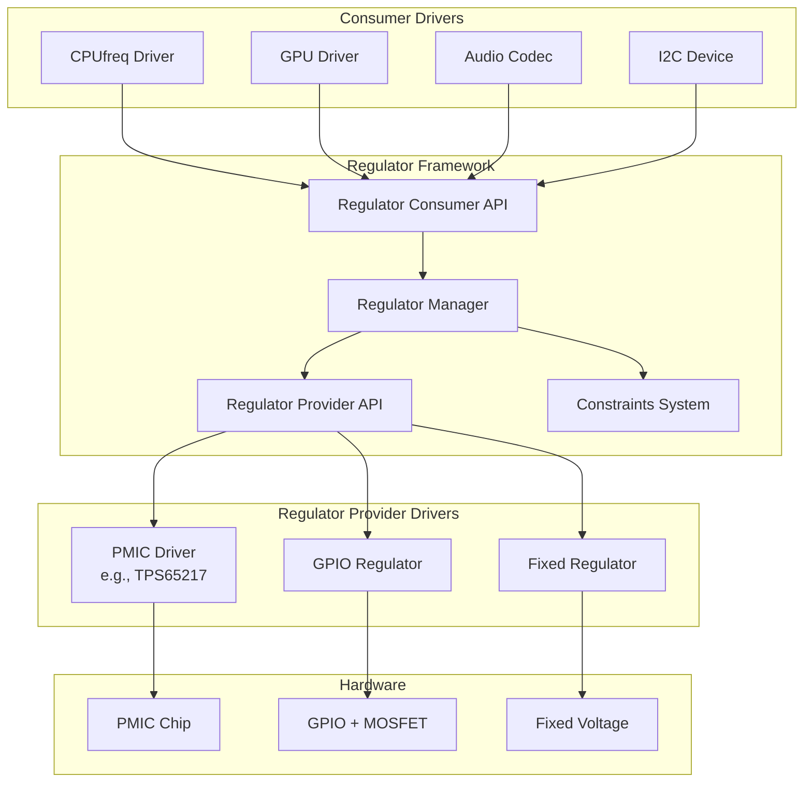

# Voltage Regulators

## Introduction

Voltage regulators are electronic components that maintain a constant output voltage despite variations in input voltage or load current. In modern SoCs and embedded systems, multiple voltage regulators power different components: CPU cores, GPU, memory, I/O interfaces, and peripherals. Each may require different voltages, and the voltages often need to change dynamically based on operating frequency (DVFS — Dynamic Voltage and Frequency Scaling).

The Linux regulator framework provides a unified API for managing voltage regulators, current limits, and power domains. It abstracts the hardware specifics of different regulator types (LDO, DCDC, GPIO-controlled) behind a common interface, allowing consumer drivers to request voltages without knowing the regulator hardware details.

## Regulator Architecture



## Core Concepts

### Regulator Types

| Type | Description | Example |
|------|-------------|---------|
| **LDO** (Low Dropout) | Linear regulator, simple, low noise | TPS7A02, RT9013 |
| **DCDC/Buck** | Switching regulator, efficient, higher noise | TPS65217, ACT8865 |
| **Boost** | Step-up switching regulator | TPS61070 |
| **Buck-Boost** | Can step up or down | LTC3536 |
| **GPIO** | Voltage controlled by GPIO + resistor divider | Custom boards |
| **Fixed** | Always-on, no software control | Board-level regulators |
| **Virtual** | Software-only, for power domain management | Kernel-defined |

### Regulator vs Supply

- **Regulator**: A voltage regulator IC output (e.g., LDO1_OUT)
- **Supply**: A power input to a consumer device (e.g., VDD_CORE)

A single regulator can supply multiple consumers. The framework manages the reference count and ensures the regulator stays enabled as long as any consumer needs it.

## Consumer API

### Getting a Regulator

```c
#include <linux/regulator/consumer.h>

/* Get a named supply */
struct regulator *reg;
reg = devm_regulator_get(dev, "vdd");
if (IS_ERR(reg))
    return dev_err_probe(dev, PTR_ERR(reg), "failed to get vdd supply\n");

/* Get an optional supply (returns NULL if not specified) */
struct regulator *reg_optional;
reg_optional = devm_regulator_get_optional(dev, "vdd_aux");

/* Get supply from device tree */
/* DT binding: vdd-supply = <&ldo1>; */
/* The name "vdd" maps to the -supply suffix */
```

### Enabling and Disabling

```c
/* Enable regulator */
int ret = regulator_enable(reg);
if (ret)
    return ret;

/* Disable regulator */
regulator_disable(reg);

/* Check if enabled */
int is_on = regulator_is_enabled(reg);

/* Force disable (even if other consumers have it enabled) */
regulator_force_disable(reg);

/* Device-managed enable/disable (auto-disabled on driver detach) */
ret = regulator_enable(reg);
/* Will be auto-disabled when dev is removed */
```

### Setting Voltage

```c
/* Set voltage range */
ret = regulator_set_voltage(reg, 1200000, 1200000);  /* min=1200mV, max=1200mV */
ret = regulator_set_voltage(reg, 1100000, 1300000);  /* min=1100mV, max=1300mV */

/* Get current voltage */
int uv = regulator_get_voltage(reg);
/* Returns voltage in microvolts (uV) */

/* Set voltage and enable in one step */
ret = regulator_set_voltage_and_enable(reg, 1200000);

/* Get supported voltage range */
int min_uv = regulator_get_voltage(reg);  /* currently set */
int max_uv = regulator_list_voltage(reg, 0);  /* first supported */
```

### Voltage List

```c
/* List all supported voltages */
int i;
for (i = 0; i < regulator_count_voltages(reg); i++) {
    int uv = regulator_list_voltage(reg, i);
    if (uv > 0)
        printk("Supported voltage: %d uV\n", uv);
}
```

### Current Limiting

```c
/* Set current limit */
ret = regulator_set_current_limit(reg, 100000, 500000);  /* min=100mA, max=500mA */

/* Get current limit */
int uA = regulator_get_current_limit(reg);

/* List supported current limits */
for (i = 0; i < regulator_count_current_limits(reg); i++) {
    int uA = regulator_list_current_limit(reg, i);
    if (uA > 0)
        printk("Supported current: %d uA\n", uA);
}
```

### Operating Mode

```c
/* Set operating mode */
ret = regulator_set_mode(reg, REGULATOR_MODE_FAST);   /* High performance */
ret = regulator_set_mode(reg, REGULATOR_MODE_NORMAL);  /* Normal */
ret = regulator_set_mode(reg, REGULATOR_MODE_IDLE);    /* Low power */
ret = regulator_set_mode(reg, REGULATOR_MODE_STANDBY); /* Minimum power */

/* Get current mode */
unsigned int mode = regulator_get_mode(reg);
```

### Regulator Modes

| Mode | Description | Use Case |
|------|-------------|----------|
| `REGULATOR_MODE_FAST` | Highest performance | CPU high frequency |
| `REGULATOR_MODE_NORMAL` | Normal operation | Default mode |
| `REGULATOR_MODE_IDLE` | Reduced performance | CPU idle |
| `REGULATOR_MODE_STANDBY` | Minimum power | Suspend |

## Device Tree Bindings

### Regulator Nodes

```dts
/* PMIC node */
pmic: pmic@34 {
    compatible = "vendor,my-pmic";
    reg = <0x34>;
    
    regulators {
        /* LDO1: 1.2V for CPU core */
        ldo1: ldo1 {
            regulator-name = "vdd_cpu";
            regulator-min-microvolt = <800000>;
            regulator-max-microvolt = <1300000>;
            regulator-always-on;
            regulator-boot-on;
        };
        
        /* LDO2: 3.3V for I/O */
        ldo2: ldo2 {
            regulator-name = "vdd_io";
            regulator-min-microvolt = <3300000>;
            regulator-max-microvolt = <3300000>;
        };
        
        /* DCDC1: 1.1V for core logic */
        dcdc1: dcdc1 {
            regulator-name = "vdd_core";
            regulator-min-microvolt = <800000>;
            regulator-max-microvolt = <1200000>;
            regulator-ramp-delay = <1000>;  /* 1mV/us ramp rate */
        };
        
        /* LDO3: 1.8V for DDR */
        ldo3: ldo3 {
            regulator-name = "vdd_ddr";
            regulator-min-microvolt = <1800000>;
            regulator-max-microvolt = <1800000>;
            regulator-always-on;
        };
    };
};

/* Consumer node */
cpu@0 {
    compatible = "arm,cortex-a53";
    cpu-supply = <&ldo1>;  /* CPU powered by LDO1 */
};

/* Another consumer */
i2c_device@48 {
    compatible = "vendor,my-sensor";
    reg = <0x48>;
    vdd-supply = <&ldo2>;  /* Sensor powered by LDO2 */
    vddio-supply = <&ldo2>;  /* I/O powered by LDO2 */
};
```

### Fixed Regulator

```dts
/* Always-on fixed voltage regulator */
vdd_fixed: regulator-fixed {
    compatible = "regulator-fixed";
    regulator-name = "vdd_fixed_3v3";
    regulator-min-microvolt = <3300000>;
    regulator-max-microvolt = <3300000>;
    regulator-always-on;
    regulator-boot-on;
    vin-supply = <&battery>;
};

/* GPIO-controlled regulator */
vdd_gpio: regulator-gpio {
    compatible = "regulator-gpio";
    regulator-name = "vdd_gpio";
    regulator-min-microvolt = <1800000>;
    regulator-max-microvolt = <3300000>;
    regulator-type = "voltage";
    gpios = <&gpio0 12 GPIO_ACTIVE_HIGH>;
    states = <3300000 0x1
              1800000 0x0>;
    startup-delay-us = <5000>;
    enable-active-high;
};
```

## Provider API

### Implementing a Regulator Driver

```c
#include <linux/module.h>
#include <linux/platform_device.h>
#include <linux/regulator/driver.h>
#include <linux/regulator/machine.h>
#include <linux/regulator/of_regulator.h>
#include <linux/i2c.h>

struct my_regulator {
    struct device *dev;
    struct regulator_dev *rdev;
    struct regulator_desc desc;
    int voltage_uv;
    int min_uv;
    int max_uv;
    bool enabled;
};

static int my_regulator_enable(struct regulator_dev *rdev)
{
    struct my_regulator *myreg = rdev_get_drvdata(rdev);
    
    /* Enable regulator hardware */
    /* e.g., write to I2C register */
    dev_info(myreg->dev, "regulator enabled\n");
    myreg->enabled = true;
    
    return 0;
}

static int my_regulator_disable(struct regulator_dev *rdev)
{
    struct my_regulator *myreg = rdev_get_drvdata(rdev);
    
    /* Disable regulator hardware */
    dev_info(myreg->dev, "regulator disabled\n");
    myreg->enabled = false;
    
    return 0;
}

static int my_regulator_is_enabled(struct regulator_dev *rdev)
{
    struct my_regulator *myreg = rdev_get_drvdata(rdev);
    return myreg->enabled;
}

static int my_regulator_get_voltage(struct regulator_dev *rdev)
{
    struct my_regulator *myreg = rdev_get_drvdata(rdev);
    return myreg->voltage_uv;
}

static int my_regulator_set_voltage(struct regulator_dev *rdev,
                                      int min_uv, int max_uv,
                                      unsigned *selector)
{
    struct my_regulator *myreg = rdev_get_drvdata(rdev);
    
    if (min_uv < myreg->min_uv || max_uv > myreg->max_uv)
        return -EINVAL;
    
    /* Find closest supported voltage */
    int target = clamp(min_uv, myreg->min_uv, max_uv);
    
    /* Program hardware */
    /* ... write to I2C register ... */
    
    myreg->voltage_uv = target;
    *selector = 0;
    
    dev_dbg(myreg->dev, "set voltage to %d uV\n", target);
    return 0;
}

static const struct regulator_ops my_regulator_ops = {
    .enable         = my_regulator_enable,
    .disable        = my_regulator_disable,
    .is_enabled     = my_regulator_is_enabled,
    .get_voltage    = my_regulator_get_voltage,
    .set_voltage    = my_regulator_set_voltage,
};

static int my_regulator_probe(struct i2c_client *client)
{
    struct my_regulator *myreg;
    struct regulator_config config = {};
    struct regulator_desc *desc;
    
    myreg = devm_kzalloc(&client->dev, sizeof(*myreg), GFP_KERNEL);
    if (!myreg)
        return -ENOMEM;
    
    myreg->dev = &client->dev;
    
    /* Read voltage range from DT */
    struct regulator_init_data *init_data;
    init_data = of_get_regulator_init_data(&client->dev,
                                            client->dev.of_node, desc);
    if (!init_data)
        return -EINVAL;
    
    myreg->min_uv = init_data->constraints.min_uV;
    myreg->max_uv = init_data->constraints.max_uV;
    myreg->voltage_uv = myreg->min_uv;
    
    /* Set up regulator descriptor */
    desc = &myreg->desc;
    desc->name = "my-regulator";
    desc->ops = &my_regulator_ops;
    desc->type = REGULATOR_VOLTAGE;
    desc->owner = THIS_MODULE;
    desc->min_uV = myreg->min_uv;
    desc->uV_step = 10000;  /* 10 mV steps */
    desc->n_voltages = (myreg->max_uv - myreg->min_uv) / 10000 + 1;
    
    /* Register with regulator framework */
    config.dev = &client->dev;
    config.driver_data = myreg;
    config.of_node = client->dev.of_node;
    config.init_data = init_data;
    
    myreg->rdev = devm_regulator_register(&client->dev, desc, &config);
    if (IS_ERR(myreg->rdev))
        return dev_err_probe(&client->dev, PTR_ERR(myreg->rdev),
                             "failed to register regulator\n");
    
    i2c_set_clientdata(client, myreg);
    
    dev_info(&client->dev, "regulator probed (%d-%d uV)\n",
             myreg->min_uv, myreg->max_uv);
    
    return 0;
}

static const struct of_device_id my_regulator_of_match[] = {
    { .compatible = "vendor,my-regulator" },
    { /* sentinel */ }
};
MODULE_DEVICE_TABLE(of, my_regulator_of_match);

static struct i2c_driver my_regulator_driver = {
    .driver = {
        .name = "my-regulator",
        .of_match_table = my_regulator_of_match,
    },
    .probe = my_regulator_probe,
};
module_i2c_driver(my_regulator_driver);

MODULE_LICENSE("GPL");
MODULE_DESCRIPTION("My voltage regulator driver");
```

## Regulator Constraints

Constraints are defined in machine data or device tree to limit regulator behavior:

```c
struct regulation_constraints {
    const char *name;
    
    /* Voltage constraints */
    int min_uV;
    int max_uV;
    unsigned int uV_offset;
    
    /* Current constraints */
    int min_uA;
    int max_uA;
    
    /* Operating mode */
    unsigned int valid_modes_mask;
    unsigned int initial_mode;
    
    /* Limits */
    unsigned int ramp_delay;
    unsigned int settling_time;
    unsigned int settling_time_up;
    unsigned int settling_time_down;
    
    /* State management */
    unsigned int always_on:1;
    unsigned int boot_on:1;
    unsigned int apply_uV:1;
};
```

### Machine-Level Regulator Initialization

```c
/* Define consumer supply mapping */
static struct regulator_consumer_supply my_consumer_supplies[] = {
    REGULATOR_SUPPLY("vdd", "my-device.0"),
    REGULATOR_SUPPLY("vddio", "my-device.0"),
};

/* Regulator init data */
static struct regulator_init_data my_reg_init = {
    .constraints = {
        .min_uV = 1200000,
        .max_uV = 1200000,
        .valid_modes_mask = REGULATOR_MODE_NORMAL,
        .valid_ops_mask = REGULATOR_CHANGE_VOLTAGE |
                          REGULATOR_CHANGE_STATUS,
        .always_on = 0,
        .boot_on = 1,
    },
    .num_consumer_supplies = ARRAY_SIZE(my_consumer_supplies),
    .consumer_supplies = my_consumer_supplies,
};
```

## Regulator Debugging

```bash
# List all regulators
ls /sys/class/regulator/
# regulator.0  regulator.1  regulator.10  regulator.11 ...

# View regulator info
cat /sys/class/regulator/regulator.0/name
# vdd_cpu
cat /sys/class/regulator/regulator.0/state
# enabled
cat /sys/class/regulator/regulator.0/microvolts
# 1200000
cat /sys/class/regulator/regulator.0/min_microvolts
# 800000
cat /sys/class/regulator/regulator.0/max_microvolts
# 1300000

# View all regulators
for reg in /sys/class/regulator/regulator.*; do
    name=$(cat $reg/name 2>/dev/null)
    state=$(cat $reg/state 2>/dev/null)
    uv=$(cat $reg/microvolts 2>/dev/null)
    echo "$name: $state @ ${uv}uV"
done
# vdd_cpu: enabled @ 1200000uV
# vdd_io: disabled @ 3300000uV
# vdd_core: enabled @ 1100000uV
# vdd_ddr: enabled @ 1800000uV

# View regulator consumers
ls /sys/class/regulator/regulator.0/consumer:0/
# device  name

# View regulator debug info
cat /sys/kernel/debug/regulator/regulator.0
# regulator.0: 1200 mV enabled
#  consumer.0: vdd (my-device.0)

# Trace regulator events
echo 1 > /sys/kernel/debug/tracing/events/regulator/enable
echo 1 > /sys/kernel/debug/tracing/events/regulator/disable
echo 1 > /sys/kernel/debug/tracing/events/regulator/set_voltage
cat /sys/kernel/debug/tracing/trace_pipe
```

## DVFS (Dynamic Voltage and Frequency Scaling)

Regulators are essential for DVFS, where CPU/GPU voltage changes with frequency:

```bash
# CPU frequency scaling with voltage
cat /sys/devices/system/cpu/cpu0/cpufreq/scaling_cur_freq
# 1200000  (kHz)

# View voltage for current frequency
cat /sys/class/regulator/regulator.0/microvolts
# 1200000  (uV)

# The cpufreq driver requests voltage changes via the regulator framework
# When frequency increases → voltage must increase first
# When frequency decreases → voltage can decrease after frequency
```

## Common Pitfalls

1. **Enabling before voltage is set**: Some regulators require voltage to be set before enabling.
2. **Exceeding limits**: Always check `min_uV`/`max_uV` constraints before setting voltage.
3. **Ramp delay**: Some regulators need time to reach the target voltage after a change.
4. **Supply ordering**: Consumer supplies must be available before the consumer probes (use deferred probe).
5. **Reference counting**: The regulator stays enabled until all consumers release it.

## References

- [Kernel Regulator API Documentation](https://www.kernel.org/doc/html/latest/driver-api/regulator.html)
- [Kernel Regulator Consumer Interface](https://www.kernel.org/doc/html/latest/driver-api/regulator/regulator.html)
- [LWN: The regulator framework](https://lwn.net/Articles/289331/)
- [Device Tree Regulator Bindings](https://www.kernel.org/doc/Documentation/devicetree/bindings/regulator/)
- [Linux regulator consumer API](https://git.kernel.org/pub/scm/linux/kernel/git/torvalds/linux.git/tree/include/linux/regulator/consumer.h)

## Related Topics

- [Platform Drivers](./platform-drivers.md) — Regulators as platform devices
- [I2C and SPI](./i2c-spi.md) — PMIC regulators on I2C/SPI buses
- [Power Management](../pm/index.md) — System power management
- [Device Tree](../devicetree/index.md) — Regulator DT bindings
