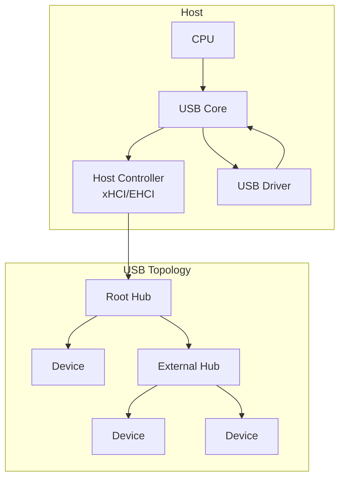
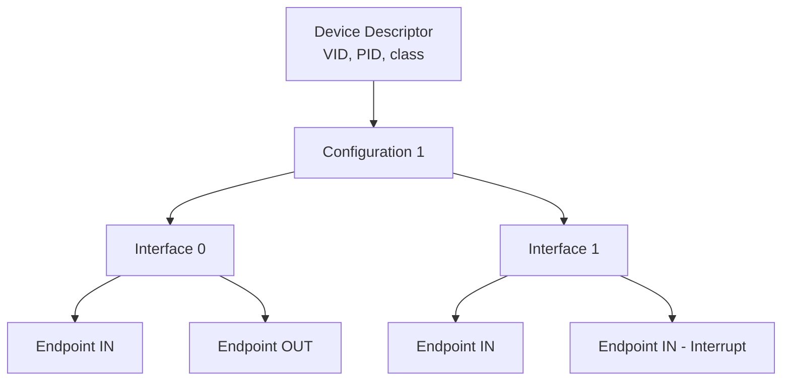
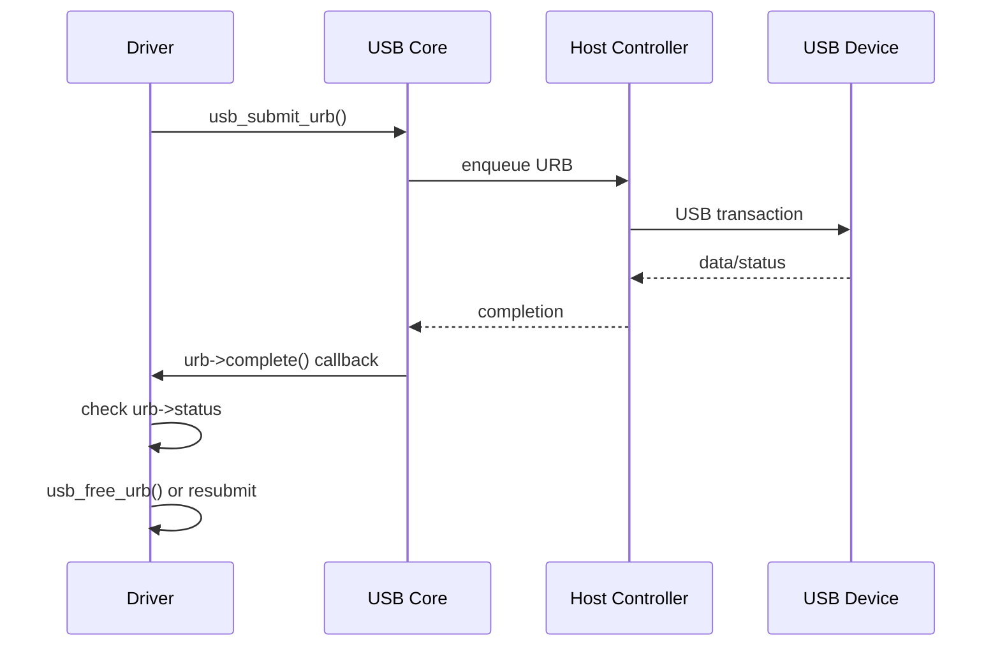
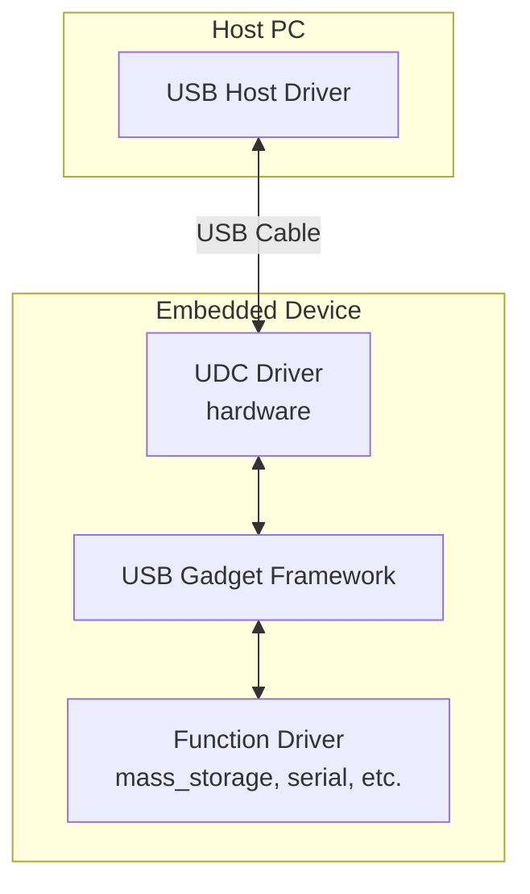

# USB Subsystem

The **USB (Universal Serial Bus)** subsystem handles communication with
USB devices — from keyboards and mice to storage devices, network
adapters, and custom hardware. USB is a **host-centric, polled** bus:
the host controller initiates all transfers.

---

## 1. USB Architecture



### USB Speeds

| Version | Speed | Max Bandwidth |
|---|---|---|
| USB 1.1 | Low/Full | 1.5 / 12 Mbps |
| USB 2.0 | High | 480 Mbps |
| USB 3.0 | Super | 5 Gbps |
| USB 3.1 | SuperSpeed+ | 10 Gbps |
| USB 3.2 | SuperSpeed+ | 20 Gbps |
| USB4 | USB4 | 40 Gbps |

---

## 2. USB Descriptors

USB devices describe themselves through a hierarchy of **descriptors**:



### Device Descriptor

```c
struct usb_device_descriptor {
    __u8  bLength;            /* 18 bytes */
    __u8  bDescriptorType;   /* USB_DT_DEVICE */
    __le16 bcdUSB;           /* USB spec version */
    __u8  bDeviceClass;      /* class code */
    __u8  bDeviceSubClass;
    __u8  bDeviceProtocol;
    __u8  bMaxPacketSize0;   /* EP0 max packet size */
    __le16 idVendor;         /* vendor ID */
    __le16 idProduct;        /* product ID */
    __le16 bcdDevice;        /* device release */
    __u8  iManufacturer;
    __u8  iProduct;
    __u8  iSerialNumber;
    __u8  bNumConfigurations;
} __attribute__ ((packed));
```

### Common USB Classes

| Class | Code | Example Devices |
|---|---|---|
| HID | 0x03 | Keyboard, mouse, gamepad |
| Mass Storage | 0x08 | Flash drive, external HDD |
| CDC (Comm) | 0x02 | Serial adapter, modem |
| Audio | 0x01 | Speakers, microphones |
| Video | 0x0E | Webcams |
| Vendor-Specific | 0xFF | Custom hardware |

### Viewing Descriptors

```bash
$ lsusb -v -d 046d:c077
Bus 001 Device 003: ID 046d:c077 Logitech M105 Optical Mouse
  Device Descriptor:
    bLength                18
    bDescriptorType         1
    bcdUSB               1.10
    bDeviceClass            0 (Defined at Interface level)
    idVendor           0x046d Logitech, Inc.
    idProduct          0xc077 M105 Optical Mouse
    bNumConfigurations      1
```

---

## 3. Endpoints

Every USB interface has one or more **endpoints** — logical channels
for data transfer:

| Type | Direction | Use Case |
|---|---|---|
| Control | Bidirectional | Device configuration (EP 0) |
| Bulk | IN or OUT | Large data transfers (storage) |
| Interrupt | IN or OUT | Small, periodic data (HID) |
| Isochronous | IN or OUT | Real-time streaming (audio, video) |

### Endpoint Descriptor

```c
struct usb_endpoint_descriptor {
    __u8  bLength;           /* 7 bytes */
    __u8  bDescriptorType;   /* USB_DT_ENDPOINT */
    __u8  bEndpointAddress;  /* EP number + direction */
    __u8  bmAttributes;      /* transfer type */
    __le16 wMaxPacketSize;   /* max packet size */
    __u8  bInterval;         /* polling interval (interrupt/iso) */
} __attribute__ ((packed));
```

---

## 4. URB (USB Request Block)

The **URB** is the fundamental transfer unit in the Linux USB subsystem.
Every data transfer — control, bulk, interrupt, or isochronous — is
represented as a URB.

```c
struct urb {
    struct usb_device *dev;          /* target device */
    unsigned int pipe;               /* endpoint + direction */
    void *transfer_buffer;           /* data buffer */
    dma_addr_t transfer_dma;         /* DMA address */
    unsigned int transfer_buffer_length;
    unsigned int actual_length;      /* bytes transferred */
    usb_complete_t complete;         /* completion callback */
    void *context;                   /* driver-private */
    int status;                      /* completion status */
    /* ... */
};
```

### Creating a URB

```c
/* Allocate */
struct urb *urb = usb_alloc_urb(0, GFP_KERNEL);

/* Fill a bulk URB */
usb_fill_bulk_urb(urb, usb_dev, pipe,
                  buf, buf_len,
                  my_completion, context);
```

### Submitting a URB

```c
int err = usb_submit_urb(urb, GFP_KERNEL);
if (err) {
    pr_err("usb_submit_urb failed: %d\n", err);
    usb_free_urb(urb);
    return err;
}
```

### URB Lifecycle



---

## 5. USB Drivers

### 5.1 `usb_driver` Structure

```c
static struct usb_driver my_usb_driver = {
    .name       = "my_usb",
    .probe      = my_usb_probe,
    .disconnect = my_usb_disconnect,
    .id_table   = my_usb_ids,
    .supports_autosuspend = 1,
};
```

### 5.2 `usb_device_id` Table

```c
static const struct usb_device_id my_usb_ids[] = {
    { USB_DEVICE(VENDOR_ID, PRODUCT_ID) },
    { USB_DEVICE_INTERFACE_CLASS(0x046d, 0xc077, 0x03) },
    { USB_INTERFACE_INFO(USB_CLASS_HID, USB_SUBCLASS_BOOT,
                         USB_PROTOCOL_KEYBOARD) },
    { }  /* terminator */
};
MODULE_DEVICE_TABLE(usb, my_usb_ids);
```

### 5.3 Probe and Disconnect

```c
static int my_usb_probe(struct usb_interface *intf,
                        const struct usb_device_id *id)
{
    struct usb_device *udev = interface_to_usbdev(intf);
    struct my_data *data;

    data = kzalloc(sizeof(*data), GFP_KERNEL);
    if (!data)
        return -ENOMEM;

    /* Find the first bulk IN endpoint */
    struct usb_endpoint_descriptor *ep_desc;
    struct usb_host_interface *alt = intf->cur_altsetting;
    int i;

    for (i = 0; i < alt->desc.bNumEndpoints; i++) {
        ep_desc = &alt->endpoint[i].desc;
        if (usb_endpoint_is_bulk_in(ep_desc)) {
            data->bulk_in_pipe = usb_rcvbulkpipe(udev,
                                    usb_endpoint_num(ep_desc));
            data->bulk_in_size = usb_endpoint_maxp(ep_desc);
            break;
        }
    }

    usb_set_intfdata(intf, data);
    pr_info("my_usb: device probed\n");
    return 0;
}

static void my_usb_disconnect(struct usb_interface *intf)
{
    struct my_data *data = usb_get_intfdata(intf);
    kfree(data);
    pr_info("my_usb: device disconnected\n");
}
```

### 5.4 Module Registration

```c
module_usb_driver(my_usb_driver);
```

---

## 6. USB Transfers

### 6.1 Control Transfer

Used for device configuration (always endpoint 0):

```c
/* Get descriptor */
usb_control_msg(udev, usb_rcvctrlpipe(udev, 0),
                USB_REQ_GET_DESCRIPTOR,
                USB_DIR_IN | USB_TYPE_STANDARD | USB_RECIP_DEVICE,
                USB_DT_DEVICE << 8, 0,
                buf, sizeof(buf),
                USB_CTRL_GET_TIMEOUT);
```

### 6.2 Bulk Transfer

For large, non-time-critical data (storage devices):

```c
/* Bulk read */
usb_bulk_msg(udev, usb_rcvbulkpipe(udev, ep),
             buf, buf_len, &actual_len,
             timeout);
```

### 6.3 Interrupt Transfer

For small, periodic data (HID devices):

```c
usb_fill_int_urb(urb, udev, usb_rcvintpipe(udev, ep),
                 buf, buf_len,
                 my_interrupt_complete, context,
                 interval);  /* polling interval in ms */
usb_submit_urb(urb, GFP_KERNEL);
```

### 6.4 Isochronous Transfer

For real-time streaming (audio/video):

```c
/* Allocate URB with space for multiple packets */
urb = usb_alloc_urb(num_packets, GFP_KERNEL);

/* Set up each packet */
for (i = 0; i < num_packets; i++) {
    urb->iso_frame_desc[i].offset = i * packet_size;
    urb->iso_frame_desc[i].length = packet_size;
}

usb_submit_urb(urb, GFP_KERNEL);
```

---

## 7. USB Gadget Framework

The **USB gadget** framework allows a Linux device to act as a USB
peripheral (device mode), rather than a host. Used in embedded systems,
phones, and single-board computers.



### ConfigFS-Based Gadget Configuration

```bash
# Create a gadget
mount -t configfs none /sys/kernel/config
mkdir /sys/kernel/config/usb_gadget/g1
cd /sys/kernel/config/usb_gadget/g1

echo 0x1d6b > idVendor   # Linux Foundation
echo 0x0104 > idProduct   # Multifunction Composite Gadget
mkdir strings/0x409
echo "0123456789" > strings/0x409/serialnumber
echo "My Gadget" > strings/0x409/manufacturer

# Add a configuration
mkdir configs/c.1
mkdir configs/c.1/strings/0x409
echo "Config 1" > configs/c.1/strings/0x409/configuration

# Add a function (e.g., mass storage)
mkdir functions/mass_storage.usb0
echo /dev/sda1 > functions/mass_storage.usb0/lun.0/file

# Link function to configuration
ln -s functions/mass_storage.usb0 configs/c.1/

# Bind to UDC
echo "musb-hdrc.0" > UDC
```

### Function Drivers

| Function | Purpose |
|---|---|
| `g_mass_storage` | USB mass storage |
| `g_serial` | USB serial (ACM) |
| `g_ether` | USB Ethernet (RNDIS/CDC) |
| `g_audio` | USB audio |
| `g_hid` | USB HID device |
| `g_webcam` | USB webcam (UVC) |

---

## 8. USB Power Management

USB supports runtime power management:

```c
/* Enable autosuspend */
usb_enable_autosuspend(udev);

/* Mark interface as autopm-able */
pm_runtime_set_autosuspend_delay(&intf->dev, 2000); /* 2 seconds */

/* In suspend callback */
static int my_suspend(struct usb_interface *intf, pm_message_t message)
{
    /* Stop URBs, save state */
    return 0;
}

/* In resume callback */
static int my_resume(struct usb_interface *intf)
{
    /* Restore state, resubmit URBs */
    return 0;
}
```

---

## 9. `usbfs` — User-Space USB Access

The `usbfs` filesystem (`/dev/bus/usb/`) allows user-space programs to
communicate with USB devices directly:

```bash
$ ls /dev/bus/usb/001/
001  002  003

$ sudo lsusb -t
/:  Bus 01.Port 1: Dev 1, Class=root_hub, Driver=ehci-pci/8p, 480M
    |__ Port 1: Dev 2, If 0, Class=Hub, Driver=hub/4p, 480M
        |__ Port 3: Dev 3, If 0, Class=Human Interface Device, Driver=usbhid, 1.5M
```

Libraries like `libusb` use this interface to send URBs from user space
without a kernel driver.

---

## 10. USB Debugging

### `usbmon`

```bash
# Load the module
modprobe usbmon

# Capture on bus 1
sudo cat /sys/kernel/debug/usb/usbmon/1u

# With wireshark
sudo modprobe usbmon
sudo wireshark -i usbmon1
```

### `dmesg` USB Messages

```bash
$ dmesg | grep -i usb
[1.234] usb 1-1: new high-speed USB device number 2 using xhci_hcd
[1.345] usb 1-1: New USB device found, idVendor=046d, idProduct=c077
[1.346] usb 1-1: Product: USB Optical Mouse
[1.346] input: USB Optical Mouse as /devices/.../input/input3
```

### `/sys/bus/usb/`

```bash
$ ls /sys/bus/usb/devices/1-1/
idVendor  idProduct  bDeviceClass  speed  maxpower
manufacturer  product  serial  version  bNumInterfaces
```

---

## Further Reading

- [GNU Project Documentation](https://www.gnu.org/doc/doc.html)
- [GNU Manuals](https://www.gnu.org/manual/manual.html)
- [Free Software Directory](https://directory.fsf.org/wiki/Main_Page)
- [Planet GNU](https://planet.gnu.org/)
- [Free Software Books](https://www.gnu.org/doc/other-free-books.html)

- [Linux kernel docs — USB](https://docs.kernel.org/driver-api/usb/index.html)
- [Linux kernel docs — USB Gadget](https://docs.kernel.org/usb/gadget_configfs.html)
- [LWN: Writing USB drivers](https://lwn.net/Articles/339021/)
- [Linux Device Drivers, 3rd Ed — Chapter 13](https://lwn.net/Kernel/LDD3/)
- [usb.org — USB Specifications](https://www.usb.org/document-library)
- [kernel.org — drivers/usb/](https://git.kernel.org/pub/scm/linux/kernel/git/torvalds/linux.git/tree/drivers/usb)

## Related Topics

- [Driver Model Overview](overview.md) — bus/device/driver framework
- [Character Devices](char-devices.md) — USB character device drivers
- [PCI Subsystem](pci.md) — xHCI host controller is a PCI device
- [Device Tree](device-tree.md) — USB controllers on embedded SoCs
- [Kernel APIs](../apis.md) — DMA and memory allocation
