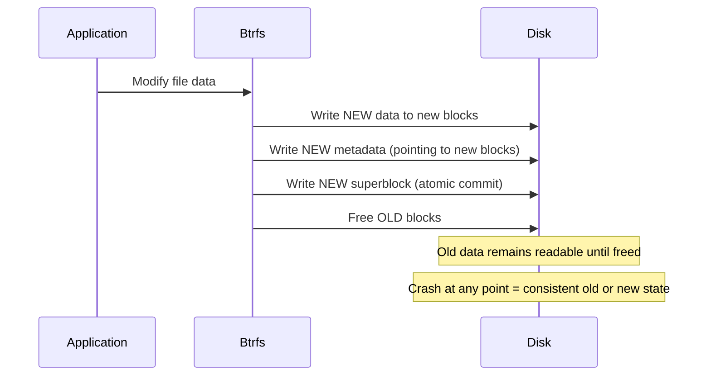
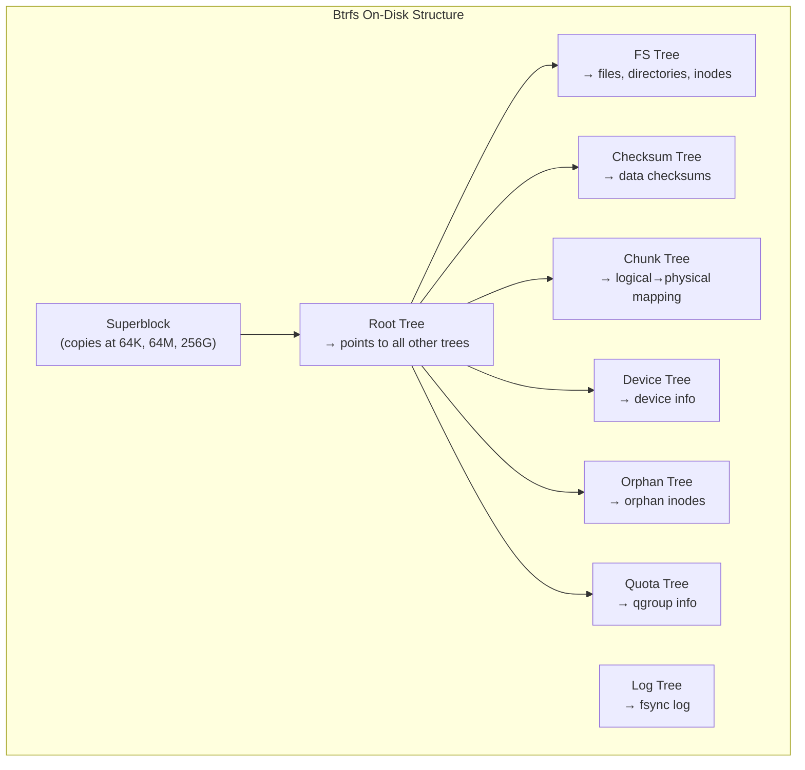
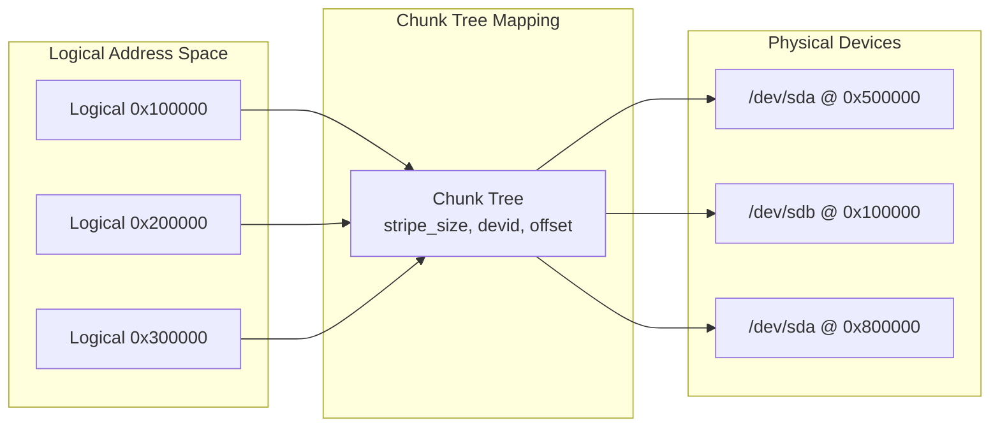
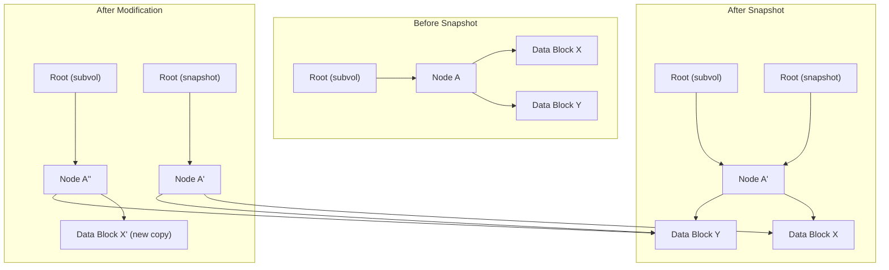
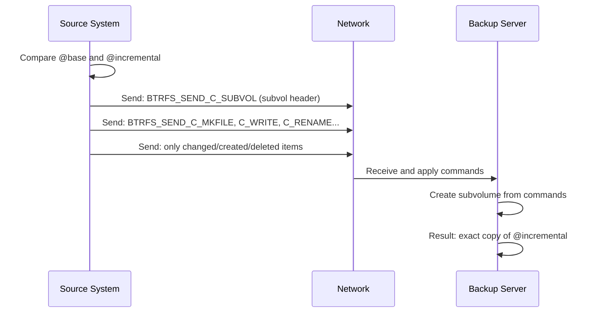
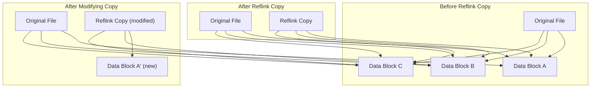
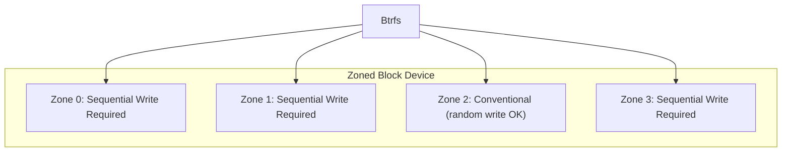
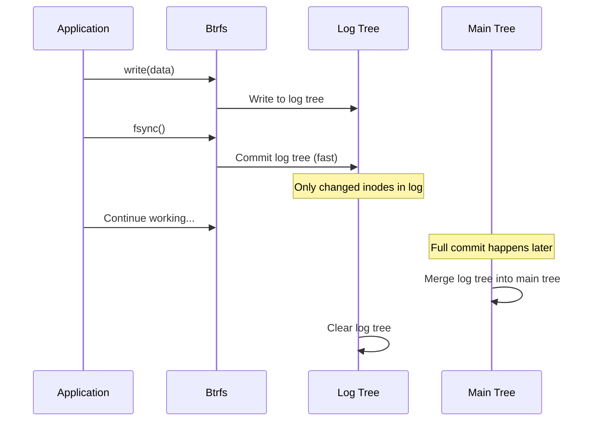
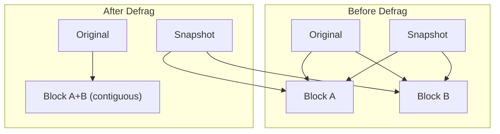
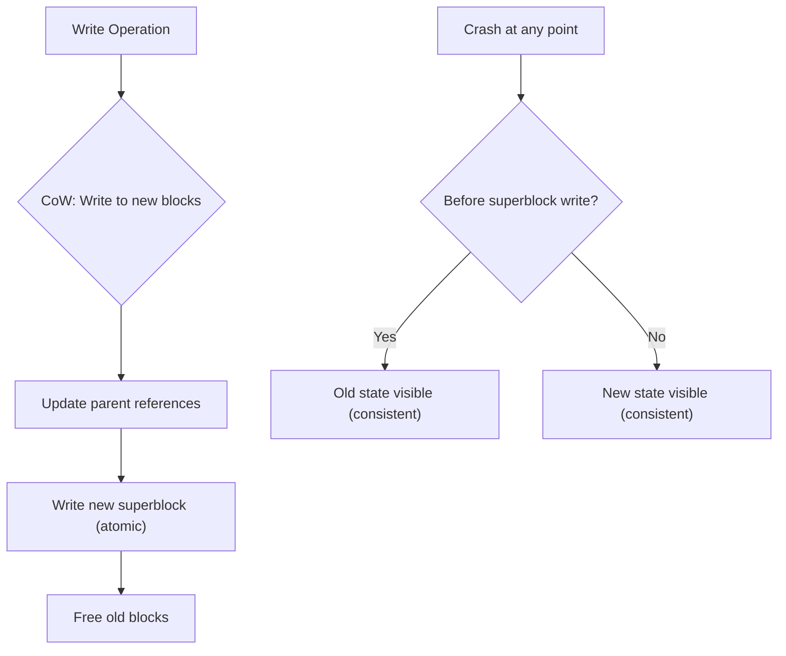

# Btrfs

## Introduction

Btrfs (B-tree filesystem, often pronounced "butter FS" or "b-tree FS") is a modern copy-on-write
(CoW) filesystem for Linux, originally developed by Oracle in 2007. It aims to provide advanced
features traditionally found in enterprise storage systems — snapshots, checksumming, RAID,
subvolumes, and online repair — all integrated into a single filesystem.

Btrfs was merged into the mainline kernel in 2009 (2.6.29) and has been marked as stable since
Linux 3.0 (2011). It is the default filesystem for openSUSE, Fedora (since Fedora 33 for
desktop), and SUSE Linux Enterprise. While historically considered less mature than ext4 or XFS,
Btrfs has reached a high level of reliability for most workloads, with specific caveats around
its RAID 5/6 implementation.

## Copy-on-Write (CoW) Fundamentals

The defining feature of Btrfs is its copy-on-write semantics. When data or metadata is modified,
Btrfs writes the new version to a new location on disk rather than overwriting in place. The old
blocks are only freed after the new version is committed.



### CoW Advantages

1. **Atomic updates**: A crash at any point leaves the filesystem consistent — either the old or new version is visible.
2. **Snapshots are free**: A snapshot is just a reference to the current root — no data copying needed.
3. **Checksumming**: Since data is never overwritten in place, checksums can be written alongside data.
4. **Reduced fragmentation** for append workloads (new data goes to new locations).

### CoW Disadvantages

1. **Write amplification**: Small in-place modifications may cause larger writes (new block allocation).
2. **Fragmentation**: Over time, random writes scatter data across the disk.
3. **NOCOW penalty**: Databases and VMs should use `chattr +C` to disable CoW for random I/O patterns.

### Disabling CoW

```bash
# Disable CoW for a file (must be done before data is written)
$ chattr +C /path/to/file

# Disable CoW for a directory (new files inherit)
$ chattr +C /path/to/directory

# Check CoW status
$ lsattr /path/to/file
```

## On-Disk Structure

Btrfs uses a unified B-tree structure (called "the B-tree" or "the tree of trees") to store
all metadata:



### Key B-Tree Concepts

Every Btrfs tree (root tree, fs tree, etc.) is a B+ tree with:

- **Internal nodes**: Contain keys and pointers to child nodes
- **Leaf nodes**: Contain key-value items (the actual data)

```c
/* Btrfs key — the fundamental addressing unit */
struct btrfs_disk_key {
    __le64  objectid;    /* Object this item belongs to */
    __u8    type;        /* Item type */
    __le64  offset;      /* Offset within the object */
};

/* Item types */
#define BTRFS_ROOT_ITEM_KEY         1
#define BTRFS_INODE_ITEM_KEY        1
#define BTRFS_INODE_REF_KEY         12
#define BTRFS_EXTENT_DATA_KEY       108
#define BTRFS_METADATA_ITEM_KEY     109
#define BTRFS_ROOT_BACKREF_KEY      144
#define BTRFS_XATTR_ITEM_KEY        24
#define BTRFS_DIR_ITEM_KEY          84
#define BTRFS_ORPHAN_ITEM_KEY       48
```

### Chunk Tree: Logical to Physical Mapping

Btrfs adds a virtual addressing layer via the chunk tree. Logical addresses are mapped to
physical locations on devices:



This abstraction enables:
- Multi-device filesystems (spanning multiple disks)
- RAID across devices
- Device replacement without remounting

## Subvolumes

A subvolume is an independent file tree within a Btrfs filesystem. Subvolumes share the same
storage pool but have separate inode number spaces and can be mounted independently.

```bash
# Create a subvolume
$ sudo btrfs subvolume create /mnt/data/my_subvol

# List subvolumes
$ sudo btrfs subvolume list /mnt/data
ID 256 gen 300 top level 5 path my_subvol
ID 257 gen 305 top level 5 path another_subvol

# Mount a subvolume directly
$ sudo mount -o subvolid=256 /dev/sda1 /mnt/my_subvol

# Set default subvolume
$ sudo btrfs subvolume set-default 256 /mnt/data

# Show subvolume info
$ sudo btrfs subvolume show /mnt/data/my_subvol
```

### Subvolume Use Cases

- **Separate /home from /**: Create a subvolume for /home, enabling independent snapshots
- **Container storage**: Each container gets its own subvolume
- **VM disk images**: Isolate VM storage for easy snapshot/rollback

```bash
# Example: subvolume layout for a root filesystem
$ sudo btrfs subvolume list /
ID 256 gen 1000 top level 5 path @
ID 257 gen 1000 top level 5 path @home
ID 258 gen 990  top level 5 path @snapshots
ID 259 gen 950  top level 5 path @var_log
```

## Snapshots

Snapshots are the killer feature of Btrfs. A snapshot is a subvolume that shares all its data
blocks with the original via CoW:

```bash
# Create a read-only snapshot
$ sudo btrfs subvolume snapshot -r /mnt/data/my_subvol /mnt/data/snap_2025-01-15

# Create a read-write snapshot
$ sudo btrfs subvolume snapshot /mnt/data/my_subvol /mnt/data/snap_rw

# List snapshots
$ sudo btrfs subvolume list -s /mnt/data

# Delete a snapshot
$ sudo btrfs subvolume delete /mnt/data/snap_2025-01-15
```

### How Snapshots Work



1. **Snapshot creation**: Just creates a new root pointing to the same tree. Instant, zero-copy.
2. **Write to original**: CoW creates a new copy of the modified block; the snapshot still references the old block.
3. **Disk usage**: Only the differences between the snapshot and current state consume space.

### Snapshot-Based Backups

```bash
#!/bin/bash
# Snapshot-based backup script
SNAP_NAME="@snap-$(date +%Y%m%d-%H%M%S)"
BACKUP_DIR="/mnt/backups"

# Create snapshot
btrfs subvolume snapshot -r /mnt/data/@ "$BACKUP_DIR/$SNAP_NAME"

# Keep only last 7 daily snapshots
ls -d "$BACKUP_DIR"/@snap-* | head -n -7 | xargs -r btrfs subvolume delete
```

## Send/Receive

Btrfs send/receive enables efficient incremental backups by sending only the differences between
two snapshots:

```bash
# Create initial snapshot and send it
$ sudo btrfs subvolume snapshot -r /mnt/data/@ /mnt/data/@base
$ sudo btrfs send /mnt/data/@base | ssh backup-server btrfs receive /backups/

# Create incremental snapshot and send only changes
$ sudo btrfs subvolume snapshot -r /mnt/data/@ /mnt/data/@incremental
$ sudo btrfs send -p /mnt/data/@base /mnt/data/@incremental | \
    ssh backup-server btrfs receive /backups/

# The incremental send is much smaller — only changed/new files
```

### Send/Receive Protocol



## Balance

Balance is the Btrfs equivalent of defragmentation and rebalancing. It rewrites data and metadata
across the filesystem:

```bash
# Full balance (rewrite everything)
$ sudo btrfs balance start /mnt/data

# Balance with filters (more targeted)
$ sudo btrfs balance start -dusage=50 /mnt/data    # Only data with >50% usage
$ sudo btrfs balance start -musage=70 /mnt/data    # Only metadata with >70% usage
$ sudo btrfs balance start -dlimit=10 /mnt/data    # Only 10 data chunks

# Check balance progress
$ sudo btrfs balance status /mnt/data

# Cancel a running balance
$ sudo btrfs balance cancel /mnt/data
```

### When to Balance

- After adding a new device (to redistribute data)
- After removing a device (data must be moved off)
- When chunks are highly unbalanced (one device much fuller than others)
- After deleting large amounts of data (to reclaim empty chunks)

## Scrub

Scrub reads all data and metadata, verifies checksums, and repairs corrupted blocks from
redundant copies (if RAID is configured):

```bash
# Start scrub
$ sudo btrfs scrub start /mnt/data

# Check status
$ sudo btrfs scrub status /mnt/data
UUID:             xxxxxxxx-xxxx-xxxx-xxxx-xxxxxxxxxxxx
Scrub started:    Mon Jan 15 10:00:00 2025
Status:           finished
Duration:         0:45:32
Total to scrub:   120.00GiB
Rate:             45.12MiB/s
Error summary:    csum=3
  Corrected:      3
  Uncorrectable:  0
  Unverified:     0
```

### Scrub Scheduling

```bash
# Schedule weekly scrub via systemd timer
$ sudo systemctl enable btrfs-scrub@-.timer

# Or via cron
# 0 2 * * 0 /usr/bin/btrfs scrub start /
```

## RAID Support

Btrfs supports native RAID for both data and metadata:

| Profile | Copies | Min Devices | Usable Space | Fault Tolerance |
|---------|--------|-------------|--------------|-----------------|
| single | 1 | 1 | 100% | None |
| DUP | 2 (same device) | 1 | 50% | 1 copy loss |
| RAID0 | stripe | 2 | 100% | None |
| RAID1 | mirror | 2 | 50% | 1 device |
| RAID10 | stripe+mirror | 4 | 50% | 1 per mirror |
| RAID5 | parity | 3 | (N-1)/N | 1 device |
| RAID6 | double parity | 4 | (N-2)/N | 2 devices |

```bash
# Create RAID1 filesystem on two devices
$ sudo mkfs.btrfs -d raid1 -m raid1 /dev/sda1 /dev/sdb1

# Add a device
$ sudo btrfs device add /dev/sdc1 /mnt/data

# Balance to use the new device
$ sudo btrfs balance start /mnt/data

# Remove a device
$ sudo btrfs device delete /dev/sdc1 /mnt/data

# View device stats
$ sudo btrfs device stats /mnt/data
[/dev/sda1].write_io_errs    0
[/dev/sda1].read_io_errs     0
[/dev/sda1].flush_io_errs    0
[/dev/sda1].corruption_errs  0
[/dev/sda1].generation_errs  0
```

### RAID 5/6 Warning

Btrfs RAID 5/6 has known issues with the "write hole" problem and is not recommended for
production use as of 2025. Use RAID 1/10 for data safety, or mdraid + single Btrfs for RAID 5/6.

## Quotas (qgroups)

```bash
# Enable quotas
$ sudo btrfs quota enable /mnt/data

# Create a quota group
$ sudo btrfs qgroup create 1/100 /mnt/data

# Set limits
$ sudo btrfs qgroup limit 10G 1/100 /mnt/data

# Show quota usage
$ sudo btrfs qgroup show /mnt/data
qgroupid         rfer         excl
--------         ----         ----
0/5          10.00GiB     10.00GiB
0/256         5.00GiB      2.00GiB
0/257         8.00GiB      3.00GiB
```

## Filesystem Check and Repair

```bash
# Check filesystem (read-only)
$ sudo btrfs check /dev/sda1
Opening filesystem to check...
Checking filesystem on /dev/sda1
UUID: xxxxxxxx-xxxx-xxxx-xxxx-xxxxxxxxxxxx
[1/7] checking root items
[2/7] checking extents
[3/7] checking free space cache
[4/7] checking fs roots
[5/7] checking only csums items (without verifying data)
[6/7] checking root refs
[7/7] checking quota groups
found 120.00GiB used space, no error found

# Dangerous: repair mode (use only when instructed by developers)
$ sudo btrfs check --repair /dev/sda1

# Superblock recovery (when primary superblock is corrupt)
$ sudo btrfs check -s 1 /dev/sda1   # Use superblock copy 1
```

## Compression

Btrfs supports transparent compression:

```bash
# Mount with compression
$ sudo mount -o compress=zstd /dev/sda1 /mnt/data
$ sudo mount -o compress=lzo /dev/sda1 /mnt/data
$ sudo mount -o compress=zstd:3 /dev/sda1 /mnt/data  # Compression level

# Set compression per-file
$ chattr +c /path/to/file        # Enable zlib
$ chattr +C /path/to/file        # Disable CoW (not compression)

# Force compression on existing data
$ sudo btrfs filesystem defragment -r -czstd /mnt/data

# View compression ratio
$ sudo btrfs filesystem df /mnt/data
Data, single: total=80.00GiB, used=70.00GiB
System, DUP: total=8.00MiB, used=16.00KiB
Metadata, DUP: total=1.00GiB, used=450.00KiB
GlobalReserve, single: total=512.00MiB, used=0.00B
```

## Filesystem Management

```bash
# Create filesystem
$ sudo mkfs.btrfs -L "mydata" -d single -m dup /dev/sda1

# View filesystem info
$ sudo btrfs filesystem show /mnt/data
Label: 'mydata'  uuid: xxxxxxxx-xxxx-xxxx-xxxx-xxxxxxxxxxxx
    Total devices 1 FS bytes used 70.00GiB
    devid    1 size 100.00GiB used 80.00GiB path /dev/sda1

# View space usage
$ sudo btrfs filesystem usage /mnt/data
Overall:
    Device size:         100.00GiB
    Device allocated:     80.00GiB
    Device unallocated:   20.00GiB
    Device missing:          0.00B
    Used:                 70.00GiB
    Free (estimated):     28.00GiB      (min: 28.00GiB)
    Free (statfs, current): 28.00GiB
    Data ratio:               1.00
    Metadata ratio:           2.00
    Global reserve:        512.00MiB      (used: 0.00B)

# Resize filesystem
$ sudo btrfs filesystem resize -5G /mnt/data   # Shrink by 5G
$ sudo btrfs filesystem resize max /mnt/data   # Grow to fill device
```

## Reflinks

Btrfs supports **reflink** copies — instant, space-efficient file copies that share data blocks via CoW:

```bash
# Create a reflink copy (instant, no data copying)
cp --reflink=always /source/file /dest/file

# Auto-reflink (use reflink if supported, fallback to regular copy)
cp --reflink=auto /source/file /dest/file

# ioctl interface
ioctl(dest_fd, FICLONE, src_fd);

# Partial reflink (clone a range)
struct file_clone_range range = {
    .src_fd = src_fd,
    .src_offset = 0,
    .src_length = 4096 * 100,
    .dest_offset = 0,
};\ioctl(dest_fd, FICLONERANGE, &range);
```



Reflinks are especially useful for:
- **Instant VM image provisioning**: Create a full copy in microseconds
- **Build systems**: Share object files across build directories
- **Backup snapshots**: CoW-aware copy without doubling disk usage

```bash
# Check if files share extents (reflink)
filefrag -v /original /copy | grep -i extent
# Both files show same physical extents until modified

# Deduplication via reflinks (offline)
duperemove -dr /path/to/data
```

## Send/Receive Stream Format

The `btrfs send` command produces a binary stream of commands. The stream format is versioned:

```c
/* Stream header */
#define BTRFS_SEND_STREAM_MAGIC "btrfs-stream"
#define BTRFS_SEND_STREAM_VERSION 1

struct btrfs_send_stream {
    char magic[13];     /* "btrfs-stream" */
    __le32 version;     /* Stream version */
};

/* Command header */
struct btrfs_cmd_header {
    __le32 len;         /* Length of attributes */
    __le16 cmd;         /* BTRFS_SEND_C_* */
    __le32 crc;         /* CRC32 of header + attributes */
    __le64 cmd_seq;     /* Command sequence number */
};
```

### Send Commands

| Command | Code | Purpose |
|---------|------|----------|
| SUBVOL | 1 | Create subvolume (base) |
| SNAPSHOT | 2 | Create snapshot (incremental base) |
| MKFILE | 3 | Create file |
| MKDIR | 4 | Create directory |
| MKNOD | 5 | Create device node |
| MKFIFO | 6 | Create FIFO |
| MKSOCK | 7 | Create socket |
| SYMLINK | 8 | Create symlink |
| RENAME | 9 | Rename entry |
| LINK | 10 | Create hard link |
| UNLINK | 11 | Remove file |
| RMDIR | 12 | Remove directory |
| WRITE | 13 | Write data |
| CLONE | 14 | Clone (reflink) range |
| TRUNCATE | 15 | Set file size |
| CHMOD | 16 | Change mode |
| CHOWN | 17 | Change ownership |
| UTIMES | 18 | Set timestamps |
| END | 19 | End of stream |
| UPDATE_EXTENT | 20 | Write extent (no data, for sparse) |
| MAX | 20 | |

### Send Attributes

```c
/* TLV-encoded attributes */
struct btrfs_send_attr {
    __le16 tl;     /* BTRFS_SEND_A_* type + length */
    __le16 len;    /* Attribute data length */
    /* Followed by attribute data */
};

/* Attribute types */
#define BTRFS_SEND_A_UUID       1  /* Subvolume UUID */
#define BTRFS_SEND_A_CTRANSID   2  /* Transaction ID */
#define BTRFS_SEND_A_INO        3  /* Inode number */
#define BTRFS_SEND_A_SIZE       4  /* File size */
#define BTRFS_SEND_A_MODE       5  /* File mode */
#define BTRFS_SEND_A_PATH       6  /* Path name */
#define BTRFS_SEND_A_DATA       7  /* Write data */
#define BTRFS_SEND_A_CLONE_UUID 9  /* Clone source UUID */
#define BTRFS_SEND_A_CLONE_CTRANSID 10 /* Clone transaction */
#define BTRFS_SEND_A_CLONE_PATH 11 /* Clone source path */
#define BTRFS_SEND_A_CLONE_OFFSET 12 /* Clone source offset */
```

## Zoned Mode (ZNS/ZBC Devices)

Btrfs supports **zoned storage devices** (Zoned Namespace SSDs, SMR HDDs) where writes must follow sequential write constraints:



```bash
# Create btrfs on zoned device
mkfs.btrfs -d single -m single /dev/nvme0n1

# Check zone info
btrfs device usage /mnt/data
# Shows zone size, conventional zones, sequential zones

# Zone capacity vs zone size
# Some ZNS devices have zone capacity < zone size
# Btrfs handles this automatically
```

### Zoned Mode Constraints

- **Metadata**: Written sequentially to conventional or sequential zones
- **Data**: Written sequentially, grouped by block group type
- **Garbage collection**: Btrfs reclaims zones by rewriting live data
- **Zone size**: Must be at least as large as the maximum extent size (typically 256MB)

```c
/* fs/btrfs/zoned.c */
int btrfs_load_zone_info(struct btrfs_fs_info *fs_info,
                         struct btrfs_device *device, u64 logical);

/* Zone types */
enum btrfs_zone_type {
    BTRFS_ZONE_TYPE_CONVENTIONAL = 0,
    BTRFS_ZONE_TYPE_SEQ_WRITE,   /* Sequential write required */
    BTRFS_ZONE_TYPE_SEQ_PREF,    /* Sequential preferred */
};
```

## Tree-Log (FSync Optimization)

Btrfs uses a **tree-log** to optimize `fsync()` performance. Instead of committing the entire filesystem, fsync writes a small log tree:



```bash
# Tree-log is enabled by default
# Check log tree status
btrfs inspect-internal dump-tree /dev/sda1 | grep -i log

# The log tree contains only metadata changed since last full commit
# fsync is fast because it only commits the log, not the entire tree
# After a full transaction commit, the log tree is cleared
```

### Log Tree Performance Impact

| Scenario | Without Tree-Log | With Tree-Log |
|----------|-----------------|----------------|
| fsync (1 file) | Full commit (~100ms) | Log commit (~1ms) |
| fsync (1000 files) | 1 full commit | 1 log commit |
| Crash recovery | Replay entire log | Replay log (fast) |
| Steady-state throughput | No overhead | Minimal |

## Defragmentation

Btrfs defragmentation rewrites file extents to reduce fragmentation:

```bash
# Defragment a single file
btrfs filesystem defragment /path/to/file

# Defragment recursively
btrfs filesystem defragment -r /path/to/directory

# Defragment with compression
btrfs filesystem defragment -r -czstd /path/to/dir

# Defragment specific size threshold
btrfs filesystem defragment -t 64K /path/to/file
```

### Defragment Caveats

```bash
# WARNING: Defragmentation breaks reflinks and snapshot sharing
# Defragmented data is written to new blocks, consuming space
# from snapshots that previously shared those blocks

# Before defrag: snapshot and original share data blocks
# After defrag: each has its own copy (doubled disk usage)

# Safe defragmentation (preserve CoW for shared data)
btrfs filesystem defragment -f /path/to/file
# -f forces defragmentation even if CoW would be broken
```



## Nocow Behavior and Caveats

Files with the `NOCOW` attribute (`chattr +C`) bypass CoW:

```bash
# Set nocow attribute
chattr +C /path/to/file

# Verify
lsattr /path/to/file
# ----C--------- /path/to/file
```

### Nocow Implications

| Aspect | CoW (default) | Nocow |
|--------|---------------|-------|
| Snapshots | Instant, zero-copy | File data excluded from snapshot |
| Checksums | Full data checksums | No data checksums |
| RAID | Full RAID support | Limited (single device only) |
| Compression | Supported | Not supported |
| Data integrity | Protected by checksums | Unprotected |

```bash
# Nocow is required for:
# - Database files (SQLite, PostgreSQL)
# - VM disk images (qcow2, raw)
# - Any workload with random writes

# Set nocow on a directory (new files inherit)
chattr +C /var/lib/libvirt/images/

# Migration: files with data cannot be made nocow
# Must copy, set attribute, then write
mv /file /file.bak && touch /file && chattr +C /file
mv /file.bak /file
```

## Data Consistency Model

Btrfs provides strong consistency guarantees:



### Superblock Copies

Btrfs maintains 3 copies of the superblock for recovery:

```bash
# Superblock locations:
# 1. Physical offset 64K on first device
# 2. Physical offset 64M on first device
# 3. Physical offset 256G on first device
# 4. 64K on each additional device

# Inspect superblock copies
btrfs inspect-internal dump-super /dev/sda1
btrfs inspect-internal dump-super -f 1 /dev/sda1  # Copy 1
btrfs inspect-internal dump-super -f 2 /dev/sda1  # Copy 2
```

### Transaction Commit Model

```c
/* fs/btrfs/transaction.c */

/* Transaction states */
enum btrfs_trans_state {
    TRANS_STATE_RUNNING,         /* Active, accepting writes */
    TRANS_STATE_COMMIT_START,    /* Commit initiated */
    TRANS_STATE_COMMIT_DOING,    /* Writing blocks */
    TRANS_STATE_UNBLOCKED,       /* Superblock written */
    TRANS_STATE_SUPER_COMMITTED, /* Superblock committed */
    TRANS_STATE_COMPLETED,       /* Transaction complete */
};
```

## Device Management Details

### Device Stats

```bash
# Detailed device I/O statistics
btrfs device stats /mnt/data
# [/dev/sda1].write_io_errs    0
# [/dev/sda1].read_io_errs     0
# [/dev/sda1].flush_io_errs    0
# [/dev/sda1].corruption_errs  0
# [/dev/sda1].generation_errs  0

# Reset error counters
btrfs device stats --reset /mnt/data
```

### Device Replace

```bash
# Replace a device (online, no downtime)
btrfs device replace start /dev/sda1 /dev/sdd1 /mnt/data

# Monitor replacement progress
btrfs device replace status /mnt/data
# Started on 15. Jan 10:00:00, finished on 15. Jan 11:30:00
# 100.00% done, 0 write errors, 0 read errors, 0 corruption errors

# Cancel replacement
btrfs device replace cancel /mnt/data
```

### Device Add/Remove with Balance

```bash
# Add device and redistribute
btrfs device add /dev/sdc1 /mnt/data
btrfs balance start /mnt/data

# Remove device (migrates data off first)
btrfs device delete /dev/sdc1 /mnt/data

# Resize device to use more/less space
btrfs filesystem resize devid:3:50G /mnt/data
btrfs filesystem resize devid:3:max /mnt/data
```

## Filesystem Features

### Feature Flags

```bash
# View enabled features
btrfs filesystem show /mnt/data
# Features: extref, skinny-metadata, no-holes

# Enable features at mkfs time
mkfs.btrfs -O extref,skinny-metadata,no-holes /dev/sda1
```

| Feature | Since | Description |
|---------|-------|-------------|
| extref | 3.7 | Extended backrefs for hard links |
| skinny-metadata | 3.10 | Compact metadata extent refs |
| no-holes | 3.14 | Efficient sparse file handling |
| zoned | 5.12 | Zoned device support |
| free-space-tree | 4.5 | Persistent free space cache |
| raid1c34 | 5.9 | 3- and 4-copy RAID1 |

### Feature Compatibility

```bash
# Check if a feature is safe to enable
btrfs inspect-internal dump-super /dev/sda1 | grep -i compat

# Compat flags: features that older kernels MUST understand
# Ro compat flags: features that older kernels can mount read-only
# Incompat flags: features that older kernels cannot mount at all
```

## Known Limitations

| Limitation | Status |
|-----------|--------|
| RAID 5/6 write hole | Still present; use RAID 1/10 |
| No shrinking | Cannot reduce filesystem size |
| Quota groups performance | Can slow down with many snapshots |
| Encryption | No native encryption (use fscrypt + btrfs) |
| Deduplication | Offline only (bees, duperemove) |
| Max file size | 16 EiB (theoretical) |

## Further Reading

- [The Linux Kernel Documentation](https://docs.kernel.org/)
- [GNU Project Documentation](https://www.gnu.org/doc/doc.html)
- [GNU Manuals](https://www.gnu.org/manual/manual.html)
- [Free Software Directory](https://directory.fsf.org/wiki/Main_Page)
- [Planet GNU](https://planet.gnu.org/)
- [Free Software Books](https://www.gnu.org/doc/other-free-books.html)

- [Btrfs documentation (kernel.org)](https://docs.kernel.org/filesystems/btrfs.html) — Official kernel docs feature list and links
- [Btrfs wiki](https://btrfs.wiki.kernel.org/) — Official Btrfs documentation
- [Linux kernel: fs/btrfs/](https://elixir.bootlin.com/linux/latest/source/fs/btrfs) — Btrfs source code
- [Zygo's btrfs documentation](https://btrfs.readthedocs.io/) — Community docs
- [LWN: Btrfs: the present and future](https://lwn.net/Articles/848455/) — Development overview
- [Josef Bacik's blog](https://joelfernandes.blogspot.com/) — Btrfs developer writings
- [man btrfs(8)](https://man7.org/linux/man-pages/man8/btrfs.8.html) — Command reference

## Related Topics

- [VFS](./vfs.md) — The virtual filesystem layer
- [ZFS](./zfs.md) — Another CoW filesystem with similar features
- [Journaling](./journaling.md) — Btrfs uses CoW instead of traditional journaling
- [ext4](./ext4.md) — Comparison filesystem
- [XFS](./xfs.md) — Another modern Linux filesystem
