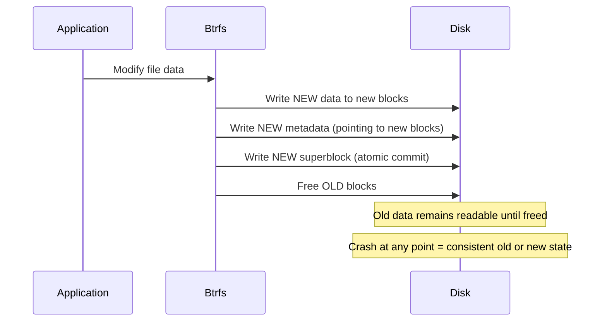
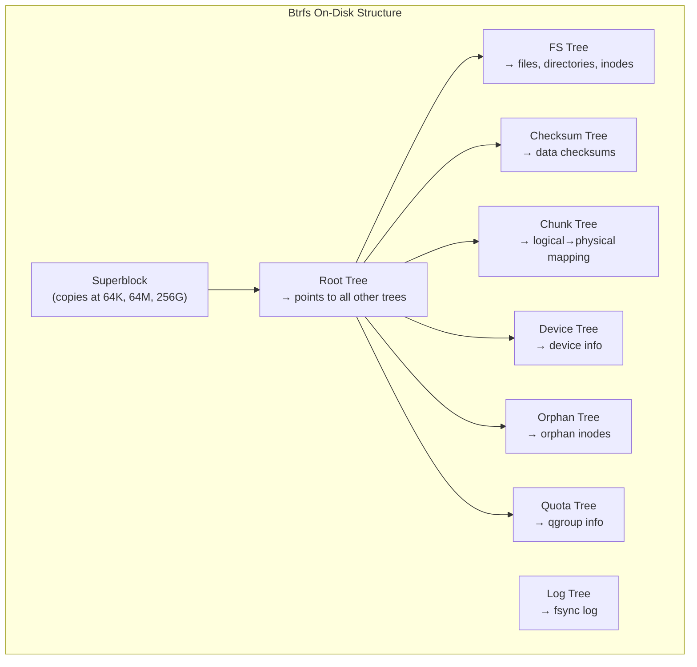
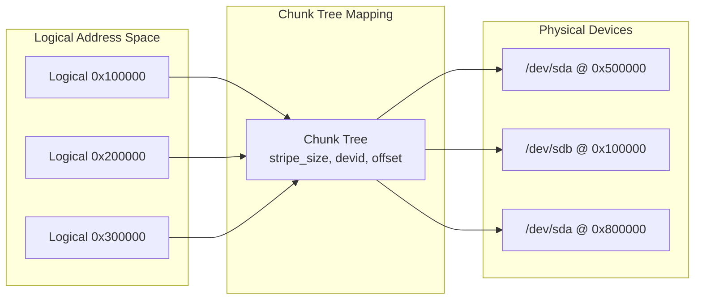
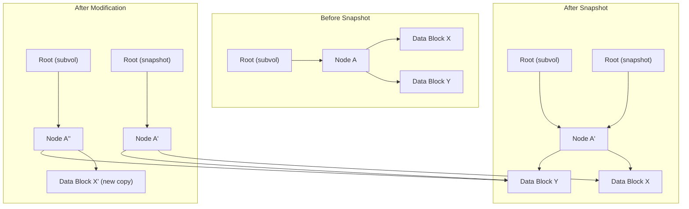
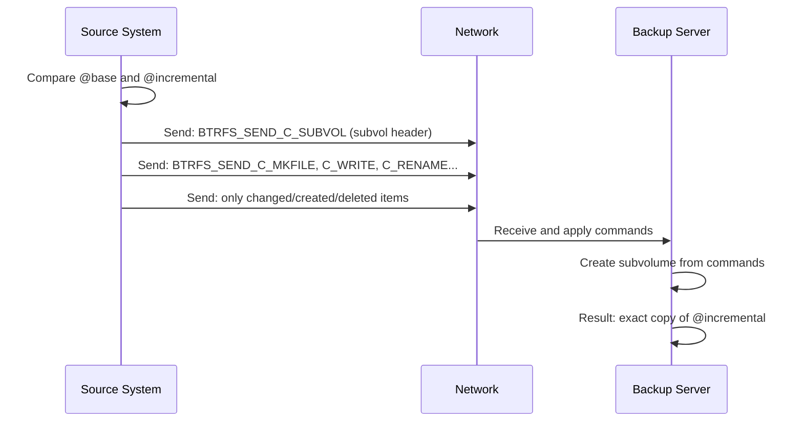

# Btrfs

## Introduction

Btrfs (B-tree filesystem, often pronounced "butter FS" or "b-tree FS") is a modern copy-on-write
(CoW) filesystem for Linux, originally developed by Oracle in 2007. It aims to provide advanced
features traditionally found in enterprise storage systems — snapshots, checksumming, RAID,
subvolumes, and online repair — all integrated into a single filesystem.

Btrfs was merged into the mainline kernel in 2009 (2.6.29) and has been marked as stable since
Linux 3.0 (2011). It is the default filesystem for openSUSE, Fedora (since Fedora 33 for
desktop), and SUSE Linux Enterprise. While historically considered less mature than ext4 or XFS,
Btrfs has reached a high level of reliability for most workloads, with specific caveats around
its RAID 5/6 implementation.

## Copy-on-Write (CoW) Fundamentals

The defining feature of Btrfs is its copy-on-write semantics. When data or metadata is modified,
Btrfs writes the new version to a new location on disk rather than overwriting in place. The old
blocks are only freed after the new version is committed.



### CoW Advantages

1. **Atomic updates**: A crash at any point leaves the filesystem consistent — either the old or new version is visible.
2. **Snapshots are free**: A snapshot is just a reference to the current root — no data copying needed.
3. **Checksumming**: Since data is never overwritten in place, checksums can be written alongside data.
4. **Reduced fragmentation** for append workloads (new data goes to new locations).

### CoW Disadvantages

1. **Write amplification**: Small in-place modifications may cause larger writes (new block allocation).
2. **Fragmentation**: Over time, random writes scatter data across the disk.
3. **NOCOW penalty**: Databases and VMs should use `chattr +C` to disable CoW for random I/O patterns.

### Disabling CoW

```bash
# Disable CoW for a file (must be done before data is written)
$ chattr +C /path/to/file

# Disable CoW for a directory (new files inherit)
$ chattr +C /path/to/directory

# Check CoW status
$ lsattr /path/to/file
```

## On-Disk Structure

Btrfs uses a unified B-tree structure (called "the B-tree" or "the tree of trees") to store
all metadata:



### Key B-Tree Concepts

Every Btrfs tree (root tree, fs tree, etc.) is a B+ tree with:

- **Internal nodes**: Contain keys and pointers to child nodes
- **Leaf nodes**: Contain key-value items (the actual data)

```c
/* Btrfs key — the fundamental addressing unit */
struct btrfs_disk_key {
    __le64  objectid;    /* Object this item belongs to */
    __u8    type;        /* Item type */
    __le64  offset;      /* Offset within the object */
};

/* Item types */
#define BTRFS_ROOT_ITEM_KEY         1
#define BTRFS_INODE_ITEM_KEY        1
#define BTRFS_INODE_REF_KEY         12
#define BTRFS_EXTENT_DATA_KEY       108
#define BTRFS_METADATA_ITEM_KEY     109
#define BTRFS_ROOT_BACKREF_KEY      144
#define BTRFS_XATTR_ITEM_KEY        24
#define BTRFS_DIR_ITEM_KEY          84
#define BTRFS_ORPHAN_ITEM_KEY       48
```

### Chunk Tree: Logical to Physical Mapping

Btrfs adds a virtual addressing layer via the chunk tree. Logical addresses are mapped to
physical locations on devices:



This abstraction enables:
- Multi-device filesystems (spanning multiple disks)
- RAID across devices
- Device replacement without remounting

## Subvolumes

A subvolume is an independent file tree within a Btrfs filesystem. Subvolumes share the same
storage pool but have separate inode number spaces and can be mounted independently.

```bash
# Create a subvolume
$ sudo btrfs subvolume create /mnt/data/my_subvol

# List subvolumes
$ sudo btrfs subvolume list /mnt/data
ID 256 gen 300 top level 5 path my_subvol
ID 257 gen 305 top level 5 path another_subvol

# Mount a subvolume directly
$ sudo mount -o subvolid=256 /dev/sda1 /mnt/my_subvol

# Set default subvolume
$ sudo btrfs subvolume set-default 256 /mnt/data

# Show subvolume info
$ sudo btrfs subvolume show /mnt/data/my_subvol
```

### Subvolume Use Cases

- **Separate /home from /**: Create a subvolume for /home, enabling independent snapshots
- **Container storage**: Each container gets its own subvolume
- **VM disk images**: Isolate VM storage for easy snapshot/rollback

```bash
# Example: subvolume layout for a root filesystem
$ sudo btrfs subvolume list /
ID 256 gen 1000 top level 5 path @
ID 257 gen 1000 top level 5 path @home
ID 258 gen 990  top level 5 path @snapshots
ID 259 gen 950  top level 5 path @var_log
```

## Snapshots

Snapshots are the killer feature of Btrfs. A snapshot is a subvolume that shares all its data
blocks with the original via CoW:

```bash
# Create a read-only snapshot
$ sudo btrfs subvolume snapshot -r /mnt/data/my_subvol /mnt/data/snap_2025-01-15

# Create a read-write snapshot
$ sudo btrfs subvolume snapshot /mnt/data/my_subvol /mnt/data/snap_rw

# List snapshots
$ sudo btrfs subvolume list -s /mnt/data

# Delete a snapshot
$ sudo btrfs subvolume delete /mnt/data/snap_2025-01-15
```

### How Snapshots Work



1. **Snapshot creation**: Just creates a new root pointing to the same tree. Instant, zero-copy.
2. **Write to original**: CoW creates a new copy of the modified block; the snapshot still references the old block.
3. **Disk usage**: Only the differences between the snapshot and current state consume space.

### Snapshot-Based Backups

```bash
#!/bin/bash
# Snapshot-based backup script
SNAP_NAME="@snap-$(date +%Y%m%d-%H%M%S)"
BACKUP_DIR="/mnt/backups"

# Create snapshot
btrfs subvolume snapshot -r /mnt/data/@ "$BACKUP_DIR/$SNAP_NAME"

# Keep only last 7 daily snapshots
ls -d "$BACKUP_DIR"/@snap-* | head -n -7 | xargs -r btrfs subvolume delete
```

## Send/Receive

Btrfs send/receive enables efficient incremental backups by sending only the differences between
two snapshots:

```bash
# Create initial snapshot and send it
$ sudo btrfs subvolume snapshot -r /mnt/data/@ /mnt/data/@base
$ sudo btrfs send /mnt/data/@base | ssh backup-server btrfs receive /backups/

# Create incremental snapshot and send only changes
$ sudo btrfs subvolume snapshot -r /mnt/data/@ /mnt/data/@incremental
$ sudo btrfs send -p /mnt/data/@base /mnt/data/@incremental | \
    ssh backup-server btrfs receive /backups/

# The incremental send is much smaller — only changed/new files
```

### Send/Receive Protocol



## Balance

Balance is the Btrfs equivalent of defragmentation and rebalancing. It rewrites data and metadata
across the filesystem:

```bash
# Full balance (rewrite everything)
$ sudo btrfs balance start /mnt/data

# Balance with filters (more targeted)
$ sudo btrfs balance start -dusage=50 /mnt/data    # Only data with >50% usage
$ sudo btrfs balance start -musage=70 /mnt/data    # Only metadata with >70% usage
$ sudo btrfs balance start -dlimit=10 /mnt/data    # Only 10 data chunks

# Check balance progress
$ sudo btrfs balance status /mnt/data

# Cancel a running balance
$ sudo btrfs balance cancel /mnt/data
```

### When to Balance

- After adding a new device (to redistribute data)
- After removing a device (data must be moved off)
- When chunks are highly unbalanced (one device much fuller than others)
- After deleting large amounts of data (to reclaim empty chunks)

## Scrub

Scrub reads all data and metadata, verifies checksums, and repairs corrupted blocks from
redundant copies (if RAID is configured):

```bash
# Start scrub
$ sudo btrfs scrub start /mnt/data

# Check status
$ sudo btrfs scrub status /mnt/data
UUID:             xxxxxxxx-xxxx-xxxx-xxxx-xxxxxxxxxxxx
Scrub started:    Mon Jan 15 10:00:00 2025
Status:           finished
Duration:         0:45:32
Total to scrub:   120.00GiB
Rate:             45.12MiB/s
Error summary:    csum=3
  Corrected:      3
  Uncorrectable:  0
  Unverified:     0
```

### Scrub Scheduling

```bash
# Schedule weekly scrub via systemd timer
$ sudo systemctl enable btrfs-scrub@-.timer

# Or via cron
# 0 2 * * 0 /usr/bin/btrfs scrub start /
```

## RAID Support

Btrfs supports native RAID for both data and metadata:

| Profile | Copies | Min Devices | Usable Space | Fault Tolerance |
|---------|--------|-------------|--------------|-----------------|
| single | 1 | 1 | 100% | None |
| DUP | 2 (same device) | 1 | 50% | 1 copy loss |
| RAID0 | stripe | 2 | 100% | None |
| RAID1 | mirror | 2 | 50% | 1 device |
| RAID10 | stripe+mirror | 4 | 50% | 1 per mirror |
| RAID5 | parity | 3 | (N-1)/N | 1 device |
| RAID6 | double parity | 4 | (N-2)/N | 2 devices |

```bash
# Create RAID1 filesystem on two devices
$ sudo mkfs.btrfs -d raid1 -m raid1 /dev/sda1 /dev/sdb1

# Add a device
$ sudo btrfs device add /dev/sdc1 /mnt/data

# Balance to use the new device
$ sudo btrfs balance start /mnt/data

# Remove a device
$ sudo btrfs device delete /dev/sdc1 /mnt/data

# View device stats
$ sudo btrfs device stats /mnt/data
[/dev/sda1].write_io_errs    0
[/dev/sda1].read_io_errs     0
[/dev/sda1].flush_io_errs    0
[/dev/sda1].corruption_errs  0
[/dev/sda1].generation_errs  0
```

### RAID 5/6 Warning

Btrfs RAID 5/6 has known issues with the "write hole" problem and is not recommended for
production use as of 2025. Use RAID 1/10 for data safety, or mdraid + single Btrfs for RAID 5/6.

## Quotas (qgroups)

```bash
# Enable quotas
$ sudo btrfs quota enable /mnt/data

# Create a quota group
$ sudo btrfs qgroup create 1/100 /mnt/data

# Set limits
$ sudo btrfs qgroup limit 10G 1/100 /mnt/data

# Show quota usage
$ sudo btrfs qgroup show /mnt/data
qgroupid         rfer         excl
--------         ----         ----
0/5          10.00GiB     10.00GiB
0/256         5.00GiB      2.00GiB
0/257         8.00GiB      3.00GiB
```

## Filesystem Check and Repair

```bash
# Check filesystem (read-only)
$ sudo btrfs check /dev/sda1
Opening filesystem to check...
Checking filesystem on /dev/sda1
UUID: xxxxxxxx-xxxx-xxxx-xxxx-xxxxxxxxxxxx
[1/7] checking root items
[2/7] checking extents
[3/7] checking free space cache
[4/7] checking fs roots
[5/7] checking only csums items (without verifying data)
[6/7] checking root refs
[7/7] checking quota groups
found 120.00GiB used space, no error found

# Dangerous: repair mode (use only when instructed by developers)
$ sudo btrfs check --repair /dev/sda1

# Superblock recovery (when primary superblock is corrupt)
$ sudo btrfs check -s 1 /dev/sda1   # Use superblock copy 1
```

## Compression

Btrfs supports transparent compression:

```bash
# Mount with compression
$ sudo mount -o compress=zstd /dev/sda1 /mnt/data
$ sudo mount -o compress=lzo /dev/sda1 /mnt/data
$ sudo mount -o compress=zstd:3 /dev/sda1 /mnt/data  # Compression level

# Set compression per-file
$ chattr +c /path/to/file        # Enable zlib
$ chattr +C /path/to/file        # Disable CoW (not compression)

# Force compression on existing data
$ sudo btrfs filesystem defragment -r -czstd /mnt/data

# View compression ratio
$ sudo btrfs filesystem df /mnt/data
Data, single: total=80.00GiB, used=70.00GiB
System, DUP: total=8.00MiB, used=16.00KiB
Metadata, DUP: total=1.00GiB, used=450.00KiB
GlobalReserve, single: total=512.00MiB, used=0.00B
```

## Filesystem Management

```bash
# Create filesystem
$ sudo mkfs.btrfs -L "mydata" -d single -m dup /dev/sda1

# View filesystem info
$ sudo btrfs filesystem show /mnt/data
Label: 'mydata'  uuid: xxxxxxxx-xxxx-xxxx-xxxx-xxxxxxxxxxxx
    Total devices 1 FS bytes used 70.00GiB
    devid    1 size 100.00GiB used 80.00GiB path /dev/sda1

# View space usage
$ sudo btrfs filesystem usage /mnt/data
Overall:
    Device size:         100.00GiB
    Device allocated:     80.00GiB
    Device unallocated:   20.00GiB
    Device missing:          0.00B
    Used:                 70.00GiB
    Free (estimated):     28.00GiB      (min: 28.00GiB)
    Free (statfs, current): 28.00GiB
    Data ratio:               1.00
    Metadata ratio:           2.00
    Global reserve:        512.00MiB      (used: 0.00B)

# Resize filesystem
$ sudo btrfs filesystem resize -5G /mnt/data   # Shrink by 5G
$ sudo btrfs filesystem resize max /mnt/data   # Grow to fill device
```

## Known Limitations

| Limitation | Status |
|-----------|--------|
| RAID 5/6 write hole | Still present; use RAID 1/10 |
| No shrinking | Cannot reduce filesystem size |
| Quota groups performance | Can slow down with many snapshots |
| Encryption | No native encryption (use fscrypt + btrfs) |
| Deduplication | Offline only (bees, duperemove) |
| Max file size | 16 EiB (theoretical) |

## Further Reading

- [Btrfs wiki](https://btrfs.wiki.kernel.org/) — Official Btrfs documentation
- [Btrfs documentation (kernel.org)](https://www.kernel.org/doc/html/latest/filesystems/btrfs.html) — Kernel docs
- [Linux kernel: fs/btrfs/](https://elixir.bootlin.com/linux/latest/source/fs/btrfs) — Btrfs source code
- [Zygo's btrfs documentation](https://btrfs.readthedocs.io/) — Community docs
- [LWN: Btrfs: the present and future](https://lwn.net/Articles/848455/) — Development overview
- [Josef Bacik's blog](https://joelfernandes.blogspot.com/) — Btrfs developer writings
- [man btrfs(8)](https://man7.org/linux/man-pages/man8/btrfs.8.html) — Command reference

## Related Topics

- [VFS](./vfs.md) — The virtual filesystem layer
- [ZFS](./zfs.md) — Another CoW filesystem with similar features
- [Journaling](./journaling.md) — Btrfs uses CoW instead of traditional journaling
- [ext4](./ext4.md) — Comparison filesystem
- [XFS](./xfs.md) — Another modern Linux filesystem
