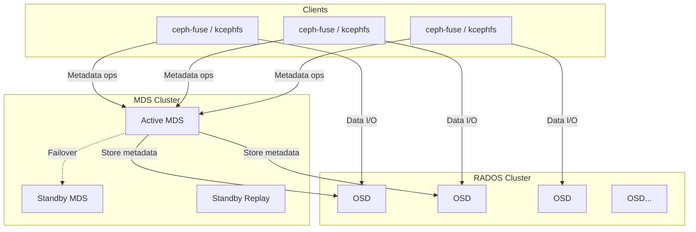
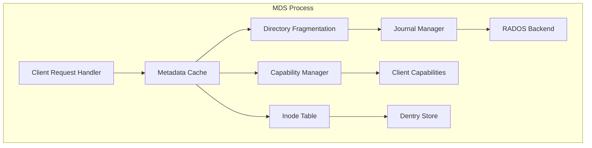
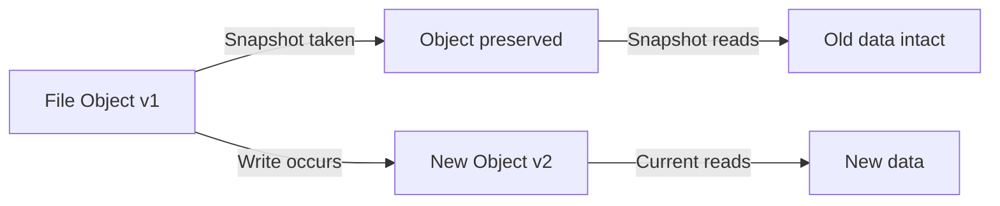

# CephFS: The Ceph Distributed File System

## Introduction

CephFS is a POSIX-compliant distributed file system built on top of Ceph's RADOS (Reliable Autonomic Distributed Object Store). It provides a familiar file and directory interface while leveraging Ceph's scalable, self-healing storage backend. CephFS is used in environments requiring petabyte-scale shared storage: research computing, media production, cloud infrastructure, and high-performance computing.

Unlike NFS or SMB, CephFS is **natively distributed**—there is no single server. Metadata and data are spread across a cluster of commodity hardware, with no single point of failure.

## Architecture Overview

CephFS consists of three primary components:

1. **Metadata Server (MDS)**: Manages the file system namespace (directory hierarchy, file metadata, permissions).
2. **RADOS**: The object storage backend that holds actual file data.
3. **Clients**: Access the file system via FUSE (`ceph-fuse`) or the in-kernel client (`kcephfs`).



### The CRUSH Algorithm

Ceph uses **CRUSH** (Controlled Replication Under Scalable Hashing) to determine data placement without a central lookup table. CRUSH takes the object name and computes placement directly, making it infinitely scalable.

```python
# Pseudocode: CRUSH placement
def crush_place(object_name, osd_map):
    # Hash the object name
    hash_val = hash(object_name)
    # Map to placement group
    pg_id = hash_val % num_placement_groups
    # Map placement group to OSDs using cluster map
    osds = osd_map.get_osds(pg_id)
    return osds  # Primary, secondary, tertiary...
```

## Metadata Server (MDS) Architecture

The MDS is the most complex component of CephFS. It manages the entire file system namespace and caches state for performance.

### MDS Roles

| Role | Description |
|------|-------------|
| **Active** | Serves metadata requests, manages namespace |
| **Standby** | Ready to take over if the active MDS fails |
| **Standby Replay** | Follows the active MDS's journal for faster failover |
| **Damaged** | MDS is in a damaged state, requires intervention |

### MDS Internal Structure



### Metadata Operations

When a client performs a metadata operation (e.g., `ls`, `stat`, `mkdir`):

1. Client sends request to the **active MDS**.
2. MDS checks its **cache** for the requested metadata.
3. If cache miss, MDS reads from **RADOS** (where metadata is stored as RADOS objects).
4. MDS caches the result and responds to the client.
5. For write operations (create, rename, unlink), MDS journals the change to RADOS before acknowledging.

### MDS Journaling

All metadata mutations are journaled for crash consistency:

```
Journal Entry:
├── ESubtreeMap     (subtree boundaries)
├── EUpdate         (namespace mutations)
│   ├── mkdir
│   ├── rename
│   ├── unlink
│   └── setattr
├── EOpen           (open file tracking)
├── ESession        (client session state)
└── ETableClient    (table updates)
```

The journal is stored as a RADOS object and is replayed on failover.

### Directory Fragmentation

Large directories are automatically split into **fragments** for parallel access:

```
Directory: /data/
├── Fragment 0x00000000: files 0x000-0x0FF
├── Fragment 0x10000000: files 0x100-0x1FF
├── Fragment 0x20000000: files 0x200-0x2FF
└── Fragment 0x30000000: files 0x300-0x3FF
```

Fragmentation is controlled by:

```bash
# Configure directory fragmentation
ceph mds set allow_dirfrags true

# Check fragment status
ceph tell mds.0 dump cache /data
```

## RADOS Backend

CephFS stores all data in RADOS, organized into pools:

```bash
# CephFS data pools
ceph osd pool create cephfs_data 128     # File data
ceph osd pool create cephfs_metadata 64  # MDS metadata

# Create the file system
ceph fs new cephfs cephfs_metadata cephfs_data
```

### Data Layout

File data is striped across RADOS objects:

```
File: /data/largefile.bin (size: 10GB)

Object Layout:
├── 10000000000.00000000  (0-4MB)
├── 10000000000.00000001  (4-8MB)
├── 10000000000.00000002  (8-12MB)
└── ...                   (each object is stripe_size bytes)

Stripe Unit: 4MB (default)
Stripe Count: 1 (default)
```

The layout is configurable per-file or per-directory:

```bash
# Set file layout
ceph fs set-layout /data/pool cephfs_data --stripe-unit 1048576 --stripe-count 4

# View layout
getfattr -n ceph.file.layout /data/largefile.bin
```

## Snapshots

CephFS supports **subvolume snapshots** and **per-directory snapshots** (the latter requires enabling at the pool level).

### Subvolume Snapshots (Recommended)

```bash
# Create a subvolume
ceph fs subvolume create cephfs my_subvol --size 10737418240

# Create a snapshot
ceph fs subvolume snapshot create cephfs my_subvol snap1

# List snapshots
ceph fs subvolume snapshot ls cephfs my_subvol

# Restore from snapshot (create a clone)
ceph fs subvolume snapshot clone cephfs my_subvol snap1 my_clone

# Remove snapshot
ceph fs subvolume snapshot rm cephfs my_subvol snap1
```

### Per-Directory Snapshots

```bash
# Enable per-directory snapshots (pool-level)
ceph mds set allow_new_snaps true

# Create snapshot via mkdir in .snap directory
mkdir /mnt/cephfs/.snap/my_snapshot

# List snapshots
ls /mnt/cephfs/.snap/

# Remove snapshot
rmdir /mnt/cephfs/.snap/my_snapshot
```

### Snapshot Internals

CephFS snapshots use a **copy-on-write** mechanism at the RADOS level:



## Quotas

CephFS supports **per-subvolume** and **per-directory** quotas.

### Subvolume Quotas

```bash
# Create subvolume with quota
ceph fs subvolume create cephfs my_subvol --size 5368709120  # 5GB

# Resize quota
ceph fs subvolume resize cephfs my_subvol 10737418240  # 10GB

# View quota
ceph fs subvolume info cephfs my_subvol
```

### Directory Quotas (xattr-based)

```bash
# Set max bytes
setfattr -n ceph.quota.max_bytes -v 10737418240 /mnt/cephfs/data

# Set max files
setfattr -n ceph.quota.max_files -v 100000 /mnt/cephfs/data

# View quota
getfattr -n ceph.quota.max_bytes /mnt/cephfs/data
```

## Client Access: ceph-fuse vs Kernel Client

### ceph-fuse (FUSE Client)

The FUSE client runs in userspace and communicates with the MDS and OSDs directly.

```bash
# Mount with ceph-fuse
ceph-fuse -n client.myuser /mnt/cephfs

# With custom keyring
ceph-fuse --keyring=/etc/ceph/ceph.client.myuser.keyring /mnt/cephfs

# /etc/fstab entry
# none /mnt/cephfs fuse.ceph ceph.id=myuser,_netdev 0 0
```

**Advantages:**
- Easier to update (no kernel module required).
- Full feature parity with the latest Ceph release.
- Works on any kernel version.

**Disadvantages:**
- Higher latency due to user-kernel-userspace context switches.
- Lower throughput for metadata-heavy workloads.
- Single-threaded by default (though multi-threading is available).

### Kernel Client (kcephfs)

The in-kernel Ceph client (`ceph.ko`) mounts CephFS directly:

```bash
# Mount with kernel client
mount -t ceph 192.168.1.10:6789:/ /mnt/cephfs -o name=admin,secret=AQ...==

# With /etc/fstab
# 192.168.1.10:6789:/ /mnt/cephfs ceph name=admin,secretfile=/etc/ceph/secret,noatime 0 0
```

**Advantages:**
- Lower latency (direct kernel-to-OSD communication via libceph).
- Better throughput for sequential I/O.
- Integrates with the kernel's page cache and VFS.

**Disadvantages:**
- Tied to kernel version (features may lag behind ceph-fuse).
- Kernel bugs can crash the system.
- Requires kernel module support.

### Comparison

| Feature | ceph-fuse | Kernel Client |
|---------|-----------|---------------|
| Latency | Higher | Lower |
| Throughput | Lower | Higher |
| Kernel dependency | None | ceph.ko + libceph |
| Feature completeness | Latest | May lag |
| Crash impact | User process | Kernel panic |
| DAX support | No | Yes (kernel 5.11+) |
| Async I/O | Limited | Full support |
| Fscache integration | No | Yes |

### Mounting Options

```bash
# Common kernel client options
mount -t ceph mon_addr:/ /mnt/cephfs \
    -o name=admin,secretfile=/etc/ceph/secret \
    -o mds_namespace=cephfs \
    -o rsize=1048576,wsize=1048576 \
    -o noatime \
    -o recover_session=clean
```

## Deployment and Administration

### Basic Cluster Setup

```bash
# Install cephadm
apt install cephadm ceph-common

# Bootstrap cluster
cephadm bootstrap --mon-ip 192.168.1.10

# Add OSDs
ceph orch apply osd --all-available-devices

# Create file system
ceph fs new cephfs cephfs_metadata cephfs_data

# Verify
ceph fs status cephfs
```

### Health Monitoring

```bash
# Cluster health
ceph health detail

# File system status
ceph fs status cephfs

# MDS performance
ceph tell mds.0 perf dump

# Check for slow requests
ceph daemon mds.0 dump_historic_ops
```

### MDS Tuning

```ini
# /etc/ceph/ceph.conf
[mds]
mds_cache_size = 100000          # Max cached inodes
mds_cache_mid = 0.7              # Cache midpoint for LRU
mds_recall_max_decay_rate = 1.0  # Capability recall rate
mds_log_max_segments = 128       # Journal segments
```

## Performance Tuning

```bash
# Increase readahead for sequential workloads
echo 8192 > /sys/class/bdi/ceph-0/read_ahead_kb

# Enable client-side caching (kernel client)
mount -t ceph ... -o fsc  # Enables fscache

# Tune placement groups
ceph osd pool set cephfs_data pg_num 256
ceph osd pool set cephfs_data pgp_num 256

# Async dirops for metadata-heavy workloads (kernel 5.10+)
mount -t ceph ... -o async_dirop
```

## Ceph Architecture (Kernel Perspective)

From the Linux kernel documentation, Ceph is designed to provide good performance, reliability, and scalability with these architectural properties:

### Design Principles

- **POSIX semantics**: Full compatibility with standard file operations
- **Seamless scaling**: From 1 to many thousands of nodes without reconfiguration
- **No single point of failure**: High availability through N-way replication
- **Fast recovery**: Data is re-replicated by storage nodes themselves (minimal MDS coordination)
- **Automatic rebalancing**: When nodes are added or removed, data migrates automatically
- **Easy deployment**: Most components are userspace daemons

### Metadata Server Design

The MDS takes an unconventional approach to metadata storage:

- **Embedded inodes**: Inodes with only a single link are embedded in directories, allowing entire directories of dentries and inodes to be loaded with a single I/O operation
- **Dynamic redistribution**: Metadata is redistributed in response to workload changes
- **Large directory fragmentation**: Extremely large directories can be fragmented and managed by independent metadata servers for scalable concurrent access
- **Consistent distributed cache**: MDS nodes form a large, consistent, distributed in-memory cache above the file namespace

### Data Placement with CRUSH

Unlike cluster filesystems (GFS, OCFS2, GPFS) that rely on symmetric access to shared block devices, Ceph separates data and metadata management into independent server clusters. Data is striped across storage nodes in large chunks using the **CRUSH** algorithm:

```python
# CRUSH placement (simplified)
def crush_place(object_name, osd_map):
    hash_val = hash(object_name)
    pg_id = hash_val % num_placement_groups
    osds = osd_map.get_osds(pg_id)
    return osds  # Primary, secondary, tertiary...
```

### Kernel Client Mount Options

```bash
# Basic mount syntax
mount -t ceph user@fsid.fs_name=/[subdir] mnt -o mon_addr=monip1[:port]

# Multiple monitors (slash-separated)
mount -t ceph cephuser@cephfs=/ /mnt/ceph -o mon_addr=192.168.1.100/192.168.1.101

# Key options:
#   mon_addr=ip[:port]    — Monitor address (bootstraps connection)
#   wsize=X               — Max write size (default: 64MB)
#   rsize=X               — Max read size (default: 64MB)
#   rasize=X              — Max readahead size (default: 8MB)
#   mount_timeout=X       — Mount timeout in seconds (default: 60)
#   caps_max=X            — Max caps to hold (0 = no limit)
#   rbytes / norbytes    — Report directory size as sum of files or entry count
#   nocrc                 — Disable CRC32C for data writes
#   dcache / nodcache     — Use/avoid dcache for negative lookups
#   recover_session=clean — Auto-reconnect after blocklisting
```

### Snapshots (Kernel Mechanism)

CephFS snapshots use **copy-on-write** at the RADOS level:

- Snapshot creation: `mkdir .snap/foo`
- Snapshot deletion: `rmdir .snap/foo`
- Snapshot names cannot start with `_` (reserved for MDS internal use)
- Snapshot names limited to 240 characters (due to internal naming: `__.snap_<id>_<name>`)

### Quotas (xattr-based)

```bash
# Set directory quota
setfattr -n ceph.quota.max_bytes -v 100000000 /some/dir
setfattr -n ceph.quota.max_files -v 100000 /some/dir

# Recursive accounting (no du needed)
getfattr -n ceph.dir.rfiles /some/dir    # Total nested files
getfattr -n ceph.dir.rbytes /some/dir    # Total nested bytes
```

**Limitation**: Quotas rely on client cooperation — a modified or adversarial client cannot be prevented from writing.

### recover_session Modes

| Mode | Behavior |
|------|----------|
| `no` (default) | Never reconnect after blocklisting; operations fail |
| `clean` | Auto-reconnect; drops dirty data/metadata, invalidates caches; stale file locks block read/write until released |

## Further Reading

- [CephFS Documentation](https://docs.ceph.com/en/latest/cephfs/) — Official Ceph docs
- [Linux kernel: CephFS client](https://docs.kernel.org/filesystems/ceph.html) — Kernel documentation
- [Ceph Architecture](https://docs.ceph.com/en/latest/architecture/) — Ceph architecture overview
- [LWN: CephFS](https://lwn.net/Articles/647377/) — CephFS kernel client discussion
- [man7.org: mount.ceph](https://man7.org/linux/man-pages/man8/mount.ceph.8.html) — Mount options
- [CRUSH Algorithm Paper](https://ceph.io/assets/pdfs/weil-crush-sc06.pdf) — Original CRUSH paper
- [docs.kernel.org: libceph](https://docs.kernel.org/rst/networking/device_drivers/ethernet/mellanox/mlx5/index.html) — Kernel Ceph client internals
- [Kernel documentation: Ceph Distributed File System](https://docs.kernel.org/filesystems/ceph.html) — Official kernel docs with mount options and architecture
