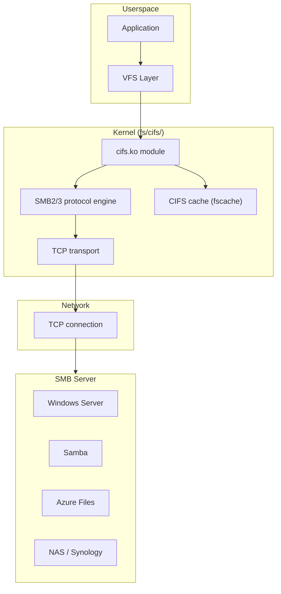
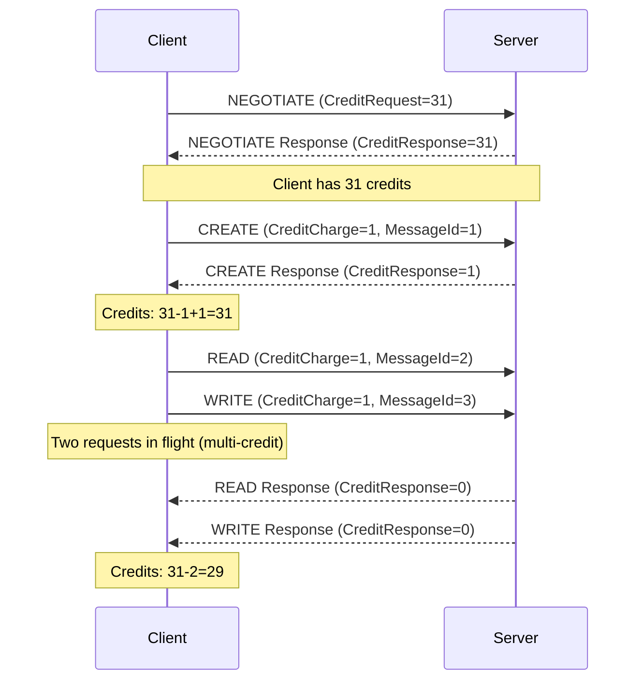
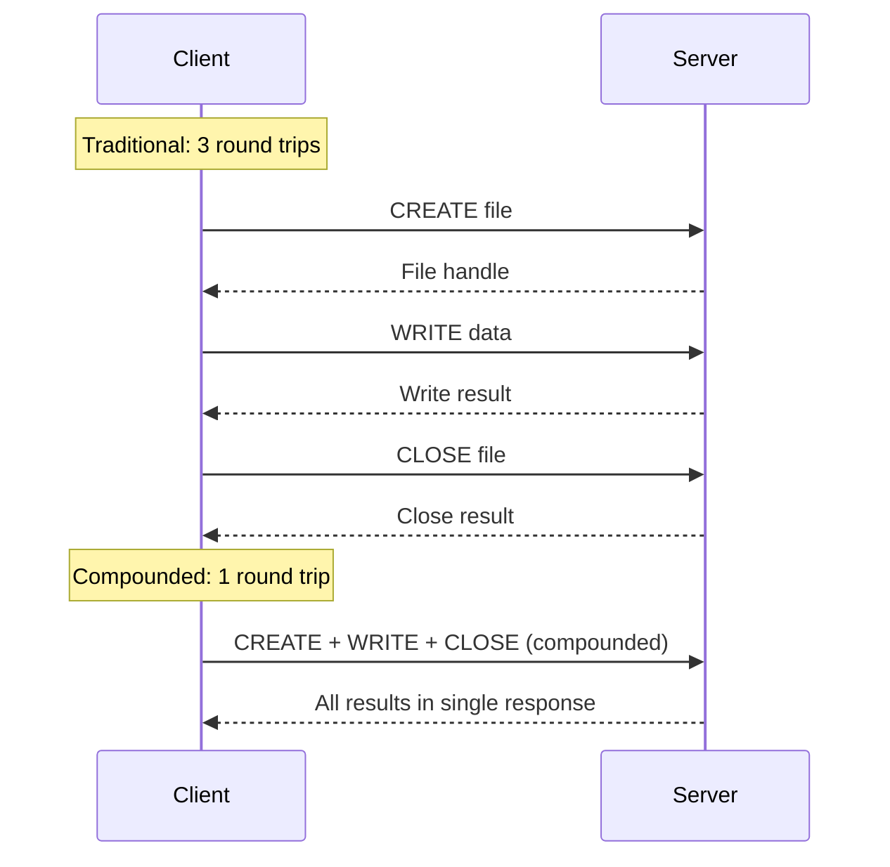
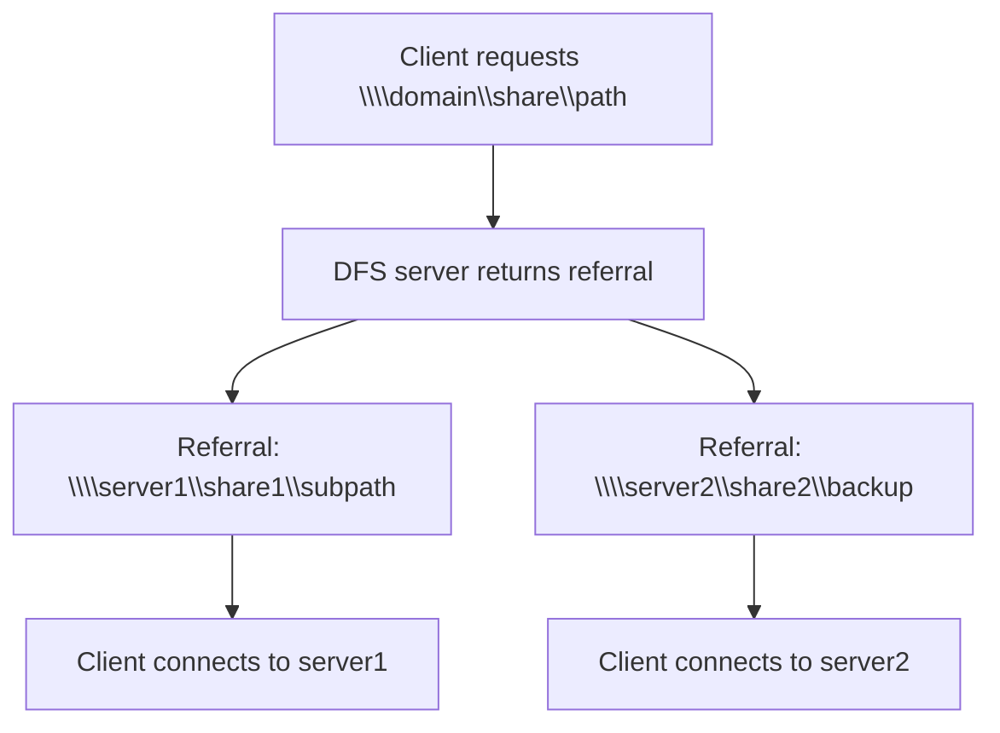
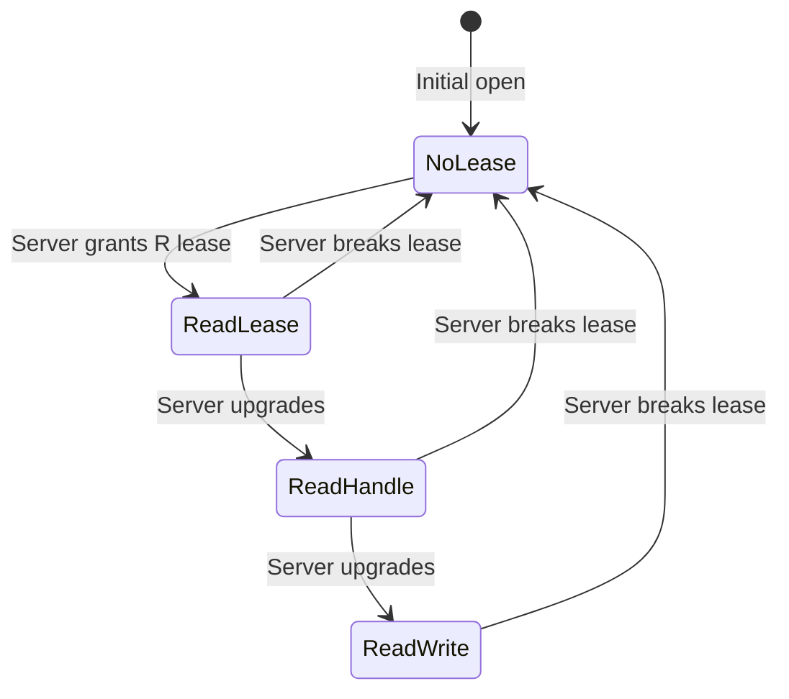
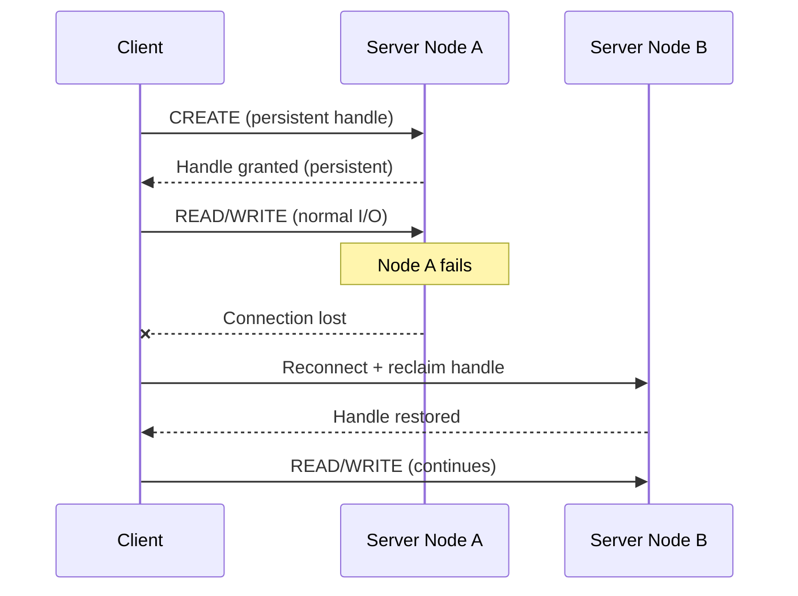
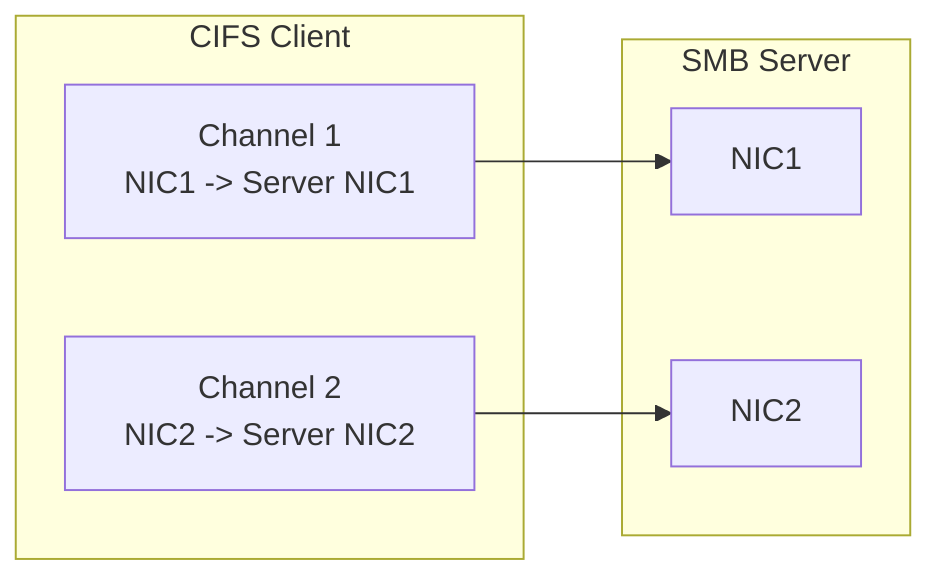

# CIFS/SMB Filesystem Client

## Overview

CIFS (Common Internet File System) / SMB (Server Message Block) is the standard file-sharing protocol used by Windows, Samba, and modern NAS devices. The Linux kernel client (`cifs.ko`) allows mounting remote SMB shares as local filesystems, providing transparent read/write access to files on Windows servers, Samba shares, and cloud storage (Azure Files, AWS FSx).

The kernel CIFS module implements SMB2/SMB3 protocol support (the older CIFS dialect is deprecated). It handles authentication, encryption, opportunistic locks (oplocks), and persistent file handles.

> **Source:** `fs/cifs/`  
> **Module:** `cifs`  
> **Mount helper:** `mount.cifs` (from `cifs-utils` package)

---

## Architecture



---

## SMB Protocol Versions

| Version | Dialect | Year | Features |
|---------|---------|------|----------|
| SMB1 | NT1 | 1996 | Legacy, insecure, deprecated |
| SMB2 | 2.0.2 | 2006 | Improved performance, large reads/writes |
| SMB 2.1 | 2.1 | 2010 | Leasing, large MTU |
| SMB3 | 3.0 | 2012 | Encryption, multichannel, persistent handles |
| SMB 3.0.2 | 3.0.2 | 2014 | Performance improvements |
| SMB 3.1.1 | 3.1.1 | 2015 | AES-128-CCM encryption, pre-auth integrity |

### Protocol Negotiation

```bash
# Check which dialect is negotiated
cat /proc/fs/cifs/DebugData | grep -i dialect
# or
mount | grep cifs
```

---

## Mounting SMB Shares

### Basic Mount

```bash
# Mount with mount.cifs helper
mount -t cifs //server/share /mnt/share \
    -o username=user,password=pass

# Mount with domain
mount -t cifs //server/share /mnt/share \
    -o domain=WORKGROUP,username=user,password=pass

# Mount with credentials file
mount -t cifs //server/share /mnt/share \
    -o credentials=/etc/samba/creds

# /etc/samba/creds format:
# username=user
# password=pass
# domain=WORKGROUP
```

### Mount Options

```bash
# Common mount options
mount -t cifs //server/share /mnt/share -o \
    vers=3.0,           # SMB version (2.0, 2.1, 3.0, 3.1.1)
    username=user,      # Username
    password=pass,      # Password (or credentials=file)
    domain=WORKGROUP,   # Domain/workgroup
    uid=1000,           # Local UID for files
    gid=1000,           # Local GID for files
    file_mode=0644,     # Default file permissions
    dir_mode=0755,      # Default directory permissions
    iocharset=utf8,     # Character encoding
    noperm,             # Don't check local permissions
    serverino,          # Use server inode numbers
    cache=strict,       # Caching mode
    mfsymlinks,         # Minshall+French symlinks
    seal,               # SMB3 encryption
    multiuser,          # Multiuser mount (Kerberos)
    sec=ntlmsspi        # Security type
```

### SMB Version Selection

```bash
# Force SMB3 (recommended)
mount -t cifs //server/share /mnt -o vers=3.0

# Force SMB3.1.1 (most secure)
mount -t cifs //server/share /mnt -o vers=3.1.1

# Auto-negotiate (default)
mount -t cifs //server/share /mnt -o vers=default

# Legacy SMB1 (avoid)
mount -t cifs //server/share /mnt -o vers=1.0
```

### Multiuser Mounts

```bash
# Mount with Kerberos (multiuser)
mount -t cifs //server/share /mnt/share \
    -o sec=krb5,multiuser,cruid=$UID

# Users authenticate individually via cifscreds
cifscreds add server
# Enter password for user@server
```

---

## Authentication

### Security Modes

| Mode | Description | Use Case |
|------|-------------|----------|
| `sec=none` | No authentication | Guest shares |
| `sec=ntlm` | NTLM v1 | Legacy (avoid) |
| `sec=ntlmv2` | NTLM v2 | Windows domains |
| `sec=ntlmssp` | NTLMSSP | Default for Windows |
| `sec=ntlmsspi` | NTLMSSP with signing | Secure default |
| `sec=krb5` | Kerberos v5 | Enterprise SSO |
| `sec=krb5i` | Kerberos with signing | Most secure |

### Kerberos Authentication

```bash
# Get Kerberos ticket
kinit user@REALM.COM

# Mount with Kerberos
mount -t cifs //server/share /mnt \
    -o sec=krb5,multiuser,cruid=$(id -u)

# Verify ticket
klist
```

---

## Performance Tuning

### Read/Write Sizes

```bash
# Increase read/write sizes for better throughput
mount -t cifs //server/share /mnt \
    -o rsize=1048576,wsize=1048576
    # Max: 1MB for SMB3, 128KB for SMB2

# Check current values
cat /proc/fs/cifs/DebugData | grep -i "rsize\|wsize"
```

### Caching

```bash
# Cache modes
mount -t cifs //server/share /mnt -o cache=strict
# strict    — Default. Caches aggressively, oplock-based
# none      — No caching (always read from server)
# looserelaxed — Loose caching (less server validation)
# single    — Single client caching

# Fscache integration (cache to local disk)
# Requires CONFIG_CIFS_FSCACHE=y
mount -t cifs //server/share /mnt -o fsc
```

### Multichannel (SMB3)

```bash
# Enable multichannel (multiple TCP connections)
mount -t cifs //server/share /mnt -o multichannel

# Check active channels
cat /proc/fs/cifs/DebugData | grep -i channel
```

### Direct I/O

```bash
# Use direct I/O (bypass page cache)
mount -t cifs //server/share /mnt -o directio

# Force strict cache (default, recommended)
mount -t cifs //server/share /mnt -o cache=strict
```

---

## Encryption

### SMB3 Encryption

```bash
# Enable encryption (SMB3+)
mount -t cifs //server/share /mnt -o seal

# Check if encryption is active
cat /proc/fs/cifs/DebugData | grep -i encrypt
```

### Encryption Algorithms

| SMB Version | Algorithm | Key Size |
|-------------|-----------|----------|
| SMB 3.0 | AES-128-CCM | 128-bit |
| SMB 3.0.2 | AES-128-CCM | 128-bit |
| SMB 3.1.1 | AES-128-GCM | 128-bit (preferred) |

---

## /proc and /sys Interfaces

### /proc/fs/cifs/

```bash
# Debug data
cat /proc/fs/cifs/DebugData
# Shows: active connections, shares, SMB dialects, stats

# Statistics
cat /proc/fs/cifs/Stats
# Shows: operations count, bytes read/written, errors

# Security flags
cat /proc/fs/cifs/security_flags

# Lookup cache timeout
cat /proc/fs/cifs/lookupCacheEnabled
echo 1 > /proc/fs/cifs/lookupCacheEnabled  # Enable
```

### Per-Mount Stats

```bash
# Mount-specific statistics
cat /proc/mounts | grep cifs
# Shows mount options and server info

# SMB session info
cat /proc/fs/cifs/DebugData | head -30
```

---

## SMB3 Features

### Persistent File Handles

SMB3 persistent handles survive server failover (clustered environments):

```bash
# Enable persistent handles
mount -t cifs //server/share /mnt -o persistenthandles
```

### Leases (Oplocks)

SMB3 leases provide caching guarantees:

```bash
# Enable leases (default)
mount -t cifs //server/share /mnt -o nobrl
# Leases are enabled by default with cache=strict
```

### Directory Leases

```bash
# Directory caching (SMB3.1.1+)
mount -t cifs //server/share /mnt -o nodfs
```

---

## Symbolic Links

### Minshall+French Symlinks

SMB doesn't natively support Unix symlinks. The `mfsymlinks` option creates special files that appear as symlinks:

```bash
# Enable MF symlinks
mount -t cifs //server/share /mnt -o mfsymlinks

# MF symlinks are small files with special content:
# !<symlink>\xff\xfe + UTF-16LE target path
```

---

## Troubleshooting

### Connection Issues

```bash
# Test SMB connectivity
smbclient -L //server -U user

# Check SMB port (445)
nc -zv server 445

# Check DNS resolution
nslookup server

# Force specific SMB version
mount -t cifs //server/share /mnt -o vers=3.0

# Check dmesg for CIFS errors
dmesg | grep -i cifs
```

### Authentication Failures

```bash
# Check credentials
smbclient //server/share -U user

# Try different security modes
mount -t cifs //server/share /mnt -o sec=ntlmssp,username=user

# Check Kerberos ticket
klist
kinit user@REALM

# Verify password
ntlm_auth --username=user --password=pass
```

### Performance Issues

```bash
# Check current mount options
mount | grep cifs

# Test with larger read/write sizes
mount -t cifs //server/share /mnt -o rsize=1048576,wsize=1048576

# Benchmark throughput
dd if=/mnt/share/testfile of=/dev/null bs=1M count=1000

# Check network latency
ping server
```

### Permission Issues

```bash
# Check server-side permissions
smbclient //server/share -U user -c "ls"

# Mount with specific UID/GID
mount -t cifs //server/share /mnt -o uid=1000,gid=1000

# Force file/directory modes
mount -t cifs //server/share /mnt -o file_mode=0666,dir_mode=0777

# Disable local permission checks
mount -t cifs //server/share /mnt -o noperm
```

---

## KSMBD: In-Kernel SMB Server

**ksmbd** is an in-kernel SMB3 server (alternative to Samba):

```bash
# Load ksmbd module
modprobe ksmbd

# Configure /etc/ksmbd/ksmbd.conf
# [global]
#     workgroup = WORKGROUP
#
# [share]
#     path = /data
#     read only = no

# Start ksmbd
ksmbd.mountd

# From client:
# mount -t cifs //server/share /mnt -o username=user
```

### ksmbd vs Samba

| Aspect | ksmbd | Samba |
|--------|-------|-------|
| Implementation | In-kernel | Userspace |
| Performance | Higher (no context switches) | Lower |
| Features | SMB3 focused | Full SMB/CIFS/AD |
| Maturity | Newer (since 5.15) | Decades old |
| Configuration | Minimal | Full-featured |

---

## On-Disk / Wire Protocol Structures

### SMB2 Header

Every SMB2/SMB3 packet starts with a 64-byte header:

```c
/* MS-SMB2 2.2.1 */
struct smb2_hdr {
    __le32 ProtocolId;       /* 0xFE534D42 ("\xfeSMB") */
    __le16 StructureSize;    /* Must be 64 */
    __le16 CreditCharge;     /* Credits consumed */
    __le32 Status;           /* NT status (response) */
    __le16 Command;          /* SMB2 command code */
    __le16 CreditRequest;    /* Credits requested (response) */
    __le32 Flags;            /* SMB2_FLAGS_* */
    __le32 NextCommand;      /* Offset to next in compound */
    __le64 MessageId;        /* Sequence number */
    __le32 Reserved;
    __le32 TreeId;           /* Tree connect ID */
    __le64 SessionId;        /* Session identifier */
    __u8   Signature[16];    /* HMAC-SHA256 signature */
};
```

### Key SMB2 Commands

| Command | Code | Purpose |
|---------|------|----------|
| NEGOTIATE | 0x0000 | Protocol negotiation |
| SESSION_SETUP | 0x0001 | Authentication |
| LOGOFF | 0x0002 | Session teardown |
| TREE_CONNECT | 0x0003 | Share connection |
| TREE_DISCONNECT | 0x0004 | Share disconnect |
| CREATE | 0x0005 | Open/create files |
| CLOSE | 0x0006 | Close file handle |
| READ | 0x0008 | Read data |
| WRITE | 0x0009 | Write data |
| QUERY_DIRECTORY | 0x000E | List directory |
| CHANGE_NOTIFY | 0x000F | Directory change monitoring |
| QUERY_INFO | 0x0010 | File/system info |
| SET_INFO | 0x0011 | Set file info |
| IOCTL | 0x0011 | FSCTL operations |
| OPLOCK_BREAK | 0x0024 | Lease/oplock break notification |

### NT Status Codes

The CIFS client maps NT status codes to Linux errno values:

```c
/* fs/cifs/netmisc.c - simplified */
static const struct { int ntstatus; int errno_val; } nt_to_unix[] = {
    { 0x00000000, 0 },           /* STATUS_SUCCESS */
    { 0xC000000D, -EINVAL },     /* STATUS_INVALID_PARAMETER */
    { 0xC000000F, -ENOENT },     /* STATUS_NO_SUCH_FILE */
    { 0xC0000022, -EACCES },     /* STATUS_ACCESS_DENIED */
    { 0xC0000034, -ENOENT },     /* STATUS_OBJECT_NAME_NOT_FOUND */
    { 0xC0000043, -EACCES },     /* STATUS_LOCK_NOT_GRANTED */
    { 0x80000005, -EIO },        /* STATUS_BUFFER_OVERFLOW */
    { 0xC000006D, -ECONNABORTED },/* STATUS_CONNECTION_ABORTED */
    { 0xC0000120, -ECANCELED },  /* STATUS_CANCELLED */
};
```

## Credit-Based Flow Control

SMB2/SMB3 uses a **credit-based flow control** mechanism to prevent clients from overwhelming the server:



- **CreditCharge**: Number of credits consumed per request (large I/O uses more)
- **CreditRequest/CreditResponse**: Grants additional credits
- **Maximum credits**: Typically 512-8192 depending on server
- **Multi-credit operations**: Large reads/writes consume multiple credits

```c
/* fs/cifs/smb2pdu.c - credit tracking */
struct cifs_credits {
    unsigned int total_credits;     /* Total available */
    unsigned int in_flight;         /* Currently in-flight */
    spinlock_t lock;
};
```

## SMB3 Compounding

SMB3 allows **compounding** multiple operations into a single network request, reducing round trips:



```bash
# The kernel CIFS client uses compounding for:
# - Query directory + file info lookups
# - Open + read sequences
# - Write + close sequences

# Compounding is automatic; no mount option needed
# Internally uses NextCommand field in SMB2 header
```

### Compound Request Structure

```c
/* Compounded requests chain via NextCommand offset */
struct smb2_compound_hdr {
    struct smb2_hdr hdr1;        /* First request */
    /* hdr1.NextCommand = offset to hdr2 */
    struct smb2_hdr hdr2;        /* Second request */
    /* hdr2.NextCommand = 0 (last in chain) */
    /* Per-request data follows each header */
};
```

## DFS (Distributed File System) Referrals

The CIFS client supports **DFS** (Distributed File System), which allows shares to span multiple servers:



```bash
# DFS is automatic when connecting to domain-based shares
# mount -t cifs //domain.com/share /mnt \
#     -o username=user,domain=EXAMPLE

# The client sends FSCTL_DFS_GET_REFERRALS to the server
# and follows referrals transparently

# Check DFS referral info
cat /proc/fs/cifs/DebugData | grep -i dfs
```

### DFS Referral Types

| Type | Description |
|------|-------------|
| Type 1 | Single target (simple redirection) |
| Type 2 | Multiple targets with priority |
| Type 3 | DFS root with subfolder targets |
| Type 4 | DFS root with multiple root targets |

## Directory Leasing (SMB 3.1.1)

Directory leases allow clients to cache directory listings without re-querying the server:

```bash
# Directory leases are enabled by default with SMB 3.1.1
# The client caches directory entries for the lease duration

# Disable directory caching
mount -t cifs //server/share /mnt -o nodfs

# Lease break: server notifies client when directory changes
# Client invalidates cached listing and re-reads
```

```c
/* fs/cifs/smb2ops.c - lease handling */
struct cifs_lease {
    u8 lease_key[SMB2_LEASE_KEY_SIZE]; /* 16 bytes */
    unsigned int epoch;
    unsigned int state;
    /* Lease states: SMB2_LEASE_NONE, READ, HANDLE, WRITE */
};
```

### Lease State Transitions



## Change Notify

SMB2/3 supports directory change notifications, allowing clients to be alerted when files change:

```bash
# The kernel CIFS client supports inotify/dnotify
# through SMB2 CHANGE_NOTIFY requests

# Watch a directory (uses inotify under the hood)
inotifywait -m /mnt/smbshare/

# The kernel sends SMB2_CHANGE_NOTIFY to the server
# Server responds when directory contents change
```

```c
/* fs/cifs/smb2ops.c - change notify */
int smb2_notify(const unsigned int xid, struct cifs_tcon *tcon,
                struct cifs_fid *fid, u32 completion_filter, bool watch_tree)
{
    /* Sends SMB2 CHANGE_NOTIFY request */
    /* completion_filter: FILE_NOTIFY_CHANGE_* flags */
    /* Server responds asynchronously when changes occur */
}
```

## Key Kernel Data Structures

### struct cifs_ses (SMB Session)

```c
/* fs/cifs/cifsglob.h */
struct cifs_ses {
    struct list_head list;           /* Global session list */
    struct cifs_tcon *tcon_ipc;      /* IPC$ connection */
    char *server_name;               /* Server hostname */
    char *user_name;                 /* Username */
    char *domainName;                /* Domain name */
    __u16 Suid;                      /* Session ID */
    unsigned int status;             /* Session state */
    unsigned capabilities;           /* Server capabilities */
    struct session_key auth_key;     /* Authentication key */
    __u8 smb3signingkey[SMB3_SIGN_KEY_SIZE]; /* Signing key */
    __u8 smb3encryptionkey[SMB3_SIGN_KEY_SIZE]; /* Encryption key */
    struct nls_table *local_nls;     /* Character encoding */
};
```

### struct cifs_tcon (Tree Connect / Share)

```c
/* fs/cifs/cifsglob.h */
struct cifs_tcon {
    struct list_head list;           /* Session share list */
    struct cifs_ses *ses;            /* Parent session */
    char treeName[MAX_TREE_SIZE + 1];/* Share name */
    char *nativeFileSystem;          /* Server FS type */
    __u32 tid;                       /* Tree ID */
    unsigned share_flags;            /* Share flags */
    unsigned share_capabilities;     /* Share capabilities */
    unsigned maximal_access;         /* Max granted access */
    struct cifs_fid crfid;           /* Cached root fid */
    bool print:1;                    /* Printer share */
    bool pipe:1;                     /* Named pipe */
    bool ipc:1;                      /* IPC$ share */
    bool seal:1;                     /* Encryption enabled */
    bool unix_ext:1;                 /* POSIX extensions */
};
```

### struct cifsFileInfo (Open File)

```c
/* fs/cifs/cifsglob.h */
struct cifsFileInfo {
    struct list_head list;           /* Open file list */
    struct cifs_tcon *tcon;          /* Share */
    __u32 pid;                       /* Process ID */
    __u16 fid;                       /* File ID (v1) */
    struct cifs_fid cfid;            /* Cached fid (SMB2+) */
    unsigned int f_flags;            /* Open flags */
    struct dentry *dentry;           /* Directory entry */
    struct cifs_search_info srch_inf; /* Search state */
    bool invalidHandle:1;            /* Handle needs reconnect */
    bool oplock_break_cancelled:1;   /* Oplock break pending */
};
```

## Persistent File Handles (SMB3)

Persistent handles survive server restarts and cluster failover:



```bash
# Enable persistent handles (SMB3+ only)
mount -t cifs //server/share /mnt -o persistenthandles

# Requires server support (Windows Scale-Out File Server)
# On failure: client reconnects and reclaims handles
# No data loss or application-visible errors
```

## Connection Multiplexing

The kernel CIFS client supports **multiple TCP connections** per session for higher throughput:

```bash
# SMB3 multichannel
mount -t cifs //server/share /mnt -o multichannel

# The client creates multiple TCP connections
# across different network paths (NICs)
# File I/O is striped across channels

# Check channels
cat /proc/fs/cifs/DebugData | grep -i channel
```

### Multichannel Architecture



## POSIX Extensions

The CIFS client supports Samba's POSIX extensions for Unix-specific features:

```bash
# Enable POSIX extensions
mount -t cifs //server/share /mnt -o posix

# With POSIX extensions:
# - Hard links work
# - Symlinks work natively (not MF symlinks)
# - Unix permissions are preserved
# - Special files (FIFOs, sockets) work

# Requires Samba server with 'unix extensions = yes'
```

### POSIX vs Windows Behavior

| Feature | Without POSIX | With POSIX |
|---------|---------------|------------|
| Symlinks | MF symlinks (files) | Native symlinks |
| Hard links | Not supported | Supported |
| Permissions | Mapped to ACLs | Unix mode bits |
| Special files | Not supported | FIFOs, sockets |
| File locking | Windows locks | POSIX locks |

## Connection Recovery

The CIFS client handles server disconnections and automatically reconnects:

```c
/* fs/cifs/connect.c - reconnect logic */
int cifs_reconnect(struct cifs_tcon *tcon)
{
    /* 1. Mark all open files as invalid */
    /* 2. Drop existing TCP connection */
    /* 3. Re-establish TCP */
    /* 4. Re-authenticate (SESSION_SETUP) */
    /* 5. Reconnect tree connects */
    /* 6. Re-open files on next access */
}
```

```bash
# Reconnect timeout and retry configuration
mount -t cifs //server/share /mnt \
    -o echo_interval=30,  # Echo keepalive interval (seconds)
    max_credits=512        # Maximum credits

# Monitor connection status
cat /proc/fs/cifs/DebugData | head -20
```

---

## Source Files

| File | Contents |
|------|----------|
| `fs/cifs/cifsfs.c` | CIFS VFS integration, mount |
| `fs/cifs/smb2ops.c` | SMB2/3 protocol operations |
| `fs/cifs/smb2pdu.c` | SMB2/3 protocol data units |
| `fs/cifs/connect.c` | Connection management |
| `fs/cifs/transport.c` | TCP transport layer |
| `fs/cifs/cifssmb.c` | SMB1 protocol (legacy) |
| `fs/cifs/cache.c` | Fscache integration |
| `fs/cifs/inode.c` | Inode operations |
| `fs/cifs/file.c` | File operations |
| `fs/ksmbd/` | In-kernel SMB server |

---

## Further Reading

- **Kernel documentation**: `Documentation/filesystems/cifs/`
- **Samba wiki**: [Samba](https://wiki.samba.org/)
- **ksmbd**: [GitHub](https://github.com/namjaejeon/ksmbd)
- **LWN**: [SMB3.1.1 improvements](https://lwn.net/Articles/1083056/)
- **man pages**: `mount.cifs(8)`, `cifscreds(1)`

---

## See Also

- [Filesystems Overview](./overview.md) — Linux filesystem landscape
- [Network Namespaces](./namespaces.md) — network namespace SMB mounts
- [NFS](./nfs.md) — another network filesystem
- [VFS](./vfs.md) — virtual filesystem layer
