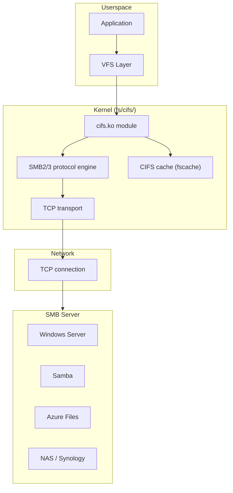

# CIFS/SMB Filesystem Client

## Overview

CIFS (Common Internet File System) / SMB (Server Message Block) is the standard file-sharing protocol used by Windows, Samba, and modern NAS devices. The Linux kernel client (`cifs.ko`) allows mounting remote SMB shares as local filesystems, providing transparent read/write access to files on Windows servers, Samba shares, and cloud storage (Azure Files, AWS FSx).

The kernel CIFS module implements SMB2/SMB3 protocol support (the older CIFS dialect is deprecated). It handles authentication, encryption, opportunistic locks (oplocks), and persistent file handles.

> **Source:** `fs/cifs/`  
> **Module:** `cifs`  
> **Mount helper:** `mount.cifs` (from `cifs-utils` package)

---

## Architecture



---

## SMB Protocol Versions

| Version | Dialect | Year | Features |
|---------|---------|------|----------|
| SMB1 | NT1 | 1996 | Legacy, insecure, deprecated |
| SMB2 | 2.0.2 | 2006 | Improved performance, large reads/writes |
| SMB 2.1 | 2.1 | 2010 | Leasing, large MTU |
| SMB3 | 3.0 | 2012 | Encryption, multichannel, persistent handles |
| SMB 3.0.2 | 3.0.2 | 2014 | Performance improvements |
| SMB 3.1.1 | 3.1.1 | 2015 | AES-128-CCM encryption, pre-auth integrity |

### Protocol Negotiation

```bash
# Check which dialect is negotiated
cat /proc/fs/cifs/DebugData | grep -i dialect
# or
mount | grep cifs
```

---

## Mounting SMB Shares

### Basic Mount

```bash
# Mount with mount.cifs helper
mount -t cifs //server/share /mnt/share \
    -o username=user,password=pass

# Mount with domain
mount -t cifs //server/share /mnt/share \
    -o domain=WORKGROUP,username=user,password=pass

# Mount with credentials file
mount -t cifs //server/share /mnt/share \
    -o credentials=/etc/samba/creds

# /etc/samba/creds format:
# username=user
# password=pass
# domain=WORKGROUP
```

### Mount Options

```bash
# Common mount options
mount -t cifs //server/share /mnt/share -o \
    vers=3.0,           # SMB version (2.0, 2.1, 3.0, 3.1.1)
    username=user,      # Username
    password=pass,      # Password (or credentials=file)
    domain=WORKGROUP,   # Domain/workgroup
    uid=1000,           # Local UID for files
    gid=1000,           # Local GID for files
    file_mode=0644,     # Default file permissions
    dir_mode=0755,      # Default directory permissions
    iocharset=utf8,     # Character encoding
    noperm,             # Don't check local permissions
    serverino,          # Use server inode numbers
    cache=strict,       # Caching mode
    mfsymlinks,         # Minshall+French symlinks
    seal,               # SMB3 encryption
    multiuser,          # Multiuser mount (Kerberos)
    sec=ntlmsspi        # Security type
```

### SMB Version Selection

```bash
# Force SMB3 (recommended)
mount -t cifs //server/share /mnt -o vers=3.0

# Force SMB3.1.1 (most secure)
mount -t cifs //server/share /mnt -o vers=3.1.1

# Auto-negotiate (default)
mount -t cifs //server/share /mnt -o vers=default

# Legacy SMB1 (avoid)
mount -t cifs //server/share /mnt -o vers=1.0
```

### Multiuser Mounts

```bash
# Mount with Kerberos (multiuser)
mount -t cifs //server/share /mnt/share \
    -o sec=krb5,multiuser,cruid=$UID

# Users authenticate individually via cifscreds
cifscreds add server
# Enter password for user@server
```

---

## Authentication

### Security Modes

| Mode | Description | Use Case |
|------|-------------|----------|
| `sec=none` | No authentication | Guest shares |
| `sec=ntlm` | NTLM v1 | Legacy (avoid) |
| `sec=ntlmv2` | NTLM v2 | Windows domains |
| `sec=ntlmssp` | NTLMSSP | Default for Windows |
| `sec=ntlmsspi` | NTLMSSP with signing | Secure default |
| `sec=krb5` | Kerberos v5 | Enterprise SSO |
| `sec=krb5i` | Kerberos with signing | Most secure |

### Kerberos Authentication

```bash
# Get Kerberos ticket
kinit user@REALM.COM

# Mount with Kerberos
mount -t cifs //server/share /mnt \
    -o sec=krb5,multiuser,cruid=$(id -u)

# Verify ticket
klist
```

---

## Performance Tuning

### Read/Write Sizes

```bash
# Increase read/write sizes for better throughput
mount -t cifs //server/share /mnt \
    -o rsize=1048576,wsize=1048576
    # Max: 1MB for SMB3, 128KB for SMB2

# Check current values
cat /proc/fs/cifs/DebugData | grep -i "rsize\|wsize"
```

### Caching

```bash
# Cache modes
mount -t cifs //server/share /mnt -o cache=strict
# strict    — Default. Caches aggressively, oplock-based
# none      — No caching (always read from server)
# looserelaxed — Loose caching (less server validation)
# single    — Single client caching

# Fscache integration (cache to local disk)
# Requires CONFIG_CIFS_FSCACHE=y
mount -t cifs //server/share /mnt -o fsc
```

### Multichannel (SMB3)

```bash
# Enable multichannel (multiple TCP connections)
mount -t cifs //server/share /mnt -o multichannel

# Check active channels
cat /proc/fs/cifs/DebugData | grep -i channel
```

### Direct I/O

```bash
# Use direct I/O (bypass page cache)
mount -t cifs //server/share /mnt -o directio

# Force strict cache (default, recommended)
mount -t cifs //server/share /mnt -o cache=strict
```

---

## Encryption

### SMB3 Encryption

```bash
# Enable encryption (SMB3+)
mount -t cifs //server/share /mnt -o seal

# Check if encryption is active
cat /proc/fs/cifs/DebugData | grep -i encrypt
```

### Encryption Algorithms

| SMB Version | Algorithm | Key Size |
|-------------|-----------|----------|
| SMB 3.0 | AES-128-CCM | 128-bit |
| SMB 3.0.2 | AES-128-CCM | 128-bit |
| SMB 3.1.1 | AES-128-GCM | 128-bit (preferred) |

---

## /proc and /sys Interfaces

### /proc/fs/cifs/

```bash
# Debug data
cat /proc/fs/cifs/DebugData
# Shows: active connections, shares, SMB dialects, stats

# Statistics
cat /proc/fs/cifs/Stats
# Shows: operations count, bytes read/written, errors

# Security flags
cat /proc/fs/cifs/security_flags

# Lookup cache timeout
cat /proc/fs/cifs/lookupCacheEnabled
echo 1 > /proc/fs/cifs/lookupCacheEnabled  # Enable
```

### Per-Mount Stats

```bash
# Mount-specific statistics
cat /proc/mounts | grep cifs
# Shows mount options and server info

# SMB session info
cat /proc/fs/cifs/DebugData | head -30
```

---

## SMB3 Features

### Persistent File Handles

SMB3 persistent handles survive server failover (clustered environments):

```bash
# Enable persistent handles
mount -t cifs //server/share /mnt -o persistenthandles
```

### Leases (Oplocks)

SMB3 leases provide caching guarantees:

```bash
# Enable leases (default)
mount -t cifs //server/share /mnt -o nobrl
# Leases are enabled by default with cache=strict
```

### Directory Leases

```bash
# Directory caching (SMB3.1.1+)
mount -t cifs //server/share /mnt -o nodfs
```

---

## Symbolic Links

### Minshall+French Symlinks

SMB doesn't natively support Unix symlinks. The `mfsymlinks` option creates special files that appear as symlinks:

```bash
# Enable MF symlinks
mount -t cifs //server/share /mnt -o mfsymlinks

# MF symlinks are small files with special content:
# !<symlink>\xff\xfe + UTF-16LE target path
```

---

## Troubleshooting

### Connection Issues

```bash
# Test SMB connectivity
smbclient -L //server -U user

# Check SMB port (445)
nc -zv server 445

# Check DNS resolution
nslookup server

# Force specific SMB version
mount -t cifs //server/share /mnt -o vers=3.0

# Check dmesg for CIFS errors
dmesg | grep -i cifs
```

### Authentication Failures

```bash
# Check credentials
smbclient //server/share -U user

# Try different security modes
mount -t cifs //server/share /mnt -o sec=ntlmssp,username=user

# Check Kerberos ticket
klist
kinit user@REALM

# Verify password
ntlm_auth --username=user --password=pass
```

### Performance Issues

```bash
# Check current mount options
mount | grep cifs

# Test with larger read/write sizes
mount -t cifs //server/share /mnt -o rsize=1048576,wsize=1048576

# Benchmark throughput
dd if=/mnt/share/testfile of=/dev/null bs=1M count=1000

# Check network latency
ping server
```

### Permission Issues

```bash
# Check server-side permissions
smbclient //server/share -U user -c "ls"

# Mount with specific UID/GID
mount -t cifs //server/share /mnt -o uid=1000,gid=1000

# Force file/directory modes
mount -t cifs //server/share /mnt -o file_mode=0666,dir_mode=0777

# Disable local permission checks
mount -t cifs //server/share /mnt -o noperm
```

---

## KSMBD: In-Kernel SMB Server

**ksmbd** is an in-kernel SMB3 server (alternative to Samba):

```bash
# Load ksmbd module
modprobe ksmbd

# Configure /etc/ksmbd/ksmbd.conf
# [global]
#     workgroup = WORKGROUP
#
# [share]
#     path = /data
#     read only = no

# Start ksmbd
ksmbd.mountd

# From client:
# mount -t cifs //server/share /mnt -o username=user
```

### ksmbd vs Samba

| Aspect | ksmbd | Samba |
|--------|-------|-------|
| Implementation | In-kernel | Userspace |
| Performance | Higher (no context switches) | Lower |
| Features | SMB3 focused | Full SMB/CIFS/AD |
| Maturity | Newer (since 5.15) | Decades old |
| Configuration | Minimal | Full-featured |

---

## Source Files

| File | Contents |
|------|----------|
| `fs/cifs/cifsfs.c` | CIFS VFS integration, mount |
| `fs/cifs/smb2ops.c` | SMB2/3 protocol operations |
| `fs/cifs/smb2pdu.c` | SMB2/3 protocol data units |
| `fs/cifs/connect.c` | Connection management |
| `fs/cifs/transport.c` | TCP transport layer |
| `fs/cifs/cifssmb.c` | SMB1 protocol (legacy) |
| `fs/cifs/cache.c` | Fscache integration |
| `fs/cifs/inode.c` | Inode operations |
| `fs/cifs/file.c` | File operations |
| `fs/ksmbd/` | In-kernel SMB server |

---

## Further Reading

- **Kernel documentation**: `Documentation/filesystems/cifs/`
- **Samba wiki**: [Samba](https://wiki.samba.org/)
- **ksmbd**: [GitHub](https://github.com/namjaejeon/ksmbd)
- **LWN**: [SMB3.1.1 improvements](https://lwn.net/Articles/1083056/)
- **man pages**: `mount.cifs(8)`, `cifscreds(1)`

---

## See Also

- [Filesystems Overview](./overview.md) — Linux filesystem landscape
- [Network Namespaces](./namespaces.md) — network namespace SMB mounts
- [NFS](./nfs.md) — another network filesystem
- [VFS](./vfs.md) — virtual filesystem layer
