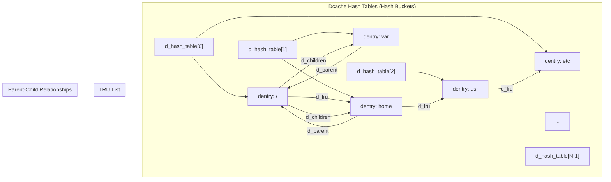
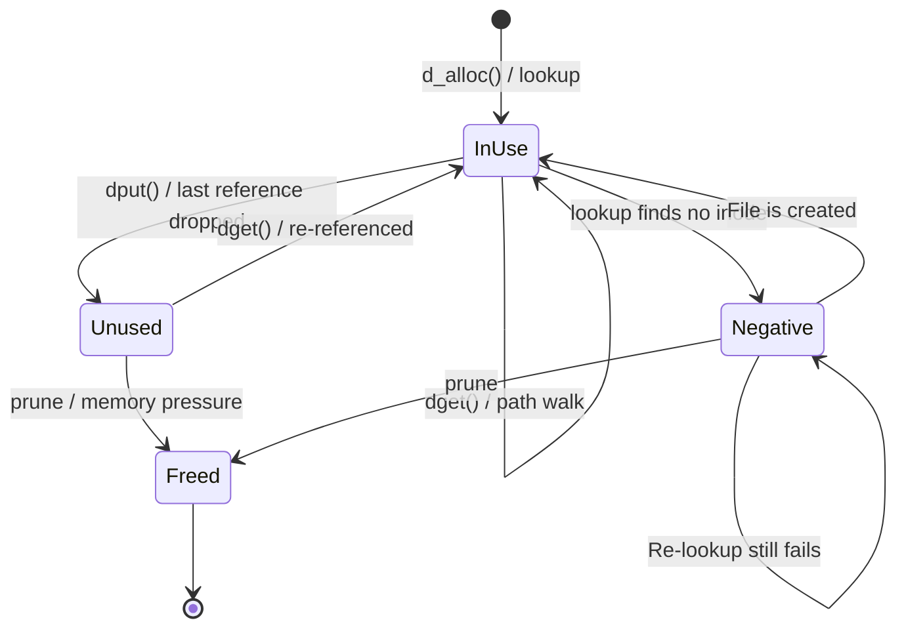
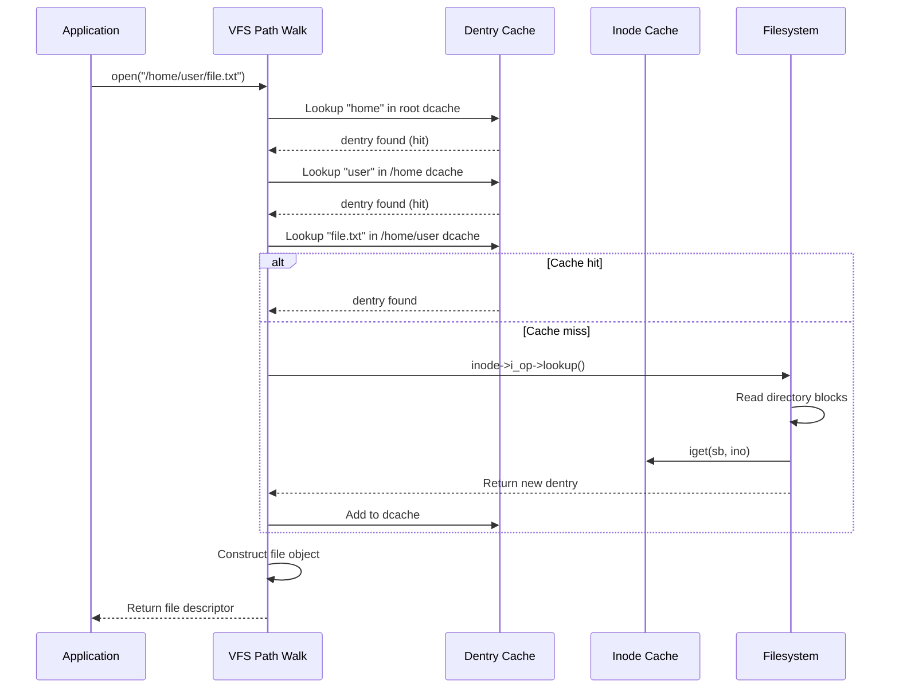
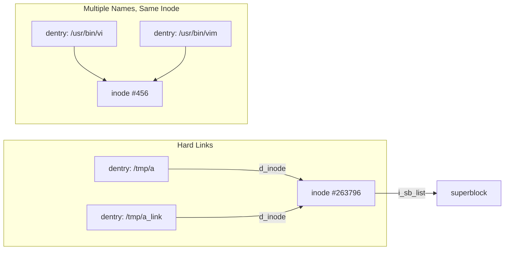

# Dentry (Directory Entry)

## Introduction

A dentry (directory entry) is the kernel's representation of the link between a filename and an
inode. Every component in a pathname — every directory and filename — has a dentry. The dentry cache
(often called "dcache") is one of the most performance-critical data structures in the Linux kernel,
as pathname lookup is one of the most frequently performed operations.

Unlike inodes, dentries are purely in-memory structures with no on-disk representation. They exist
to speed up pathname resolution. Without the dcache, every `open()` call would require reading
directory blocks from disk for every component in the path. With the dcache, most lookups resolve
entirely from memory.

## Dentry Structure

```c
struct dentry {
    unsigned int            d_flags;        /* dentry flags */
    seqcount_spinlock_t     d_seq;          /* per-dentry sequence lock */
    struct hlist_bl_node    d_hash;         /* hash table linkage */
    struct dentry           *d_parent;      /* parent directory */
    struct qstr             d_name;         /* name of this dentry */
    struct inode            *d_inode;       /* associated inode */
    unsigned char           d_iname[DNAME_INLINE_LEN]; /* short name storage */

    struct lockref          d_lockref;      /* lock + reference count */
    const struct dentry_operations *d_op;   /* dentry operations */
    struct super_block      *d_sb;          /* owning superblock */
    unsigned long           d_time;         /* used by d_revalidate */
    void                    *d_fsdata;      /* filesystem-specific data */

    union {
        struct list_head    d_lru;          /* LRU list linkage */
        wait_queue_head_t   *d_wait;        /* for in-lookup dentries */
    };
    struct hlist_node       d_sib;          /* sibling list (children) */
    struct hlist_head       d_children;     /* list of child dentries */

    union {
        struct hlist_node   d_alias;        /* inode alias linkage */
        struct hlist_bl_node d_in_lookup_hash; /* in-progress lookups */
    };
};
```

### The `qstr` Structure

Dentry names are stored in `struct qstr` (a "quick string"):

```c
struct qstr {
    union {
        struct {
            HASH_LEN_DECLARE;
        };
        u64 hash_len;
    };
    const unsigned char *name;
};
```

The `hash` field stores a precomputed hash of the name for fast hash table lookups. The `len` field
is the name length. Short names (≤32 bytes on 64-bit systems) are stored inline in `d_iname[]`
rather than requiring a separate allocation.

## Dentry Cache Architecture

The dcache is organized as a series of hash tables, each protected by its own spinlock:



### Hash Table Sizing

The dcache hash table is dynamically sized based on available memory:

```c
/* Initial size: 1 hash bucket per 4KB of memory, rounded up to power of 2 */
d_hash_shift = max(12, ilog2(nr_pages - 1) + 1);  /* minimum 4096 buckets */
d_hash_mask = (1 << d_hash_shift) - 1;
```

On a system with 16GB RAM, this yields approximately 4 million hash buckets.

### Hash Computation

The hash is computed from the parent dentry, the name, and the name length:

```c
/* Simplified dentry hash */
static inline unsigned long dentry_hash(struct dentry *parent,
                                         const struct qstr *name)
{
    unsigned long hash;

    /* Start with parent's hash */
    hash = parent->d_hash;

    /* Fold in the name */
    hash = full_name_hash(name->name, name->len);

    /* Fold hash to table size */
    return hash & d_hash_mask;
}
```

## Dentry States

A dentry can be in one of three states:

### 1. In-Use (`d_lockref > 0`)

The dentry is actively referenced. It has one or more users holding references. It is connected
to its inode (`d_inode != NULL`) and is linked into the parent's `d_children` list.

```
d_inode → valid inode
d_lockref > 0
On hash chain
In parent's d_children list
```

### 2. Unused (`d_lockref == 0`)

The dentry is in the cache but not actively referenced. It can be reclaimed under memory pressure
but will be reused if the same path is looked up again.

```
d_inode → valid inode (or NULL for negative dentries)
d_lockref == 0
On hash chain (still in dcache)
On LRU list (reclaimable)
In parent's d_children list
```

### 3. Negative (`d_inode == NULL`)

The dentry represents a name that was looked up but found not to exist. This is a valuable
optimization — it prevents repeated failed lookups from hitting the disk.

```
d_inode == NULL
d_lockref may be 0 or > 0
On hash chain
In parent's d_children list
```



## Dentry Operations

```c
struct dentry_operations {
    /* Revalidate: is this dentry still valid? (NFS, network FS) */
    int (*d_revalidate)(struct dentry *, unsigned int);

    /* Weak revalidation: less strict check */
    int (*d_weak_revalidate)(struct dentry *, unsigned int);

    /* Hash: compute hash for this name */
    int (*d_hash)(const struct dentry *, struct qstr *);

    /* Compare: compare two names */
    int (*d_compare)(const struct dentry *,
                     unsigned int len, const char *str,
                     const struct qstr *name);

    /* Delete: called when dentry is about to be freed */
    int (*d_delete)(const struct dentry *);

    /* Init: called when dentry is allocated */
    int (*d_init)(struct dentry *);

    /* Release: called when dentry is freed */
    void (*d_release)(struct dentry *);

    /* Prune: called when dentry is pruned from cache */
    void (*d_prune)(struct dentry *);

    /* IPut: called when inode is being freed */
    void (*d_iput)(struct dentry *, struct inode *);

    /* DNAME: generate name for disconnected dentry */
    char *(*d_dname)(struct dentry *, char *, int);

    /* Manage: manage automount/transit */
    int (*d_manage)(const struct path *, bool);

    /* Real: get the "real" dentry (for overlayfs) */
    struct dentry *(*d_real)(struct dentry *, enum d_real_type type);
};
```

### Case-Insensitive Filesystems

Filesystems like VFAT and case-insensitive ext4 override `d_compare` and `d_hash`:

```c
/* ext4 case-insensitive comparison */
static int ext4_d_ci_compare(const struct dentry *dentry,
                              unsigned int len, const char *str,
                              const struct qstr *name)
{
    struct super_block *sb = dentry->d_sb;
    const struct ext4_sb_info *sbi = EXT4_SB(sb);

    if (!ext4_has_strict_mode(sbi))
        return strncasecmp(name->name, str, len);

    /* Use Unicode-aware comparison via the folding API */
    return utf8_strncasecmp(sbi->s_encoding, name, str, len);
}
```

## Path Lookup Walkthrough

Let's trace the lookup of `/home/user/file.txt`:



### RCU Path Walk

Modern path lookup uses RCU (Read-Copy-Update) to avoid taking locks in the common case:

```c
/* RCU walk: lock-free path resolution */
static int link_path_walk(const char *name, struct nameidata *nd)
{
    /* RCU read lock is held by caller */
    while (*name == '/')
        name++;
    if (!*name) return 0;

    for (;;) {
        struct dentry *parent = nd->path.dentry;

        /* RCU-safe dentry lookup */
        if (nd->flags & LOOKUP_RCU) {
            /* Optimistic walk — no locks */
            dentry = __d_lookup_rcu(parent, &nd->last, &nd->next_seq);
            if (!dentry) {
                /* RCU walk failed — fall back to ref-walk */
                nd->flags &= ~LOOKUP_RCU;
                goto retry_lookup;
            }
        } else {
            /* Traditional ref-walk with dget/dput */
            dentry = d_lookup(parent, &nd->last);
            if (!dentry) {
                dentry = d_alloc(parent, &nd->last);
                dentry = inode->i_op->lookup(inode, dentry, nd->flags);
            }
        }
        /* Continue to next component */
    }
}
```

### Benefits of RCU Walk

- **No lock contention**: Multiple threads can resolve paths simultaneously.
- **No reference counting**: No need to `dget()`/`dput()` each dentry during walk.
- **Sequence validation**: Uses `read_seqbegin()`/`read_seqretry()` to detect concurrent modifications.
- **Fallback**: If RCU walk fails (concurrent rename/delete), falls back to traditional ref-walk.

## Negative Dentries

When a lookup fails (file not found), the kernel creates a negative dentry to cache the failure:

```c
/* Creating a negative dentry after failed lookup */
struct dentry *lookup_slow(const struct qstr *name,
                           struct dentry *dir, unsigned int flags)
{
    struct inode *inode = dir->d_inode;
    struct dentry *dentry;

    /* Serialize lookups in this directory */
    inode_lock_shared(inode);

    dentry = d_lookup(dir, name);
    if (!dentry) {
        dentry = d_alloc(dir, name);
        /* Call filesystem lookup */
        dentry = inode->i_op->lookup(inode, dentry, flags);
        if (IS_ERR(dentry)) {
            inode_unlock_shared(inode);
            return dentry;
        }
        /* If filesystem didn't set d_inode, this is a negative dentry */
    }

    inode_unlock_shared(inode);
    return dentry;
}
```

### Negative Dentry Lifetime

Negative dentries are valuable but must be invalidated when files are created:

```c
/* When a new file is created, any negative dentry must be pruned */
static int ext4_create(struct mnt_idmap *idmap, struct inode *dir,
                       struct dentry *dentry, umode_t mode, bool excl)
{
    /* The negative dentry for 'dentry' will be converted to a positive one */
    /* by d_instantiate() after the inode is created */
    handle = ext4_journal_start(dir, EXT4_DATA_TRANS_BLOCKS(dir->i_sb));

    inode = ext4_new_inode(handle, dir, mode, &dentry->d_name);
    /* ... */

    ext4_mark_inode_dirty(handle, inode);
    d_instantiate(dentry, inode);  /* This "fills in" the negative dentry */

    ext4_journal_stop(handle);
    return 0;
}
```

### Negative Dentry Abuse

Systems that probe many nonexistent paths (e.g., library search paths) accumulate negative dentries:

```bash
# Observe negative dentry count (requires kernel debug)
$ sudo cat /proc/sys/fs/dentry-state
123456  5000    0       45000   0       0
#       ^^^^    ^       ^^^^^
#       unused  age_limit  negative_count (not directly shown here)

# On kernels with CONFIG_DCACHE_DIAG
$ sudo debugfs -R 'stats' /dev/sda1 | grep -i dentry
```

## Dentry Pruning

### LRU-Based Eviction

Unused dentries are maintained on an LRU (Least Recently Used) list. Under memory pressure, the
shrinker reclaims them:

```c
/* Dentry shrinker callback */
static unsigned long shrink_dcache_sb(struct super_block *sb,
                                      struct shrink_control *sc)
{
    LIST_HEAD(dispose);

    /* Move unused dentries from LRU to dispose list */
    spin_lock(&sb->s_dcache_lru_lock);
    while (!list_empty(&sb->s_dentry_lru)) {
        dentry = list_first_entry(&sb->s_dentry_lru,
                                  struct dentry, d_lru);
        if (dentry->d_lockref.count)
            break;  /* No more unused entries */
        list_move(&dentry->d_lru, &dispose);
        dentry->d_lockref.count = -1;  /* Mark as being freed */
    }
    spin_unlock(&sb->s_dcache_lru_lock);

    /* Actually free the dentries */
    while (!list_empty(&dispose)) {
        dentry = list_first_entry(&dispose, struct dentry, d_lru);
        list_del_init(&dentry->d_lru);
        dentry_free(dentry);
    }

    return freed;
}
```

### Selective Pruning

The kernel provides mechanisms for selective dcache pruning:

```bash
# Drop all dentries and inodes (nuclear option)
$ echo 2 > /proc/sys/vm/drop_caches

# Drop slab objects including dentries
$ echo 3 > /proc/sys/vm/drop_caches

# Per-superblock shrink (not exposed to userspace directly)
```

## Dentry Lifetime and Reference Counting

### Reference Counting Pattern

```c
struct dentry *dentry;

/* Take a reference */
dentry = dget(dentry);      /* Increments d_lockref */

/* Use the dentry */
/* ... */

/* Release the reference */
dput(dentry);               /* Decrements d_lockref; frees if last ref */
```

### The `dput()` Path

When `dput()` drops the last reference:

```c
void dput(struct dentry *dentry)
{
    if (!dentry)
        return;

repeat:
    if (dentry->d_lockref.count > 1) {
        /* Fast path: just decrement */
        dentry->d_lockref.count--;
        return;
    }

    /* Last reference — move to LRU or free */
    if (dentry->d_flags & DCACHE_OP_DELETE) {
        /* Filesystem wants to be notified */
        if (dentry->d_op->d_delete(dentry))
            return;  /* Filesystem says keep it */
    }

    /* Move to LRU list (don't free immediately) */
    dentry->d_lockref.count--;
    dentry_lru_add(dentry);
}
```

## Dcache Memory Usage

The dcache can consume significant memory on systems with many files:

```bash
# Estimate dcache memory usage
$ sudo slabtop -s c | grep dentry
dentry            234567  240000    192   42    2 : tunables ...

# On this system: 234567 dentries × 192 bytes ≈ 43 MB
```

Each dentry structure is approximately:
- 192 bytes base on 64-bit systems
- Plus the name (stored inline if ≤ 32 bytes, or allocated separately)

### Reducing Dcache Pressure

```bash
# Monitor dentry usage over time
$ watch -n 1 'cat /proc/sys/fs/dentry-state'

# Adjust vfs_cache_pressure (higher = more aggressive reclaim)
$ cat /proc/sys/vm/vfs_cache_pressure
100  # Default

# Increase to be more aggressive about reclaiming dentries/inodes
$ echo 200 > /proc/sys/vm/vfs_cache_pressure

# Or decrease to keep them longer
$ echo 50 > /proc/sys/vm/vfs_cache_pressure
```

## Special Dentry Types

### Disconnected Dentries

When a file is created with `open(O_CREAT)` but not yet linked into the directory tree (e.g.,
anonymous files via `O_TMPFILE`), the dentry is "disconnected":

```c
/* Anonymous dentry — no parent */
dentry = d_alloc_anon(inode->i_sb);
```

### Automount Dentries

Dentries for automount points have the `DCACHE_NEED_AUTOMOUNT` flag:

```c
/* When path walk encounters this flag */
if (dentry->d_flags & DCACHE_NEED_AUTOMOUNT) {
    err = follow_automount(path, nd);
    /* Triggers autofs or similar mechanism */
}
```

### OverlayFS Dentries

OverlayFS uses the `d_real` operation to redirect dentries to the underlying filesystem:

```c
/* overlayfs dentry redirect */
static struct dentry *ovl_d_real(struct dentry *dentry,
                                  enum d_real_type type)
{
    /* Return the "real" dentry from the upper or lower layer */
    if (ovl_dentry_upper(dentry))
        return ovl_dentry_upper(dentry);
    return ovl_dentry_lower(dentry);
}
```

## Relationship with Inodes

A single inode can have multiple dentries (hard links), but each dentry points to exactly one inode:



The dentry-inode relationship is maintained through the inode's `i_dentry` list (a list of all
dentries pointing to this inode):

```c
/* Linking a dentry to an inode */
void d_instantiate(struct dentry *dentry, struct inode *inode)
{
    spin_lock(&dentry->d_lock);
    if (inode) {
        hlist_add_head(&dentry->d_alias, &inode->i_dentry);
    }
    dentry->d_inode = inode;
    spin_unlock(&dentry->d_lock);
}
```

## Debugging the Dcache

### debugfs (ext4)

```bash
# Dump dcache statistics (requires CONFIG_DCACHE_DEBUG)
$ sudo cat /proc/slabinfo | grep dentry
dentry            234567 240000  192   42    1 : tunables ...

# Count dentries for a specific mount point
$ sudo find /home -maxdepth 3 | wc -l
```

### Dynamic Debug

```bash
# Enable dcache debugging
$ echo 'module namei +p' > /sys/kernel/debug/dynamic_debug/control
# Then check dmesg for dcache-related messages
```

### ftrace

```bash
# Trace dentry operations
$ echo 1 > /sys/kernel/tracing/events/filemap/enable
$ cat /sys/kernel/tracing/trace_pipe
```

## Performance Characteristics

| Operation | Time Complexity (avg) | Notes |
|-----------|----------------------|-------|
| d_lookup() | O(1) | Hash table lookup |
| d_alloc() | O(1) | Allocate new dentry |
| d_delete() | O(1) | Remove from hash |
| Path walk (cached) | O(depth) | One lookup per path component |
| Path walk (uncached) | O(depth × dir_size) | Filesystem reads needed |
| dput() (last ref) | O(1) | Move to LRU |

## Further Reading

- [Linux kernel: fs/dcache.c](https://elixir.bootlin.com/linux/latest/source/fs/dcache.c) — Dcache implementation
- [Linux kernel: include/linux/dcache.h](https://elixir.bootlin.com/linux/latest/source/include/linux/dcache.h) — Dentry structure definitions
- [LWN: RCU-walk for faster pathname lookup](https://lwn.net/Articles/360199/) — RCU path walk design
- [LWN: Scaling the dentry cache](https://lwn.net/Articles/312351/) — Dcache scaling improvements
- [Linux VFS documentation](https://www.kernel.org/doc/html/latest/filesystems/vfs.html) — Official VFS docs
- [Robert Love: Linux Kernel Development, Ch. 12](https://www.oreilly.com/library/view/linux-kernel-development/9780768696974/) — The Virtual Filesystem

## Related Topics

- [VFS](./vfs.md) — The virtual filesystem layer
- [Inode](./inode.md) — The inode structure that dentries reference
- [ext4](./ext4.md) — How ext4 implements lookup and dentry operations
- [procfs](./procfs.md) — Dynamic dentries for `/proc`
