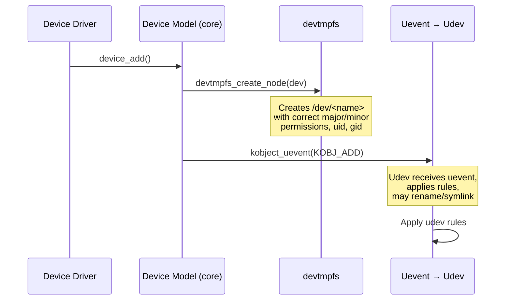
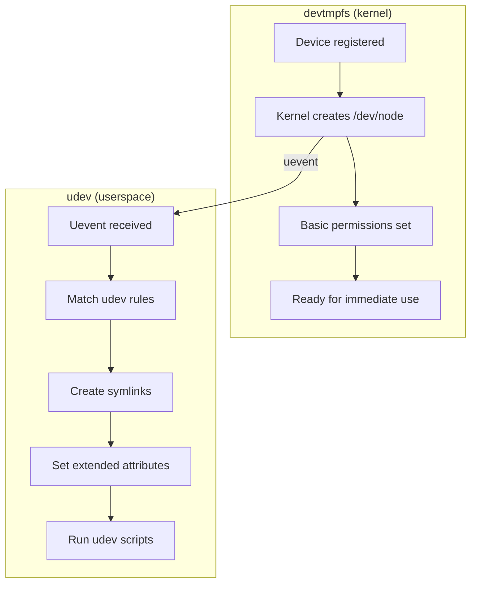
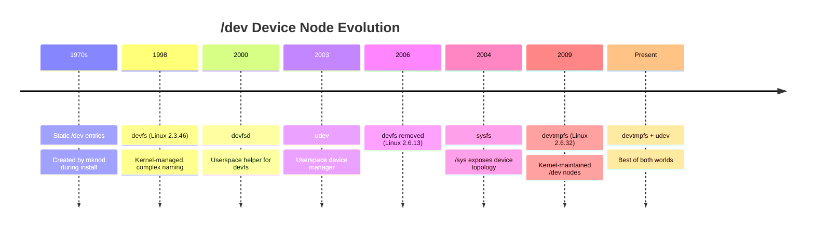

# devtmpfs

## Introduction

devtmpfs is a kernel-maintained virtual filesystem that provides automatic device node creation. It was introduced in Linux 2.6.32 (2009) by Kay Sievers and Greg Kroah-Hartman to solve the coldplug problem: the need for device nodes to exist before userspace (udev) starts. devtmpfs is mounted at `/dev` and the kernel itself creates and removes device nodes as drivers register and unregister devices.

Before devtmpfs, the system relied on `devfs` (deprecated, removed in 2.6.13) or static `/dev` entries created by `MAKEDEV`, or a userspace daemon (udev/mdev) that reacted to kernel uevents. devtmpfs moved this responsibility back into the kernel, ensuring `/dev` is populated from the earliest boot stage.

## How devtmpfs Works

### Kernel Driver Model Integration

devtmpfs hooks into the Linux device model (`drivers/base/`). When a device driver calls `device_register()` or similar functions, the kernel's driver core calls `devtmpfs_create_node()`:



### Device Node Creation

When a device is registered:

1. The kernel driver core determines the device name (from `devt` and subsystem)
2. `devtmpfs_create_node()` creates a device node in the devtmpfs mount
3. Permissions, uid, and gid are set from the device's `devtmpfs_devs` list
4. A uevent is sent to userspace (udev) for additional processing

```c
/* Simplified from drivers/base/devtmpfs.c */
int devtmpfs_create_node(struct device *dev) {
    const char *tmp = NULL;
    char *name;

    /* Determine device name */
    name = device_get_devnode(dev, &mode, &uid, &gid, &tmp);
    if (!name)
        return 0;

    /* Create the device node */
    err = vfs_mknod(&init_user_ns, d_inode(root),
                    dentry, mode, dev->devt);

    /* Set ownership */
    err = notify_change(idmap, dentry, &newattrs, NULL);
    return err;
}
```

### Device Node Removal

```c
int devtmpfs_delete_node(struct device *dev) {
    const char *tmp = NULL;
    char *name;

    name = device_get_devnode(dev, &mode, &uid, &gid, &tmp);
    if (!name)
        return 0;

    /* Remove the device node from devtmpfs */
    err = vfs_unlink(&init_user_ns, d_inode(root), dentry, NULL);
    return err;
}
```

## devtmpfs vs udev



| Aspect | devtmpfs | udev |
|--------|----------|------|
| **Runs in** | Kernel space | User space |
| **Timing** | Immediate (at device registration) | After uevent processing (slight delay) |
| **Capabilities** | Device nodes only | Symlinks, permissions, tags, scripts |
| **Persistence** | No (rebuilt at each boot) | udev rules in `/etc/udev/rules.d/` |
| **Complex naming** | Simple (subsystem + index) | Complex rules (MAC, serial, path) |
| **Coldplug** | ✅ Works before init | ❌ Needs to be running |
| **Sysfs attributes** | Cannot read | Can read and match |

### Why Both Exist

devtmpfs provides the **base layer** — device nodes exist as soon as the driver loads. udev provides the **policy layer** — complex naming, permissions, symlinks, and trigger scripts.

```bash
# devtmpfs creates the basic node:
/dev/sda         # Created by kernel immediately

# udev creates symlinks and sets permissions:
/dev/disk/by-uuid/abc123...  → /dev/sda1
/dev/disk/by-label/DATA      → /dev/sda2
/dev/disk/by-id/ata-Samsung_SSD_870... → /dev/sda
```

### udev Rules Example

```bash
# /etc/udev/rules.d/99-custom.rules
# These rules supplement what devtmpfs already provides

# Create a persistent symlink for a specific USB device
SUBSYSTEM=="tty", ATTRS{idVendor}=="1234", ATTRS{idProduct}=="5678", \
    SYMLINK+="mydevice"

# Set permissions for a specific device
SUBSYSTEM=="usb", ATTRS{serial}=="ABC123", MODE="0666"

# Run a script when a specific device appears
SUBSYSTEM=="block", ACTION=="add", KERNEL=="sd*", \
    RUN+="/usr/local/bin/on-disk-added.sh"
```

## Mount and Configuration

### Mount Point

```bash
# devtmpfs is mounted automatically during boot
$ mount | grep devtmpfs
devtmpfs on /dev type devtmpfs (rw,nosuid,noexec,size=4096k,nr_inodes=1048576,mode=755)

# Typical mount options
mount -t devtmpfs devtmpfs /dev \
    -o size=8192k,nr_inodes=2097152,mode=755
```

### Mount Options

| Option | Description | Default |
|--------|-------------|---------|
| `size=<bytes>` | Maximum filesystem size | 4096k |
| `nr_inodes=<count>` | Maximum number of inodes | Half of available RAM in pages |
| `mode=<octal>` | Default directory permissions | 755 |

### Boot-Time Mount

devtmpfs is mounted very early in the boot process, before udev starts:

```bash
# In initramfs / init
mount -t devtmpfs devtmpfs /dev

# In systemd, this is done by the kernel itself
# CONFIG_DEVTMPFS_MOUNT=y in kernel config

# Check if CONFIG_DEVTMPFS_MOUNT is enabled
$ zcat /proc/config.gz | grep DEVTMPFS
CONFIG_DEVTMPFS=y
CONFIG_DEVTMPFS_MOUNT=y
```

### Kernel Configuration

```bash
# Required kernel config options
CONFIG_DEVTMPFS=y          # Enable devtmpfs
CONFIG_DEVTMPFS_MOUNT=y    # Auto-mount at /dev during boot

# Without CONFIG_DEVTMPFS_MOUNT, init must mount it manually
```

## Practical Usage

### Examining Device Nodes

```bash
# List device nodes
$ ls -la /dev/sda*
brw-rw---- 1 root disk 8, 0 Jul 21 10:00 /dev/sda
brw-rw---- 1 root disk 8, 1 Jul 21 10:00 /dev/sda1
brw-rw---- 1 root disk 8, 2 Jul 21 10:00 /dev/sda2

# Character devices
$ ls -la /dev/tty*
crw-rw-rw- 1 root tty 5, 0 Jul 21 10:00 /dev/tty
crw--w---- 1 root tty 4, 0 Jul 21 10:00 /dev/tty0
crw------- 1 root root 4, 1 Jul 21 10:00 /dev/tty1

# View device major/minor numbers
$ cat /proc/devices
Character devices:
  1 mem
  4 tty
  5 /dev/tty
 10 misc
 13 input
 29 fb

Block devices:
  8 sd
  9 md
 11 sr
253 device-mapper
254 mdp
259 blkext
```

### devtmpfs in Containers

```bash
# Containers typically mount their own devtmpfs or use a minimal /dev
$ docker run --privileged alpine mount | grep devtmpfs
devtmpfs on /dev type devtmpfs (rw,nosuid,size=65536k,nr_inodes=16384,mode=755)

# Docker creates a minimal /dev for containers
$ docker run alpine ls /dev
console  fd       mqueue   ptmx     random   stderr   stdout   urandom
core     full     null     pts      shm      stdin    tty      zero
```

### Manual Device Node Creation

```bash
# devtmpfs handles this automatically, but for understanding:
$ mknod /dev/mydevice c 240 0
$ chmod 666 /dev/mydevice

# Remove when done
$ rm /dev/mydevice
```

## Implementation Details

### Key Source Files

- **`drivers/base/devtmpfs.c`** — Core devtmpfs implementation (~400 lines)
- **`drivers/base/core.c`** — Device model core (calls devtmpfs)
- **`drivers/base/devtmpfs.c`** — `devtmpfs_create_node()`, `devtmpfs_delete_node()`
- **`include/linux/devtmpfs.h`** — Header declarations

### Initialization

```c
/* From drivers/base/devtmpfs.c */
static int devtmpfsd(void *p) {
    /* This runs as a kernel thread during boot */
    char options[] = "mode=0755";

    /* Mount devtmpfs on /dev */
    err = kern_mount_data(devtmpfs_fs_type, options);

    /* Signal init that devtmpfs is ready */
    complete(&setup_done);

    /* Process requests from device drivers */
    while (!kthread_should_stop()) {
        /* Wait for device add/remove requests */
        wait_for_completion(&request);
        /* Process each request */
    }
    return 0;
}

static int __init devtmpfs_init(void) {
    /* Start the devtmpfs daemon */
    thread = kthread_run(devtmpfsd, NULL, "devtmpfsd");
    return 0;
}
subsys_initcall(devtmpfs_init);
```

### Request Processing

When a device is added or removed, the driver core posts a request to the devtmpfs daemon:

```c
struct req {
    struct list_head list;
    struct completion *done;
    const char *name;
    umode_t mode;    /* 0 means delete */
    struct device *dev;
};
```

The daemon (kernel thread) processes these requests, calling VFS operations to create or delete nodes.

## Historical Context



## References

- [devtmpfs kernel documentation](https://www.kernel.org/doc/html/latest/driver-api/driver-model/devres.html)
- [devtmpfs.c source](https://github.com/torvalds/linux/blob/master/drivers/base/devtmpfs.c)
- [LWN: devtmpfs](https://lwn.net/Articles/330985/)

## Further Reading

- [The Linux Kernel Documentation](https://docs.kernel.org/)
- [GNU Project Documentation](https://www.gnu.org/doc/doc.html)
- [GNU Manuals](https://www.gnu.org/manual/manual.html)
- [Free Software Directory](https://directory.fsf.org/wiki/Main_Page)
- [Planet GNU](https://planet.gnu.org/)
- [Free Software Books](https://www.gnu.org/doc/other-free-books.html)

- https://man7.org/linux/man-pages/man5/udev.7.html
- https://man7.org/linux/man-pages/man7/udevadm.8.html
- https://lwn.net/Articles/330985/ — "Devtmphs: a new approach to /dev"
- https://lwn.net/Articles/250662/ — "The final word on devfs"
- https://www.kernel.org/doc/html/latest/driver-api/early-userspace/early_userspace_support.html

## Related Topics

- [tmpfs](./tmpfs.md) — devtmpfs is based on tmpfs infrastructure
- [mounting](./mounting.md) — How devtmpfs is mounted during boot
- [superblock](./superblock.md) — devtmpfs superblock management
- [inode](./inode.md) — Device node inodes in devtmpfs
