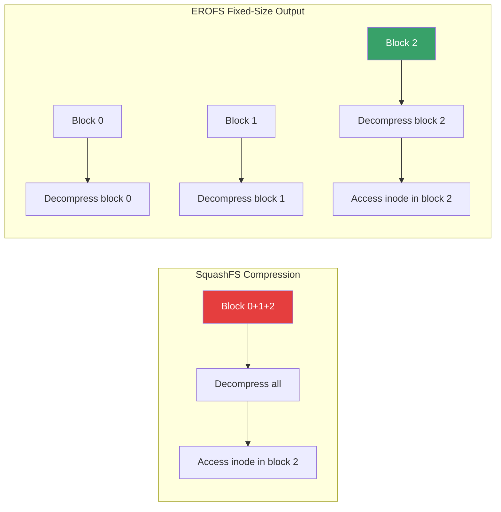
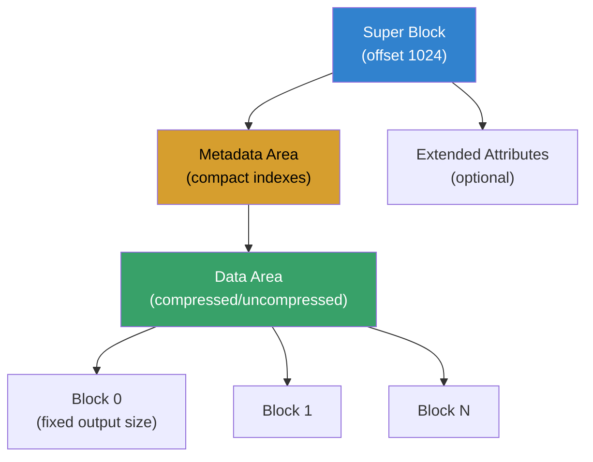
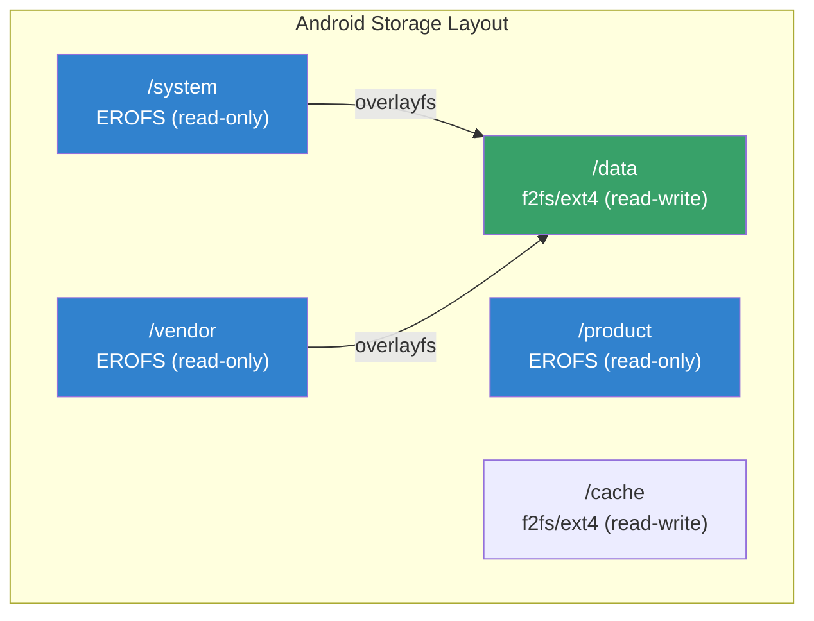
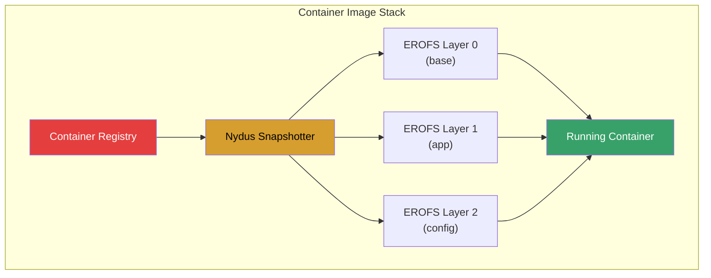
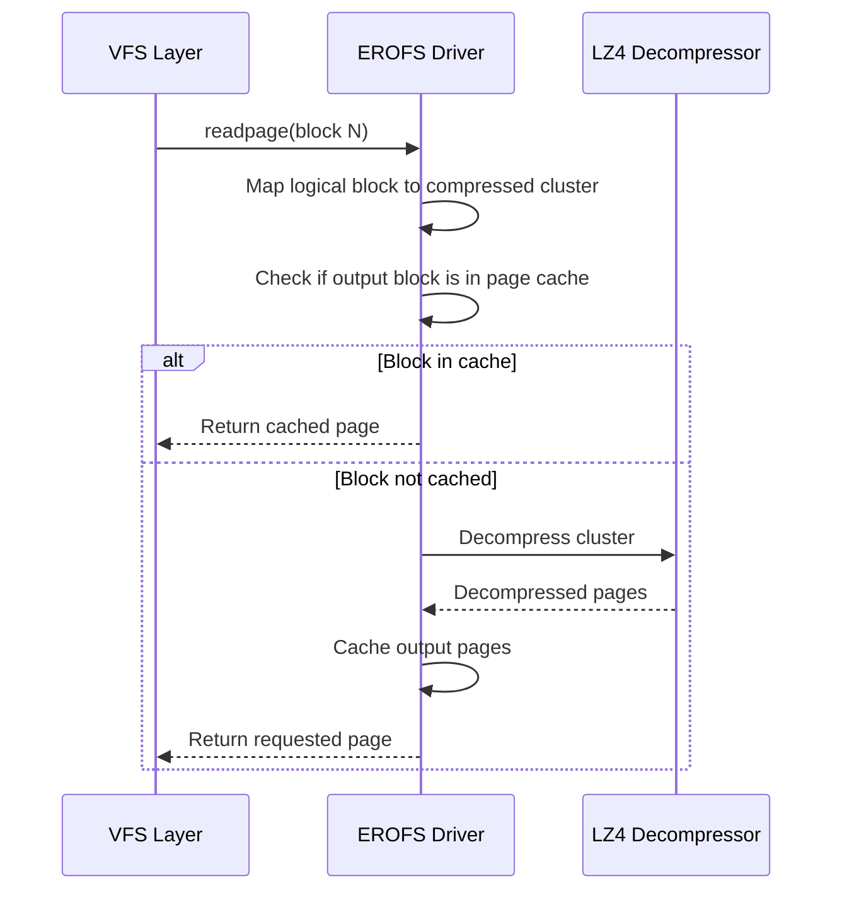

# EROFS: Enhanced Read-Only File System

## Introduction

EROFS (Enhanced Read-Only File System) is a lightweight, high-performance read-only filesystem designed for scenarios where data is written once and read many times. Originally developed by Huawei engineers and merged into Linux kernel 4.19 (2018), EROFS has become a critical filesystem in Android (for system partitions) and increasingly popular for container image storage.

Key characteristics:
- **Read-only** — designed for immutable data
- **High compression** — LZ4 and LZMA support with fixed-size output compression
- **Fast random access** — no decompression of unrelated blocks
- **Small footprint** — minimal kernel code (~3000 lines)
- **No journaling overhead** — simplified design

## Why EROFS Matters

Traditional read-only filesystems like SquashFS compress data but require decompressing entire compression units to access a single inode. EROFS introduces **fixed-size output compression** (also called "compact compression") where each compressed block produces a fixed-size output, enabling:

1. **Predictable random access** — access any block without decompressing neighbors
2. **Better I/O alignment** — blocks align to page/cache boundaries
3. **Lower memory pressure** — only accessed blocks are decompressed



## Architecture

### On-Disk Layout



### Key Data Structures

| Component | Description |
|-----------|-------------|
| **Superblock** | Filesystem metadata at offset 1024, block size, feature flags |
| **Compact Indexes** | Minimal inode structures (32 bytes vs. traditional 64+ bytes) |
| **Compression Indexes** | Map logical blocks to compressed data locations |
| **Extended Attributes** | Optional metadata (SELinux labels, capabilities) |

### Compression Modes

EROFS supports two compression strategies:

1. **LZ4 Compression** — fast decompression, moderate compression ratio
2. **LZMA Compression** — higher compression ratio, slower decompression
3. **Fixed-Size Output (compact)** — each compressed block maps to exactly one output block
4. **Legacy Compression** — traditional variable-size compression (less common)

## Creating EROFS Images

### Using mkfs.erofs

```bash
# Install erofs-utils
sudo apt install erofs-utils    # Debian/Ubuntu
sudo dnf install erofs-utils    # Fedora/RHEL
sudo pacman -S erofs-utils      # Arch Linux

# Create a basic EROFS image
mkfs.erofs -d 1 image.erofs /path/to/source/

# Create with LZ4 compression
mkfs.erofs -zlz4 -d 1 image.erofs /path/to/source/

# Create with LZMA compression (better ratio)
mkfs.erofs -zlz4hc -d 1 image.erofs /path/to/source/

# Create with specific block size (4KB)
mkfs.erofs -b 4096 -zlz4 image.erofs /path/to/source/

# Create with extended attributes preserved
mkfs.erofs --xattr-whiteout -zlz4 image.erofs /path/to/source/

# Create from a tar archive
mkfs.erofs -zlz4 image.erofs @archive.tar
```

### Key mkfs.erofs Options

| Option | Description |
|--------|-------------|
| `-z <algo>` | Compression algorithm: `lz4`, `lz4hc`, `lzma` |
| `-d <level>` | Debug/verbosity level |
| `-b <size>` | Block size in bytes |
| `-C <size>` | Compression cluster size |
| `--xattr-whiteout` | Support whiteout entries for overlayfs |
| `--all-root` | Set all file owners to root |
| `-E <fragments>` | Enable fragment deduplication |

## Mounting EROFS

### Basic Mount

```bash
# Mount an EROFS image
sudo mount -t erofs image.erofs /mnt/erofs

# Mount with specific options
sudo mount -t erofs -o ro,noinline_data image.erofs /mnt/erofs

# Mount via loop device (automatic)
sudo mount image.erofs /mnt/erofs

# Check filesystem
fsck.erofs --check image.erofs
```

### Mount Options

| Option | Description |
|--------|-------------|
| `ro` | Read-only (always, implicit) |
| `noinline_data` | Don't use inline data for small files |
| `max_readahead=<N>` | Maximum read-ahead size in bytes |

## EROFS in Android

### Android's Read-Only Partitions

Starting with Android 10, Google adopted EROFS for system partitions:



### Why Android Chose EROFS

| Factor | EROFS | ext4 | SquashFS |
|--------|-------|------|----------|
| Read-only optimized | ✅ | ❌ | ✅ |
| Random access with compression | ✅ | N/A | ❌ |
| SELinux xattr support | ✅ | ✅ | Limited |
| Kernel size (lines) | ~3000 | ~50000 | ~10000 |
| Boot time (decompression) | Fast | N/A | Moderate |
| RAM usage | Low | Moderate | High |

### Android Build Integration

```makefile
# In Android build system (BoardConfig.mk)
BOARD_SYSTEMIMAGE_FILE_SYSTEM_TYPE := erofs
BOARD_VENDORIMAGE_FILE_SYSTEM_TYPE := erofs
BOARD_PRODUCTIMAGE_FILE_SYSTEM_TYPE := erofs

# Compression options
BOARD_EROFS_COMPRESSOR := lz4hc
BOARD_EROFS_PCLUSTER_SIZE := 65536
```

## EROFS in Containers

### Container Image Layers

EROFS is increasingly used for container image storage, particularly in projects like:
- **Nydus** — Dragonfly's image acceleration framework
- **eStargz** — seekable tar.gz with EROFS backend
- **Kata Containers** — VM-based containers with EROFS rootfs



### Nydus with EROFS

```bash
# Nydus converts container images to EROFS format
nydusify convert --source docker://ubuntu:22.04 \
                  --target nydus-image:ubuntu-erofs

# Mount EROFS-based container image
nydusd --config nydusd-config.json \
       --bootstrap image.boot \
       --mountpoint /var/lib/containerd/io.containerd.snapshotter.v1.nydus
```

### Performance Comparison: Container Startup

| Metric | OverlayFS + tar.gz | EROFS + Nydus |
|--------|-------------------|---------------|
| Image pull time | 30s | 2s (lazy loading) |
| Container start | 45s | 5s |
| Random I/O latency | High | Low |
| Memory usage | Moderate | Low |

## Kernel Implementation

### Source Code Structure

```
fs/erofs/
├── super.c          # Superblock handling, mount
├── inode.c          # Inode operations
├── data.c           # Data block I/O
├── decompressor.c   # Decompression framework
├── zdata.c          # Compressed data handling
├── zmap.c           # Compressed block mapping
├── namei.c          # Directory operations
├── dir.c            # Directory reading
├── xattr.c          # Extended attributes
└── internal.h       # Internal structures
```

### Key Kernel Functions

```c
/* Superblock operations */
static const struct super_operations erofs_sops = {
    .alloc_inode    = erofs_alloc_inode,
    .destroy_inode  = erofs_destroy_inode,
    .statfs         = erofs_statfs,
};

/* Decompression entry point */
int erofs_decompress(struct erofs_map_blocks *map,
                     struct page **pagepool);

/* Fixed-size output decompression */
static int z_erofs_lz4_decompress(struct z_erofs_decompressqueue *io,
                                  unsigned int ra_folios);
```

### Decompression Flow



## Tuning and Optimization

### Compression Ratio vs. Speed

```bash
# Fast compression (LZ4) — good for development
mkfs.erofs -zlz4 image.erofs /source/

# Balanced (LZ4HC) — good for production
mkfs.erofs -zlz4hc image.erofs /source/

# Maximum compression (LZMA) — smallest images
mkfs.erofs -zlzma image.erofs /source/

# Check image statistics
dump.erofs --device image.erofs
```

### Cluster Size Tuning

```bash
# Smaller clusters = better random access, lower compression ratio
mkfs.erofs -C 4096 -zlz4 image.erofs /source/

# Larger clusters = better compression, higher latency
mkfs.erofs -C 131072 -zlz4 image.erofs /source/

# Default (64KB) is usually optimal
mkfs.erofs -C 65536 -zlz4 image.erofs /source/
```

### Monitoring EROFS Performance

```bash
# I/O statistics for EROFS mount
cat /sys/fs/erofs/<device>/stats

# Block device I/O stats
iostat -x 1

# Trace EROFS operations
sudo perf trace -e 'erofs:*' -- sleep 10

# Profile decompression
sudo perf record -g -p <pid> -- sleep 5
sudo perf report
```

## Troubleshooting

### Common Issues

| Symptom | Cause | Solution |
|---------|-------|----------|
| Mount fails with "unsupported feature" | Kernel too old | Upgrade kernel or rebuild image |
| High CPU usage | LZMA decompression | Switch to LZ4 |
| Corrupted files | Bad image build | Rebuild with `fsck.erofs` check |
| Missing xattrs | Build without xattr support | Add `--xattr-whiteout` to mkfs |
| Slow first read | Cache cold start | Use readahead tuning |

### Debugging

```bash
# Verify image integrity
fsck.erofs image.erofs

# Dump image metadata
dump.erofs --device image.erofs

# Check kernel EROFS support
zgrep CONFIG_EROFS_FS /proc/config.gz

# Verbose mount for debugging
sudo mount -t erofs -o ro,verbose image.erofs /mnt

# Check EROFS kernel messages
dmesg | grep -i erofs
```

### Kernel Configuration

```bash
# Required kernel config options
CONFIG_EROFS_FS=y              # EROFS support
CONFIG_EROFS_FS_XATTR=y        # Extended attributes
CONFIG_EROFS_FS_ZIP_LZ4=y      # LZ4 compression
CONFIG_EROFS_FS_ZIP_LZMA=y     # LZMA compression
CONFIG_EROFS_FS_PCPU_KTHREAD=y # Per-CPU decompression threads
```

## Comparison with Other Read-Only Filesystems

| Feature | EROFS | SquashFS | CramFS | RomFS |
|---------|-------|----------|--------|-------|
| Compression | LZ4, LZMA | LZ4, LZMA, ZSTD, LZO | zlib | None |
| Random access | ✅ (fixed-size) | ❌ (full block) | ❌ | ✅ |
| Max size | 16 EB | 2^64 bytes | 256 MB | N/A |
| Extended attributes | ✅ | ✅ | ❌ | ❌ |
| Kernel lines | ~3000 | ~10000 | ~5000 | ~2000 |
| Android support | ✅ (default) | Limited | ❌ | ❌ |
| Container support | ✅ (Nydus) | ❌ | ❌ | ❌ |

## Code Examples

### Reading EROFS Image Metadata

```bash
#!/bin/bash
# erofs-info.sh — Display EROFS image information

IMAGE="$1"
if [ ! -f "$IMAGE" ]; then
    echo "Usage: $0 <erofs-image>"
    exit 1
fi

echo "=== EROFS Image Info ==="
echo "File: $IMAGE"
echo "Size: $(du -h "$IMAGE" | cut -f1)"

# Use dump.erofs if available
if command -v dump.erofs &>/dev/null; then
    echo ""
    echo "=== Superblock ==="
    dump.erofs --device "$IMAGE" 2>/dev/null | head -20

    echo ""
    echo "=== File Listing ==="
    dump.erofs --ls --device "$IMAGE" 2>/dev/null | head -30
else
    echo "Install erofs-utils for detailed info: apt install erofs-utils"
fi

# Check mountability
echo ""
echo "=== Kernel Support ==="
if grep -q erofs /proc/filesystems; then
    echo "EROFS: supported"
else
    echo "EROFS: not available in current kernel"
fi
```

## Further Reading

- [EROFS Documentation](https://www.kernel.org/doc/html/latest/filesystems/erofs.html)
- [EROFS GitHub](https://github.com/erofs/erofs-utils)
- [LWN: EROFS — A compression-friendly read-only filesystem](https://lwn.net/Articles/792530/)
- [Android EROFS Migration](https://source.android.com/docs/core/architecture/kernel/erofs)
- [Nydus — EROFS-based Container Image](https://github.com/dragonflyoss/nydus)
- [LWN: EROFS and container images](https://lwn.net/Articles/908820/)

## See Also

- [SquashFS](./squashfs.md) — alternative compressed read-only filesystem
- [OverlayFS](./overlayfs.md) — used with EROFS in Android and containers
- [F2FS](./f2fs.md) — flash-friendly filesystem for read-write partitions
- [VFS](./vfs.md) — virtual filesystem layer
- [Block Drivers](../drivers/block-drivers.md) — underlying block I/O
