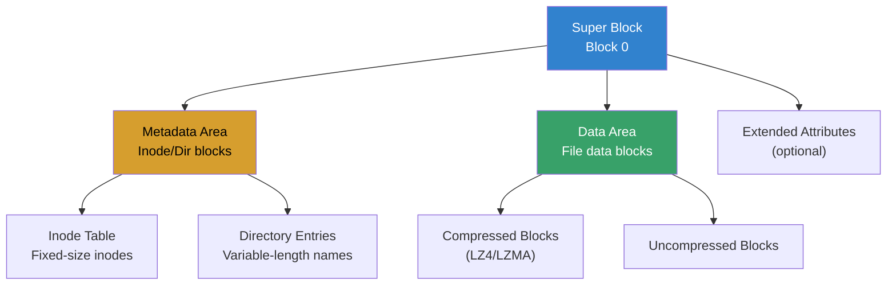
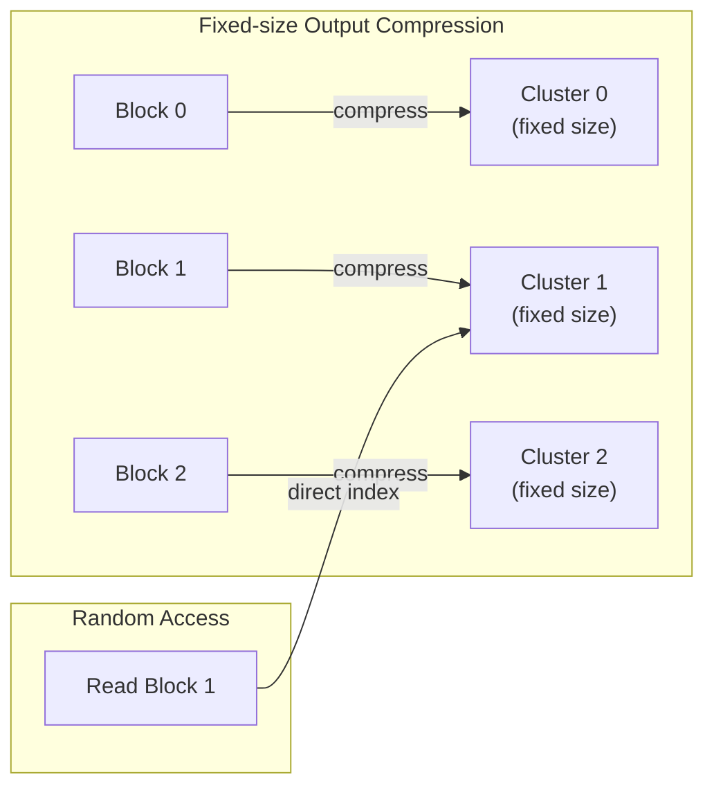
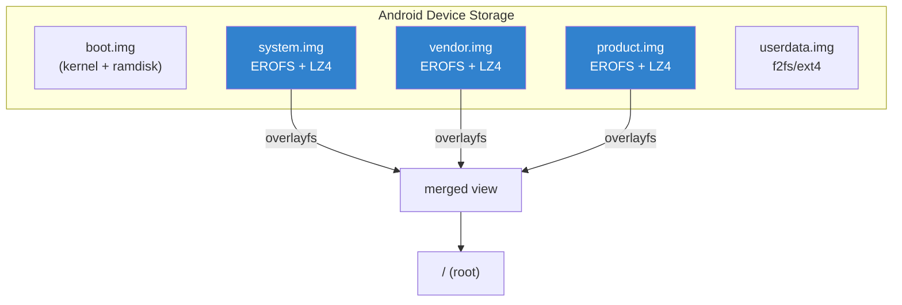
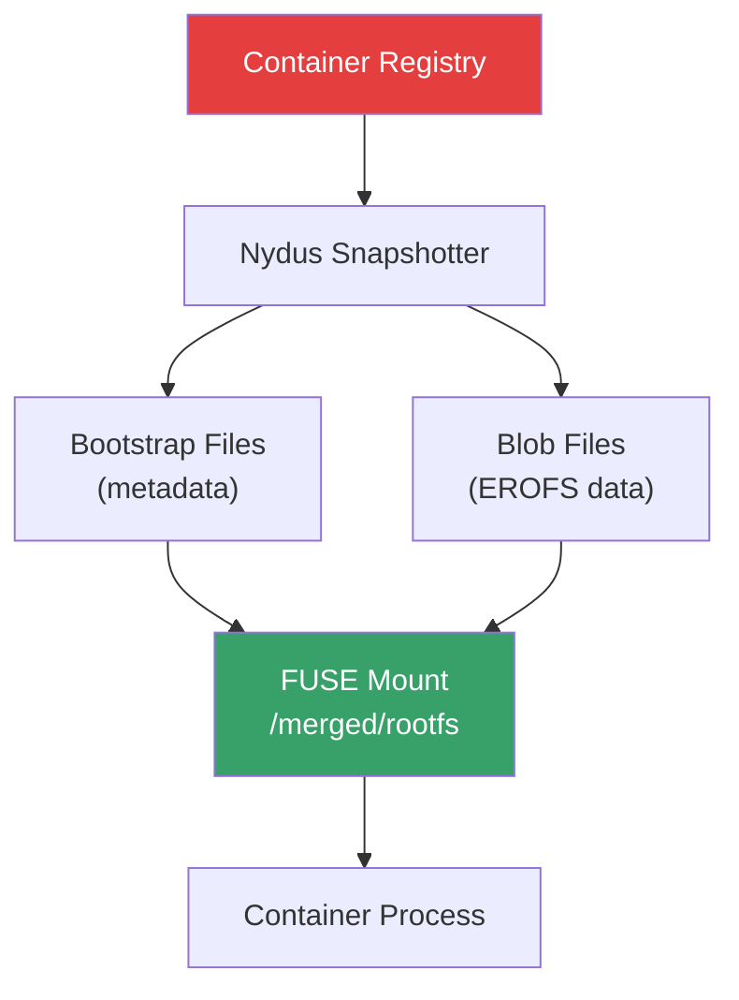
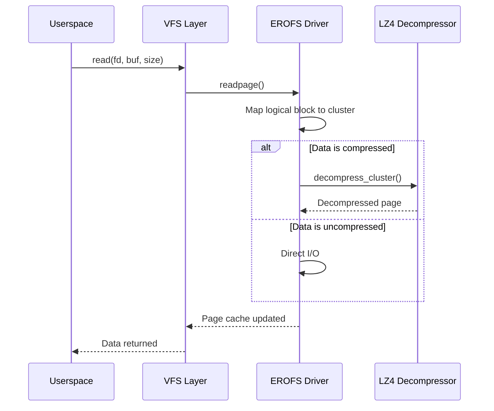

# EROFS: Enhanced Read-Only File System

## Introduction

EROFS (Enhanced Read-Only File System) is a lightweight, high-performance read-only filesystem designed for scenarios where data is written once and read many times. Originally developed by Huawei engineers and merged into the Linux kernel in version 4.19 (2018), EROFS has become a critical filesystem in Android and container ecosystems due to its fast random access, transparent compression, and minimal memory overhead.

Key properties:
- **Read-only** — designed for immutable data
- **Transparent compression** — LZ4 and LZMA support with fixed-size output
- **Fast random access** — no decompression needed for uncompressed data
- **Minimal overhead** — small kernel footprint and low memory usage
- **No journaling** — simplified design for read-only use cases

## Why EROFS Matters

Traditional read-only filesystems like SquashFS offer good compression but can suffer from slow random access because data is packed into compression blocks. EROFS addresses this with a **fixed-size output** compression mode that allows direct indexing into compressed data:

- **Android system partitions** — Google selected EROFS for Android 13+ system images
- **Container images** — smaller, faster-to-mount container rootfs
- **Embedded systems** — minimal RAM and storage requirements
- **Live CDs/USBs** — fast boot with compressed rootfs

## Architecture

### On-Disk Layout



### Compression Modes

EROFS supports two compression strategies:

1. **Fixed-size output (LZ4/LZMA)** — Each compressed cluster maps to a fixed output size, enabling O(1) random access. This is the default and recommended mode.

2. **Legacy compression** — Traditional variable-ratio compression (rarely used in modern deployments).



## Creating EROFS Images

### Using mkfs.erofs

```bash
# Install erofs-utils
# Debian/Ubuntu
sudo apt install erofs-utils

# Fedora
sudo dnf install erofs-utils

# Arch Linux
sudo pacman -S erofs-utils
```

### Basic Image Creation

```bash
# Create a plain (uncompressed) EROFS image
mkfs.erofs image.erofs /path/to/rootdir

# Create with LZ4 compression
mkfs.erofs -zlz4 image.erofs /path/to/rootdir

# Create with LZ4HC compression (better ratio, slower)
mkfs.erofs -zlz4hc image.erofs /path/to/rootdir

# Create with specific block size (default: 4096)
mkfs.erofs -b 4096 -zlz4 image.erofs /path/to/rootdir

# Create with custom cluster size for compression
mkfs.erofs -C 65536 -zlz4 image.erofs /path/to/rootdir

# Exclude specific patterns
mkfs.erofs -E '*.log,*.tmp' -zlz4 image.erofs /path/to/rootdir

# Generate reproducible image (for CI/CD)
mkfs.erofs --all-root -U $(uuidgen) -zlz4 image.erofs /path/to/rootdir
```

### Advanced Creation

```bash
# Create image with extended attributes preserved
mkfs.erofs -x 1 -zlz4 image.erofs /path/to/rootdir

# Create from tarball
mkfs.erofs -zlz4 image.erofs @/path/to/archive.tar

# Create from file list
mkfs.erofs -zlz4 --tar=f filelist.txt image.erofs

# Dry run (show what would be included)
mkfs.erofs -zlz4 --dry-run image.erofs /path/to/rootdir

# Verbose output for debugging
mkfs.erofs -zlz4 -d 1 image.erofs /path/to/rootdir
```

## Mounting and Using EROFS

### Basic Mount

```bash
# Mount an EROFS image via loop device
sudo mount -t erofs image.erofs /mnt/erofs

# Mount with specific loop device
sudo mount -t erofs -o loop=/dev/loop0 image.erofs /mnt/erofs

# Mount read-only (always read-only, but explicit)
sudo mount -t erofs -o ro image.erofs /mnt/erofs

# Unmount
sudo umount /mnt/erofs
```

### Inspecting EROFS Images

```bash
# Dump filesystem info
dump.erofs image.erofs

# List files in image
dump.erofs --ls image.erofs

# Extract specific file
dump.erofs --extract=/path/inside/fs image.erofs

# Show superblock details
dump.erofs --sb image.erofs

# Verify image integrity
fsck.erofs image.erofs
```

### Mount Options

| Option | Description |
|--------|-------------|
| `user_xattr` | Support extended attributes |
| `acl` | Support POSIX ACLs |
| `cache_strategy=readahead` | Enable read-ahead caching |
| `cache_strategy=readaround` | Enable read-around caching |
| `no_readahead` | Disable read-ahead |

## EROFS in Android

### System-as-Root with EROFS

Starting with Android 13, Google mandates EROFS for system, vendor, and product partitions:



### Android Build Integration

```makefile
# In Android.mk or device config
BOARD_SYSTEMIMAGE_FILE_SYSTEM_TYPE := erofs
BOARD_VENDORIMAGE_FILE_SYSTEM_TYPE := erofs
BOARD_PRODUCTIMAGE_FILE_SYSTEM_TYPE := erofs

# EROFS compression options
BOARD_EROFS_COMPRESSOR := lz4hc
BOARD_EROFS_PCLUSTER_SIZE := 65536
```

### Why Android Chose EROFS

| Metric | ext4 | SquashFS | EROFS |
|--------|------|----------|-------|
| Random read latency | Fast | Slow | Fast |
| Compression ratio | None | High | High |
| Memory usage | High | Medium | Low |
| Kernel complexity | High | Medium | Low |
| SELinux support | Full | Limited | Full |
| Update-friendly | Yes | No | Yes (with OTA) |

## EROFS in Containers

### Container Image Layers

EROFS can be used as a container snapshotter backend, providing:

```bash
# Convert container image to EROFS (using nydus)
nydusify convert \
    --source ubuntu:22.04 \
    --target my-registry/ubuntu:22.04-erofs \
    --fs-version 6

# Mount EROFS container image
nydusd \
    --config /etc/nydus/nydusd-config.json \
    --bootstrap /path/to/image.boot \
    --mountpoint /var/lib/containerd/io.containerd.snapshotter.v1.nydus/
```

### Nydus Snapshotter Architecture



### Performance Comparison

```bash
# Benchmark: container startup time
# Standard overlay (image pull + extract)
time nerdctl run --rm ubuntu:22.04 echo "hello"
# Typical: 5-15 seconds (cold start)

# EROFS/Nydus (lazy pull)
time nerdctl run --snapshotter nydus --rm ubuntu:22.04 echo "hello"
# Typical: 1-3 seconds (lazy loading)
```

## Compression Deep Dive

### LZ4 Compression

```bash
# Default LZ4 compression
mkfs.erofs -zlz4 image.erofs /rootdir

# LZ4 High Compression (lz4hc)
mkfs.erofs -zlz4hc image.erofs /rootdir

# Compression cluster size tuning
# Smaller clusters = better compression, more metadata
# Larger clusters = less metadata, slightly worse ratio
mkfs.erofs -C 32768 -zlz4 image.erofs /rootdir   # 32K clusters
mkfs.erofs -C 131072 -zlz4 image.erofs /rootdir   # 128K clusters
```

### Compression Ratio Comparison

```bash
# Generate test data
mkdir -p /tmp/testroot/{bin,lib,etc,usr}
cp -a /usr/bin/* /tmp/testroot/bin/
cp -a /usr/lib/* /tmp/testroot/lib/
cp -a /etc/* /tmp/testroot/etc/

# Create images with different settings
mkfs.erofs -zlz4 image-lz4.erofs /tmp/testroot
mkfs.erofs -zlz4hc image-lz4hc.erofs /tmp/testroot
mkfs.erofs -zlzma image-lzma.erofs /tmp/testroot

# Compare sizes
ls -lh image-*.erofs
```

### Compression Ratio Example

| Algorithm | Typical Ratio | Speed | Use Case |
|-----------|--------------|-------|----------|
| None | 1.0x | Fastest | RAM-rich, speed-critical |
| LZ4 | 1.5-2.5x | Fast | Default, balanced |
| LZ4HC | 1.8-3.0x | Medium | Better compression |
| LZMA | 2.5-4.0x | Slow | Maximum compression |

## Internal Kernel Implementation

### Kernel Configuration

```bash
# Enable EROFS in kernel config
CONFIG_EROFS_FS=m              # or =y for built-in
CONFIG_EROFS_FS_XATTR=y        # Extended attributes
CONFIG_EROFS_FS_POSIX_ACL=y    # POSIX ACLs
CONFIG_EROFS_FS_ZIP=y          # Compression support
CONFIG_EROFS_FS_ZIP_LZ4=y      # LZ4 decompression
CONFIG_EROFS_FS_ZIP_LZMA=y     # LZMA decompression
CONFIG_EROFS_FS_ONDEMAND=y     # On-demand loading (FUSE/Nydus)
```

### Key Kernel Functions

```c
/* Superblock operations */
static const struct super_operations erofs_sops = {
    .statfs = erofs_statfs,
    .alloc_inode = erofs_alloc_inode,
    .free_inode = erofs_free_inode,
};

/* Inode operations */
static const struct inode_operations erofs_dir_iops = {
    .lookup = erofs_lookup,
    .iterate_shared = erofs_readdir,
};

/* File operations */
static const struct file_operations erofs_file_fops = {
    .llseek = generic_file_llseek,
    .read_iter = generic_file_read_iter,
    .mmap = generic_file_readonly_mmap,
};
```

### Decompression Flow



## Comparison with Other Filesystems

### EROFS vs SquashFS

| Feature | EROFS | SquashFS |
|---------|-------|----------|
| Random access | O(1) with fixed-size | O(n) scan blocks |
| Compression | LZ4, LZ4HC, LZMA | LZ4, ZSTD, LZO, LZMA, XZ |
| Max file size | 16 EB | 2^64 bytes |
| Extended attributes | Full | Limited |
| Fragment packing | Yes | Yes |
| Kernel complexity | ~5K lines | ~15K lines |
| Android support | Primary (13+) | Legacy |
| Container support | Nydus, Stargz | Limited |

### EROFS vs ext4 (for read-only)

| Feature | EROFS | ext4 |
|---------|-------|------|
| Compression | Built-in | None (needs e2compr patches) |
| Space usage | Compressed | Full size |
| Mount time | Fast | Journal recovery |
| Write support | No | Full |
| Use case | Immutable data | General purpose |

## Practical Examples

### Example 1: Read-Only Root Filesystem for Embedded

```bash
#!/bin/bash
# Create minimal embedded rootfs with EROFS

ROOTDIR="/tmp/embedded-rootfs"
IMAGE="rootfs.erofs"

# Build minimal root
mkdir -p "$ROOTDIR"/{bin,sbin,etc,proc,sys,dev,tmp,usr/bin,usr/lib}

# Copy busybox
cp /usr/bin/busybox "$ROOTDIR/bin/"
cd "$ROOTDIR/bin"
for cmd in sh ls cat cp mv rm mkdir mount umount; do
    ln -s busybox "$cmd"
done

# Create init script
cat > "$ROOTDIR/init" << 'EOF'
#!/bin/sh
mount -t proc proc /proc
mount -t sysfs sysfs /sys
mount -t devtmpfs devtmpfs /dev
exec /bin/sh
EOF
chmod +x "$ROOTDIR/init"

# Create EROFS image
mkfs.erofs -zlz4 "$IMAGE" "$ROOTDIR"

# Test with QEMU
qemu-system-x86_64 \
    -kernel /boot/vmlinuz-$(uname -r) \
    -initrd "$IMAGE" \
    -append "root=/dev/ram0 rdinit=/init" \
    -m 256M
```

### Example 2: Live USB with EROFS Root

```bash
#!/bin/bash
# Build a live USB with compressed EROFS root

LIVE_DIR="/tmp/live-build"
SQUASH_IMG="live/filesystem.erofs"

# Prepare the live filesystem
mkdir -p "$LIVE_DIR"/{live,boot,EFI/BOOT}

# Create EROFS image from installed system
sudo mkfs.erofs -zlz4hc -C 131072 \
    "$LIVE_DIR/$SQUASH_IMG" \
    /path/to/installed-system/

# Create GRUB config
cat > "$LIVE_DIR/boot/grub/grub.cfg" << 'EOF'
set timeout=5
menuentry "Live Linux (EROFS)" {
    linux /boot/vmlinuz boot=live live-media-path=/live/
    initrd /boot/initrd.img
}
EOF

# Write to USB device
sudo dd if=/dev/zero of=/dev/sdX bs=1M count=1
sudo parted /dev/sdX mklabel gpt
sudo parted /dev/sdX mkpart primary fat32 1MiB 100%
sudo mkfs.fat -F32 /dev/sdX1
sudo mount /dev/sdX1 /mnt
sudo cp -a "$LIVE_DIR"/* /mnt/
sudo umount /mnt
```

### Example 3: Container Image with EROFS Backend

```yaml
# /etc/nydus/nydusd-config.json
{
  "device": {
    "backend": {
      "type": "registry",
      "config": {
        "scheme": "https",
        "host": "my-registry.example.com",
        "repo": "my-images"
      }
    },
    "cache": {
      "type": "blobcache",
      "config": {
        "work_dir": "/var/lib/nydus/cache"
      }
    }
  },
  "mode": "direct",
  "digest_validate": false,
  "iostats_files": false,
  "fs_prefetch": {
    "enable": true,
    "threads_count": 4,
    "merging_size": 131072,
    "bandwidth_rate": 0
  }
}
```

## Troubleshooting

### Common Issues

| Symptom | Cause | Solution |
|---------|-------|----------|
| `mount: unknown filesystem type 'erofs'` | Kernel module not loaded | `modprobe erofs` |
| `mkfs.erofs: command not found` | erofs-utils not installed | `apt install erofs-utils` |
| Slow random access | Wrong compression mode | Use fixed-size output (default) |
| Image larger than source | Incompressible data | Use `--compress-hints` |
| Permission denied on mount | Not root or no loop | Use `sudo` or `losetup` |
| SELinux labels missing | xattr not enabled | Add `-x 1` to mkfs.erofs |

### Debugging

```bash
# Check kernel EROFS support
zcat /proc/config.gz | grep EROFS
# or
grep EROFS /boot/config-$(uname -r)

# List loaded EROFS modules
lsmod | grep erofs

# Mount with debug output
sudo mount -t erofs -o debug image.erofs /mnt

# Check kernel messages
dmesg | grep -i erofs

# Verify image integrity
fsck.erofs -n image.erofs   # dry run

# Dump image metadata for analysis
dump.erofs --sb image.erofs
dump.erofs --ls image.erofs
```

### Performance Monitoring

```bash
# Monitor I/O on EROFS mount
iostat -x 1

# Trace EROFS reads
sudo perf trace -e 'erofs:*' -- sleep 10

# Check page cache hit rate
cat /proc/vmstat | grep -i erofs

# Benchmark read performance
fio --name=erofs-test \
    --filename=/mnt/erofs/testfile \
    --rw=randread \
    --bs=4k \
    --numjobs=4 \
    --time_based \
    --runtime=30
```

## Further Reading

- [EROFS kernel documentation](https://www.kernel.org/doc/html/latest/filesystems/erofs.html)
- [EROFS GitHub (kernel source)](https://github.com/erofs/erofs-utils)
- [LWN: EROFS: a compression-friendly read-only filesystem](https://lwn.net/Articles/792530/)
- [Android EROFS migration](https://source.android.com/docs/core/architecture/kernel/erofs)
- [Nydus: EROFS-based container image acceleration](https://github.com/dragonflyoss/nydus)
- [EROFS vs SquashFS benchmarks](https://erofs.docs.kernel.org/en/latest/benchmark.html)

## See Also

- [SquashFS](./squashfs.md) — alternative compressed read-only filesystem
- [OverlayFS](./overlayfs.md) — often used with EROFS in Android/containers
- [VFS](./vfs.md) — virtual filesystem layer
- [Page Cache](../memory/page-cache.md) — how cached I/O works
- [Android Internals](../embedded/android.md) — Android filesystem layout
