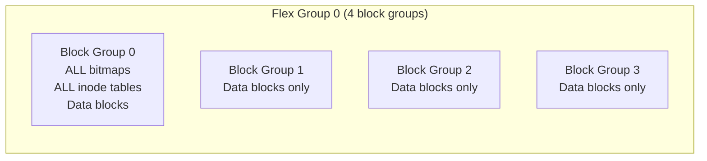
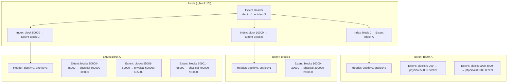
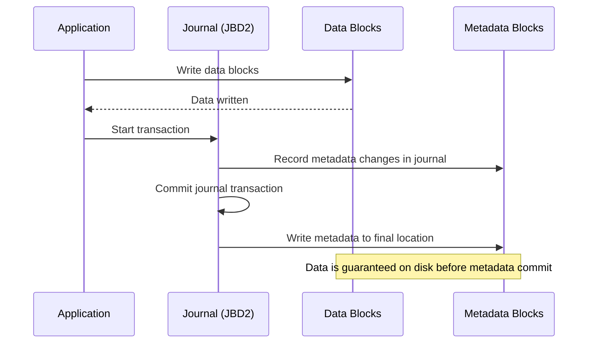
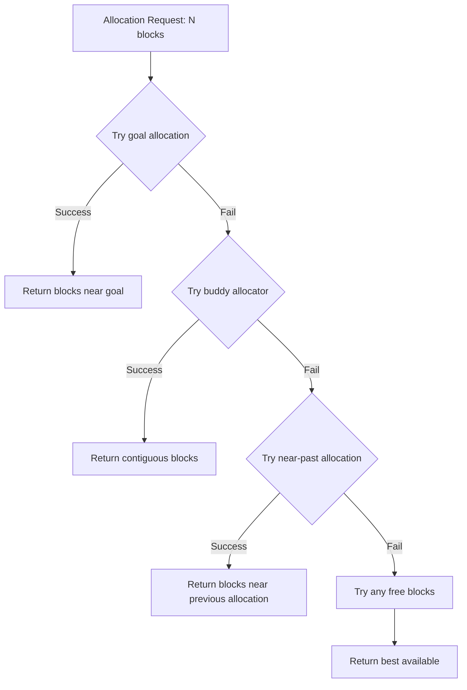
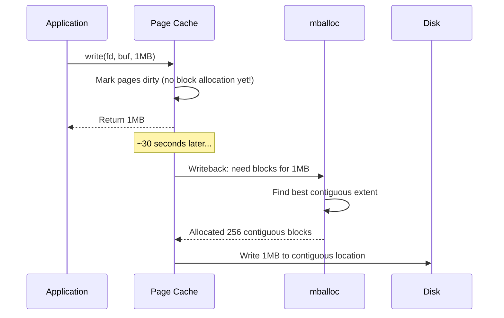

# ext4 Filesystem

## Introduction

ext4 (fourth extended filesystem) is the default filesystem for most Linux distributions. It evolved
from ext3 (which added journaling to ext2), with major additions including extent-based block
allocation, delayed allocation, nanosecond timestamps, and support for very large filesystems (up
to 1 EiB). ext4 is a mature, battle-tested filesystem that balances performance, reliability, and
feature richness.

ext4 was merged into the mainline kernel in 2006 (2.6.19) and became stable in 2.6.28. It remains
the workhorse filesystem for desktops, servers, and embedded systems alike.

## On-Disk Layout

An ext4 filesystem is divided into block groups, each containing a chunk of data blocks plus
metadata to manage them. The block allocator tries very hard to keep each file's blocks within the same group, reducing seek times.

**Block group sizing**:
- Size specified by `sb.s_blocks_per_group` blocks, or calculated as `8 * block_size_in_bytes`
- With the default 4 KiB block size: **32,768 blocks per group = 128 MiB**
- Number of block groups = device size / block group size
- All ext4 fields are written in **little-endian**; JBD2 journal fields are written in **big-endian**

```
┌─────────┬──────────┬──────────┬─────────┬──────────────────┬──────────┐
│   Boot  │  Group   │  Group   │  Block  │     Inode        │   Data   │
│  Block  │  Desc 0  │  Desc 1  │  Bitmap │     Bitmap       │  Blocks  │
│ (1024B) │  Table   │  ...     │         │                  │          │
└─────────┴──────────┴──────────┴─────────┴──────────────────┴──────────┘
```

### Block Groups

Each block group contains:

- **Superblock**: Copy of the filesystem superblock (for redundancy)
- **Group descriptors**: Metadata about each block group
- **Block bitmap**: Tracks which blocks in this group are allocated
- **Inode bitmap**: Tracks which inodes in this group are allocated
- **Inode table**: Array of on-disk inodes
- **Data blocks**: Actual file data

```c
/* ext4 group descriptor */
struct ext4_group_desc {
    __le32  bg_block_bitmap_lo;       /* Block bitmap block */
    __le32  bg_inode_bitmap_lo;       /* Inode bitmap block */
    __le32  bg_inode_table_lo;        /* Inode table block */
    __le16  bg_free_blocks_count_lo;  /* Free blocks count */
    __le16  bg_free_inodes_count_lo;  /* Free inodes count */
    __le16  bg_used_dirs_count_lo;    /* Directories count */
    __le16  bg_flags;                 /* EXT4_BG_flags */
    __le32  bg_exclude_bitmap_lo;     /* Snapshot exclusion bitmap */
    __le16  bg_block_bitmap_csum_lo;  /* crc32c(s_uuid+grp_num+bitmap) */
    __le16  bg_inode_bitmap_csum_lo;
    __le32  bg_itable_unused_lo;      /* Unused inodes count */
    __le16  bg_checksum;              /* crc16(s_uuid+group_num+desc) */
    /* 64-bit fields follow for 64-bit feature */
    __le32  bg_block_bitmap_hi;
    __le32  bg_inode_bitmap_hi;
    __le32  bg_inode_table_hi;
    __le16  bg_free_blocks_count_hi;
    __le16  bg_free_inodes_count_hi;
    __le16  bg_used_dirs_count_hi;
    __le16  bg_itable_unused_hi;
    __le32  bg_exclude_bitmap_hi;
    __le16  bg_block_bitmap_csum_hi;
    __le16  bg_inode_bitmap_csum_hi;
    __u32   bg_reserved;
};
```

### Flexible Block Groups (flex_bg)

With `flex_bg` enabled, metadata (bitmaps, inode tables) from multiple block groups is stored
together in the first group of the "flex group." This improves sequential read performance for
metadata-heavy operations:



## Extent-Based Block Mapping

The most significant improvement in ext4 over ext3 is extent-based block mapping. Instead of
storing individual block numbers (indirect blocks), ext4 stores extents — contiguous runs of
blocks:

```c
/* On-disk extent structure */
struct ext4_extent {
    __le32  ee_block;      /* First logical block covered */
    __le16  ee_len;        /* Number of blocks covered (max 32768) */
    __le16  ee_start_hi;   /* Upper 16 bits of physical block */
    __le32  ee_start_lo;   /* Lower 32 bits of physical block */
};

/* Extent index — points to an extent block */
struct ext4_extent_idx {
    __le32  ei_block;      /* First logical block covered by this index */
    __le32  ei_leaf_lo;    /* Lower 32 bits of extent block */
    __le16  ei_leaf_hi;    /* Upper 16 bits of extent block */
    __le16  ei_unused;
};

/* Extent header — at the start of each extent block */
struct ext4_extent_header {
    __le16  eh_magic;      /* 0xF30A */
    __le16  eh_entries;    /* Number of valid entries */
    __le16  eh_max;        /* Capacity of store in entries */
    __le16  eh_depth;      /* Depth of tree (0 = leaf node) */
    __le32  eh_generation; /* Generation for snapshots */
};
```

### Extent Tree Structure

The extent tree is stored in `i_block[]` (the 60 bytes of the inode that were used for indirect
blocks in ext2/ext3):



### Extent Advantages Over Indirect Blocks

| Property | Indirect Blocks | Extents |
|----------|----------------|---------|
| Storage for 1GB file | ~260 entries | ~1-4 extents |
| Sequential read overhead | Lookup each block | One extent lookup |
| Fragmentation tracking | Not possible | Per-extent |
| Max contiguous write | 12 blocks (direct) | 32768 blocks (128MB) |
| Metadata overhead | High for large files | Very low |

### Extent Tree Internals

The extent tree is a B-tree-like structure optimized for sequential and random access patterns:

```c
/* fs/ext4/extents.c - extent tree operations */

/* Insert a new extent into the tree */
int ext4_ext_insert_extent(handle_t *handle, struct inode *inode,
                           struct ext4_ext_path *path,
                           struct ext4_extent *newext, int flags)
{
    /* 1. Find insertion point in leaf node */
    /* 2. If leaf is full, split it */
    /* 3. Propagate split up to parent (index nodes) */
    /* 4. If root splits, increase tree depth */
}

/* Split a full extent block */
static int ext4_ext_split(handle_t *handle, struct inode *inode,
                          struct ext4_ext_path *path,
                          struct ext4_extent *newext, int at)
{
    /* Allocate new extent block */
    /* Move half of entries to new block */
    /* Update parent index to point to new block */
    /* Insert new entry in correct half */
}
```

### Extent Status Tree (In-Memory)

In addition to the on-disk extent tree, ext4 maintains an in-memory **extent status tree** for fast lookup of delayed extents, unwritten extents, and holes:

```c
/* fs/ext4/ext4.h */
struct ext4_ext_cache {
    ext4_lblk_t ec_start;    /* First logical block */
    ext4_lblk_t ec_len;      /* Number of blocks */
    ext4_pblk_t ec_block;    /* First physical block */
    int ec_type;              /* EXTENT_STATUS_* */
};

/* Extent status types */
#define EXTENT_STATUS_WRITTEN   (1 << 0)
#define EXTENT_STATUS_UNWRITTEN (1 << 1)
#define EXTENT_STATUS_DELAYED   (1 << 2)
#define EXTENT_STATUS_HOLE      (1 << 3)
```

```bash
# View extent status tree stats
$ cat /sys/fs/ext4/sda1/es_shk_nr   # Number of extent status entries
$ cat /sys/fs/ext4/sda1/es_shrinker_time  # Shrinker activity

# View extent tree depth
$ sudo filefrag -v /path/to/largefile | head -5
Filesystem type is: ef53
File size of /path/to/largefile is 1073741824 (262144 blocks of 4096 bytes)
 ext:     logical_offset:        physical_offset: length:   expected: flags:
   0:        0..   262143:      500000..    762143: 262144:             unwritten
```

### Maximum Extent Tree Size

```
Inode i_block[] (60 bytes):
  - 12 bytes for extent header
  - 48 bytes = 4 extents (leaf) or 3 index entries

Each extent block (4KB):
  - 12 bytes for header
  - 4088 bytes = 340 extents or 340 index entries

Max file size per tree depth:
  Depth 0: 4 extents × 32768 blocks × 4KB = 512MB
  Depth 1: 3 indexes × 340 extents × 128MB = ~130TB
  Depth 2: 3 × 340 × 340 × 128MB = ~44PB
```

## Journaling (JBD2)

ext4 uses the JBD2 (Journaling Block Device 2) layer for metadata journaling. See
[Journaling](./journaling.md) for the complete treatment.

### Journal Modes

ext4 supports three journaling modes:

#### 1. `data=ordered` (default)

Metadata is journaled; data blocks are written to disk before the metadata commit. This ensures
that after a crash, you never see stale data in a newly created/truncated file.



#### 2. `data=writeback`

Metadata is journaled; data is written whenever the OS decides. Faster but may expose stale data
after a crash.

#### 3. `data=journal`

Both data and metadata are journaled. Safest but slowest — every write goes through the journal.

### Journal Structure

The journal is stored in a regular file or a dedicated inode (inode 8):

```bash
# View journal location
$ sudo tune2fs -l /dev/sda1 | grep "Journal inode"
Journal inode:            8

# Journal size
$ sudo tune2fs -l /dev/sda1 | grep "Journal size"
Journal size:             128M

# View journal status
$ sudo debugfs -R 'stat <8>' /dev/sda1
```

## Block Allocation: mballoc

The multi-block allocator (mballoc) is ext4's primary block allocator. It tries to allocate
contiguous blocks to improve performance:

### Allocation Strategy



### mballoc Data Structures

The allocator maintains several key data structures:

```c
/* fs/ext4/mballoc.c */

/* Per-group allocation context */
struct ext4_allocation_context {
    struct inode *ac_inode;     /* File being extended */
    struct super_block *ac_sb;  /* Superblock */
    struct ext4_free_extent ac_o_ex;  /* Original request */
    struct ext4_free_extent ac_g_ex;  /* Goal (best found) */
    struct ext4_free_extent ac_b_ex;  /* Best result */
    struct ext4_free_extent ac_f_ex;  /* Final result */
    unsigned long ac_flags;     /* Allocation flags */
    /* ... */
};

/* Per-group buddy cache */
struct ext4_group_info {
    unsigned long bb_state;           /* Block group state */
    unsigned long bb_counters[];      /* Buddy bitmap counters */
    struct ext4_free_extent bb_largest_free_extent;
};
```

### Buddy Bitmap

Each block group uses a buddy bitmap to track free space at different orders:

```
Order 0: [1][0][1][1][0][1][1][1]  (individual blocks)
Order 1: [1]  [0]  [1]  [1]       (pairs: 0-1, 2-3, 4-5, 6-7)
Order 2: [0]     [1]              (quads: 0-3, 4-7)
Order 3: [0]                        (octet: 0-7)

1 = free, 0 = allocated or split
```

```bash
# View buddy bitmap state
$ sudo debugfs -R "bmap <8>" /dev/sda1  # Buddy bitmap inode

# View allocation group info
$ sudo debugfs -R "bg 0" /dev/sda1
Group 0: block bitmap 1, inode bitmap 2, inode table 3
         23456 free blocks, 65432 free inodes, 123 used dirs
```

### Allocation Goals

mballoc tries to place blocks near the allocation goal:

```c
/* fs/ext4/mballoc.c - simplified goal allocation */
static int ext4_mb_find_by_goal(struct ext4_allocation_context *ac)
{
    struct ext4_free_extent ex;
    struct ext4_group_info *grp = ext4_get_group_info(ac->ac_sb, ac->ac_g_ex.fe_group);

    /* Try to find free blocks near the goal position */
    /* Uses buddy bitmap to find contiguous free extent */
    /* Prefers extents that align with the goal */

    if (found) {
        ac->ac_b_ex = ex;
        return 0;
    }
    return -ENOSPC;
}
```

### Preallocation

ext4 uses preallocation to reduce fragmentation:

- **Per-inode preallocation**: When a file grows, extra blocks are preallocated beyond the current
  write position.
- **Per-group preallocation**: A pool of preallocated blocks is maintained per block group.
- **Directory preallocation**: Directories get extra blocks preallocated when created.

```c
/* fs/ext4/mballoc.c - inode preallocation */
static void ext4_mb_new_preallocation(struct ext4_allocation_context *ac)
{
    /* Calculate preallocation size based on: */
    /* - File size (larger files get more preallocation) */
    /* - Number of writers */
    /* - Allocation flags */
    int prealloc = 0;

    if (ac->ac_flags & EXT4_MB_STREAM_ALLOC) {
        /* Streaming allocation: small prealloc */
        prealloc = sbi->s_mb_stream_req;
    } else {
        /* Normal allocation: larger prealloc */
        prealloc = sbi->s_mb_order2_reqs;
    }

    /* Apply preallocation */
    ext4_mb_new_preallocation_real(ac, prealloc);
}
```

```bash
# View preallocation settings
$ cat /proc/sys/fs/ext4/ext4_mb_stream_req
16  # Threshold for streaming allocation

$ cat /proc/sys/fs/ext4/ext4_mb_order1_req
2   # Minimum blocks for order-1 allocation

$ cat /proc/sys/fs/ext4/ext4_mb_max_to_scan
200 # Max groups to scan before giving up

# Monitor preallocation effectiveness
$ cat /sys/fs/ext4/sda1/session_write_kbytes
$ cat /sys/fs/ext4/sda1/lifetime_write_kbytes
```

### mballoc Tuning

```bash
# Allocation tuning parameters
$ cat /proc/sys/fs/ext4/ext4_mb_min_to_scan    # Min groups scanned
$ cat /proc/sys/fs/ext4/ext4_mb_max_to_scan    # Max groups scanned
$ cat /proc/sys/fs/ext4/ext4_mb_order1_req     # Order-1 allocation threshold
$ cat /proc/sys/fs/ext4/ext4_mb_stream_req     # Streaming allocation threshold
$ cat /proc/sys/fs/ext4/ext4_mb_group_prealloc  # Group preallocation size (in blocks)

# For database workloads (many small random writes)
echo 4 > /proc/sys/fs/ext4/ext4_mb_stream_req
echo 256 > /proc/sys/fs/ext4/ext4_mb_group_prealloc

# For streaming workloads (large sequential writes)
echo 16 > /proc/sys/fs/ext4/ext4_mb_stream_req
echo 2048 > /proc/sys/fs/ext4/ext4_mb_group_prealloc
```

## Delayed Allocation

With delayed allocation (delalloc), ext4 does not allocate blocks immediately when data is written
to the page cache. Instead, it waits until writeback time (typically 30 seconds or when memory
pressure triggers dirty page writeback):



Benefits:
- Better allocation decisions (knows full write extent at allocation time)
- Fewer extents per file
- Reduced fragmentation

Risks:
- Data loss on crash if fsync not called (data in page cache but not on disk)
- This is the origin of the "ext4 data loss" controversy from 2009

## Online Defragmentation

ext4 supports online defragmentation through the `FALLOC_FL_DEFRAG` flag and the `e4defrag` tool:

```bash
# Defragment a single file
$ sudo e4defrag /path/to/fragmented/file

# Check fragmentation
$ sudo e4defrag -c /path/to/fragmented/file
  Total/best extents             127/12
  Average size per extent        32.1 KB
  Fragmentation score            38
  [0-30 no problem]: [31-55 file itself can be optimized]
  [56-74 defragment recommended]: [75-100 defragment urgently]

# Defragment entire filesystem
$ sudo e4defrag /mount/point
```

### Online Defrag Internals

```c
/* ext4 online defrag: exchange extents between temp and original file */
static int ext4_ext_swap_inode_data(handle_t *handle, struct inode *orig_inode,
                                     struct inode *donor_inode)
{
    /* 1. Allocate extents in donor file in optimal layout */
    /* 2. Copy data from original to donor */
    /* 3. Atomically swap extent trees */
    /* 4. Free original (now fragmented) extents */
}
```

## Filesystem Features and Options

### Feature Flags

```bash
# View filesystem features
$ sudo tune2fs -l /dev/sda1 | grep "Filesystem features"
Filesystem features: has_journal ext_attr resize_inode dir_index filetype
  needs_recovery extent flex_bg sparse_super large_file huge_file
  uninit_bg dir_nlink extra_isize

# Enable a feature
$ sudo tune2fs -O metadata_csum_seed /dev/sda1
```

### Common Mount Options

```bash
# View current mount options
$ mount | grep ext4
/dev/sda1 on / type ext4 (rw,relatime,errors=remount-ro)

# Common options in /etc/fstab
# /dev/sda1  /  ext4  defaults,noatime,commit=60  0  1
```

| Option | Effect |
|--------|--------|
| `noatime` | Don't update access time (performance boost) |
| `data=ordered` | Default journaling mode |
| `data=writeback` | Faster but less safe |
| `data=journal` | Full data journaling (both data and metadata journaled) |
| `commit=60` | Journal commit interval (seconds, default 5) |
| `discard` | Issue TRIM commands to SSDs |
| `nodelalloc` | Disable delayed allocation |
| `barrier=0` | Disable write barriers (dangerous!) |

## Tuning and Optimization

### Key sysfs/debugfs Parameters

```bash
# Block allocation tuning
$ cat /proc/sys/fs/ext4/ext4_mb_min_to_scan    # Min groups scanned
$ cat /proc/sys/fs/ext4/ext4_mb_max_to_scan    # Max groups scanned
$ cat /proc/sys/fs/ext4/ext4_mb_order1_req     # Order-1 allocation threshold

# Journal tuning
$ sudo tune2fs -J size=256 /dev/sda1           # Resize journal
$ sudo tune2fs -o journal_data_writeback /dev/sda1

# inode cache
$ sudo tune2fs -i 8192 /dev/sda1               # inode-to-blocks ratio

# Reserved blocks (default 5%)
$ sudo tune2fs -m 1 /dev/sda1                  # Reduce to 1% on large disks
```

### Performance Benchmarking

```bash
# Sequential write test
$ dd if=/dev/zero of=/mnt/test bs=1M count=1024 oflag=direct
1024+0 records in
1024+0 records out
1073741824 bytes (1.1 GB, 1.0 GiB) copied, 3.2 s, 335 MB/s

# Random read/write with fio
$ fio --name=random-write --ioengine=libaio --rw=randwrite \
    --bs=4k --numjobs=4 --size=1G --runtime=60 --direct=1 \
    --filename=/mnt/test/fio-test

# Metadata benchmark: creating many files
$ mkdir /mnt/test/files && cd /mnt/test/files
$ time for i in $(seq 1 100000); do touch file_$i; done
```

## fsck and Repair

```bash
# Check filesystem (unmounted)
$ sudo e2fsck -f /dev/sda1
e2fsck 1.47.0 (5-Feb-2023)
Pass 1: Checking inodes, blocks, and sizes
Pass 2: Checking directory structure
Pass 3: Checking directory connectivity
Pass 4: Checking reference counts
Pass 5: Checking group summary information
/dev/sda1: 248000/2621440 files (0.3% non-contiguous), 4500000/10485760 blocks

# Check without modifying (dry run)
$ sudo e2fsck -n /dev/sda1

# Resize an ext4 filesystem
$ sudo resize2fs /dev/sda1 50G    # Resize to 50GB
$ sudo resize2fs /dev/sda1        # Resize to fill partition
```

## Filesystem Creation

```bash
# Basic creation
$ sudo mkfs.ext4 /dev/sdb1

# With custom parameters
$ sudo mkfs.ext4 -t ext4 -b 4096 -i 4096 -L "data" -O \
    ^has_journal,extents,huge_file,flex_bg,uninit_bg,dir_nlink,extra_isize \
    /dev/sdb1

# Options explained:
# -b 4096       Block size (4096 is default and recommended)
# -i 4096       Bytes per inode (more inodes for many-small-files workloads)
# -L "data"     Volume label
# -O            Feature flags to enable (^ prefix disables)
```

## Block and Inode Allocation Policy

ext4 recognizes that data locality is a desirable quality for a filesystem. On spinning disks, keeping related blocks near each reduces head movement and speeds up I/O. On SSDs, locality increases transfer size per request and reduces total request count, potentially concentrating writes on single erase blocks for faster rewrites.

### Anti-Fragmentation Tricks

ext4 employs five key strategies to combat fragmentation:

1. **Multi-block allocator speculation**: When a file is first created, the block allocator speculatively allocates 8 KiB of disk space, assuming the space will be written soon. If correct (common for small files), the file data is written as a single multi-block extent.

2. **Delayed allocation**: When a file needs more blocks, the filesystem defers deciding exact disk placement until dirty buffers are written out. By not committing to placement until necessary (commit timeout, `sync()`, or memory pressure), ext4 makes better location decisions.

3. **Data-inode colocation**: ext4 tries to keep a file's data blocks in the same block group as its inode, reducing the seek penalty when reading the inode to find data blocks.

4. **Directory colocation**: All inodes in a directory are placed in the same block group when feasible, since files in a directory may be related.

5. **Block group spreading**: Directories created in the root directory are placed in the least heavily loaded block group, encouraging top-level directories to spread across the disk.

### e4defrag

If these mechanisms fail, `e4defrag` can defragment files:

```bash
# Check fragmentation
$ sudo e4defrag -c /path/to/file

# Defragment a single file
$ sudo e4defrag /path/to/file

# Defragment entire filesystem
$ sudo e4defrag /mount/point
```

## Snapshot Support (via LVM)

ext4 itself does not support snapshots, but they can be achieved through LVM:

```bash
# Create LVM snapshot
$ sudo lvcreate -s -n snap_root -L 5G /dev/vg0/root

# Mount snapshot for backup
$ sudo mount -o ro /dev/vg0/snap_root /mnt/snapshot

# Merge snapshot back (rollback)
$ sudo lvconvert --merge /dev/vg0/snap_root
```

## Common Operations

```bash
# View filesystem info
$ sudo tune2fs -l /dev/sda1

# Dump filesystem metadata
$ sudo dumpe2fs /dev/sda1 | less

# Debug filesystem interactively
$ sudo debugfs /dev/sda1
debugfs: ls /
debugfs: stat <2>
debugfs: blocks <2621441>

# Enable/disable features on live filesystem
$ sudo tune2fs -O metadata_csum /dev/sda1

# Fragmentation report
$ sudo filefrag -v /path/to/file
Filesystem type is: ef53
File size of /path/to/file is 1073741824 (262144 blocks of 4096 bytes)
 ext:     logical_offset:        physical_offset: length:   expected: flags:
   0:        0..   262143:      500000..    762143: 262144:
```

## Encryption Support (fscrypt)

ext4 supports filesystem-level encryption through the **fscrypt** framework (formerly "ext4 encryption"). Unlike dm-crypt (block-level encryption), fscrypt operates at the filesystem level, allowing different files to use different keys and unencrypted files to coexist on the same filesystem.

### How fscrypt Works

fscrypt integrates directly into ext4 (and F2FS, UBIFS, CephFS). When a directory is marked as encrypted, all regular files, directories, and symbolic links created within are transparently encrypted. Userspace must provide the encryption key before accessing encrypted content.

Key properties:
- **Per-file keys**: Each file gets a unique encryption key derived from a master key
- **Transparent encryption/decryption**: Happens in the page cache, no double-caching
- **Metadata**: File contents and filenames are encrypted; file sizes, permissions, timestamps, and xattrs are NOT encrypted
- **No in-place encryption**: Only empty directories can be marked encrypted

### Encryption Modes

fscrypt supports multiple encryption algorithms:

| Mode | Content Encryption | Filename Encryption | Key Size |
|------|-------------------|--------------------|----|
| AES-256-XTS | AES-256 in XTS mode | AES-256-CTS-CBC | 64 bytes |
| AES-256-CTS-CBC | AES-256 in CBC-CTS | AES-256-CTS-CBC | 32 bytes |
| Adiantum | HPolyC+ChaCha12 | Adiantum | 32 bytes |

### Key Hierarchy

```
Master Key (provided by userspace)
    │
    ├── Per-file Content Encryption Key (derived per inode)
    │
    └── Per-directory Filename Encryption Key (derived per directory)
```

The master key is never used directly for encryption. A KDF (Key Derivation Function) derives per-file keys:
- **v1 policies**: AES-128-ECB with the file's 16-byte nonce
- **v2 policies**: HKDF-SHA512 (recommended, more secure)

### Setting Up Encryption

```bash
# Using the fscrypt userspace tool
sudo fscrypt setup
fscrypt encrypt /path/to/directory
# Enter passphrase when prompted

# Files created in the directory are now encrypted
# When the key is provided, files appear transparently decrypted

# View encryption policy
fscrypt status /path/to/directory

# Lock (remove key from kernel)
fscrypt lock /path/to/directory
```

### ioctls

| ioctl | Purpose |
|-------|--------|
| `FS_IOC_SET_ENCRYPTION_POLICY` | Set encryption policy on an empty directory (v1 or v2) |
| `FS_IOC_GET_ENCRYPTION_POLICY` | Read the encryption policy |
| `FS_IOC_ADD_ENCRYPTION_KEY` | Add a master key to the filesystem |
| `FS_IOC_REMOVE_ENCRYPTION_KEY` | Remove a master key, locking files |
| `FS_IOC_GET_ENCRYPTION_KEY_STATUS` | Check key status |
| `FS_IOC_GET_ENCRYPTION_POLICY_EX` | Get extended policy info |

### Hardware-Wrapped Keys

Modern kernels support hardware-wrapped keys where the master key never enters kernel memory in plaintext. The key is wrapped by a hardware key (e.g., from a TPM or secure enclave), providing protection against kernel memory compromise and cold-boot attacks.

### v1 vs v2 Policies

- **v1** (legacy): Weaker — no key verification, per-file key compromise exposes master key, non-root users cannot securely remove keys
- **v2** (recommended): Uses HKDF-SHA512, key verification via key identifier, secure key removal for all users, no cross-compromise between per-file and master keys

## Further Reading

- [The Linux Kernel Documentation](https://docs.kernel.org/)
- [GNU Project Documentation](https://www.gnu.org/doc/doc.html)
- [GNU Manuals](https://www.gnu.org/manual/manual.html)
- [Free Software Directory](https://directory.fsf.org/wiki/Main_Page)
- [Planet GNU](https://planet.gnu.org/)
- [Free Software Books](https://www.gnu.org/doc/other-free-books.html)

- [ext4 wiki (kernel.org)](https://ext4.wiki.kernel.org/) — Official ext4 documentation
- [ext4 Disk Layout](https://ext4.wiki.kernel.org/index.php/Ext4_Disk_Layout) — On-disk format specification
- [ext4 Howto](https://ext4.wiki.kernel.org/index.php/Ext4_Howto) — Usage guide
- [ext4 Block Allocation Policy](https://docs.kernel.org/filesystems/ext4/allocators.html) — Allocator documentation
- [ext4 Dynamic Structures](https://docs.kernel.org/filesystems/ext4/dynamic.html) — Inodes, extents, directories
- [Linux kernel: fs/ext4/](https://elixir.bootlin.com/linux/latest/source/fs/ext4) — ext4 source code
- [Theodore Ts'o's blog](https://thunk.org/tytso/) — ext4 maintainer's writings
- [LWN: ext4 and delayed allocation](https://lwn.net/Articles/273912/)
- [ext4 High Level Design (kernel docs)](https://docs.kernel.org/filesystems/ext4/overview.html) — Delalloc discussion
- [fscrypt Documentation](https://docs.kernel.org/filesystems/fscrypt.html) — Filesystem-level encryption (kernel API and design)
- [fscrypt Userspace Tool](https://github.com/google/fscrypt) — Recommended CLI for managing fscrypt

## Related Topics

- [VFS](./vfs.md) — The virtual filesystem layer
- [Inode](./inode.md) — Inode structure used by ext4
- [Dentry](./dentry.md) — Directory entry caching
- [Journaling](./journaling.md) — JBD2 journaling layer
- [procfs](./procfs.md) — /proc filesystem
- [sysfs](./sysfs.md) — /sys filesystem
