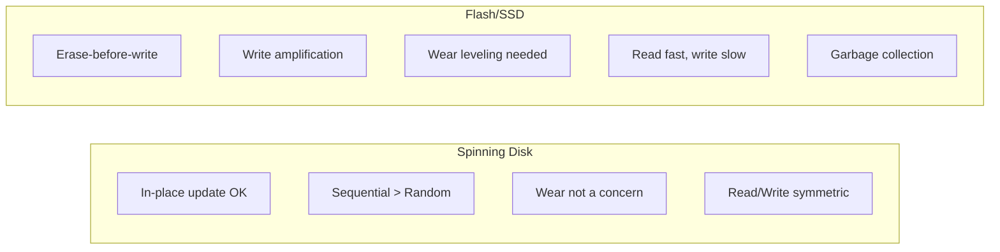
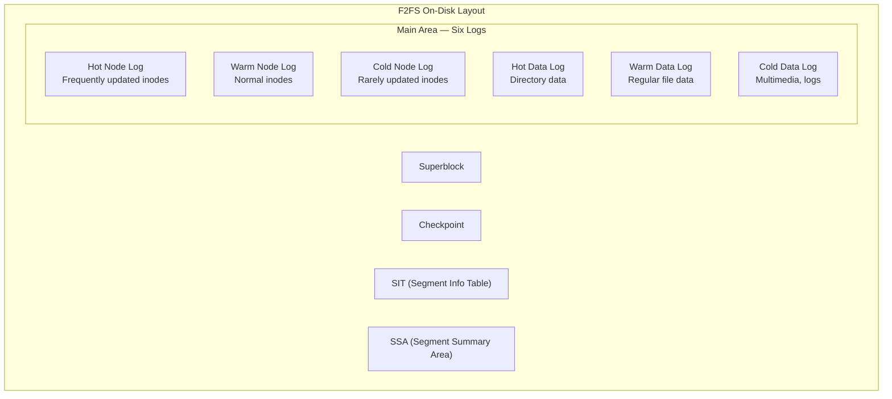
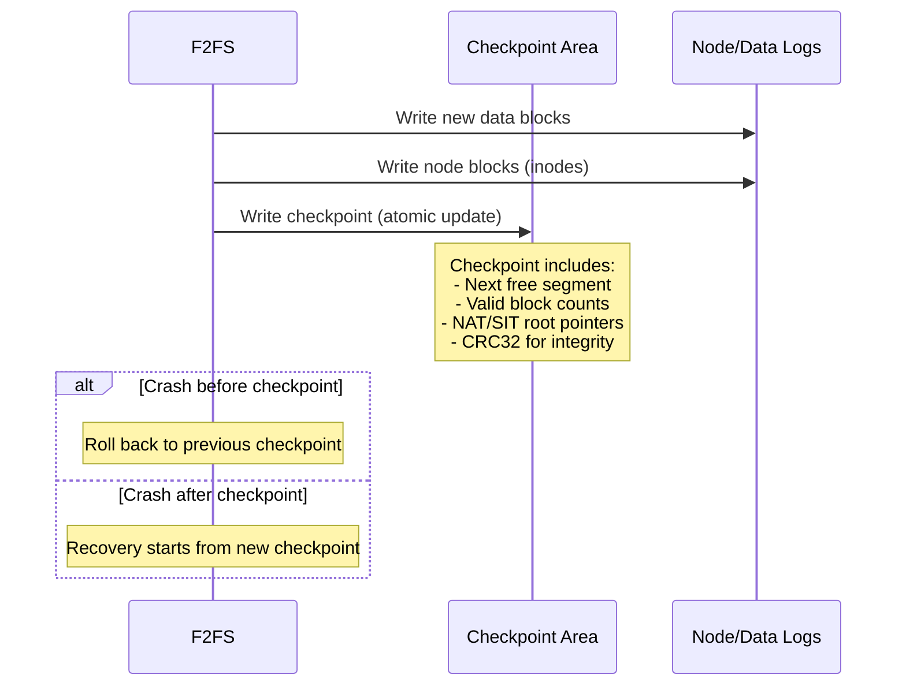
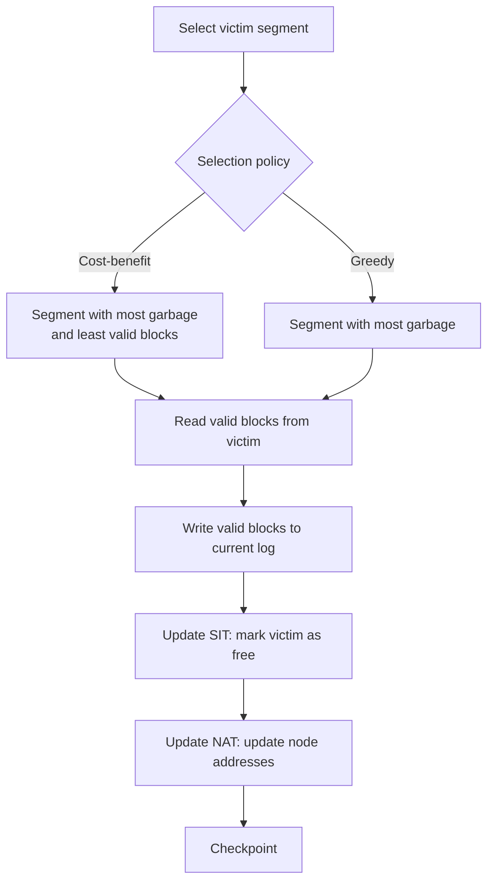
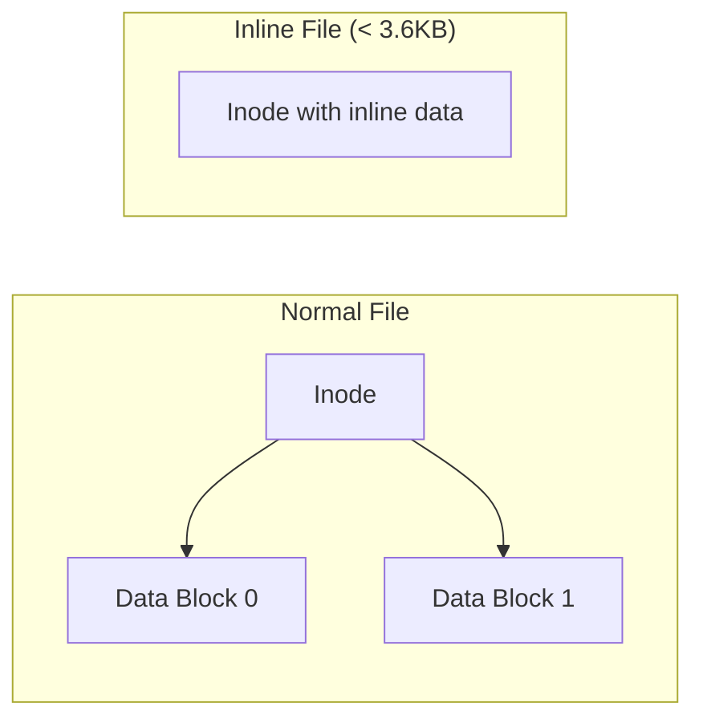

# F2FS — Flash-Friendly File System

## Introduction

F2FS (Flash-Friendly File System) is a log-structured filesystem designed specifically for NAND flash storage (SSDs, eMMC, SD cards, USB drives). Created by Jaegeuk Kim at Samsung and merged into Linux 3.8 (2013), F2FS addresses the unique characteristics of flash memory: no in-place updates, write amplification concerns, and the need for garbage collection.

Unlike ext4 or XFS which are optimized for spinning disks (though they work well on SSDs too), F2FS was built from the ground up for flash. It uses a log-structured design with six active logs, multi-head addressing, and a unique checkpoint mechanism that balances performance with crash consistency.

## Design Principles

### Why Flash is Different



Key flash constraints:
- **No in-place update**: Must erase a block before writing to it (erase blocks are 128KB-4MB)
- **Write amplification**: Small writes cause entire erase blocks to be rewritten
- **Wear leveling**: Each cell has limited write/erase cycles (1000-100000)
- **Garbage collection**: The SSD's internal GC adds latency

F2FS addresses these by:
- Writing sequentially (log-structured)
- Minimizing random writes
- Aligning writes to flash erase block boundaries
- Using multi-head logging to distribute writes

## Architecture

### Six Active Logs

F2FS maintains six separate log areas to reduce garbage collection overhead:



### Temperature-Based Separation

F2FS classifies data by update frequency ("temperature"):

| Category | Data Type | Rationale |
|----------|-----------|-----------|
| **Hot Node** | Directory inodes | Modified on every file create/delete |
| **Warm Node** | Regular file inodes | Modified less frequently |
| **Cold Node** | Symlink/special inodes | Rarely modified |
| **Hot Data** | Directory entries | Modified frequently with directory changes |
| **Warm Data** | Regular file data | Normal update frequency |
| **Cold Data** | Multimedia, large files | Written once, rarely updated |

This separation reduces write amplification during garbage collection: cold data rarely needs to be moved.

## On-Disk Format

### Superblock Structure

The F2FS superblock is located at the beginning of the device and contains critical filesystem metadata:

```c
/* Simplified from fs/f2fs/f2fs.h */
struct f2fs_super_block {
    __le32 magic;               /* F2FS_SUPER_MAGIC: 0xF2F52010 */
    __le16 major_ver;           /* Major version */
    __le16 minor_ver;           /* Minor version */
    __le32 log_sectorsize;      /* Log2 of sector size */
    __le32 log_sectors_per_block; /* Log2 of sectors per block */
    __le32 log_blocksize;       /* Log2 of block size */
    __le32 log_blocks_per_seg;  /* Log2 of blocks per segment */
    __le32 segs_per_sec;        /* Segments per section */
    __le32 secs_per_zone;       /* Sections per zone */
    __le32 checksum_offset;     /* Checksum offset */
    __le64 block_count;         /* Total block count */
    __le32 section_count;       /* Total section count */
    __le32 segment_count;       /* Total segment count */
    __le32 segment_count_ckpt;  /* Checkpoint area segments */
    __le32 segment_count_sit;   /* SIT area segments */
    __le32 segment_count_nat;   /* NAT area segments */
    __le32 segment_count_ssa;   /* SSA area segments */
    __le32 segment_count_main;  /* Main area segments */
    __le32 segment0_blkaddr;    /* Start block of segment 0 */
    /* ... more fields ... */
    __u8 uuid[16];              /* Filesystem UUID */
    __le16 volume_name[11];     /* Volume label */
    /* ... */
};
```

### Checkpoint Structure

The checkpoint is written as a pair of checkpoint packs (CP1 and CP2) for atomicity:

```c
/* Simplified from fs/f2fs/f2fs.h */
struct cp_footer {
    __le64 checkpoint_ver;      /* Checkpoint version */
    __le64 user_block_count;    /* Blocks used by user */
    __le64 valid_block_count;   /* Valid (non-garbage) blocks */
    __le32 rsvd_segment_count;  /* Reserved segments */
    __le32 free_segment_count;  /* Free segments */
    __le32 cur_node_segno[6];   /* Current node log segments */
    __le16 cur_node_blkoff[6];  /* Block offsets in node logs */
    __le32 cur_data_segno[6];   /* Current data log segments */
    __le16 cur_data_blkoff[6];  /* Block offsets in data logs */
    __le32 ckpt_flags;          /* Checkpoint flags */
    __le32 cp_pack_total_block_count;
    __le32 cp_pack_start_block;
    __le32 valid_node_count;    /* Number of valid nodes */
    __le32 valid_inode_count;   /* Number of valid inodes */
    __le32 next_free_nid;       /* Next free node ID */
    __le32 sit_ver_bitmap_bytesize;
    __le32 nat_ver_bitmap_bytesize;
    __le32 checksum_offset;     /* CRC32 checksum */
    __le64 elapsed_time;        /* Seconds since mount */
    /* ... */
};
```

### On-Disk Layout Diagram

```
F2FS On-Disk Layout:
┌─────────────────────────────────────────────────────────────┐
│ Superblock (1 block)                                        │
├─────────────────────────────────────────────────────────────┤
│ Checkpoint (CP1 + CP2, redundant copies)                    │
├─────────────────────────────────────────────────────────────┤
│ SIT (Segment Information Table)                             │
│  - Bitmap: valid blocks per segment                         │
│  - Version bitmap for GC                                    │
├─────────────────────────────────────────────────────────────┤
│ NAT (Node Address Table)                                    │
│  - Maps node IDs to physical locations                      │
├─────────────────────────────────────────────────────────────┤
│ SSA (Segment Summary Area)                                  │
│  - Summary entries for each block in main area              │
├─────────────────────────────────────────────────────────────┤
│ Main Area (six active logs)                                 │
│  ┌──────────┬──────────┬──────────┐                         │
│  │Hot Node  │Warm Node │Cold Node │                         │
│  ├──────────┼──────────┼──────────┤                         │
│  │Hot Data  │Warm Data │Cold Data │                         │
│  └──────────┴──────────┴──────────┘                         │
└─────────────────────────────────────────────────────────────┘
```

### Segment and Section Structure

```
Segment Structure (typical):
┌─────────────────────────────────────────┐
│ Segment (2MB = 512 blocks × 4KB)        │
│  ┌─────────────────────────────────┐    │
│  │ Block 0: Data or Node           │    │
│  │ Block 1: Data or Node           │    │
│  │ ...                             │    │
│  │ Block 511: Data or Node         │    │
│  └─────────────────────────────────┘    │
│                                         │
│ SSA: Summary entry per block            │
│  - Owner info (inode number, offset)    │
│  - Block type (data/node)               │
└─────────────────────────────────────────┘

Section = 1 or more segments (GC unit)
Zone = 1 or more sections (allocation unit)
```

## Checkpointing

F2FS uses a **checkpoint** mechanism for crash consistency. From the kernel documentation:

> *"F2FS supports a roll-forward recovery routine which is similar to journaling file systems. The checkpoint guarantees consistency of the filesystem metadata."*

Key checkpoint behaviors:
- **checkpoint_ver** in the checkpoint footer tracks the version; the latest valid checkpoint is used on mount
- **Roll-forward recovery** replays node/data logs after the last checkpoint to recover uncommitted data
- The `disable_roll_forward` mount option disables recovery (useful for read-only mounts via `norecovery`)
- `data_flush` forces data of regular files and symlinks to be persisted before checkpoint



### Checkpoint Commands

```bash
# Disable checkpoint (for debugging/benchmarking — DANGEROUS)
$ mount -t f2fs -o nocheckpoint /dev/sdb1 /mnt/f2fs

# Trigger manual checkpoint
$ echo 1 > /sys/fs/f2fs/<dev>/cp_interval

# Force checkpoint
$ sync; echo 1 > /sys/fs/f2fs/<dev>/cp_interval
```

## Garbage Collection

F2FS performs garbage collection (GC) to reclaim segments with invalidated blocks. From the kernel documentation at `docs.kernel.org/filesystems/f2fs.html`:

> *"A victim segment is selected through referencing segment usage table. It loads parent index structures of all the data in the victim identified by segment summary blocks. It checks the cross-reference between the data and its parent index structure. It moves valid data selectively. This cleaning job may cause unexpected long delays, so the most important goal is to hide the latencies to users."*

### GC Algorithms

F2FS supports two victim selection policies:

- **Greedy**: Selects the segment with the **most garbage** (fewest valid blocks to move). Minimizes I/O cost per segment reclaimed.
- **Cost-Benefit**: Considers both the amount of garbage and the **age** of valid data. Prefers segments where valid data is cold (less likely to become garbage soon), reducing future GC work.

### GC Algorithm



### GC Tuning

```bash
# GC tunables via sysfs
$ ls /sys/fs/f2fs/<dev>/
gc_urgent          # Trigger urgent GC (1 = enable)
gc_urgent_sleep_time  # Sleep time between urgent GC (ms)
gc_idle            # GC during idle time (0=off, 1=sync, 2=async)
gc_min_sleep_time  # Min sleep between normal GC
gc_max_sleep_time  # Max sleep between normal GC
discard            # Enable/disable TRIM/discard

# Background GC during idle
$ echo 1 > /sys/fs/f2fs/<dev>/gc_idle

# Trigger urgent GC (SSD maintenance)
$ echo 1 > /sys/fs/f2fs/<dev>/gc_urgent
```

The `gc_merge` mount option (enabled by default) allows the background GC thread to handle foreground GC requests, eliminating the sluggishness caused by slow foreground GC when triggered from a process with limited I/O and CPU resources.

### Foreground vs Background GC

| Mode | When | Impact |
|------|------|--------|
| **Background GC** | Idle time or periodic | Minimal latency impact |
| **Foreground GC** | No free segments available | Blocks I/O, high latency |
| **Urgent GC** | Manual trigger or mount option | Aggressive, may cause latency spikes |

## Multi-Stream Support (NFS/Samsung)

F2FS supports **multi-stream** for modern SSDs that expose multiple write streams:

```bash
# Enable multi-stream (requires SSD support)
# Each stream gets its own segment allocation
$ mount -t f2fs -o extent_cache /dev/sdb1 /mnt/f2fs

# Assign streams via ioctl
# FS_IOC_SET_STREAM_ID — assign a file to a specific stream
```

The idea is that different types of data (hot/cold) go to different SSD streams, reducing internal GC on the SSD itself.

## Mount Options

| Option | Description | Default |
|--------|-------------|---------|
| `background_gc={on,off}` | Enable background garbage collection | on |
| `gc_merge` | Merge GC with regular I/O | on |
| `discard` | Issue TRIM/discard commands | on |
| `no_heap` | Disable heap-based allocation | off |
| `extent_cache` | Enable extent cache | on |
| `noinline_xattr` | Don't inline xattrs into inode | off |
| `noacl` | Disable POSIX ACLs | off |
| `disable_roll_forward` | Disable recovery after crash | off |
| `nocheckpoint` | Disable checkpointing (DANGEROUS) | off |
| `compress_algorithm={lz4,zstd,lzo}` | Enable compression | none |
| `compress_log_size={2-8}` | Compression cluster size | 2 (4 blocks) |
| `inline_xattr` | Inline extended attributes | off |
| `inline_data` | Inline small file data | off |
| `inline_dentry` | Inline small directory entries | off |
| `active_logs={2,4,6}` | Number of active logs | 6 |
| `extent_cache` | Enable extent cache for faster lookups | on |
| `memory={normal,low}` | Memory usage mode | normal |
| `fault_injection={0-100}` | Fault injection probability (testing) | 0 |
| `fault_type={0-7}` | Fault injection type (testing) | 0 |
| `mode={adaptive,adaptive-lfs,lfs}` | Allocation mode | adaptive |

```bash
# Typical mount with performance options
mount -t f2fs -o background_gc=on,discard,extent_cache,inline_xattr \
    /dev/nvme0n1p3 /mnt/f2fs

# Enable compression (zstd)
mount -t f2fs -o compress_algorithm=zstd,compress_log_size=3 \
    /dev/sdb1 /mnt/f2fs
```

## Compression

F2FS supports in-line compression (Linux 5.7+):

```bash
# Enable compression per-file
$ chattr +c /mnt/f2fs/compressed_file

# Or via mount option for all files
mount -t f2fs -o compress_algorithm=zstd /dev/sdb1 /mnt/f2fs

# Check compression status
$ lsattr /mnt/f2fs/file.txt
----c------------- /mnt/f2fs/file.txt

# Compression statistics
$ cat /sys/fs/f2fs/<dev>/compr_written_blocks
$ cat /sys/fs/f2fs/<dev>/compr_saved_blocks
```

### Compression Algorithms

| Algorithm | Speed | Ratio | CPU Usage | Best For |
|-----------|-------|-------|-----------|----------|
| **lzo** | Fastest | Low | Low | General purpose, CPU-constrained |
| **lz4** | Very fast | Medium | Low | Default choice, balanced |
| **zstd** | Medium | High | Medium | Space-constrained, cold data |

### Per-File Compression

```bash
# Enable compression on specific files
$ chattr +c /mnt/f2fs/data/file.bin

# Disable compression
$ chattr -c /mnt/f2fs/data/file.bin

# Check compression ratio
$ cat /sys/fs/f2fs/<dev>/compr_written_blocks
1000000
$ cat /sys/fs/f2fs/<dev>/compr_saved_blocks
300000
# Compression ratio: 30% space saved
```

## Inline Data and Dentries

F2FS can store small files and directory entries inline to reduce overhead:

### Inline Data

For files smaller than ~3.6KB, F2FS stores the data directly in the inode:



### Inline Dentries

Small directories store entries inline in the inode:

```c
/* Inline dentry structure */
struct f2fs_inline_dentry {
    __u8 dentry_bitmap[1];      /* Bitmap of valid entries */
    __u8 reserved[3];
    struct f2fs_dir_entry dentry[1]; /* Variable-length entries */
    /* Followed by filename strings */
};
```

## F2FS vs ext4 on SSDs

| Aspect | F2FS | ext4 |
|--------|------|------|
| **Design** | Log-structured | Extent-based |
| **Write pattern** | Sequential (append-only) | In-place updates + journal |
| **GC** | Built-in, aggressive | Relies on SSD GC |
| **Crash recovery** | Checkpoint-based | Journal replay |
| **Compression** | Built-in (lz4, zstd, lzo) | Not built-in |
| **Fragmentation** | More likely over time | Less likely |
| **Stability** | Good (mature) | Excellent (very mature) |
| **Best for** | eMMC, SD cards, phones | General purpose SSDs |

## Implementation Details

### Key Source Files

- **`fs/f2fs/super.c`** — Mount/unmount, superblock operations
- **`fs/f2fs/inode.c`** — Inode read/write
- **`fs/f2fs/node.c`** — Node (inode + indirect block) management
- **`fs/f2fs/segment.c`** — Segment allocation and GC
- **`fs/f2fs/gc.c`** — Garbage collection
- **`fs/f2fs/checkpoint.c`** — Checkpoint operations
- **`fs/f2fs/data.c`** — Data block read/write
- **`fs/f2fs/recovery.c`** — Roll-forward recovery
- **`fs/f2fs/compress.c`** — Compression support

### Segment Allocation

```c
/* Simplified segment allocation */
struct f2fs_sb_info {
    struct f2fs_sm_info *sm_info;   /* Segment manager */
    /* ... */
};

struct f2fs_sm_info {
    unsigned int segment_count;     /* Total segments */
    unsigned int main_segments;     /* Main area segments */
    unsigned int free_segments;     /* Currently free */
    unsigned int cur_segno[6];      /* Current segments per log */
    unsigned int next_blkoff[6];    /* Next block offsets */
    /* ... */
};
```

### Node Address Table (NAT)

The NAT maps node IDs (NIDs) to physical block addresses:

```c
/* NAT entry */
struct f2fs_nat_entry {
    __u8 version;           /* NAT version */
    __le32 ino;             /* Inode number */
    __le32 block_addr;      /* Physical block address */
};
```

This indirection allows F2FS to move node blocks without updating parent pointers — only the NAT entry needs updating.

## Performance Characteristics

### Strengths

- **Sequential writes**: Log-structured design maximizes write throughput
- **Small file handling**: Inline data and dentries reduce overhead
- **Compression**: Saves space and reduces I/O
- **Multi-head logging**: Distributes writes across segments

### Weaknesses

- **Garbage collection overhead**: Can cause latency spikes
- **Fragmentation**: Over time, sequential files become fragmented
- **Space overhead**: SIT, NAT, SSA consume flash space
- **Recovery time**: Roll-forward recovery can be slow on large filesystems

### Tuning Tips

```bash
# For databases (random I/O)
mount -t f2fs -o no_heap,extent_cache,inline_xattr /dev/sdb1 /mnt

# For media storage (sequential I/O)
mount -t f2fs -o compress_algorithm=lz4,background_gc=on /dev/sdb1 /mnt

# For embedded (low memory)
mount -t f2fs -o memory=low,active_logs=2 /dev/sdb1 /mnt
```

## Troubleshooting

### Filesystem Check

```bash
# Check F2FS filesystem
$ fsck.f2fs /dev/sdb1

# Repair F2FS filesystem
$ fsck.f2fs -a /dev/sdb1

# Verbose check
$ fsck.f2fs -f /dev/sdb1
```

### Debug Information

```bash
# F2FS statistics
$ cat /sys/fs/f2fs/<dev>/status
# Shows: GC count, dirty segments, free segments, etc.

# Detailed stats
$ cat /sys/fs/f2fs/<dev>/gc_urgent
$ cat /sys/fs/f2fs/<dev>/cp_interval

# Kernel messages
$ dmesg | grep f2fs
```

### Common Issues

| Problem | Cause | Solution |
|---------|-------|----------|
| Slow writes | GC running | Check gc_urgent, wait or tune GC |
| ENOSPC on mount | Nocheckpoint mode | Enable checkpoint or fsck |
| Recovery slow | Large log replay | Reduce checkpoint interval |
| Corruption | Power cut during GC | Run fsck.f2fs |

## References

- [F2FS kernel documentation](https://www.kernel.org/doc/html/latest/filesystems/f2fs.html)
- [F2FS design document](https://www.kernel.org/doc/html/latest/filesystems/f2fs.html#design)
- [F2FS: A New File System for Flash Storage (USENIX FAST '15)](https://www.usenix.org/conference/fast15/technical-sessions/presentation/kim)
- [mkfs.f2fs man page](https://man7.org/linux/man-pages/man8/mkfs.f2fs.8.html)
- [LWN: The F2FS filesystem](https://lwn.net/Articles/518936/)

## Further Reading

- [The Linux Kernel Documentation](https://docs.kernel.org/)
- [GNU Project Documentation](https://www.gnu.org/doc/doc.html)
- [GNU Manuals](https://www.gnu.org/manual/manual.html)
- [Free Software Directory](https://directory.fsf.org/wiki/Main_Page)
- [Planet GNU](https://planet.gnu.org/)
- [Free Software Books](https://www.gnu.org/doc/other-free-books.html)

- [F2FS documentation — docs.kernel.org](https://docs.kernel.org/filesystems/f2fs.html)
- https://man7.org/linux/man-pages/man8/mkfs.f2fs.8.html
- https://lwn.net/Articles/518936/ — "The F2FS filesystem"
- https://lwn.net/Articles/806930/ — "F2FS compression"
- https://www.usenix.org/conference/fast15/technical-sessions/presentation/kim

## Related Topics

- [inode](./inode.md) — F2FS inode layout and node management
- [superblock](./superblock.md) — F2FS superblock and checkpoint
- [file-ops](./file-ops.md) — F2FS file read/write operations
- [devtmpfs](./devtmpfs.md) — Device management for flash storage
