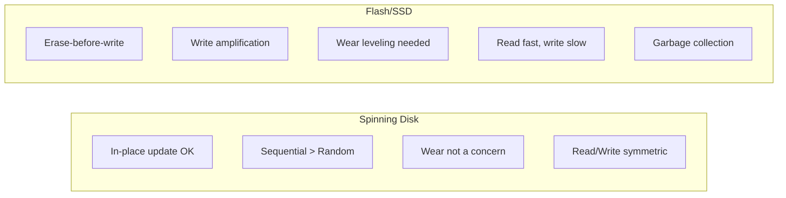
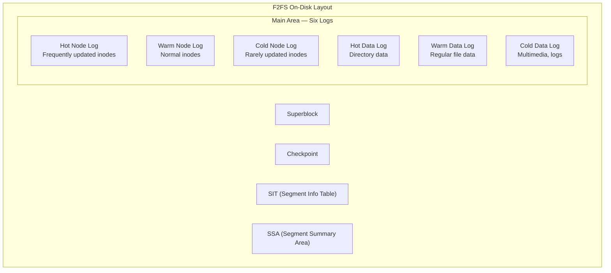
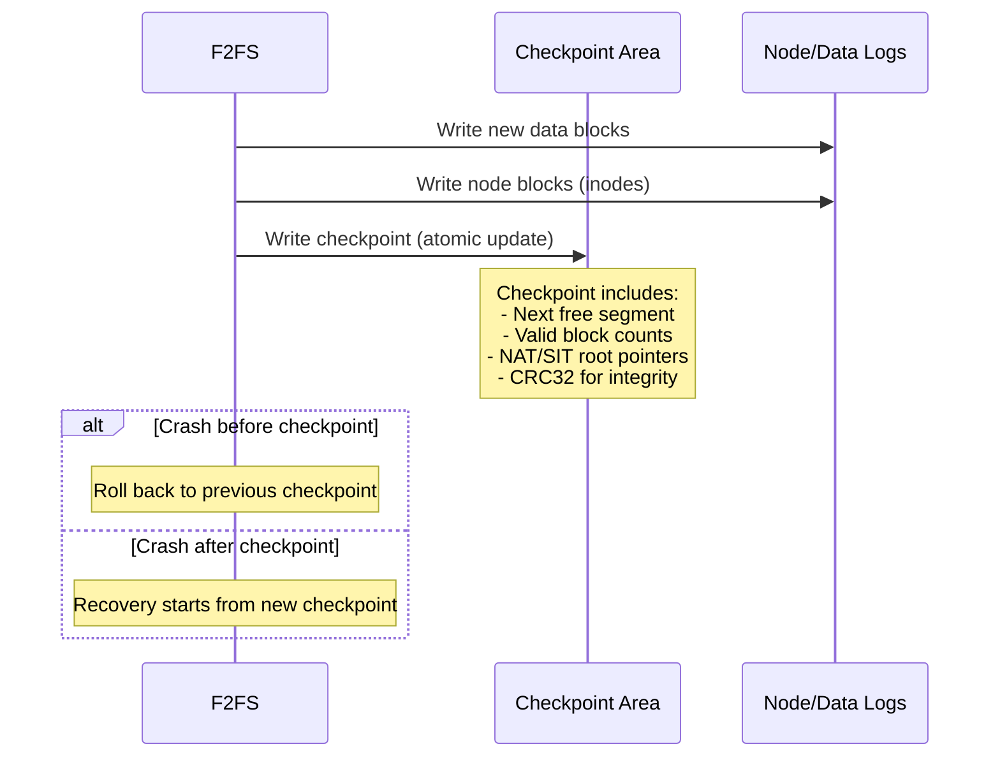
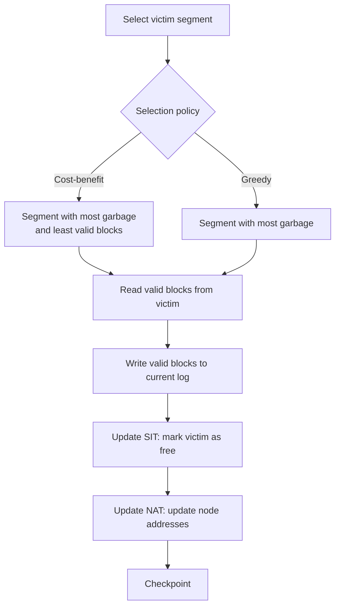

# F2FS — Flash-Friendly File System

## Introduction

F2FS (Flash-Friendly File System) is a log-structured filesystem designed specifically for NAND flash storage (SSDs, eMMC, SD cards, USB drives). Created by Jaegeuk Kim at Samsung and merged into Linux 3.8 (2013), F2FS addresses the unique characteristics of flash memory: no in-place updates, write amplification concerns, and the need for garbage collection.

Unlike ext4 or XFS which are optimized for spinning disks (though they work well on SSDs too), F2FS was built from the ground up for flash. It uses a log-structured design with six active logs, multi-head addressing, and a unique checkpoint mechanism that balances performance with crash consistency.

## Design Principles

### Why Flash is Different



Key flash constraints:
- **No in-place update**: Must erase a block before writing to it (erase blocks are 128KB-4MB)
- **Write amplification**: Small writes cause entire erase blocks to be rewritten
- **Wear leveling**: Each cell has limited write/erase cycles (1000-100000)
- **Garbage collection**: The SSD's internal GC adds latency

F2FS addresses these by:
- Writing sequentially (log-structured)
- Minimizing random writes
- Aligning writes to flash erase block boundaries
- Using multi-head logging to distribute writes

## Architecture

### Six Active Logs

F2FS maintains six separate log areas to reduce garbage collection overhead:



### Temperature-Based Separation

F2FS classifies data by update frequency ("temperature"):

| Category | Data Type | Rationale |
|----------|-----------|-----------|
| **Hot Node** | Directory inodes | Modified on every file create/delete |
| **Warm Node** | Regular file inodes | Modified less frequently |
| **Cold Node** | Symlink/special inodes | Rarely modified |
| **Hot Data** | Directory entries | Modified frequently with directory changes |
| **Warm Data** | Regular file data | Normal update frequency |
| **Cold Data** | Multimedia, large files | Written once, rarely updated |

This separation reduces write amplification during garbage collection: cold data rarely needs to be moved.

## Checkpointing

F2FS uses a **checkpoint** mechanism for crash consistency:



### Checkpoint Structure

```c
/* Simplified from fs/f2fs/f2fs.h */
struct cp_footer {
    __le64 checkpoint_ver;      /* Checkpoint version */
    __le64 user_block_count;    /* Blocks used by user */
    __le64 valid_block_count;   /* Valid (non-garbage) blocks */
    __le32 rsvd_segment_count;  /* Reserved segments */
    __le32 free_segment_count;  /* Free segments */
    __le32 cur_node_segno[6];   /* Current node log segments */
    __le16 cur_node_blkoff[6];  /* Block offsets in node logs */
    __le32 cur_data_segno[6];   /* Current data log segments */
    __le16 cur_data_blkoff[6];  /* Block offsets in data logs */
    __le32 ckpt_flags;          /* Checkpoint flags */
    __le32 cp_pack_total_block_count;
    __le32 cp_pack_start_block;
    __le32 valid_node_count;    /* Number of valid nodes */
    __le32 valid_inode_count;   /* Number of valid inodes */
    __le32 next_free_nid;       /* Next free node ID */
    __le32 sit_ver_bitmap_bytesize;
    __le32 nat_ver_bitmap_bytesize;
    __le32 checksum_offset;     /* CRC32 checksum */
    __le64 elapsed_time;        /* Seconds since mount */
    /* ... */
};
```

### Checkpoint Commands

```bash
# Disable checkpoint (for debugging/benchmarking — DANGEROUS)
$ mount -t f2fs -o nocheckpoint /dev/sdb1 /mnt/f2fs

# Trigger manual checkpoint
$ echo 1 > /sys/fs/f2fs/<dev>/cp_interval

# Force checkpoint
$ sync; echo 1 > /sys/fs/f2fs/<dev>/cp_interval
```

## Garbage Collection

F2FS performs garbage collection (GC) to reclaim segments with invalidated blocks:

### GC Algorithm



### GC Tuning

```bash
# GC tunables via sysfs
$ ls /sys/fs/f2fs/<dev>/
gc_urgent          # Trigger urgent GC (1 = enable)
gc_urgent_sleep_time  # Sleep time between urgent GC (ms)
gc_idle            # GC during idle time (0=off, 1=sync, 2=async)
gc_min_sleep_time  # Min sleep between normal GC
gc_max_sleep_time  # Max sleep between normal GC
discard            # Enable/disable TRIM/discard

# Background GC during idle
$ echo 1 > /sys/fs/f2fs/<dev>/gc_idle

# Trigger urgent GC (SSD maintenance)
$ echo 1 > /sys/fs/f2fs/<dev>/gc_urgent
```

### Foreground vs Background GC

| Mode | When | Impact |
|------|------|--------|
| **Background GC** | Idle time or periodic | Minimal latency impact |
| **Foreground GC** | No free segments available | Blocks I/O, high latency |
| **Urgent GC** | Manual trigger or mount option | Aggressive, may cause latency spikes |

## Multi-Stream Support (NFS/Samsung)

F2FS supports **multi-stream** for modern SSDs that expose multiple write streams:

```bash
# Enable multi-stream (requires SSD support)
# Each stream gets its own segment allocation
$ mount -t f2fs -o extent_cache /dev/sdb1 /mnt/f2fs

# Assign streams via ioctl
# FS_IOC_SET_STREAM_ID — assign a file to a specific stream
```

The idea is that different types of data (hot/cold) go to different SSD streams, reducing internal GC on the SSD itself.

## Mount Options

| Option | Description | Default |
|--------|-------------|---------|
| `background_gc={on,off}` | Enable background garbage collection | on |
| `gc_merge` | Merge GC with regular I/O | on |
| `discard` | Issue TRIM/discard commands | on |
| `no_heap` | Disable heap-based allocation | off |
| `extent_cache` | Enable extent cache | on |
| `noinline_xattr` | Don't inline xattrs into inode | off |
| `noacl` | Disable POSIX ACLs | off |
| `disable_roll_forward` | Disable recovery after crash | off |
| `nocheckpoint` | Disable checkpointing (DANGEROUS) | off |
| `compress_algorithm={lz4,zstd,lzo}` | Enable compression | none |
| `compress_log_size={2-8}` | Compression cluster size | 2 (4 blocks) |
| `inline_xattr` | Inline extended attributes | off |
| `inline_data` | Inline small file data | off |
| `inline_dentry` | Inline small directory entries | off |
| `active_logs={2,4,6}` | Number of active logs | 6 |

```bash
# Typical mount with performance options
mount -t f2fs -o background_gc=on,discard,extent_cache,inline_xattr \
    /dev/nvme0n1p3 /mnt/f2fs

# Enable compression (zstd)
mount -t f2fs -o compress_algorithm=zstd,compress_log_size=3 \
    /dev/sdb1 /mnt/f2fs
```

## Compression

F2FS supports in-line compression (Linux 5.7+):

```bash
# Enable compression per-file
$ chattr +c /mnt/f2fs/compressed_file

# Or via mount option for all files
mount -t f2fs -o compress_algorithm=zstd /dev/sdb1 /mnt/f2fs

# Check compression status
$ lsattr /mnt/f2fs/file.txt
----c------------- /mnt/f2fs/file.txt

# Compression statistics
$ cat /sys/fs/f2fs/<dev>/compr_written_blocks
$ cat /sys/fs/f2fs/<dev>/compr_saved_blocks
```

## F2FS vs ext4 on SSDs

| Aspect | F2FS | ext4 |
|--------|------|------|
| **Design** | Log-structured | Extent-based |
| **Write pattern** | Sequential (append-only) | In-place updates + journal |
| **GC** | Built-in, aggressive | Relies on SSD GC |
| **Crash recovery** | Checkpoint-based | Journal replay |
| **Compression** | Built-in (lz4, zstd, lzo) | Not built-in |
| **Fragmentation** | More likely over time | Less likely |
| **Stability** | Good (mature) | Excellent (very mature) |
| **Best for** | eMMC, SD cards, phones | General purpose SSDs |

## Implementation Details

### Key Source Files

- **`fs/f2fs/super.c`** — Mount/unmount, superblock operations
- **`fs/f2fs/inode.c`** — Inode read/write
- **`fs/f2fs/node.c`** — Node (inode + indirect block) management
- **`fs/f2fs/segment.c`** — Segment allocation and GC
- **`fs/f2fs/gc.c`** — Garbage collection
- **`fs/f2fs/checkpoint.c`** — Checkpoint operations
- **`fs/f2fs/data.c`** — Data block read/write
- **`fs/f2fs/recovery.c`** — Roll-forward recovery
- **`fs/f2fs/compress.c`** — Compression support

### Segment Allocation

```c
/* Simplified segment allocation */
struct f2fs_sb_info {
    struct f2fs_sm_info *sm_info;   /* Segment manager */
    /* ... */
};

struct f2fs_sm_info {
    unsigned int segment_count;     /* Total segments */
    unsigned int main_segments;     /* Main area segments */
    unsigned int free_segments;     /* Currently free */
    unsigned int cur_segno[6];      /* Current segments per log */
    unsigned int next_blkoff[6];    /* Next block offsets */
    /* ... */
};
```

## References

- [F2FS kernel documentation](https://www.kernel.org/doc/html/latest/filesystems/f2fs.html)
- [F2FS design document](https://www.kernel.org/doc/html/latest/filesystems/f2fs.html#design)
- [F2FS: A New File System for Flash Storage (USENIX FAST '15)](https://www.usenix.org/conference/fast15/technical-sessions/presentation/kim)

## Further Reading

- [The Linux Kernel Documentation](https://docs.kernel.org/)
- [GNU Project Documentation](https://www.gnu.org/doc/doc.html)
- [GNU Manuals](https://www.gnu.org/manual/manual.html)
- [Free Software Directory](https://directory.fsf.org/wiki/Main_Page)
- [Planet GNU](https://planet.gnu.org/)
- [Free Software Books](https://www.gnu.org/doc/other-free-books.html)

- https://www.kernel.org/doc/html/latest/filesystems/f2fs.html
- https://man7.org/linux/man-pages/man8/mkfs.f2fs.8.html
- https://lwn.net/Articles/518936/ — "The F2FS filesystem"
- https://lwn.net/Articles/806930/ — "F2FS compression"
- https://www.usenix.org/conference/fast15/technical-sessions/presentation/kim

## Related Topics

- [inode](./inode.md) — F2FS inode layout and node management
- [superblock](./superblock.md) — F2FS superblock and checkpoint
- [file-ops](./file-ops.md) — F2FS file read/write operations
- [devtmpfs](./devtmpfs.md) — Device management for flash storage
