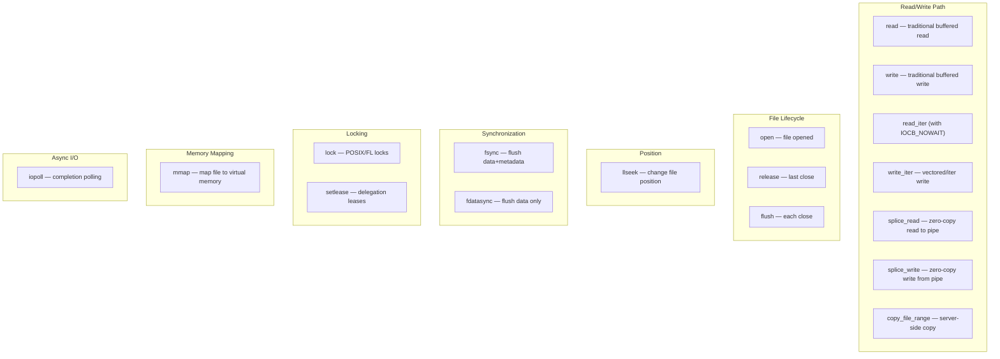
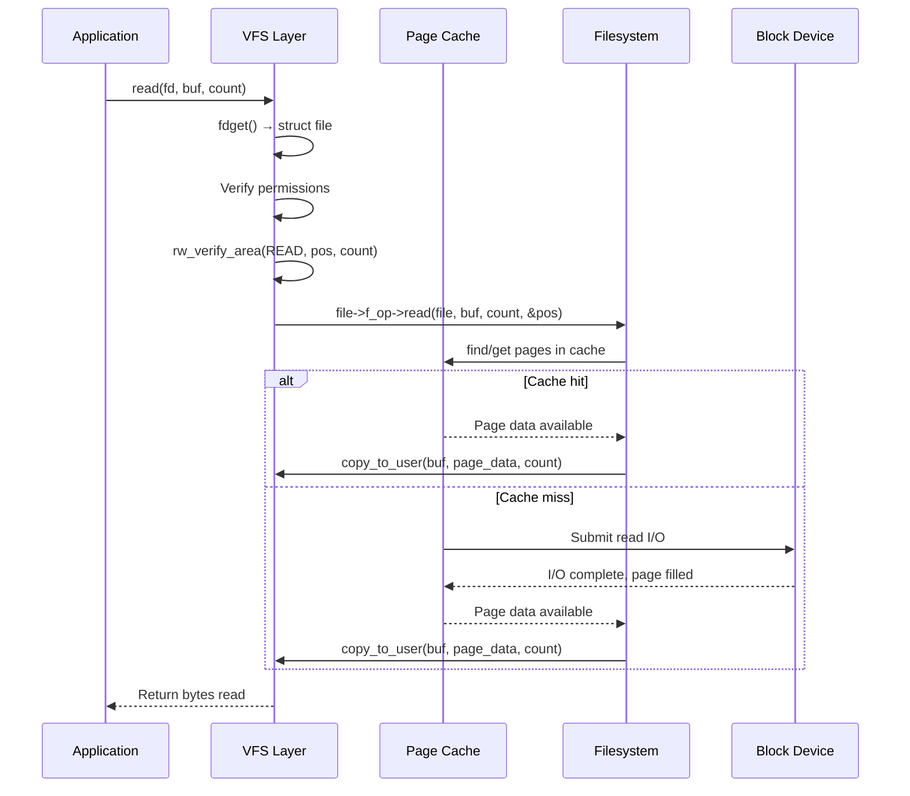
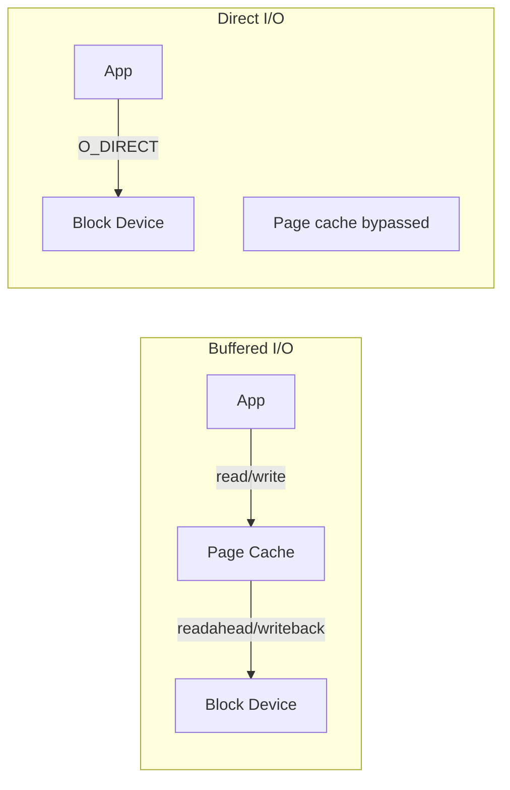
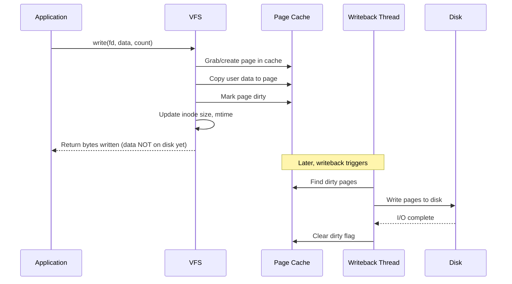
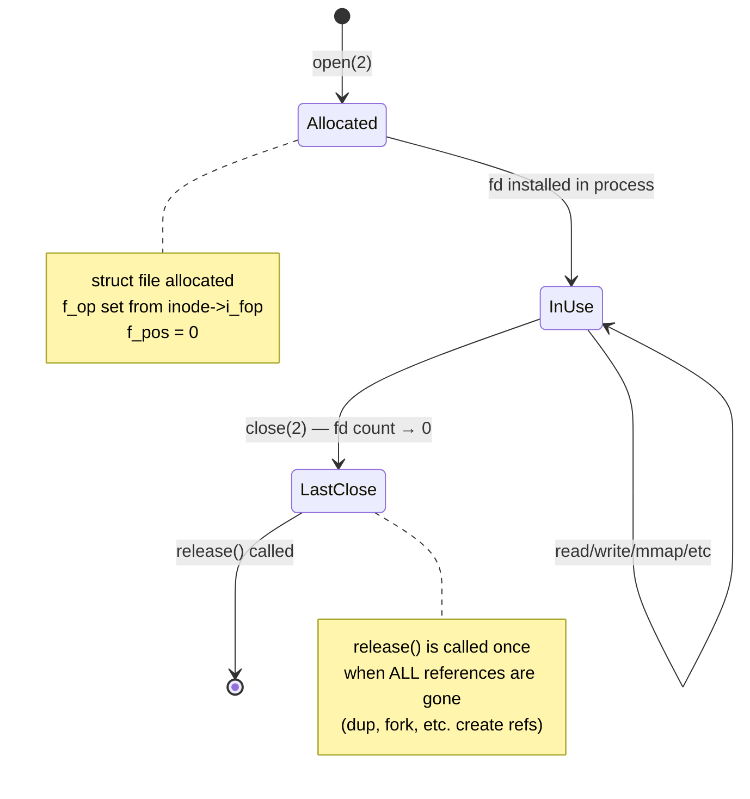
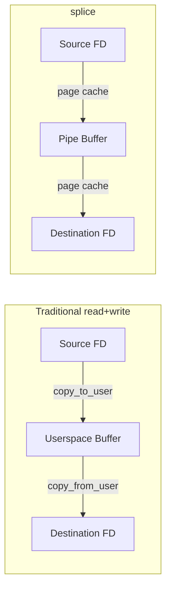
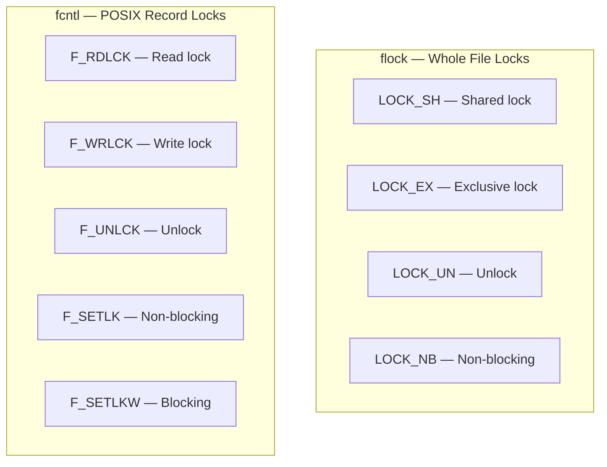

# File Operations

## Introduction

File operations are the interface between user-space I/O system calls and the kernel's filesystem implementations. When a user process calls `read()`, `write()`, `open()`, `close()`, or performs memory-mapped I/O, the VFS layer dispatches these calls through a `file_operations` structure that each filesystem or device driver provides.

The `file_operations` structure is arguably the most frequently invoked interface in the entire Linux kernel. It handles everything from simple `cat` commands to complex asynchronous I/O, zero-copy transfers, and file locking.

## The `file_operations` Structure

### Definition

```c
/* Simplified from include/linux/fs.h */
struct file_operations {
    struct module *owner;
    loff_t (*llseek)(struct file *, loff_t, int);
    ssize_t (*read)(struct file *, char __user *, size_t, loff_t *);
    ssize_t (*write)(struct file *, const char __user *, size_t, loff_t *);
    ssize_t (*read_iter)(struct kiocb *, struct iov_iter *);
    ssize_t (*write_iter)(struct kiocb *, struct iov_iter *);
    int (*iopoll)(struct kiocb *kiocb, bool spin);
    int (*iterate_shared)(struct file *, struct dir_context *);
    __poll_t (*poll)(struct file *, struct poll_table_struct *);
    long (*unlocked_ioctl)(struct file *, unsigned int, unsigned long);
    long (*compat_ioctl)(struct file *, unsigned int, unsigned long);
    int (*mmap)(struct file *, struct vm_area_struct *);
    unsigned long mmap_supported_flags;
    int (*open)(struct inode *, struct file *);
    int (*flush)(struct file *, fl_owner_t id);
    int (*release)(struct inode *, struct file *);
    int (*fsync)(struct file *, loff_t, loff_t, int datasync);
    int (*fasync)(int, struct file *, int);
    int (*lock)(struct file *, int, struct file_lock *);
    ssize_t (*splice_read)(struct file *, loff_t *, struct pipe_inode_info *,
                           size_t, unsigned int);
    ssize_t (*splice_write)(struct pipe_inode_info *, struct file *,
                            loff_t *, size_t, unsigned int);
    int (*setlease)(struct file *, int, struct file_lock **, void **);
    long (*fallocate)(struct file *file, int mode, loff_t offset, loff_t len);
    void (*show_fdinfo)(struct seq_file *m, struct file *f);
    ssize_t (*copy_file_range)(struct file *, loff_t, struct file *,
                               loff_t, size_t, unsigned int);
    loff_t (*remap_file_range)(struct file *file_in, loff_t pos_in,
                               struct file *file_out, loff_t pos_out,
                               loff_t len, unsigned int remap_flags);
    int (*fadvise)(struct file *, loff_t, loff_t, int);
};
```

### Operation Categories



## The Read Path

### Traditional `read()` Flow



### Modern `read_iter()` Flow

Modern filesystems implement `read_iter()` using the `iov_iter` interface, which supports scatter-gather I/O:

```c
/* Generic implementation: generic_file_read_iter() */
ssize_t generic_file_read_iter(struct kiocb *iocb, struct iov_iter *iter) {
    struct file *file = iocb->ki_filp;
    ssize_t retval = 0;

    if (iocb->ki_flags & IOCB_DIRECT) {
        /* Direct I/O: bypass page cache */
        retval = mapping->a_ops->direct_IO(iocb, iter);
    } else {
        /* Buffered I/O: use page cache */
        retval = filemap_read(iocb, iter, retval);
    }
    return retval;
}
```

### Direct I/O vs Buffered I/O



```bash
# Buffered I/O (default)
$ dd if=/dev/sda of=/tmp/file bs=1M count=100

# Direct I/O (bypass page cache)
$ dd if=/dev/sda of=/tmp/file bs=1M count=100 iflag=direct

# In C code
int fd = open("/data/file", O_RDWR | O_DIRECT);
```

## The Write Path

### Buffered Write Flow



### Write Ordering

```bash
# Check write ordering constraints
$ cat /proc/sys/vm/dirty_ratio
20

$ cat /proc/sys/vm/dirty_background_ratio
10

$ cat /proc/sys/vm/dirty_expire_centisecs
3000

# Force data to disk
$ sync                    # All filesystems
$ sync /data              # Specific mountpoint
$ fdatasync(fd)           # Per-file in C
```

## `open()` and `release()`

### File Lifecycle



### `open()` Implementation

```c
/* Example: ext4_file_open() */
static int ext4_file_open(struct inode *inode, struct file *filp) {
    struct super_block *sb = inode->i_sb;

    /* Check for filesystem errors */
    if (EXT4_SB(sb)->s_mount_state & EXT4_ERROR_FS)
        return -EFSCORRUPTED;

    /* Set up DAX mode if applicable */
    if (IS_DAX(inode))
        filp->f_flags |= O_DAX;

    /* Call generic open */
    return generic_file_open(inode, filp);
}
```

### `flush()` vs `release()`

- **`flush()`**: Called on **every** `close()` system call, including dup'd file descriptors. Used for cleanup that should happen per-close (e.g., clearing advisory locks held by the process).
- **`release()`**: Called when the **last** reference to a `struct file` is gone. Used for final cleanup (freeing private data, releasing hardware resources).

```bash
# Demonstrate flush vs release
$ exec 3>/tmp/test     # Open fd 3
$ exec 4>&3            # dup: fd 4 → same struct file
$ exec 3>&-            # close fd 3 → flush() called
$ exec 4>&-            # close fd 4 → flush() called, then release()
```

## Asynchronous I/O (AIO)

### io_uring

Modern Linux uses `io_uring` for efficient async I/O:

```c
#include <liburing.h>

int main() {
    struct io_uring ring;
    io_uring_queue_init(256, &ring, 0);

    /* Prepare a read */
    struct io_uring_sqe *sqe = io_uring_get_sqe(&ring);
    io_uring_prep_read(sqe, fd, buf, 4096, 0);
    sqe->flags |= IOSQE_ASYNC;

    /* Submit */
    io_uring_submit(&ring);

    /* Wait for completion */
    struct io_uring_cqe *cqe;
    io_uring_wait_cqe(&ring, &cqe);
    int result = cqe->res;
    io_uring_cqe_seen(&ring, cqe);
}
```

### Legacy AIO

```c
#include <linux/aio_abi.h>
#include <sys/syscall.h>

/* Legacy AIO via syscalls */
aio_context_t ctx = 0;
syscall(__NR_io_setup, 128, &ctx);

struct iocb cb = {
    .aio_fildes = fd,
    .aio_lio_opcode = IOCB_CMD_PREAD,
    .aio_buf = (uint64_t)buf,
    .aio_nbytes = 4096,
    .aio_offset = 0,
};

struct iocb *cbs[1] = { &cb };
syscall(__NR_io_submit, ctx, 1, cbs);

struct io_event events[1];
syscall(__NR_io_getevents, ctx, 1, 1, events, NULL);
```

## splice and sendfile

### splice — Zero-Copy Data Movement

`splice()` moves data between a file descriptor and a pipe without copying through userspace:



```c
/* splice from file to pipe, then from pipe to socket */
int pfd[2];
pipe(pfd);

/* Move data from file to pipe (no copy) */
splice(file_fd, NULL, pfd[1], NULL, 4096, SPLICE_F_MOVE);

/* Move data from pipe to socket (no copy) */
splice(pfd[0], NULL, socket_fd, NULL, 4096, SPLICE_F_MOVE);
```

### sendfile

`sendfile()` is a specialized splice from file to socket:

```c
#include <sys/sendfile.h>

/* Send file directly to socket — zero copy */
sendfile(socket_fd, file_fd, &offset, count);
```

### copy_file_range (NFSv4.2)

Server-side copy for NFS:

```c
#include <unistd.h>

/* Copy between two file descriptors — may be offloaded to server */
copy_file_range(src_fd, &src_off, dst_fd, &dst_off, len, 0);
```

## File Locking

### Advisory Locking (flock / fcntl)



```c
/* flock: whole-file locking */
#include <sys/file.h>
int fd = open("/data/file", O_RDWR);
flock(fd, LOCK_EX);        /* Exclusive lock */
/* ... critical section ... */
flock(fd, LOCK_UN);        /* Unlock */

/* fcntl: POSIX record locking (byte-range) */
#include <fcntl.h>
struct flock fl = {
    .l_type   = F_WRLCK,    /* Write lock */
    .l_whence = SEEK_SET,
    .l_start  = 0,           /* Lock from byte 0 */
    .l_len    = 1024,        /* Lock 1024 bytes */
};
fcntl(fd, F_SETLKW, &fl);  /* Blocking set lock */
```

### Mandatory Locking (Deprecated)

```bash
# Mandatory locking requires:
# 1. Filesystem mounted with -o mand
# 2. File has SGID bit set, group execute bit cleared
mount -o mand /dev/sdb1 /mnt/mand
chmod g+s,g-x /mnt/mand/locked_file
# Note: mandatory locking is deprecated and removed in recent kernels
```

### leases — Delegation Locks

```c
/* Set a lease (delegation) on a file */
fcntl(fd, F_SETLEASE, F_RDLCK);  /* Read lease */
fcntl(fd, F_SETLEASE, F_WRLCK);  /* Write lease */

/* When another process tries to open for write,
 * the lease holder receives SIGIO and has time
 * to flush data before the lease is broken */
fcntl(fd, F_SETLEASE, F_UNLCK);  /* Break lease */
```

## fsync and fdatasync

```bash
# fsync: flush data AND metadata to disk
# fdatasync: flush data only (skip metadata if size unchanged)
# sync_file_range: fine-grained control over what gets flushed

$ strace -e trace=fsync,fdatasync dd if=/dev/zero of=/tmp/test bs=4k count=1 conv=fdatasync
fdatasync(1)    = 0
```

## Implementation Details

### Key Source Files

- **`fs/read_write.c`** — `read(2)`, `write(2)`, `lseek(2)` system call implementations
- **`fs/file_table.c`** — `struct file` allocation and management
- **`fs/splice.c`** — `splice(2)` and `sendfile(2)` implementations
- **`fs/locks.c`** — File locking implementation
- **`include/linux/fs.h`** — `file_operations` definition
- **`mm/filemap.c`** — Buffered I/O through the page cache

### The `struct file`

```c
struct file {
    union {
        struct llist_node   f_llist;
        struct rcu_head     f_rcuhead;
        unsigned int        f_iocb_flags;
    };
    struct path             f_path;       /* Mount point + dentry */
    struct inode           *f_inode;      /* Cached inode pointer */
    const struct file_operations *f_op;   /* File operations */
    spinlock_t              f_lock;
    atomic_long_t           f_count;      /* Reference count */
    unsigned int            f_flags;      /* O_RDONLY, O_NONBLOCK, etc. */
    fmode_t                 f_mode;       /* FMODE_READ, FMODE_WRITE, etc. */
    struct mutex            f_pos_lock;
    loff_t                  f_pos;        /* Current file position */
    struct fown_struct      f_owner;
    void                   *private_data; /* FS/driver private data */
    struct address_space   *f_mapping;    /* Page cache mapping */
};
```

## References

- [VFS file operations documentation](https://www.kernel.org/doc/html/latest/filesystems/vfs.html#file-operations)
- [include/linux/fs.h source](https://github.com/torvalds/linux/blob/master/include/linux/fs.h)
- [io_uring documentation](https://www.kernel.org/doc/html/latest/userspace-api/io_uring.html)

## Further Reading

- [The Linux Kernel Documentation](https://docs.kernel.org/)
- [LWN.net - Linux and free software news](https://lwn.net/)
- [GNU Project Documentation](https://www.gnu.org/doc/doc.html)
- [GNU Manuals](https://www.gnu.org/manual/manual.html)
- [Free Software Directory](https://directory.fsf.org/wiki/Main_Page)
- [Planet GNU](https://planet.gnu.org/)
- [Free Software Books](https://www.gnu.org/doc/other-free-books.html)

- https://www.kernel.org/doc/html/latest/filesystems/vfs.html
- https://man7.org/linux/man-pages/man2/read.2.html
- https://man7.org/linux/man-pages/man2/splice.2.html
- https://man7.org/linux/man-pages/man2/fcntl.2.html
- https://kernel.dk/io_uring.pdf — "Efficient I/O with io_uring"

## Related Topics

- [inode](./inode.md) — Inodes define default file operations
- [superblock](./superblock.md) — File operations work within superblock context
- [buffer-cache](../memory/buffer-cache.md) — How buffered I/O interacts with the page cache
- [f2fs](./f2fs.md) — F2FS file operations for flash storage
