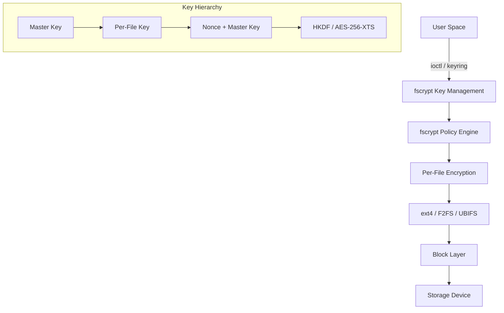
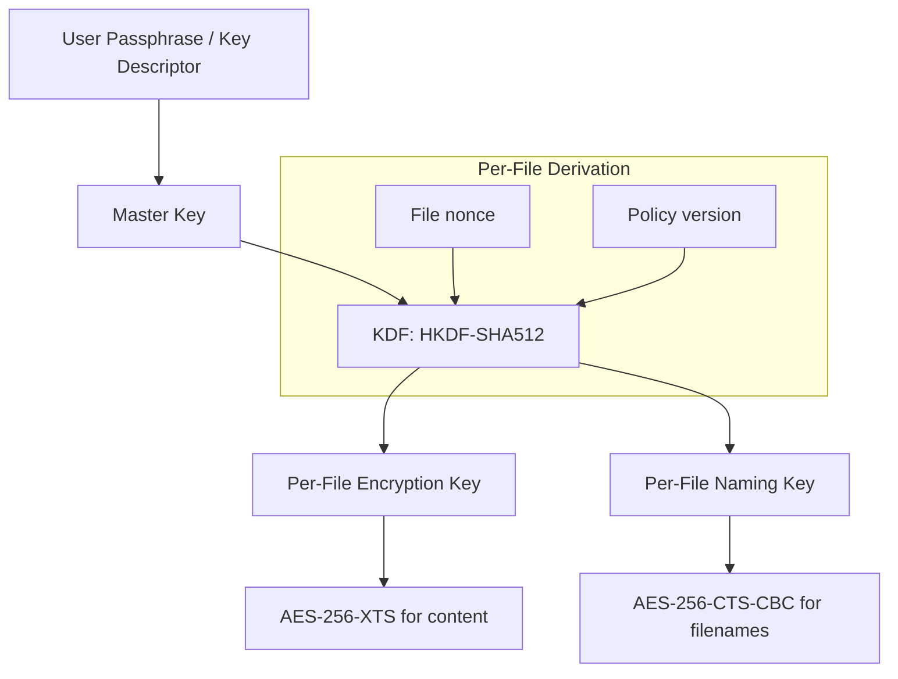
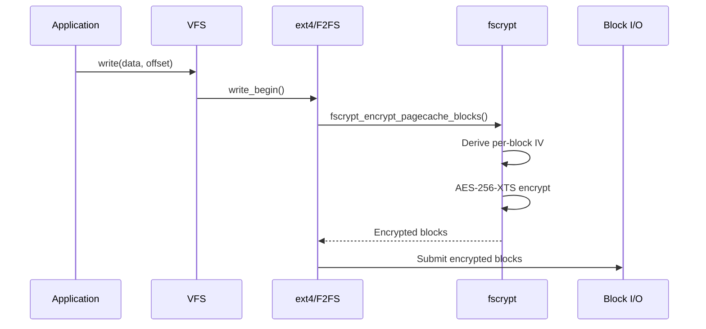
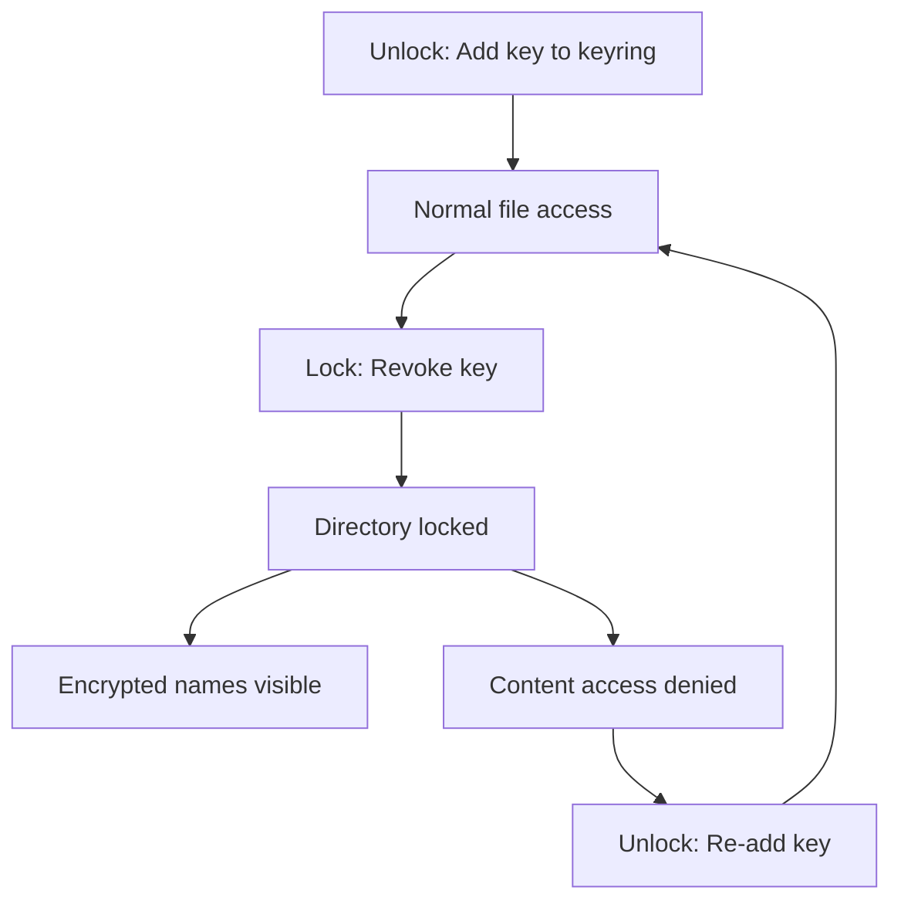
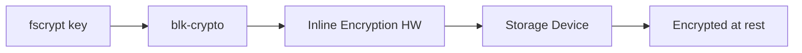

# fscrypt: Filesystem-Level Encryption

## Introduction

fscrypt (pronounced "eff-ess-crypt") is a Linux kernel library that provides
filesystem-level encryption. It enables per-directory encryption policies where
files in the same directory can share encryption keys but remain inaccessible
without the correct key material. Used by ext4, F2FS, and UBIFS, fscrypt provides
transparent encryption that integrates with standard filesystem operations while
keeping key management in user space. Unlike full-disk encryption (dm-crypt),
fscrypt encrypts at the directory level, allowing different keys for different users
or directories on the same filesystem.

## Architecture Overview



## Encryption Modes

fscrypt supports multiple cipher modes for different purposes:

| Mode | Purpose | Cipher | Key Size |
|------|---------|--------|----------|
| AES-256-XTS | File contents | AES-XTS | 512 bits (2 × 256) |
| AES-256-CTS-CBC | File names | AES-CBC-CTS | 256 bits |
| AES-128-CBC | File contents (v1) | AES-CBC | 128 bits |
| Adiantum | Low-end devices | Adiantum | 256 bits |
| AES-256-HCTR2 | File names (new) | AES-HCTR2 | 256 bits |

### Mode Selection

```
# Content encryption modes (in policies)
"fscrypt:v1"  → AES-256-XTS or AES-128-CBC
"fscrypt:v2"  → AES-256-XTS (default)

# Filename encryption modes
"fscrypt:v1"  → AES-256-CTS-CBC
"fscrypt:v2"  → AES-256-CTS-CBC or AES-256-HCTR2
```

## Key Hierarchy

fscrypt uses a multi-level key hierarchy to derive per-file keys:



### Key Derivation

```c
/* fs/crypto/keysetup.c - simplified per-file key derivation */
static int fscrypt_derive_dirhash_key(struct fscrypt_info *ci,
                                       const struct fscrypt_policy *policy)
{
    u8 derived_key[FSCRYPT_MAX_KEY_SIZE];

    /* Derive per-file key using HKDF */
    return fscrypt_hkdf_expand(&ci->ci_policy,
                                FSCRYPT_HKDF_CONTEXT_FILE_ENCRYPTION_KEY,
                                ci->ci_nonce, FSCRYPT_FILE_NONCE_SIZE,
                                derived_key, ci->ci_mode->keysize);
}
```

## Policy Versions

### v1 Policies (Legacy)

v1 policies use a key descriptor (16-byte hex string) and require the master key
to be provided directly:

```bash
# Set up v1 encryption policy
# 1. Generate a key identifier
echo "0123456789abcdef0123456789abcdef" | keyctl padd logon fscrypt:0123456789abcdef @u

# 2. Set policy on directory
fscryptctl set_policy 0123456789abcdef /encrypted_dir
```

### v2 Policies (Current)

v2 policies use HKDF-based key derivation and support multiple users sharing
the same policy with different keys:

```bash
# v2 policy setup
# 1. Create a v2 policy
fscryptctl setup /encrypted_dir

# 2. Add encryption key
fscryptctl key_add /encrypted_dir --key-descriptor=mykey

# 3. Lock the directory (remove key from kernel)
fscryptctl key_remove /encrypted_dir
```

## fscrypt ioctl Interface

### Setting Encryption Policy

```c
#include <linux/fscrypt.h>
#include <sys/ioctl.h>

int set_encryption_policy(int dirfd, const unsigned char *key_id)
{
    struct fscrypt_policy_v2 policy = {
        .version = 2,
        .contents_encryption_mode = FSCRYPT_MODE_AES_256_XTS,
        .filenames_encryption_mode = FSCRYPT_MODE_AES_256_CTS,
        .flags = FSCRYPT_POLICY_FLAGS_PAD_16,
    };

    /* Copy the key identifier (16 bytes) */
    memcpy(policy.master_key_identifier, key_id,
           FSCRYPT_KEY_IDENTIFIER_SIZE);

    return ioctl(dirfd, FS_IOC_SET_ENCRYPTION_POLICY, &policy);
}
```

### Getting Encryption Policy

```c
int get_encryption_policy(int dirfd)
{
    struct fscrypt_get_policy_ex_arg arg = {
        .policy_size = sizeof(arg.policy),
    };

    int ret = ioctl(dirfd, FS_IOC_GET_ENCRYPTION_POLICY_EX, &arg);
    if (ret == 0) {
        printf("Policy version: %d\n", arg.policy.version);
        printf("Contents mode: %d\n",
               arg.policy.v2.contents_encryption_mode);
        printf("Filenames mode: %d\n",
               arg.policy.v2.filenames_encryption_mode);
    }
    return ret;
}
```

### Adding Keys to the Keyring

```c
#include <keyutils.h>

int add_fscrypt_key(const char *key_desc, const unsigned char *key,
                    size_t key_len)
{
    key_serial_t keyring;

    /* Get the user keyring */
    keyring = keyctl_search(KEY_SPEC_USER_KEYRING, "logon",
                            "fscrypt:" KEY_DESC, 0);

    /* Add the key */
    return add_key("logon", key_desc, key, key_len,
                   KEY_SPEC_USER_KEYRING);
}
```

## Encryption of File Contents

### How File Content Encryption Works



### Block IV Derivation

Each block within a file gets a unique IV based on its position:

```c
/* fs/crypto/crypto.c - IV derivation */
static void fscrypt_generate_iv(u8 *iv, u64 lblk_num,
                                 const struct fscrypt_info *ci)
{
    __le64 lblk_num_le = cpu_to_le64(lblk_num);

    memset(iv, 0, FS_IV_SIZE);
    /* XOR the file nonce with the logical block number */
    BUILD_BUG_ON(FSCRYPT_FILE_NONCE_SIZE != FS_IV_SIZE);
    crypto_xor(iv, ci->ci_nonce, FSCRYPT_FILE_NONCE_SIZE);
    memcpy(iv, &lblk_num_le, sizeof(lblk_num_le));
}
```

## Encryption of File Names

### How Encrypted Names Look

```
# Encrypted filenames appear as base64-encoded ciphertext:
# Unencrypted: "secret-document.pdf"
# Encrypted:   "Gj3kF9xP2mN8hQ5vR7wY1bC4dT6aS0eU+iJ9kL2mN4oP6q"

# Names are padded to fixed sizes to prevent length-based analysis
# Padding: 16 bytes (FSCRYPT_POLICY_FLAGS_PAD_16)
#          32 bytes (FSCRYPT_POLICY_FLAGS_PAD_32)
```

### Directory Listing with Keys

```bash
# With key available: normal directory listing
ls /encrypted_dir/
# file1.txt  file2.txt  subdir/

# Without key: encrypted names
# ls still works but shows ciphertext
ls /encrypted_dir/
# Gj3kF9xP2mN8hQ5vR7wY1bC4dT6aS0eU
# Hk4lG0yQ3nO9iR6sS8xZ2cD5eU7bT1fV+jK0lM3nP5qR7s
```

## Locking (Removing Keys)

fscrypt supports **directory locking** by removing the key from the kernel:

```bash
# Remove key from kernel
keyctl revoke $(keyctl search @u logon "fscrypt:0123456789abcdef")

# Directory becomes locked:
# - New opens return -ENOKEY
# - Encrypted names visible (ciphertext)
# - File contents inaccessible
ls /encrypted_dir/
# Shows encrypted filenames only
cat /encrypted_dir/file1.txt
# cat: file1.txt: Required key not available
```

### Lock/Unlock Workflow



## Inline Encryption

Modern storage devices support **inline encryption** where the storage controller
handles encryption/decryption, freeing the CPU:



### Inline Crypto Configuration

```c
/* Block layer crypto configuration */
struct blk_crypto_key {
    unsigned int crypto_mode;
    unsigned int data_unit_size;
    unsigned int size;
    unsigned int data_unit_size_bits;
    u8 raw[BLK_CRYPTO_MAX_KEY_SIZE];
};

/* Register with block layer */
int blk_crypto_init_key(struct blk_crypto_key *key,
                         const u8 *raw_key,
                         enum blk_crypto_mode_num mode,
                         unsigned int data_unit_size,
                         unsigned int dun_bytes);
```

### DMCrypt vs fscrypt Inline

| Feature | dm-crypt | fscrypt + inline |
|---------|----------|-----------------|
| Granularity | Full block device | Per-directory |
| Key management | Single key | Multiple keys |
| Inline crypto | ✓ | ✓ |
| CPU overhead | High (no inline) | Low (with inline) |
| Metadata | Not encrypted | File names encrypted |

## fscrypt Userspace Tools

### fscryptctl

```bash
# Install
apt install fscryptctl

# Setup
mkdir /encrypted
mkfs.ext4 -O encrypt /dev/sdb1
mount /dev/sdb1 /encrypted

# Create key
head -c 64 /dev/urandom > /tmp/key
keyctl padd logon fscrypt:mykey @u < /tmp/key

# Set policy
fscryptctl set_policy --key=mykey /encrypted/private

# Lock
keyctl revoke $(keyctl search @u logon fscrypt:mykey)
```

### fscrypt (high-level tool)

```bash
# Install
apt install fscrypt

# Setup filesystem
fscrypt setup /encrypted

# Create encrypted directory
fscrypt encrypt /encrypted/private
# Enter passphrase: *****
# Confirm: *****

# Use normally
echo "secret" > /encrypted/private/notes.txt
cat /encrypted/private/notes.txt
# secret

# Lock directory
fscrypt lock /encrypted/private
```

## Kernel Configuration

```
CONFIG_FS_ENCRYPTION=y
CONFIG_FS_ENCRYPTION_ALGS=y
# Individual cipher support
CONFIG_CRYPTO_AES=y
CONFIG_CRYPTO_XTS=y
CONFIG_CRYPTO_CTS=y
CONFIG_CRYPTO_HKDF=y
CONFIG_CRYPTO_SHA512=y
# Inline encryption (optional)
CONFIG_BLK_INLINE_ENCRYPTION=y
CONFIG_BLK_INLINE_ENCRYPTION_FALLBACK=y
```

## Supported Filesystems

| Filesystem | fscrypt v1 | fscrypt v2 | Inline crypto |
|-----------|-----------|-----------|---------------|
| ext4 | ✓ | ✓ (Linux 5.4+) | ✓ (Linux 5.9+) |
| F2FS | ✓ | ✓ (Linux 5.4+) | ✓ (Linux 5.9+) |
| UBIFS | ✓ | ✓ | - |

## Performance Impact

| Operation | Overhead (AES-NI) | Overhead (no AES-NI) |
|-----------|------------------|---------------------|
| Sequential read | 3-5% | 20-30% |
| Sequential write | 3-5% | 20-30% |
| Random 4K read | 5-8% | 30-50% |
| Random 4K write | 5-8% | 30-50% |
| Metadata ops | < 1% | 2-5% |
| Inline crypto | < 1% | < 1% |

## Cross-References

- [ext4](ext4.md) - ext4 filesystem (supports fscrypt)
- [F2FS](f2fs.md) - Flash-Friendly File System (supports fscrypt)
- [Inode](inode.md) - File metadata structures
- [VFS](vfs.md) - Virtual File System layer
- [dm-crypt](../../storage/block-io.md) - Full-disk encryption
- [Keyring](../../security/keyring.md) - Kernel key management
- [Cryptography](../../security/cryptography.md) - Kernel crypto subsystem
- [Secure Boot](../../security/secure-boot.md) - Boot-time integrity

## Further Reading

- [fscrypt design document](https://www.kernel.org/doc/html/latest/filesystems/fscrypt.html)
- [fscrypt GitHub (userspace tools)](https://github.com/google/fscrypt)
- [fscryptctl repository](https://github.com/google/fscryptctl)
- [ext4 encryption (LWN.net)](https://lwn.net/Articles/639427/)
- [fscrypt v2 design (LWN.net)](https://lwn.net/Articles/791754/)
- [Inline encryption (LWN.net)](https://lwn.net/Articles/806979/)
- [Android file-based encryption](https://source.android.com/security/encryption/file-based)
