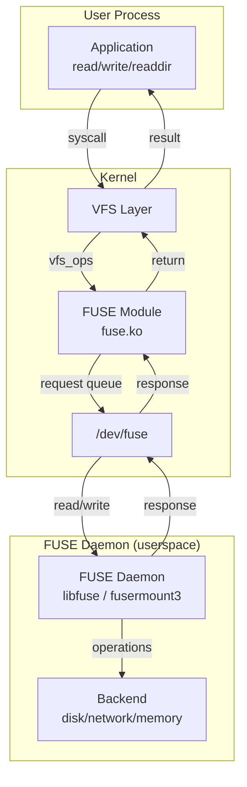
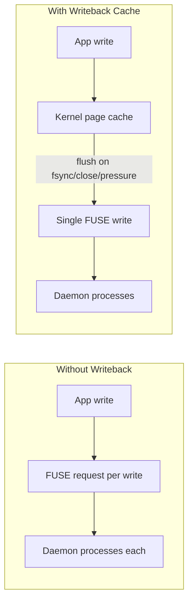

# FUSE — Filesystem in Userspace

## Introduction

FUSE (Filesystem in Userspace) is a Linux kernel interface that allows non-privileged users to create fully functional filesystems without writing kernel code. The kernel module (`fuse.ko`) provides a bridge: it intercepts VFS calls, serializes them into a request format, and delivers them to a userspace daemon via a special device file (`/dev/fuse`). The daemon implements the actual filesystem logic and sends responses back.

Since its inclusion in Linux 2.6.14 (2005), FUSE has enabled an enormous ecosystem of filesystems: SSHFS (remote access), NTFS-3G (Windows compatibility), GlusterFS (distributed storage), AppImage (application packaging), and many more. It is also the foundation for container filesystem mounts that need to cross privilege boundaries.

## Architecture



### Request Flow

1. A user process issues a syscall (e.g., `open("/mnt/fuse/file.txt", O_RDONLY)`)
2. VFS routes the call to the FUSE module (since `/mnt/fuse` is a FUSE mount)
3. FUSE creates a request object with a unique ID and enqueues it
4. The FUSE daemon, blocked on `read(/dev/fuse)`, receives the request
5. The daemon processes it (e.g., reads from a remote server, checks permissions)
6. The daemon writes the response back to `/dev/fuse`
7. The FUSE module completes the original VFS operation and returns to the caller

## Mounting a FUSE Filesystem

### fusermount / fusermount3

FUSE filesystems are mounted using the `fusermount3` (or legacy `fusermount`) setuid helper:

```bash
# The FUSE daemon calls fusermount internally via libfuse
# Direct mount with fusermount:
fusermount3 -o rw,nodev,nosuid /mnt/mountpoint

# Most users just run the filesystem daemon directly:
sshfs user@remote:/path /mnt/remote
ntfs-3g /dev/sdb1 /mnt/windows
```

### Mount Options

| Option | Description |
|--------|-------------|
| `fd=N` | File descriptor for `/dev/fuse` (used internally) |
| `rootmode=<mode>` | Permissions of the root inode |
| `user_id=<uid>` | UID of the mounting user |
| `group_id=<gid>` | GID of the mounting user |
| `default_permissions` | Kernel checks permissions (not just daemon) |
| `allow_other` | Allow users other than the mounter to access |
| `allow_root` | Allow root to access (implies allow_other on some systems) |
| `max_read=<bytes>` | Maximum read buffer size |
| `max_write=<bytes>` | Maximum write buffer size |
| `max_readahead=<bytes>` | Maximum readahead size |
| `direct_io` | Bypass the page cache |
| `kernel_cache` | Cache file data in the kernel (dangerous if files change) |
| `auto_unmount` | Automatically unmount when daemon exits |
| `no_allow_other` | Disallow other users (requires `/etc/fuse.conf` option) |

```bash
# /etc/fuse.conf — required for allow_other
user_allow_other

# Example: SSHFS with options
sshfs user@host:/data /mnt/data \
    -o allow_other,default_permissions,max_read=131072,reconnect
```

## libfuse — The FUSE Library

The primary API for writing FUSE daemons is **libfuse** (now version 3.x). It provides two APIs:

### High-Level API (fuse_main)

Simple path-based callbacks:

```c
#define FUSE_USE_VERSION 31
#include <fuse3/fuse.h>
#include <string.h>
#include <errno.h>
#include <stdio.h>

static int hello_getattr(const char *path, struct stat *stbuf,
                         struct fuse_file_info *fi) {
    memset(stbuf, 0, sizeof(struct stat));
    if (strcmp(path, "/") == 0) {
        stbuf->st_mode = S_IFDIR | 0755;
        stbuf->st_nlink = 2;
    } else if (strcmp(path, "/hello") == 0) {
        stbuf->st_mode = S_IFREG | 0444;
        stbuf->st_nlink = 1;
        stbuf->st_size = 13;
    } else {
        return -ENOENT;
    }
    return 0;
}

static int hello_read(const char *path, char *buf, size_t size,
                      off_t offset, struct fuse_file_info *fi) {
    if (strcmp(path, "/hello") != 0)
        return -ENOENT;

    const char *msg = "Hello FUSE!\n";
    size_t len = strlen(msg);
    if (offset >= len) return 0;
    if (offset + size > len) size = len - offset;
    memcpy(buf, msg + offset, size);
    return size;
}

static int hello_readdir(const char *path, void *buf,
                         fuse_fill_dir_t filler, off_t offset,
                         struct fuse_file_info *fi,
                         enum fuse_readdir_flags flags) {
    if (strcmp(path, "/") != 0) return -ENOENT;
    filler(buf, ".", NULL, 0, 0);
    filler(buf, "..", NULL, 0, 0);
    filler(buf, "hello", NULL, 0, 0);
    return 0;
}

static const struct fuse_operations hello_ops = {
    .getattr = hello_getattr,
    .read    = hello_read,
    .readdir = hello_readdir,
};

int main(int argc, char *argv[]) {
    return fuse_main(argc, argv, &hello_ops, NULL);
}
```

Compile and run:

```bash
$ gcc -Wall hello_fuse.c -o hello_fuse $(pkg-config fuse3 --cflags --libs)
$ mkdir /tmp/fuse_test
$ ./hello_fuse /tmp/fuse_test &
$ ls /tmp/fuse_test
hello
$ cat /tmp/fuse_test/hello
Hello FUSE!
$ fusermount3 -u /tmp/fuse_test
```

### Low-Level API (fuse_session)

Inode-based interface for more complex filesystems:

```c
/* Key differences from high-level API:
 * - Operations work on inodes, not paths
 * - Must manage inode lifecycle manually
 * - Better performance for complex filesystems
 * - Used by most production FUSE filesystems
 */
static void fuse_ll_init(void *userdata, struct fuse_conn_info *conn) {
    /* conn->cap_* indicates kernel FUSE capabilities */
    if (conn->cap_writeback_cache)
        conn->want |= FUSE_CAP_WRITEBACK_CACHE;
}

static void fuse_ll_lookup(fuse_req_t req, fuse_ino_t parent,
                           const char *name) {
    struct fuse_entry_param e;
    /* Look up 'name' in 'parent' directory */
    /* Fill in e.ino, e.attr, e.attr_timeout, e.entry_timeout */
    fuse_reply_entry(req, &e);
}
```

## Writeback Cache

FUSE supports **writeback caching** (since Linux 4.15), which significantly improves write performance:



Without writeback cache, every `write()` syscall generates a FUSE request. With it, writes go to the kernel page cache and are batched before being sent to the daemon.

```c
/* Enable writeback cache in the daemon */
static void init(void *userdata, struct fuse_conn_info *conn) {
    conn->want |= FUSE_CAP_WRITEBACK_CACHE;
}
```

**Trade-offs**: Writeback cache improves performance but means the daemon may not see writes immediately. Errors during flush are reported to the `fsync()` caller or a subsequent `close()`, not the original `write()` caller.

## FUSE Passthrough (Linux 6.2+)

The **FUSE passthrough** optimization allows the kernel to perform I/O directly on the backing file descriptor, bypassing the FUSE daemon for read/write operations:

```c
/* In the daemon: provide a file descriptor for the backing file */
static int fuse_open(const char *path, struct fuse_file_info *fi) {
    int fd = open(backing_path, fi->flags);
    fi->fh = fd;
    fi->direct_io = 0;
    fi->passthrough = 1;  /* Request passthrough */
    return 0;
}
```

When passthrough is active, `read()` and `write()` go directly from the user process to the backing file via splice — the FUSE daemon only handles `open`, `close`, and metadata operations. This dramatically reduces overhead for I/O-heavy workloads.

```bash
# Check if your kernel supports FUSE passthrough
$ grep FUSE_DEV_PASSTHROUGH /usr/include/linux/fuse.h
#define FUSE_DEV_PASSTHROUGH_CAPABLE (1ULL << 22)
```

## Security Considerations

### Privilege Model

```bash
# /dev/fuse requires either:
# 1. fusermount3 (setuid root) to mount on behalf of the user
# 2. root to mount directly

# fusermount3 is setuid by default
$ ls -la $(which fusermount3)
-rwsr-xr-x 1 root root 32768 ... /usr/bin/fusermount3
```

### allow_other Security

```bash
# Without allow_other: only the mounting user can access the filesystem
# With allow_other: any user can access (including root)
# This requires /etc/fuse.conf:
$ cat /etc/fuse.conf
# Allow non-root users to specify the allow_other option
user_allow_other
```

### Namespace Isolation

FUSE is commonly used in containers and sandboxes:

```bash
# Mount FUSE in a mount namespace
unshare --mount -- /path/to/fuse_daemon /mnt/point

# Flatpak uses FUSE for filesystem portals
# Snap uses FUSE for squashfuse mounts
```

## Common FUSE Filesystems

| Filesystem | Purpose | Package |
|------------|---------|---------|
| **sshfs** | Mount remote directories via SSH | `sshfs` |
| **ntfs-3g** | Read/write NTFS partitions | `ntfs-3g` |
| **squashfuse** | Mount SquashFS images without root | `squashfuse` |
| **goofys** | Mount S3 buckets as filesystem | `goofys` |
| **s3fs** | Mount S3-compatible storage | `s3fs-fuse` |
| **gcsfuse** | Mount Google Cloud Storage | `gcsfuse` |
| **flatpak-portal** | Sandboxed filesystem access for Flatpak | `xdg-desktop-portal` |
| **archivemount** | Mount archive files as filesystems | `archivemount` |

## Performance Tuning

```bash
# Increase max_read for better sequential I/O
sshfs user@host:/data /mnt/data -o max_read=1048576

# Use kernel_cache for static data (DANGEROUS if data changes)
mount -t fuse.sshfs user@host:/static /mnt/static -o kernel_cache

# Direct I/O bypasses page cache (useful for large sequential files)
mount -t fuse.myfs /dev/sdb /mnt/fs -o direct_io

# Adjust max_background and congestion_threshold via sysctl
$ sysctl fs.fuse
fs.fuse.max_background = 12
fs.fuse.congestion_threshold = 9
```

## Implementation Details

### Key Source Files

- **`fs/fuse/dev.c`** — `/dev/fuse` device, request/reply handling
- **`fs/fuse/dir.c`** — Directory operations
- **`fs/fuse/file.c`** — File operations (read, write, mmap)
- **`fs/fuse/inode.c`** — Superblock/inode management
- **`include/uapi/linux/fuse.h`** — Kernel-userspace protocol definition

### FUSE Protocol

The kernel and daemon communicate via a binary protocol over `/dev/fuse`:

```c
/* Request header */
struct fuse_in_header {
    uint32_t len;      /* Total length including data */
    uint32_t opcode;   /* FUSE_OPEN, FUSE_READ, etc. */
    uint64_t unique;   /* Request ID */
    uint64_t nodeid;   /* Inode number */
    uint32_t uid;
    uint32_t gid;
    uint32_t pid;
    /* ... padding ... */
};

/* Response header */
struct fuse_out_header {
    uint32_t len;      /* Total length */
    int32_t  error;    /* 0 = success, negative errno */
    uint64_t unique;   /* Matches request ID */
};
```

## References

- [FUSE kernel documentation](https://www.kernel.org/doc/html/latest/filesystems/fuse.html)
- [libfuse source code](https://github.com/libfuse/libfuse)
- [FUSE protocol header](https://github.com/torvalds/linux/blob/master/include/uapi/linux/fuse.h)

## Further Reading

- [The Linux Kernel Documentation](https://docs.kernel.org/)
- [GNU Project Documentation](https://www.gnu.org/doc/doc.html)
- [GNU Manuals](https://www.gnu.org/manual/manual.html)
- [Free Software Directory](https://directory.fsf.org/wiki/Main_Page)
- [Planet GNU](https://planet.gnu.org/)
- [Free Software Books](https://www.gnu.org/doc/other-free-books.html)

- https://www.kernel.org/doc/html/latest/filesystems/fuse.html
- https://man7.org/linux/man-pages/man4/fuse.4.html
- https://man7.org/linux/man-pages/man8/fusermount3.8.html
- https://github.com/libfuse/libfuse/wiki
- https://lwn.net/Articles/787223/ — "FUSE passthrough"

## Related Topics

- [file-ops](./file-ops.md) — How FUSE implements VFS file operations
- [mounting](./mounting.md) — How FUSE filesystems are mounted
- [superblock](./superblock.md) — FUSE superblock management
- [tmpfs](./tmpfs.md) — Another in-memory filesystem (kernel-native vs FUSE userspace)
