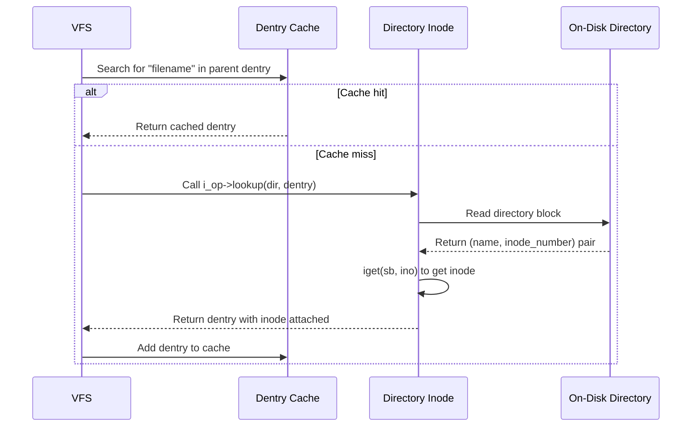
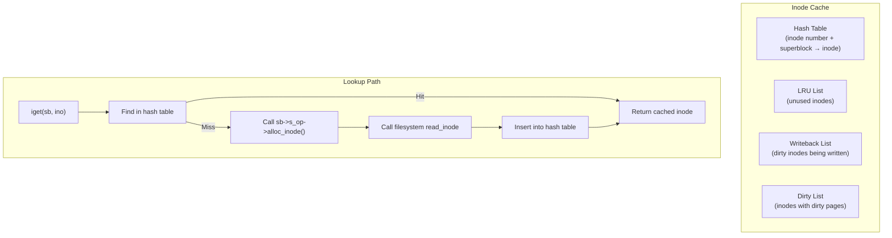
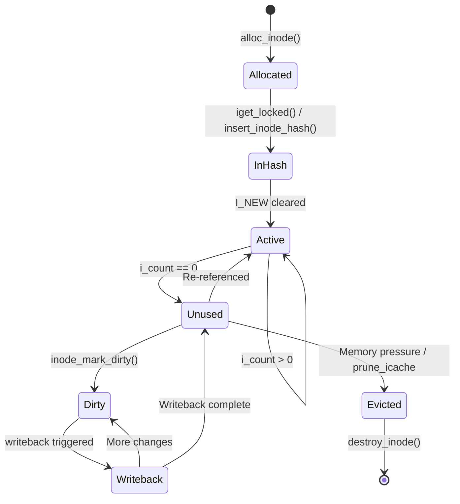

# Inode

## Introduction

The inode is the fundamental data structure representing a filesystem object in Linux. Every file,
directory, symbolic link, named pipe, socket, and device node has an inode. The inode stores all
metadata about the object — permissions, ownership, timestamps, size, block pointers — everything
*except* the filename. Filenames are stored in directory entries (dentries), which map names to
inodes (see [Dentry](./dentry.md)).

The term "inode" comes from "index node," reflecting its origin in the Unix filesystem design where
inodes were stored in an indexed table on disk. In modern Linux, the concept is preserved even though
on-disk formats vary wildly between filesystems (ext4, XFS, Btrfs, etc.). The VFS `struct inode`
is the kernel's in-memory representation; each filesystem maintains its own on-disk format and a
mapping between the two.

## The VFS Inode Structure

### Core Fields

```c
struct inode {
    umode_t             i_mode;         /* File type + permissions (rwxrwxrwx) */
    unsigned short      i_opflags;
    kuid_t              i_uid;          /* Owner user ID */
    kgid_t              i_gid;          /* Owner group ID */
    unsigned int        i_flags;        /* Mount flags (e.g., immutable, append-only) */

    const struct inode_operations *i_op; /* Operations table */
    struct super_block  *i_sb;          /* Back-pointer to superblock */
    struct address_space *i_mapping;    /* Page cache mapping (usually &i_data) */
    unsigned long       i_ino;          /* Inode number */

    /* File type determines which union member is active */
    union {
        const unsigned int i_nlink;     /* Hard link count */
        unsigned int __i_nlink;
    };

    dev_t               i_rdev;         /* Device number (for device nodes) */
    loff_t              i_size;         /* File size in bytes */
    struct timespec64   __i_atime;      /* Last access time */
    struct timespec64   __i_mtime;      /* Last modification time */
    struct timespec64   __i_ctime;      /* Last status change time */
    spinlock_t          i_lock;
    unsigned short      i_bytes;        /* Bytes consumed in last block */
    u8                  i_blkbits;      /* Block size = 2^i_blkbits */
    u8                  i_write_hint;
    blkcnt_t            i_blocks;       /* Number of 512-byte blocks */

    union {
        const struct file_operations *i_fops;  /* Regular file ops */
        void (*free_inode)(struct inode *);    /* For special inodes */
    };

    struct address_space i_data;        /* Embedded page cache */
    struct list_head    i_devices;      /* Backing device list */
    union {
        struct pipe_inode_info *i_pipe; /* If FIFO */
        struct cdev *i_cdev;            /* If char device */
        char *i_link;                   /* If symlink */
        unsigned i_dir_seq;             /* Directory sequencing */
    };

    __u32               i_generation;   /* NFS file handle generation */

    void                *i_private;     /* Filesystem-specific data */
    /* ... refcount, state bits, rwsem, etc. ... */
};
```

### File Type Encoding

The file type is encoded in the upper bits of `i_mode`:

| Mode bits | File type | Macro |
|-----------|----------|-------|
| `0100000` | Regular file | `S_ISREG()` |
| `0040000` | Directory | `S_ISDIR()` |
| `0120000` | Symbolic link | `S_ISLNK()` |
| `0010000` | FIFO (named pipe) | `S_ISFIFO()` |
| `0060000` | Block device | `S_ISBLK()` |
| `0020000` | Character device | `S_ISCHR()` |
| `0140000` | Socket | `S_ISSOCK()` |

```bash
# Example: viewing inode metadata
$ stat /etc/passwd
  File: /etc/passwd
  Size: 2847       Blocks: 8          IO Block: 4096   regular file
Device: 802h/2050d Inode: 2621441     Links: 1
Access: (0644/-rw-r--r--)  Uid: (    0/    root)   Gid: (    0/    root)
Access: 2025-01-15 10:30:00.000000000 +0800
Modify: 2025-01-10 14:22:33.000000000 +0800
Change: 2025-01-10 14:22:33.000000000 +0800
 Birth: 2025-01-10 14:22:33.000000000 +0800
```

## Inode Operations

The `inode_operations` structure defines namespace operations — operations that create, remove, or
look up names in the directory tree:

```c
struct inode_operations {
    /* Directory operations */
    struct dentry *(*lookup)(struct inode *dir, struct dentry *dentry,
                             unsigned int flags);
    int (*create)(struct mnt_idmap *, struct inode *dir, struct dentry *dentry,
                  umode_t mode, bool excl);
    int (*link)(struct dentry *old_dentry, struct inode *dir,
                struct dentry *new_dentry);
    int (*unlink)(struct inode *dir, struct dentry *dentry);
    int (*symlink)(struct mnt_idmap *, struct inode *dir, struct dentry *dentry,
                   const char *symname);
    int (*mkdir)(struct mnt_idmap *, struct inode *dir, struct dentry *dentry,
                 umode_t mode);
    int (*rmdir)(struct inode *dir, struct dentry *dentry);
    int (*mknod)(struct mnt_idmap *, struct inode *dir, struct dentry *dentry,
                 umode_t mode, dev_t rdev);
    int (*rename)(struct mnt_idmap *, struct inode *old_dir,
                  struct dentry *old_dentry, struct inode *new_dir,
                  struct dentry *new_dentry, unsigned int flags);

    /* Attribute operations */
    int (*setattr)(struct mnt_idmap *, struct dentry *, struct iattr *);
    int (*getattr)(struct mnt_idmap *, const struct path *, struct kstat *,
                   u32 request_mask, unsigned int query_flags);
    ssize_t (*listxattr)(struct dentry *, char *list, size_t size);

    /* Permission checking */
    int (*permission)(struct mnt_idmap *, struct inode *, int);

    /* Extended attributes */
    int (*setxattr)(struct dentry *, const char *, const void *, size_t, int);
    ssize_t (*getxattr)(struct dentry *, const char *, void *, size_t);
    ssize_t (*removexattr)(struct dentry *, const char *);

    /* Special operations */
    int (*fiemap)(struct inode *, struct fiemap_extent_info *, u64, u64);
    int (*update_time)(struct inode *, struct timespec64 *, int);
    int (*atomic_open)(struct inode *, struct dentry *, struct file *,
                       unsigned int, umode_t);
    int (*tmpfile)(struct mnt_idmap *, struct inode *, struct dentry *,
                   umode_t);
    int (*set_acl)(struct mnt_idmap *, struct inode *, struct posix_acl *, int);
    int (*fileattr_set)(struct mnt_idmap *, struct dentry *, struct fileattr *);
    int (*fileattr_get)(struct dentry *, struct fileattr *);
    /* ... */
};
```

### The Lookup Operation

The `lookup` method is the most critical for directory inodes. When the VFS needs to resolve a
pathname component, it calls the parent directory's `lookup`:



### The Permission Operation

```c
/* Example: ext4_permission() */
static int ext4_permission(struct mnt_idmap *idmap,
                           struct inode *inode, int mask)
{
    /* First check ACLs if enabled */
    if (IS_POSIXACL(inode)) {
        int ret = posix_acl_permission(idmap, inode, mask);
        if (ret != -EACCES)
            return ret;
    }
    /* Fall back to traditional Unix permission check */
    return generic_permission(idmap, inode, mask);
}
```

## On-Disk Inode: ext4 Example

The VFS `struct inode` is an in-memory structure. On disk, ext4 uses a different format:

```c
/* ext4 on-disk inode (128 bytes base, up to 1024 with extended fields) */
struct ext4_inode {
    __le16  i_mode;         /* File mode */
    __le16  i_uid;          /* Low 16 bits of Owner Uid */
    __le32  i_size_lo;      /* Size in bytes (lower 32 bits) */
    __le32  i_atime;        /* Access time */
    __le32  i_ctime;        /* Inode change time */
    __le32  i_mtime;        /* Modification time */
    __le32  i_dtime;        /* Deletion time */
    __le16  i_gid;          /* Low 16 bits of Group Id */
    __le16  i_links_count;  /* Links count */
    __le32  i_blocks_lo;    /* Blocks count (512-byte units, lower) */
    __le32  i_flags;        /* File flags */
    union {
        struct { __le32 l_i_version; } linux1;
        /* OS-specific fields */
    } osd1;
    __le32  i_block[15];    /* Pointers to data blocks (see ext4.md) */
    __le32  i_generation;   /* File version (for NFS) */
    __le32  i_file_acl_lo;  /* File ACL (lower 32 bits) */
    __le32  i_size_high;    /* Size in bytes (upper 32 bits) */
    /* Extended fields (beyond 128 bytes): */
    __le32  i_obso_faddr;   /* Obsoleted fragment address */
    __le16  i_blocks_high;  /* Blocks count (upper 16 bits) */
    __le16  i_file_acl_high;
    __le16  i_uid_high;     /* Owner UID (upper 16 bits) */
    __le16  i_gid_high;     /* Owner GID (upper 16 bits) */
    __le32  i_extra_isize;  /* Size of extended inode */
    /* Extended attributes, inline data, etc. follow */
};
```

The mapping between on-disk and in-memory inodes happens during `iget`/`read_inode`:

```c
/* Simplified ext4 inode read */
static struct inode *ext4_iget(struct super_block *sb, unsigned long ino)
{
    struct inode *inode;
    struct ext4_inode *raw_inode;
    struct ext4_inode_info *ei;

    inode = iget_locked(sb, ino);  /* Get or create VFS inode */
    if (!(inode->i_state & I_NEW))
        return inode;  /* Already in cache */

    /* Read on-disk inode */
    raw_inode = ext4_get_inode_loc(inode, &iloc);
    memcpy(ei->i_data, raw_inode->i_block, sizeof(ei->i_data));

    /* Map on-disk fields to VFS inode */
    inode->i_mode = le16_to_cpu(raw_inode->i_mode);
    inode->i_uid = make_kuid(&init_user_ns, le16_to_cpu(raw_inode->i_uid));
    inode->i_size = ext4_isize(raw_inode);
    inode->i_atime = inode_set_atime(inode, (s64)le32_to_cpu(raw_inode->i_atime));
    /* ... copy all fields ... */

    /* Set operations tables */
    inode->i_op = &ext4_file_inode_operations;
    inode->i_fop = &ext4_file_operations;
    inode->i_mapping->a_ops = &ext4_aops;

    unlock_new_inode(inode);
    return inode;
}
```

## Inode Number

The inode number is a filesystem-unique identifier. It serves as the primary key for locating the
inode on disk.

### Key Properties

- **Unique within a filesystem**: Two files on different filesystems can have the same inode number.
- **Persistent**: Inode numbers survive reboots (they are stored on disk).
- **Allocated by the filesystem**: Each filesystem has its own inode allocation strategy.
- **Limited by filesystem size**: ext4 uses 32-bit inode numbers by default (max ~4 billion inodes).

### Finding Inodes by Number

```bash
# Find which file owns inode number 2621441
$ find / -inum 2621441 2>/dev/null
/etc/passwd

# Find hard links to a file (same inode number)
$ ls -i /etc/passwd
2621441 /etc/passwd

$ find / -samefile /etc/passwd 2>/dev/null
/etc/passwd
```

### Special Inode Numbers

| Inode | Purpose |
|-------|---------|
| 2 | Root directory (`/`) of the filesystem |
| 3-10 | Reserved (ext4 uses 3-7 for special purposes) |
| 8 | ext4: journal inode |
| 11 | ext4: first non-reserved inode (lost+found) |

```bash
# The root inode of a filesystem is always 2
$ ls -id /
2 /
$ ls -id /boot
2 /boot  # Different filesystem, also inode 2
```

## Inode Cache (icache)

The inode cache is one of the most important kernel caches. It keeps recently accessed inodes in
memory to avoid expensive disk reads.

### Architecture



### The `iget` Family

The kernel provides several functions for obtaining inodes:

```c
/* Primary inode lookup — returns cached or new inode */
struct inode *iget(struct super_block *sb, unsigned long ino);

/* More controlled version — calls super_operations->alloc_inode */
struct inode *iget_locked(struct super_block *sb, unsigned long ino);
/* Returns with I_NEW set if newly allocated; caller must unlock_new_inode() */

/* Ignores rcu path walking, always waits */
struct inode *iget5_locked(struct super_block *sb, unsigned long ino,
    int (*test)(struct inode *, void *),
    int (*set)(struct inode *, void *),
    void *data);

/* For filesystems that don't use traditional inode numbers */
struct inode *new_inode(struct super_block *sb);
```

### Inode Lifecycle



### Writeback and Dirty Inode Tracking

When an inode's metadata changes (timestamps, size, permissions), it is marked dirty. The kernel
maintains two lists:

1. **`s_dirty` list (per-superblock)**: Inodes whose metadata needs to be written to disk.
2. **`b_dirty` list (per-bdi)**: Inodes whose pages need to be written.

```c
/* Marking an inode dirty */
void __mark_inode_dirty(struct inode *inode, int flags)
{
    struct super_block *sb = inode->i_sb;

    if (flags & I_DIRTY_INODE) {
        /* Metadata dirty — call filesystem's dirty_inode callback */
        if (sb->s_op->dirty_inode)
            sb->s_op->dirty_inode(inode, flags);
    }

    /* Add to appropriate dirty lists */
    if (!(inode->i_state & I_DIRTY)) {
        inode->i_state |= I_DIRTY;
        list_add(&inode->i_sb_list, &sb->s_inodes_wb);
    }
}
```

### Shrinking the Inode Cache

Under memory pressure, the kernel shrinks the inode cache via `prune_icache()`:

```c
/* Simplified inode pruning */
static void prune_icache_sb(struct super_block *sb, struct shrink_control *sc)
{
    LIST_HEAD(dispose);

    /* Walk the LRU list of unused inodes */
    spin_lock(&sb->s_inode_lru_lock);
    while (!list_empty(&sb->s_inodes_lru)) {
        inode = list_first_entry(&sb->s_inodes_lru, struct inode, i_lru);
        if (inode->i_state & (I_NEW | I_DIRTY | I_SYNC | I_FREEING))
            continue;
        if (!atomic_read(&inode->i_count)) {
            list_move(&inode->i_lru, &dispose);
            inode->i_state |= I_FREEING;
        }
    }
    spin_unlock(&sb->s_inode_lru_lock);

    /* Actually dispose of the inodes */
    while (!list_empty(&dispose)) {
        inode = list_first_entry(&dispose, struct inode, i_lru);
        list_del_init(&inode->i_lru);
        evict(inode);
    }
}
```

### Observing the Inode Cache

```bash
# View inode cache statistics
$ cat /proc/sys/fs/inode-nr
24832    134    # 24832 inodes in cache, 134 free

$ cat /proc/sys/fs/inode-state
24832   134     0       0       0       0       0

# These fields are:
# nr_inodes, nr_free_inodes, preshrink, dummy...

# Force inode cache shrink (drop caches)
$ echo 2 > /proc/sys/vm/drop_caches  # Frees dentries and inodes

# Monitor inode cache size via slabinfo
$ sudo slabtop -s c | grep -E 'inode|ext4_inode'
  ext4_inode_cache   23456  24576    1088   30    30 : tunables ...
  inode_cache        12345  13000     640   50    25 : tunables ...
```

## Inode Flags (chattr/lsattr)

Linux supports per-inode flags that extend traditional Unix permissions:

| Flag | `chattr` | Meaning |
|------|----------|---------|
| `FS_APPEND_FL` | `+a` | Append-only (can only open for writing at end) |
| `FS_IMMUTABLE_FL` | `+i` | Immutable — cannot modify, delete, or rename |
| `FS_NOATIME_FL` | `+A` | Do not update access time |
| `FS_DIRSYNC_FL` | `+D` | Synchronous directory updates |
| `FS_SYNC_FL` | `+S` | Synchronous data writes |
| `FS_NODUMP_FL` | `+d` | Exclude from dump backups |
| `FS_COMPR_FL` | `+c` | Enable filesystem compression |
| `FS_NOCOW_FL` | `+C` | Disable copy-on-write (Btrfs) |

```bash
# Make a file immutable
$ sudo chattr +i /etc/resolv.conf
$ rm /etc/resolv.conf
rm: cannot remove '/etc/resolv.conf': Operation not permitted

# View flags
$ lsattr /etc/resolv.conf
----i---------e---- /etc/resolv.conf

# The 'e' flag means "extents" (ext4-specific, cannot be cleared)
```

## Special Inode Types

### Device Inodes

Device inodes don't store data in the traditional sense. Instead, their `i_rdev` field identifies
the device:

```bash
# Character and block devices
$ ls -la /dev/sda /dev/tty
brw-rw---- 1 root disk 8, 0 Jan 15 10:00 /dev/sda
crw-rw-rw- 1 root tty  5, 0 Jan 15 10:00 /dev/tty

# Major number 8 = SCSI/sd driver
# Minor number 0 = first disk (sda)
```

### Symlink Inodes

Short symlinks store the target path directly in `i_link` (or `i_data` on disk), avoiding an
extra data block allocation:

```c
/* ext4 inline symlink handling */
if (ext4_inode_is_fast_symlink(inode)) {
    /* Target stored in i_block[] (up to 60 bytes) */
    nd_set_link(nd, (char *)ei->i_data);
}
```

### Directory Inodes

Directories are special files whose data contains name-to-inode mappings. The VFS treats them
specially through `i_op->lookup`, `i_op->create`, etc.

## Practical Examples

### Creating and Examining Inodes

```bash
# Create files and observe inode allocation
$ touch /tmp/a /tmp/b /tmp/c
$ ls -i /tmp/a /tmp/b /tmp/c
263796 /tmp/a
263797 /tmp/b
263798 /tmp/c

# Hard links share the same inode
$ ln /tmp/a /tmp/a_link
$ ls -i /tmp/a /tmp/a_link
263796 /tmp/a
263796 /tmp/a_link

# Symbolic links get their own inode
$ ln -s /tmp/a /tmp/a_symlink
$ ls -i /tmp/a /tmp/a_symlink
263796 /tmp/a
263801 /tmp/a_symlink
```

### Inode Exhaustion

A filesystem can run out of inodes before running out of space:

```bash
# Check inode usage
$ df -i /dev/sda1
Filesystem      Inodes   IUsed   IFree IUse% Mounted on
/dev/sda1      2621440  2480000 141440   95% /

# This is common with many small files (e.g., mail servers)
# Creating millions of tiny files can exhaust inodes while disk space remains

# Format with more inodes (ext4)
$ mkfs.ext4 -i 1024 /dev/sdb1  # One inode per 1024 bytes (default: 16384)
```

### Debugfs: Inspecting On-Disk Inodes

```bash
# Inspect an ext4 inode directly
$ sudo debugfs -R 'stat <2621441>' /dev/sda1
Inode: 2621441   Type: regular    Mode:  0644   Flags: 0x80000
Generation: 1234567    Version: 0x00000000
User:     0   Group:     0   Size: 2847
File ACL: 0    Directory ACL: 0
Links: 1   Blockcount: 8
Fragment:  Address: 0    Number: 0    Size: 0
ctime: 0x65a0c8a1 -- Thu Jan 10 14:22:33 2025
atime: 0x65a7e218 -- Wed Jan 15 10:30:00 2025
mtime: 0x65a0c8a1 -- Thu Jan 10 14:22:33 2025
Size of extra inode fields: 32
EXTENTS:
(0):1048576
```

## Performance Considerations

### Inode Locking

Inodes use a read-write semaphore (`i_rwsem`) for data integrity:

```c
/* Typical pattern for inode modification */
inode_lock(inode);
/* ... modify inode data ... */
inode_unlock(inode);

/* For read-only access that can tolerate concurrent modifications */
down_read(&inode->i_rwsem);
/* ... read inode data ... */
up_read(&inode->i_rwsem);
```

### RCU and Inode Access

Modern kernel uses RCU for lock-free inode lookup:

```c
/* RCU-safe inode access */
rcu_read_lock();
inode = READ_ONCE(dentry->d_inode);
if (inode) {
    /* Access inode fields safely */
    ino = inode->i_ino;
}
rcu_read_unlock();
```

### Large Directory Performance

Directories with many entries stress the inode cache because each lookup may require reading
the directory inode's data blocks. Filesystems like XFS use B+ trees for directories, while
ext4 uses hash trees (htree), both of which scale much better than linear directory scanning.

## Further Reading

- [Linux kernel: include/linux/fs.h — struct inode](https://elixir.bootlin.com/linux/latest/source/include/linux/fs.h) — Inode definition
- [Linux kernel: fs/inode.c](https://elixir.bootlin.com/linux/latest/source/fs/inode.c) — Inode cache implementation
- [The Linux Programming Interface, Ch. 15](https://man7.org/tlpi/) — File attributes and inodes
- [ext4 wiki: Inode structure](https://ext4.wiki.kernel.org/index.php/Ext4_Disk_Layout#Inode_Table) — ext4 on-disk inode format
- [LWN: The inode cache](https://lwn.net/Articles/244036/) — Inode caching internals

## Related Topics

- [VFS](./vfs.md) — The virtual filesystem layer that defines `struct inode`
- [Dentry](./dentry.md) — Name-to-inode mappings and the dentry cache
- [ext4](./ext4.md) — Ext4 on-disk inode format and extent tree
- [Journaling](./journaling.md) — How inode metadata changes are journaled
- [procfs](./procfs.md) — Dynamic inodes in `/proc`
- [sysfs](./sysfs.md) — Dynamic inodes in `/sys`
