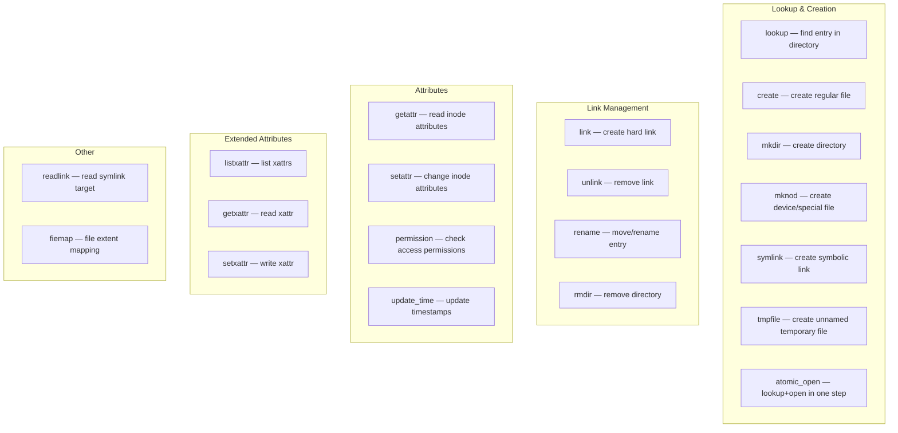
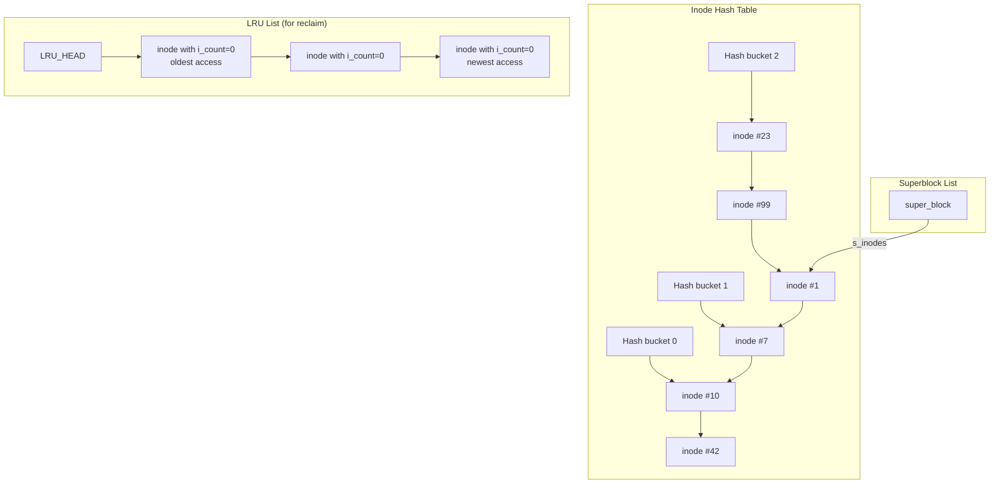
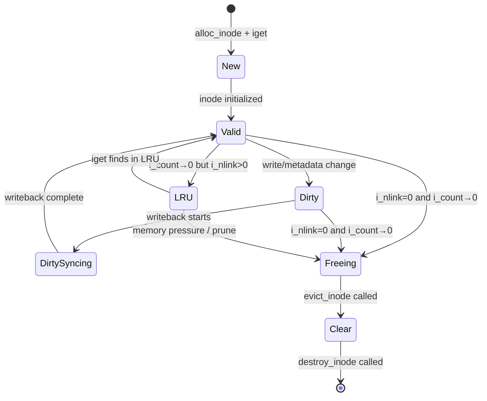
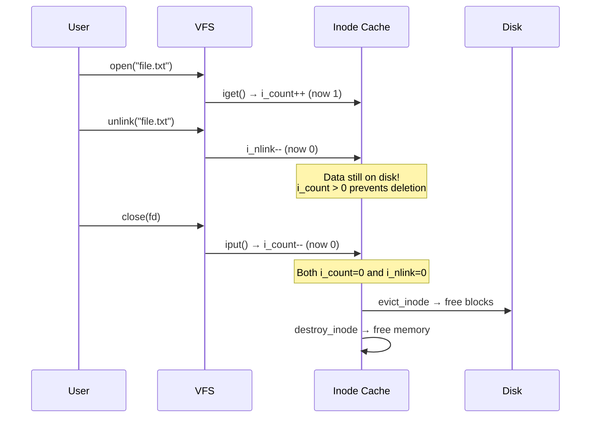
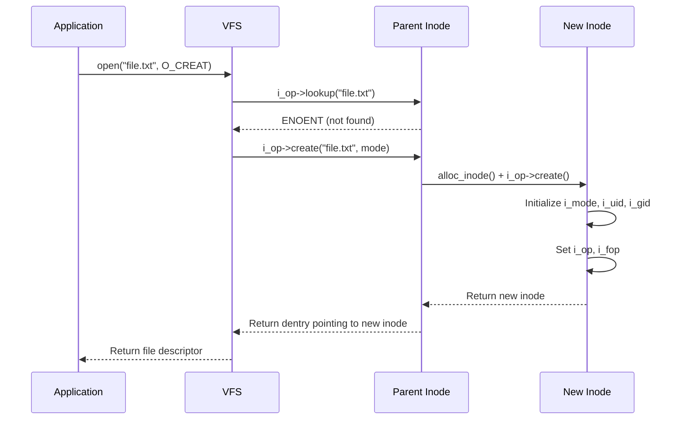

# Inode Internals

## Introduction

The inode (index node) is the fundamental metadata structure in Unix/Linux filesystems. Every file, directory, symlink, and special file has an inode that stores its attributes (permissions, ownership, timestamps, size) and the location of its data blocks. The VFS `struct inode` is the kernel's in-memory representation, unified across all filesystem types.

Inodes do not store filenames — that's the job of directory entries (dentries). This separation allows hard links: multiple directory entries can point to the same inode, with `i_nlink` tracking the reference count.

## The `struct inode`

### Definition

```c
/* Simplified from include/linux/fs.h */
struct inode {
    umode_t             i_mode;         /* File type and permissions */
    unsigned short      i_opflags;
    kuid_t              i_uid;          /* Owner UID */
    kgid_t              i_gid;          /* Owner GID */
    unsigned int        i_flags;        /* Filesystem flags (S_APPEND, etc.) */

    const struct inode_operations *i_op;    /* Inode operations */
    struct super_block  *i_sb;              /* Owning superblock */
    struct address_space *i_mapping;        /* Page cache mapping */
    unsigned long       i_ino;              /* Inode number */

    /* File type determines union contents */
    union {
        const unsigned int i_nlink;         /* Hard link count */
        unsigned int __i_nlink;
    };

    dev_t               i_rdev;         /* Device number (if block/char device) */
    loff_t              i_size;         /* File size in bytes */
    struct timespec64   __i_atime;      /* Access time */
    struct timespec64   __i_mtime;      /* Modification time */
    struct timespec64   __i_ctime;      /* Change time (metadata) */
    struct timespec64   __i_btime;      /* Birth/creation time (if supported) */

    spinlock_t          i_lock;         /* Protects i_blocks, i_bytes */
    unsigned short      i_bytes;        /* Bytes consumed in last block */
    u8                  i_blkbits;      /* Block size = 1 << i_blkbits */
    blkcnt_t            i_blocks;       /* Number of 512-byte blocks */

    unsigned long       i_state;        /* I_DIRTY, I_NEW, I_FREEING, etc. */
    rwlock_t            i_lock;         /* Lock for state changes */

    struct hlist_node   i_hash;         /* Hash list for inode cache lookup */
    struct list_head    i_io_list;      /* Backing dev io list */
    struct list_head    i_lru;          /* LRU list for inode reclaim */
    atomic_t            i_count;        /* Reference count */

    const struct file_operations *i_fop;    /* Default file operations */
    struct address_space i_data;            /* Embedded address_space */
    struct list_head    i_devices;          /* Union: device inodes list */
    union {
        struct pipe_inode_info *i_pipe;     /* Pipe */
        struct cdev *i_cdev;                /* Character device */
        char *i_link;                       /* Symlink target */
        unsigned i_dir_seq;                 /* Directory sequencing */
    };
    void *i_private;                        /* Filesystem-private data */
};
```

### Key Fields Explained

| Field | Purpose |
|-------|---------|
| `i_mode` | File type (regular, directory, symlink, etc.) and permissions (rwx) |
| `i_uid` / `i_gid` | Owner user and group |
| `i_ino` | Inode number — unique within the filesystem |
| `i_nlink` | Number of hard links pointing to this inode |
| `i_size` | File size in bytes |
| `i_blocks` | Disk blocks consumed (in 512-byte units) |
| `i_sb` | Back-pointer to the owning superblock |
| `i_op` | Inode operations (lookup, create, link, mkdir, etc.) |
| `i_fop` | Default file operations for files opened from this inode |
| `i_mapping` | Address space for the page cache — where file data is cached |
| `i_count` | Reference count — when it reaches zero, inode can be reclaimed |
| `i_state` | Lifecycle state flags (I_DIRTY, I_NEW, I_FREEING, I_WILL_FREE) |
| `i_private` | Opaque pointer for filesystem-specific data |

## `inode_operations`

The `inode_operations` interface defines operations on inodes themselves (not on open files):

```c
struct inode_operations {
    struct dentry *(*lookup)(struct inode *, struct dentry *, unsigned int);
    int (*create)(struct mnt_idmap *, struct inode *, struct dentry *,
                  umode_t, bool);
    int (*link)(struct dentry *, struct inode *, struct dentry *);
    int (*unlink)(struct inode *, struct dentry *);
    int (*symlink)(struct mnt_idmap *, struct inode *, struct dentry *,
                   const char *);
    int (*mkdir)(struct mnt_idmap *, struct inode *, struct dentry *, umode_t);
    int (*rmdir)(struct inode *, struct dentry *);
    int (*mknod)(struct mnt_idmap *, struct inode *, struct dentry *,
                 umode_t, dev_t);
    int (*rename)(struct mnt_idmap *, struct inode *, struct dentry *,
                  struct inode *, struct dentry *, unsigned int);
    int (*readlink)(struct dentry *, char __user *, int);
    int (*permission)(struct mnt_idmap *, struct inode *, int);
    int (*getattr)(struct mnt_idmap *, const struct path *,
                   struct kstat *, u32, unsigned int);
    int (*setattr)(struct mnt_idmap *, struct dentry *, struct iattr *);
    ssize_t (*listxattr)(struct dentry *, char *, size_t);
    int (*fiemap)(struct inode *, struct fiemap_extent_info *, u64, u64);
    int (*update_time)(struct inode *, struct timespec64 *, int);
    int (*atomic_open)(struct inode *, struct dentry *, struct file *,
                       unsigned int, umode_t);
    int (*tmpfile)(struct mnt_idmap *, struct inode *, struct file *,
                   umode_t);
    /* ... */
};
```

### Operation Categories



## Inode Cache (icache)

The kernel maintains a hash table of inodes in memory for fast lookup by (superblock, inode_number):



### Inode Lookup

When VFS needs an inode (e.g., for `open()` or `stat()`):

1. **Check dentry cache** — If the dentry is cached, its inode pointer is already available
2. **Hash lookup** — Search `inode_hashtable` using hash of `(sb, ino)`
3. **Hit**: Increment `i_count`, return cached inode
4. **Miss**: Call `sb->s_op->alloc_inode()` to create a new inode, call `fs->read_inode()` to populate it from disk, add to hash table

```c
/* Kernel internal: find inode by number */
struct inode *iget(struct super_block *sb, unsigned long ino) {
    struct inode *inode;

    /* Search hash table */
    inode = find_inode(sb, ino);
    if (inode) {
        /* Found in cache — wait if still being read */
        wait_on_inode(inode);
        return inode;
    }

    /* Not found — allocate and read from disk */
    inode = alloc_inode(sb);
    inode->i_ino = ino;
    inode->i_sb = sb;
    read_inode(inode);  /* FS-specific: reads from disk */
    insert_inode_hash(inode);
    return inode;
}
```

## Inode Lifecycle

### States

| State | Flag | Meaning |
|-------|------|---------|
| New | `I_NEW` | Being initialized, not yet visible to lookups |
| Valid | (none) | Fully initialized, active in the hash table |
| Dirty | `I_DIRTY` | Modified, needs writeback |
| Dirty syncing | `I_DIRTY_SYNC` | Metadata changed |
| Dirty datasync | `I_DIRTY_DATASYNC` | Data changed |
| Freeing | `I_FREEING` | Being freed, references being drained |
| Will free | `I_WILL_FREE` | Scheduled for freeing (RCU) |
| Clear | `I_CLEAR` | Inode data cleared |
| Referenced | `I_REFERENCED` | Recently accessed (LRU hint) |

### Lifecycle Diagram



## i_count vs i_nlink

These two reference counts serve different purposes:

### i_count — In-Memory Reference Count

- Tracks how many **kernel pointers** reference this inode
- Increments: `iget()`, `igrab()`, open file descriptor, active dentry
- Decrements: `iput()`, close, dentry eviction
- When `i_count` reaches 0: inode moves to the LRU list but remains in the hash table
- Can be regenerated from disk if needed (since data still exists)

### i_nlink — On-Disk Link Count

- Tracks how many **directory entries** (hard links) point to this inode
- Stored on disk, persisted across reboots
- Decrements: `unlink()`, `rmdir()`
- When `i_nlink` reaches 0 **and** `i_count` reaches 0: inode is truly deleted, blocks freed

```bash
# Demonstrate i_count vs i_nlink
$ touch /tmp/testfile
$ stat /tmp/testfile
  File: /tmp/testfile
  Size: 0           Blocks: 0          IO Block: 4096   regular empty file
  Inode: 131074      Links: 1          # i_nlink = 1

# Open the file in another process (i_count > 0)
$ sleep 100 < /tmp/testfile &
[1] 12345

# Delete the directory entry
$ rm /tmp/testfile  # i_nlink → 0

# File still exists on disk! (i_count > 0 due to open fd)
$ ls -la /proc/12345/fd/0
lr-x------ 1 user user 64 ... 0 -> /tmp/testfile (deleted)

# Data blocks are NOT freed until the process closes the fd
# After kill/timeout, both i_count=0 and i_nlink=0 → blocks freed
```



## Inode Numbers and Limits

### 32-bit vs 64-bit Inode Numbers

```bash
# Check filesystem inode info
$ df -i /dev/sda1
Filesystem      Inodes   IUsed   IFree IUse% Mounted on
/dev/sda1      6553600  245780 6307820    4% /

# ext4: 32-bit inode numbers by default, 64-bit with "inode64" feature
$ tune2fs -l /dev/sda1 | grep "Inode count"
Inode count:              6553600

# XFS: uses 64-bit inode numbers by default
# When NFS re-exports, 32-bit inode numbers can overflow → stale file handles
```

### Maximum Inodes

```bash
# ext4: set at filesystem creation time
$ mkfs.ext4 -N 10000000 /dev/sdb1  # Create with 10M inodes
$ mkfs.ext4 -i 4096 /dev/sdb1      # 1 inode per 4096 bytes of space

# Tune after creation (add more inodes — requires offline resize)
$ tune2fs -C 0 /dev/sda1

# XFS: dynamically allocates inodes, no fixed limit
```

### On-Disk Inode Structure (ext4)

```c
/* Simplified ext4 inode on disk */
struct ext4_inode {
    __le16 i_mode;          /* File mode */
    __le16 i_uid;           /* Low 16 bits of owner UID */
    __le32 i_size_lo;       /* Lower 32 bits of size */
    __le32 i_atime;         /* Access time */
    __le32 i_ctime;         /* Inode change time */
    __le32 i_mtime;         /* Modification time */
    __le32 i_dtime;         /* Deletion time */
    __le16 i_gid;           /* Low 16 bits of group ID */
    __le16 i_links_count;   /* Hard link count */
    __le32 i_blocks_lo;     /* Blocks count (512-byte units) */
    __le32 i_flags;         /* File flags */
    union {
        struct { __le32 l_i_version; } linux1;
        /* ... OS-specific ... */
    } osd1;
    __le32 i_block[EXT4_N_BLOCKS]; /* Block pointers */
    __le32 i_generation;    /* File version (for NFS) */
    __le32 i_file_acl_lo;   /* Extended attribute block */
    __le32 i_size_high;     /* Upper 32 bits of size */
    /* ... more fields ... */
};
```

## Filesystem-Specific Inode Extensions

Most filesystems embed `struct inode` within a larger structure:

```c
/* ext4 example */
struct ext4_inode_info {
    struct inode    vfs_inode;      /* Must be first */
    ext4_lblk_t     i_block[EXT4_N_BLOCKS]; /* Block pointers */
    __u32           i_flags;
    __u32           i_disk_flags;
    __u32           i_extra_isize;
    __u32           i_inline_off;
    __u64           i_file_acl;
    __u32           i_dtime;
    ext4_group_t    i_block_group;
    __u32           i_dir_start_lookup;
    /* ... extents, cluster info, etc ... */
};

/* Access from VFS inode */
struct ext4_inode_info *ei = EXT4_I(inode);
/* EXT4_I() is a simple container_of() macro */
```

## Inode Cache Pruning

Under memory pressure, the kernel reclaims unused inodes:

```bash
# View inode cache statistics
$ cat /proc/sys/fs/inode-nr
87532   234    # total_inodes  free_inodes

$ cat /proc/sys/fs/inode-state
87532   234   0   0   0   0   0
# nr_inodes nr_free_inodes preshrink 0 0 0 0

# Tune inode cache
$ sysctl fs.inode-max=200000     # Maximum cached inodes
$ sysctl fs.inode-nr=100000 500  # current, free threshold

# Drop caches (including inodes)
$ echo 2 > /proc/sys/vm/drop_caches  # Free dentries and inodes
```

## Inode Operations in Practice

### Creating a File



### Hard Link Creation

```bash
# Create hard link
$ ln /tmp/original /tmp/link
$ stat /tmp/original /tmp/link
  File: /tmp/original
  Inode: 131074      Links: 2
  File: /tmp/link
  Inode: 131074      Links: 2    # Same inode!
```

## References

- [VFS documentation — inode operations](https://www.kernel.org/doc/html/latest/filesystems/vfs.html#inode-operations)
- [include/linux/fs.h source](https://github.com/torvalds/linux/blob/master/include/linux/fs.h)
- [The Linux VFS — Jonathan Corbet](https://lwn.net/Articles/576276/)
- [inode(7) man page](https://man7.org/linux/man-pages/man7/inode.7.html)

## Further Reading

- [The Linux Kernel Documentation](https://docs.kernel.org/)
- [GNU Project Documentation](https://www.gnu.org/doc/doc.html)
- [GNU Manuals](https://www.gnu.org/manual/manual.html)
- [Free Software Directory](https://directory.fsf.org/wiki/Main_Page)
- [Planet GNU](https://planet.gnu.org/)
- [Free Software Books](https://www.gnu.org/doc/other-free-books.html)

- https://www.kernel.org/doc/html/latest/filesystems/vfs.html
- https://man7.org/linux/man-pages/man7/inode.7.html
- https://lwn.net/Articles/326979/ — "Object-oriented design patterns in the kernel"
- https://ext4.wiki.kernel.org/index.php/Ext4_Disk_Layout#Inode_Table

## Related Topics

- [superblock](./superblock.md) — Inodes belong to superblocks
- [file-ops](./file-ops.md) — File operations work through inodes
- [f2fs](./f2fs.md) — F2FS inode layout on flash storage
- [buffer-cache](../memory/buffer-cache.md) — How inode data blocks are cached
