# Journaling

## Introduction

Journaling (also called write-ahead logging) is a technique used by filesystems to ensure
metadata consistency in the event of a system crash or power failure. Without journaling, a
crash during a multi-step filesystem operation (like creating a file, which requires updating
the inode bitmap, inode table, directory data, and superblock) can leave the filesystem in an
inconsistent state, requiring a lengthy `fsck` scan to repair.

With journaling, the filesystem first records what it *intends* to do in a dedicated area of the
disk (the journal or log), then performs the actual changes. If a crash occurs, the recovery code
reads the journal and replays any incomplete operations, bringing the filesystem to a consistent
state in seconds rather than the minutes or hours required by `fsck`.

## Write-Ahead Logging (WAL) Principle

The fundamental principle is simple: **before modifying the filesystem, write a description of
the intended changes to the journal.** This guarantees that either:

1. The complete operation is in the journal → replay it during recovery
2. The operation is not in the journal → it was never started, filesystem is consistent

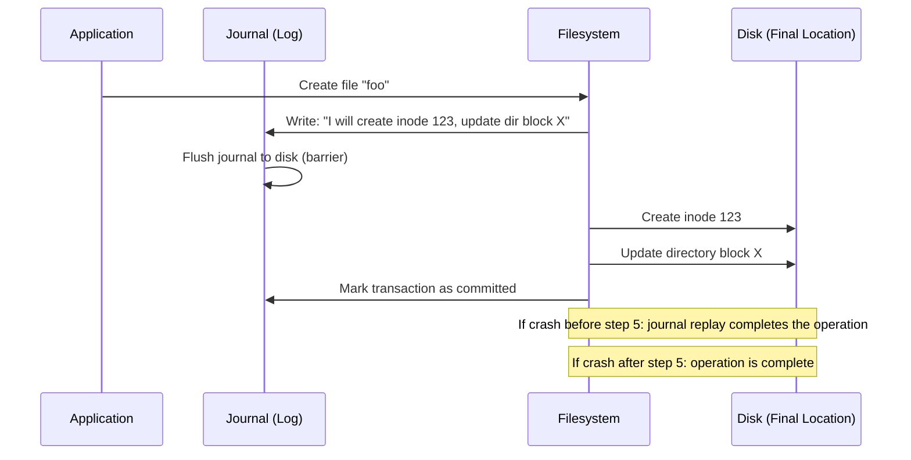

## Journal Structure

### Physical Layout

The journal is typically stored in a fixed area of the filesystem:

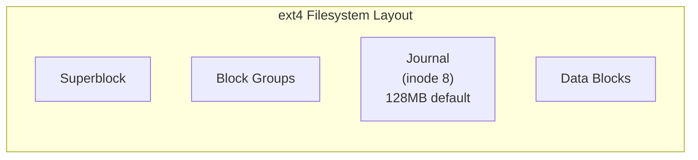

### Journal Blocks

The journal consists of:

1. **Superblock**: Contains journal metadata (sequence numbers, start/end of valid journal)
2. **Descriptor blocks**: Describe which filesystem blocks are about to be modified
3. **Data blocks** (optional): Copies of the data to be written (full data journaling)
4. **Commit blocks**: Mark the end of a transaction

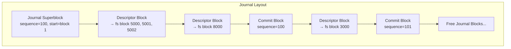

### Transaction Lifecycle

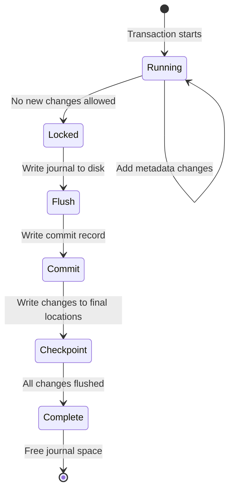

## JBD2: The Linux Journaling Layer

JBD2 (Journaling Block Device 2) is the kernel's journaling subsystem used by ext4 (and
previously ext3). It is a generic layer that any filesystem can use.

### Key Data Structures

```c
/* A journal handle — represents a single atomic operation */
struct journal_s {
    unsigned long       j_flags;
    int                 j_barrier_count;
    struct mutex        j_barrier;
    struct mutex        j_checkpoint_mutex;
    tid_t               j_transaction_sequence;  /* Next transaction ID */
    tid_t               j_commit_sequence;       /* Last committed ID */
    struct transaction_s *j_running_transaction;  /* Current transaction */
    struct transaction_s *j_committing_transaction;/* Being committed */
    struct transaction_s *j_checkpoint_transactions;/* Pending checkpoint */
    /* ... journal device info, buffer heads, etc. */
};

/* A handle within a transaction */
struct journal_head {
    struct buffer_head *b_bh;
    tid_t b_transaction;    /* Transaction this buffer belongs to */
    tid_t b_next_transaction;/* Next transaction (if modified again) */
    /* ... */
};
```

### Starting and Completing a Transaction

```c
/* Filesystem code: how to use JBD2 */

/* 1. Start a handle (begin transaction) */
handle_t *handle = ext4_journal_start(inode, EXT4_DATA_TRANS_BLOCKS(inode->i_sb));
if (IS_ERR(handle))
    return PTR_ERR(handle);

/* 2. Modify filesystem metadata (JBD2 tracks all changes) */
ext4_mark_inode_dirty(handle, inode);
ext4_add_entry(handle, dentry, inode);

/* 3. Stop the handle (end this part of the transaction) */
ext4_journal_stop(handle);

/* The transaction may be committed later by the journal commit thread */
```

### Journal Commit Thread

The JBD2 commit thread (`jbd2/sda1-8`) runs periodically to flush transactions:

```bash
# View journal commit thread
$ ps aux | grep jbd2
root   1234  0.0  0.0  0  0 ?  S  Jan01  0:15 [jbd2/sda1-8]

# The commit thread:
# 1. Locks the running transaction
# 2. Writes all dirty journal buffers to the journal device
# 3. Writes a commit record (barrier I/O)
# 4. Moves the transaction to the checkpoint list
```

## Data Journaling Modes

### `data=ordered` (Default)

In `data=ordered` mode, only metadata is journaled. Data blocks are written to disk *before*
the metadata commit. This ensures that after recovery, you never see uninitialized data in a
newly created or extended file.

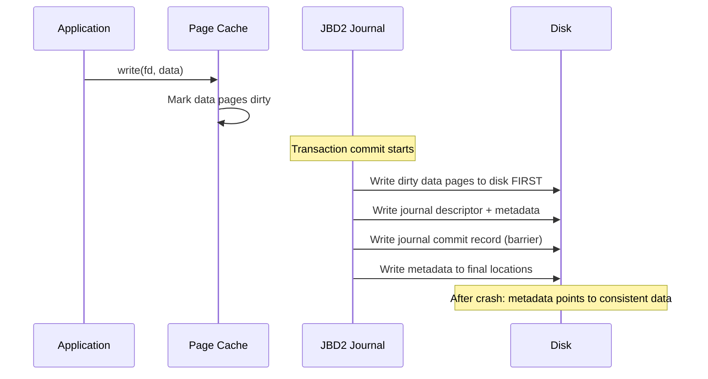

**Guarantee**: If a file's metadata says it has 1000 bytes, those 1000 bytes are real data, not
stale garbage. This is critical for security (prevents information leaks).

### `data=writeback`

In `data=writeback` mode, only metadata is journaled. Data writes may be reordered relative to
metadata commits.

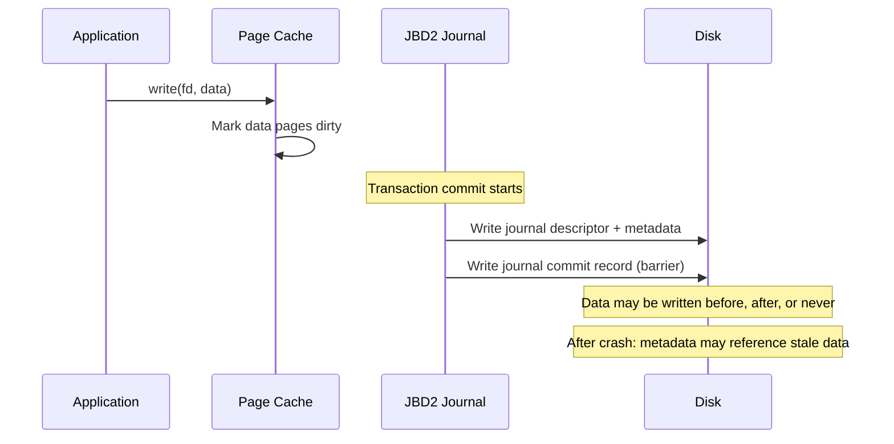

**Trade-off**: Faster than `data=ordered` because data and metadata writes can be reordered,
but after recovery, a file's metadata may claim a larger size than what was actually written,
exposing uninitialized disk blocks.

### `data=journal`

In `data=journal` mode, both data and metadata are written to the journal first, then flushed
to their final locations.

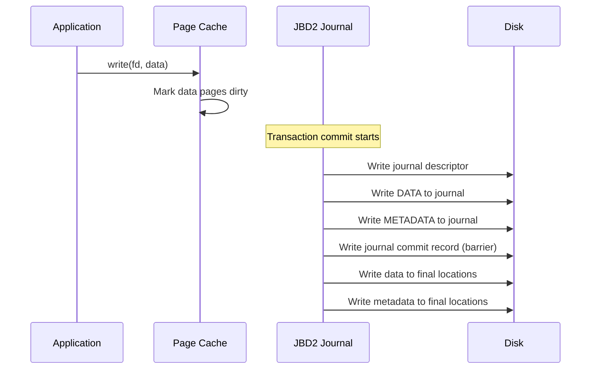

**Trade-off**: Safest mode (data is never lost), but every write hits the journal first, doubling
write I/O. Used when data integrity is paramount.

### Comparison

| Mode | Metadata Journal | Data Journal | Crash Safety | Performance |
|------|-----------------|--------------|-------------|-------------|
| `data=journal` | Yes | Yes | Best (no data loss) | Slowest |
| `data=ordered` | Yes | No (written first) | Good (no stale data) | Medium |
| `data=writeback` | Yes | No | Fair (possible stale data) | Fastest |

## Setting Journaling Mode

```bash
# Check current mode
$ mount | grep ext4
/dev/sda1 on / type ext4 (rw,relatime,data=ordered)

# Set mode at mount time
$ sudo mount -o data=writeback /dev/sda1 /mnt

# Set mode in /etc/fstab
# /dev/sda1  /  ext4  defaults,data=ordered  0  1

# Change mode on mounted filesystem
$ sudo mount -o remount,data=journal /mnt

# Set default mode in superblock
$ sudo tune2fs -o journal_data_writeback /dev/sda1
```

## Journal Management

### Journal Size

```bash
# View journal size
$ sudo tune2fs -l /dev/sda1 | grep "Journal size"
Journal size:             128M

# Resize journal (must be unmounted)
$ sudo umount /dev/sda1
$ sudo tune2fs -J size=256 /dev/sda1

# Remove journal (convert to ext2!)
$ sudo tune2fs -O ^has_journal /dev/sda1

# Add journal to ext2 (convert to ext3/ext4)
$ sudo tune2fs -j /dev/sda1
```

### Journal Location

```bash
# Journal on the same device (default — internal journal)
$ sudo tune2fs -l /dev/sda1 | grep "Journal inode"
Journal inode:            8

# Journal on external device (faster for some workloads)
$ sudo mkfs.ext4 -J device=/dev/nvme0n1p1 /dev/sda1

# View journal status via debugfs
$ sudo debugfs -R 'stat <8>' /dev/sda1
```

### Journal Checksumming

ext4 with JBD2 supports journal checksumming to detect corruption in the journal itself:

```bash
# Enable journal checksumming (default on modern ext4)
$ sudo tune2fs -O metadata_csum /dev/sda1
```

## XFS Journaling

XFS uses its own journaling implementation (not JBD2). Key differences:

- **Delayed logging (CIL)**: XFS batches metadata changes in memory before writing to the log
- **Physical logging**: XFS logs physical block addresses (unlike JBD2 which logs logical blocks)
- **Separate log device**: XFS can use a dedicated device for the log (SLOG)

```bash
# View XFS log info
$ sudo xfs_info /dev/sda1 | grep log
log      =internal        bsize=4096   blocks=16384, version=2
         =                sectsz=512   sunit=0 blks, lazy-count=1

# External log device
$ sudo mkfs.xfs -l logdev=/dev/nvme0n1p1,size=2g /dev/sda1
```

## Btrfs and CoW (Alternative to Journaling)

Btrfs does not use traditional journaling. Instead, it uses copy-on-write (CoW) to achieve the
same consistency guarantees:

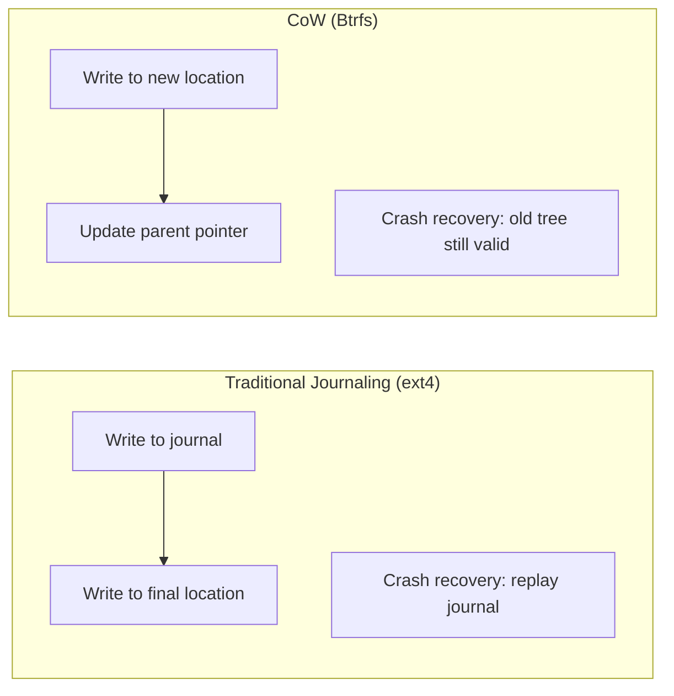

With CoW, the old data is never overwritten. A crash at any point leaves the previous consistent
state intact. The new version becomes visible only when the root pointer is atomically updated.

## Data Integrity Guarantees

### Without Journaling (ext2)

```
Write 1: Update inode bitmap   ✓ written
Write 2: Write inode            ✗ crash!
Write 3: Update directory       ✗ never happened

Recovery: fsck finds inode allocated but not in any directory
          → "lost+found" orphan
```

### With `data=ordered`

```
Write 1: Write data blocks     ✓ flushed to disk
Write 2: Journal: "update inode, dir"
Write 3: Journal commit        ✓ barrier
Write 4: Write inode to final  ✗ crash!
Write 5: Write dir to final    ✗ never happened

Recovery: JBD2 replays journal → inode and directory updated
          Data was already on disk (written before journal)
          → consistent state
```

### With `data=writeback`

```
Write 1: Journal: "update inode, dir"
Write 2: Journal commit        ✓
Write 3: Write inode to final  ✗ crash!
Write 4: Write dir to final    ✗
Write 5: Write data blocks     ✗ (may not have happened yet!)

Recovery: JBD2 replays journal → inode updated (file appears larger)
          But data blocks may contain stale content
          → possible information leak
```

## Performance Impact

### Journaling Overhead

Journaling adds overhead in several ways:

1. **Double writes**: Metadata is written once to the journal, then again to its final location
2. **Barrier I/O**: Journal commits use barrier/sync I/O to ensure ordering
3. **Lock contention**: JBD2 uses locks to serialize transaction access

### Mitigating Journal Overhead

```bash
# Use data=writeback (accept the risk for performance)
$ sudo mount -o data=writeback /dev/sda1 /data

# Increase commit interval (default: 5 seconds)
$ sudo mount -o commit=30 /dev/sda1 /data

# Use external journal on fast device
$ sudo mkfs.ext4 -J device=/dev/nvme0n1p1 /dev/sda1

# Disable barriers (DANGEROUS — only with battery-backed RAID)
$ sudo mount -o barrier=0 /dev/sda1 /data

# For XFS: use delayed logging (default, already optimized)
$ sudo xfs_info /dev/sda1 | grep delaylog
```

### Benchmarking Journal Impact

```bash
# Test with different journal modes
$ sudo mount -o data=ordered /dev/sda1 /mnt/test
$ fio --name=meta --directory=/mnt/test --rw=randwrite --bs=4k \
    --numjobs=1 --size=1G --runtime=30 --fsync=1

$ sudo mount -o remount,data=writeback /mnt/test
$ fio --name=meta --directory=/mnt/test --rw=randwrite --bs=4k \
    --numjobs=1 --size=1G --runtime=30 --fsync=1

$ sudo mount -o remount,data=journal /mnt/test
$ fio --name=meta --directory=/mnt/test --rw=randwrite --bs=4k \
    --numjobs=1 --size=1G --runtime=30 --fsync=1
```

## Checking Journal Status

```bash
# ext4: View journal info
$ sudo debugfs -R 'stat <8>' /dev/sda1

# Check journal recovery status (after unclean shutdown)
$ sudo dmesg | grep -i journal
[    2.123456] EXT4-fs (sda1): recovery complete
[    2.123456] EXT4-fs (sda1): mounted filesystem with ordered data mode

# ext4: Force journal recovery
$ sudo e2fsck -f /dev/sda1

# XFS: View log status
$ sudo xfs_db -c "log" /dev/sda1

# JBD2 statistics
$ cat /proc/fs/jbd2/sda1-8/info
1234 transactions (12345678 requested), each up to 32768 blocks
average:
  0ms waiting for transaction
  0ms request delay
  0ms running transaction
  0ms transaction was being locked
  0ms logging data
```


## JBD2 Transaction Internals

### Transaction States in Detail

JBD2 transactions go through a well-defined state machine. Understanding
these states is essential for debugging journal performance issues.

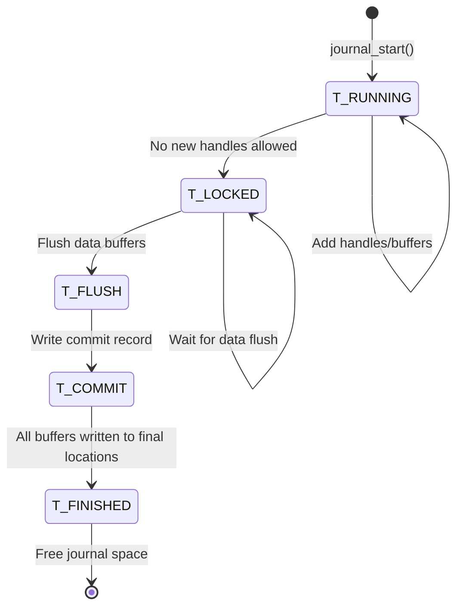

### Handle and Buffer Lifecycle

Every filesystem operation that modifies metadata creates a **handle**.
Multiple handles can be active within a single transaction:

```c
/* Typical lifecycle */
handle_t *handle = ext4_journal_start(inode, nblocks);

/* Add metadata buffers to the transaction */
struct buffer_head *bh = sb_bread(sb, block_num);
jbd2_journal_get_write_access(handle, bh);
/* Modify buffer contents */
bh->b_data[0] = new_value;
jbd2_journal_dirty_metadata(handle, bh);

ext4_journal_stop(handle);
```

The `jbd2_journal_get_write_access()` call is critical — it tells JBD2
that this buffer is about to be modified.  JBD2 may need to copy the buffer
to the journal first (for `data=journal` mode) or just record its block
number (for `data=ordered` and `data=writeback`).

### Journal Block Format

The journal on disk has a precise format:

```
Block 0: Journal Superblock
  +-- Sequence number
  +-- Start of valid journal
  +-- Error flag
  +-- Feature flags

Block 1+: Transaction blocks
  +-- Descriptor block (tag + block numbers)
  |   +-- Tag 0: fs_block=5000, flags=ESCAPE|LAST
  |   +-- (or data blocks for data=journal mode)
  +-- Data blocks (if data=journal)
  +-- Commit block (sequence + checksum)
```

## Barriers and Flush Guarantees

### Why Barriers Matter

Without barriers, the disk controller may reorder writes, potentially
writing a commit record before all transaction data is on disk.  This
could cause corruption after a crash.

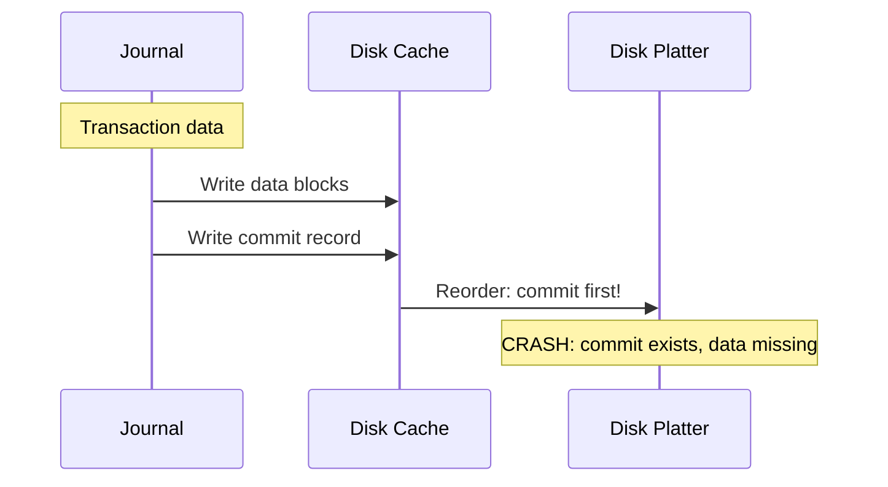

### How Barriers Fix This

A barrier (FLUSH/FUA) forces the disk to flush its volatile cache:

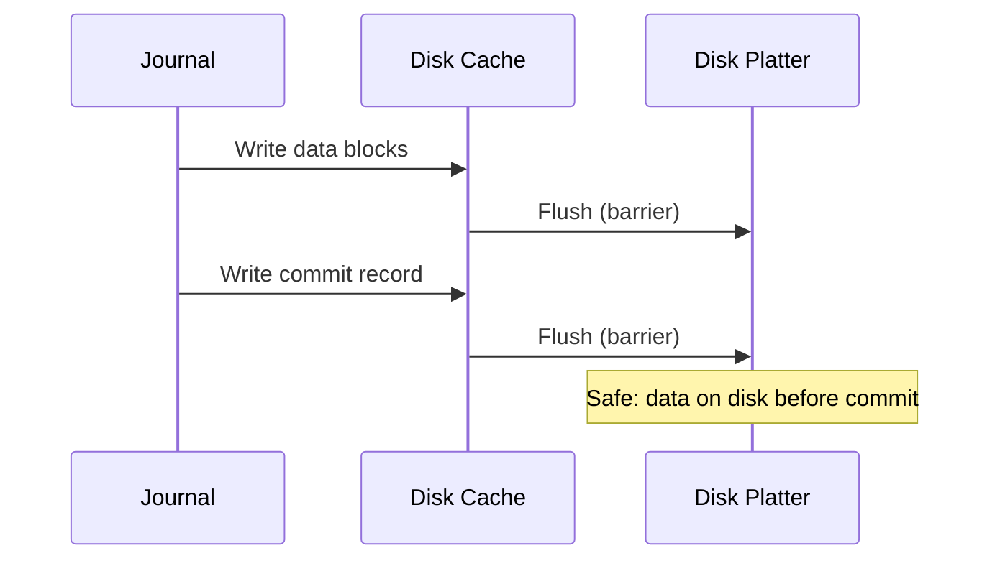

```bash
# Check if barriers are enabled
$ mount | grep ext4
/dev/sda1 on / type ext4 (rw,relatime,data=ordered)
# No 'barrier=0' = barriers are enabled

# Disable barriers (DANGEROUS -- only with battery-backed RAID)
$ sudo mount -o barrier=0 /dev/sda1 /data

# Check disk cache status
$ sudo hdparm -W /dev/sda
/dev/sda:
 write-caching = 1 (on)
```

## Recovery Process in Detail

When the system boots after a crash, the journal recovery code runs
before the filesystem is mounted:

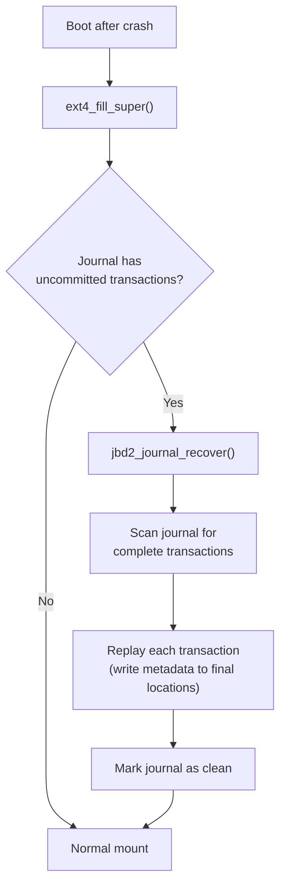

```bash
# View recovery messages in kernel log
$ sudo dmesg | grep -i journal
[    1.234567] EXT4-fs (sda1): recovery complete
[    1.234568] EXT4-fs (sda1): mounted filesystem with ordered data mode

# Force journal recovery (unmount first)
$ sudo umount /dev/sda1
$ sudo e2fsck -f /dev/sda1
```

## F2FS Logging

F2FS (Flash-Friendly File System) uses a **log-structured** approach with
multiple active logs:

* **Hot log**: Frequently updated metadata (inodes, dentries)
* **Warm log**: Less frequently updated metadata
* **Cold log**: Data blocks, rarely updated files

This separation reduces garbage collection overhead on flash storage by
grouping data with similar update frequencies.

```bash
# View F2FS segment layout
$ sudo dump.f2fs /dev/nvme0n1p1
# Shows hot/warm/cold segments and their utilization
```

## Journaling Performance Analysis

### Measuring Journal Overhead

```bash
# Compare journaling modes with fio
# Test metadata-heavy workload (small random writes with fsync)
for mode in ordered writeback journal; do
    echo "=== data=$mode ==="
    sudo mount -o data=$mode /dev/sdb1 /mnt/test
    fio --name=meta --directory=/mnt/test         --rw=randwrite --bs=4k --size=1G         --numjobs=1 --runtime=30 --fsync=1         --group_reporting --minimal
    sudo umount /mnt/test
done
```

### Expected Performance Ratios

| Workload | data=ordered | data=writeback | data=journal |
|----------|-------------|----------------|-------------|
| Sequential writes | 1.0x (baseline) | 1.0-1.1x | 0.5-0.7x |
| Random fsync | 1.0x | 1.2-1.5x | 0.3-0.5x |
| Metadata-heavy | 1.0x | 1.1-1.3x | 0.4-0.6x |

### Tuning Journal Commit Interval

```bash
# Default commit interval: 5 seconds
$ cat /proc/sys/fs/commit_interval
5

# Increase for throughput (at the cost of more data at risk)
$ echo 30 | sudo tee /proc/sys/fs/commit_interval

# Or per-mount
$ sudo mount -o commit=30 /dev/sda1 /data

# Force immediate commit
$ sync
```

## Further Reading

- [The Linux Kernel Documentation](https://docs.kernel.org/)
- [GNU Project Documentation](https://www.gnu.org/doc/doc.html)
- [GNU Manuals](https://www.gnu.org/manual/manual.html)
- [Free Software Directory](https://directory.fsf.org/wiki/Main_Page)
- [Planet GNU](https://planet.gnu.org/)
- [Free Software Books](https://www.gnu.org/doc/other-free-books.html)

- [Linux kernel: fs/jbd2/](https://elixir.bootlin.com/linux/latest/source/fs/jbd2) — JBD2 source code
- [ext4 wiki: Journaling](https://ext4.wiki.kernel.org/index.php/Ext4_Disk_Layout#Journal) — ext4 journal format
- [Robert Love: Linux Kernel Development, Ch. 12](https://www.oreilly.com/library/view/linux-kernel-development/9780768696974/) — VFS and journaling
- [Wikipedia: Write-ahead logging](https://en.wikipedia.org/wiki/Write-ahead_logging) — WAL theory
- [Theodore Ts'o: The new ext4 filesystem](https://kernel.org/pub/linux/kernel/people/tytso/) — ext4 design documents
- [LWN: JBD2: Journaling for ext4](https://lwn.net/Articles/234567/) — JBD2 design
- [XFS: Design and Implementation](https://www.scribd.com/doc/26461890/XFS-Design-and-Implementation) — XFS logging internals

## Related Topics

- [VFS](./vfs.md) — The virtual filesystem layer
- [ext4](./ext4.md) — ext4's use of JBD2
- [XFS](./xfs.md) — XFS delayed logging
- [Btrfs](./btrfs.md) — CoW as an alternative to journaling
- [ZFS](./zfs.md) — ZIL and transaction groups
