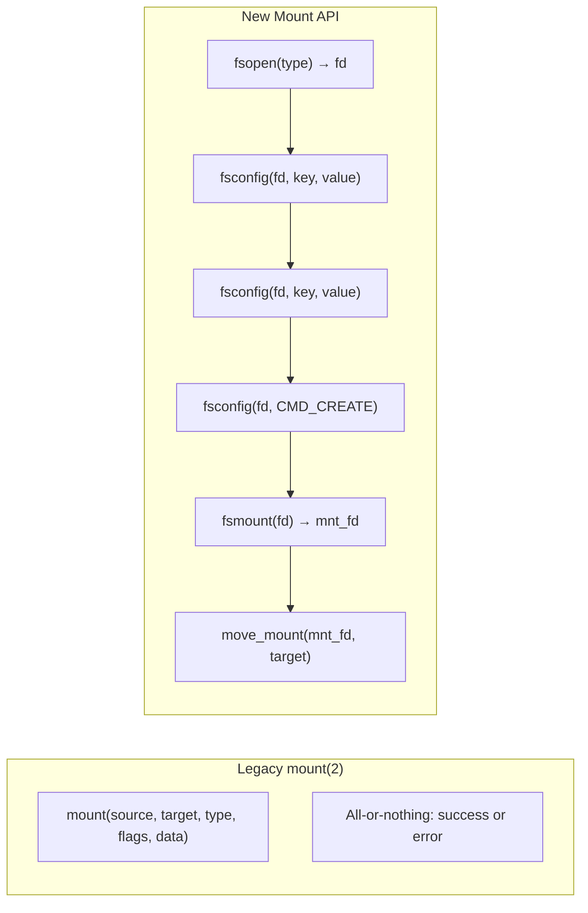
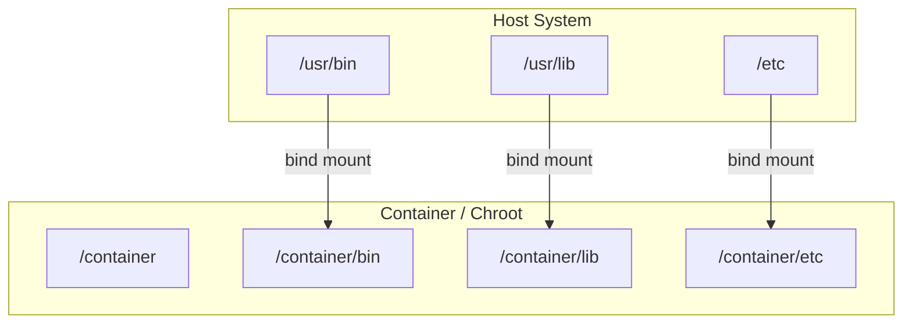
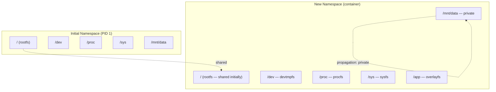
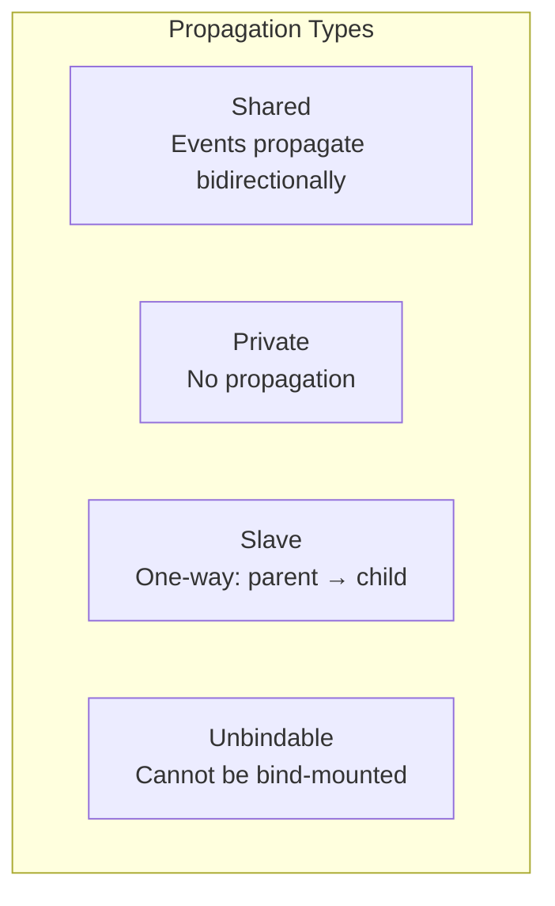
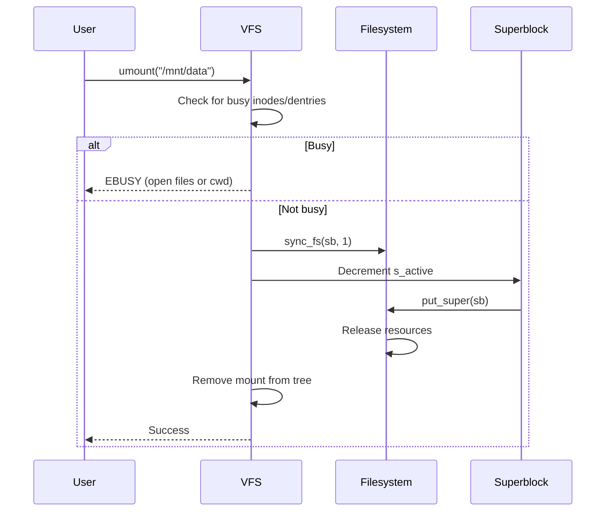
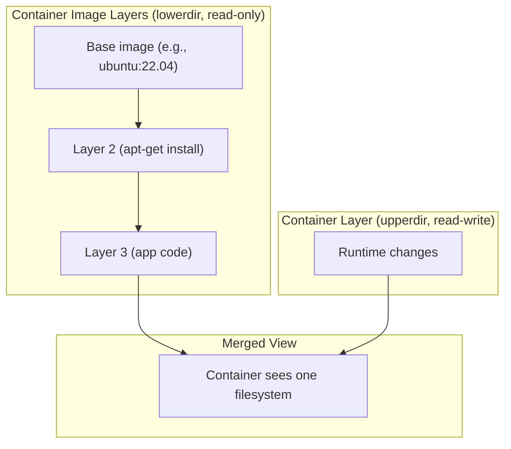

# Mounting

## Introduction

Mounting is the process of attaching a filesystem to a specific point in the Linux directory tree. The `mount(2)` system call is the fundamental operation that makes a filesystem's contents accessible at a path. Modern Linux mounting is far more complex than the simple "attach device to directory" model: it supports mount namespaces, bind mounts, propagation types, overlay mounts, and a rich security model.

The mount system call has evolved significantly. The legacy `mount(2)` is a single syscall with flags and data arguments. Linux 5.2+ introduced a new mount API (`fsopen`, `fsconfig`, `fsmount`, `move_mount`) that splits the operation into discrete steps, enabling better error handling and more complex configurations.

## The mount(2) System Call

### Legacy API

```c
#include <sys/mount.h>

int mount(const char *source, const char *target,
          const char *filesystemtype, unsigned long mountflags,
          const void *data);
```

**Parameters:**
- `source` — Device path, remote path, or NULL (for virtual filesystems)
- `target` — Directory where the filesystem will be mounted
- `filesystemtype` — Filesystem type string (e.g., "ext4", "tmpfs", "nfs")
- `mountflags` — Bitmask of mount flags
- `data` — Filesystem-specific options string

### Mount Flags

```c
#define MS_RDONLY        1      /* Mount read-only */
#define MS_NOSUID        2      /* Ignore suid/sgid bits */
#define MS_NODEV         4      /* Disallow access to device files */
#define MS_NOEXEC        8      /* Disallow program execution */
#define MS_SYNCHRONOUS   16     /* Writes are synchronous */
#define MS_REMOUNT       32     /* Remount existing mount */
#define MS_MANDLOCK      64     /* Enable mandatory locking */
#define MS_DIRSYNC       128    /* Directory modifications synchronous */
#define MS_NOATIME       1024   /* Don't update access times */
#define MS_NODIRATIME    2048   /* Don't update directory access times */
#define MS_BIND          4096   /* Bind mount */
#define MS_MOVE          8192   /* Move mount to new location */
#define MS_REC           16384  /* Recursive (for bind/rbind) */
#define MS_SILENT        32768  /* Suppress kernel messages */
#define MS_POSIXACL      (1<<16) /* POSIX ACLs */
#define MS_UNBINDABLE    (1<<17) /* Make unbindable */
#define MS_PRIVATE       (1<<18) /* Make private */
#define MS_SLAVE         (1<<19) /* Make slave */
#define MS_SHARED        (1<<20) /* Make shared */
#define MS_RELATIME      (1<<21) /* Update atime if older than mtime */
#define MS_KERNMOUNT     (1<<22) /* Kernel-internal mount */
#define MS_I_VERSION     (1<<23) /* Update inode i_version */
#define MS_STRICTATIME   (1<<24) /* Always update atime */
#define MS_LAZYTIME      (1<<25) /* Lazy atime updates */
```

### Example Mount Calls

```c
/* Mount ext4 */
mount("/dev/sda1", "/mnt/data", "ext4", MS_NOATIME, "errors=remount-ro");

/* Mount tmpfs */
mount("tmpfs", "/tmp", "tmpfs", MS_NOSUID | MS_NODEV, "size=2G,mode=1777");

/* Bind mount */
mount("/home/user/docs", "/mnt/docs", NULL, MS_BIND, NULL);

/* Recursive bind mount */
mount("/home/user", "/mnt/user", NULL, MS_BIND | MS_REC, NULL);

/* Remount read-only */
mount(NULL, "/mnt/data", NULL, MS_REMOUNT | MS_RDONLY, NULL);

/* NFS mount */
mount("server:/share", "/mnt/nfs", "nfs", 0, "vers=4.2,hard,rsize=1048576");
```

## The New Mount API (Linux 5.2+)

The new API splits mounting into discrete steps:

```c
#include <sys/syscall.h>
#include <linux/mount.h>

/* Step 1: Create a filesystem context */
int fs_fd = syscall(__NR_fsopen, "ext4", FSOPEN_CLOEXEC);

/* Step 2: Configure the filesystem */
syscall(__NR_fsconfig, fs_fd, FSCONFIG_SET_STRING, "source", "/dev/sda1", 0);
syscall(__NR_fsconfig, fs_fd, FSCONFIG_SET_STRING, "errors", "remount-ro", 0);
syscall(__NR_fsconfig, fs_fd, FSCONFIG_SET_FLAG, "noatime", NULL, 0);
syscall(__NR_fsconfig, fs_fd, FSCONFIG_CMD_CREATE, NULL, NULL, 0);

/* Step 3: Create a mount object */
int mnt_fd = syscall(__NR_fsmount, fs_fd, FSMOUNT_CLOEXEC, MS_NOATIME);

/* Step 4: Attach to the directory tree */
syscall(__NR_move_mount, mnt_fd, "", AT_FDCWD, "/mnt/data",
        MOVE_MOUNT_F_EMPTY_PATH);
```

### New API Advantages



Benefits:
- **File descriptor based**: Mount objects are FDs, can be passed between processes
- **Better error reporting**: Each step can fail independently
- **Atomic configuration**: Options are accumulated before creation
- **Superseded source**: Can change source without re-mounting
- **Open-tree**: `open_tree()` to manipulate existing mounts

## Bind Mounts

Bind mounts make a directory or file visible at another location:

```bash
# Basic bind mount
mount --bind /source/dir /target/dir

# Bind mount a single file
mount --bind /etc/hostname /mnt/hostname

# Recursive bind mount (includes sub-mounts)
mount --rbind /source/dir /target/dir

# Read-only bind mount
mount --bind /source/dir /target/dir
mount -o remount,ro,bind /target/dir

# Equivalent to:
mount --bind --read-only /source/dir /target/dir
```

### Bind Mount Use Cases



```bash
# Make /usr available in a chroot
mount --bind /usr /chroot/usr

# Overlay config files in a container
mount --bind /host/config/app.conf /container/etc/app.conf

# Share a directory between containers
mount --bind /shared/data /container1/data
mount --bind /shared/data /container2/data
```

## Mount Namespaces

Mount namespaces provide isolated views of the filesystem hierarchy. They are the foundation of containers.

### Creating a Mount Namespace

```bash
# unshare: create a new mount namespace
$ sudo unshare --mount /bin/bash

# In the new namespace, mount/unmount without affecting the host
$ mount -t tmpfs tmpfs /mnt
$ ls /mnt
# Only visible in this namespace

# In another terminal (original namespace):
$ ls /mnt
# Empty — the tmpfs mount is not visible here
```

### Mount Namespace Diagram



### Mount Propagation

Mount propagation controls how mount and unmount events are shared between namespaces:



| Propagation | Behavior |
|-------------|----------|
| **shared** | Mount/unmount events propagate to peer mounts and vice versa |
| **private** | No events propagate in either direction |
| **slave** | Receives events from master, but doesn't propagate back |
| **unbindable** | Cannot be the source of a bind mount |

```bash
# View propagation types
$ findmnt -o TARGET,PROPAGATION
TARGET                        PROPAGATION
/                             shared
├─/proc                       shared
├─/dev                        shared
├─/sys                        shared
├─/run                        shared
└─/mnt/data                   private

# Change propagation type
mount --make-private /mnt/data
mount --make-shared /mnt/data
mount --make-slave /mnt/data
mount --make-unbindable /mnt/data

# Recursive propagation change
mount --make-rshared /
mount --make-rprivate /mnt
```

### Propagation in Container Runtimes

```bash
# Docker/Podman typically:
# 1. Create a new mount namespace
# 2. Set root to private propagation
# 3. Pivot root to new rootfs
# 4. Mount /proc, /sys, /dev as shared (for device hotplug)

# Example: container mount setup
unshare --mount --propagation private -- /bin/bash
mount --make-rprivate /
mount -t proc proc /proc
mount -t sysfs sysfs /sys
mount -t devtmpfs devtmpfs /dev
pivot_root /new_root /new_root/old_root
umount -l /old_root
```

## Remounting

```bash
# Remount read-only
mount -o remount,ro /mnt/data

# Remount with different options
mount -o remount,noatime,nodiratime /mnt/data

# Remount a bind mount
mount -o remount,bind,ro /mnt/docs

# Cannot change certain things via remount:
# - filesystem type
# - source device (use bind mount instead)
# - Some flags require full unmount+mount
```

## umount

```bash
# Unmount a filesystem
umount /mnt/data

# Lazy unmount (detach immediately, cleanup later)
umount -l /mnt/data

# Force unmount (even if busy — for NFS)
umount -f /mnt/nfs

# Unmount by device
umount /dev/sda1

# Unmount all filesystems of a type
umount -t nfs

# Recursive unmount (all mounts under a path)
umount -R /mnt/namespace
```

### What Happens During umount



## /proc and /sys Mount Information

```bash
# View all mounts
$ cat /proc/mounts
# or
$ cat /proc/self/mountinfo

# mountinfo format (11 fields + optional):
# 36 35 98:0 /mnt1 /mnt2 rw,noatime master:1 - ext4 /dev/root rw,errors=continue

# Field meanings:
# 1: mount ID
# 2: parent mount ID
# 3: major:minor device numbers
# 4: root (path of mount within the filesystem)
# 5: mount point
# 6: mount options
# 7: optional fields (propagation, etc.)
# 8: separator (-)
# 9: filesystem type
# 10: source device
# 11: superblock options

# Find mount for a specific path
$ findmnt /mnt/data
TARGET    SOURCE    FSTYPE OPTIONS
/mnt/data /dev/sda1 ext4   rw,noatime,errors=remount-ro

# Find mount by device
$ findmnt -S /dev/sda1
```

## Implementation Details

### Key Source Files

- **`fs/namespace.c`** — Mount system calls and mount tree management (~4500 lines)
- **`fs/seq_file.c`** — `/proc/mounts` output
- **`include/linux/mount.h`** — Mount structure definitions
- **`include/uapi/linux/mount.h`** — User-visible mount flags

### Mount Structure

```c
/* Simplified from include/linux/mount.h */
struct vfsmount {
    struct dentry *mnt_root;        /* Root dentry of this mount */
    struct super_block *mnt_sb;     /* Superblock for this mount */
    int mnt_flags;                  /* Mount flags */
};

struct mount {
    struct hlist_node mnt_hash;     /* Hash table entry */
    struct mount *mnt_parent;       /* Parent mount */
    struct dentry *mnt_mountpoint;  /* Dentry where mounted */
    struct vfsmount mnt;            /* VFS mount structure */
    struct list_head mnt_mounts;    /* Child mounts */
    struct list_head mnt_child;     /* Link in parent's mnt_mounts */
    struct list_head mnt_instance;  /* Link in sb->s_mounts */
    const char *mnt_devname;        /* Device name */
    struct list_head mnt_list;      /* Global list of mounts */
    struct mnt_namespace *mnt_ns;   /* Owning namespace */
    /* ... */
};
```

## References

- [mount(2) man page](https://man7.org/linux/man-pages/man2/mount.2.html)
- [Mount API documentation](https://www.kernel.org/doc/html/latest/filesystems/mount_api.html)
- [namespaces(7) man page](https://man7.org/linux/man-pages/man7/namespaces.7.html)
- [umount(2) man page](https://man7.org/linux/man-pages/man2/umount.2.html)
- [pivot_root(2) man page](https://man7.org/linux/man-pages/man2/pivot_root.2.html)
- [fstab(5) man page](https://man7.org/linux/man-pages/man5/fstab.5.html)
- [systemd.mount(5) man page](https://man7.org/linux/man-pages/man5/systemd.mount.5.html)
- [OverlayFS documentation](https://www.kernel.org/doc/html/latest/filesystems/overlayfs.html)

## Further Reading

- [The Linux Kernel Documentation](https://docs.kernel.org/)
- [GNU Project Documentation](https://www.gnu.org/doc/doc.html)
- [GNU Manuals](https://www.gnu.org/manual/manual.html)
- [Free Software Directory](https://directory.fsf.org/wiki/Main_Page)
- [Planet GNU](https://planet.gnu.org/)
- [Free Software Books](https://www.gnu.org/doc/other-free-books.html)

- https://man7.org/linux/man-pages/man2/mount.2.html
- https://man7.org/linux/man-pages/man7/mount_namespaces.7.html
- https://man7.org/linux/man-pages/man2/pivot_root.2.html
- https://man7.org/linux/man-pages/man2/umount.2.html
- https://lwn.net/Articles/759499/ — "A new API for mount handling"

---

## Virtual Filesystem Mounts

Linux has several in-memory (virtual) filesystems that don't correspond to any physical device:

### tmpfs

`tmpfs` stores files entirely in RAM (and swap). Commonly used for `/tmp`, `/run`, and `/dev/shm`:

```bash
# Mount tmpfs
mount -t tmpfs -o size=2G,mode=1777 tmpfs /tmp

# tmpfs options
# size=    — Maximum size (default: 50% of RAM)
# nr_inodes= — Maximum number of inodes
# mode=    — Directory permissions
# uid=,gid= — Owner
# huge=    — Enable huge pages (always/within_size/never)

# Check current tmpfs usage
df -h /tmp /run /dev/shm

# View tmpfs mount details
mount | grep tmpfs
cat /proc/mounts | grep tmpfs
```

### proc

`procfs` exposes kernel and process information:

```bash
mount -t proc proc /proc

# Key procfs entries
/proc/cpuinfo          # CPU information
/proc/meminfo          # Memory statistics
/proc/<pid>/           # Per-process information
/proc/<pid>/maps       # Memory mappings
/proc/<pid>/fd/        # Open file descriptors
/proc/<pid>/status     # Process status
/proc/sys/             # Kernel tunables (sysctl)
```

### sysfs

`sysfs` exposes kernel device model information:

```bash
mount -t sysfs sysfs /sys

# Key sysfs entries
/sys/block/            # Block devices
/sys/class/            # Device classes
/sys/devices/          # Device tree
/sys/module/           # Loaded kernel modules
/sys/firmware/          # Firmware interfaces
```

### devtmpfs

`devtmpfs` provides automatic device node management:

```bash
mount -t devtmpfs devtmpfs /dev

# Kernel automatically creates/removes /dev nodes
# when devices are added/removed
```

## OverlayFS Mounts

OverlayFS combines multiple directory trees into one. It's the foundation of container image layering:

```bash
# OverlayFS mount
mount -t overlay overlay \
    -o lowerdir=/lower,upperdir=/upper,workdir=/work \
    /merged

# Components:
# lowerdir  — Read-only base layer (can be multiple, comma-separated)
# upperdir  — Read-write layer (changes go here)
# workdir   — Working directory (must be on same filesystem as upperdir)
# merged    — Combined view presented to users
```

### OverlayFS in Containers



```bash
# Docker overlay2 driver example
# Lower layers: image layers (read-only)
# Upper layer: container writable layer
# Work dir: overlayfs internal state

mount -t overlay overlay \
    -o lowerdir=/var/lib/docker/overlay2/l/ABC:/var/lib/docker/overlay2/l/DEF,\
upperdir=/var/lib/docker/overlay2/XYZ/diff,\
workdir=/var/lib/docker/overlay2/XYZ/work \
    /var/lib/docker/overlay2/XYZ/merged
```

### Multiple Lower Layers

```bash
# Stack multiple read-only layers
mount -t overlay overlay \
    -o lowerdir=/layer3:/layer2:/layer1,upperdir=/upper,workdir=/work \
    /merged

# Files in /layer3 take precedence over /layer2, which takes
# precedence over /layer1. The upperdir is writable and takes
# highest precedence.
```

## /etc/fstab

The `fstab` file defines filesystems to mount at boot:

```bash
# /etc/fstab format:
# <device>  <mount>  <type>  <options>  <dump>  <fsck>

# Examples:
# Device with UUID (preferred)
UUID=12345678-1234-1234-1234-123456789abc  /  ext4  errors=remount-ro  0  1

# tmpfs
tmpfs  /tmp  tmpfs  defaults,noatime,nosuid,nodev,size=2G  0  0

# NFS
server:/share  /mnt/nfs  nfs4  defaults,soft,timeo=10  0  0

# Bind mount (fstab)
/data/shared  /srv/shared  none  bind,ro  0  0

# Swap
UUID=...  none  swap  sw  0  0

# Common mount options:
# defaults   — rw, suid, dev, exec, auto, nouser, async
# noatime    — Don't update access times (performance)
# nosuid     — Ignore suid/sgid bits (security)
# nodev      — Don't interpret device files (security)
# noexec     — Don't allow execution (security)
# discard    — Enable TRIM for SSDs
# x-systemd.automount — Automount on first access
# _netdev    — Wait for network before mounting
```

### Verifying fstab

```bash
# Test fstab without rebooting
mount -a

# Check for fstab errors
findmnt --verify

# Remount all fstab entries
systemctl daemon-reload
systemctl restart local-fs.target
```

## systemd Automounting

systemd can automount filesystems on first access:

```ini
# /etc/systemd/system/data.mount
[Unit]
Description=Data Partition

[Mount]
What=/dev/disk/by-uuid/12345678-1234-1234-1234-123456789abc
Where=/data
Type=ext4
Options=defaults,noatime

[Install]
WantedBy=multi-user.target
```

```ini
# /etc/systemd/system/data.automount
[Unit]
Description=Automount Data Partition

[Automount]
Where=/data
TimeoutIdleSec=300

[Install]
WantedBy=multi-user.target
```

```bash
# Enable automount
systemctl enable data.automount
systemctl start data.automount

# The filesystem mounts on first access to /data
# and unmounts after 300 seconds of inactivity
```

## Mount Troubleshooting

### Common Errors

```bash
# EBUSY: device is busy
$ umount /mnt/data
umount: /mnt/data: target is busy.

# Find what's using the mount
fuser -vm /mnt/data
# USER        PID ACCESS COMMAND
# root        1234 ..c.. bash
# root        5678 ...ce vim

lsof +D /mnt/data
# COMMAND  PID USER   FD   TYPE DEVICE SIZE/OFF NODE NAME
# bash     1234 root  cwd    DIR  8,1     4096    2 /mnt/data

# Solutions:
# 1. Kill processes using the mount
fuser -km /mnt/data

# 2. Lazy unmount (detach now, cleanup later)
umount -l /mnt/data

# 3. Force unmount (for NFS)
umount -f /mnt/data

# ENOENT: mount point doesn't exist
mkdir -p /mnt/data

# EACCES: permission denied
# Check /etc/fstab options, or use sudo

# Wrong filesystem type
# Check: blkid /dev/sda1
# Verify: file -sL /dev/sda1
```

### Mount Debugging

```bash
# View all mounts with details
findmnt
findmnt -t ext4,xfs

# View mount options
findmnt -o TARGET,SOURCE,OPTIONS /data

# View /proc/self/mountinfo (detailed)
cat /proc/self/mountinfo

# Trace mount operations
strace mount /dev/sda1 /mnt/data 2>&1 | grep mount

# Debug fstab issues
mount -fav  # Verbose, don't actually mount
```

## Container Mount Setup

A complete container filesystem setup sequence:

```bash
# 1. Create new mount namespace
unshare --mount

# 2. Set all mounts to private propagation
mount --make-rprivate /

# 3. Mount new rootfs (overlayfs)
mkdir -p /tmp/overlay/{upper,work,merged}
mount -t overlay overlay \
    -o lowerdir=/var/lib/images/base,upperdir=/tmp/overlay/upper,workdir=/tmp/overlay/work \
    /tmp/overlay/merged

# 4. Mount virtual filesystems
mount -t proc proc /tmp/overlay/merged/proc
mount -t sysfs sysfs /tmp/overlay/merged/sys
mount -t devtmpfs devtmpfs /tmp/overlay/merged/dev
mount -t tmpfs tmpfs /tmp/overlay/merged/run

# 5. Pivot root
cd /tmp/overlay/merged
mkdir -p .old_root
pivot_root . .old_root

# 6. Unmount old root
umount -l /.old_root
rmdir /.old_root

# 7. Now running in isolated container filesystem
exec /bin/sh
```

## Related Topics

- [superblock](./superblock.md) — Each mount has a superblock
- [tmpfs](./tmpfs.md) — Commonly mounted virtual filesystem
- [overlayfs](./overlayfs.md) — Uses mount namespaces for container layering
- [fuse](./fuse.md) — FUSE mounts via fusermount
- [Mount namespaces](../namespaces.md) — Process-level mount isolation
- [Device Mapper](../../storage/overview.md#device-mapper) — Virtual block devices
