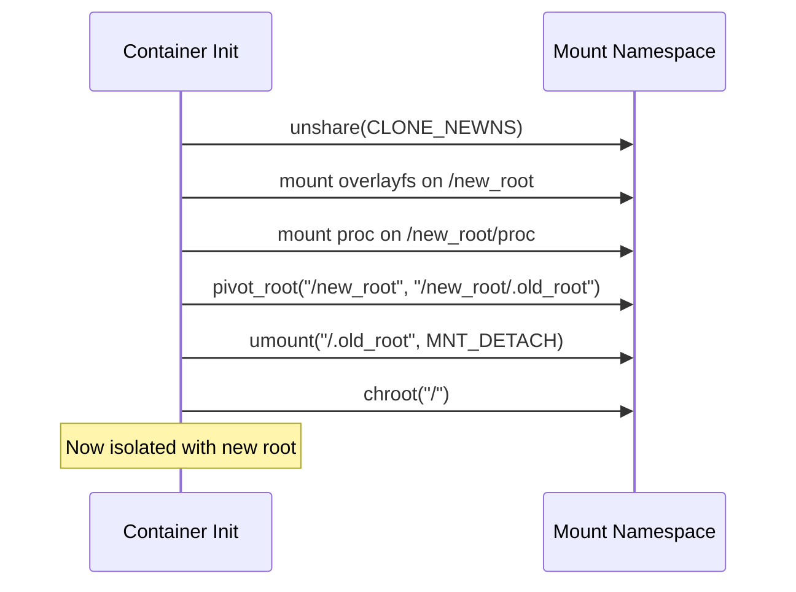
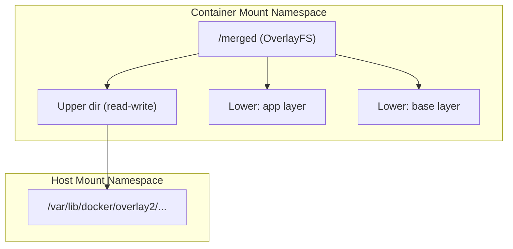
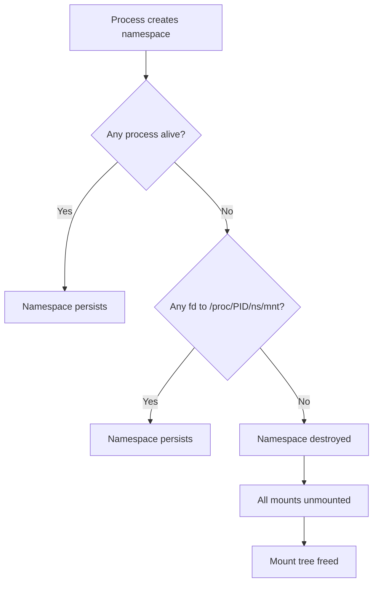

# Mount Namespaces

## Overview

Mount namespaces are one of the foundational namespace types in Linux, providing isolation of the filesystem mount point hierarchy. Each mount namespace maintains its own view of the filesystem tree, allowing processes in different namespaces to see entirely different sets of mounted filesystems. Mount namespaces were the first namespace type implemented in Linux (2.4.19, 2002) and form the basis of container filesystem isolation.

The key mechanism that makes mount namespaces powerful is **mount propagation** — the ability to control how mount and unmount events propagate between namespaces. Understanding propagation modes (shared, private, slave, unbindable) is essential for correct container operation.

## Creating Mount Namespaces

### clone() System Call

Mount namespaces are created with the `CLONE_NEWNS` flag:

```c
#include <sched.h>
#include <stdio.h>
#include <stdlib.h>
#include <unistd.h>

int child_func(void *arg) {
    printf("Child: in new mount namespace\n");
    // Mount operations here won't affect parent
    mount("tmpfs", "/tmp", "tmpfs", 0, NULL);
    printf("Child: /tmp is now tmpfs\n");
    return 0;
}

int main() {
    char *stack = malloc(1024 * 1024);
    pid_t pid = clone(child_func, stack + 1024 * 1024,
                      CLONE_NEWNS | SIGCHLD, NULL);
    waitpid(pid, NULL, 0);
    printf("Parent: /tmp is unchanged\n");
    return 0;
}
```

### unshare() System Call

A process can unshare its mount namespace from its parent:

```bash
# Create a new mount namespace and a new shell
sudo unshare --mount /bin/bash

# In the new namespace, mount operations are private
mount -t tmpfs tmpfs /mnt
ls /mnt
# Shows tmpfs contents

# In another terminal, the parent namespace doesn't see this mount
```

### setns() System Call

A process can join an existing mount namespace:

```c
int fd = open("/proc/<pid>/ns/mnt", O_RDONLY);
setns(fd, CLONE_NEWNS);
// Now in the target's mount namespace
```

## How Mount Namespaces Work

When a new mount namespace is created via `clone(CLONE_NEWNS)` or `unshare(CLONE_NEWNS)`:

1. The new namespace receives a **copy** of the parent namespace's mount tree
2. The `mount` structure reference counts are incremented
3. Subsequent mount/unmount operations in either namespace are independent (subject to propagation rules)
4. The mount tree is represented as a tree of `struct mount` objects in kernel space

### Mount Tree Structure

Each namespace has its own `struct mnt_namespace`:

```c
struct mnt_namespace {
    atomic_t count;
    struct ns_common ns;
    struct mount *root;          /* Root of the mount tree */
    struct list_head list;       /* List of all mounts in this ns */
    struct user_namespace *user_ns;
    struct ucounts *ucounts;
    unsigned int mounts;         /* Number of mounts */
    unsigned int pending_mounts; /* Mounts being propagated */
};
```

Each mount point is represented by `struct mount`:

```c
struct mount {
    struct hlist_node mnt_hash;     /* Hash table linkage */
    struct mount *mnt_parent;       /* Parent mount */
    struct dentry *mnt_mountpoint;  /* Dentry where mounted */
    struct vfsmount mnt;            /* VFS mount data */
    struct mnt_namespace *mnt_ns;   /* Owning namespace */
    /* ... */
    struct list_head mnt_slave;     /* Slave mounts */
    struct mount *mnt_master;       /* Master mount */
    struct list_head mnt_share;     /* Shared peer group */
    /* ... */
};
```

## Mount Propagation

Mount propagation controls how mount and unmount events in one namespace affect other namespaces. This is critical for containers to receive host filesystem updates (like device hotplug) while maintaining isolation.

### Propagation Types

#### Shared Mounts (MS_SHARED)

A shared mount belongs to a **peer group**. Mount and unmount events on any peer in the group propagate to all other peers:

```bash
# Create a shared mount
mount --make-shared /mnt

# Or when mounting
mount -o shared /dev/sdb1 /mnt
```

**Behavior:**
- Mounting under `/mnt` in namespace A causes it to appear under `/mnt` in all peer namespaces
- Unmounting similarly propagates
- Peer groups are identified by a shared group ID

```bash
# Demonstrate shared propagation
mount --make-shared /tmp/shared
unshare --mount bash
# In new namespace: mount is shared, so mounts propagate
mount /dev/sdc1 /tmp/shared/child
# Parent namespace also sees /tmp/shared/child
```

#### Private Mounts (MS_PRIVATE)

A private mount does not propagate events in either direction:

```bash
mount --make-private /mnt
# Or
mount -o private /dev/sdb1 /mnt
```

**Behavior:**
- Mount/unmount events on this mount do NOT propagate to other namespaces
- Events from other namespaces do NOT propagate to this mount
- This is the most isolated propagation mode
- Default mode for most mounts since Linux 2.6.15

#### Slave Mounts (MS_SLAVE)

A slave mount receives propagation from its **master** but does not propagate to the master:

```bash
mount --make-slave /mnt
# Or
mount -o slave /dev/sdb1 /mnt
```

**Behavior:**
- Events on the master mount propagate TO the slave (one-way)
- Events on the slave do NOT propagate to the master
- A slave mount can have only one master
- Multiple slaves can share the same master

**Use case:** A container needs to see new mounts made on the host (e.g., device hotplug) but should not affect the host's mount tree.

```bash
# Host creates shared mount
mount --make-shared /data

# Container namespace: mount is slave of host's /data
mount --bind /data /data
mount --make-slave /data

# Now: host mounts under /data appear in container
# But container mounts under /data don't appear on host
```

#### Unbindable Mounts (MS_UNBINDABLE)

An unbindable mount cannot be the source of a bind mount:

```bash
mount --make-unbindable /mnt
# Or
mount -o unbindable /dev/sdb1 /mnt
```

**Behavior:**
- `mount --bind /mnt/child /somewhere` fails
- Prevents accidental exposure of sensitive mount points
- Does not propagate events
- Useful for security: prevents namespace escape via bind mounts

### Propagation Summary

| Type | Propagates To Peers | Receives From Peers | Bindable | Use Case |
|---|---|---|---|---|
| **shared** | Yes | Yes | Yes | Host mount points that containers should see |
| **private** | No | No | Yes | Isolated mounts, default for containers |
| **slave** | No | Yes (from master) | Yes | Container mounts that need host updates |
| **unbindable** | No | No | No | Security-sensitive mount points |

### Peer Groups

A peer group is a set of shared mount instances that propagate events among themselves:

```bash
# Check peer group IDs
cat /proc/self/mountinfo | grep /mnt
# Output includes shared:X where X is the peer group ID
```

When a shared mount is bind-mounted, the bind mount joins the same peer group:

```bash
mount --make-shared /source
mount --bind /source /target
# /target is now in the same peer group as /source
cat /proc/self/mountinfo | grep -E "(source|target)"
# Both show "shared:N" with the same N
```

## Mount Propagation in Practice

### Container Runtime Behavior

Container runtimes like Docker, Podman, and LXC use mount propagation strategically:

```
Host namespace:
  /              (private)
  /var/lib/docker  (shared)  ← shared so containers can receive updates

Container namespace:
  /              (private)
  /proc          (private)
  /dev           (slave of host /dev)  ← receives device hotplug
```

### The /proc/<pid>/mountinfo File

This file shows detailed mount information including propagation:

```bash
cat /proc/self/mountinfo
# Format: mount_id parent_id major:minor root mount_point options
#         optional_fields propagation_type
# Example:
# 31 23 8:2 / / rw,relatime shared:1 - ext4 /dev/sda2 rw
# 121 31 0:42 / /tmp rw shared:25 - tmpfs tmpfs rw
```

The `shared:N` tag indicates shared propagation with peer group N.

### /proc/<pid>/mounts vs /proc/<pid>/mountinfo

- `/proc/<pid>/mounts`: Traditional mount listing (fstab format)
- `/proc/<pid>/mountinfo`: Extended format with propagation info, mount IDs, and optional fields

## Interaction with Other Namespaces

### PID Namespaces

Mount namespaces are often combined with PID namespaces. When a new PID namespace is created, `/proc` must be remounted:

```bash
unshare --mount --pid --fork bash
mount -t proc proc /proc
# Now /proc shows only processes in this PID namespace
```

### User Namespaces

In a user namespace, unprivileged users can create mount namespaces and perform certain mounts:

```bash
unshare --user --mount bash
# Can mount tmpfs, proc, sysfs within the namespace
mount -t tmpfs tmpfs /tmp
```

But cannot mount block devices or filesystems that require `CAP_SYS_ADMIN` in the initial user namespace.

### Network Namespaces

Network namespaces require `/sys` remounting to see the correct network devices:

```bash
unshare --mount --net bash
mount -t sysfs sysfs /sys
# Now /sys shows only the new namespace's network devices
```

## Implementation Details

### Mount Hash Table

Mounts are stored in a hash table keyed by the parent mount and the mountpoint dentry, enabling fast lookup:

```c
/* fs/mount.h */
#define MNT_HASH_MASK   0xFF
struct hlist_head mount_hashtable[MNT_HASH_MASK + 1];
```

### Mount Reference Counting

Mounts use reference counting to track usage across namespaces. When the last reference to a mount is dropped, it is freed. Mount propagation increases reference counts as mounts are shared across namespaces.

### __lookup_mnt()

```c
/* fs/namespace.c */
struct mount *__lookup_mnt(struct vfsmount *mnt, struct dentry *dentry)
{
    struct hlist_head *head = m_hash(mnt, dentry);
    struct mount *p;

    hlist_for_each_entry_rcu(p, head, mnt_hash) {
        if (&p->mnt_parent->mnt == mnt && p->mnt_mountpoint == dentry)
            return p;
    }
    return NULL;
}
```

## Systemd and Mount Namespaces

Systemd uses mount namespaces extensively:

- **PrivateTmp**: Each service gets a private `/tmp` via mount namespace
- **ProtectSystem**: Mounts `/usr` read-only in the service's namespace
- **ReadWritePaths/ReadOnlyPaths**: Controls mount visibility per service

```ini
# /etc/systemd/system/myservice.service
[Service]
PrivateTmp=yes
ProtectSystem=strict
ReadWritePaths=/var/lib/myapp
```

## Debugging Mount Namespaces

### Listing Mounts in a Namespace

```bash
# Show mounts for a specific process
cat /proc/<pid>/mountinfo

# Count mounts in a namespace
wc -l /proc/<pid>/mountinfo

# Compare namespaces
diff <(cat /proc/1/mountinfo) <(cat /proc/<pid>/mountinfo)
```

### Finding Namespace Relationships

```bash
# Show namespace IDs
ls -la /proc/*/ns/mnt

# Two processes in same namespace?
readlink /proc/1/ns/mnt
readlink /proc/<pid>/ns/mnt
# Same inode number = same namespace
```

### nsenter

```bash
# Enter a process's mount namespace
nsenter --mount --target <pid> bash

# Enter multiple namespaces
nsenter --mount --pid --net --target <pid> bash
```

### Common Issues

- **Mounts leaking**: Shared propagation causing unexpected mount visibility
- **Missing mounts**: Slave propagation not configured; namespace created with private mounts
- **Cannot unmount**: Mount has children or is shared; use `MNT_DETACH` for lazy unmount
- **Permission denied**: Mount requires `CAP_SYS_ADMIN` in the relevant user namespace

## Chroot vs Mount Namespaces

Understanding the difference between chroot and mount namespaces is important:

| Aspect | chroot | Mount Namespace |
|--------|--------|----------------|
| Scope | Single path resolution | Full mount tree |
| Escape resistance | Weak (euid=0 can escape) | Strong (requires CAP_SYS_ADMIN in init ns) |
| Propagation | N/A | Full propagation control |
| Other namespaces | Not combined | Combined via clone()/unshare() |
| Security | NOT a security boundary | Security boundary (with user ns) |
| Kernel code | `fs/open.c:do_chroot()` | `fs/namespace.c` |

```bash
# chroot: limited isolation
chroot /chroot_dir /bin/bash
# Can escape with:
# mkdir /tmp/x; for i in $(seq 1 100); do mkdir /tmp/x/$i; done
# chroot /tmp/x/../../.. /bin/bash

# Mount namespace: proper isolation
unshare --mount /bin/bash
# Mount operations are fully isolated
# No simple escape path
```

## pivot_root

`pivot_root` is used by container runtimes to replace the root filesystem:

```bash
# pivot_root switches the root mount to a new location
# Used by Docker, LXC, and other container runtimes

# Typical container setup:
# 1. Create new mount namespace
# 2. Mount new root filesystem
# 3. pivot_root to new root
# 4. Unmount old root
# 5. Drop capabilities
```

```c
/* fs/namespace.c - pivot_root syscall */
SYSCALL_DEFINE2(pivot_root, const char __user *, new_root,
                const char __user *, put_old)
{
    /* 1. Validate new_root is a mount point */
    /* 2. Validate put_old is under new_root */
    /* 3. Detach new_root from parent */
    /* 4. Make new_root the root of the namespace */
    /* 5. Attach old root at put_old */
}
```



## OverlayFS in Containers

Container runtimes use OverlayFS with mount namespaces for layered filesystems:

```bash
# Container layers
# Layer 0 (base): Ubuntu image (read-only)
# Layer 1 (app): Application files (read-only)
# Layer 2 (container): Runtime changes (read-write)

# OverlayFS mount inside container namespace
mount -t overlay overlay \
    -o lowerdir=/layers/base:/layers/app,upperdir=/container/upper,workdir=/container/work \
    /merged
```



## Bind Mount Patterns

Bind mounts are essential for container filesystem configuration:

```bash
# Bind mount /etc/resolv.conf into container
mount --bind /etc/resolv.conf /container/root/etc/resolv.conf

# Read-only bind mount
mount --bind /sys /container/root/sys
mount -o remount,bind,ro /container/root/sys

# Bind mount with propagation control
mount --make-rslave /container/root  # Slave propagation
mount --make-rshared /container/root # Shared propagation

# Recursive bind mount
mount --rbind /dev /container/root/dev
```

### Container Mount Propagation Setup

```bash
# Typical Docker container setup:

# 1. Make root private (prevent propagation to host)
mount --make-rprivate /

# 2. Bind mount container root
mount --bind /var/lib/docker/overlay2/xxx/merged /container/root

# 3. Mount proc (private, no propagation)
mount -t proc proc /container/root/proc

# 4. Mount sysfs (read-only, slave)
mount --bind /sys /container/root/sys
mount --make-rslave /container/root/sys
mount -o remount,bind,ro /container/root/sys

# 5. Mount tmpfs for /dev
touch /container/root/dev
mount -t tmpfs tmpfs /container/root/dev

# 6. Bind mount device nodes
mount --bind /dev/null /container/root/dev/null
mount --bind /dev/zero /container/root/dev/zero
mount --bind /dev/random /container/root/dev/random
mount --bind /dev/urandom /container/root/dev/urandom
```

## Namespace Lifecycle

Mount namespaces persist as long as any process or file descriptor references them:



```bash
# Keep namespace alive with a file descriptor
exec 3</proc/12345/ns/mnt
# Process 12345 can exit, namespace persists

# Join preserved namespace
nsenter --target 12345 --mount bash

# Or using the fd directly
nsenter --target 12345 --mount bash

# Bind namespace reference to filesystem
mount --bind /proc/12345/ns/mnt /var/run/ns/container_mnt
# Now namespace survives even if PID is recycled
```

### PID Recycling Problem

```bash
# Problem: PID can be reused, making /proc/PID/ns/mnt stale
# Solution: Bind mount the namespace fd
mount --bind /proc/PID/ns/mnt /var/run/ns/mnt_container1

# Now you can always join via:
nsenter --mount=/var/run/ns/mnt_container1 bash
```

## FD-Based Mounts (New Mount API)

Linux 5.2+ introduced a new mount API using file descriptors:

```c
/* New mount API (fsopen/fsconfig/fsmount) */
int fd = fsopen("ext4", FSOPEN_CLOEXEC);
fsconfig(fd, FSCONFIG_SET_STRING, "source", "/dev/sda1", 0);
fsconfig(fd, FSCONFIG_SET_FLAG, "ro", NULL, 0);
fsconfig(fd, FSCONFIG_CMD_CREATE, NULL, NULL, 0);
int mnt_fd = fsmount(fd, FSMOUNT_CLOEXEC, 0);

/* Move mount into namespace */
int tree_fd = fsopen("none", FSOPEN_CLOEXEC);
move_mount(tree_fd, "", mnt_fd, "", MOVE_MOUNT_F_EMPTY_PATH);
```

```bash
# New mount API syscall equivalents
fsopen("ext4", 0) -> fd
fsconfig(fd, FSCONFIG_SET_STRING, "source", "/dev/sda1", 0)
fsconfig(fd, FSCONFIG_SET_FLAG, "ro", NULL, 0)
fsconfig(fd, FSCONFIG_CMD_CREATE, NULL, NULL, 0)
fsmount(fd, 0, 0) -> mnt_fd
move_mount(AT_FDCWD, "/target", mnt_fd, "", MOVE_MOUNT_F_EMPTY_PATH)
```

### Advantages of New Mount API

| Aspect | mount() syscall | New mount API |
|--------|----------------|---------------|
| Security | Requires CAP_SYS_ADMIN | Can work with user namespaces |
| Atomicity | Single step | Multi-step, each atomic |
| Error handling | Limited | Rich error reporting |
| Config options | String parsing | Key-value pairs |
| File descriptor | N/A | Returns mount fd |

## Mountinfo Parsing

The `/proc/<pid>/mountinfo` file format is critical for understanding namespace state:

```bash
# Format:
# mount_id parent_id major:minor root mount_point optional_fields - fs_type source super_options

# Example:
# 31 23 8:2 / / rw,relatime shared:1 - ext4 /dev/sda2 rw
# │  │  │   │  │  │           │       │     │      │
# │  │  │   │  │  │           │       │     │      └─ super options
# │  │  │   │  │  │           │       │     └─ source device
# │  │  │   │  │  │           │       └─ filesystem type
# │  │  │   │  │  │           └─ separator
# │  │  │   │  │  └─ optional fields (propagation, etc.)
# │  │  │   │  └─ mount point
# │  │  │   └─ root in filesystem
# │  │  └─ device major:minor
# │  └─ parent mount ID
# └─ mount ID
```

### Propagation Tags in mountinfo

```bash
# shared:N — shared mount, peer group N
# master:N — slave mount, master peer group N
# propagate_from:N — (slave) receives events from peer group N
# unbindable — mount cannot be bind-mounted

# Example propagation view:
cat /proc/self/mountinfo | grep -E "shared|master|unbindable"
# 31 23 8:2 / / rw shared:1 - ext4 /dev/sda2 rw
# 121 31 0:42 / /tmp rw shared:25 - tmpfs tmpfs rw
# 150 31 0:50 / /data rw master:30 - ext4 /dev/sdb1 rw
```

## Real-World Container Setup

A complete container rootfs setup combining all namespace features:

```bash
#!/bin/bash
# Minimal container setup script

ROOTFS=/var/lib/containers/mycontainer/rootfs
CONTAINER_NAME=mycontainer

# 1. Create new mount + PID namespace
unshare --mount --pid --fork -- /bin/bash -c "
    # 2. Make all mounts private (prevent propagation)
    mount --make-rprivate /

    # 3. Mount overlayfs for rootfs
    mount -t overlay overlay \
        -o lowerdir=$ROOTFS/base,upperdir=$ROOTFS/upper,workdir=$ROOTFS/work \
        $ROOTFS/merged

    # 4. Mount proc (new PID namespace)
    mount -t proc proc $ROOTFS/merged/proc

    # 5. Mount tmpfs for /dev
    mount -t tmpfs tmpfs $ROOTFS/merged/dev

    # 6. Create device nodes
    mknod $ROOTFS/merged/dev/null c 1 3
    mknod $ROOTFS/merged/dev/zero c 1 5
    mknod $ROOTFS/merged/dev/random c 1 8
    mknod $ROOTFS/merged/dev/urandom c 1 9

    # 7. pivot_root
    cd $ROOTFS/merged
    mkdir -p .old_root
    pivot_root . .old_root

    # 8. Unmount old root
    umount -l /.old_root
    rmdir /.old_root

    # 9. Drop into container
    exec /bin/sh
"
```

## Security Considerations

- Mount namespaces alone do not restrict access to block devices; combine with device cgroups
- Shared mounts can leak host mount information into container namespaces
- Bind mounts of `/proc` or `/sys` can expose host information; always remount
- Unbindable mounts prevent namespace escape via bind mount attacks
- The `nosuid`, `nodev`, and `noexec` mount options should be used in container mount namespaces

## Implementation Details

### Key Source Files

- **`fs/namespace.c`** — Mount namespace implementation (~4500 lines)
- **`include/linux/mnt_namespace.h`** — Namespace structure definitions
- **`include/linux/mount.h`** — Mount structure definitions
- **`fs/mount.h`** — Internal mount structures

### Mount Hash Table

Mounts are stored in a hash table keyed by the parent mount and the mountpoint dentry, enabling fast lookup:

```c
/* fs/mount.h */
#define MNT_HASH_MASK   0xFF
struct hlist_head mount_hashtable[MNT_HASH_MASK + 1];
```

### Mount Reference Counting

Mounts use reference counting to track usage across namespaces. When the last reference to a mount is dropped, it is freed. Mount propagation increases reference counts as mounts are shared across namespaces.

### __lookup_mnt()

```c
/* fs/namespace.c */
struct mount *__lookup_mnt(struct vfsmount *mnt, struct dentry *dentry)
{
    struct hlist_head *head = m_hash(mnt, dentry);
    struct mount *p;

    hlist_for_each_entry_rcu(p, head, mnt_hash) {
        if (&p->mnt_parent->mnt == mnt && p->mnt_mountpoint == dentry)
            return p;
    }
    return NULL;
}
```

## Systemd and Mount Namespaces

Systemd uses mount namespaces extensively:

- **PrivateTmp**: Each service gets a private `/tmp` via mount namespace
- **ProtectSystem**: Mounts `/usr` read-only in the service's namespace
- **ReadWritePaths/ReadOnlyPaths**: Controls mount visibility per service

```ini
# /etc/systemd/system/myservice.service
[Service]
PrivateTmp=yes
ProtectSystem=strict
ReadWritePaths=/var/lib/myapp
```

## References

- [Mount namespaces man page](https://man7.org/linux/man-pages/man7/mount_namespaces.7.html)
- [Linux kernel source: fs/namespace.c](https://github.com/torvalds/linux/blob/master/fs/namespace.c)
- [LWN: Mount propagation](https://lwn.net/Articles/690679/)
- [LWN: A deeper look at mount namespaces](https://lwn.net/Articles/689671/)
- [Kernel documentation: sharedsubtree.txt](https://www.kernel.org/doc/html/latest/filesystems/sharedsubtree.txt)

## Further Reading

- **Kernel documentation**: `Documentation/filesystems/sharedsubtree.txt`
- **Kernel documentation**: `Documentation/admin-guide/namespaces/compatibility-lists.rst`
- **LWN article**: ["Mount propagation"](https://lwn.net/Articles/690679/)
- **LWN article**: ["A deeper look at mount namespaces"](https://lwn.net/Articles/689671/)
- **man pages**: `mount_namespaces(7)`, `mount(2)`, `unshare(2)`, `setns(2)`
- **Source**: `fs/namespace.c` — mount namespace implementation
- **Related**: [Network Namespaces](./network-namespaces.md) — network isolation
- **Related**: [PID Namespaces](./pid-namespaces.md) — process ID isolation
- **Related**: [User Namespaces](./user-namespaces.md) — UID/GID mapping
- **Related**: [Cgroups](../../cgroups/cgroups.md) — resource isolation companion
